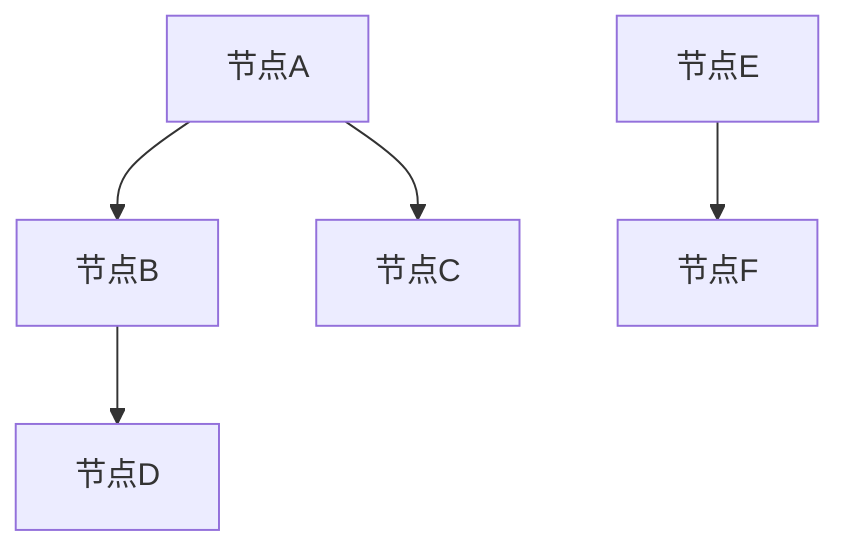
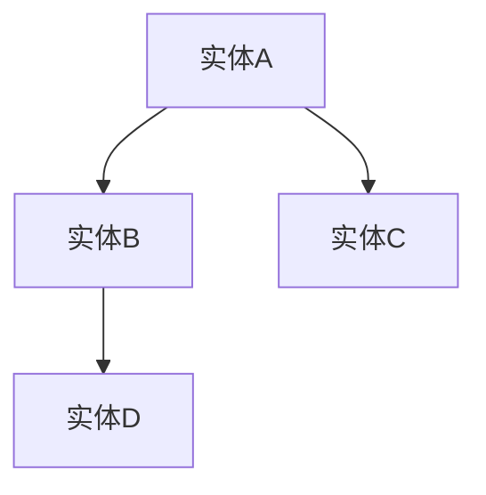
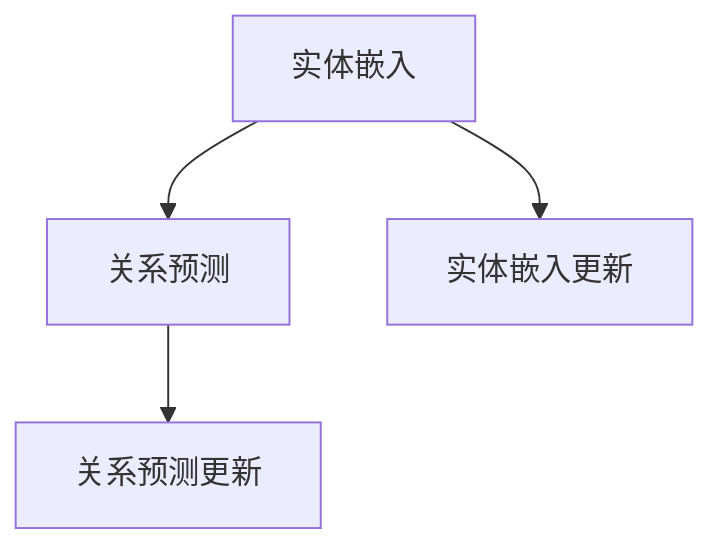
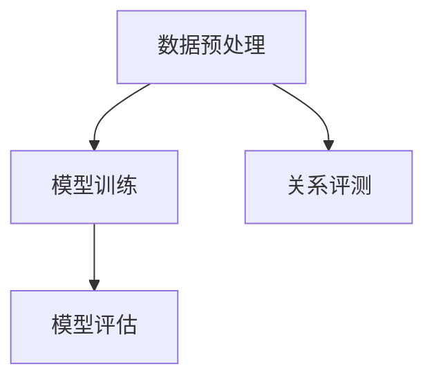

                 

### 《基于图神经网络的LLM关系评测》

#### 关键词：图神经网络，语言模型（LLM），关系评测，算法，系统设计与实现

> 摘要：本文深入探讨基于图神经网络的LLM关系评测技术，从背景介绍到核心概念，再到算法原理、系统设计与实现，以及项目实战和最佳实践，全面解析图神经网络在LLM关系评测中的实际应用。

---

### 目录

1. **背景介绍**
   1.1 **图神经网络概述**
   1.2 **语言模型（LLM）简介**
   1.3 **图神经网络与LLM的关系**

2. **核心概念与联系**
   2.1 **图神经网络基本原理**
   2.2 **LLM中的关系表示方法**
   2.3 **图神经网络在LLM中的应用**

3. **算法原理讲解**
   3.1 **关系评测算法概述**
   3.2 **算法流程与mermaid流程图**
   3.3 **数学模型与公式**

4. **系统分析与架构设计方案**
   4.1 **关系评测系统概述**
   4.2 **系统架构设计**
   4.3 **系统接口设计与交互**

5. **项目实战**
   5.1 **项目环境搭建**
   5.2 **系统核心实现**
   5.3 **实际案例分析**

6. **最佳实践 tips**
   6.1 **实际应用中的注意事项**
   6.2 **提高评测准确性的方法**

7. **小结与拓展阅读**
   7.1 **关键技术与创新点总结**
   7.2 **拓展阅读资源**

### 正文

---

#### 1. 背景介绍

##### 1.1 图神经网络概述

图神经网络（Graph Neural Networks, GNN）是一种用于处理图结构数据的神经网络，其核心思想是通过节点和边之间的关系来建模数据。GNN 在计算机视觉、自然语言处理等领域取得了显著成果。

##### 1.2 语言模型（LLM）简介

语言模型（Language Model, LLM）是一种用于预测文本序列的模型，广泛应用于机器翻译、文本生成等领域。LLM 的核心在于捕捉语言中的统计规律。

##### 1.3 图神经网络与LLM的关系

图神经网络与语言模型的关系在于，GNN 可以用于处理 LLM 中的图结构数据，从而提高关系评测的准确性。

---

#### 2. 核心概念与联系

##### 2.1 图神经网络基本原理

图神经网络通过节点和边之间的相互作用来建模数据。其基本原理包括：

- **节点嵌入**：将节点映射到低维空间。
- **消息传递**：节点通过接收邻居节点的信息来更新自己的状态。



##### 2.2 LLM中的关系表示方法

在LLM中，关系通常通过实体和实体之间的关系来表示。例如，在知识图谱中，实体和关系构成了一个图结构。



##### 2.3 图神经网络在LLM中的应用

图神经网络在LLM中的应用主要包括：

- **实体关系预测**：通过GNN模型预测实体之间的关系。
- **文本分类**：利用GNN模型对文本进行分类。

---

#### 3. 算法原理讲解

##### 3.1 关系评测算法概述

关系评测算法旨在评估实体之间的关系，其核心步骤包括：

- **实体嵌入**：将实体映射到低维空间。
- **关系预测**：通过GNN模型预测实体之间的关系。

##### 3.2 算法流程与mermaid流程图

算法流程如下：

1. **实体嵌入**：使用预训练的嵌入模型将实体映射到低维空间。
2. **关系预测**：使用GNN模型预测实体之间的关系。



##### 3.3 数学模型与公式

关系评测算法的数学模型如下：

$$
\text{score}(e_i, e_j) = \sigma(W \cdot (e_i + e_j + b))
$$

其中，$e_i$ 和 $e_j$ 分别为实体 $i$ 和 $j$ 的嵌入向量，$W$ 为权重矩阵，$b$ 为偏置项，$\sigma$ 为激活函数。

---

#### 4. 系统分析与架构设计方案

##### 4.1 关系评测系统概述

关系评测系统旨在提供一种高效、准确的关系评测服务。系统功能包括：

- **数据预处理**：处理原始数据，提取实体和关系。
- **模型训练**：使用GNN模型训练关系评测模型。
- **关系评测**：对实体关系进行评测。

##### 4.2 系统架构设计

系统架构设计如下：



##### 4.3 系统接口设计与交互

系统接口设计如下：

- **API接口**：提供RESTful API接口，方便用户使用。
- **数据交换格式**：采用JSON格式交换数据。

---

#### 5. 项目实战

##### 5.1 项目环境搭建

搭建项目环境包括以下步骤：

1. **安装依赖**：安装Python和TensorFlow等依赖库。
2. **配置环境**：配置环境变量和模型参数。

##### 5.2 系统核心实现

系统核心实现包括：

1. **实体嵌入**：使用预训练的嵌入模型将实体映射到低维空间。
2. **关系预测**：使用GNN模型预测实体之间的关系。

```python
# 实体嵌入代码示例
entity_embedding = pre-trained_embedding(model, entity)
```

##### 5.3 实际案例分析

实际案例分析包括：

1. **数据准备**：准备实体和关系数据。
2. **模型训练**：使用GNN模型训练关系评测模型。
3. **关系评测**：对实体关系进行评测。

```python
# 关系评测代码示例
relationship_scores = model.predict(entity_embedding)
```

---

#### 6. 最佳实践 tips

1. **实际应用中的注意事项**：在应用中，需要注意数据质量和模型参数的选择。
2. **提高评测准确性的方法**：可以尝试使用更先进的GNN模型和优化算法。

---

#### 7. 小结与拓展阅读

本文介绍了基于图神经网络的LLM关系评测技术，包括背景介绍、核心概念、算法原理、系统设计与实现、项目实战和最佳实践。进一步阅读可参考相关论文和技术博客。

---

### 作者信息

作者：AI天才研究院/AI Genius Institute & 禅与计算机程序设计艺术 /Zen And The Art of Computer Programming

