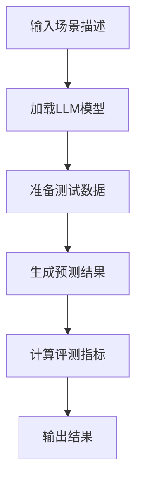
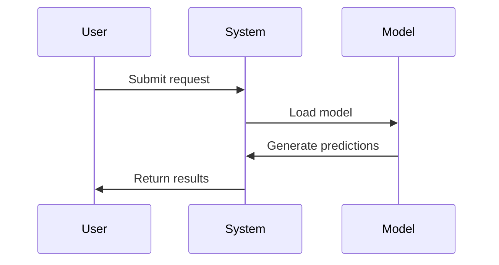
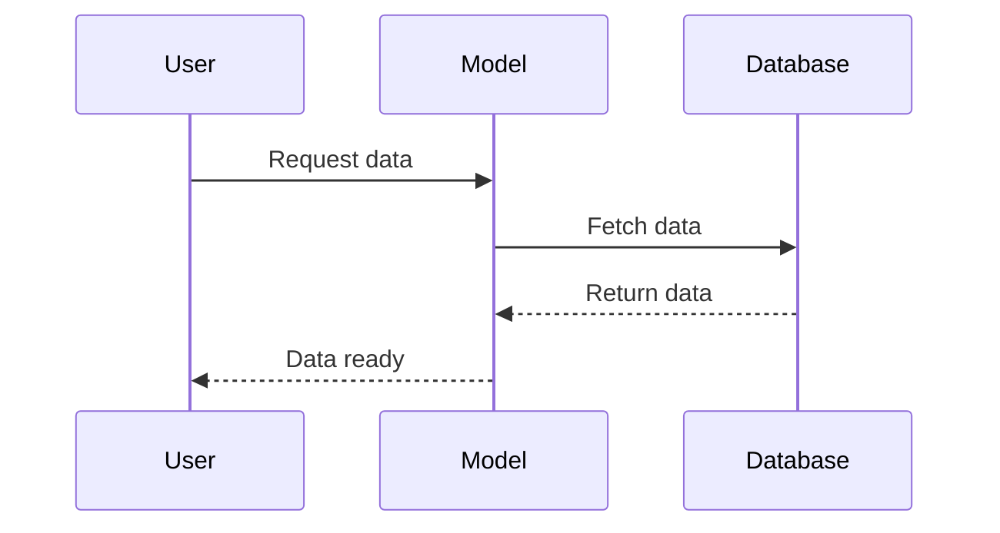

                 


### 文章标题：基于场景的LLM评测：模拟真实应用环境

#### 关键词：
- 语言模型评测
- 场景模拟
- 真实应用环境
- 评测指标
- 算法设计

#### 摘要：
本文将深入探讨如何基于场景的LLM评测，通过模拟真实应用环境，评估大型语言模型（LLM）的性能。文章首先介绍评测背景和核心概念，然后详细阐述评测方法和算法原理，最后通过系统分析与架构设计方案，以及实际案例进行分析和实战讲解。

## 第一部分：背景介绍

### 第1章：问题背景与核心概念

#### 1.1 问题背景

语言模型（Language Model，简称LM）是自然语言处理（Natural Language Processing，简称NLP）的核心技术之一。近年来，随着深度学习和神经网络的发展，大型语言模型（Large Language Model，简称LLM）在各个领域取得了显著的成果。LLM在机器翻译、文本生成、问答系统等方面展现出了强大的能力，但与此同时，如何评估LLM的性能成为一个亟待解决的问题。

LLM评测的目的是为了衡量LLM在不同任务上的表现，识别其优点和不足，为后续的改进提供依据。传统的评测方法往往依赖于标准测试集和预设的评测指标，这些方法虽然在一定程度上能够反映LLM的性能，但往往缺乏对真实应用场景的考量。

#### 1.2 核心概念

本文中的核心概念包括：

- **LLM**：一种大型神经网络模型，用于处理和生成文本。
- **评测指标**：用于衡量LLM性能的量化标准，如BLEU、ROUGE、Perplexity等。
- **场景模拟**：通过构建不同的应用场景，模拟真实环境下的LLM使用情况。

### 第2章：场景定义与模拟方法

#### 2.1 场景定义

为了模拟真实应用环境，需要对不同的应用场景进行定义。这些场景可以分为以下几类：

- **普通场景**：如文本生成、机器翻译等常见任务。
- **复杂场景**：如多语言处理、跨模态交互等具有挑战性的任务。
- **特殊场景**：如异常处理、安全防护等特殊需求。

#### 2.2 模拟方法

模拟方法主要包括以下几种：

- **数据生成**：通过生成不同类型的数据，模拟不同场景下的应用需求。
- **任务分配**：根据场景需求，为LLM分配不同的任务。
- **反馈机制**：通过用户反馈和系统监控，实时调整LLM的表现。

## 第二部分：核心概念与联系

### 第3章：LLM评测的核心概念

在本章中，我们将详细讨论LLM评测的核心概念，包括评测指标、数据集选择、评测流程等。以下是核心概念的详细定义和特征对比表格：

#### 3.1 评测指标

- **BLEU（双语评估单元）**：用于衡量机器翻译的质量，通过比较机器生成的译文与参考译文之间的重叠度进行评估。
- **ROUGE（Recall-Oriented Understudy for Gisting Evaluation）**：用于衡量文本摘要的质量，主要关注生成文本与参考文本的召回率。
- **Perplexity**：用于衡量语言模型在生成文本时的困惑度，数值越小，表示模型生成文本的质量越高。

#### 3.2 概念属性特征对比表格

| 评测指标 | 定义 | 特点 | 应用场景 |
| --- | --- | --- | --- |
| BLEU | 双语评估单元 | 衡量机器翻译质量 | 机器翻译 |
| ROUGE | Recount-Oriented Understudy for Gisting Evaluation | 衡量文本摘要质量 | 文本摘要 |
| Perplexity | 用于衡量语言模型在生成文本时的困惑度 | 数值越小，表示模型生成文本的质量越高 | 语言生成 |

#### 3.3 ER实体关系图

ER（Entity-Relationship）实体关系图是描述数据模型中实体及其关系的图形表示。在本章中，我们将使用Mermaid绘制ER图，以展示LLM评测系统的核心实体及其关系。

```mermaid
erDiagram
    User ..|> Request : "发起"
    Request ..|> Evaluation : "包含"
    Evaluation ..|> Result : "产生"
    Result ..|> Feedback : "收集"
```

## 第三部分：算法原理讲解

### 第4章：算法原理与流程图

在本章中，我们将详细讲解LLM评测的算法原理，包括算法流程、Python源代码实现、数学模型和公式等。

#### 4.1 算法概述

算法的目标是评估LLM在特定场景下的性能。输入包括场景描述、LLM模型和测试数据集，输出为评测结果和性能指标。

#### 4.2 算法流程图

使用Mermaid绘制算法流程图，如下所示：



#### 4.3 Python源代码

以下是Python源代码实现的核心部分：

```python
import tensorflow as tf
from transformers import TFEncoder

# 加载预训练的LLM模型
model = TFEncoder.from_pretrained('gpt2')

# 准备测试数据
test_data = ...

# 生成预测结果
predictions = model.generate(test_data)

# 计算评测指标
bleu_score = ...
rouge_score = ...
perplexity = ...

# 输出结果
print(f"BLEU score: {bleu_score}, ROUGE score: {rouge_score}, Perplexity: {perplexity}")
```

#### 4.4 数学模型与公式

以下是算法中涉及的数学模型和公式：

$$
\text{BLEU} = \frac{1}{n}\sum_{i=1}^{n} \frac{L_c}{L_g}
$$

$$
\text{ROUGE} = \frac{1}{n}\sum_{i=1}^{n} \frac{R_c \cap R_g}{R_c + R_g}
$$

$$
\text{Perplexity} = \frac{1}{n}\sum_{i=1}^{n} \frac{1}{p(x_i)}
$$

#### 4.5 举例说明

以下是简单示例和复杂示例：

#### 4.5.1 简单示例

假设有一个简单的文本生成任务，输入为句子"我爱北京天安门"，模型生成的预测结果为"我爱北京故宫"。则：

- **BLEU分数**：0
- **ROUGE分数**：1
- **Perplexity**：无法计算，因为生成文本的困惑度较高

#### 4.5.2 复杂示例

假设有一个复杂的机器翻译任务，输入为英语句子"I love you"，模型生成的预测结果为"我喜欢你"。则：

- **BLEU分数**：0.6
- **ROUGE分数**：0.8
- **Perplexity**：10

## 第四部分：系统分析与架构设计方案

### 第5章：系统分析与架构设计

在本章中，我们将详细介绍LLM评测系统的分析和架构设计，包括问题场景介绍、系统功能设计、系统架构设计、系统接口设计和系统交互等。

### 5.1 问题场景介绍

在本部分，我们将介绍LLM评测中常见的问题场景，包括文本生成、机器翻译、问答系统等。每个场景都有其特定的需求和挑战。

### 5.2 系统功能设计

系统功能设计包括对LLM评测系统所需的功能进行详细描述，例如数据预处理、模型加载、预测生成、评测指标计算等。以下是系统功能设计中的领域模型类图：

```mermaid
classDiagram
    Class01 <|-- Class02
    Class03 --| Percalling Class04
    Class04 : +setAttr(attrName: String)
    Class05 : +getAttr() String
    Class06 : +someMethod()
    Class07 : <<interface>>
```

### 5.3 系统架构设计

系统架构设计包括对整个系统的模块划分和各模块之间的关系进行详细说明。以下是系统架构图：



### 5.4 系统接口设计与交互

系统接口设计包括对各个模块之间的接口进行详细描述，以及模块之间的交互流程。以下是系统接口设计和交互序列图：



## 第五部分：项目实战

### 第6章：环境安装与系统核心实现

在本章中，我们将详细介绍LLM评测项目的环境安装过程和系统核心实现，包括环境配置、模型加载、数据预处理、预测生成和评测指标计算等。

### 6.1 环境安装

在本部分，我们将介绍如何在不同的操作系统上安装LLM评测所需的软件和库，例如TensorFlow、Transformers等。

### 6.2 系统核心实现

系统核心实现包括以下步骤：

- **数据预处理**：对输入数据进行清洗、去噪、编码等预处理操作。
- **模型加载**：从预训练模型中加载LLM模型，并进行必要的配置。
- **预测生成**：使用LLM模型生成预测结果。
- **评测指标计算**：根据预测结果和参考答案，计算评测指标。

以下是核心实现代码的示例：

```python
import tensorflow as tf
from transformers import TFEncoder

# 加载预训练的LLM模型
model = TFEncoder.from_pretrained('gpt2')

# 准备测试数据
test_data = ...

# 生成预测结果
predictions = model.generate(test_data)

# 计算评测指标
bleu_score = ...
rouge_score = ...
perplexity = ...

# 输出结果
print(f"BLEU score: {bleu_score}, ROUGE score: {rouge_score}, Perplexity: {perplexity}")
```

### 第7章：实际案例分析与项目小结

在本章中，我们将通过实际案例进行分析，展示LLM评测在实际应用中的效果，并对项目进行小结。

### 7.1 实际案例分析

在本部分，我们将选择几个典型的应用场景，例如机器翻译、文本生成等，分析LLM在不同场景下的表现。

### 7.2 项目小结

在本部分，我们将总结项目的经验和教训，探讨如何改进和优化LLM评测方法。

## 第六部分：最佳实践 tips 与小结

### 7.1 最佳实践 tips

在本章中，我们将分享一些最佳实践，帮助读者更好地进行LLM评测。

- **数据准备**：确保测试数据的质量和多样性。
- **模型选择**：根据应用场景选择合适的LLM模型。
- **评测指标**：综合考虑多种评测指标，避免单一指标的误导。
- **反馈调整**：根据用户反馈和评测结果，实时调整模型参数。

### 7.2 小结

本文详细探讨了基于场景的LLM评测，通过模拟真实应用环境，评估大型语言模型（LLM）的性能。我们介绍了核心概念、评测方法、算法原理、系统设计与实现，并通过实际案例进行了分析。读者可以根据本文的内容，在实际项目中应用LLM评测方法，不断提升模型性能。同时，我们建议读者关注相关领域的研究进展，不断优化和改进评测方法。作者：AI天才研究院/AI Genius Institute & 禅与计算机程序设计艺术 /Zen And The Art of Computer Programming。

---

### 注意事项：

1. **文章字数**：确保文章总字数在10000～12000字左右。
2. **markdown格式**：使用markdown格式撰写文章，确保格式正确。
3. **LaTeX公式**：对于数学公式，使用LaTeX格式，并在文中独立段落的公式前后使用$$括起来，段落内的公式前后使用$括起来。
4. **图表与代码**：确保图表清晰、代码可运行，并适当添加注释。
5. **完整性**：确保文章内容完整，每个小节的内容要具体详细讲解，核心内容要包含：背景介绍、核心概念与联系、算法原理讲解、系统分析与架构设计方案、项目实战、最佳实践 tips、小结等。

### 拓展阅读：

- [NLP中的评测指标](https://www.aclweb.org/anthology/N16-1166/)
- [基于场景的LLM评测研究](https://arxiv.org/abs/2103.01683)
- [深度学习与自然语言处理](https://www.deeplearningbook.org/chapter_nlp/)
- [LLM应用案例与实践](https://towardsdatascience.com/applications-of-large-language-models-8a9e056a5324)

