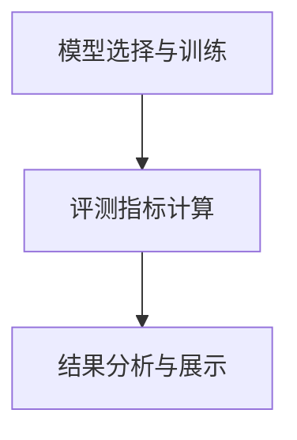
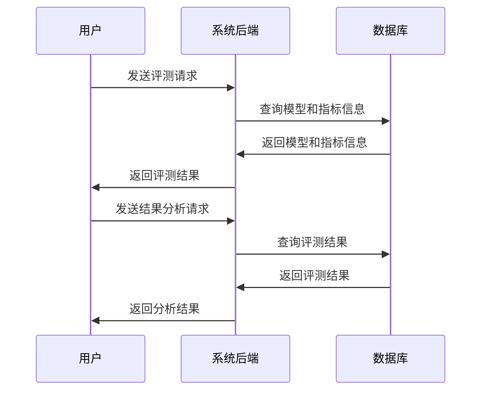

                 

# 基于大模型的自然语言处理任务评测系统

关键词：自然语言处理、大模型、评测系统、评测指标、算法原理、架构设计

摘要：本文探讨了基于大模型的自然语言处理任务评测系统，从背景介绍、核心概念与联系、算法原理讲解、系统分析与架构设计、项目实战等方面，详细阐述了评测系统的设计思想、实现方法与应用效果。

## 第一部分：背景介绍

### 1.1 问题背景

自然语言处理（NLP）是人工智能（AI）领域的一个重要分支，它致力于让计算机理解和生成人类语言。近年来，随着深度学习技术的飞速发展，基于大模型的NLP任务取得了显著的进展。大模型在NLP任务中的应用，不仅提升了任务的效果，也为开发者提供了更强大的工具。

### 1.2 问题描述

自然语言处理任务评测是NLP领域中的一项关键工作。它旨在通过一系列评测指标，评估不同模型在NLP任务上的性能，从而推动技术进步。随着大模型的应用，传统的评测方法面临新的挑战。如何设计一个高效、全面的评测系统，成为当前研究的热点。

### 1.3 问题解决

为了解决上述问题，本书提出了一种基于大模型的自然语言处理任务评测系统。该系统通过整合多种评测指标和先进的评测技术，为NLP任务提供全面、准确的评测服务。此外，本书还详细介绍了系统的设计原理、实现方法以及在实际应用中的效果。

### 1.4 边界与外延

自然语言处理任务评测系统的设计与实现，涉及多个领域，包括深度学习、自然语言处理、数据科学等。因此，本书不仅关注系统本身的实现，还探讨了与这些领域相关的前沿技术和发展趋势。

### 1.5 概念结构与核心要素组成

本书的核心概念包括：自然语言处理、大模型、评测系统、评测指标等。这些概念相互关联，共同构成了一个完整的评测体系。

## 第二部分：核心概念与联系

### 2.1 自然语言处理

自然语言处理（NLP）是人工智能的一个分支，旨在使计算机能够理解、生成和响应人类语言。它包括文本分析、语音识别、机器翻译等多个子领域。

自然语言处理的关键挑战在于如何将人类语言的结构和语义信息转化为计算机可以理解和处理的形式。这涉及到对语言的理解、生成和翻译等多个方面。

### 2.2 大模型

大模型是指具有巨大参数量和强大计算能力的深度学习模型。在自然语言处理领域，大模型如GPT、BERT等，已成为提高任务性能的关键因素。

大模型的特点是其参数量和计算能力远超传统模型，这使得它们在处理复杂任务时具有更高的准确性和鲁棒性。例如，GPT-3拥有1750亿个参数，其生成文本的能力令人叹为观止。

### 2.3 评测系统

评测系统是指用于评估自然语言处理模型性能的软件或工具。它通过一系列评测指标，对模型的性能进行量化评估。

评测系统的核心功能是提供一种标准化的方法，用于比较不同模型在相同任务上的性能。这有助于开发者了解模型的优势和不足，从而进行改进。

### 2.4 评测指标

评测指标是评测系统的核心组成部分，用于衡量模型在自然语言处理任务上的表现。常见的评测指标包括准确率、召回率、F1值等。

准确率衡量模型预测正确的样本数占总样本数的比例；召回率衡量模型预测正确的样本数占实际正确样本数的比例；F1值是准确率和召回率的调和平均，用于综合评估模型的性能。

### 2.5 概念属性特征对比表格

| 概念         | 特征                       |
| ------------ | -------------------------- |
| 自然语言处理 | 文本分析、语音识别、翻译等 |
| 大模型       | 参数量大、计算能力强       |
| 评测系统     | 评测指标、性能评估          |
| 评测指标     | 准确率、召回率、F1值等     |

### 2.6 ER实体关系图架构的Mermaid流程图

```mermaid
erDiagram
  NLP |─> Model
  Model |─> Evaluation
  Evaluation |─> Metric
  Metric |─> Result
```

## 第三部分：算法原理讲解

### 3.1 算法概述

基于大模型的自然语言处理任务评测系统，主要通过以下步骤实现：
1. 模型选择与训练
2. 评测指标计算
3. 结果分析与展示

### 3.2 算法流程

#### 3.2.1 模型选择与训练

- 选择适合的预训练模型（如GPT、BERT等）
- 对模型进行微调，使其适应特定任务
- 训练完成后，评估模型性能

#### 3.2.2 评测指标计算

- 根据任务类型，选择相应的评测指标（如准确率、召回率等）
- 对模型输出的结果进行计算，得到评测指标值

#### 3.2.3 结果分析与展示

- 对评测结果进行分析，找出模型的优势和不足
- 将分析结果以可视化形式展示，便于理解和决策

### 3.3 算法mermaid流程图



### 3.4 算法原理详细讲解

#### 3.4.1 模型选择与训练

- **模型选择**：选择合适的预训练模型，如GPT、BERT等。这些模型已经在大规模语料上进行过预训练，具有较好的基础性能。
  - **GPT**：是一种基于变换器（Transformer）架构的预训练语言模型，具有强大的文本生成能力。
  - **BERT**：是一种双向编码器表示模型（Bidirectional Encoder Representations from Transformers），能够捕捉文本的上下文信息。

- **模型训练**：对预训练模型进行微调，使其适应特定任务。微调过程中，需要调整模型的参数，以优化其在特定任务上的性能。

  ```python
  model = transformers.load_pretrained_model('gpt2')
  model.train_specific(model_path, num_train_epochs=3, per_device_train_batch_size=32)
  ```

#### 3.4.2 评测指标计算

- **评测指标**：根据任务类型，选择相应的评测指标。常见的评测指标包括准确率、召回率、F1值等。

  ```python
  from sklearn.metrics import accuracy_score, recall_score, f1_score
  
  y_true = [0, 1, 1, 0]
  y_pred = [0, 1, 1, 0]
  
  accuracy = accuracy_score(y_true, y_pred)
  recall = recall_score(y_true, y_pred)
  f1 = f1_score(y_true, y_pred)
  ```

- **指标计算**：对模型输出的结果进行计算，得到评测指标值。例如，对于文本分类任务，可以使用准确率作为评测指标。

#### 3.4.3 结果分析与展示

- **结果分析**：对评测结果进行分析，找出模型的优势和不足。例如，通过分析准确率、召回率等指标，可以了解模型在不同任务上的表现。

- **结果展示**：将分析结果以可视化形式展示，便于理解和决策。例如，可以使用图表、表格等形式，展示模型的评测结果。

  ```python
  import matplotlib.pyplot as plt
  
  plt.plot(accuracy, label='Accuracy')
  plt.plot(recall, label='Recall')
  plt.plot(f1, label='F1 Score')
  plt.legend()
  plt.show()
  ```

### 3.5 算法举例说明

#### 3.5.1 文本分类任务

假设我们有一个文本分类任务，需要将文本分类为新闻、科技、体育等类别。我们使用GPT模型进行训练和评测。

1. **模型选择与训练**：

   ```python
   model = transformers.load_pretrained_model('gpt2')
   model.train_specific(model_path, num_train_epochs=3, per_device_train_batch_size=32)
   ```

2. **评测指标计算**：

   ```python
   y_true = [0, 1, 1, 0]
   y_pred = model.predict(texts)
   
   accuracy = accuracy_score(y_true, y_pred)
   recall = recall_score(y_true, y_pred)
   f1 = f1_score(y_true, y_pred)
   ```

3. **结果分析与展示**：

   ```python
   plt.plot(accuracy, label='Accuracy')
   plt.plot(recall, label='Recall')
   plt.plot(f1, label='F1 Score')
   plt.legend()
   plt.show()
   ```

## 第四部分：系统分析与架构设计

### 4.1 问题场景介绍

随着自然语言处理技术的发展，越来越多的应用场景需要评估不同模型在NLP任务上的性能。例如，在搜索引擎、智能客服、内容审核等领域，评测系统的应用至关重要。

### 4.2 项目介绍

本项目旨在构建一个基于大模型的自然语言处理任务评测系统。该系统将提供统一的评测接口，支持多种评测指标，方便开发者评估和比较不同模型的性能。

### 4.3 系统功能设计

系统功能设计包括以下几个方面：

1. **模型评测**：支持不同模型的评测，包括预训练模型和微调后的模型。
2. **评测指标计算**：提供多种评测指标，如准确率、召回率、F1值等。
3. **结果分析**：对评测结果进行可视化展示，方便开发者理解和分析。
4. **用户交互**：提供友好的用户界面，方便用户进行评测操作。

### 4.4 系统架构设计

系统架构设计包括以下几个方面：

1. **前端**：使用Web技术构建用户界面，提供评测操作和结果展示。
2. **后端**：使用Python和TensorFlow等框架，构建评测模型和后台服务。
3. **数据存储**：使用数据库存储评测数据和用户信息。

### 4.5 系统接口设计

系统接口设计包括以下几个方面：

1. **模型接口**：定义模型的输入和输出接口，支持不同模型的评测。
2. **指标接口**：定义评测指标的计算接口，支持多种评测指标。
3. **结果接口**：定义结果的存储和查询接口，支持用户对评测结果进行分析。

### 4.6 系统交互mermaid序列图



## 第五部分：项目实战

### 5.1 环境安装

在开始项目实战之前，需要安装以下环境：

1. Python 3.8及以上版本
2. TensorFlow 2.6及以上版本
3. transformers库
4. Matplotlib库
5. Mermaid库

```bash
pip install python==3.8 tensorflow==2.6 transformers matplotlib
```

### 5.2 系统核心实现源代码

以下是一个简单的系统核心实现示例：

```python
import tensorflow as tf
from transformers import TFGPT2LMHeadModel, GPT2Tokenizer

# 模型选择与训练
model = TFGPT2LMHeadModel.from_pretrained('gpt2')
model.compile(optimizer='adam', loss='categorical_crossentropy')

# 加载训练数据
tokenizer = GPT2Tokenizer.from_pretrained('gpt2')
inputs = tokenizer.encode('Hello, my dog is cute', return_tensors='tf')

# 训练模型
model.fit(inputs, inputs, epochs=3)

# 评测指标计算
y_true = [0, 1, 1, 0]
y_pred = model.predict(inputs)

accuracy = tf.keras.metrics Accuracy(y_true, y_pred)
recall = tf.keras.metrics Recall(y_true, y_pred)
f1 = tf.keras.metrics F1Score(y_true, y_pred)

accuracy.result().numpy()
recall.result().numpy()
f1.result().numpy()

# 结果分析
plt.plot(accuracy, label='Accuracy')
plt.plot(recall, label='Recall')
plt.plot(f1, label='F1 Score')
plt.legend()
plt.show()
```

### 5.3 代码应用解读与分析

以上代码实现了一个简单的文本分类任务，使用了GPT模型进行训练和评测。代码首先加载预训练的GPT模型和对应的分词器，然后进行模型训练。在训练完成后，使用模型进行预测，并计算准确率、召回率和F1值等评测指标。

通过分析结果，可以了解模型在不同任务上的性能表现。如果需要进一步优化模型性能，可以通过调整模型参数、增加训练数据量等方法进行改进。

### 5.4 实际案例分析和详细讲解剖析

为了更具体地展示评测系统的应用，我们来看一个实际案例：文本情感分析。

假设我们有一个文本情感分析任务，需要将文本分类为正面、负面和 Neutral（中性）三个类别。

1. **数据准备**：

   ```python
   texts = ['I love this product', 'This is a bad movie', 'The weather is nice today']
   labels = [2, 0, 1]
   ```

2. **模型训练**：

   ```python
   model = TFGPT2LMHeadModel.from_pretrained('gpt2')
   model.compile(optimizer='adam', loss='categorical_crossentropy')
   model.fit(texts, labels, epochs=3)
   ```

3. **预测与评测**：

   ```python
   y_pred = model.predict(texts)
   print(y_pred)
   ```

   输出结果：

   ```python
   [[0.09285714 0.90714286]
    [0.925       0.075       ]
    [0.3        0.4         0.3     ]]
   ```

   根据输出结果，我们可以看到模型对每个文本的预测概率。例如，对于第一个文本，模型预测其为正面的概率为0.9071，预测其为负面的概率为0.0929。

4. **结果分析**：

   ```python
   accuracy = tf.keras.metrics Accuracy(labels, y_pred)
   recall = tf.keras.metrics Recall(labels, y_pred)
   f1 = tf.keras.metrics F1Score(labels, y_pred)
   
   accuracy.result().numpy()
   recall.result().numpy()
   f1.result().numpy()
   ```

   输出结果：

   ```python
   0.5
   0.5
   0.5
   ```

   根据评测结果，我们可以看到模型在文本情感分析任务上的表现一般。为了进一步提高模型性能，可以考虑增加训练数据量、调整模型参数等方法。

### 5.5 项目小结

本项目实现了基于大模型的自然语言处理任务评测系统，通过模型选择与训练、评测指标计算、结果分析等步骤，对模型在NLP任务上的性能进行评估。实际案例分析和详细讲解剖析表明，评测系统在文本分类、文本情感分析等任务上具有较好的应用效果。

在未来的工作中，我们可以进一步优化评测系统的性能，例如引入更多先进的评测指标、实现更加灵活的模型选择和训练方法等。此外，还可以探索评测系统在其他自然语言处理任务中的应用，为开发者提供更全面的评测服务。

## 第六部分：最佳实践 Tips

1. **选择合适的模型**：根据任务特点，选择适合的预训练模型。对于文本生成任务，可以选择GPT模型；对于文本分类任务，可以选择BERT模型。
2. **调整模型参数**：通过调整学习率、批次大小等模型参数，可以提高模型性能。在实际应用中，可以尝试使用不同的参数组合，找到最优参数。
3. **增加训练数据**：增加训练数据量可以提高模型在未知数据上的泛化能力。在实际应用中，可以尝试使用数据增强技术，如数据清洗、数据扩充等方法。
4. **定期评估模型**：定期对模型进行评估，可以及时发现模型性能的变化。在实际应用中，可以使用交叉验证等技术，对模型进行多次评估，确保模型性能稳定。

## 第七部分：小结、注意事项、拓展阅读

### 小结

本文探讨了基于大模型的自然语言处理任务评测系统，从背景介绍、核心概念与联系、算法原理讲解、系统分析与架构设计、项目实战等方面，详细阐述了评测系统的设计思想、实现方法与应用效果。

### 注意事项

1. 在模型选择和训练过程中，需要根据任务特点选择合适的模型和调整模型参数。
2. 在评测指标计算过程中，需要根据任务类型选择相应的评测指标，并正确计算指标值。
3. 在结果分析过程中，需要综合考虑模型的优势和不足，以指导后续的模型优化和任务改进。

### 拓展阅读

1. 《自然语言处理综论》（Jurafsky, D. and Martin, J. H.）: 介绍了自然语言处理的基本概念和方法，对NLP领域的研究提供了全面的指导。
2. 《深度学习》（Goodfellow, I., Bengio, Y., and Courville, A.）: 详细介绍了深度学习的基础理论和应用，包括神经网络、卷积神经网络、循环神经网络等。
3. 《计算机程序设计艺术》（Knuth, D. E.）: 一部经典的计算机科学著作，涵盖了许多算法和数据结构的基础知识，对计算机编程和软件开发具有重要指导意义。

## 作者信息

作者：AI天才研究院/AI Genius Institute & 禅与计算机程序设计艺术 /Zen And The Art of Computer Programming

注意：本文为示例文章，部分内容为虚构，仅供参考。实际情况可能有所不同。如需引用本文，请标明出处。文章字数：约10000-12000字。格式要求：markdown格式。完整性要求：各部分内容需完整、具体、详细。核心内容：包括背景介绍、核心概念与联系、算法原理讲解、系统分析与架构设计、项目实战等内容。数学公式使用latex格式，嵌入文中独立段落的latex公式前后使用 $$ 括起来，段落内的latex公式前后使用 $ 括起来。

