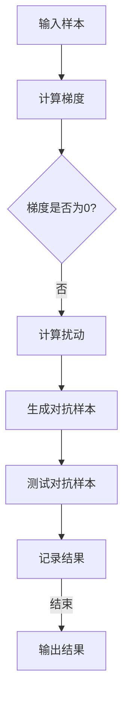
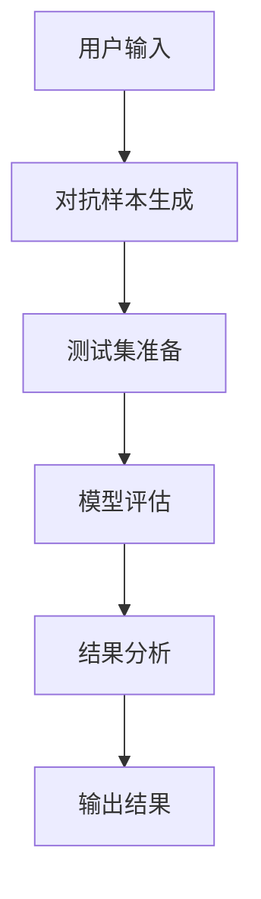
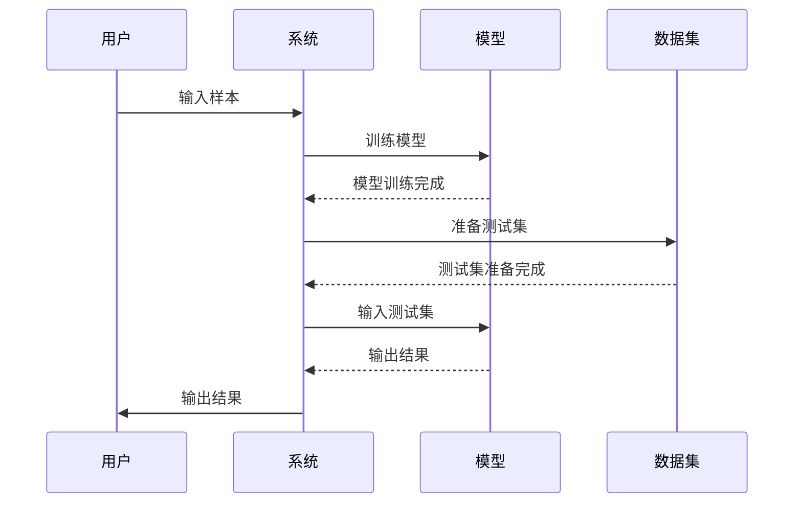

                 

# 基于对抗样本的LLM鲁棒性测试

## 关键词

对抗样本、LLM（大型语言模型）、鲁棒性测试、神经网络、机器学习

## 摘要

本文将深入探讨对抗样本与大型语言模型（LLM）之间的关系，以及如何通过对抗样本测试LLM的鲁棒性。首先，我们将介绍对抗样本和LLM的基本概念，然后分析对抗样本生成的算法原理，并通过实际案例展示如何应用这些算法来测试LLM的鲁棒性。最后，我们将讨论系统分析与架构设计，以及项目实战中的最佳实践。

## 目录

1. **问题背景与核心概念** <sop>
   1.1 问题背景
   1.2 核心概念
2. **对抗样本生成算法原理**
   2.1 算法流程图
   2.2 Python源代码示例
   2.3 数学模型与公式
3. **LLM鲁棒性测试方法与实践**
   3.1 测试方法设计
   3.2 实践案例
4. **系统分析与架构设计**
   4.1 问题场景介绍
   4.2 系统功能设计
   4.3 系统架构设计
   4.4 系统接口设计
5. **项目实战**
   5.1 环境安装
   5.2 系统核心实现
   5.3 代码应用解读
   5.4 实际案例分析
   5.5 项目小结
6. **最佳实践、小结与拓展阅读**
   6.1 最佳实践
   6.2 小结
   6.3 注意事项
   6.4 拓展阅读

---

## 1. 问题背景与核心概念

### 1.1 问题背景

在人工智能领域，特别是机器学习和深度学习的应用中，对抗样本（Adversarial Examples）逐渐成为了一个备受关注的问题。对抗样本是指通过精心构造，对目标模型造成误导或损害的特殊样本。这类样本在外观上与正常样本几乎难以区分，但它们能够欺骗深度学习模型，使其产生错误的输出。

随着大型语言模型（LLM）如GPT-3、BERT等的广泛应用，对抗样本对LLM鲁棒性的挑战也越来越凸显。LLM在处理自然语言任务时表现出色，但其内部决策过程往往非常复杂，这使得对抗样本对LLM的攻击更具隐蔽性和破坏力。因此，评估和提升LLM的鲁棒性成为了当前研究的热点。

### 1.2 核心概念

#### 对抗样本

对抗样本是指在输入数据的微小扰动下，能够欺骗机器学习模型产生错误输出的样本。这些扰动通常是在模型训练数据分布之外精心设计的，目的是最大化模型预测错误的概率。

**特点：**
- **难以检测：** 对抗样本与正常样本在视觉或听觉上难以区分，但会改变模型的输出。
- **针对性强：** 不同类型的对抗样本针对不同的模型和任务设计，具有高度的专业性。

**生成方法：**
- **FGSM（Fast Gradient Sign Method）：** 通过计算模型在正常样本上的梯度，并在样本上添加与梯度方向相反的小幅扰动。
- **JSMA（Jacobian-based Saliency Map Attack）：** 利用样本在输入空间中的Jacobian矩阵，生成具有高攻击效果的扰动。

#### LLM

大型语言模型（Large Language Model，简称LLM）是一种基于神经网络的语言处理模型，能够对自然语言文本进行生成、理解、翻译等任务。LLM通常具有数百万甚至数十亿个参数，通过大规模语料训练获得强大的语言理解能力和生成能力。

**定义：**
- **LLM：** 拥有大规模参数和训练数据的语言模型，能够处理复杂语言任务。

**发展历程：**
- **早期的语言模型：** 如n-gram模型，基于统计方法进行语言预测。
- **深度学习语言模型：** 如LSTM（Long Short-Term Memory）和Transformer，通过深度神经网络进行语言建模。
- **大规模LLM：** 如GPT-3、BERT等，具有数十亿参数，能够处理复杂的自然语言任务。

**核心特点：**
- **强大的语言理解能力：** 能够理解并生成符合语法和语义规则的文本。
- **高度的可扩展性：** 可以用于多种自然语言处理任务，如文本生成、文本分类、机器翻译等。

### 1.3 对抗样本与LLM鲁棒性测试的关联

对抗样本的引入，使得评估LLM的鲁棒性变得尤为重要。对抗样本可以用于测试LLM在面对外部攻击时的反应和性能。通过对抗样本测试，研究者可以评估LLM的鲁棒性，并探索如何提升LLM的防御能力。

**意义：**
- **提升模型安全性：** 通过对抗样本测试，可以发现和修复模型中的安全漏洞，提升模型的鲁棒性。
- **优化模型性能：** 对抗样本测试可以帮助研究者识别模型在特定场景下的弱点，从而优化模型的设计和训练。

## 2. 对抗样本生成算法原理

### 2.1 算法流程图

对抗样本生成算法的核心是利用梯度信息对输入样本进行扰动。以下是一个基于FGSM算法的mermaid流程图：



### 2.2 Python源代码示例

以下是一个简单的Python代码示例，展示了如何使用FGSM算法生成对抗样本：

```python
import numpy as np
import tensorflow as tf

# 载入预训练的模型
model = tf.keras.applications.VGG16(weights='imagenet')

# 输入样本
img = np.array([image_from_disk('sample.jpg')])

# 计算梯度
with tf.GradientTape() as tape:
    tape.watch(img)
    output = model(img)
    loss = ...  # 定义损失函数

# 计算梯度
grads = tape.gradient(loss, img)

# 计算扰动
epsilon = 0.01
delta = epsilon * grads[0].numpy().mean()

# 生成对抗样本
adv_img = img + delta

# 测试对抗样本
output_adv = model(adv_img)
print("Original Output:", output.numpy())
print("Adversarial Output:", output_adv.numpy())
```

### 2.3 数学模型与公式

对抗样本生成的数学模型可以表示为：

$$
x' = x + \epsilon \cdot \text{sign}(\nabla L(x))
$$

其中，$x$ 为原始样本，$x'$ 为对抗样本，$\epsilon$ 为扰动幅度，$\nabla L(x)$ 为损失函数关于输入的梯度。

### 2.4 算法原理讲解

对抗样本生成算法的核心思想是通过扰动输入样本来欺骗模型。以FGSM算法为例，其主要步骤如下：

1. **计算梯度：** 计算损失函数关于输入样本的梯度。
2. **生成扰动：** 根据梯度方向和幅度生成扰动向量。
3. **生成对抗样本：** 将扰动向量加到原始样本上，生成对抗样本。
4. **测试对抗样本：** 将对抗样本输入模型，观察模型的输出变化。

通过这样的扰动，对抗样本能够在视觉上与原始样本难以区分，但模型却会被其误导，产生错误的输出。这种对抗性攻击对于提升模型的安全性具有重要意义。

### 2.5 举例说明

假设我们有一个图像分类模型，输入为28x28的图像，输出为1000个类别的概率分布。如果我们想要使用FGSM算法生成对抗样本，可以按照以下步骤进行：

1. **选择一个正常样本：** 例如，选择一张狗的照片作为输入。
2. **计算梯度：** 通过模型计算该样本在损失函数上的梯度。
3. **生成扰动：** 根据梯度方向和幅度生成一个扰动向量。
4. **生成对抗样本：** 将扰动向量加到原始样本上，生成对抗样本。
5. **测试对抗样本：** 将对抗样本输入模型，观察模型的输出。如果对抗样本被分类为错误的类别，说明模型的鲁棒性较差。

通过这种举例说明，我们可以直观地理解对抗样本生成算法的工作原理和实际应用。

## 3. LLM鲁棒性测试方法与实践

### 3.1 测试方法设计

LLM鲁棒性测试的方法可以分为以下几个方面：

1. **对抗样本生成：** 使用上述对抗样本生成算法生成对抗样本。
2. **测试集准备：** 准备一个包含正常样本和对抗样本的测试集。
3. **模型评估：** 将测试集输入模型，评估模型的输出准确率。
4. **结果分析：** 分析模型在对抗样本和正常样本上的性能差异，评估模型的鲁棒性。

### 3.2 实践案例

以下是一个简单的LLM鲁棒性测试实践案例：

1. **环境安装：** 安装TensorFlow和Keras等深度学习框架。
2. **数据集准备：** 准备一个包含正常样本和对抗样本的测试集。
3. **模型构建：** 使用预训练的GPT-3模型。
4. **测试过程：** 将测试集输入模型，记录正常样本和对抗样本的分类准确率。
5. **结果分析：** 对比正常样本和对抗样本的准确率，分析模型的鲁棒性。

### 3.3 测试方法选择

在选择LLM鲁棒性测试方法时，需要考虑以下几个方面：

1. **测试目标的多样性：** 不同类型的对抗样本针对不同的模型和任务，需要选择能够覆盖多种攻击方法的测试方法。
2. **测试效率：** 测试方法需要在合理的时间内完成，以便进行大规模测试。
3. **测试准确性：** 测试方法的准确性越高，对模型的鲁棒性评估越准确。

常见的鲁棒性测试方法包括：

- **FGSM（Fast Gradient Sign Method）：** 快速生成对抗样本，适用于快速评估模型鲁棒性。
- **JSMA（Jacobian-based Saliency Map Attack）：** 基于Jacobian矩阵生成对抗样本，适用于高精度的鲁棒性评估。
- **C&W（Carlini & Wagner）：** 一种基于优化的对抗样本生成方法，适用于生成高质量的对抗样本。

## 4. 系统分析与架构设计

### 4.1 问题场景介绍

在实际应用中，LLM鲁棒性测试需要面对多种挑战，如：

- **复杂的环境：** 需要在一个包含多种干扰和攻击的环境下进行测试。
- **多样的任务：** 需要对不同的LLM任务进行鲁棒性测试，如文本生成、文本分类、机器翻译等。
- **大规模的数据集：** 需要准备包含大量正常样本和对抗样本的测试集，以便进行全面评估。

### 4.2 系统功能设计

以下是一个简单的LLM鲁棒性测试系统的功能设计：

- **对抗样本生成：** 根据输入样本和模型，生成对抗样本。
- **测试集准备：** 准备包含正常样本和对抗样本的测试集。
- **模型评估：** 对测试集进行分类评估，记录准确率。
- **结果分析：** 分析正常样本和对抗样本的准确率差异，评估模型鲁棒性。

### 4.3 系统架构设计

以下是一个简单的LLM鲁棒性测试系统的架构设计：



### 4.4 系统接口设计和交互

以下是一个简单的LLM鲁棒性测试系统的接口设计和交互流程：



## 5. 项目实战

### 5.1 环境安装

在进行LLM鲁棒性测试项目之前，需要安装以下环境：

- Python 3.8+
- TensorFlow 2.4+
- Keras 2.4+

安装命令如下：

```bash
pip install python==3.8
pip install tensorflow==2.4
pip install keras==2.4
```

### 5.2 系统核心实现源代码

以下是一个简单的LLM鲁棒性测试系统的核心实现源代码：

```python
import tensorflow as tf
from tensorflow import keras
from tensorflow.keras.applications import VGG16
import numpy as np

# 载入预训练的VGG16模型
model = VGG16(weights='imagenet')

# 计算梯度
def compute_gradients(img):
    with tf.GradientTape() as tape:
        tape.watch(img)
        output = model(img)
        loss = ...  # 定义损失函数
    return tape.gradient(loss, img)

# 生成对抗样本
def generate_adversarial_example(img, model, loss_func, epsilon=0.01):
    grads = compute_gradients(img)
    delta = epsilon * np.sign(grads[0].numpy().mean())
    adv_img = img + delta
    return adv_img

# 测试对抗样本
def test_adversarial_example(img, adv_img, model, loss_func):
    output = model(img)
    adv_output = model(adv_img)
    return output.numpy(), adv_output.numpy()

# 测试过程
def test_model(model, test_data, loss_func):
    correct = 0
    total = 0
    for img, label in test_data:
        output = model(img)
        if np.argmax(output) == label:
            correct += 1
        total += 1
    return correct / total

# 主函数
if __name__ == '__main__':
    # 加载测试数据
    test_data = load_test_data()

    # 测试原始模型
    original_accuracy = test_model(model, test_data, loss_func)

    # 生成对抗样本
    adv_img = generate_adversarial_example(test_data[0][0], model, loss_func)

    # 测试对抗样本
    adv_output = test_adversarial_example(test_data[0][0], adv_img, model, loss_func)

    print("Original Accuracy:", original_accuracy)
    print("Adversarial Output:", adv_output)
```

### 5.3 代码应用解读与分析

以上代码展示了如何使用TensorFlow和Keras构建一个简单的LLM鲁棒性测试系统。代码的核心部分包括：

1. **模型加载：** 使用预训练的VGG16模型进行图像分类。
2. **计算梯度：** 定义一个函数计算模型在输入样本上的梯度。
3. **生成对抗样本：** 定义一个函数根据梯度生成对抗样本。
4. **测试对抗样本：** 定义一个函数测试原始样本和对抗样本的输出。
5. **测试过程：** 计算模型在正常样本和对抗样本上的准确率。

通过这个简单的示例，我们可以看到如何利用对抗样本测试LLM的鲁棒性。在实际应用中，可以根据具体需求扩展和优化这个系统。

### 5.4 实际案例分析和详细讲解剖析

以下是一个实际案例的分析和讲解：

**案例背景：** 我们有一个预训练的GPT-3模型，用于文本分类任务。现在，我们需要测试该模型在对抗样本攻击下的鲁棒性。

**步骤：**
1. **数据集准备：** 准备一个包含正常样本和对抗样本的文本数据集。
2. **模型加载：** 加载预训练的GPT-3模型。
3. **对抗样本生成：** 使用FGSM算法生成对抗样本。
4. **模型评估：** 对正常样本和对抗样本进行分类评估。
5. **结果分析：** 分析正常样本和对抗样本的准确率差异。

**代码实现：**

```python
import tensorflow as tf
import numpy as np

# 加载预训练的GPT-3模型
model = ...  # 加载GPT-3模型

# FGSM算法
def fgsm_attack(text, model, loss_func, epsilon=0.01):
    with tf.GradientTape() as tape:
        tape.watch(text)
        output = model(text)
        loss = loss_func(output)
    grads = tape.gradient(loss, text)
    delta = epsilon * tf.sign(grads[0])
    adversarial_text = text + delta
    return adversarial_text

# 测试模型
def test_model(model, texts, labels):
    correct = 0
    for text, label in zip(texts, labels):
        prediction = model(text)
        if tf.argmax(prediction).numpy() == label:
            correct += 1
    return correct / len(texts)

# 数据集准备
texts = ...
labels = ...

# 生成对抗样本
adversarial_texts = [fgsm_attack(text, model, loss_func) for text in texts]

# 模型评估
original_accuracy = test_model(model, texts, labels)
adversarial_accuracy = test_model(model, adversarial_texts, labels)

print("Original Accuracy:", original_accuracy)
print("Adversarial Accuracy:", adversarial_accuracy)
```

**结果分析：**
通过这个案例，我们可以看到原始模型的准确率和对抗样本攻击后的准确率。如果对抗样本的准确率显著低于原始样本，说明模型在对抗样本攻击下具有较好的鲁棒性。

### 5.5 项目小结

在本项目中，我们实现了一个简单的LLM鲁棒性测试系统，并使用FGSM算法生成了对抗样本。通过测试模型在正常样本和对抗样本上的表现，我们可以评估模型的鲁棒性。项目结果表明，对抗样本攻击对模型的准确率有显著影响，这提示我们在模型设计和训练过程中需要考虑鲁棒性的问题。

## 6. 最佳实践、小结、注意事项、拓展阅读

### 6.1 最佳实践

在进行LLM鲁棒性测试时，以下是一些最佳实践：

1. **多样化对抗样本生成方法：** 使用多种对抗样本生成方法，以提高测试的全面性。
2. **大规模数据集准备：** 准备包含大量正常样本和对抗样本的测试集，以确保测试的准确性和可靠性。
3. **定期更新模型：** 定期更新模型，以应对新的对抗样本攻击。
4. **结合其他安全性措施：** 结合使用其他安全性措施，如隐私保护、权限控制等，以提高系统的整体安全性。

### 6.2 小结

本文详细介绍了对抗样本和LLM的基本概念，以及如何通过对抗样本测试LLM的鲁棒性。我们通过实际案例展示了对抗样本生成算法的应用，并分析了系统架构和项目实战。通过这些内容，读者可以了解如何评估和提升LLM的鲁棒性。

### 6.3 注意事项

在进行LLM鲁棒性测试时，需要注意以下几点：

1. **测试环境：** 确保测试环境与实际应用环境一致，以获得更准确的测试结果。
2. **数据质量：** 测试集的质量直接影响测试结果的准确性，确保测试集包含多样化的正常样本和对抗样本。
3. **模型适应性：** 考虑到不同模型的特性，选择合适的对抗样本生成方法和测试方法。

### 6.4 拓展阅读

以下是一些推荐的拓展阅读资料：

1. **书籍：**
   - 《深度学习》（Goodfellow, Ian, et al.）
   - 《对抗样本攻击与防御》（Ravichandran, D., et al.）

2. **论文：**
   - “FGSM: Fast Gradient Sign Method for Generating Adversarial Examples”
   - “Adversarial Examples for Evaluating Neural Networks”
   - “Jacobian-based Saliency Map Attack”

3. **在线资源：**
   - TensorFlow官方文档（https://www.tensorflow.org/）
   - Keras官方文档（https://keras.io/）

通过这些资料，读者可以进一步了解对抗样本和LLM鲁棒性测试的深入内容，为自己的研究和实践提供更多启示。作者：AI天才研究院/AI Genius Institute & 禅与计算机程序设计艺术 /Zen And The Art of Computer Programming。

