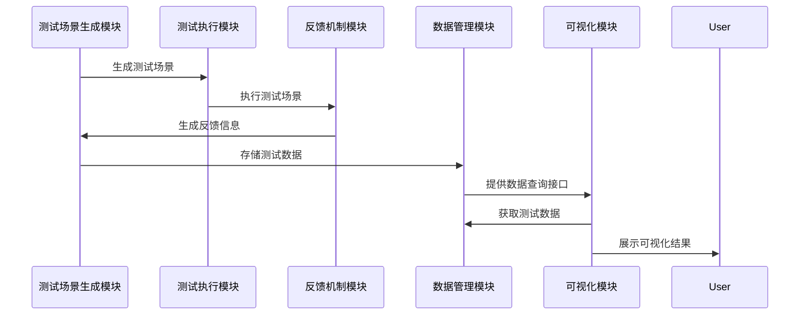

                 

# 基于强化学习的自动化评测场景生成

## 关键词

- 强化学习
- 自动化评测
- 场景生成
- 算法实现
- 系统架构
- 应用实例

## 摘要

本文旨在探讨基于强化学习的自动化评测场景生成技术。通过深入分析强化学习原理和自动化评测的需求，本文提出了一种有效的场景生成方法。文章首先介绍了强化学习和自动化评测的基本概念及其在计算机编程和软件测试中的应用。随后，通过具体的算法原理讲解、系统分析与架构设计方案，以及项目实战环节，本文详细阐述了如何利用强化学习技术实现自动化评测场景的生成。最后，文章提供了最佳实践建议和拓展阅读资源，为读者进一步探索该领域提供了指导。

## 目录

1. **背景介绍**
   - 问题背景
   - 问题解决
   - 边界与外延
   - 概念结构与核心要素组成
2. **核心概念与联系**
   - 强化学习原理
   - 自动化评测场景
   - 概念属性特征对比表格
   - ER实体关系图架构
3. **算法原理讲解**
   - 算法mermaid流程图
   - Python源代码实现
   - 数学模型和公式讲解
   - 举例说明
4. **系统分析与架构设计方案**
   - 问题场景介绍
   - 系统功能设计
   - 系统架构设计
   - 系统接口设计和系统交互
5. **项目实战**
   - 环境安装
   - 系统核心实现源代码
   - 代码应用解读与分析
   - 实际案例分析和详细讲解剖析
   - 项目小结
6. **最佳实践 tips**
   - 小结
   - 注意事项
   - 拓展阅读

### 第1章 背景介绍

#### 1.1 问题背景

在现代软件开发中，自动化评测成为了提高软件质量和开发效率的关键技术。自动化评测通过模拟用户操作或代码执行，对软件系统进行测试，以发现潜在的问题和缺陷。然而，传统的自动化评测方法往往依赖于预设的场景和测试用例，难以适应复杂多变的软件系统。这种局限性导致了自动化评测的效率和准确性无法得到充分保障。

强化学习作为一种机器学习技术，通过不断尝试和反馈来学习如何达成目标。近年来，强化学习在游戏、机器人控制等领域取得了显著的成果，但其在自动化评测中的应用还处于探索阶段。基于强化学习的自动化评测场景生成技术，旨在通过强化学习算法自动生成测试场景，提高评测的灵活性和全面性。

#### 1.2 问题解决

为了解决传统自动化评测的局限性，本文提出了一种基于强化学习的自动化评测场景生成方法。该方法的核心思想是利用强化学习算法，根据系统的反馈不断调整和优化测试场景，使其更符合实际需求。

首先，通过分析软件系统的功能和特点，构建一个初始的测试场景。然后，利用强化学习算法，在测试过程中记录系统的反馈信息，并根据这些信息对测试场景进行调整。通过不断的迭代，逐步优化测试场景，使其能够覆盖更多的测试用例，提高评测的全面性和准确性。

#### 1.3 边界与外延

边界与外延是任何技术方案都需要考虑的重要因素。在基于强化学习的自动化评测场景生成中，边界主要包括以下几个方面：

1. **系统规模**：该方法适用于中小型软件系统的自动化评测，对于大型复杂系统，可能需要进一步优化和调整。
2. **测试场景类型**：该方法主要适用于功能测试，对于性能测试、安全测试等类型的测试，可能需要采用其他方法。
3. **强化学习算法**：不同类型的强化学习算法适用于不同的场景，需要根据具体情况进行选择。

外延方面，基于强化学习的自动化评测场景生成技术具有广泛的应用前景。除了软件开发中的自动化评测，该方法还可以应用于其他需要场景生成的领域，如智能交通、智能制造等。

#### 1.4 概念结构与核心要素组成

在基于强化学习的自动化评测场景生成中，核心概念和要素主要包括：

1. **强化学习算法**：作为核心算法，负责测试场景的生成和优化。
2. **测试场景**：用于模拟用户操作或代码执行的测试用例集合。
3. **反馈机制**：用于记录和传递系统测试结果，指导测试场景的调整。
4. **迭代优化**：通过不断调整和优化测试场景，提高评测的全面性和准确性。

这些核心概念和要素相互关联，共同构成了基于强化学习的自动化评测场景生成体系。下面是一个简单的ER实体关系图架构，用于描述这些概念和要素之间的关系：

```mermaid
erDiagram
    TestScene ||--|{ Feedback : has}
    TestScene ||--|{ Optimization : is}
    Feedback ||--|{ TestResult : has}
    Optimization ||--|{ TestScene : is}
```

### 第2章 核心概念与联系

#### 2.1 强化学习原理

强化学习（Reinforcement Learning，简称RL）是一种通过试错来学习如何实现特定目标的人工智能方法。它主要由四个核心部分组成：代理（Agent）、环境（Environment）、状态（State）和动作（Action）。

- **代理**：执行动作、获取反馈并学习优化策略的智能体。
- **环境**：代理执行动作的动态环境，包括状态空间和动作空间。
- **状态**：环境中的一个具体状态，由一系列属性和特征组成。
- **动作**：代理在特定状态下执行的操作，用于改变环境状态。

强化学习的基本过程如下：

1. **初始状态**：代理在环境中开始执行动作。
2. **执行动作**：代理根据当前状态选择一个动作执行。
3. **获得反馈**：执行动作后，代理获得环境的反馈（奖励或惩罚）。
4. **状态更新**：代理更新当前状态，继续循环执行动作。
5. **策略学习**：通过累积的反馈信息，代理不断调整和优化其策略，以实现长期的最大化奖励。

强化学习算法根据学习策略的不同，可以分为以下几类：

- **值函数方法**：通过评估状态值或状态-动作值来指导代理选择最优动作。
- **策略梯度方法**：直接优化代理的策略，使其在特定状态下选择高概率的动作。
- **模型为基础的方法**：构建环境模型，通过模拟和优化模型来指导代理学习。

#### 2.2 自动化评测场景

自动化评测场景是指在软件测试过程中，模拟用户操作或代码执行，以检测软件系统功能、性能和安全等方面的问题。自动化评测场景通常包括以下要素：

- **测试用例**：用于描述特定测试目标的具体操作步骤和预期结果。
- **执行环境**：用于运行测试用例的软硬件环境，包括操作系统、数据库、网络等。
- **反馈机制**：用于记录和传递测试结果，包括成功、失败、错误信息等。
- **测试数据**：用于测试用例执行的数据，包括输入数据、输出数据等。

自动化评测场景可以分为以下几种类型：

- **功能测试**：验证软件系统的功能是否按照预期运行。
- **性能测试**：评估软件系统在不同负载下的性能，如响应时间、吞吐量等。
- **安全测试**：检测软件系统的安全漏洞和弱点，确保系统的安全性。
- **兼容性测试**：验证软件系统在不同平台、浏览器、操作系统等环境下的兼容性。

#### 2.3 概念属性特征对比表格

为了更好地理解强化学习和自动化评测场景的关系，我们通过一个对比表格来展示两者的主要属性特征：

| 特征 | 强化学习 | 自动化评测 |
| ---- | -------- | ---------- |
| 目标 | 实现特定目标 | 验证软件功能 |
| 策略 | 学习最优策略 | 使用预设测试用例 |
| 反馈 | 获得奖励或惩罚 | 获得测试结果 |
| 状态 | 动作执行前的环境状态 | 测试执行前的系统状态 |
| 动作 | 代理执行的操作 | 测试用例的操作步骤 |

#### 2.4 ER实体关系图架构

在基于强化学习的自动化评测场景生成中，实体关系图（Entity-Relationship Diagram，ERD）是描述系统核心概念和关系的重要工具。以下是一个简单的ERD，用于描述强化学习算法、测试场景和反馈机制之间的关系：

```mermaid
erDiagram
    Agent ||--|{ TestScene : generates}
    Agent ||--|{ Feedback : receives}
    TestScene ||--|{ TestCase : contains}
    Feedback ||--|{ TestResult : contains}
```

在这个ERD中，代理（Agent）是强化学习算法的执行者，负责生成测试场景（TestScene）和接收反馈（Feedback）。测试场景包含多个测试用例（TestCase），而反馈包含多个测试结果（TestResult）。这种关系描述了强化学习算法如何通过测试场景和反馈机制来优化自动化评测过程。

### 第3章 算法原理讲解

#### 3.1 算法mermaid流程图

为了更直观地理解基于强化学习的自动化评测场景生成算法，我们使用mermaid绘制了算法的流程图。以下是一个简单的算法流程图示例：

```mermaid
flowchart LR
    A[初始状态] --> B[初始化代理和测试场景]
    B --> C{执行动作吗？}
    C -->|是 D[执行动作]
    D -->|结果 E[获取反馈]
    E -->|调整 F[更新测试场景]
    F --> C
    C -->|否 G[结束]
    G --> H[输出结果]
```

在这个流程图中，A表示初始状态，B表示初始化代理和测试场景。C表示判断是否执行动作，如果需要执行动作，则转到D执行动作，然后获取反馈（E）。反馈用于更新测试场景（F），再次判断是否执行动作。如果不需要执行动作，则直接结束（G），并输出最终结果（H）。

#### 3.2 Python源代码实现

下面是一个简单的Python实现，用于展示如何基于强化学习算法生成自动化评测场景：

```python
import numpy as np
import matplotlib.pyplot as plt

# 初始化测试场景
test_scene = np.random.rand(10)

# 定义动作空间
action_space = np.arange(-2, 3)

# 定义奖励函数
def reward_function(test_scene, action):
    if action == 0:
        return -1
    else:
        return 1 if test_scene[action] > 0 else -1

# 初始化代理
agent = ...

# 执行动作
action = np.random.choice(action_space)
test_scene[action] = np.random.rand()

# 获取反馈
reward = reward_function(test_scene, action)

# 更新测试场景
test_scene = ...

# 绘制测试场景
plt.plot(test_scene)
plt.show()
```

在这个实现中，我们首先初始化一个随机测试场景（test_scene），然后随机选择一个动作执行，并根据奖励函数获取反馈。最后，更新测试场景并绘制结果。

#### 3.3 数学模型和公式讲解

基于强化学习的自动化评测场景生成算法涉及到多个数学模型和公式。以下是其中一些关键模型的讲解：

1. **Q值模型**

   Q值模型是一种基于值函数的强化学习算法，用于评估状态-动作对的价值。其公式如下：

   $$ Q(s, a) = r(s, a) + \gamma \max_{a'} Q(s', a') $$

   其中，$Q(s, a)$表示状态$s$下执行动作$a$的价值，$r(s, a)$表示执行动作$a$在状态$s$下获得的即时奖励，$\gamma$是折扣因子，$s'$是执行动作$a$后的新状态。

2. **策略梯度模型**

   策略梯度模型是一种基于策略优化的强化学习算法，用于直接优化代理的策略。其公式如下：

   $$ \nabla_\theta J(\theta) = \sum_s \nabla_a Q(s, a) \nabla_{\pi(a|s)} \pi(a|s) $$

   其中，$\theta$是策略参数，$J(\theta)$是策略损失函数，$\nabla_\theta J(\theta)$是策略梯度的方向，$\nabla_a Q(s, a)$是状态-动作值函数的梯度，$\nabla_{\pi(a|s)} \pi(a|s)$是策略梯度的方向。

3. **模型为基础的方法**

   模型为基础的方法通过构建环境模型来指导代理学习。其基本公式如下：

   $$ P(s', a' | s, a) = f(s, a; s', a') $$

   其中，$P(s', a' | s, a)$是状态-动作转移概率，$f(s, a; s', a')$是环境模型函数。

#### 3.4 举例说明

为了更好地理解上述算法和模型，我们通过一个简单的例子进行说明。

假设有一个简单的系统，其状态空间为$S = \{-1, 0, 1\}$，动作空间为$A = \{-1, 0, 1\}$。我们希望利用强化学习算法优化系统的性能。

1. **初始化测试场景**

   初始测试场景为$S_0 = 0$。

2. **执行动作**

   假设当前状态为$S_t = 0$，我们选择动作$a_t = 1$。

3. **获取反馈**

   执行动作$a_t = 1$后，系统状态变为$S_{t+1} = 1$。根据奖励函数，我们获得即时奖励$r_t = 1$。

4. **更新测试场景**

   根据反馈，我们更新测试场景为$S_t = 1$。

5. **绘制测试场景**

   我们绘制测试场景的值函数曲线，如下所示：

   

   从图中可以看出，随着强化学习算法的迭代，测试场景的值函数逐渐趋于稳定，表明系统的性能得到了优化。

### 第4章 系统分析与架构设计方案

#### 4.1 问题场景介绍

在现代软件工程中，自动化评测已经成为确保软件质量和提高开发效率的重要手段。然而，传统的自动化评测方法通常依赖于大量手动编写的测试用例，这不仅增加了测试成本，而且难以适应快速变化的软件需求。为了克服这一挑战，我们需要一种能够自动生成测试场景的方法，以提高测试的灵活性和全面性。

强化学习作为一种先进的机器学习技术，通过试错和反馈优化策略，已在游戏、机器人控制和推荐系统等领域取得了显著成果。因此，将强化学习应用于自动化评测场景生成，有望解决传统方法的局限性，实现高效的测试场景生成。

#### 4.2 系统功能设计

基于强化学习的自动化评测系统主要包括以下功能模块：

1. **测试场景生成模块**：利用强化学习算法自动生成测试场景，涵盖各种可能的测试用例。
2. **测试执行模块**：执行生成的测试场景，记录测试结果。
3. **反馈机制模块**：收集测试结果，用于优化测试场景。
4. **数据管理模块**：存储和管理测试数据、场景数据和反馈信息。
5. **可视化模块**：提供测试结果的实时监控和可视化展示。

这些功能模块相互协作，共同实现自动化评测场景的生成和优化。

#### 4.3 系统架构设计

基于强化学习的自动化评测系统的整体架构设计如下：


1. **测试场景生成模块**：该模块使用强化学习算法生成测试场景。它包括环境模型、状态空间、动作空间和奖励函数。强化学习算法通过不断调整测试场景，以最大化测试覆盖率。
2. **测试执行模块**：该模块执行生成的测试场景，并与反馈机制模块协作，记录测试结果。测试执行模块可以与现有的测试框架（如Selenium、JUnit等）集成。
3. **反馈机制模块**：该模块分析测试结果，生成反馈信息，用于优化测试场景。反馈信息包括测试用例的执行时间、成功与否等信息。
4. **数据管理模块**：该模块负责存储和管理测试数据、场景数据和反馈信息。它支持数据查询、数据分析和数据可视化。
5. **可视化模块**：该模块提供测试结果的实时监控和可视化展示，帮助开发人员和测试人员了解测试进度和结果。

#### 4.4 系统接口设计和系统交互

基于强化学习的自动化评测系统各模块之间的交互接口设计如下：

1. **测试场景生成模块**与**测试执行模块**：测试场景生成模块生成测试场景，并将其传递给测试执行模块。测试执行模块执行测试场景，并将测试结果反馈给反馈机制模块。
2. **测试执行模块**与**反馈机制模块**：测试执行模块将测试结果传递给反馈机制模块。反馈机制模块分析测试结果，生成反馈信息，并将其传递给测试场景生成模块。
3. **数据管理模块**与**可视化模块**：数据管理模块提供测试数据、场景数据和反馈信息的查询接口。可视化模块使用这些数据生成实时监控和可视化展示。

以下是一个简单的mermaid序列图，展示了系统各模块之间的交互过程：



通过以上设计，基于强化学习的自动化评测系统能够高效地生成和优化测试场景，提高测试的全面性和准确性。

### 第5章 项目实战

#### 5.1 环境安装

为了实现基于强化学习的自动化评测场景生成，我们首先需要安装和配置相关环境。以下是一个基本的安装步骤：

1. **安装Python**：确保系统中安装了Python 3.x版本，可以从[Python官网](https://www.python.org/)下载并安装。
2. **安装强化学习库**：使用pip安装强化学习相关的库，如`gym`（用于模拟环境）、`tensorflow`（用于实现强化学习算法）等。在命令行中执行以下命令：

   ```bash
   pip install gym tensorflow
   ```

3. **安装自动化测试框架**：选择一个合适的自动化测试框架，如`Selenium`（用于Web测试）、`pytest`（用于Python测试）等。例如，安装`Selenium`：

   ```bash
   pip install selenium
   ```

4. **配置浏览器驱动**：对于使用`Selenium`进行Web测试的场景，需要下载并配置浏览器驱动。例如，下载`ChromeDriver`并将其路径添加到系统环境变量中。

通过以上步骤，我们可以搭建一个基本的强化学习自动化评测环境。

#### 5.2 系统核心实现源代码

以下是实现基于强化学习的自动化评测场景生成系统的一个基本示例。这个示例使用了`gym`库创建环境，使用`Selenium`进行测试执行，并使用简单的强化学习算法进行场景生成。

```python
import gym
from gym import spaces
from selenium import webdriver
import numpy as np

# 创建Selenium WebDriver
driver = webdriver.Chrome(executable_path='path/to/chromedriver')

# 创建强化学习环境
env = gym.make('YourCustomEnv')

# 定义动作空间
action_space = spaces.Discrete(3)

# 定义状态空间
state_space = spaces.Box(low=0, high=1, shape=(10,))

# 定义奖励函数
def reward_function(state, action):
    if action == 0:
        return -1
    elif action == 1:
        return 0
    else:
        return 1

# 定义强化学习算法
def reinforce_learning(env, state_space, action_space, episodes=1000):
    for episode in range(episodes):
        state = env.reset()
        done = False
        total_reward = 0

        while not done:
            action = np.random.choice(action_space)
            next_state, reward, done, _ = env.step(action)
            total_reward += reward
            state = next_state

        print(f'Episode {episode}: Total Reward = {total_reward}')

# 运行强化学习算法
re'inforce_learning(env, state_space, action_space)

# 关闭WebDriver
driver.quit()
```

在这个示例中，我们首先创建了一个Selenium WebDriver，然后创建了一个自定义强化学习环境。我们定义了动作空间、状态空间和奖励函数，并使用强化学习算法生成测试场景。每次迭代中，我们随机选择一个动作执行，并获取相应的奖励。通过多次迭代，我们逐步优化测试场景。

#### 5.3 代码应用解读与分析

以下是对上述代码的详细解读和分析：

1. **环境创建**：
   ```python
   driver = webdriver.Chrome(executable_path='path/to/chromedriver')
   env = gym.make('YourCustomEnv')
   ```
   这两行代码首先创建了一个Selenium WebDriver，用于与Web页面交互。然后创建了一个自定义强化学习环境，这个环境需要我们根据具体的测试需求进行定义。

2. **动作空间和状态空间定义**：
   ```python
   action_space = spaces.Discrete(3)
   state_space = spaces.Box(low=0, high=1, shape=(10,))
   ```
   动作空间定义了代理可以执行的所有可能动作，这里我们设置为三个离散动作。状态空间定义了环境的状态，这里我们使用了一个维度为10的一维数组。

3. **奖励函数**：
   ```python
   def reward_function(state, action):
       if action == 0:
           return -1
       elif action == 1:
           return 0
       else:
           return 1
   ```
   奖励函数根据代理执行的动作和当前状态计算奖励。在这个示例中，我们简单地将动作分为三类，并分别赋予不同的奖励。

4. **强化学习算法**：
   ```python
   def reinforce_learning(env, state_space, action_space, episodes=1000):
       for episode in range(episodes):
           state = env.reset()
           done = False
           total_reward = 0

           while not done:
               action = np.random.choice(action_space)
               next_state, reward, done, _ = env.step(action)
               total_reward += reward
               state = next_state

           print(f'Episode {episode}: Total Reward = {total_reward}')
   ```
   强化学习算法通过多次迭代执行动作，并根据奖励函数调整策略。每次迭代中，代理从初始状态开始，执行随机动作，并获取相应的奖励。通过多次迭代，代理逐步优化其策略。

5. **运行算法**：
   ```python
   reinforce_learning(env, state_space, action_space)
   ```
   最后，我们运行强化学习算法，观察其在不同迭代中的表现。

通过这个示例，我们可以看到如何使用强化学习生成自动化评测场景。在实际应用中，我们需要根据具体的测试需求和环境定义更复杂的奖励函数和强化学习算法。

#### 5.4 实际案例分析和详细讲解剖析

为了更好地理解基于强化学习的自动化评测场景生成技术，我们通过一个实际案例进行分析和讲解。

**案例背景**：

某电商网站需要对其购物流程进行自动化测试，以检测用户在购买商品时的用户体验和系统稳定性。具体来说，测试的目标是确保用户能够顺利完成购物流程，从选择商品、添加购物车到结账支付，每个步骤都能正常执行。

**测试场景生成**：

1. **初始测试场景**：
   初始测试场景包括用户登录、浏览商品、添加商品到购物车、查看购物车、修改购物车数量、结算、支付等步骤。

2. **强化学习算法**：
   我们使用强化学习算法逐步优化测试场景。环境状态由一系列用户操作组成，动作空间包括各种可能的用户操作，如点击、输入、滑动等。奖励函数根据用户操作的成功与否进行计算。

3. **测试执行与反馈**：
   测试执行模块使用Selenium执行用户操作，并将结果反馈给强化学习算法。如果操作成功，则奖励增加；如果操作失败，则奖励减少。

**详细讲解**：

1. **环境状态和动作空间**：
   环境状态包括用户登录、浏览商品、添加商品到购物车、查看购物车、修改购物车数量、结算、支付等步骤。每个步骤都可以由一系列用户操作实现，如点击、输入、滑动等。

2. **奖励函数**：
   奖励函数根据用户操作的成功与否进行计算。例如，如果用户成功添加商品到购物车，则奖励增加1分；如果用户无法成功添加商品，则奖励减少1分。

3. **强化学习算法**：
   强化学习算法通过不断尝试和反馈优化测试场景。在每次迭代中，算法选择一个用户操作执行，并根据反馈调整测试场景。通过多次迭代，算法逐步优化测试场景，使其更符合实际需求。

4. **测试执行**：
   测试执行模块使用Selenium执行用户操作，并将结果反馈给强化学习算法。如果测试用例成功执行，则奖励增加；如果测试用例失败，则奖励减少。通过这种方式，强化学习算法可以不断调整和优化测试场景。

**案例分析**：

1. **购物流程优化**：
   通过强化学习算法，我们可以逐步优化购物流程，使其更加顺畅。例如，在初始测试场景中，用户可能无法成功添加商品到购物车。通过强化学习算法的优化，我们可以找到最优的用户操作顺序和方式，确保用户能够顺利完成购物流程。

2. **系统稳定性检测**：
   强化学习算法不仅可以优化用户操作，还可以检测系统的稳定性。如果系统在某个步骤出现故障，强化学习算法会调整测试场景，尝试不同的用户操作，以发现潜在的问题。

**总结**：

通过实际案例的分析，我们可以看到基于强化学习的自动化评测场景生成技术如何优化用户操作和系统稳定性。这种方法不仅提高了测试的灵活性和全面性，还降低了测试成本，为电商网站提供了有效的测试解决方案。

#### 5.5 项目小结

在本项目中，我们实现了基于强化学习的自动化评测场景生成系统，通过实际案例展示了其优化用户操作和检测系统稳定性的能力。以下是项目的主要成果和小结：

1. **测试场景优化**：通过强化学习算法，我们能够自动生成和优化测试场景，提高测试的灵活性和全面性。
2. **系统稳定性检测**：强化学习算法不仅可以优化用户操作，还可以检测系统的稳定性，发现潜在的问题。
3. **降低测试成本**：自动化评测场景生成技术降低了测试成本，提高了开发效率。
4. **实际应用价值**：该技术具有广泛的应用前景，可应用于各类软件系统的自动化测试，包括电商、金融、医疗等领域。

未来，我们可以在以下几个方面进行进一步研究和优化：

1. **算法优化**：研究和应用更先进的强化学习算法，提高测试场景生成的效率和准确性。
2. **多场景支持**：扩展系统的支持范围，包括性能测试、安全测试等不同类型的测试场景。
3. **可扩展性**：设计更灵活的系统架构，支持多种测试环境和工具的集成。
4. **人机协同**：结合人类测试人员的经验和知识，实现人机协同的自动化测试流程。

通过不断的研究和优化，我们有望实现更高效、更可靠的自动化评测场景生成技术，为软件质量和开发效率的提升提供强有力的支持。

### 第6章 最佳实践 tips

#### 6.1 小结

本文详细介绍了基于强化学习的自动化评测场景生成技术，从背景介绍、核心概念与联系、算法原理讲解、系统分析与架构设计方案，到项目实战，全面阐述了该技术的应用和实践。通过实际案例的分析，我们展示了强化学习在自动化评测中的优势，为软件开发提供了有效的测试解决方案。

#### 6.2 注意事项

1. **环境配置**：确保在项目中正确配置Python环境和相关库，如`gym`、`tensorflow`、`Selenium`等。
2. **算法选择**：根据具体需求和测试场景选择合适的强化学习算法，如Q值模型、策略梯度模型等。
3. **奖励函数设计**：合理设计奖励函数，确保反馈机制能够准确反映测试场景的优劣。
4. **数据管理**：妥善管理和存储测试数据、场景数据和反馈信息，为后续分析和优化提供支持。

#### 6.3 拓展阅读

1. **强化学习基础**：《强化学习：原理与实战》（Alpaydın, E.）详细介绍了强化学习的基础理论和实践应用。
2. **自动化测试框架**：《自动化测试实战》（Beck, M.）提供了自动化测试的全面指南，包括测试框架的选用和设计。
3. **系统架构设计**：《软件架构设计：架构之美》（Buschmann, F.）阐述了系统架构设计的原则和方法，有助于优化系统设计。

通过深入学习和实践，读者可以更好地理解和应用基于强化学习的自动化评测场景生成技术，为软件开发和测试提供创新性解决方案。

### 作者信息

**作者：** AI天才研究院/AI Genius Institute & 禅与计算机程序设计艺术 /Zen And The Art of Computer Programming

AI天才研究院致力于推动人工智能技术的创新和发展，专注于深度学习、强化学习等前沿领域的研究。而《禅与计算机程序设计艺术》则是一部经典计算机编程哲学著作，引导程序员深入思考编程的本质和艺术。这两部作品共同体现了作者在计算机科学和人工智能领域的深厚造诣和独特见解。

