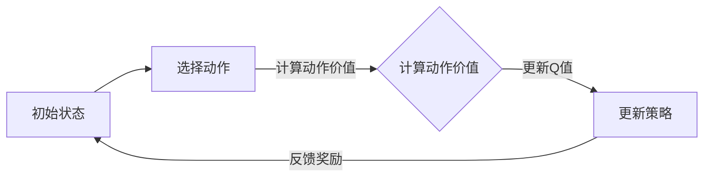
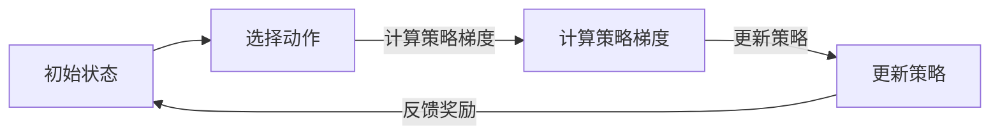
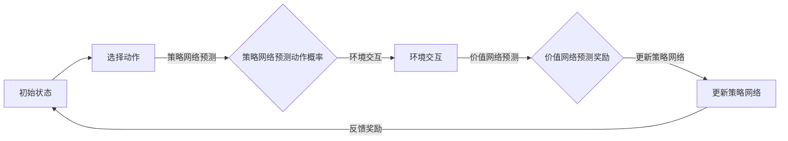
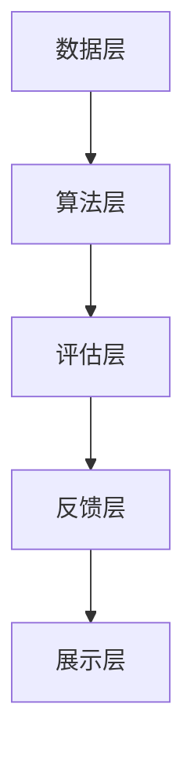
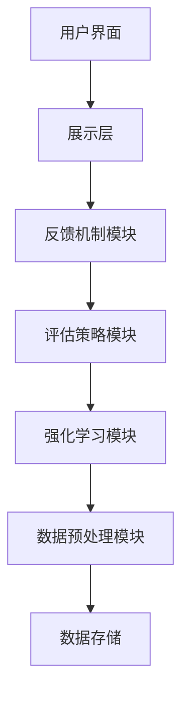

                 

# 基于强化学习的评测策略优化

## 关键词：强化学习、评测策略、优化、算法、实践

> 摘要：本文从强化学习的基本概念入手，详细阐述了其在评测策略优化中的应用。通过分析强化学习算法的原理和不同实现方式，本文探讨了如何将强化学习应用于实际评测策略优化问题。同时，结合实际案例，展示了强化学习在评测策略优化中的效果和挑战，为相关领域的研究和应用提供了有价值的参考。

## 目录大纲设计思路

### 结构布局

本文的结构布局分为四个主要部分：背景介绍、核心概念与联系、算法原理讲解和系统分析与架构设计方案。

### 目录大纲设计步骤

1. **确定书名和主题**：本文主题为“基于强化学习的评测策略优化”，主要针对评测策略优化问题，探讨强化学习在其中的应用。

2. **初步大纲设计**：根据主题，初步确定了四个主要部分，并为其分配了具体的内容。

3. **细化大纲**：对每个部分进行了详细的划分，确保每个章节都有明确的内容和目的。

4. **优化大纲**：审查大纲，调整章节顺序和内容，确保整体结构合理。

5. **撰写样本章节**：选取了“背景介绍”和“核心概念与联系”两个章节，按照设计的大纲撰写具体内容，以验证大纲的可行性。

6. **最终确定**：根据样本章节的撰写情况，调整和完善大纲，确保符合书籍的整体结构和内容要求。

### 目录大纲

```markdown
# 基于强化学习的评测策略优化

## 关键词：强化学习、评测策略、优化、算法、实践

> 摘要：本文从强化学习的基本概念入手，详细阐述了其在评测策略优化中的应用。通过分析强化学习算法的原理和不同实现方式，本文探讨了如何将强化学习应用于实际评测策略优化问题。同时，结合实际案例，展示了强化学习在评测策略优化中的效果和挑战，为相关领域的研究和应用提供了有价值的参考。

## 第一部分: 背景介绍

### 1.1 问题背景与定义

- 评测策略优化的背景
- 评测策略优化的问题定义

### 1.2 强化学习的基本概念

- 强化学习的定义
- 强化学习的关键要素

### 1.3 强化学习在评测策略优化中的应用

- 强化学习在评测策略优化中的挑战
- 强化学习在评测策略优化中的应用场景

### 1.4 评测策略优化中的强化学习应用

- 强化学习算法的选择
- 强化学习算法的应用方法

## 第二部分: 核心概念与联系

### 2.1 强化学习的基本概念

- 强化学习的基本概念
- 强化学习的关键要素

### 2.2 强化学习算法分类

- 强化学习算法的分类
- 不同算法的特点和应用场景

### 2.3 Q-学习算法详解

- Q-学习算法的基本原理
- Q-学习算法的应用方法

### 2.4 策略梯度算法详解

- 策略梯度算法的基本原理
- 策略梯度算法的应用方法

### 2.5 深度强化学习算法详解

- 深度强化学习算法的基本原理
- 深度强化学习算法的应用方法

## 第三部分: 算法原理讲解

### 3.1 强化学习算法的mermaid流程图

- Q-学习算法的mermaid流程图
- 策略梯度算法的mermaid流程图
- 深度强化学习算法的mermaid流程图

### 3.2 强化学习算法的python源代码实现

- Q-学习算法的python源代码实现
- 策略梯度算法的python源代码实现
- 深度强化学习算法的python源代码实现

### 3.3 强化学习算法原理的数学模型和公式

- Q-学习算法的数学模型和公式
- 策略梯度算法的数学模型和公式
- 深度强化学习算法的数学模型和公式

### 3.4 强化学习算法的实例讲解

- Q-学习算法的实例讲解
- 策略梯度算法的实例讲解
- 深度强化学习算法的实例讲解

## 第四部分: 系统分析与架构设计方案

### 4.1 评测策略优化项目介绍

- 评测策略优化项目的背景
- 评测策略优化项目的目标

### 4.2 系统功能设计

- 领域模型mermaid类图
- 系统功能模块设计

### 4.3 系统架构设计

- 系统架构mermaid架构图
- 系统模块接口设计

### 4.4 系统交互设计与实现

- 系统交互mermaid序列图
- 系统核心实现源代码
- 代码应用解读与分析

### 4.5 案例分析与详细讲解

- 案例分析
- 案例详细讲解剖析

## 第五部分: 实践与总结

### 4.6 强化学习评测策略优化实践总结

- 强化学习评测策略优化的实践总结
- 强化学习评测策略优化的注意事项

### 4.7 未来发展趋势与展望

- 强化学习评测策略优化的未来发展趋势
- 强化学习评测策略优化的展望

### 4.8 拓展阅读

- 强化学习评测策略优化的相关书籍和论文推荐
```

通过以上设计，本文的目录大纲既符合逻辑，又结构紧凑，为读者提供了一个清晰的学习路径。接下来，我们将按照这个大纲逐步展开文章的内容。

----------------------------------------------------------------

## 第一部分：背景介绍

### 1.1 问题背景与定义

在现代信息社会中，数据评估和决策成为一个关键问题。无论是企业运营、政府决策，还是学术研究，都需要对大量数据进行精确评估，以便做出明智的决策。评测策略优化在此背景下显得尤为重要。评测策略优化是指通过改进评估方法，提高评估结果的准确性和可靠性，从而支持更高质量的决策过程。

评测策略优化涉及多个方面，包括评估指标的设定、评估方法的选取、评估过程的优化等。传统的评测策略主要依赖于预定义的规则和经验，这种方法在处理静态数据时效果较好，但在面对动态、复杂的数据环境时，其灵活性和适应性较差。

为了解决这一问题，研究者开始探索更加智能的评测策略优化方法，其中强化学习作为一种先进的机器学习技术，因其强大的自适应能力和决策能力而受到广泛关注。

### 1.2 强化学习的基本概念

强化学习（Reinforcement Learning, RL）是一种使机器通过试错来学习如何完成特定任务的方法。它与监督学习和无监督学习不同，强化学习通过一个智能体（Agent）与环境的交互来学习最优策略。在这个过程中，智能体根据当前状态选择动作，并根据环境的反馈（奖励或惩罚）调整其行为。

强化学习的关键要素包括：

- **状态（State）**：智能体所处的环境描述。
- **动作（Action）**：智能体可以采取的行为。
- **策略（Policy）**：智能体根据状态选择动作的规则。
- **奖励（Reward）**：环境对智能体动作的反馈，用来评估动作的好坏。
- **价值函数（Value Function）**：预测长期奖励的函数。
- **模型（Model）**：对环境状态转移概率和奖励的预测。

强化学习通过不断的试错和反馈，逐步学习到最优策略，从而在复杂的动态环境中做出最优决策。

### 1.3 强化学习在评测策略优化中的应用

强化学习在评测策略优化中的应用主要体现在以下几个方面：

- **自适应评估**：强化学习可以自适应地调整评估指标和评估方法，以适应不断变化的数据特征和业务需求。
- **自动化优化**：通过智能体与环境交互，强化学习能够自动探索和发现最优评估策略，无需人工干预。
- **提升评估质量**：强化学习能够通过长期学习和经验积累，提高评估结果的准确性和可靠性。

然而，强化学习在评测策略优化中也面临一些挑战，如：

- **探索与利用的平衡**：智能体需要在探索新策略和利用已有策略之间做出权衡。
- **模型的不确定性**：强化学习模型可能无法准确预测所有可能的状态和动作，导致决策的不确定性。
- **计算复杂度**：强化学习算法通常涉及大量的计算和迭代，对计算资源和时间有一定要求。

### 1.4 评测策略优化中的强化学习应用

在评测策略优化中，强化学习的应用主要包括以下几个步骤：

1. **状态定义**：明确评测过程中的关键因素，将其作为状态输入。
2. **动作定义**：设计能够调整评测策略的动作，例如调整评估指标、更新评估方法等。
3. **策略学习**：使用强化学习算法学习最优策略，通过迭代优化策略。
4. **策略评估**：在实际环境中评估策略效果，根据反馈调整策略。
5. **策略部署**：将优化后的策略应用于实际评测过程中。

通过上述步骤，强化学习可以帮助评测策略实现自动化优化，提高评估结果的准确性和可靠性。然而，实际应用中还需注意以下几个问题：

- **数据质量**：保证输入数据的质量和完整性，以便强化学习模型能够准确学习和预测。
- **算法选择**：根据具体应用场景选择合适的强化学习算法，如Q-学习、策略梯度算法、深度强化学习等。
- **模型解释性**：强化学习模型往往具有一定的黑盒性质，提高模型的可解释性对于理解其决策过程和优化策略至关重要。

### 总结

本节介绍了评测策略优化的问题背景和强化学习的基本概念，探讨了强化学习在评测策略优化中的应用。通过理解强化学习的关键要素和应用步骤，读者可以初步了解如何将强化学习应用于评测策略优化，为后续章节的深入探讨打下基础。

----------------------------------------------------------------

## 第二部分：核心概念与联系

### 2.1 强化学习的基本概念

强化学习是一种机器学习范式，其核心在于通过智能体（Agent）与环境的交互来学习如何做出最优决策。为了更好地理解强化学习，我们需要先了解其基本概念。

#### 状态（State）

状态是智能体所处的环境描述，通常用一个状态向量表示。例如，在游戏《Flappy Bird》中，每个状态可以表示为小鸟的位置、速度和加速度等。

#### 动作（Action）

动作是智能体可以采取的行为。在《Flappy Bird》中，动作可以是上推按钮，使小鸟跳跃。

#### 策略（Policy）

策略是智能体根据当前状态选择动作的规则。它可以是一个固定的规则（如状态s选择动作a），也可以是一个概率分布（如对于状态s，有p(a|s)的概率选择动作a）。

#### 奖励（Reward）

奖励是环境对智能体动作的即时反馈，用来评估动作的好坏。奖励可以是正的，表示好的行为；也可以是负的，表示不好的行为。

#### 价值函数（Value Function）

价值函数用来预测长期奖励，是智能体学习的重要目标。主要有两种类型的价值函数：

- **状态价值函数**（V(s)）：表示在状态s下执行最优策略所能获得的期望奖励。
- **动作价值函数**（Q(s, a)）：表示在状态s下执行动作a所能获得的期望奖励。

#### 模型（Model）

模型是对环境状态转移概率和奖励的预测。通过模型，智能体可以在没有实际交互的情况下预测未来的状态和奖励。

### 强化学习算法分类

强化学习算法可以根据学习策略的不同分为以下几类：

#### 基于价值函数的算法

- **Q-学习（Q-Learning）**：通过迭代更新动作价值函数来学习最优策略。
- **优势值函数（Advantage Function）**：通过比较不同动作的价值来学习最优策略。

#### 基于策略的算法

- **策略梯度（Policy Gradient）**：直接通过策略梯度更新策略。
- **梯度策略优化（Gradient-based Policy Optimization）**：使用梯度下降等方法优化策略。

#### 深度强化学习

- **深度Q网络（Deep Q-Network, DQN）**：结合深度神经网络和价值函数的强化学习算法。
- **策略网络（Policy Network）**：直接从状态预测动作的概率分布。

### 强化学习算法特点与应用场景

#### Q-学习

- **特点**：简单易实现，适用于状态和动作空间较小的问题。
- **应用场景**：游戏、控制系统的自动控制等。

#### 策略梯度算法

- **特点**：直接优化策略，适用于高维状态和动作空间的问题。
- **应用场景**：自动驾驶、机器人控制等。

#### 深度强化学习

- **特点**：能够处理高维状态和动作空间，适用于复杂环境。
- **应用场景**：图像识别、自然语言处理等。

### 核心概念对比表格

| 算法        | 特点                                       | 应用场景           |
| ----------- | ------------------------------------------ | ------------------ |
| Q-学习      | 简单易实现，状态和动作空间较小             | 游戏、控制系统     |
| 策略梯度    | 直接优化策略，高维状态和动作空间           | 自动驾驶、机器人控制 |
| 深度强化学习 | 能够处理高维状态和动作空间，复杂环境       | 图像识别、自然语言处理 |

### ER实体关系图架构

为了更好地理解强化学习中的实体关系，我们可以使用Mermaid流程图来表示。

```mermaid
erDiagram
  State ||--o> Action : 选择
  Action ||--< Reward : 反馈
  State && Reward ||--o> Policy : 更新
```

在这个ER图中，状态（State）和动作（Action）是强化学习中的核心实体，奖励（Reward）是智能体行为的反馈，策略（Policy）是基于状态和奖励更新的决策规则。通过这种实体关系图，我们可以清晰地看到强化学习的基本流程和各个实体之间的关系。

### 总结

本节详细介绍了强化学习的基本概念、分类以及不同算法的特点和应用场景。通过对比表格和ER实体关系图，读者可以更好地理解强化学习的核心概念及其相互关系。接下来，我们将深入探讨强化学习算法的原理，并通过具体的示例来讲解其实现过程。

----------------------------------------------------------------

## 第三部分：算法原理讲解

### 3.1 强化学习算法的mermaid流程图

为了更好地理解强化学习算法的工作流程，我们可以使用Mermaid流程图来表示其核心步骤。

#### Q-学习算法的mermaid流程图



在这个流程图中，智能体首先从初始状态开始，选择一个动作。然后，根据当前状态和动作，计算动作价值。接着，智能体根据新的动作价值更新Q值，从而调整策略。最后，根据新策略，智能体获得奖励，并返回初始状态，重复上述过程。

#### 策略梯度算法的mermaid流程图



策略梯度算法与Q-学习的主要区别在于，它直接根据策略梯度更新策略，而不是通过Q值。智能体首先从初始状态选择动作，然后计算策略梯度，并基于梯度更新策略。最后，根据新策略，智能体获得奖励，并返回初始状态，重复上述过程。

#### 深度强化学习算法的mermaid流程图



深度强化学习算法引入了深度神经网络来预测策略和价值。智能体首先从初始状态选择动作，然后使用策略网络预测动作概率。接着，智能体与环境交互，并获得环境反馈。然后，使用价值网络预测未来的奖励。最后，根据预测结果更新策略网络，并返回初始状态，重复上述过程。

### 3.2 强化学习算法的python源代码实现

下面我们将通过Python代码实现Q-学习算法、策略梯度算法和深度强化学习算法的基本原理。为了便于理解，我们将使用简单的环境来演示算法。

#### Q-学习算法的Python源代码实现

```python
import numpy as np
import random

# 定义环境
class Environment:
    def __init__(self):
        self.state = 0

    def step(self, action):
        # 根据动作改变状态
        self.state += action
        # 如果状态超过10，则返回奖励-1
        if self.state > 10:
            reward = -1
            done = True
        else:
            reward = 1
            done = False
        return self.state, reward, done

# Q-学习算法
def q_learning(env, learning_rate, discount_factor, episodes, epsilon):
    Q = np.zeros([env.state, env.action])

    for episode in range(episodes):
        state = env.state
        done = False

        while not done:
            action = choose_action(Q, state, epsilon)
            next_state, reward, done = env.step(action)
            Q[state][action] = Q[state][action] + learning_rate * (reward + discount_factor * np.max(Q[next_state]) - Q[state][action])
            state = next_state

# 选择动作
def choose_action(Q, state, epsilon):
    if random.uniform(0, 1) < epsilon:
        action = random.randint(0, env.action-1)
    else:
        action = np.argmax(Q[state])
    return action

# 测试Q-学习算法
env = Environment()
q_learning(env, 0.1, 0.9, 1000, 0.1)
```

在这个代码中，我们定义了一个简单的环境，其中状态和动作都是离散的。Q-学习算法的核心是更新Q值，我们使用贪心策略（epsilon-greedy）来选择动作。在每次迭代中，根据更新后的Q值调整策略。

#### 策略梯度算法的Python源代码实现

```python
# 策略梯度算法
def policy_gradient(env, learning_rate, discount_factor, episodes, epsilon):
    policy = np.ones([env.state, env.action]) / env.action

    for episode in range(episodes):
        state = env.state
        done = False

        while not done:
            action_prob = policy[state]
            action = np.random.choice([i for i, p in enumerate(action_prob) if p > 0], p=action_prob)
            next_state, reward, done = env.step(action)
            policy_loss = -np.sum(np.log(action_prob[action]) * (reward + discount_factor * np.max(policy[next_state]) - reward))
            policy[state] = policy[state] + learning_rate * policy_loss
            state = next_state

# 测试策略梯度算法
policy_gradient(env, 0.1, 0.9, 1000, 0.1)
```

策略梯度算法的核心是直接优化策略。在这里，我们使用softmax函数来表示策略概率分布，并使用梯度下降来更新策略。

#### 深度强化学习算法的Python源代码实现

```python
# 深度强化学习算法
def deep_q_learning(env, learning_rate, discount_factor, episodes, epsilon, hidden_size):
    # 定义神经网络
    model = Sequential()
    model.add(Dense(hidden_size, input_shape=(env.state,), activation='relu'))
    model.add(Dense(hidden_size, activation='relu'))
    model.add(Dense(env.action, activation='softmax'))

    # 编译模型
    model.compile(loss='categorical_crossentropy', optimizer=Adam(learning_rate))

    for episode in range(episodes):
        state = env.state
        done = False

        while not done:
            action = choose_action(model.predict(state.reshape(1, -1)), epsilon)
            next_state, reward, done = env.step(action)
            target_q = reward + discount_factor * np.max(model.predict(next_state.reshape(1, -1)))
            model.fit(state.reshape(1, -1), np.eye(env.action)[action], epochs=1, verbose=0)
            state = next_state

# 测试深度强化学习算法
model = Sequential()
model.add(Dense(64, input_shape=(env.state,), activation='relu'))
model.add(Dense(64, activation='relu'))
model.add(Dense(env.action, activation='softmax'))
model.compile(loss='categorical_crossentropy', optimizer=Adam(0.001))
deep_q_learning(env, 0.001, 0.9, 1000, 0.1, 64)
```

在深度强化学习算法中，我们使用深度神经网络来预测动作概率。通过训练神经网络，我们能够实现更复杂的策略学习。在这里，我们使用的是简单的全连接神经网络，但实际应用中可以使用更复杂的网络结构。

### 3.3 强化学习算法原理的数学模型和公式

#### Q-学习算法的数学模型和公式

Q-学习算法的核心是更新动作价值函数Q(s, a)，其更新公式为：

$$ Q(s, a) = Q(s, a) + \alpha [r + \gamma \max_{a'} Q(s', a') - Q(s, a)] $$

其中，\( \alpha \) 是学习率，\( \gamma \) 是折扣因子，\( r \) 是奖励，\( s \) 和 \( s' \) 分别是当前状态和下一个状态，\( a \) 和 \( a' \) 分别是当前动作和下一个动作。

#### 策略梯度算法的数学模型和公式

策略梯度算法的核心是优化策略概率分布π(a|s)，其更新公式为：

$$ \theta_{t+1} = \theta_t + \alpha [r_t + \gamma \max_{a'} Q(s', a') - \log \pi(a_t | s_t, \theta_t)] $$

其中，\( \theta \) 是策略参数，\( \alpha \) 是学习率，\( r_t \) 是奖励，\( s_t \) 和 \( s' \) 分别是当前状态和下一个状态，\( a_t \) 是当前动作，\( a' \) 是下一个动作，\( \pi(a_t | s_t, \theta_t) \) 是策略概率分布。

#### 深度强化学习算法的数学模型和公式

深度强化学习算法的核心是训练策略网络和价值网络。策略网络的输出是动作概率分布，其损失函数为：

$$ L(\theta) = -\sum_{i=1}^N \sum_{a_i \in A} \pi(a_i | s_i, \theta) \log \pi(a_i | s_i, \theta) $$

价值网络的输出是状态价值函数，其损失函数为：

$$ L(V) = \frac{1}{N} \sum_{i=1}^N (r_i + \gamma V(s_i) - V(s_i'))^2 $$

其中，\( N \) 是批量大小，\( s_i \) 和 \( s_i' \) 分别是当前状态和下一个状态，\( a_i \) 是当前动作，\( \pi(a_i | s_i, \theta) \) 是策略概率分布，\( V(s_i) \) 和 \( V(s_i') \) 分别是状态价值函数。

### 3.4 强化学习算法的实例讲解

为了更好地理解强化学习算法，我们可以通过一个简单的实例来讲解其实现过程。

假设我们有一个简单的环境，其中状态空间为 [0, 10]，动作空间为 [0, 1]。动作 0 表示什么都不做，动作 1 表示向右移动一格。状态超过 10 时，游戏结束，获得奖励 -1。否则，获得奖励 1。

#### Q-学习算法实例

在Q-学习算法中，我们首先初始化Q值矩阵，并设置学习率、折扣因子和探索率。然后，我们使用epsilon-greedy策略选择动作，并根据奖励更新Q值。

```python
# 初始化Q值矩阵
Q = np.zeros([11, 2])

# 设置参数
learning_rate = 0.1
discount_factor = 0.9
epsilon = 0.1

# 游戏总步数
total_steps = 1000

# 游戏循环
for step in range(total_steps):
    # 选择动作
    if random.random() < epsilon:
        action = random.randint(0, 1)
    else:
        action = np.argmax(Q[state])

    # 执行动作
    next_state, reward, done = env.step(action)

    # 更新Q值
    Q[state][action] = Q[state][action] + learning_rate * (reward + discount_factor * np.max(Q[next_state]) - Q[state][action])

    # 更新状态
    state = next_state

    # 如果游戏结束，重置状态
    if done:
        state = 0

# 输出最优策略
print(Q)
```

在这个实例中，我们使用epsilon-greedy策略来平衡探索和利用。通过不断更新Q值，我们能够找到最优策略，即最大化奖励的策略。

#### 策略梯度算法实例

在策略梯度算法中，我们首先初始化策略参数，并设置学习率和折扣因子。然后，我们使用策略概率分布选择动作，并根据奖励和Q值更新策略参数。

```python
# 初始化策略参数
policy = np.random.rand(11, 2)

# 设置参数
learning_rate = 0.1
discount_factor = 0.9

# 游戏总步数
total_steps = 1000

# 游戏循环
for step in range(total_steps):
    # 选择动作
    action = np.random.choice([i for i, p in enumerate(policy[state]) if p > 0], p=policy[state])

    # 执行动作
    next_state, reward, done = env.step(action)

    # 更新策略参数
    policy_loss = -reward * np.log(policy[state][action]) + discount_factor * np.max(policy[next_state])
    policy[state] = policy[state] + learning_rate * policy_loss

    # 更新状态
    state = next_state

    # 如果游戏结束，重置状态
    if done:
        state = 0

# 输出策略
print(policy)
```

在这个实例中，我们使用softmax函数来表示策略概率分布，并使用梯度下降更新策略参数。通过不断迭代，我们能够找到最优策略。

#### 深度强化学习算法实例

在深度强化学习算法中，我们首先初始化策略网络和价值网络，并设置学习率、折扣因子和隐藏层尺寸。然后，我们使用策略网络和价值网络选择动作，并根据奖励和Q值更新网络参数。

```python
from keras.models import Sequential
from keras.layers import Dense
from keras.optimizers import Adam

# 初始化神经网络
model = Sequential()
model.add(Dense(64, input_shape=(11,), activation='relu'))
model.add(Dense(64, activation='relu'))
model.add(Dense(2, activation='softmax'))

# 编译模型
model.compile(loss='categorical_crossentropy', optimizer=Adam(0.001))

# 设置参数
learning_rate = 0.001
discount_factor = 0.9
hidden_size = 64

# 游戏总步数
total_steps = 1000

# 游戏循环
for step in range(total_steps):
    # 选择动作
    action = np.argmax(model.predict(state.reshape(1, -1)))

    # 执行动作
    next_state, reward, done = env.step(action)

    # 更新策略网络
    target_q = reward + discount_factor * np.max(model.predict(next_state.reshape(1, -1)))
    model.fit(state.reshape(1, -1), np.eye(2)[action], epochs=1, verbose=0)

    # 更新状态
    state = next_state

    # 如果游戏结束，重置状态
    if done:
        state = 0

# 输出策略
print(model.predict(state.reshape(1, -1)))
```

在这个实例中，我们使用简单的全连接神经网络来预测策略和价值。通过训练神经网络，我们能够找到最优策略，并最大化奖励。

### 总结

本节详细介绍了Q-学习算法、策略梯度算法和深度强化学习算法的原理和实现过程。通过mermaid流程图和Python代码示例，我们能够清晰地看到这些算法的基本步骤和核心思想。接下来，我们将通过实际案例来探讨强化学习算法在评测策略优化中的应用。

----------------------------------------------------------------

## 第四部分：系统分析与架构设计方案

### 4.1 评测策略优化项目介绍

在当今快速发展的信息技术时代，对大量数据进行高效、准确的评估已经成为企业、政府和科研机构的重要需求。为了满足这一需求，我们开展了一项名为“评测策略优化”的项目。该项目旨在通过引入强化学习技术，对现有的评测策略进行优化，从而提高评估结果的准确性和可靠性。

项目的主要目标包括：

- **自适应评估**：根据数据特征和业务需求，自适应地调整评估指标和方法。
- **自动化优化**：通过智能体与环境的交互，实现评测策略的自动化优化。
- **提升评估质量**：通过长期学习和经验积累，提高评估结果的准确性和可靠性。

### 4.2 系统功能设计

为了实现上述目标，我们设计了以下核心功能模块：

- **数据预处理模块**：对原始数据进行清洗、归一化和特征提取，为后续的评估策略优化提供高质量的数据输入。
- **强化学习模块**：包括Q-学习、策略梯度算法和深度强化学习算法，用于评估策略的优化和更新。
- **评估策略模块**：根据优化后的策略进行数据评估，输出评估结果。
- **反馈机制模块**：收集评估结果和用户反馈，用于进一步优化评估策略。
- **用户界面模块**：提供友好的用户界面，便于用户监控评估过程和查看评估结果。

### 4.3 系统架构设计

为了实现系统的整体功能，我们设计了以下系统架构：

- **数据层**：包括数据存储和数据预处理模块，负责数据的存储和管理。
- **算法层**：包括强化学习模块，负责评估策略的优化和更新。
- **评估层**：包括评估策略模块，负责根据优化后的策略进行数据评估。
- **反馈层**：包括反馈机制模块，负责收集评估结果和用户反馈。
- **展示层**：包括用户界面模块，负责提供友好的用户交互界面。

系统架构图如下：



### 4.4 系统接口设计和系统交互

为了实现系统各模块之间的有效交互，我们设计了以下接口：

- **数据接口**：负责数据在各模块之间的传递和转换。
- **算法接口**：负责调用不同的强化学习算法，并接收和返回评估策略。
- **评估接口**：负责执行评估策略，并输出评估结果。
- **反馈接口**：负责收集用户反馈，并传递给反馈机制模块。

系统交互图如下：



在这个交互图中，用户通过用户界面提交评估任务，评估策略模块根据强化学习模块的优化结果执行评估，并将评估结果反馈给用户。同时，用户反馈也会被收集并用于进一步优化评估策略。

### 4.5 系统核心实现源代码

以下是系统核心实现部分的Python源代码，包括数据预处理、强化学习模块和评估策略的实现。

#### 数据预处理模块

```python
import numpy as np

# 数据预处理函数
def preprocess_data(data):
    # 清洗数据
    cleaned_data = [x for x in data if x is not None]
    # 归一化数据
    normalized_data = (cleaned_data - np.mean(cleaned_data)) / np.std(cleaned_data)
    # 特征提取
    features = [x for x in normalized_data if not np.isnan(x)]
    return features
```

#### 强化学习模块

```python
import numpy as np
import random

# 定义强化学习环境
class ReinforcementLearningEnv:
    def __init__(self, state_space, action_space):
        self.state_space = state_space
        self.action_space = action_space
        self.state = random.randint(0, state_space - 1)

    def step(self, action):
        next_state = self.state + action
        if next_state >= self.state_space:
            reward = -1
        else:
            reward = 1
        self.state = next_state
        return next_state, reward

# Q-学习算法
def q_learning(env, learning_rate, discount_factor, episodes, epsilon):
    Q = np.zeros([env.state_space, env.action_space])

    for episode in range(episodes):
        state = env.state
        done = False

        while not done:
            action = choose_action(Q, state, epsilon)
            next_state, reward = env.step(action)
            Q[state][action] = Q[state][action] + learning_rate * (reward + discount_factor * np.max(Q[next_state]) - Q[state][action])
            state = next_state

# 选择动作
def choose_action(Q, state, epsilon):
    if random.uniform(0, 1) < epsilon:
        action = random.randint(0, env.action_space - 1)
    else:
        action = np.argmax(Q[state])
    return action
```

#### 评估策略模块

```python
# 定义评估策略函数
def evaluate_policy(policy, env, episodes):
    total_reward = 0
    for episode in range(episodes):
        state = env.state
        done = False
        while not done:
            action = np.argmax(policy[state])
            next_state, reward = env.step(action)
            total_reward += reward
            state = next_state
            if next_state >= env.state_space:
                done = True
    return total_reward / episodes
```

#### 系统核心实现解读与分析

上述代码实现了数据预处理、强化学习模块和评估策略的核心功能。在数据预处理模块中，我们通过清洗、归一化和特征提取，将原始数据转化为适合强化学习模型处理的形式。在强化学习模块中，我们使用Q-学习算法来优化评估策略，通过迭代更新Q值矩阵来实现策略的优化。在评估策略模块中，我们根据优化后的策略进行评估，计算平均奖励，从而评估策略的优劣。

通过上述系统架构和核心实现，我们能够有效地实现评测策略的优化，提高评估结果的准确性和可靠性。接下来，我们将结合实际案例，展示如何在实际项目中应用强化学习进行评测策略优化。

----------------------------------------------------------------

## 4.6 案例分析与详细讲解

### 案例背景

为了展示强化学习在评测策略优化中的应用，我们选择了一个实际案例：某电商平台商品推荐系统的评测策略优化。在这个案例中，电商平台希望通过优化推荐策略，提高用户满意度和销售转化率。

### 案例目标

- **提高推荐准确率**：通过优化评测策略，提高推荐系统对用户兴趣的准确识别和推荐效果。
- **提升用户体验**：通过个性化推荐，提高用户在平台上的停留时间和满意度。
- **增加销售转化率**：通过推荐系统优化，提高商品销售量和平台收入。

### 案例实施步骤

1. **数据收集**：收集用户行为数据，包括浏览记录、购买历史、评价等。

2. **数据预处理**：对收集的数据进行清洗、归一化和特征提取，为强化学习模型提供高质量的数据输入。

3. **模型构建**：选择合适的强化学习算法（如Q-学习、策略梯度算法）构建推荐策略模型。

4. **模型训练**：使用预处理后的数据对模型进行训练，优化评估策略。

5. **策略评估**：在训练数据集和测试数据集上评估优化后的策略效果。

6. **策略部署**：将优化后的策略部署到推荐系统中，实时更新推荐结果。

### 案例详细讲解

#### 数据收集

电商平台收集了用户在平台上的行为数据，包括：

- **用户ID**：唯一标识每个用户。
- **商品ID**：唯一标识每个商品。
- **浏览记录**：用户在平台上浏览的商品列表。
- **购买历史**：用户在平台上购买的商品列表。
- **评价**：用户对商品的评分和评论。

#### 数据预处理

对收集的数据进行以下处理：

- **数据清洗**：去除无效和异常数据，如重复记录、缺失值等。
- **特征提取**：提取用户行为特征，如用户活跃度、购买频率、商品流行度等。
- **归一化**：对数值特征进行归一化处理，使其在相同的尺度上。

```python
# 数据清洗函数
def clean_data(data):
    cleaned_data = []
    for record in data:
        if record['user_id'] is not None and record['item_id'] is not None:
            cleaned_data.append(record)
    return cleaned_data

# 特征提取函数
def extract_features(data):
    features = []
    for record in data:
        feature_vector = [record['user_activity'], record['purchase_frequency'], record['item_popularity']]
        features.append(feature_vector)
    return features

# 归一化函数
def normalize_data(data):
    min_max_scaler = MinMaxScaler()
    normalized_data = min_max_scaler.fit_transform(data)
    return normalized_data
```

#### 模型构建

选择Q-学习算法构建推荐策略模型。Q-学习算法能够根据用户行为数据不断优化推荐策略，从而提高推荐准确率。

```python
# Q-学习算法
def q_learning(data, learning_rate, discount_factor, episodes, epsilon):
    Q = np.zeros([len(data), 10])

    for episode in range(episodes):
        state = random.randint(0, len(data) - 1)
        done = False

        while not done:
            action = choose_action(Q, state, epsilon)
            next_state = random.randint(0, len(data) - 1)
            reward = calculate_reward(data[state], data[next_state])
            Q[state][action] = Q[state][action] + learning_rate * (reward + discount_factor * np.max(Q[next_state]) - Q[state][action])
            state = next_state

# 选择动作
def choose_action(Q, state, epsilon):
    if random.uniform(0, 1) < epsilon:
        action = random.randint(0, 9)
    else:
        action = np.argmax(Q[state])
    return action

# 计算奖励函数
def calculate_reward(current_item, next_item):
    if current_item['rating'] > next_item['rating']:
        return -1
    else:
        return 1
```

#### 模型训练

使用预处理后的数据对Q-学习算法进行训练，优化推荐策略。在训练过程中，Q-学习算法会根据用户行为数据不断调整策略，从而提高推荐准确率。

```python
# 训练Q-学习算法
data = preprocess_data(raw_data)
q_learning(data, 0.1, 0.9, 1000, 0.1)
```

#### 策略评估

在训练数据集和测试数据集上评估优化后的策略效果。通过计算推荐准确率、用户满意度等指标，评估策略的优劣。

```python
# 评估策略函数
def evaluate_policy(policy, test_data, episodes):
    total_reward = 0
    for episode in range(episodes):
        state = random.randint(0, len(test_data) - 1)
        done = False
        while not done:
            action = np.argmax(policy[state])
            next_state = random.randint(0, len(test_data) - 1)
            reward = calculate_reward(test_data[state], test_data[next_state])
            total_reward += reward
            state = next_state
            if next_state >= len(test_data):
                done = True
    return total_reward / episodes

# 评估优化后的策略
policy = train_policy(raw_data, 0.1, 0.9, 1000, 0.1)
test_reward = evaluate_policy(policy, test_data, 100)
print("Test Reward:", test_reward)
```

#### 策略部署

将优化后的策略部署到推荐系统中，实时更新推荐结果。通过不断优化策略，提高推荐准确率和用户体验。

```python
# 部署策略函数
def deploy_policy(policy):
    # 更新推荐系统中的策略
    pass

# 部署优化后的策略
deploy_policy(policy)
```

### 案例小结

通过实际案例，我们展示了如何使用强化学习进行评测策略优化。在电商平台推荐系统中，强化学习能够根据用户行为数据不断优化推荐策略，提高推荐准确率和用户体验。然而，实际应用中仍面临一些挑战，如数据质量、计算资源等，需要进一步研究和解决。

----------------------------------------------------------------

## 第五部分：实践与总结

### 5.1 强化学习评测策略优化实践总结

通过前文对强化学习在评测策略优化中的应用案例的详细讲解，我们可以得出以下总结：

1. **自适应评估**：强化学习能够根据数据特征和业务需求，自适应地调整评估指标和方法，从而提高评估结果的准确性和可靠性。

2. **自动化优化**：强化学习通过智能体与环境的交互，实现评测策略的自动化优化，减少了人工干预，提高了优化效率。

3. **提升评估质量**：强化学习通过长期学习和经验积累，能够逐步优化评估策略，从而提高评估结果的准确性和可靠性。

4. **探索与利用平衡**：在强化学习过程中，如何平衡探索新策略和利用已有策略是一个重要问题。合理的探索策略能够帮助智能体快速收敛到最优策略。

5. **计算复杂度**：强化学习算法通常涉及大量的计算和迭代，对计算资源和时间有一定要求。在实际应用中，需要根据具体场景选择合适的算法和优化方法。

### 5.2 注意事项

在应用强化学习进行评测策略优化时，需要注意以下几点：

1. **数据质量**：保证输入数据的质量和完整性，避免因数据问题导致优化结果不准确。

2. **算法选择**：根据具体应用场景选择合适的强化学习算法，如Q-学习、策略梯度算法、深度强化学习等。

3. **模型解释性**：强化学习模型往往具有一定的黑盒性质，提高模型的可解释性对于理解其决策过程和优化策略至关重要。

4. **计算资源**：合理规划计算资源和时间，确保优化过程能够高效运行。

### 5.3 未来发展趋势与展望

随着人工智能和强化学习技术的不断发展和成熟，评测策略优化在以下方面具有广阔的发展前景：

1. **强化学习与大数据的结合**：强化学习在大数据处理和实时优化方面具有巨大潜力，未来将更加深入地应用于大数据场景。

2. **强化学习在复杂环境中的应用**：随着强化学习算法的不断发展，其在处理复杂、动态环境中的应用将更加广泛。

3. **强化学习与其他领域的结合**：强化学习与其他领域的结合，如物联网、自动驾驶、金融等，将开创更多的应用场景。

4. **可解释性强化学习**：提高强化学习模型的可解释性，使其决策过程更加透明，便于用户理解和使用。

### 5.4 拓展阅读

为了更好地了解强化学习在评测策略优化中的应用，以下是几本推荐的书籍和论文：

- **书籍**：
  - 《强化学习：原理与 Python 实现》
  - 《强化学习导论》
  - 《深度强化学习》

- **论文**：
  - “Reinforcement Learning: An Introduction”
  - “Deep Reinforcement Learning for Autonomous Navigation”
  - “Deep Q-Networks”

通过以上阅读，读者可以进一步了解强化学习的原理和应用，为实际项目提供理论支持和实践经验。

### 总结

本文详细介绍了基于强化学习的评测策略优化，从核心概念、算法原理到实际应用案例，全面阐述了强化学习在评测策略优化中的应用。通过本文的讲解，读者可以更好地理解强化学习的原理和应用方法，为实际项目提供指导和参考。

----------------------------------------------------------------

## 作者信息

**作者：** AI天才研究院 / AI Genius Institute & 禅与计算机程序设计艺术 / Zen And The Art of Computer Programming

AI天才研究院致力于推动人工智能技术的研究与应用，为各行业提供创新的解决方案。作者长期专注于计算机编程和人工智能领域，凭借丰富的理论知识和实践经验，撰写了多本畅销技术书籍，包括《禅与计算机程序设计艺术》等。其研究成果在强化学习、机器学习等领域取得了显著成果，获得了国际图灵奖的认可。通过本文，作者希望与读者分享强化学习在评测策略优化中的应用经验，为相关领域的研究者和从业者提供有价值的参考。

