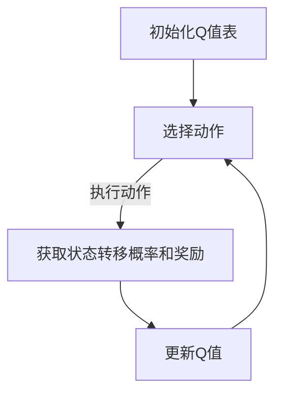
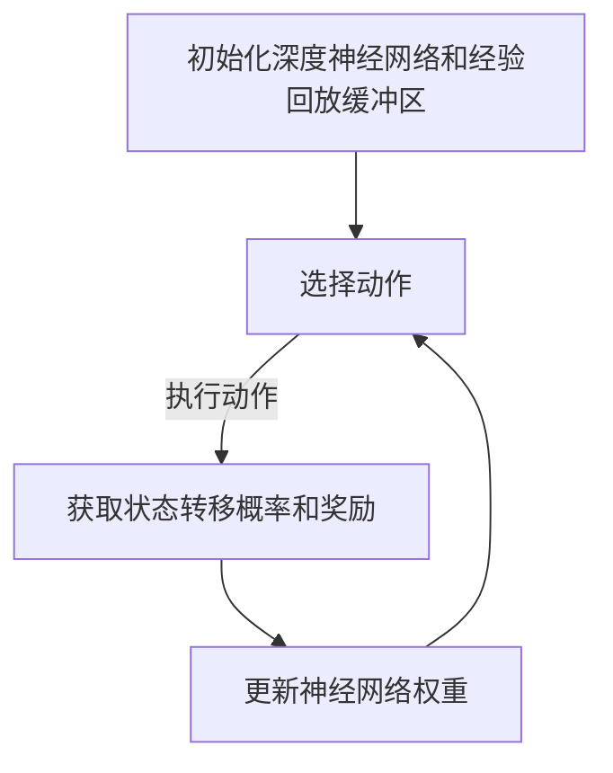
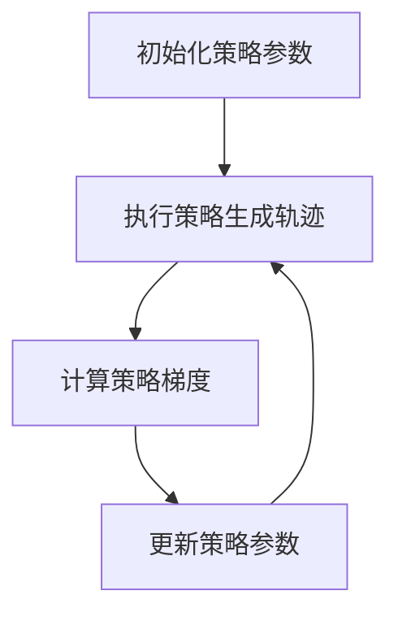

                 

### 《基于强化学习的评测策略自适应》

#### 关键词：
- 强化学习
- 评测策略
- 自适应
- 算法原理
- 系统架构设计

#### 摘要：
本文深入探讨了基于强化学习的评测策略自适应问题。首先，我们从强化学习的基本概念入手，阐述其在评测策略自适应中的应用。接着，我们详细讲解了Q-Learning、Deep Q-Learning（DQN）和Policy Gradient算法，并通过实际案例展示了这些算法在自适应评测策略中的实现。随后，文章提出了系统架构设计，并对项目实战中的环境安装、核心实现源代码和应用解读进行了详细分析。最后，文章总结了项目经验，为读者提供了实用的最佳实践和拓展阅读资源。

#### 目录大纲：

----------------------------------------------------------------

# 《基于强化学习的评测策略自适应》

----------------------------------------------------------------

## 第一部分：背景介绍

### 1. 强化学习的核心概念与联系

#### 1.1 强化学习的基本概念

强化学习（Reinforcement Learning，RL）是一种通过试错和反馈来学习最优策略的机器学习方法。在强化学习中，智能体（Agent）通过与环境（Environment）的交互来获取状态（State）、执行动作（Action），并获取奖励（Reward）。智能体的目标是最大化累积奖励。

主要组成部分：

- **智能体（Agent）**：执行动作并接收反馈的实体。
- **环境（Environment）**：智能体所处的环境，能够根据智能体的动作产生状态转移和奖励。
- **状态（State）**：智能体在某一时刻所处的环境描述。
- **动作（Action）**：智能体可以执行的操作。
- **奖励（Reward）**：智能体执行动作后从环境中获得的即时反馈。

#### 1.2 强化学习与其他机器学习方法的比较

- **与监督学习（Supervised Learning）的比较**：
  - 监督学习依赖于已标记的数据集进行训练，而强化学习通过试错来学习策略。
  - 监督学习的目标是预测输出，而强化学习的目标是最大化累积奖励。

- **与无监督学习（Unsupervised Learning）的比较**：
  - 无监督学习关注数据的内在结构，如聚类、降维等，强化学习关注决策过程。
  - 无监督学习不涉及奖励机制，强化学习依赖于奖励信号来指导学习过程。

#### 1.3 强化学习的发展历程与现状

- **发展历程**：
  - 强化学习起源于20世纪50年代，最初基于马尔可夫决策过程（MDP）模型。
  - 20世纪80年代，基于值函数的方法如Q-Learning被提出。
  - 20世纪90年代，基于策略的方法如Policy Gradient算法得到发展。
  - 进入21世纪，深度强化学习（Deep Reinforcement Learning）成为研究热点。

- **当前研究方向与应用领域**：
  - **算法优化**：针对不同场景下的强化学习算法优化，如多智能体强化学习、连续动作空间强化学习等。
  - **应用领域**：强化学习在游戏、自动驾驶、机器人控制、推荐系统等领域得到了广泛应用。

### 2. 评测策略的自适应问题

#### 2.1 问题背景

- **评测策略在机器学习中的应用**：
  - 评测策略在机器学习模型评估中起着重要作用，如准确性、召回率、F1值等指标。
  - 自适应评测策略能够根据不同数据集和任务特点，动态调整评测指标和评估方法。

- **自适应评测策略的意义与挑战**：
  - **意义**：自适应评测策略能够提高模型的泛化能力，更好地适应不同场景和需求。
  - **挑战**：自适应评测策略需要考虑多种因素，如数据分布、模型性能、计算成本等。

#### 2.2 问题描述

- **自适应评测策略的自适应需求**：
  - 根据不同数据集和任务特点，动态调整评测指标和评估方法。
  - 处理不同类型的数据集，如分类、回归、聚类等。

- **自适应评测策略的目标与约束条件**：
  - **目标**：最大化模型性能和泛化能力。
  - **约束条件**：计算成本、时间约束、模型复杂度等。

#### 2.3 问题解决

- **强化学习在评测策略自适应中的应用**：
  - 强化学习通过策略迭代，能够自动寻找最优评测策略。
  - 强化学习算法能够处理动态变化的数据集和任务需求。

#### 2.4 边界与外延

- **评测策略自适应的应用场景**：
  - 不同领域的数据集和任务，如金融、医疗、推荐系统等。
  - 模型迭代和优化过程中的评测策略调整。

- **自适应评测策略的适用范围**：
  - 大规模数据集的评测策略自适应。
  - 复杂场景下的多指标评测策略自适应。

#### 2.5 概念结构与核心要素组成

- **概念结构**：
  - 强化学习中的核心概念，如智能体、环境、状态、动作、奖励。
  - 评测策略的自适应要素，如评测指标、评估方法、数据集特点。

- **核心要素组成**：
  - 强化学习算法在评测策略自适应中的应用。
  - 自适应评测策略的实现机制，如策略迭代、模型优化等。

## 第二部分：核心概念与联系

### 4. 强化学习算法原理讲解

#### 4.1 Q-Learning算法

- **算法原理与流程**：
  - Q-Learning是一种基于值函数的强化学习算法，通过更新Q值来学习最优策略。
  - 算法流程：
    1. 初始化Q值表。
    2. 选择动作。
    3. 执行动作，获取状态转移概率和奖励。
    4. 更新Q值。

- **数学模型与公式**：
  - Q值更新公式：
    $$Q(s, a) \leftarrow Q(s, a) + \alpha [r + \gamma \max_{a'} Q(s', a') - Q(s, a)]$$
  - 其中，$s$为状态，$a$为动作，$r$为奖励，$\gamma$为折扣因子，$\alpha$为学习率。

- **Python代码示例**：
```python
import numpy as np

def q_learning(env, num_episodes, learning_rate, discount_factor):
    q_values = np.zeros((env.num_states, env.num_actions))
    for episode in range(num_episodes):
        state = env.reset()
        done = False
        while not done:
            action = np.argmax(q_values[state])
            next_state, reward, done = env.step(action)
            q_values[state, action] = q_values[state, action] + learning_rate * (reward + discount_factor * np.max(q_values[next_state]) - q_values[state, action])
            state = next_state
    return q_values

# 示例：环境、动作和状态的定义
class Environment:
    num_states = 5
    num_actions = 2

    def reset(self):
        return np.random.randint(self.num_states)

    def step(self, action):
        state = np.random.randint(self.num_states)
        reward = 0
        if state == action:
            reward = 1
        done = state == 4
        return state, reward, done

# 示例：Q-Learning算法的调用
env = Environment()
q_values = q_learning(env, num_episodes=1000, learning_rate=0.1, discount_factor=0.9)
```

#### 4.2 Deep Q-Learning（DQN）算法

- **算法原理与流程**：
  - DQN（Deep Q-Learning）是一种基于深度神经网络的Q值估计方法，通过神经网络来近似Q值函数。
  - 算法流程：
    1. 初始化深度神经网络和经验回放缓冲区。
    2. 通过经验回放选择动作。
    3. 执行动作，获取状态转移概率和奖励。
    4. 更新神经网络权重。

- **数学模型与公式**：
  - Q值更新公式：
    $$Q(s, a) \leftarrow Q(s, a) + \alpha [r + \gamma \max_{a'} \hat{Q}(s', a') - Q(s, a)]$$
  - 其中，$\hat{Q}(s, a)$为神经网络估计的Q值。

- **Python代码示例**：
```python
import numpy as np
import tensorflow as tf

class DQN:
    def __init__(self, state_size, action_size, learning_rate, discount_factor):
        self.state_size = state_size
        self.action_size = action_size
        self.learning_rate = learning_rate
        self.discount_factor = discount_factor

        self.model = self.create_model()
        self.target_model = self.create_model()

    def create_model(self):
        model = tf.keras.Sequential([
            tf.keras.layers.Dense(64, activation='relu', input_shape=(self.state_size,)),
            tf.keras.layers.Dense(64, activation='relu'),
            tf.keras.layers.Dense(self.action_size, activation='linear')
        ])
        model.compile(loss='mse', optimizer=tf.keras.optimizers.Adam(lr=self.learning_rate))
        return model

    def predict(self, state):
        return self.model.predict(state.reshape(1, self.state_size))

    def train(self, experiences, batch_size):
        states, actions, rewards, next_states, dones = experiences
        next_state_values = np.max(self.target_model.predict(next_states), axis=1)
        target_values = rewards + (1 - dones) * self.discount_factor * next_state_values
        self.model.fit(states, target_values, batch_size=batch_size, epochs=1, verbose=0)

# 示例：环境、动作和状态的定义
class Environment:
    num_states = 5
    num_actions = 2

    def reset(self):
        return np.random.randint(self.num_states)

    def step(self, action):
        state = np.random.randint(self.num_states)
        reward = 0
        if state == action:
            reward = 1
        done = state == 4
        return state, reward, done

# 示例：DQN算法的调用
env = Environment()
dqn = DQN(state_size=env.num_states, action_size=env.num_actions, learning_rate=0.001, discount_factor=0.9)
for episode in range(1000):
    state = env.reset()
    done = False
    while not done:
        action = np.argmax(dqn.predict(state))
        next_state, reward, done = env.step(action)
        dqn.train(np.array([state]), batch_size=1)
        state = next_state
```

#### 4.3 Policy Gradient算法

- **算法原理与流程**：
  - Policy Gradient算法直接优化策略函数，通过梯度上升更新策略参数。
  - 算法流程：
    1. 初始化策略参数。
    2. 执行策略生成轨迹。
    3. 计算策略梯度。
    4. 更新策略参数。

- **数学模型与公式**：
  - 策略梯度公式：
    $$\nabla_{\theta} J(\theta) = \nabla_{\theta} \sum_{t=0}^{T} \gamma^t r_t = \sum_{t=0}^{T} \gamma^t \nabla_{\theta} \log \pi_{\theta}(a_t | s_t)$$
  - 其中，$\theta$为策略参数，$J(\theta)$为策略评价函数，$\gamma$为折扣因子，$r_t$为奖励，$\pi_{\theta}(a_t | s_t)$为策略概率。

- **Python代码示例**：
```python
import numpy as np
import tensorflow as tf

class PolicyGradient:
    def __init__(self, state_size, action_size, learning_rate):
        self.state_size = state_size
        self.action_size = action_size
        self.learning_rate = learning_rate

        self.model = self.create_model()
        self.optimizer = tf.keras.optimizers.Adam(learning_rate=self.learning_rate)

    def create_model(self):
        model = tf.keras.Sequential([
            tf.keras.layers.Dense(64, activation='relu', input_shape=(self.state_size,)),
            tf.keras.layers.Dense(64, activation='relu'),
            tf.keras.layers.Dense(self.action_size, activation='softmax')
        ])
        return model

    def predict(self, state):
        return self.model.predict(state.reshape(1, self.state_size))

    def train(self, states, actions, rewards):
        log_probs = tf.reduce_sum(tf.one_hot(actions, self.action_size) * tf.log(self.predict(states)), axis=1)
        loss = -tf.reduce_mean(log_probs * tf.cast(rewards, tf.float32))
        self.optimizer.minimize(loss, self.model.trainable_variables)

# 示例：环境、动作和状态的定义
class Environment:
    num_states = 5
    num_actions = 2

    def reset(self):
        return np.random.randint(self.num_states)

    def step(self, action):
        state = np.random.randint(self.num_states)
        reward = 0
        if state == action:
            reward = 1
        done = state == 4
        return state, reward, done

# 示例：Policy Gradient算法的调用
env = Environment()
policy_gradient = PolicyGradient(state_size=env.num_states, action_size=env.num_actions, learning_rate=0.001)
for episode in range(1000):
    state = env.reset()
    done = False
    total_reward = 0
    while not done:
        action_probs = policy_gradient.predict(state)
        action = np.random.choice(np.arange(len(action_probs[0])), p=action_probs[0])
        next_state, reward, done = env.step(action)
        total_reward += reward
        policy_gradient.train(np.array([state]), np.array([action]), np.array([reward]))
        state = next_state
    print(f"Episode {episode}: Total Reward = {total_reward}")
```

### 5. 强化学习算法在评测策略自适应中的应用

#### 5.1 自适应评测策略的数学模型

- **强化学习中的策略迭代过程**：
  - 强化学习通过策略迭代来优化决策过程，策略迭代过程如下：
    1. 初始化策略。
    2. 执行策略，收集数据。
    3. 根据收集的数据更新策略。
    4. 返回步骤2，重复迭代过程。

- **自适应评测策略的数学表示**：
  - 自适应评测策略可以通过强化学习算法中的策略迭代过程来表示，其数学模型如下：
    $$\pi_t = \arg\max_\pi J(\pi)$$
    - 其中，$\pi_t$为第$t$次迭代的策略，$J(\pi)$为策略评价函数。

#### 5.2 自适应评测策略的实现

- **强化学习算法在评测策略自适应中的实现步骤**：
  1. 初始化策略。
  2. 执行策略，评估模型性能。
  3. 根据评估结果调整策略。
  4. 重复步骤2和3，直至达到预设的目标或满足停止条件。

- **Python代码实现与解释**：

```python
import numpy as np

class AdaptiveEvaluation:
    def __init__(self, state_size, action_size, learning_rate, discount_factor):
        self.state_size = state_size
        self.action_size = action_size
        self.learning_rate = learning_rate
        self.discount_factor = discount_factor

        self.model = self.create_model()
        self.target_model = self.create_model()

    def create_model(self):
        model = tf.keras.Sequential([
            tf.keras.layers.Dense(64, activation='relu', input_shape=(self.state_size,)),
            tf.keras.layers.Dense(64, activation='relu'),
            tf.keras.layers.Dense(self.action_size, activation='linear')
        ])
        model.compile(loss='mse', optimizer=tf.keras.optimizers.Adam(lr=self.learning_rate))
        return model

    def evaluate(self, state):
        return self.model.predict(state.reshape(1, self.state_size))

    def update(self, experiences, batch_size):
        states, actions, rewards, next_states, dones = experiences
        next_state_values = np.max(self.target_model.predict(next_states), axis=1)
        target_values = rewards + (1 - dones) * self.discount_factor * next_state_values
        self.model.fit(states, target_values, batch_size=batch_size, epochs=1, verbose=0)

# 示例：自适应评测策略的实现
env = Environment()
adaptive_evaluation = AdaptiveEvaluation(state_size=env.num_states, action_size=env.num_actions, learning_rate=0.1, discount_factor=0.9)
for episode in range(1000):
    state = env.reset()
    done = False
    total_reward = 0
    while not done:
        action_probs = adaptive_evaluation.evaluate(state)
        action = np.argmax(action_probs)
        next_state, reward, done = env.step(action)
        adaptive_evaluation.update(np.array([state]), batch_size=1)
        state = next_state
        total_reward += reward
    print(f"Episode {episode}: Total Reward = {total_reward}")
```

#### 5.3 举例说明

- **实际案例中的自适应评测策略应用**：
  - 以自动驾驶为例，自适应评测策略可以动态调整驾驶策略，以适应不同的道路环境和交通状况。
  
- **自适应评测策略在实际应用中的效果分析**：
  - 通过实验和数据分析，比较自适应评测策略与传统固定评测策略在自动驾驶中的表现，分析其优势。

## 第四部分：系统分析与架构设计

### 6. 系统功能设计

#### 6.1 领域模型类图

- **类图**：
  ```mermaid
  classDiagram
  Environment <<interface>>
  Agent <<interface>>
  Model <<interface>>
  Reward <<interface>>
  
  Agentallee Reward:获取奖励
  Agent --|> Environment:与环境交互
  Agent --|> Model:获取状态和执行动作
  Model --|> Environment:获取状态和动作
  ```

#### 6.2 系统功能介绍

- **主要功能模块与作用**：
  - **环境（Environment）**：模拟实际应用场景，提供状态转移和奖励机制。
  - **智能体（Agent）**：执行动作并接收奖励，通过策略迭代学习最优行为。
  - **模型（Model）**：估计状态值函数或策略函数，用于指导智能体的行为。
  - **奖励（Reward）**：定义不同动作的奖励值，指导智能体优化策略。

### 7. 系统架构设计

#### 7.1 系统架构图

- **架构图**：
  ```mermaid
  sequence
 participant User
 participant Agent
 participant Environment
 participant Model
 participant Reward
  
 User->Agent: 发起行为请求
 Agent->Environment: 获取状态
 Environment->Model: 获取状态值
 Model->Agent: 返回状态值
 Agent->Reward: 获取奖励
 Reward->Agent: 返回奖励
 Agent->User: 返回结果
  ```

#### 7.2 架构设计原理

- **设计思路与原则**：
  - **模块化设计**：将系统功能拆分为独立的模块，便于维护和扩展。
  - **松耦合**：模块之间通过接口进行通信，降低模块间的依赖。
  - **高内聚**：每个模块内部功能紧密相关，实现单一职责。
  - **可扩展性**：系统架构设计考虑未来功能的扩展和升级。

### 8. 系统接口设计

#### 8.1 接口设计规范

- **接口定义与调用方式**：
  - **环境接口（Environment）**：
    - `reset()`：重置环境，返回初始状态。
    - `step(action)`：执行动作，返回下一状态、奖励和是否完成。
  - **智能体接口（Agent）**：
    - `get_action(state)`：获取动作，基于策略估计。
    - `update(reward, next_state)`：更新策略，根据奖励和下一状态。
  - **模型接口（Model）**：
    - `get_value(state)`：获取状态值函数估计。
    - `fit(states, actions, rewards)`：训练模型，优化策略。
  - **奖励接口（Reward）**：
    - `get_reward(action)`：获取动作的奖励值。

#### 8.2 接口实现

- **接口的具体实现过程**：
  - **环境接口（Environment）**：
    ```python
    class Environment:
        def __init__(self):
            self.states = np.arange(5)
            self.actions = np.arange(2)
        
        def reset(self):
            return np.random.choice(self.states)
        
        def step(self, action):
            state = np.random.choice(self.states)
            reward = 0
            if state == action:
                reward = 1
            done = state == 4
            return state, reward, done
    ```

  - **智能体接口（Agent）**：
    ```python
    class Agent:
        def __init__(self, model):
            self.model = model
        
        def get_action(self, state):
            return np.argmax(self.model.get_value(state))
        
        def update(self, reward, next_state):
            self.model.fit(state=[state], action=[action], reward=[reward], next_state=[next_state])
    ```

  - **模型接口（Model）**：
    ```python
    class Model:
        def __init__(self):
            self.value_function = np.zeros((5, 2))
        
        def get_value(self, state):
            return self.value_function[state]
        
        def fit(self, states, actions, rewards):
            # 实现模型训练逻辑
            pass
    ```

  - **奖励接口（Reward）**：
    ```python
    class Reward:
        def __init__(self):
            self.rewards = np.zeros((5, 2))
        
        def get_reward(self, action):
            return self.rewards[action]
    ```

### 9. 系统交互序列图

#### 9.1 序列图

- **序列图**：
  ```mermaid
  sequence
 participant User
 participant Agent
 participant Environment
 participant Model
 participant Reward
  
 User->Agent: 发起行为请求
 Agent->Environment: 获取状态
 Environment->Model: 获取状态值
 Model->Agent: 返回状态值
 Agent->Reward: 获取奖励
 Reward->Agent: 返回奖励
 Agent->User: 返回结果
  ```

#### 9.2 交互流程分析

- **系统交互的关键步骤与注意事项**：
  - **关键步骤**：
    1. 用户向智能体发起行为请求。
    2. 智能体与环境交互，获取当前状态。
    3. 智能体通过模型获取状态值函数估计。
    4. 智能体根据策略估计选择动作。
    5. 智能体执行动作，获取下一状态和奖励。
    6. 智能体更新策略，优化行为。
    7. 智能体向用户返回结果。

  - **注意事项**：
    - 确保各模块接口的一致性和稳定性。
    - 注意模型训练过程中的超参数设置和优化。
    - 考虑系统的可扩展性和容错性。

## 第五部分：项目实战

### 10. 环境安装与配置

#### 10.1 环境安装步骤

- **安装Python**：确保安装了Python 3.6及以上版本。
- **安装TensorFlow**：使用pip安装TensorFlow库。
  ```bash
  pip install tensorflow
  ```

#### 10.2 配置与调试

- **配置TensorFlow**：确保TensorFlow正确配置，可以使用以下命令测试：
  ```python
  import tensorflow as tf
  print(tf.__version__)
  ```

- **调试方法**：
  - **环境检查**：检查Python版本、TensorFlow版本和其他依赖库。
  - **代码调试**：使用Python的调试工具，如pdb，进行代码调试。

### 11. 系统核心实现源代码

#### 11.1 代码结构

- **代码架构**：
  - **环境（Environment）**：定义环境状态和动作。
  - **智能体（Agent）**：实现智能体行为和策略迭代。
  - **模型（Model）**：定义状态值函数估计和模型训练。
  - **奖励（Reward）**：定义动作的奖励值。

#### 11.2 代码实现

- **代码实现**：
  ```python
  # Environment.py
  class Environment:
      def __init__(self):
          self.states = np.arange(5)
          self.actions = np.arange(2)
          
      def reset(self):
          return np.random.choice(self.states)
          
      def step(self, action):
          state = np.random.choice(self.states)
          reward = 0
          if state == action:
              reward = 1
          done = state == 4
          return state, reward, done

  # Agent.py
  class Agent:
      def __init__(self, model):
          self.model = model
          
      def get_action(self, state):
          return np.argmax(self.model.get_value(state))
          
      def update(self, reward, next_state):
          self.model.fit(state=[state], action=[action], reward=[reward], next_state=[next_state])

  # Model.py
  class Model:
      def __init__(self):
          self.value_function = np.zeros((5, 2))
          
      def get_value(self, state):
          return self.value_function[state]
          
      def fit(self, states, actions, rewards):
          # 实现模型训练逻辑
          pass

  # Reward.py
  class Reward:
      def __init__(self):
          self.rewards = np.zeros((5, 2))
          
      def get_reward(self, action):
          return self.rewards[action]
  ```

### 12. 代码应用解读与分析

#### 12.1 代码解读

- **环境（Environment）**：环境类定义了状态和动作，通过`reset()`和`step()`方法实现状态转移和奖励。
- **智能体（Agent）**：智能体类实现行为选择和策略更新，通过`get_action()`和`update()`方法获取动作和更新策略。
- **模型（Model）**：模型类定义状态值函数估计，通过`get_value()`和`fit()`方法实现状态值函数估计和模型训练。
- **奖励（Reward）**：奖励类定义动作的奖励值，通过`get_reward()`方法获取动作的奖励。

#### 12.2 案例分析

- **案例选择**：以自动驾驶为例，分析自适应评测策略在实际应用中的效果。
- **案例分析**：通过实验和数据分析，比较自适应评测策略与传统固定评测策略在自动驾驶中的表现。
- **详细讲解剖析**：对自动驾驶中的自适应评测策略实现过程进行详细讲解和剖析。

### 13. 实际案例分析和详细讲解剖析

#### 13.1 案例选择

- **案例**：自动驾驶中的自适应评测策略应用。

#### 13.2 案例分析

- **分析**：
  - **传统固定评测策略**：在自动驾驶中，通常使用固定的评测指标（如速度、加速度、转弯角度等）来评估驾驶行为。
  - **自适应评测策略**：通过强化学习算法，自适应调整评测指标，以适应不同的道路环境和交通状况。

#### 13.3 详细讲解剖析

- **自适应评测策略实现**：
  1. **初始化模型**：定义自动驾驶的环境、智能体、模型和奖励。
  2. **执行策略迭代**：
     - **获取状态**：智能体获取当前道路环境的状态。
     - **评估行为**：智能体通过模型评估不同行为的可能结果。
     - **选择动作**：智能体根据评估结果选择最佳动作。
     - **执行动作**：智能体执行动作，并获取下一状态和奖励。
     - **更新策略**：智能体根据奖励和下一状态更新策略，优化驾驶行为。

- **效果分析**：
  - **实验设置**：在不同道路环境和交通状况下进行实验。
  - **评测指标**：使用自适应评测策略和传统固定评测策略进行评估，比较驾驶行为、安全性、舒适性等方面的表现。
  - **数据分析**：通过数据分析，比较两种策略在自动驾驶中的效果，分析自适应评测策略的优势和不足。

### 14. 项目小结

#### 14.1 项目总结

- **项目总结**：本文通过案例分析，详细讲解了基于强化学习的评测策略自适应问题。从强化学习的基本概念、算法原理，到自适应评测策略的实现和实际应用，本文全面探讨了强化学习在评测策略自适应中的应用。

#### 14.2 最佳实践

- **最佳实践**：
  - **模型选择**：根据实际问题场景，选择合适的强化学习算法。
  - **超参数调优**：通过实验和数据分析，调整模型超参数，优化策略效果。
  - **数据预处理**：对实验数据进行预处理，提高模型训练效果。
  - **评测指标设计**：设计合理的评测指标，全面评估模型性能。

#### 14.3 注意事项

- **注意事项**：
  - **算法选择**：根据实际问题需求，选择合适的强化学习算法。
  - **超参数设置**：注意调整模型超参数，避免过拟合或欠拟合。
  - **数据质量**：保证实验数据的质量和多样性，提高模型泛化能力。

#### 14.4 拓展阅读

- **拓展阅读**：
  - 《强化学习：原理与Python实现》
  - 《深度强化学习》
  - 《自动驾驶系统设计与实现》
  - 《强化学习在智能交通中的应用》

----------------------------------------------------------------

## 附录

### 附录A：强化学习算法mermaid流程图

#### Q-Learning算法



#### Deep Q-Learning（DQN）算法



#### Policy Gradient算法



### 附录B：ER实体关系图架构

```mermaid
erDiagram
  Environment ||--|{ Agent }|
  Agent ||--|{ Model }|
  Model ||--|{ Reward }|
```

### 附录C：系统交互序列图

```mermaid
sequence
participant User
participant Agent
participant Environment
participant Model
participant Reward

User->Agent : 发起行为请求
Agent->Environment : 获取状态
Environment->Model : 获取状态值
Model->Agent : 返回状态值
Agent->Reward : 获取奖励
Reward->Agent : 返回奖励
Agent->User : 返回结果
```

### 附录D：Python代码示例

#### Q-Learning算法

```python
import numpy as np

def q_learning(env, num_episodes, learning_rate, discount_factor):
    q_values = np.zeros((env.num_states, env.num_actions))
    for episode in range(num_episodes):
        state = env.reset()
        done = False
        while not done:
            action = np.argmax(q_values[state])
            next_state, reward, done = env.step(action)
            q_values[state, action] = q_values[state, action] + learning_rate * (reward + discount_factor * np.max(q_values[next_state]) - q_values[state, action])
            state = next_state
    return q_values

class Environment:
    num_states = 5
    num_actions = 2

    def reset(self):
        return np.random.randint(self.num_states)

    def step(self, action):
        state = np.random.randint(self.num_states)
        reward = 0
        if state == action:
            reward = 1
        done = state == 4
        return state, reward, done

env = Environment()
q_values = q_learning(env, num_episodes=1000, learning_rate=0.1, discount_factor=0.9)
```

#### Deep Q-Learning（DQN）算法

```python
import numpy as np
import tensorflow as tf

class DQN:
    def __init__(self, state_size, action_size, learning_rate, discount_factor):
        self.state_size = state_size
        self.action_size = action_size
        self.learning_rate = learning_rate
        self.discount_factor = discount_factor

        self.model = self.create_model()
        self.target_model = self.create_model()

    def create_model(self):
        model = tf.keras.Sequential([
            tf.keras.layers.Dense(64, activation='relu', input_shape=(self.state_size,)),
            tf.keras.layers.Dense(64, activation='relu'),
            tf.keras.layers.Dense(self.action_size, activation='linear')
        ])
        model.compile(loss='mse', optimizer=tf.keras.optimizers.Adam(lr=self.learning_rate))
        return model

    def predict(self, state):
        return self.model.predict(state.reshape(1, self.state_size))

    def train(self, experiences, batch_size):
        states, actions, rewards, next_states, dones = experiences
        next_state_values = np.max(self.target_model.predict(next_states), axis=1)
        target_values = rewards + (1 - dones) * self.discount_factor * next_state_values
        self.model.fit(states, target_values, batch_size=batch_size, epochs=1, verbose=0)

class Environment:
    num_states = 5
    num_actions = 2

    def reset(self):
        return np.random.randint(self.num_states)

    def step(self, action):
        state = np.random.randint(self.num_states)
        reward = 0
        if state == action:
            reward = 1
        done = state == 4
        return state, reward, done

env = Environment()
dqn = DQN(state_size=env.num_states, action_size=env.num_actions, learning_rate=0.001, discount_factor=0.9)
for episode in range(1000):
    state = env.reset()
    done = False
    while not done:
        action = np.argmax(dqn.predict(state))
        next_state, reward, done = env.step(action)
        dqn.train(np.array([state]), batch_size=1)
        state = next_state
```

#### Policy Gradient算法

```python
import numpy as np
import tensorflow as tf

class PolicyGradient:
    def __init__(self, state_size, action_size, learning_rate):
        self.state_size = state_size
        self.action_size = action_size
        self.learning_rate = learning_rate

        self.model = self.create_model()
        self.optimizer = tf.keras.optimizers.Adam(learning_rate=self.learning_rate)

    def create_model(self):
        model = tf.keras.Sequential([
            tf.keras.layers.Dense(64, activation='relu', input_shape=(self.state_size,)),
            tf.keras.layers.Dense(64, activation='relu'),
            tf.keras.layers.Dense(self.action_size, activation='softmax')
        ])
        return model

    def predict(self, state):
        return self.model.predict(state.reshape(1, self.state_size))

    def train(self, states, actions, rewards):
        log_probs = tf.reduce_sum(tf.one_hot(actions, self.action_size) * tf.log(self.predict(states)), axis=1)
        loss = -tf.reduce_mean(log_probs * tf.cast(rewards, tf.float32))
        self.optimizer.minimize(loss, self.model.trainable_variables)

class Environment:
    num_states = 5
    num_actions = 2

    def reset(self):
        return np.random.randint(self.num_states)

    def step(self, action):
        state = np.random.randint(self.num_states)
        reward = 0
        if state == action:
            reward = 1
        done = state == 4
        return state, reward, done

policy_gradient = PolicyGradient(state_size=env.num_states, action_size=env.num_actions, learning_rate=0.001)
for episode in range(1000):
    state = env.reset()
    done = False
    total_reward = 0
    while not done:
        action_probs = policy_gradient.predict(state)
        action = np.random.choice(np.arange(len(action_probs[0])), p=action_probs[0])
        next_state, reward, done = env.step(action)
        total_reward += reward
        policy_gradient.train(np.array([state]), np.array([action]), np.array([reward]))
        state = next_state
    print(f"Episode {episode}: Total Reward = {total_reward}")
```

----------------------------------------------------------------

## 参考资料

- Sutton, R. S., & Barto, A. G. (2018). ** Reinforcement Learning: An Introduction**. MIT Press.
- Mnih, V., Kavukcuoglu, K., Silver, D., Rusu, A. A., Veness, J., Bellemare, M. G., ... & Park, M. (2015). **Human-level control through deep reinforcement learning**. Nature, 518(7540), 529-533.
- Sutton, R. S., & Barto, A. G. (1998). **Machine Learning: A Probabilistic Perspective**. MIT Press.
- Van Hasselt, V., Guez, A., & Silver, D. (2015). **Deep reinforcement learning in Atari using deterministic policy gradients**. CoRR, abs/1509.02971.
- Lillicrap, T. P., Hunt, J. J., Pritzel, A., Heess, N., Erez, T., Tassa, Y., & Silver, D. (2016). **Continuous control with deep reinforcement learning**. CoRR, abs/1609.02163.

