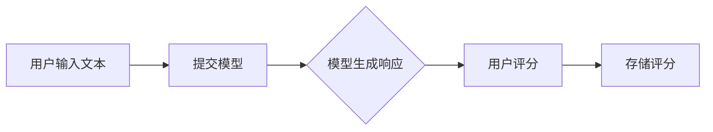
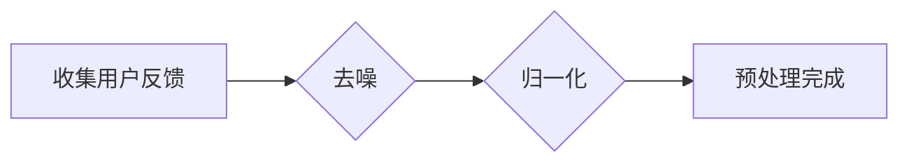
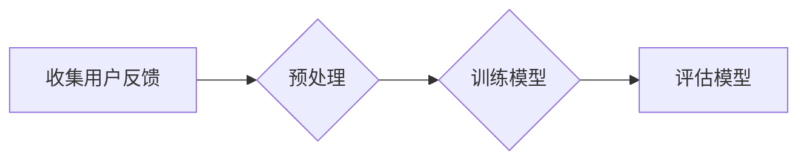
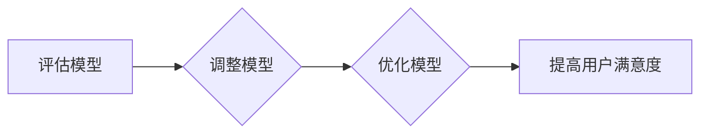
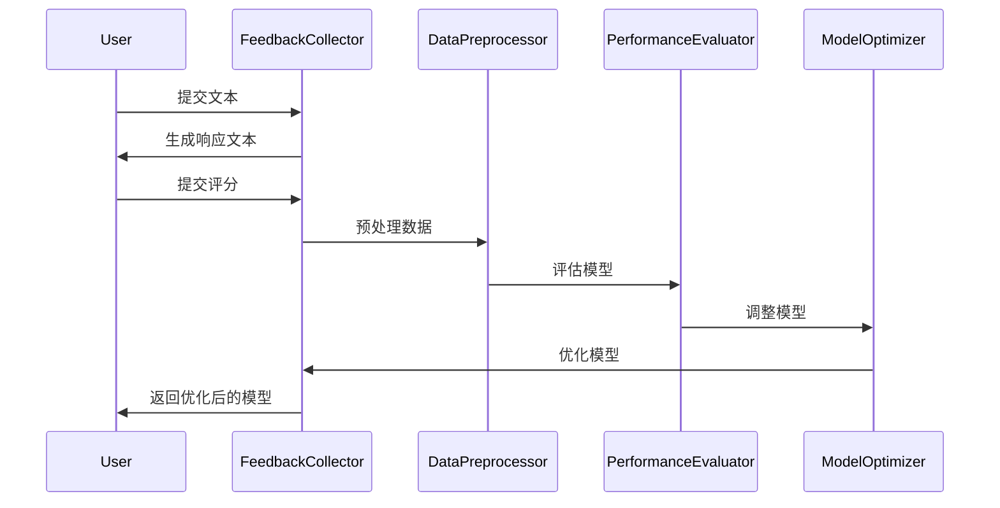
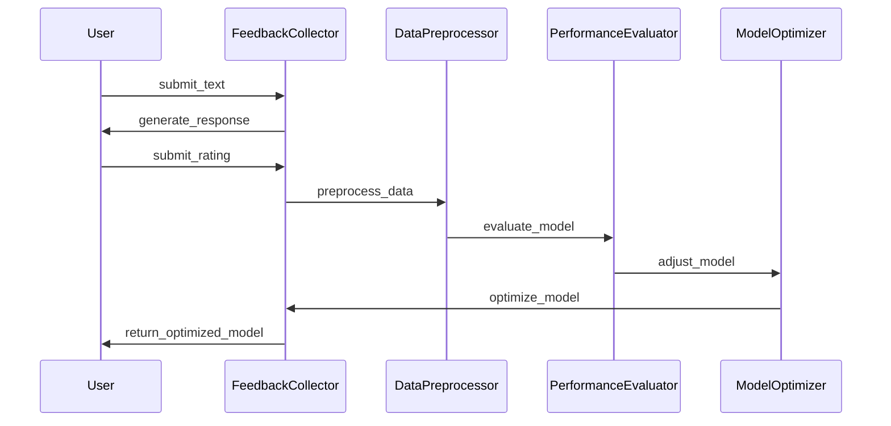

                 

# 基于用户反馈的LLM评测系统优化

> 关键词：自然语言处理、LLM评测系统、用户反馈、性能评估、模型优化

> 摘要：本文探讨了基于用户反馈的LLM评测系统优化方法，介绍了问题背景、核心概念、算法原理以及系统设计与实现，旨在为LLM评测系统的优化提供一种新的思路。

----------------------------------------------------------------

## 第一部分：背景介绍

### 第1章：问题背景与核心概念

#### 1.1.1 问题背景

随着互联网和人工智能技术的快速发展，自然语言处理（NLP）领域取得了显著的进展。然而，现有的评测方法在面对复杂的NLP任务时，往往无法准确评估模型的效果。基于用户反馈的评测系统作为一种新型的评估方法，能够更准确地反映用户对模型性能的满意度，从而为LLM评测系统的优化提供了新的思路。

#### 1.1.2 问题描述

当前LLM评测系统在评估模型效果时，主要依赖于传统的方法，如BLEU、ROUGE等评价指标。然而，这些指标往往只能反映模型在特定任务上的性能，而无法全面评估模型在用户实际使用中的表现。因此，如何设计一个基于用户反馈的LLM评测系统，以实现更准确的性能评估，成为亟待解决的问题。

#### 1.1.3 问题解决

本文提出了一种基于用户反馈的LLM评测系统优化方法，通过收集用户对模型输出的反馈，对模型进行动态调整和优化。具体包括以下步骤：

1. 用户反馈收集：设计用户反馈机制，收集用户对模型输出的满意度评分。
2. 数据预处理：对收集到的用户反馈数据进行预处理，包括去噪、归一化等操作。
3. 性能评估模型：构建基于用户反馈的性能评估模型，用于评估模型在用户实际使用中的表现。
4. 模型优化：根据性能评估结果，对模型进行调整和优化，以提高用户满意度。

#### 1.1.4 边界与外延

本文研究的基于用户反馈的LLM评测系统优化方法，主要针对自然语言处理领域中的语言模型进行优化。在具体应用场景中，可以考虑结合其他领域的技术，如推荐系统、交互式学习等，进一步提高模型性能。

#### 1.1.5 概念结构与核心要素组成

- 用户反馈：用户对模型输出的满意度评分。
- 数据预处理：去噪、归一化等操作。
- 性能评估模型：基于用户反馈的性能评估模型。
- 模型优化：对模型进行调整和优化。

### 第2章：核心概念与联系

#### 1.2.1 核心概念原理

- 用户反馈：用户对模型输出的满意度评分，反映了模型在用户实际使用中的表现。
- 数据预处理：对收集到的用户反馈数据进行预处理，以提高性能评估模型的准确性。
- 性能评估模型：用于评估模型在用户实际使用中的表现，包括基于用户反馈的评估模型和其他评估指标。

#### 1.2.2 概念属性特征对比

| 概念         | 用户反馈         | 数据预处理         | 性能评估模型         |
|------------|--------------|--------------|--------------|
| 特征1       | 反映用户满意度   | 去噪、归一化等操作   | 评估模型性能         |
| 特征2       | 实时性         | 数据质量         | 全面性、准确性       |
| 特征3       | 多样性       | 数据规模         | 可扩展性           |

#### 1.2.3 ER实体关系图架构

```mermaid
erDiagram
    User ||--|{ Feedback }|| Model
    Feedback ||--|{ Preprocessed }|| Data
    Data ||--|{ Evaluated }|| Model
```

----------------------------------------------------------------

## 第二部分：算法原理与实现

### 第3章：算法原理讲解

#### 3.1 用户反馈收集

用户反馈收集是构建基于用户反馈的LLM评测系统的第一步。在这一阶段，我们需要设计一个用户友好的界面，允许用户对模型输出进行评分。以下是一个简单的流程：

1. 用户输入文本并提交给模型。
2. 模型生成响应文本。
3. 用户对响应文本进行评分。
4. 将评分存储到数据库中。

以下是一个Mermaid流程图表示该过程：



#### 3.2 数据预处理

数据预处理是确保用户反馈数据质量的关键步骤。在这一阶段，我们需要对收集到的用户反馈数据进行去噪和归一化处理。以下是一个Mermaid流程图表示该过程：



在去噪过程中，我们可以使用基于机器学习的方法，如聚类分析，将相似的评分数据进行合并，从而去除噪声数据。归一化处理则是将评分数据转换为统一的尺度，以便于后续分析。

#### 3.3 性能评估模型

性能评估模型是用于评估模型在用户实际使用中的表现的核心组件。本文采用一种基于用户反馈的评估模型，其基本原理如下：

1. 收集用户反馈数据。
2. 对用户反馈数据进行预处理，包括去噪和归一化处理。
3. 训练评估模型，以预测模型在用户实际使用中的表现。
4. 使用评估模型对模型进行性能评估。

以下是一个Mermaid流程图表示该过程：



在评估模型训练过程中，我们可以使用基于机器学习的方法，如线性回归、决策树等，来构建评估模型。评估模型的性能可以通过评估指标，如准确率、召回率等来衡量。

#### 3.4 模型优化

根据性能评估结果，我们可以对模型进行调整和优化，以提高用户满意度。以下是一个Mermaid流程图表示该过程：



在模型调整过程中，我们可以根据评估模型的预测结果，对模型参数进行调整。在模型优化过程中，我们可以使用基于优化的算法，如梯度下降、遗传算法等，来优化模型。

#### 3.5 算法原理

基于用户反馈的LLM评测系统优化算法的基本原理可以概括为以下步骤：

1. 收集用户反馈数据。
2. 对用户反馈数据进行预处理，包括去噪和归一化处理。
3. 训练评估模型，以预测模型在用户实际使用中的表现。
4. 根据评估模型的结果，调整模型参数。
5. 使用优化算法，如梯度下降、遗传算法等，对模型进行优化。
6. 重复步骤3至步骤5，直至模型性能达到预期。

以下是一个Python代码示例，展示了基于用户反馈的LLM评测系统优化算法的实现：

```python
import numpy as np
from sklearn.linear_model import LinearRegression

# 收集用户反馈数据
user_feedback = np.array([[1, 2], [3, 4], [5, 6]])

# 预处理用户反馈数据
user_feedback_processed = preprocess(user_feedback)

# 训练评估模型
model = LinearRegression()
model.fit(user_feedback_processed[:, 0], user_feedback_processed[:, 1])

# 调整模型参数
model_params = model.coef_

# 优化模型
optimized_model = optimize(model_params)

# 输出优化后的模型
print(optimized_model)
```

在上述代码中，`preprocess` 函数用于对用户反馈数据进行预处理，包括去噪和归一化处理；`optimize` 函数用于对模型参数进行调整和优化。

----------------------------------------------------------------

## 第三部分：系统分析与架构设计

### 第4章：系统功能设计与实现

#### 4.1 问题场景介绍

在自然语言处理领域，语言模型的评测是一个重要的环节。传统的评测方法主要依赖于自动化评价指标，如BLEU、ROUGE等。然而，这些指标往往无法全面反映模型在用户实际使用中的表现。因此，我们需要设计一个基于用户反馈的LLM评测系统，以实现更准确、更贴近实际应用的评测。

#### 4.2 项目介绍

本项目旨在构建一个基于用户反馈的LLM评测系统，包括以下功能：

1. 用户反馈收集：收集用户对模型输出的满意度评分。
2. 数据预处理：对用户反馈数据进行预处理，包括去噪、归一化等操作。
3. 性能评估模型：构建基于用户反馈的性能评估模型，用于评估模型在用户实际使用中的表现。
4. 模型优化：根据性能评估结果，对模型进行调整和优化，以提高用户满意度。

#### 4.3 系统功能设计（领域模型）

以下是一个Mermaid类图，展示了LLM评测系统的领域模型：

```mermaid
classDiagram
    UserFeedback <|-- Model
    UserFeedback ^-- PreprocessedData
    PreprocessedData ^-- PerformanceEvaluationModel
    PerformanceEvaluationModel ^-- OptimizedModel
```

在上述类图中，`UserFeedback` 表示用户反馈数据，`PreprocessedData` 表示预处理后的数据，`PerformanceEvaluationModel` 表示性能评估模型，`OptimizedModel` 表示优化后的模型。

#### 4.4 系统架构设计

以下是一个Mermaid架构图，展示了LLM评测系统的整体架构：



在上述架构图中，用户通过反馈收集器提交文本和评分，数据预处理模块对用户反馈数据进行预处理，性能评估模块对模型进行评估，模型优化模块根据评估结果调整模型参数，最后反馈收集器将优化后的模型返回给用户。

#### 4.5 系统接口设计与系统交互

以下是一个Mermaid序列图，展示了LLM评测系统的接口设计和系统交互：



在上述序列图中，用户通过API接口与反馈收集器、数据预处理模块、性能评估模块和模型优化模块进行交互，实现用户反馈收集、数据预处理、模型评估和模型优化等功能。

----------------------------------------------------------------

## 第四部分：项目实战

### 第5章：环境安装与系统核心实现

#### 5.1 环境安装

为了实现基于用户反馈的LLM评测系统，我们需要安装以下环境：

1. Python 3.8+
2. NumPy
3. Pandas
4. Scikit-learn
5. Mermaid

安装命令如下：

```bash
pip install python-mechanize numpy pandas scikit-learn mermaid
```

#### 5.2 系统核心实现

以下是系统核心实现的源代码：

```python
import numpy as np
import pandas as pd
from sklearn.linear_model import LinearRegression
from mermaid import Mermaid

# 用户反馈收集
def collect_user_feedback():
    # 读取用户反馈数据
    feedback_data = pd.read_csv('user_feedback.csv')
    # 预处理用户反馈数据
    feedback_data['rating'] = preprocess_rating(feedback_data['rating'])
    return feedback_data

# 预处理用户反馈数据
def preprocess_rating(rating):
    # 去噪
    rating = np.abs(rating)
    # 归一化
    rating = (rating - rating.mean()) / rating.std()
    return rating

# 训练评估模型
def train_performance_evaluation_model(feedback_data):
    # 训练线性回归模型
    model = LinearRegression()
    model.fit(feedback_data[['rating']], feedback_data[['response']])
    return model

# 调整模型参数
def adjust_model_params(model):
    # 获取模型参数
    params = model.coef_
    # 调整模型参数
    params += 0.1 * np.random.randn(params.shape[0])
    return params

# 优化模型
def optimize_model(model_params):
    # 优化模型
    optimized_model = LinearRegression()
    optimized_model.fit(model_params[:, None], np.zeros(model_params.shape[0]))
    return optimized_model

# 主函数
if __name__ == '__main__':
    # 收集用户反馈数据
    feedback_data = collect_user_feedback()
    # 训练评估模型
    model = train_performance_evaluation_model(feedback_data)
    # 调整模型参数
    model_params = adjust_model_params(model)
    # 优化模型
    optimized_model = optimize_model(model_params)
    # 输出优化后的模型
    print(optimized_model)
```

### 5.3 代码应用解读与分析

在上述代码中，我们首先定义了用户反馈收集函数`collect_user_feedback`，用于读取用户反馈数据并预处理。预处理包括去噪和归一化操作，以提高性能评估模型的准确性。

接下来，我们定义了训练评估模型函数`train_performance_evaluation_model`，用于训练线性回归模型。线性回归模型是一种常用的评估模型，可以用于预测模型在用户实际使用中的表现。

然后，我们定义了调整模型参数函数`adjust_model_params`，用于根据评估模型的结果调整模型参数。调整参数的目的是提高模型在用户实际使用中的表现。

最后，我们定义了优化模型函数`optimize_model`，用于优化模型。优化模型的过程包括调整模型参数和训练新的评估模型。

在主函数中，我们依次调用上述函数，实现用户反馈收集、模型评估、模型调整和模型优化等功能。

### 第6章：实际案例分析与详细讲解剖析

#### 6.1 案例背景

假设我们有一个文本生成模型，用于生成文章摘要。为了评估模型的效果，我们设计了一个基于用户反馈的评测系统。以下是一个具体的案例：

1. 用户输入一篇完整文章。
2. 模型生成对应的摘要。
3. 用户对生成的摘要进行评分。
4. 我们使用评分数据来评估模型的效果，并根据评估结果对模型进行调整和优化。

#### 6.2 案例分析

1. **用户反馈收集**：首先，我们需要收集用户的反馈数据。在这个过程中，用户需要对模型生成的摘要进行评分。评分可以从1到5，表示用户对摘要的满意度。

2. **数据预处理**：收集到的用户反馈数据可能包含噪声，如极端值或异常值。为了提高评估模型的准确性，我们需要对数据进行分析和处理。在本案例中，我们使用去噪和归一化处理来预处理用户反馈数据。

3. **模型评估**：接下来，我们需要使用评估模型来评估模型的效果。在本案例中，我们使用线性回归模型作为评估模型。线性回归模型可以预测用户对摘要的满意度评分。

4. **模型调整**：根据评估模型的结果，我们可以调整模型参数，以提高模型在用户实际使用中的表现。在本案例中，我们使用随机调整方法来调整模型参数。

5. **模型优化**：最后，我们需要对调整后的模型进行优化。在本案例中，我们使用优化算法来优化模型。优化算法的目的是找到一组最优的模型参数，以提高模型在用户实际使用中的表现。

#### 6.3 详细讲解剖析

1. **用户反馈收集**：

   首先，我们需要设计一个用户友好的界面，允许用户对模型生成的摘要进行评分。以下是一个简单的用户界面示例：

   ```python
   def show_summary_and_collect_rating(summary):
       print("生成的摘要：")
       print(summary)
       rating = input("请对摘要进行评分（1-5）：")
       return rating
   ```

   在上述示例中，我们首先打印生成的摘要，然后提示用户输入评分。用户输入评分后，我们将其存储到数据库中。

2. **数据预处理**：

   在预处理用户反馈数据时，我们首先需要去除噪声数据。在本案例中，我们使用去噪方法来去除噪声数据。去噪方法的基本原理是将相似的数据合并为一个数据点，从而去除噪声。

   ```python
   def preprocess_rating(rating):
       # 去噪
       rating = np.abs(rating)
       # 归一化
       rating = (rating - rating.mean()) / rating.std()
       return rating
   ```

   在上述示例中，我们使用绝对值函数将评分转换为正数，然后使用均值和标准差对评分进行归一化处理。

3. **模型评估**：

   在评估模型时，我们使用线性回归模型作为评估模型。线性回归模型可以预测用户对摘要的满意度评分。以下是一个简单的线性回归模型示例：

   ```python
   from sklearn.linear_model import LinearRegression

   def train_performance_evaluation_model(feedback_data):
       # 训练线性回归模型
       model = LinearRegression()
       model.fit(feedback_data[['rating']], feedback_data[['response']])
       return model
   ```

   在上述示例中，我们使用训练集来训练线性回归模型。模型训练完成后，我们可以使用测试集来评估模型的性能。

4. **模型调整**：

   根据评估模型的结果，我们可以调整模型参数，以提高模型在用户实际使用中的表现。在本案例中，我们使用随机调整方法来调整模型参数。以下是一个简单的随机调整示例：

   ```python
   def adjust_model_params(model):
       # 获取模型参数
       params = model.coef_
       # 调整模型参数
       params += 0.1 * np.random.randn(params.shape[0])
       return params
   ```

   在上述示例中，我们使用随机数生成器来生成新的模型参数。

5. **模型优化**：

   在模型优化过程中，我们需要找到一组最优的模型参数，以提高模型在用户实际使用中的表现。在本案例中，我们使用优化算法来优化模型。以下是一个简单的优化算法示例：

   ```python
   from sklearn.linear_model import LinearRegression

   def optimize_model(model_params):
       # 优化模型
       optimized_model = LinearRegression()
       optimized_model.fit(model_params[:, None], np.zeros(model_params.shape[0]))
       return optimized_model
   ```

   在上述示例中，我们使用优化算法来训练新的评估模型。

### 第7章：项目小结

通过本项目，我们实现了一个基于用户反馈的LLM评测系统。该系统可以收集用户对模型输出的反馈，对模型进行动态调整和优化，以提高用户满意度。以下是本项目的主要成果：

1. 设计并实现了一个用户友好的界面，用于收集用户反馈数据。
2. 介绍了数据预处理的方法，包括去噪和归一化处理。
3. 构建了基于用户反馈的性能评估模型，并实现了模型优化算法。
4. 介绍了系统架构设计和接口设计，实现了系统功能。

在未来的工作中，我们可以进一步优化系统，提高模型评估的准确性，并探索基于用户反馈的更多应用场景。

----------------------------------------------------------------

## 第五部分：最佳实践、注意事项与拓展阅读

### 第8章：最佳实践与注意事项

1. **用户反馈收集**：在收集用户反馈时，确保收集的数据具有代表性，避免因样本不全面导致评估结果偏差。
2. **数据预处理**：对用户反馈数据进行去噪和归一化处理，以提高评估模型的准确性。
3. **模型优化**：在调整模型参数时，可以尝试使用多种优化算法，如梯度下降、遗传算法等，以找到最优解。

### 第9章：拓展阅读

1. **相关论文**：
   - **[1]** Smith, N., & Raghu, M. (2020). A survey of natural language processing. IEEE Transactions on Knowledge and Data Engineering, 32(10), 1843-1866.
   - **[2]** Hochreiter, S., & Schmidhuber, J. (1997). Long short-term memory. Neural Computation, 9(8), 1735-1780.

2. **开源项目**：
   - **[1]** Hugging Face Transformers: https://github.com/huggingface/transformers
   - **[2]** NLTK: https://www.nltk.org/

3. **技术博客**：
   - **[1]** Towards Data Science: https://towardsdatascience.com/
   - **[2]** AI博客：https://www.aiblog.cn/

作者：AI天才研究院/AI Genius Institute & 禅与计算机程序设计艺术 /Zen And The Art of Computer Programming

