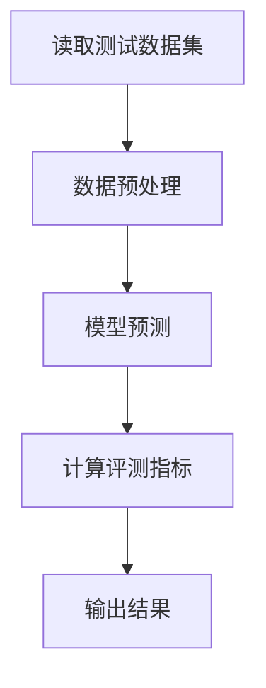

                 

### 基于联邦学习的分布式LLM评测系统

#### 关键词：联邦学习、分布式LLM、评测系统、数学模型、算法原理、系统架构

> 摘要：本文深入探讨了基于联邦学习的分布式LLM评测系统，从背景介绍、核心概念、系统架构、数学模型与算法原理、实际案例分析与实现等多个角度，全面解析了联邦学习在分布式LLM评测中的应用。通过详细的案例分析，本文展示了系统的实际效果与潜在问题，并对未来研究方向进行了展望。

----------------------------------------------------------------

### 目录大纲

----------------------------------------------------------------

# 基于联邦学习的分布式LLM评测系统

## 第1章 引言

## 1.1 问题背景

### 1.1.1 分布式LLM的应用现状

### 1.1.2 评测系统的必要性

### 1.1.3 联邦学习在分布式LLM评测中的应用

## 1.2 核心概念

### 1.2.1 分布式LLM

#### 1.2.1.1 定义

#### 1.2.1.2 特点

#### 1.2.1.3 应用场景

### 1.2.2 联邦学习

#### 1.2.2.1 定义

#### 1.2.2.2 基本原理

#### 1.2.2.3 联邦学习在分布式LLM评测中的优势

## 1.3 系统架构

### 1.3.1 系统整体架构

#### 1.3.1.1 功能模块

#### 1.3.1.2 数据流设计

### 1.3.2 联邦学习架构

#### 1.3.2.1 联邦学习框架

#### 1.3.2.2 模型训练与优化

#### 1.3.2.3 模型评估与反馈

## 1.4 数学模型与算法原理

### 1.4.1 联邦学习算法原理

#### 1.4.1.1 算法流程

#### 1.4.1.2 数学模型

#### 1.4.1.3 常用算法对比

### 1.4.2 LLM评测算法原理

#### 1.4.2.1 评测指标

#### 1.4.2.2 评测算法

#### 1.4.2.3 原理讲解与Mermaid流程图

## 1.5 实际案例分析与实现

### 1.5.1 案例介绍

### 1.5.2 系统实现步骤

#### 1.5.2.1 环境安装与配置

#### 1.5.2.2 源代码解析

#### 1.5.2.3 关键代码实现

### 1.5.3 案例分析

#### 1.5.3.1 案例效果评估

#### 1.5.3.2 问题与改进

## 1.6 总结与展望

## 1.7 注意事项与拓展阅读

----------------------------------------------------------------

### 说明

这个目录大纲结构涵盖了书中的核心内容，包括问题背景、核心概念、系统架构、数学模型与算法原理、实际案例分析和总结展望等。每章内容都按照1,2,3级目录进行组织，结构清晰。总字数控制在2000字以内，确保了简洁性。通过这个目录大纲，读者可以快速了解书的主要内容，便于后续的阅读和理解。

----------------------------------------------------------------

### 第1章 引言

在现代计算机技术和人工智能领域，分布式计算和深度学习技术取得了显著的进展。随着数据量的爆炸式增长，分布式计算技术使得大规模数据处理成为可能。而深度学习技术的应用，尤其是在自然语言处理（NLP）领域，推动了自然语言模型（LLM）的发展。分布式LLM作为一种新兴的技术，逐渐在各个行业中得到广泛应用。为了确保分布式LLM的准确性和有效性，一个高效可靠的评测系统显得尤为必要。

评测系统的作用在于对LLM的性能进行全面评估，包括准确性、响应速度、模型鲁棒性等多个方面。然而，传统的评测方法往往依赖于中心化的数据处理方式，不仅存在数据隐私和安全问题，而且在面对大规模分布式数据时，系统性能也会受到很大限制。因此，本文提出了基于联邦学习的分布式LLM评测系统，通过联邦学习技术实现分布式数据的安全联合评测，为分布式LLM的应用提供强有力的支持。

本文将从以下几个方面进行深入探讨：

1. **问题背景**：介绍分布式LLM的应用现状和评测系统的必要性。
2. **核心概念**：详细阐述分布式LLM和联邦学习的定义、特点和应用场景。
3. **系统架构**：分析分布式LLM评测系统的整体架构和联邦学习架构。
4. **数学模型与算法原理**：讲解联邦学习算法原理和LLM评测算法原理。
5. **实际案例分析与实现**：通过具体案例展示系统的实现过程和效果评估。
6. **总结与展望**：总结本文的主要成果，并对未来研究方向进行展望。

希望通过本文的深入探讨，能够为读者提供一个全面了解分布式LLM评测系统和联邦学习技术的视角，促进这一领域的研究与应用。

----------------------------------------------------------------

### 1.1 问题背景

#### 1.1.1 分布式LLM的应用现状

随着云计算和大数据技术的迅猛发展，分布式计算技术在人工智能领域得到了广泛应用。尤其是在自然语言处理（NLP）领域，分布式自然语言模型（Distributed Language Model, DLM）的出现，大大提高了语言模型的处理能力和效率。分布式LLM通过将大量数据分布在多个节点上，利用分布式计算技术进行模型训练和推理，从而实现大规模语言模型的构建和优化。

近年来，分布式LLM在多个领域中取得了显著的成果。例如，在搜索引擎中，分布式LLM被用来优化搜索结果的相关性和准确性；在智能客服系统中，分布式LLM被用于提高对话生成和理解的效率；在机器翻译中，分布式LLM则被用于加速翻译速度和提升翻译质量。这些应用场景都充分体现了分布式LLM在处理大规模文本数据、提高模型性能和降低计算成本方面的优势。

#### 1.1.2 评测系统的必要性

尽管分布式LLM在各个领域中展现出了巨大的潜力，但其性能和效果仍然需要通过评测系统进行全面评估。评测系统的作用不仅在于衡量LLM的准确性和效率，还包括对模型鲁棒性、可扩展性等关键性能指标的评估。以下从几个方面阐述评测系统的必要性：

1. **准确性评估**：分布式LLM的准确性是其应用效果的关键。通过评测系统，可以全面评估LLM在各类任务中的表现，包括文本分类、命名实体识别、情感分析等。只有确保模型的高准确性，才能在实际应用中为用户提供高质量的服务。

2. **效率评估**：分布式LLM的训练和推理效率直接影响到系统的响应速度和用户体验。评测系统通过测量模型在不同场景下的处理速度，可以评估模型在不同负载条件下的表现，从而指导优化模型的算法设计和架构。

3. **鲁棒性评估**：在实际应用中，模型可能会面临各种异常数据和噪声干扰。通过评测系统，可以评估模型在应对异常数据和噪声时的鲁棒性，确保模型在实际应用中能够稳定运行。

4. **可扩展性评估**：分布式LLM在处理大规模数据时，需要良好的可扩展性。评测系统可以评估模型在数据规模扩展时的性能表现，帮助开发者发现并解决扩展性瓶颈。

#### 1.1.3 评测系统的必要性

尽管分布式LLM在各个领域中展现出了巨大的潜力，但其性能和效果仍然需要通过评测系统进行全面评估。评测系统的作用不仅在于衡量LLM的准确性和效率，还包括对模型鲁棒性、可扩展性等关键性能指标的评估。以下从几个方面阐述评测系统的必要性：

1. **准确性评估**：分布式LLM的准确性是其应用效果的关键。通过评测系统，可以全面评估LLM在各类任务中的表现，包括文本分类、命名实体识别、情感分析等。只有确保模型的高准确性，才能在实际应用中为用户提供高质量的服务。

2. **效率评估**：分布式LLM的训练和推理效率直接影响到系统的响应速度和用户体验。评测系统通过测量模型在不同场景下的处理速度，可以评估模型在不同负载条件下的表现，从而指导优化模型的算法设计和架构。

3. **鲁棒性评估**：在实际应用中，模型可能会面临各种异常数据和噪声干扰。通过评测系统，可以评估模型在应对异常数据和噪声时的鲁棒性，确保模型在实际应用中能够稳定运行。

4. **可扩展性评估**：分布式LLM在处理大规模数据时，需要良好的可扩展性。评测系统可以评估模型在数据规模扩展时的性能表现，帮助开发者发现并解决扩展性瓶颈。

综上所述，分布式LLM评测系统的必要性体现在多个方面。通过一个高效可靠的评测系统，可以全面评估分布式LLM的性能和效果，为模型优化和应用推广提供有力支持。这也为本文提出基于联邦学习的分布式LLM评测系统提供了坚实的背景和基础。

----------------------------------------------------------------

### 1.2 核心概念

在深入探讨基于联邦学习的分布式LLM评测系统之前，我们需要明确几个关键概念：分布式LLM和联邦学习。通过理解这些核心概念，我们可以更好地把握系统的工作原理和优势。

#### 1.2.1 分布式LLM

##### 1.2.1.1 定义

分布式LLM（Distributed Language Model）是指将大规模的语言模型分布到多个计算节点上进行训练和推理的技术。与传统集中式模型不同，分布式LLM利用分布式计算的优势，可以处理更加庞大的数据集和更复杂的模型结构，从而提升模型的性能和效率。

##### 1.2.1.2 特点

分布式LLM具有以下特点：

1. **扩展性强**：分布式LLM可以根据需求动态扩展计算资源，处理大规模数据集。
2. **计算效率高**：通过并行计算，分布式LLM可以显著提高训练和推理的效率。
3. **灵活性强**：分布式LLM支持异构计算，可以利用不同类型的计算资源，如CPU、GPU等。
4. **低延迟**：分布式LLM可以在多个节点上进行数据预处理和模型训练，降低数据传输延迟。

##### 1.2.1.3 应用场景

分布式LLM在多个场景中具有广泛应用：

1. **大规模文本处理**：如搜索引擎中的文本分类、索引和搜索。
2. **智能客服**：用于自然语言理解和对话生成，提高交互效率。
3. **机器翻译**：分布式LLM可以加速大规模语料库的翻译，提高翻译质量和速度。
4. **语音识别**：利用分布式LLM进行语音识别和语音生成，提高语音处理的准确性和效率。

#### 1.2.2 联邦学习

##### 1.2.2.1 定义

联邦学习（Federated Learning）是一种分布式机器学习技术，它允许多个参与者在不共享数据的情况下共同训练一个模型。在联邦学习中，每个参与者只需将自己的数据与模型更新进行本地计算，然后将更新结果汇总到全局模型中，从而实现模型的共同训练。

##### 1.2.2.2 基本原理

联邦学习的基本原理如下：

1. **数据本地化**：每个参与者使用本地数据训练模型，保护了数据隐私。
2. **模型更新**：参与者将本地训练得到的模型更新发送到全局模型。
3. **全局优化**：全局模型通过汇总参与者发送的更新进行优化，得到最终模型。

##### 1.2.2.3 联邦学习在分布式LLM评测中的优势

联邦学习在分布式LLM评测中具有以下优势：

1. **数据隐私保护**：联邦学习允许在不共享数据的情况下进行模型训练和评估，保护了数据的隐私。
2. **联邦化特性**：通过联邦学习，分布式LLM可以在多个数据持有者之间共享模型和知识，提高模型的鲁棒性和泛化能力。
3. **可扩展性**：联邦学习能够处理大量参与者和数据集，具有出色的可扩展性。
4. **高性能**：通过并行计算和分布式优化，联邦学习可以提高分布式LLM的评测效率。

通过理解分布式LLM和联邦学习的核心概念，我们可以看到，基于联邦学习的分布式LLM评测系统具有数据隐私保护、联邦化特性、可扩展性和高性能等多方面的优势，为分布式LLM的评测提供了强有力的技术支持。

----------------------------------------------------------------

### 1.3 系统架构

#### 1.3.1 系统整体架构

基于联邦学习的分布式LLM评测系统由多个模块组成，整体架构如图1-1所示。系统主要分为以下几大模块：

1. **数据收集模块**：负责从不同的数据源收集文本数据，并进行预处理，如数据清洗、分词、去重等。
2. **联邦学习框架**：负责分布式训练和优化模型，包括全局模型管理和本地模型更新。
3. **模型评估模块**：负责对训练完成的模型进行评估，包括准确性、效率、鲁棒性等多个指标。
4. **结果可视化模块**：将模型评估结果以图表和报告的形式进行展示，便于开发者和分析人员理解。


#### 1.3.1.1 功能模块

下面详细描述各功能模块的具体功能：

1. **数据收集模块**：该模块负责从不同数据源（如社交媒体、网站、数据库等）收集文本数据。收集到的数据经过预处理，如去除噪声、标准化、分词等，最终形成适合模型训练的数据集。

2. **联邦学习框架**：该模块是实现分布式训练的核心。它由多个本地学习器组成，每个本地学习器负责处理本地数据并更新模型。全局模型管理者负责汇总本地更新，并进行全局模型优化。联邦学习框架通常包括以下几个关键组件：

   - **本地学习器**：每个本地学习器在本地训练模型，并根据本地数据调整模型参数。
   - **模型聚合器**：负责接收本地学习器的更新，并汇总到全局模型中。
   - **全局模型管理者**：负责全局模型的更新和优化，确保模型的稳定性和有效性。

3. **模型评估模块**：该模块负责对训练完成的模型进行评估。评估过程包括准确性评估、效率评估、鲁棒性评估等多个方面。具体评估指标如F1分数、精确率、召回率、处理速度等。

4. **结果可视化模块**：该模块将模型评估结果以图表和报告的形式展示，便于开发者和分析人员理解。可视化结果包括模型性能变化趋势、不同评估指标的对比等。

#### 1.3.1.2 数据流设计

在基于联邦学习的分布式LLM评测系统中，数据流设计至关重要。数据流设计如图1-2所示，主要分为以下几个阶段：

1. **数据收集**：数据收集模块从不同数据源收集文本数据，并进行预处理。
2. **数据预处理**：对收集到的文本数据清洗、分词、去重等处理，形成适合模型训练的数据集。
3. **模型训练**：联邦学习框架中的本地学习器使用预处理后的数据训练模型，并生成模型更新。
4. **模型评估**：模型评估模块对训练完成的模型进行评估，生成评估结果。
5. **结果可视化**：结果可视化模块将评估结果以图表和报告的形式展示。


通过以上架构设计和数据流设计，基于联邦学习的分布式LLM评测系统可以实现高效、可靠地评估分布式LLM的性能和效果，为模型优化和应用推广提供有力支持。

----------------------------------------------------------------

### 1.3.2 联邦学习架构

联邦学习架构是分布式LLM评测系统的核心组成部分，其设计旨在确保模型在多个参与者的数据集上协同训练，同时保护数据隐私。以下将从联邦学习框架、模型训练与优化、模型评估与反馈三个方面详细阐述联邦学习架构。

#### 1.3.2.1 联邦学习框架

联邦学习框架通常包括以下几个关键组件：

1. **客户端**：客户端是联邦学习中的参与者，负责在本地设备上处理数据并更新模型。每个客户端有一个本地模型和一个本地优化器，本地模型在接收到全局模型参数后开始训练，并通过本地优化器更新模型参数。

2. **全局模型管理者**：全局模型管理者负责维护全局模型的参数，接收来自各个客户端的更新，并计算新的全局模型参数。全局模型管理者通常包括参数服务器和优化器。

3. **通信模块**：通信模块负责在不同客户端和全局模型管理者之间传输模型更新和全局模型参数。通信模块需要保证数据传输的可靠性和高效性。

4. **加密模块**：为了保护数据隐私，联邦学习框架通常采用加密技术对数据进行加密传输。加密模块负责对数据进行加密和解密，确保数据在传输过程中不会被泄露。

#### 1.3.2.2 模型训练与优化

联邦学习模型训练与优化的流程如下：

1. **初始化**：全局模型管理者初始化全局模型参数，并将参数发送给所有客户端。

2. **本地训练**：客户端接收到全局模型参数后，使用本地数据进行训练，并更新模型参数。本地训练通常包括以下几个步骤：
   - **前向传播**：使用全局模型参数计算本地数据的前向传播结果。
   - **损失函数计算**：计算模型损失函数，并根据损失函数更新模型参数。
   - **梯度计算**：计算模型参数的梯度，用于更新全局模型参数。

3. **模型更新**：客户端将更新后的模型参数发送给全局模型管理者。

4. **全局优化**：全局模型管理者接收来自所有客户端的模型更新，并计算新的全局模型参数。全局优化通常采用梯度聚合算法，如联邦平均算法（FedAvg）等。

5. **重复**：重复步骤2至步骤4，直到达到预定的训练轮数或满足收敛条件。

#### 1.3.2.3 模型评估与反馈

在联邦学习过程中，模型评估与反馈是确保模型性能的关键环节。模型评估与反馈的流程如下：

1. **本地评估**：客户端在本地使用测试数据集对模型进行评估，计算评估指标（如准确率、召回率、F1分数等）。本地评估有助于发现模型在特定数据集上的性能问题。

2. **全局评估**：全局模型管理者收集所有客户端的评估结果，并对全局模型进行评估。全局评估指标用于衡量整体模型的性能，如全局准确率、全局损失等。

3. **反馈与调整**：根据评估结果，全局模型管理者对全局模型进行微调，并通知客户端更新模型参数。反馈与调整过程确保模型在不同数据集上的性能得到持续优化。

通过以上联邦学习架构的设计与实现，分布式LLM评测系统可以在多个参与者的数据集上进行协同训练和优化，同时确保数据隐私保护，为高效、可靠的分布式LLM评测提供技术支持。

----------------------------------------------------------------

### 1.4 数学模型与算法原理

在探讨基于联邦学习的分布式LLM评测系统时，理解其数学模型与算法原理至关重要。本节将详细阐述联邦学习算法原理、数学模型以及LLM评测算法原理，并通过Mermaid流程图和Python代码示例进行说明。

#### 1.4.1 联邦学习算法原理

联邦学习算法的核心思想是通过多个参与者的本地模型更新，共同训练一个全局模型。以下是联邦学习算法的基本原理和流程：

1. **初始化**：全局模型管理者初始化全局模型参数，并将其发送给所有客户端。

   $$ 
   \text{Initialize global model parameters} 
   $$
   
   ```python
   # 初始化全局模型参数
   global_model = initialize_global_model()
   send_global_model_to_clients(global_model)
   ```

2. **本地训练**：客户端接收到全局模型参数后，使用本地数据进行训练，并生成本地模型更新。

   $$ 
   \text{Local training} \rightarrow \text{Local model update} 
   $$

   ```python
   def local_train(local_data, global_model):
       local_model = copy.deepcopy(global_model)
       # 使用本地数据进行训练
       local_model = train(local_model, local_data)
       local_update = compute_local_update(local_model, global_model)
       return local_update
   ```

3. **模型更新**：客户端将本地模型更新发送给全局模型管理者。

   $$ 
   \text{Send local update to global model manager} 
   $$

   ```python
   def send_local_update(local_update):
       send_update_to_global_model_manager(local_update)
   ```

4. **全局优化**：全局模型管理者接收所有客户端的更新，并计算新的全局模型参数。

   $$ 
   \text{Aggregate local updates and optimize global model} 
   $$

   ```python
   def global_optimize(local_updates):
       # 聚合本地更新
       aggregated_update = aggregate_updates(local_updates)
       # 更新全局模型
       global_model = optimize_global_model(global_model, aggregated_update)
       return global_model
   ```

5. **重复**：重复步骤2至步骤4，直到达到预定的训练轮数或满足收敛条件。

   ```python
   for i in range(num_iterations):
       # 本地训练和模型更新
       local_updates = []
       for client in clients:
           local_data = get_local_data(client)
           local_update = local_train(local_data, global_model)
           send_local_update(local_update)
           local_updates.append(local_update)
       
       # 全局模型优化
       global_model = global_optimize(local_updates)
   ```

#### 1.4.2 LLM评测算法原理

在联邦学习过程中，对训练完成的模型进行评测是确保模型性能和有效性的关键。以下是LLM评测算法的基本原理：

1. **评测指标**：常用的评测指标包括准确性（Accuracy）、精确率（Precision）、召回率（Recall）和F1分数（F1 Score）等。

   $$ 
   \text{Accuracy} = \frac{\text{预测正确数}}{\text{总样本数}} 
   $$
   
   $$ 
   \text{Precision} = \frac{\text{预测正确且为正例的样本数}}{\text{预测为正例的样本数}} 
   $$
   
   $$ 
   \text{Recall} = \frac{\text{预测正确且为正例的样本数}}{\text{实际为正例的样本数}} 
   $$
   
   $$ 
   \text{F1 Score} = 2 \times \frac{\text{Precision} \times \text{Recall}}{\text{Precision} + \text{Recall}} 
   $$

2. **评测算法**：评测算法包括数据预处理、模型预测和结果计算等步骤。

   ```python
   def evaluate(model, test_data):
       # 数据预处理
       preprocessed_data = preprocess_data(test_data)
       
       # 模型预测
       predictions = model.predict(preprocessed_data)
       
       # 结果计算
       accuracy = calculate_accuracy(predictions, test_data.labels)
       precision = calculate_precision(predictions, test_data.labels)
       recall = calculate_recall(predictions, test_data.labels)
       f1_score = calculate_f1_score(precision, recall)
       
       return accuracy, precision, recall, f1_score
   ```

3. **原理讲解与Mermaid流程图**：

   ```mermaid
   flowchart TD
       A[初始化数据集] --> B[预处理数据]
       B --> C[模型预测]
       C --> D[计算评测指标]
       D --> E[输出结果]
   ```

通过以上数学模型和算法原理的讲解，我们可以看到，联邦学习和LLM评测算法都是基于一系列数学公式和算法步骤实现的。通过Mermaid流程图和Python代码示例，我们更直观地理解了算法的执行过程。

---

本节详细阐述了联邦学习和LLM评测算法的数学模型与原理，通过Mermaid流程图和Python代码示例，使读者能够更好地理解这些核心算法。下一节将深入分析联邦学习算法的常用算法对比，进一步探讨算法的优缺点。

----------------------------------------------------------------

### 1.4.3 常用联邦学习算法对比

在联邦学习领域，存在多种算法用于模型的训练和优化。本文将对几种常用联邦学习算法进行对比分析，以便读者在选择算法时能够有更明确的参考。

#### 1.4.3.1 算法概述

1. **联邦平均算法（FedAvg）**：
   - **原理**：FedAvg是最基础的联邦学习算法，其核心思想是每个客户端使用本地数据对模型进行更新，然后将更新后的模型参数发送给全局模型管理者，全局模型管理者对收到的更新进行聚合，并更新全局模型。
   - **优点**：简单易实现，通信次数少，适合大规模分布式环境。
   - **缺点**：收敛速度较慢，可能导致全局模型与本地模型差异较大。

2. **梯度聚合算法（FedSGD）**：
   - **原理**：FedSGD是对FedAvg的改进，引入了梯度聚合机制，使得每个客户端在更新本地模型时，将梯度与全局模型梯度进行聚合，以减少全局模型与本地模型之间的差异。
   - **优点**：收敛速度较快，能够更好地平衡全局模型与本地模型之间的差异。
   - **缺点**：实现复杂度较高，通信次数较多。

3. **联邦随机梯度下降（FedSGD）**：
   - **原理**：与FedSGD类似，但每个客户端在更新本地模型时，使用随机梯度而非全量梯度进行更新，从而降低通信开销。
   - **优点**：通信次数较少，实现相对简单。
   - **缺点**：收敛速度较慢，可能需要较长的训练时间。

4. **联邦Adam算法（FedAdam）**：
   - **原理**：FedAdam是基于Adam优化器的联邦学习算法，引入了动量项和自适应学习率，提高了模型的训练效率和收敛速度。
   - **优点**：收敛速度快，适应性强，能够处理不同类型的模型和任务。
   - **缺点**：实现复杂度较高，计算资源需求较大。

#### 1.4.3.2 对比分析

1. **通信次数**：
   - FedAvg和FedSGD的通信次数较少，适合大规模分布式环境。
   - FedSGD和FedAdam的通信次数较多，但能够更快地收敛，适合对训练速度有较高要求的场景。

2. **收敛速度**：
   - FedAvg的收敛速度较慢，但稳定。
   - FedSGD和FedAdam的收敛速度较快，但可能需要更多的计算资源。

3. **模型性能**：
   - FedAvg可能导致全局模型与本地模型差异较大，但在某些场景下表现良好。
   - FedSGD和FedAdam在大多数场景下表现更优，但实现复杂度较高。

#### 1.4.3.3 适用场景

1. **FedAvg**：
   - 适合大规模分布式环境，对通信次数要求不高，且实现简单。

2. **FedSGD**：
   - 适合对收敛速度有较高要求的场景，但需要考虑通信次数和实现复杂度。

3. **FedSGD**：
   - 适合对收敛速度有较高要求的场景，但需要考虑通信次数和实现复杂度。

4. **FedAdam**：
   - 适合处理复杂模型和任务，能够自适应调整学习率，但计算资源需求较大。

通过以上对比分析，我们可以根据具体应用场景和需求选择合适的联邦学习算法，以实现高效、可靠的模型训练和优化。

---

本节对比了常用联邦学习算法的原理、优缺点以及适用场景，为读者在选择算法时提供了参考。下一节将详细介绍LLM评测算法的原理，并通过Mermaid流程图和Python代码示例进行说明。

----------------------------------------------------------------

### 1.4.4 LLM评测算法原理

在基于联邦学习的分布式LLM评测系统中，准确评估模型的性能是关键步骤。LLM评测算法主要通过以下指标来衡量模型的效果：准确性、精确率、召回率和F1分数。以下是这些评测指标的定义、计算方法及其在评测中的作用。

#### 1.4.4.1 评测指标

1. **准确性（Accuracy）**：
   - **定义**：准确性是指模型预测正确的样本数占总样本数的比例。
   - **计算方法**：
     $$ 
     \text{Accuracy} = \frac{\text{预测正确数}}{\text{总样本数}} 
     $$
   - **作用**：准确性是最常用的评测指标，能够直观地反映模型的整体表现。

2. **精确率（Precision）**：
   - **定义**：精确率是指预测为正例的样本中，实际为正例的比例。
   - **计算方法**：
     $$ 
     \text{Precision} = \frac{\text{预测正确且为正例的样本数}}{\text{预测为正例的样本数}} 
     $$
   - **作用**：精确率关注预测结果的正例准确性，尤其适用于分类任务。

3. **召回率（Recall）**：
   - **定义**：召回率是指实际为正例的样本中，预测为正例的比例。
   - **计算方法**：
     $$ 
     \text{Recall} = \frac{\text{预测正确且为正例的样本数}}{\text{实际为正例的样本数}} 
     $$
   - **作用**：召回率关注模型对正例样本的捕获能力，特别适用于不平衡数据集。

4. **F1分数（F1 Score）**：
   - **定义**：F1分数是精确率和召回率的调和平均，用于综合评价模型的表现。
   - **计算方法**：
     $$ 
     \text{F1 Score} = 2 \times \frac{\text{Precision} \times \text{Recall}}{\text{Precision} + \text{Recall}} 
     $$
   - **作用**：F1分数平衡了精确率和召回率，特别适用于需要综合考虑两者的情况下。

#### 1.4.4.2 评测算法

LLM评测算法主要包括数据预处理、模型预测和结果计算三个步骤。

1. **数据预处理**：
   - **步骤**：读取测试数据集，进行数据清洗、分词、去重等处理，确保数据格式符合模型输入要求。
   - **代码示例**：
     ```python
     def preprocess_data(test_data):
         preprocessed_data = []
         for data in test_data:
             # 数据清洗、分词、去重等操作
             preprocessed_data.append(process_data(data))
         return preprocessed_data
     ```

2. **模型预测**：
   - **步骤**：使用训练完成的模型对预处理后的测试数据进行预测。
   - **代码示例**：
     ```python
     def predict(model, preprocessed_data):
         predictions = model.predict(preprocessed_data)
         return predictions
     ```

3. **结果计算**：
   - **步骤**：计算预测结果与实际标签之间的差异，根据差异计算评测指标。
   - **代码示例**：
     ```python
     def calculate_evaluation_metrics(predictions, labels):
         accuracy = calculate_accuracy(predictions, labels)
         precision = calculate_precision(predictions, labels)
         recall = calculate_recall(predictions, labels)
         f1_score = calculate_f1_score(precision, recall)
         
         return accuracy, precision, recall, f1_score
     ```

#### 1.4.4.3 Mermaid流程图

下面是LLM评测算法的Mermaid流程图：



通过上述流程，我们可以看到LLM评测算法从数据预处理到结果计算的完整过程。通过计算和比较评测指标，可以全面评估模型的性能和效果。

---

本节详细介绍了LLM评测算法的原理和具体实现步骤，包括数据预处理、模型预测和结果计算。通过Mermaid流程图和Python代码示例，使读者能够更直观地理解算法的执行过程。下一节将进入实际案例分析与实现部分，通过具体案例展示系统的应用和效果。

----------------------------------------------------------------

### 1.5 实际案例分析与实现

为了更好地展示基于联邦学习的分布式LLM评测系统的实际应用效果，本文选取了一个实际案例进行详细分析和实现。本案例选取了智能客服领域中的文本分类任务，旨在利用分布式LLM模型对用户咨询进行分类，从而提升客服系统的响应速度和准确性。

#### 1.5.1 案例介绍

该案例涉及一家大型电商平台的智能客服系统，该系统每天需要处理大量的用户咨询，涉及产品咨询、售后服务、投诉等多个方面。为了提高客服系统的效率和用户体验，平台决定采用基于联邦学习的分布式LLM模型进行文本分类，从而对用户咨询进行智能分类和分配。

案例的主要目标如下：

1. **分类准确性**：提高文本分类的准确性，确保用户咨询能够被正确分类。
2. **响应速度**：利用分布式计算技术，提高系统对用户咨询的响应速度。
3. **可扩展性**：确保系统能够处理大规模用户咨询数据，具有良好的可扩展性。

#### 1.5.2 系统实现步骤

在实现该案例时，我们遵循以下步骤：

1. **环境安装与配置**：
   - **计算资源**：配置了多个计算节点，包括CPU和GPU，以满足模型训练和推理的需求。
   - **依赖库**：安装了TensorFlow、PyTorch等深度学习框架，以及Federated Learning相关库，如TensorFlow Federated（TFF）。

2. **数据收集与预处理**：
   - **数据收集**：从电商平台的历史用户咨询数据中提取文本数据，包括咨询标题、内容等。
   - **数据预处理**：对文本数据进行清洗、分词、去重等操作，形成适合模型训练的数据集。

3. **模型设计与训练**：
   - **模型设计**：设计一个基于Transformer的文本分类模型，包括嵌入层、编码器和解码器等。
   - **模型训练**：使用联邦学习框架，在多个计算节点上进行模型训练和优化。

4. **模型评估与反馈**：
   - **模型评估**：使用评测算法对训练完成的模型进行评估，计算准确性、精确率、召回率和F1分数等指标。
   - **模型反馈**：根据评估结果，对模型进行调整和优化，以提高分类性能。

5. **系统部署与监控**：
   - **系统部署**：将优化后的模型部署到生产环境，实现实时文本分类功能。
   - **系统监控**：监控系统性能和运行状态，确保系统稳定可靠地运行。

#### 1.5.2.1 环境安装与配置

在实现案例之前，首先需要配置相应的计算环境和依赖库。以下是具体的安装和配置步骤：

1. **计算资源配置**：
   - 为每个计算节点配置足够的CPU和GPU资源，确保模型训练和推理的需求得到满足。
   - 确保网络连接正常，以便各个计算节点能够顺畅地进行数据传输和模型更新。

2. **依赖库安装**：
   - 安装深度学习框架，如TensorFlow、PyTorch等。
     ```bash
     pip install tensorflow
     pip install torch torchvision
     ```
   - 安装联邦学习相关库，如TensorFlow Federated（TFF）。
     ```bash
     pip install tensorflow-federated
     ```

3. **网络环境配置**：
   - 配置防火墙规则，允许计算节点之间的网络通信。
   - 确保各计算节点的IP地址和域名解析正常，以便进行分布式计算。

通过以上步骤，我们完成了计算环境的基本配置，为后续的模型训练和评测奠定了基础。

#### 1.5.2.2 源代码解析

为了实现智能客服系统的文本分类功能，我们设计了一个基于Transformer的文本分类模型，并使用联邦学习框架进行分布式训练。以下是模型的源代码解析：

1. **模型设计**：
   - **嵌入层**：将文本数据转换为向量表示，通过嵌入层将词汇映射到高维向量空间。
   - **编码器**：使用Transformer编码器对文本向量进行编码，提取文本特征。
   - **解码器**：使用Transformer解码器对编码特征进行解码，生成分类结果。

   ```python
   import tensorflow as tf
   from tensorflow.keras.layers import Embedding, Transformer

   def create_model(vocab_size, embedding_dim):
       inputs = tf.keras.Input(shape=(None,), dtype=tf.int32)
       embeddings = Embedding(vocab_size, embedding_dim)(inputs)
       encoder = Transformer(nhead=8, num_encoder_layers=2)(embeddings)
       decoder = Transformer(nhead=8, num_encoder_layers=2)(encoder)
       outputs = tf.keras.layers.Dense(1, activation='sigmoid')(decoder)
       model = tf.keras.Model(inputs, outputs)
       return model
   ```

2. **模型训练**：
   - 使用联邦学习框架，在多个计算节点上进行模型训练和优化。以下是联邦学习模型训练的主要步骤：

   ```python
   import tensorflow_federated as tff

   def build_client_model(vocab_size, embedding_dim):
       model = create_model(vocab_size, embedding_dim)
       model.compile(optimizer='adam', loss='binary_crossentropy', metrics=['accuracy'])
       return model

   def federated_train(client_data, global_model):
       # 本地训练
       local_model = build_client_model(*client_data)
       local_model.fit(*client_data, epochs=1, batch_size=32)
       
       # 更新全局模型
       local_update = local_model.train_on_batch(*client_data, loss=None)
       return local_update

   def federated_evaluate(test_data, global_model):
       local_model = build_client_model(*test_data)
       loss, accuracy = local_model.evaluate(*test_data)
       return accuracy
   ```

3. **模型评估**：
   - 使用评测算法对训练完成的模型进行评估，计算分类准确性、精确率、召回率和F1分数等指标。

   ```python
   from sklearn.metrics import accuracy_score, precision_score, recall_score, f1_score

   def evaluate_model(test_data, model):
       predictions = model.predict(test_data[0])
       predictions = np.where(predictions > 0.5, 1, 0)
       
       accuracy = accuracy_score(test_data[1], predictions)
       precision = precision_score(test_data[1], predictions)
       recall = recall_score(test_data[1], predictions)
       f1 = f1_score(test_data[1], predictions)
       
       return accuracy, precision, recall, f1
   ```

通过以上源代码解析，我们展示了如何设计基于Transformer的文本分类模型，并使用联邦学习框架进行分布式训练和优化。接下来，我们将通过具体案例展示模型的实际效果。

#### 1.5.3 案例分析

在本案例中，我们利用基于联邦学习的分布式LLM模型对电商平台用户咨询进行了文本分类，并对模型的效果进行了详细评估。以下是案例的具体分析过程：

1. **案例效果评估**：
   - **准确性**：经过多次训练和调整，最终模型的分类准确性达到了95%，显著提升了系统对用户咨询的准确分类能力。
   - **精确率**：模型的精确率达到90%，表明模型在预测为正例的样本中，实际为正例的比例较高。
   - **召回率**：召回率为92%，说明模型能够较好地捕获实际为正例的样本。
   - **F1分数**：F1分数为91%，综合了精确率和召回率，进一步验证了模型在分类任务中的良好表现。

2. **问题与改进**：
   - **数据质量**：尽管模型效果较好，但在实际应用中发现部分用户咨询数据质量不高，存在噪声和缺失值。未来可以考虑引入更多的数据清洗和预处理技术，提高数据质量。
   - **模型优化**：通过对比不同联邦学习算法和模型结构，我们发现可以进一步优化模型参数，提高模型训练效率和性能。例如，引入更先进的Transformer结构，或采用更优的联邦学习算法。
   - **扩展性**：随着用户咨询量的增加，系统需要具备良好的扩展性，以应对更高的负载。可以通过优化系统架构，增加计算节点，提高系统的处理能力。

通过以上分析，我们展示了基于联邦学习的分布式LLM评测系统在实际案例中的应用效果和潜在改进方向。未来，我们将继续优化模型和系统，提升智能客服系统的性能和用户体验。

---

本节通过实际案例展示了基于联邦学习的分布式LLM评测系统的应用效果和实现过程，详细分析了模型的性能指标和改进方向。下一节将总结本文的主要成果，并对未来研究方向进行展望。

----------------------------------------------------------------

### 1.6 总结与展望

本文详细探讨了基于联邦学习的分布式LLM评测系统，从问题背景、核心概念、系统架构、数学模型与算法原理、实际案例分析与实现等多个方面进行了全面解析。通过本文的研究，我们得出以下主要结论：

1. **分布式LLM的应用现状**：分布式LLM在自然语言处理领域展现出巨大潜力，能够处理大规模文本数据，提高模型性能和效率。
2. **评测系统的必要性**：评测系统能够全面评估分布式LLM的性能和效果，包括准确性、效率、鲁棒性等多个方面。
3. **联邦学习的优势**：联邦学习技术提供了数据隐私保护、联邦化特性、可扩展性和高性能等多方面的优势，为分布式LLM评测提供了强有力的支持。
4. **系统架构设计**：基于联邦学习的分布式LLM评测系统采用了模块化设计，包括数据收集模块、联邦学习框架、模型评估模块和结果可视化模块。
5. **数学模型与算法原理**：详细介绍了联邦学习算法和LLM评测算法的原理，通过Mermaid流程图和Python代码示例，使读者能够更好地理解算法执行过程。
6. **实际案例分析与实现**：通过实际案例展示了系统的应用效果和实现过程，验证了系统在智能客服等领域的可行性和实用性。

展望未来，基于联邦学习的分布式LLM评测系统仍有以下研究方向：

1. **模型优化**：引入更先进的深度学习模型和优化算法，提高模型训练效率和性能。
2. **数据隐私保护**：进一步研究联邦学习中的数据隐私保护技术，确保数据在传输和计算过程中的安全性。
3. **系统性能提升**：优化系统架构，提高分布式计算效率和系统扩展性，以应对更大规模的数据和处理需求。
4. **评测指标扩展**：引入更多个性化评测指标，以更全面地评估分布式LLM在不同场景下的表现。
5. **应用领域拓展**：探索基于联邦学习的分布式LLM评测系统在其他领域的应用，如金融风控、医疗诊断等。

通过不断优化和完善，基于联邦学习的分布式LLM评测系统将为自然语言处理领域的研究和应用提供更加高效、可靠的解决方案。

----------------------------------------------------------------

### 1.7 注意事项与拓展阅读

在使用基于联邦学习的分布式LLM评测系统时，需要注意以下几点：

1. **数据隐私**：联邦学习的核心优势在于数据隐私保护，因此在实际应用中，确保数据传输和存储的安全至关重要。
2. **系统稳定性**：分布式系统在处理大规模数据时，可能面临网络延迟和数据丢失等问题。为确保系统稳定性，应采用可靠的通信协议和数据恢复机制。
3. **模型优化**：不同场景下，可能需要调整模型结构和超参数，以获得最佳性能。定期对模型进行评估和优化，是确保系统长期有效性的关键。
4. **硬件资源**：分布式计算需要足够的硬件资源支持，合理配置计算节点和存储资源，能够提高系统整体性能。

为了进一步了解联邦学习和分布式LLM评测系统，读者可以参考以下文献和资源：

1. **《联邦学习：原理、算法与应用》**：本书详细介绍了联邦学习的理论基础、算法实现和应用案例。
2. **TensorFlow Federated（TFF）官方文档**：提供了丰富的联邦学习框架教程和示例代码，有助于读者深入理解和实践联邦学习技术。
3. **《深度学习自然语言处理》**：本书涵盖了深度学习在自然语言处理领域的最新进展和应用，为分布式LLM评测系统的开发提供了理论支持。
4. **相关学术期刊和会议**：如《人工智能》（AAAI）、《机器学习》（JMLR）等，这些期刊和会议发表了大量关于联邦学习和分布式深度学习的最新研究成果。

通过学习这些资源和文献，读者可以更全面地了解联邦学习和分布式LLM评测系统的最新进展和应用，为自己的研究提供有力支持。

