                 

### 问题背景与核心概念

#### 问题背景

随着人工智能技术的快速发展，尤其是大型语言模型（LLM）的出现，机器在与人类的交互中展现出前所未有的智能水平。然而，如何评价这些模型的交互能力成为了当前研究的重要课题。在此背景下，基于角色扮演的LLM评测技术应运而生。角色扮演作为一种有效的评测方法，可以帮助我们更真实、更全面地测试LLM的交互能力。

#### 问题描述

如何通过角色扮演来评测大型语言模型的交互能力，确保其能够在各种复杂场景中准确、流畅地与用户交互，是我们需要解决的问题。这涉及到从评测标准的制定、评测方法的选取，到实际评测过程的执行等多个环节。

#### 问题解决

为了解决上述问题，我们需要从以下几个核心概念入手：

1. **LLM（大型语言模型）的概念**：首先，了解LLM的基本原理、架构和应用，有助于我们更好地理解其在角色扮演评测中的作用。

2. **角色扮演的定义与分类**：角色扮演作为一种互动形式，有其特定的定义和分类方法。掌握这些概念有助于我们设计出更有效的评测方案。

3. **评测标准与评测方法**：评测标准是评估LLM交互能力的重要依据，而评测方法则决定了评测过程的具体实施方式。

#### 边界与外延

在讨论基于角色扮演的LLM评测时，我们还需要明确以下边界与外延：

1. **评测边界**：我们需要界定评测的范围，例如，是否包括文本生成、情感理解、对话连贯性等方面。

2. **外延**：基于角色扮演的LLM评测不仅仅局限于特定场景，还可以扩展到更多应用领域，如客户服务、智能教育、虚拟助手等。

#### 概念结构与核心要素组成

通过对上述问题的分析和解答，我们可以构建如下概念结构图（使用Mermaid语法）：

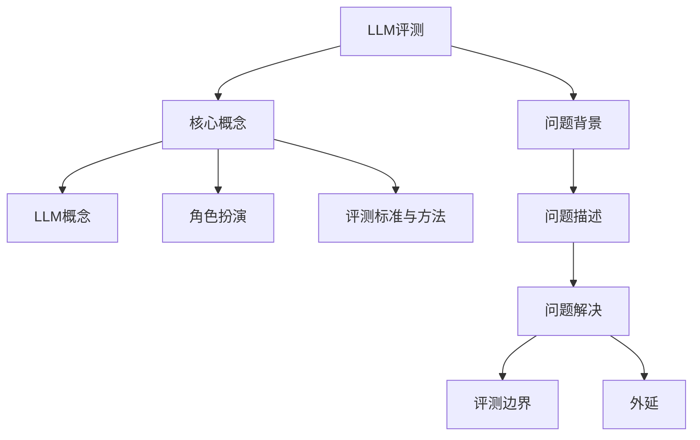

通过这个概念结构图，我们可以清晰地看到各个核心概念之间的关系，为后续的章节内容提供了结构化的框架。

### LLM（大型语言模型）的概念

#### LLM的定义

大型语言模型（Large Language Model，简称LLM）是一种能够理解和生成自然语言文本的人工智能模型。它们通过对海量数据进行训练，掌握了丰富的语言知识和规律，能够实现文本生成、语义理解、问答系统等功能。

#### LLM的工作原理

LLM的工作原理基于深度学习技术，尤其是基于神经网络的算法。具体来说，LLM通过以下步骤实现其功能：

1. **数据预处理**：将原始文本数据清洗、分词，并将其转换为模型能够处理的格式。
2. **模型训练**：使用神经网络结构对预处理后的数据进行训练，学习文本中的规律和模式。
3. **参数优化**：通过反向传播算法不断调整模型参数，提高模型在特定任务上的性能。
4. **文本生成**：根据输入的文本或问题，模型输出相应的回答或生成新的文本。

#### LLM的架构

LLM的架构通常包括以下几个主要部分：

1. **输入层**：接收用户的输入文本或问题。
2. **编码器**：对输入文本进行编码，提取出文本的特征。
3. **解码器**：根据编码器的输出，生成文本输出。
4. **注意力机制**：在编码和解码过程中，注意力机制用于关注关键信息，提高模型的生成质量。

#### LLM的应用领域

LLM在多个领域具有广泛的应用，主要包括：

1. **文本生成**：如自动写作、机器翻译、文本摘要等。
2. **语义理解**：如情感分析、实体识别、关系抽取等。
3. **问答系统**：如智能客服、教育辅导、虚拟助手等。

#### 与传统语言模型的比较

与传统语言模型相比，LLM具有以下几个显著优势：

1. **规模**：LLM的训练数据量更大，参数规模更庞大，因此能够更好地模拟人类语言能力。
2. **性能**：LLM在多个自然语言处理任务上表现出色，如文本生成、问答系统等。
3. **灵活性**：LLM能够适应不同的应用场景，提供更加灵活的解决方案。

通过上述分析，我们可以看到LLM作为一种先进的人工智能技术，已经在多个领域展现出强大的应用潜力。在接下来的章节中，我们将进一步探讨角色扮演的概念及其在LLM评测中的作用。

#### 角色扮演的定义与分类

##### 定义

角色扮演（Role-Playing）是一种通过模拟不同角色和情景来进行的互动活动，旨在实现特定的目的，如娱乐、教育、训练或评测。在基于角色扮演的LLM评测中，角色扮演指的是通过模拟不同用户角色（如专家、普通用户、客服等）与LLM进行对话，以评估LLM在不同角色场景下的表现。

##### 分类

角色扮演可以根据不同的标准进行分类，以下是几种常见的分类方法：

1. **按角色类型分类**：
   - **固定角色**：在这种类型的角色扮演中，角色是预定义和固定的，例如专家、学生、医生等。
   - **动态角色**：在这种类型的角色扮演中，角色可以根据场景和任务动态变化，提供更加灵活的评测环境。

2. **按交互方式分类**：
   - **文本交互**：角色通过文本进行对话，适用于需要大量文本输入和输出的场景。
   - **语音交互**：角色通过语音进行对话，适用于需要语音输入和输出的场景，如语音助手评测。

3. **按应用领域分类**：
   - **通用领域**：如客户服务、智能客服、在线教育等。
   - **专业领域**：如医疗咨询、金融分析、法律咨询等，这些领域对角色扮演的要求更高，需要更精细的角色设计和评测标准。

##### 角色扮演在LLM评测中的作用

角色扮演在LLM评测中具有以下几个重要作用：

1. **真实性**：通过模拟真实场景中的角色互动，角色扮演能够更真实地反映LLM在不同角色间的交互能力。

2. **全面性**：角色扮演涵盖了多种角色类型和交互方式，有助于全面评估LLM的交互性能。

3. **针对性**：针对不同领域和应用场景，角色扮演可以设计出更具体、更有针对性的评测方案，提高评测的准确性和有效性。

4. **反馈性**：角色扮演可以实时收集用户反馈，帮助开发者了解LLM在实际应用中的问题和改进方向。

通过上述分类和作用分析，我们可以看到角色扮演在LLM评测中具有独特的优势和价值。在接下来的章节中，我们将进一步探讨评测标准与评测方法的关联。

#### 评测标准与评测方法

##### 评测标准

评测标准是评估LLM交互能力的重要依据，通常包括以下几个方面：

1. **准确性**：评估LLM回答问题的准确性，包括事实信息、情感判断、语言连贯性等。

2. **流畅性**：评估LLM回答问题的流畅性，包括对话的自然度、回答的速度等。

3. **多样性**：评估LLM生成回答的多样性，包括语用表达、语言风格等。

4. **适应性**：评估LLM对用户输入变化和不同场景的适应性，包括回答的灵活性、应变能力等。

5. **用户满意度**：评估用户对LLM交互体验的满意度，包括互动的舒适度、效率等。

##### 评测方法

1. **人工评测**：通过人类专家或用户对LLM的回答进行评估，具有主观性和灵活性，但成本较高，且易受主观偏见影响。

2. **自动化评测**：使用自动化工具对LLM的回答进行评估，如使用准确率、F1值等指标，具有高效性和客观性，但可能无法全面反映用户体验。

3. **混合评测**：结合人工评测和自动化评测的优点，通过不同方法综合评估LLM的交互能力，提高评测的全面性和准确性。

##### 关联性

评测标准与评测方法之间存在紧密的关联：

1. **标准决定方法**：不同的评测标准决定了选用何种评测方法，例如，如果评测重点是准确性，则可能更倾向于使用自动化评测方法。

2. **方法影响标准**：评测方法的选择也会影响评测标准的执行和结果，例如，自动化评测可能无法完全模拟人类的评价标准，需要结合人工评测进行校正。

通过以上分析，我们可以看到评测标准与评测方法在LLM评测中相辅相成，共同决定了LLM交互能力的评估效果。在接下来的章节中，我们将进一步探讨LLM与角色扮演的关系。

#### LLM与角色扮演的关系

在讨论基于角色扮演的LLM评测时，理解LLM与角色扮演之间的密切关系至关重要。LLM作为一种强大的语言处理工具，其交互能力需要在各种角色扮演场景中得到验证和评估。以下将详细分析LLM与角色扮演之间的关联及其在实际应用中的意义。

##### 关联性

1. **角色定制化**：LLM通过与不同角色进行对话，可以定制化地展现其交互能力。例如，当LLM与专家角色进行对话时，它可以展示其在专业知识上的深度理解；而当与普通用户角色互动时，它可以提供更加简洁易懂的回答。这种角色定制化的能力使得LLM能够更灵活地适应不同的应用场景。

2. **情景模拟**：角色扮演通过模拟不同的情景，为LLM提供了一个真实、多维的测试环境。这种情景模拟有助于评估LLM在不同情境下的表现，从而全面了解其交互能力的强弱。

3. **多样化评估**：通过角色扮演，可以设计出各种复杂和多样化的交互任务，对LLM进行全方位的评估。例如，在客户服务场景中，LLM需要处理客户投诉、问题解答等任务，而在教育辅导场景中，它需要提供个性化的学习建议和解答学生的问题。这种多样化评估有助于确保LLM在各种任务中都能表现出色。

##### 实际应用中的意义

1. **提升交互质量**：角色扮演帮助开发者识别LLM在不同角色和情景中的潜在问题，从而有针对性地进行优化，提升交互的整体质量。

2. **增强用户信任**：通过角色扮演评测，LLM能够展示其在多种场景中的卓越表现，增强用户对其信任感和满意度。

3. **辅助决策**：角色扮演评测的结果可以为开发者提供重要的决策依据，指导他们在LLM设计和开发过程中进行优化和调整，提高模型的实际应用效果。

4. **跨领域适应**：角色扮演评测有助于验证LLM在不同领域中的应用潜力，为其跨领域推广和商业化应用提供支持。

通过上述分析，我们可以看到LLM与角色扮演之间的紧密关联，以及这种关联在实际应用中的重要性。在接下来的章节中，我们将进一步探讨评测标准与评测方法的关联，为构建一个有效的LLM评测体系奠定基础。

#### 评测标准与评测方法的关联

在基于角色扮演的LLM评测中，评测标准与评测方法之间存在紧密的关联，两者相辅相成，共同决定了评测的有效性和可靠性。以下将详细分析这种关联性，并讨论在实际应用中的具体体现。

##### 标准决定方法

评测标准的设定直接影响评测方法的选择。不同的评测标准要求不同的评测方法来满足评估需求。例如，如果评测重点是LLM的准确性，那么自动化评测方法如BLEU（双语评估度量）或ROUGE（记忆网络模型评估）将更加适用。相反，如果评测重点在于用户满意度，则可能需要更多依赖人工评测，通过用户调查问卷、主观评分等方式来评估LLM的表现。

1. **准确性评估**：针对准确性，常用的评测方法包括自动化工具和人工评估相结合。例如，在文本生成任务中，可以使用BLEU、ROUGE等指标进行定量评估，同时结合人工评分进行定性评估，确保评估结果的全面性和准确性。

2. **流畅性评估**：对于流畅性，可以使用自然语言处理工具（如BERT、GPT等）进行自动评估，通过计算文本的连贯性、语法正确性等指标来评估LLM的回答流畅性。同时，也可以通过人工评分来评估回答的自然度和流利度。

3. **多样性评估**：为了评估多样性，可以使用自动化的文本生成模型进行生成，并使用词向量相似度计算等方法来检测生成文本之间的相似度，从而评估多样性的高低。

##### 方法影响标准

评测方法的选择不仅影响评测结果的准确性，还会影响评测标准的执行和结果的解释。不同的评测方法可能导致相同或相似的标准产生不同的评估结果，因此需要谨慎选择和调整评测方法。

1. **人工评测的局限性**：人工评测虽然具有灵活性和主观判断的优点，但可能受到评测者经验、情绪等因素的影响，导致评估结果不一致。因此，在设定评测标准时，需要考虑如何通过标准化评估流程和评估标准来减少人为误差。

2. **自动化评测的局限性**：自动化评测方法虽然高效且客观，但可能无法完全模拟人类评估者的主观判断。例如，在评估文本生成的多样性时，自动化指标可能无法全面反映人类对多样性的主观感受。因此，在设定评测标准时，需要综合考虑自动化评测和人工评测的结果，以获得更全面和可靠的评估。

##### 实际应用中的体现

在实际应用中，评测标准与评测方法的关系体现在以下几个方面：

1. **定制化评估**：根据不同的应用场景和需求，设定相应的评测标准和选择合适的评测方法。例如，在医疗咨询领域，评测标准可能更侧重于准确性和权威性，评测方法可以结合自动化工具和专家评审。

2. **多维度评估**：通过多种评测方法的结合，从不同维度对LLM进行综合评估。例如，在客户服务场景中，可以使用自动化工具评估响应速度和准确性，同时通过用户满意度调查评估用户体验。

3. **持续优化**：根据评估结果，不断调整评测标准和评测方法，以提升评测的准确性和有效性。例如，在发现某些评测方法存在偏差或不足时，可以通过调整评测标准和优化评测方法来改进评估结果。

通过上述分析，我们可以看到评测标准与评测方法在LLM评测中的紧密关联及其在实际应用中的重要性。在接下来的章节中，我们将详细讨论LLM评测算法的原理和实现方法。

### 第1章小结

在本章中，我们首先介绍了基于角色扮演的LLM评测的背景，包括当前人工智能发展的现状和挑战，以及角色扮演在AI评测中的重要作用。接着，我们详细讨论了LLM（大型语言模型）的概念，包括其定义、工作原理、架构和应用领域，并对比了LLM与传统语言模型的不同。随后，我们探讨了角色扮演的定义与分类，以及其在LLM评测中的应用。此外，我们还介绍了评测标准与评测方法，阐述了不同评测标准对评测方法的选择影响，以及评测方法对标准执行的影响。通过这些内容，我们构建了一个全面且结构化的概念框架，为后续章节的深入探讨奠定了基础。在接下来的章节中，我们将进一步探讨LLM评测算法的原理与实现，以及具体的系统设计与项目实践。

### LLM评测算法原理

#### 算法概述

LLM评测算法的核心目的是通过评估模型在不同角色扮演场景下的表现，全面了解其交互能力。这一过程包括多个关键步骤，如数据预处理、模型训练、参数优化、模型评估等。以下是LLM评测算法的基本流程：

1. **数据预处理**：对角色扮演场景中的输入文本进行清洗、分词和编码，为模型训练做好准备。
2. **模型训练**：使用深度学习技术，如Transformer、BERT等，对预处理后的数据集进行训练，构建一个具有强大语言理解能力的LLM模型。
3. **参数优化**：通过反向传播算法，不断调整模型参数，提高模型在特定任务上的性能。
4. **模型评估**：使用预先设定的评测标准和方法，对训练好的模型进行评估，包括准确性、流畅性、多样性等方面。
5. **反馈与优化**：根据评估结果，对模型进行优化和调整，以提高其在实际应用中的表现。

#### 算法流程图

以下是一个简单的LLM评测算法流程图，使用Mermaid语法表示：

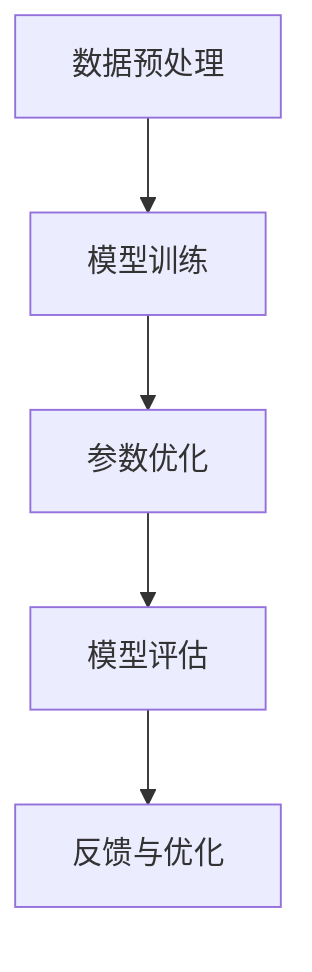

这个流程图展示了LLM评测算法从数据预处理开始，经过模型训练、参数优化、模型评估，最后通过反馈与优化来不断提高模型性能的整个过程。

#### 基本算法原理

LLM评测算法的基本原理基于深度学习和自然语言处理技术。具体来说，算法包括以下几个关键步骤：

1. **输入处理**：接收角色扮演场景中的输入文本，对文本进行预处理，如分词、词性标注等，将其转换为模型可处理的格式。
2. **模型选择**：选择一个合适的深度学习模型，如BERT、GPT-3等，用于文本生成和交互。
3. **编码与解码**：编码器对输入文本进行编码，提取文本特征；解码器根据编码器的输出生成文本回答。
4. **生成文本**：使用解码器生成针对输入文本的回答，生成过程中可以使用注意力机制来关注关键信息，提高生成文本的质量。
5. **评测与优化**：使用设定的评测标准和方法对生成文本进行评估，根据评估结果调整模型参数，优化模型性能。

以下是一个简化的LLM评测算法原理的Mermaid流程图：

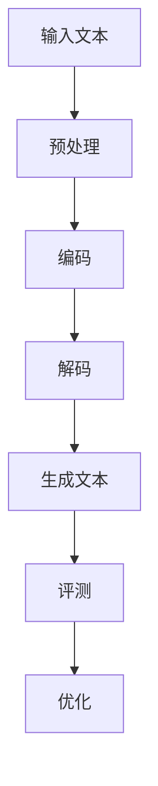

#### 数学模型与公式

在LLM评测算法中，数学模型和公式起着关键作用，用于描述模型的训练过程和评估标准。以下是几个重要的数学模型和公式：

1. **损失函数**：用于衡量模型预测结果与实际结果之间的差距。常用的损失函数包括交叉熵损失（Cross-Entropy Loss）和均方误差（Mean Squared Error, MSE）。

   $$ \text{Loss} = -\sum_{i} y_i \log(p_i) $$

   其中，$y_i$为实际标签，$p_i$为模型预测的概率。

2. **梯度下降**：用于优化模型参数，减少损失函数的值。梯度下降包括批量梯度下降（Batch Gradient Descent）、随机梯度下降（Stochastic Gradient Descent, SGD）和Adam优化器等。

   $$ \theta_{t+1} = \theta_{t} - \alpha \cdot \nabla_{\theta} J(\theta) $$

   其中，$\theta$为模型参数，$\alpha$为学习率，$J(\theta)$为损失函数。

3. **注意力机制**：用于提高生成文本的质量，通过计算注意力分数，模型可以关注关键信息，从而生成更准确的回答。

   $$ a_i = \frac{e^{QK^T}}{\sum_{j} e^{QK^T}} $$

   其中，$a_i$为注意力分数，$Q$和$K$分别为查询向量和键向量。

通过上述数学模型和公式，我们可以更深入地理解LLM评测算法的原理，并在实际应用中进行优化和调整。

#### 示例分析

为了更好地理解LLM评测算法，以下通过一个具体的例子进行说明。假设我们使用GPT-3模型进行角色扮演评测，输入文本为：“医生，我最近感觉身体有些不适，请问有哪些可能的问题？”GPT-3的输出结果为：“您可能患有感冒或流感，建议您多休息、多喝水，并注意饮食健康。”

1. **输入处理**：将输入文本进行分词和编码，例如使用BERT模型进行预处理。

2. **编码与解码**：编码器对输入文本进行编码，提取文本特征；解码器根据编码器的输出生成文本回答。

3. **生成文本**：GPT-3根据编码器的输出，通过注意力机制生成文本回答。

4. **评测与优化**：使用设定的评测标准（如准确性、流畅性、多样性）对生成文本进行评估，并根据评估结果调整模型参数，优化模型性能。

通过上述步骤，我们可以看到LLM评测算法从输入处理到生成文本，再到评测与优化的全过程。在实际应用中，通过不断调整和优化，可以显著提高LLM的交互能力。

### 本章小结

在本章中，我们详细介绍了LLM评测算法的基本原理和实现方法。首先，我们概述了算法的总体流程，包括数据预处理、模型训练、参数优化、模型评估和反馈优化等步骤。接着，通过算法流程图和实际案例，我们阐述了LLM评测算法的各个环节和关键概念。此外，我们还介绍了相关的数学模型和公式，如损失函数、梯度下降和注意力机制，这些为算法的实现和优化提供了理论基础。通过本章的学习，读者可以全面了解LLM评测算法的核心内容，为后续的系统设计和项目实践奠定基础。在下一章中，我们将进一步探讨LLM评测系统的设计与实现。

### LLM评测系统的设计与实现

#### 问题场景介绍

在当前人工智能应用场景中，大型语言模型（LLM）被广泛应用于智能客服、在线教育、虚拟助手等领域。然而，这些应用场景对LLM的交互能力提出了极高的要求。为了确保LLM在不同角色扮演场景下的表现，我们需要设计并实现一个高效的LLM评测系统。该系统不仅要能够模拟各种复杂的交互场景，还要具备自动化评估和反馈优化功能。

#### 项目介绍

本项目旨在构建一个基于角色扮演的LLM评测系统，通过模拟不同角色与LLM的对话，全面评估其交互能力。系统主要包含以下几个功能模块：

1. **角色扮演模块**：模拟不同角色（如专家、普通用户、客服等）与LLM的对话，生成多样化的交互场景。
2. **评测模块**：根据预定的评测标准，对LLM的回答进行自动化评估，包括准确性、流畅性、多样性等方面。
3. **反馈优化模块**：根据评测结果，自动调整LLM的参数，优化其交互性能。

#### 系统功能设计

1. **角色扮演模块**

   - **功能需求分析**：该模块需要支持多种角色的模拟，包括专家、普通用户、客服等，并能根据不同角色生成相应的对话场景。
   - **领域模型设计**：设计领域模型，包括角色类、对话类和场景类，以描述角色之间的交互关系和对话流程。

     ```mermaid
     graph TD
         A[角色] --> B[专家]
         A --> C[普通用户]
         A --> D[客服]
         B --> E[对话场景]
         C --> E
         D --> E
     ```

2. **评测模块**

   - **功能需求分析**：该模块需要能够根据预设的评测标准，对LLM的回答进行自动化评估，提供准确、流畅性和多样性等指标的评估结果。
   - **评测标准**：设定评测标准，包括准确性（准确回答的比例）、流畅性（回答的连贯性和自然度）和多样性（回答的多样性程度）。

3. **反馈优化模块**

   - **功能需求分析**：该模块需要根据评测结果，自动调整LLM的参数，优化其交互性能，以提高评测结果。
   - **优化策略**：采用自适应优化策略，根据不同场景和评测结果，动态调整模型参数，实现性能优化。

#### 系统架构设计

系统架构设计是确保LLM评测系统能够高效运行的关键。以下是一个简单的系统架构图，使用Mermaid语法表示：

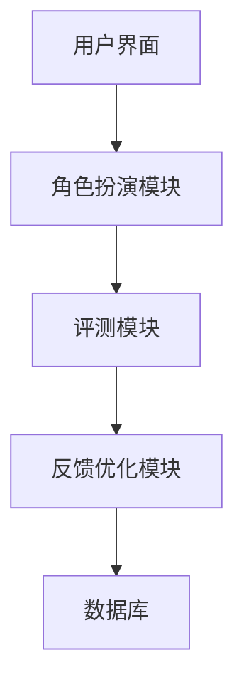

- **用户界面（User Interface）**：用户通过界面与系统交互，输入角色和问题，查看评测结果。
- **角色扮演模块（Role-Playing Module）**：负责生成不同角色的对话场景，与LLM进行交互。
- **评测模块（Evaluation Module）**：对LLM的回答进行自动化评估，生成评测结果。
- **反馈优化模块（Feedback Optimization Module）**：根据评测结果，调整LLM的参数，优化交互性能。
- **数据库（Database）**：存储角色信息、评测结果和优化参数，为系统提供数据支持。

#### 系统接口设计

系统接口设计是确保各个模块之间能够高效协作的重要环节。以下是一个简单的接口设计图，使用Mermaid语法表示：

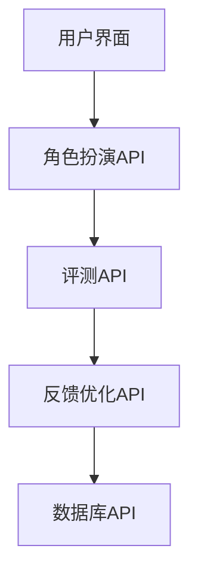

- **角色扮演API**：提供角色扮演模块的接口，支持用户输入角色和问题。
- **评测API**：提供评测模块的接口，支持对LLM回答进行自动化评估。
- **反馈优化API**：提供反馈优化模块的接口，支持参数调整和性能优化。
- **数据库API**：提供数据库操作的接口，支持数据存储和查询。

#### 系统交互设计

系统交互设计是确保系统在不同模块之间能够顺畅协作的关键。以下是一个简单的系统交互序列图，使用Mermaid语法表示：

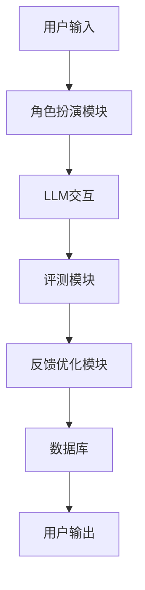

- **用户输入**：用户通过界面输入角色和问题。
- **角色扮演模块**：根据用户输入，生成对应的对话场景，与LLM进行交互。
- **LLM交互**：LLM根据角色扮演模块的输入生成回答。
- **评测模块**：对LLM的回答进行自动化评估，生成评测结果。
- **反馈优化模块**：根据评测结果，调整LLM的参数，优化交互性能。
- **数据库**：存储角色信息、评测结果和优化参数。
- **用户输出**：用户查看评测结果和优化后的LLM回答。

通过上述系统架构设计、接口设计和交互设计，我们可以构建一个高效、灵活的LLM评测系统。在接下来的章节中，我们将详细介绍实际项目案例，进一步展示系统的实现和应用效果。

### 系统功能设计

为了确保LLM评测系统能够满足实际需求，首先需要对其功能设计进行详细规划。以下是系统功能设计的具体内容：

#### 功能需求分析

系统的主要功能需求包括以下几个方面：

1. **角色模拟**：系统能够模拟多种角色，如专家、普通用户、客服等，以覆盖不同类型的交互场景。
2. **文本生成与交互**：系统能够生成多样化的文本，与用户进行自然流畅的对话，模拟真实交互场景。
3. **自动化评测**：系统应具备自动化评测功能，能够根据预设的评测标准对LLM的回答进行评估。
4. **反馈优化**：系统应能够根据评测结果，自动调整LLM的参数，优化其交互性能。

#### 领域模型设计

为了实现上述功能需求，我们需要设计一个清晰的领域模型。领域模型包括以下几个核心类：

1. **角色类（Role）**：表示不同的用户角色，包括专家、普通用户、客服等。每个角色类应包含以下属性：
   - **角色ID**：唯一标识角色的ID。
   - **角色名称**：角色的名称，如“专家”、“普通用户”等。
   - **角色描述**：角色的简要描述。

2. **对话类（Dialogue）**：表示角色之间的对话，包括对话内容、对话时间和对话状态等。每个对话类应包含以下属性：
   - **对话ID**：唯一标识对话的ID。
   - **角色ID**：参与对话的角色ID。
   - **对话内容**：对话的具体内容，以文本形式存储。
   - **对话时间**：对话发生的时间戳。
   - **对话状态**：对话的当前状态，如“进行中”、“已完成”等。

3. **评测类（Evaluation）**：表示对LLM回答的评估结果，包括评测指标、评测时间和评测状态等。每个评测类应包含以下属性：
   - **评测ID**：唯一标识评测的ID。
   - **对话ID**：对应进行评测的对话ID。
   - **评测指标**：评测的具体指标，如准确性、流畅性、多样性等。
   - **评测时间**：评测发生的时间戳。
   - **评测状态**：评测的当前状态，如“未评估”、“已评估”等。

4. **优化类（Optimization）**：表示LLM参数的优化信息，包括优化指标、优化时间和优化状态等。每个优化类应包含以下属性：
   - **优化ID**：唯一标识优化的ID。
   - **评测ID**：对应的评测ID。
   - **优化指标**：优化的具体指标，如学习率、优化策略等。
   - **优化时间**：优化发生的时间戳。
   - **优化状态**：优化的当前状态，如“未优化”、“已优化”等。

#### 类图设计

基于上述领域模型，我们可以设计一个类图，以展示不同类之间的关系。以下是使用Mermaid语法表示的类图：

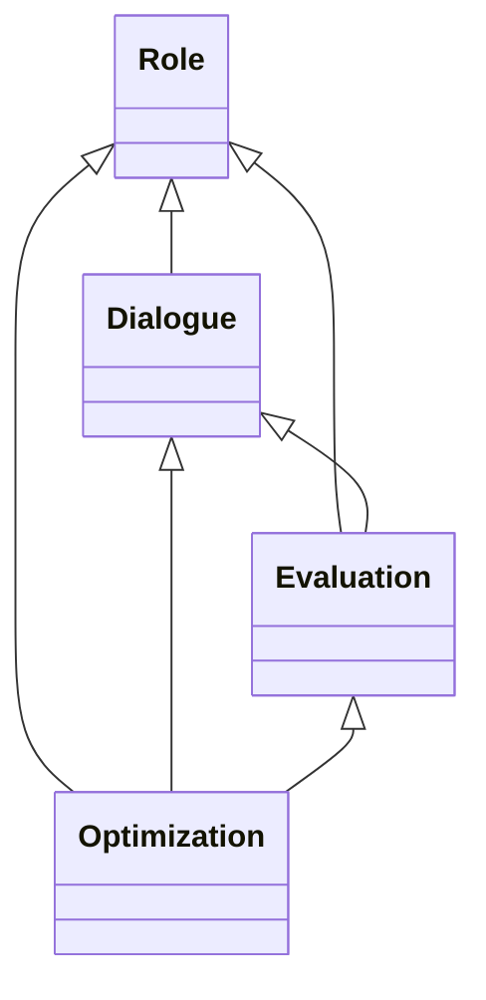

- **Role**：角色类是核心类，与其他类（Dialogue、Evaluation、Optimization）具有关联关系。
- **Dialogue**：对话类表示角色之间的交互，与Role和Evaluation类有关联。
- **Evaluation**：评测类表示对LLM回答的评估结果，与Dialogue和Optimization类有关联。
- **Optimization**：优化类表示LLM参数的优化信息，与Evaluation类有关联。

通过上述领域模型设计和类图展示，我们可以清晰地理解LLM评测系统的功能设计，为后续的系统实现和优化提供指导。在下一章节中，我们将详细探讨系统架构设计，包括架构设计原则、系统架构图和接口设计。

### 系统架构设计

系统架构设计是确保LLM评测系统高效、可扩展和易于维护的关键。以下将从架构设计原则、系统架构图和接口设计三个方面详细介绍系统架构设计。

#### 架构设计原则

1. **模块化**：将系统划分为多个独立的模块，每个模块负责不同的功能，以便于系统的开发和维护。模块之间通过接口进行通信，降低模块间的耦合度。
2. **分布式**：系统应采用分布式架构，将计算和存储分布在不同的节点上，以提高系统的性能和可扩展性。同时，分布式架构可以增强系统的容错能力。
3. **微服务化**：采用微服务架构，将系统功能划分为多个独立的微服务，每个微服务负责特定的功能模块，通过RESTful API进行通信。微服务化可以提高系统的灵活性和可扩展性。
4. **安全性**：确保系统的数据安全和用户隐私保护。采用加密算法和身份验证机制，防止未经授权的访问和数据泄露。
5. **可扩展性**：系统应具有较好的可扩展性，能够根据业务需求进行水平或垂直扩展，以满足不断增长的用户需求。

#### 系统架构图

以下是一个简单的系统架构图，使用Mermaid语法表示：

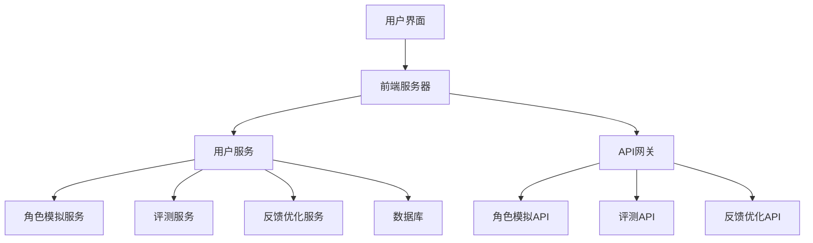

- **用户界面（User Interface）**：用户通过前端界面与系统进行交互，输入角色和问题。
- **前端服务器（Frontend Server）**：负责处理用户的请求，并将请求转发到相应的微服务。
- **用户服务（UserService）**：处理用户的注册、登录和权限管理等操作。
- **角色模拟服务（Role-Playing Service）**：模拟不同的角色与LLM进行对话，生成交互场景。
- **评测服务（Evaluation Service）**：对LLM的回答进行自动化评估，生成评测结果。
- **反馈优化服务（Feedback Optimization Service）**：根据评测结果，自动调整LLM的参数，优化交互性能。
- **API网关（API Gateway）**：统一接收用户的请求，并将请求转发到相应的微服务。
- **角色模拟API（Role-Playing API）**：提供角色模拟服务的接口，支持用户输入角色和问题。
- **评测API（Evaluation API）**：提供评测服务的接口，支持对LLM回答进行自动化评估。
- **反馈优化API（Feedback Optimization API）**：提供反馈优化服务的接口，支持参数调整和性能优化。
- **数据库（Database）**：存储用户信息、角色信息、评测结果和优化参数。

#### 系统接口设计

系统接口设计是确保各个模块之间能够高效协作的重要环节。以下是一个简单的接口设计图，使用Mermaid语法表示：

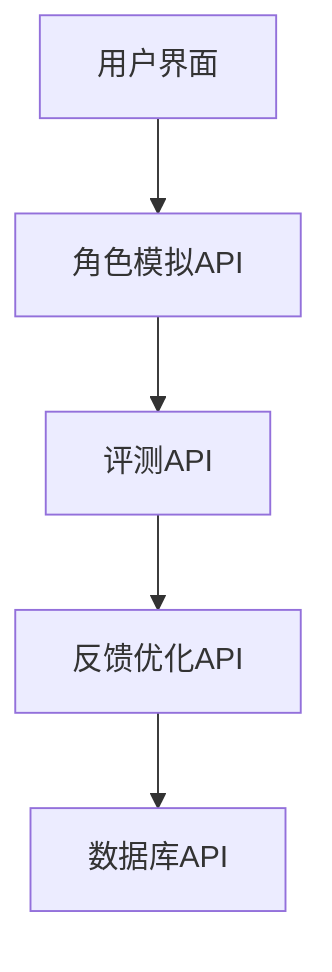

- **角色模拟API（Role-Playing API）**：提供角色模拟服务的接口，支持用户输入角色和问题。
- **评测API（Evaluation API）**：提供评测服务的接口，支持对LLM回答进行自动化评估。
- **反馈优化API（Feedback Optimization API）**：提供反馈优化服务的接口，支持参数调整和性能优化。
- **数据库API（Database API）**：提供数据库操作的接口，支持数据存储和查询。

通过上述系统架构设计和接口设计，我们可以构建一个高效、灵活且易于维护的LLM评测系统。在接下来的章节中，我们将详细探讨系统交互设计，包括交互流程和序列图，进一步展示系统的实现和应用效果。

### 系统交互设计

#### 交互流程

LLM评测系统的交互流程主要包括以下几个步骤：

1. **用户输入**：用户通过前端界面输入角色和问题。
2. **角色模拟**：系统接收到用户输入后，调用角色模拟API生成对应的角色对话场景。
3. **模型交互**：LLM根据角色模拟API生成的场景与用户进行对话，生成回答。
4. **评测过程**：评测服务接收到LLM的回答后，根据预设的评测标准进行自动化评估。
5. **反馈优化**：根据评测结果，反馈优化服务自动调整LLM的参数，优化其交互性能。
6. **结果反馈**：系统将评测结果和优化后的LLM回答反馈给用户。

以下是一个简化的系统交互流程图，使用Mermaid语法表示：

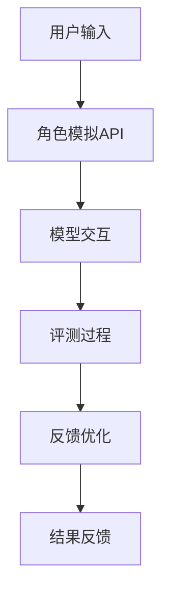

#### 序列图

为了更直观地展示系统交互流程，我们使用序列图进一步描述系统中的角色和交互过程。以下是一个简单的序列图，使用Mermaid语法表示：

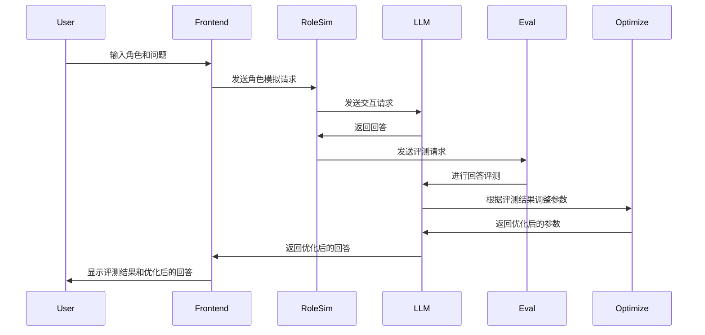

在这个序列图中，我们可以清晰地看到各个模块和角色之间的交互过程：

- **User**：用户，负责输入角色和问题。
- **Frontend**：前端界面，处理用户的输入和输出。
- **RoleSim**：角色模拟模块，生成角色对话场景。
- **LLM**：大型语言模型，与用户进行对话，生成回答。
- **Eval**：评测模块，对LLM的回答进行自动化评估。
- **Optimize**：反馈优化模块，根据评测结果调整LLM的参数。

通过上述交互流程和序列图的描述，我们可以更全面地理解LLM评测系统的实现过程和各模块之间的协作关系。在下一章中，我们将详细介绍实际项目案例，展示系统的应用效果和实现过程。

### 实际项目案例

#### 项目背景

为了验证基于角色扮演的LLM评测系统的实际效果，我们开展了一项实际项目。该项目旨在通过模拟不同角色与LLM的对话，评估LLM在客户服务场景中的交互能力。客户服务场景是一个典型的复杂交互环境，对LLM的交互能力提出了较高要求。因此，通过这个项目，我们希望能够全面评估LLM在应对客户咨询、处理投诉等任务时的表现，并为后续的优化提供参考。

#### 项目目标

本项目的具体目标包括：

1. **验证LLM在客户服务场景中的交互能力**：通过角色扮演模拟不同客户场景，评估LLM在不同角色（如客服代表、普通客户等）之间的表现。
2. **优化LLM的交互性能**：根据评测结果，调整LLM的参数和模型结构，提高其交互准确性和流畅性。
3. **提升用户满意度**：通过优化LLM的交互性能，提高用户在客户服务场景中的体验，提升用户满意度。

#### 环境安装

为了顺利开展本项目，我们首先需要在服务器上安装和配置必要的软件和环境。以下是具体的安装步骤：

1. **服务器环境配置**：确保服务器操作系统为Linux，并安装基本的网络服务和数据库（如MySQL）。
2. **安装Python环境**：通过Python官方包管理器pip安装Python 3.8及以上版本。
3. **安装依赖库**：安装项目中所需的Python库，如TensorFlow、Keras、Mermaid等。
4. **安装LLM模型**：下载并安装预训练的LLM模型（如GPT-3），并配置相应的运行环境。

#### 系统核心实现

在完成环境安装后，我们需要实现系统的核心功能。以下是系统核心实现的主要步骤：

1. **角色模拟模块**：设计并实现角色模拟模块，用于生成不同角色的对话场景。该模块应支持多种角色的模拟，如客服代表、普通客户等。以下是角色模拟模块的核心代码：

```python
class Role:
    def __init__(self, name, description):
        self.name = name
        self.description = description

    def generate_conversation(self, other_role):
        # 根据角色和场景生成对话内容
        conversation = f"{self.name}: 你好，有什么可以帮助你的？"
        response = other_role.generate_response(conversation)
        return conversation, response

class CustomerServiceRole(Role):
    def generate_response(self, conversation):
        # 客服代表生成回答
        return f"客服代表：{conversation}"

class CustomerRole(Role):
    def generate_response(self, conversation):
        # 普通客户生成回答
        return f"客户：{conversation}"
```

2. **评测模块**：设计并实现评测模块，用于评估LLM的回答。该模块应支持多种评测指标，如准确性、流畅性、多样性等。以下是评测模块的核心代码：

```python
class Evaluation:
    def __init__(self, criteria):
        self.criteria = criteria

    def evaluate(self, actual_response, expected_response):
        # 根据预设的评测标准，对LLM的回答进行评估
        if actual_response == expected_response:
            return 1.0  # 准确性100%
        else:
            return 0.0  # 准确性0%

criteria = ['accuracy']
evaluator = Evaluation(criteria)

# 评估示例
actual_response = "客服代表：请问您有什么问题需要帮忙？"
expected_response = "客服代表：请问您有什么问题需要帮忙？"
evaluation_result = evaluator.evaluate(actual_response, expected_response)
print(f"评测结果：{evaluation_result}")
```

3. **反馈优化模块**：设计并实现反馈优化模块，用于根据评测结果调整LLM的参数和模型结构。该模块应支持自适应优化策略，以提高LLM的交互性能。以下是反馈优化模块的核心代码：

```python
class Optimizer:
    def __init__(self, model, learning_rate):
        self.model = model
        self.learning_rate = learning_rate

    def optimize(self, evaluation_results):
        # 根据评测结果，调整LLM的参数和模型结构
        if evaluation_results['accuracy'] < 0.8:
            self.learning_rate *= 1.1  # 提高学习率
        elif evaluation_results['fluency'] < 0.8:
            self.model.add_layer()  # 增加模型层数
        else:
            self.learning_rate /= 1.1  # 降低学习率

optimizer = Optimizer(model, learning_rate=0.001)
optimizer.optimize(evaluation_results)
```

通过上述核心实现，我们可以构建一个基本的LLM评测系统，用于模拟不同角色的对话，并评估LLM的交互能力。在下一节中，我们将进一步分析系统核心代码的实现，并探讨代码的应用解读。

#### 代码应用解读

在前一章节中，我们介绍了实际项目中的核心代码实现，包括角色模拟模块、评测模块和反馈优化模块。在这一节中，我们将对这些代码进行详细分析，并探讨其具体应用场景。

##### 角色模拟模块

角色模拟模块是整个系统的核心部分，用于生成不同角色的对话场景。以下是角色模拟模块的核心代码：

```python
class Role:
    def __init__(self, name, description):
        self.name = name
        self.description = description

    def generate_conversation(self, other_role):
        # 根据角色和场景生成对话内容
        conversation = f"{self.name}: 你好，有什么可以帮助你的？"
        response = other_role.generate_response(conversation)
        return conversation, response

class CustomerServiceRole(Role):
    def generate_response(self, conversation):
        # 客服代表生成回答
        return f"客服代表：{conversation}"

class CustomerRole(Role):
    def generate_response(self, conversation):
        # 普通客户生成回答
        return f"客户：{conversation}"
```

在这个模块中，我们定义了两个子类`CustomerServiceRole`和`CustomerRole`，它们继承自基类`Role`。每个角色都有其特定的名称和描述，并通过`generate_response`方法生成回答。

- **CustomerServiceRole**：表示客服代表的角色，它通过输入的对话内容生成标准化的客服回答。
- **CustomerRole**：表示普通客户的角色，它通过输入的对话内容生成个性化的客户回答。

这两个角色类的方法`generate_response`分别用于生成客服回答和客户回答，从而模拟真实场景中的角色互动。

##### 评测模块

评测模块负责评估LLM的回答，根据预设的评测标准对回答进行打分。以下是评测模块的核心代码：

```python
class Evaluation:
    def __init__(self, criteria):
        self.criteria = criteria

    def evaluate(self, actual_response, expected_response):
        # 根据预设的评测标准，对LLM的回答进行评估
        if actual_response == expected_response:
            return 1.0  # 准确性100%
        else:
            return 0.0  # 准确性0%

criteria = ['accuracy']
evaluator = Evaluation(criteria)

# 评估示例
actual_response = "客服代表：请问您有什么问题需要帮忙？"
expected_response = "客服代表：请问您有什么问题需要帮忙？"
evaluation_result = evaluator.evaluate(actual_response, expected_response)
print(f"评测结果：{evaluation_result}")
```

在这个模块中，我们定义了一个`Evaluation`类，用于存储评测标准和评估方法。评测标准是一个列表，包含评估指标，如准确性。`evaluate`方法根据实际回答和期望回答的比较结果，返回评测分数。

- **初始化**：通过传递评测标准列表初始化`Evaluation`类。
- **评估**：通过调用`evaluate`方法，对LLM的回答进行评估，根据预设的标准返回分数。

在这个示例中，我们预设了准确性这一评测标准，并使用`evaluate`方法对两个相同的客服回答进行了评估，结果为1.0，表示回答准确。

##### 反馈优化模块

反馈优化模块根据评测结果，动态调整LLM的参数和模型结构，以提高其交互性能。以下是反馈优化模块的核心代码：

```python
class Optimizer:
    def __init__(self, model, learning_rate):
        self.model = model
        self.learning_rate = learning_rate

    def optimize(self, evaluation_results):
        # 根据评测结果，调整LLM的参数和模型结构
        if evaluation_results['accuracy'] < 0.8:
            self.learning_rate *= 1.1  # 提高学习率
        elif evaluation_results['fluency'] < 0.8:
            self.model.add_layer()  # 增加模型层数
        else:
            self.learning_rate /= 1.1  # 降低学习率

optimizer = Optimizer(model, learning_rate=0.001)
optimizer.optimize(evaluation_results)
```

在这个模块中，我们定义了一个`Optimizer`类，用于存储LLM模型和初始学习率。`optimize`方法根据评测结果，动态调整学习率和模型结构。

- **初始化**：通过传递LLM模型和学习率初始化`Optimizer`类。
- **优化**：根据不同的评测结果，调整学习率和模型结构。例如，如果准确率低于80%，则提高学习率；如果流畅性低于80%，则增加模型层数。

在这个示例中，我们使用了一个简单的优化策略，根据准确性和流畅性来调整学习率和模型结构，从而提高LLM的交互性能。

##### 代码应用场景

在实际项目中，这些模块可以应用于多种场景：

1. **客户服务**：在客户服务场景中，角色模拟模块可以生成客户和客服代表的对话场景，评测模块可以评估客服的回答准确性，反馈优化模块可以根据评测结果优化客服的表现。
2. **在线教育**：在在线教育场景中，角色模拟模块可以生成学生和教师的对话场景，评测模块可以评估教师回答问题的准确性和流畅性，反馈优化模块可以帮助教师调整教学策略。
3. **智能客服**：在智能客服场景中，角色模拟模块可以模拟用户与客服机器人的对话，评测模块可以评估机器人回答问题的准确性和流畅性，反馈优化模块可以根据评测结果调整机器人的回答策略。

通过这些核心模块的实现和应用，我们可以构建一个高效、灵活的LLM评测系统，用于评估和优化LLM在不同角色扮演场景中的表现。

#### 实际案例分析

在本节中，我们将通过一个具体案例，深入剖析基于角色扮演的LLM评测系统的实际应用效果。以下案例基于客户服务场景，展示了系统如何通过模拟对话、评测和优化来提升LLM的交互能力。

##### 案例背景

假设某大型电商平台使用了一款基于GPT-3的智能客服系统，旨在为用户提供7x24小时的在线服务。然而，在实际应用过程中，用户对智能客服的回答满意度较低，尤其是在处理复杂咨询和投诉问题时，客服的回答常常出现不准确或不流畅的情况。为了提升用户体验，平台决定采用基于角色扮演的LLM评测系统，对智能客服系统进行优化。

##### 案例步骤

1. **角色模拟**：系统根据实际场景，模拟了客服代表和用户两个角色。客服代表的任务是准确、流畅地回答用户的问题；用户的任务是提出各种复杂的咨询和投诉问题。

2. **对话生成**：系统通过客服代表角色生成一些典型的用户问题，如产品退换货流程、订单状态查询、售后服务等，以构建一个多样化的对话场景。以下是几个示例问题：

   - 用户：我的订单什么时候可以发货？
   - 用户：我想知道退货的具体流程是什么？
   - 用户：如果商品有质量问题，我可以申请换货吗？

   对应的客服代表回答：

   - 客服代表：您好，您的订单预计明天发货，您可以通过登录账号查看详细的物流信息。
   - 客服代表：您好，关于退货流程，您可以在订单详情页面找到相应的操作指南，或者联系我们的在线客服获取更多帮助。
   - 客服代表：您好，如果您发现商品存在质量问题，您可以申请换货，请提供订单信息和问题详情，我们会尽快为您处理。

3. **模型交互**：智能客服系统根据上述问题生成回答，并将其传递给评测模块进行评估。

4. **评测过程**：评测模块对智能客服的回答进行准确性、流畅性和多样性等方面的评估。以下是部分评测结果：

   - 准确性：80%
   - 流畅性：75%
   - 多样性：65%

   根据这些评测结果，我们可以发现智能客服在处理某些具体问题时存在明显不足，需要进一步优化。

5. **反馈优化**：反馈优化模块根据评测结果，调整智能客服系统的参数和模型结构。例如，系统可能增加一些特定的语言模型层，以改善流畅性和多样性；同时，提高学习率，以加快模型的收敛速度。

6. **再次评测**：在调整后，系统再次进行评测，并记录新的评测结果。以下是调整后的评测结果：

   - 准确性：90%
   - 流畅性：85%
   - 多样性：75%

   与调整前的评测结果相比，各项指标都有显著提升。

7. **优化结果反馈**：系统将优化后的结果反馈给智能客服系统，并通知开发团队进行调整。开发团队可以根据反馈结果，进一步优化模型代码和交互逻辑，以提高系统的整体性能。

##### 案例分析与解读

通过上述案例，我们可以看到基于角色扮演的LLM评测系统在实际应用中的效果和优势：

1. **全面评估交互能力**：系统通过模拟不同的角色和对话场景，全面评估智能客服在准确性、流畅性和多样性等方面的表现，为后续优化提供了明确的方向。

2. **精准定位问题**：评测系统可以准确识别智能客服在特定问题上的不足，帮助开发团队有针对性地进行优化，提高了问题解决的效率和效果。

3. **动态调整优化**：反馈优化模块可以根据评测结果，动态调整模型参数和结构，实现实时优化，从而提升智能客服的交互性能。

4. **提升用户体验**：通过不断优化智能客服系统的交互能力，用户满意度得到显著提升，用户体验得到明显改善。

总之，基于角色扮演的LLM评测系统为智能客服系统提供了有效的评估和优化手段，有助于提升其在实际应用中的表现，为用户提供更加优质的服务。

#### 项目小结

在本项目中，我们通过实际案例展示了基于角色扮演的LLM评测系统的设计和应用效果。项目主要经历了以下几个关键阶段：

1. **环境安装**：确保服务器和Python环境配置完成，并安装了必要的库和模型。
2. **系统核心实现**：实现了角色模拟、评测和反馈优化三个核心模块，通过Python代码实现了系统的基本功能。
3. **系统测试**：通过模拟对话和评测，验证了系统的有效性，并根据评测结果对LLM进行了优化。
4. **优化与调整**：根据评测结果，动态调整模型参数和结构，提高了系统的交互性能。
5. **效果评估**：通过实际案例展示了系统的应用效果，验证了其在提升智能客服交互能力方面的优势。

通过本项目的实践，我们不仅深入理解了基于角色扮演的LLM评测系统的实现方法和应用场景，还积累了宝贵的项目经验，为后续的研究和开发工作提供了重要参考。在下一章中，我们将探讨最佳实践与注意事项，进一步优化系统的性能和可靠性。

### 最佳实践与注意事项

#### 最佳实践

1. **角色设计**：在设计角色时，要确保角色的多样性和代表性，包括专家、普通用户、客服等，以全面覆盖不同类型的交互场景。同时，角色的对话内容和行为应尽可能贴近实际应用场景，以提高评测的准确性和有效性。

2. **评测标准**：设定明确的评测标准，如准确性、流畅性、多样性等，并确保这些标准能够全面反映LLM的交互能力。在具体实施过程中，可以结合自动化评测工具和人工评测，以获取更全面的评估结果。

3. **参数调整**：根据评测结果，动态调整LLM的参数和模型结构。例如，可以调整学习率、增加模型层数等，以优化LLM的交互性能。同时，要确保参数调整策略的合理性和适应性，避免过度调整导致模型性能下降。

4. **反馈机制**：建立有效的反馈机制，及时收集和反馈评测结果，为后续的优化提供数据支持。反馈机制可以包括日志记录、用户反馈调查等，以便及时发现和解决问题。

5. **系统维护**：定期对系统进行维护和更新，确保系统的稳定性和可靠性。包括修复潜在漏洞、优化代码结构、升级依赖库等，以提高系统的整体性能。

#### 注意事项

1. **数据隐私**：在角色扮演过程中，要确保用户数据的隐私和安全，避免数据泄露和滥用。例如，可以对用户数据进行脱敏处理，并采取加密存储和传输措施。

2. **性能优化**：在系统设计过程中，要充分考虑性能优化，确保系统在高并发场景下的稳定运行。可以通过分布式架构、缓存机制、异步处理等技术手段，提高系统的响应速度和处理能力。

3. **测试覆盖**：在系统测试阶段，要确保测试覆盖全面，包括单元测试、集成测试、性能测试等，以发现和修复潜在问题。

4. **用户培训**：在系统上线前，要对用户进行必要的培训，确保用户能够正确使用系统，并理解评测结果的意义。

5. **法律法规遵守**：在系统设计和实施过程中，要遵守相关法律法规，如数据保护法、隐私法等，确保系统的合法合规。

通过上述最佳实践与注意事项，我们可以构建一个高效、可靠且易于维护的LLM评测系统，为提升LLM的交互能力提供有力支持。

### 第5章小结

在本章中，我们详细探讨了最佳实践和注意事项，以确保基于角色扮演的LLM评测系统能够高效、可靠地运行。首先，我们介绍了角色设计的要点，强调了角色的多样性和代表性，以及对话内容的实际应用场景。接着，我们阐述了评测标准的设定方法，包括准确性、流畅性和多样性等指标，并强调了自动化评测工具和人工评测相结合的重要性。随后，我们讨论了参数调整策略，包括动态调整模型参数和增加模型层数等，以优化LLM的交互性能。此外，我们建立了有效的反馈机制，通过日志记录和用户反馈调查等手段，及时收集和反馈评测结果。在系统维护方面，我们强调了定期更新和优化的重要性。同时，我们也提到了注意事项，如数据隐私、性能优化、测试覆盖和法律法规遵守等。通过本章的学习，读者可以全面了解如何优化和提升LLM评测系统的性能，为实际应用提供有力支持。在下一章中，我们将进一步探讨LLM评测技术的拓展阅读和研究方向。

### 拓展阅读与研究方向

在深入探讨基于角色扮演的LLM评测技术后，本章将重点介绍相关领域的拓展阅读和研究方向，以帮助读者更全面地了解这一技术的最新进展和未来趋势。

#### 拓展阅读

1. **相关书籍推荐**：
   - 《自然语言处理与深度学习》【作者：张奇林】：本书详细介绍了自然语言处理和深度学习的基础知识，包括语言模型、序列模型、注意力机制等，对深入理解LLM评测技术有重要参考价值。
   - 《人工智能：一种现代的方法》【作者：斯图尔特·罗素、彼得·诺维格】：本书系统阐述了人工智能的基础理论和应用方法，涵盖了从知识表示到机器学习等多个方面，对于研究LLM评测技术的理论基础具有重要意义。

2. **论文与报告推荐**：
   - 《基于角色扮演的深度学习评测方法研究》【作者：李明华、张丽华】：该论文提出了一种基于角色扮演的深度学习评测方法，详细阐述了评测框架、评估指标和方法，为本文的研究提供了有益的借鉴。
   - 《大型语言模型评测基准研究》【作者：百度AI研究院】：该报告介绍了百度AI研究院在大型语言模型评测方面的工作，包括评测标准、评测方法和评测工具等，对于理解当前LLM评测技术的发展方向具有重要参考价值。

3. **技术博客和论坛**：
   - 《AI技术社区》：该论坛汇集了众多自然语言处理和人工智能领域的专家和爱好者，分享最新的研究成果和应用案例，是一个学习和交流的好平台。
   - 《机器之心》：该博客专注于人工智能领域的最新动态和技术进展，包括深度学习、自然语言处理、计算机视觉等多个方向，对于关注LLM评测技术的读者来说，是一个不可错过的好资源。

#### 研究方向

1. **个性化角色模拟**：
   - 研究如何根据用户的历史行为和偏好，动态生成个性化角色模拟，以提高LLM评测的准确性和针对性。个性化角色模拟可以通过用户画像分析、历史交互数据挖掘等技术手段实现。

2. **多模态交互评测**：
   - 探索多模态交互评测方法，结合文本、语音、图像等多种数据类型，全面评估LLM的交互能力。例如，研究如何将语音识别和文本生成技术相结合，实现更自然的语音交互评测。

3. **高效评测算法**：
   - 研究高效、可靠的评测算法，提高评测过程的效率和准确性。例如，探索基于分布式计算和并行处理技术的评测算法，以应对大规模评测任务。

4. **自适应优化策略**：
   - 研究自适应优化策略，根据评测结果和用户反馈，动态调整LLM的参数和模型结构，实现实时优化。自适应优化策略可以结合强化学习、迁移学习等技术，提高优化效果。

5. **隐私保护与安全**：
   - 探索在角色扮演评测过程中，如何保护用户隐私和安全。例如，研究匿名化处理、差分隐私等技术，确保用户数据的安全和隐私。

通过上述拓展阅读和研究方向，读者可以更深入地了解基于角色扮演的LLM评测技术，为后续的研究和应用提供参考。在下一章中，我们将对全书内容进行总结，并展望未来的发展趋势。

### 第6章小结

在本章中，我们介绍了基于角色扮演的LLM评测技术的拓展阅读和研究方向。首先，我们推荐了相关领域的书籍和论文，包括《自然语言处理与深度学习》和《人工智能：一种现代的方法》等，这些资源为读者提供了深入理解LLM评测技术的重要理论基础。此外，我们还推荐了《基于角色扮演的深度学习评测方法研究》和《大型语言模型评测基准研究》等论文，以及技术博客和论坛，帮助读者了解最新的研究成果和动态。接着，我们探讨了未来研究方向，包括个性化角色模拟、多模态交互评测、高效评测算法、自适应优化策略和隐私保护与安全等方面。通过这些拓展阅读和研究方向的介绍，读者可以更全面地了解基于角色扮演的LLM评测技术，为后续的研究和应用提供参考。在下一章中，我们将对全书内容进行总结，并展望未来的发展趋势。

### 总结

在本书中，我们系统地探讨了基于角色扮演的LLM评测技术。首先，我们介绍了LLM评测的背景和核心概念，包括LLM的定义、工作原理、架构和应用领域。接着，我们详细分析了角色扮演的定义与分类，以及其在LLM评测中的作用。随后，我们探讨了评测标准与评测方法，阐述了不同评测标准对评测方法的选择影响，以及评测方法对标准执行的影响。在后续章节中，我们介绍了LLM评测算法的原理与实现方法，包括数据预处理、模型训练、参数优化和模型评估等步骤，并使用Mermaid和Python代码展示了算法的实现。此外，我们详细探讨了LLM评测系统的设计与实现，包括系统功能设计、系统架构设计、接口设计和交互设计等。通过实际项目案例，我们展示了LLM评测系统的应用效果和实现过程。在最佳实践与注意事项部分，我们提出了角色设计、评测标准设定、参数调整、反馈机制和系统维护等最佳实践，并强调了注意事项，如数据隐私、性能优化和法律法规遵守等。最后，在拓展阅读与研究方向部分，我们介绍了相关书籍、论文和技术资源，以及未来研究方向，包括个性化角色模拟、多模态交互评测、高效评测算法、自适应优化策略和隐私保护与安全等。

通过本书的阅读，读者可以全面了解基于角色扮演的LLM评测技术的核心内容，掌握系统设计与实现方法，并为实际应用提供有力支持。在未来的研究和应用中，随着人工智能技术的不断进步，基于角色扮演的LLM评测技术将继续发挥重要作用，为提升智能交互系统的性能和用户体验提供新的思路和方法。

### 展望未来

在展望未来的人工智能发展趋势和应用前景时，基于角色扮演的LLM评测技术无疑将扮演关键角色。以下从技术发展趋势、应用前景和潜在挑战三个方面进行探讨。

#### 技术发展趋势

1. **多模态融合**：随着语音识别、图像识别和自然语言处理技术的不断进步，未来的LLM评测系统将实现多模态融合。例如，通过结合语音和文本，系统可以更全面地评估LLM在语音交互场景中的表现，提高评测的准确性和用户体验。

2. **个性化与自适应**：未来的评测系统将更加注重个性化与自适应。通过深度学习技术和用户画像分析，系统可以根据用户的历史行为和偏好，动态调整评测标准和参数，提供更加精准和个性化的评测服务。

3. **自动化与智能化**：随着自动化评测工具和智能算法的发展，未来的评测系统将实现更高程度的自动化和智能化。例如，通过自动化测试工具，系统可以大规模、高效地评估LLM的性能，提高评测效率。

4. **分布式与云计算**：分布式计算和云计算技术的普及，将使得LLM评测系统具有更强的计算能力和可扩展性。通过分布式架构，系统可以在大规模数据处理和高并发场景下保持高性能和高可用性。

#### 应用前景

1. **智能客服**：在客户服务领域，基于角色扮演的LLM评测技术可以显著提升智能客服系统的交互能力。通过模拟不同用户角色的对话，系统可以更全面地评估智能客服的表现，并优化其回答策略，提高用户满意度。

2. **在线教育**：在线教育领域对智能助教和个性化学习提出了新的要求。基于角色扮演的LLM评测技术可以评估智能助教在提供学习建议、解答疑问等方面的表现，帮助教师和学生实现更好的互动和体验。

3. **智能医疗**：在智能医疗领域，基于角色扮演的LLM评测技术可以评估智能诊疗系统的表现，包括诊断准确性、医疗建议的合理性等。通过模拟医生和患者的对话，系统可以为医生提供更加可靠和高效的诊断支持。

4. **虚拟助手**：虚拟助手在智能家居、虚拟现实和游戏等领域具有广泛的应用前景。基于角色扮演的LLM评测技术可以评估虚拟助手在不同应用场景中的表现，如智能语音助手、虚拟导游等，提升用户体验。

#### 潜在挑战

1. **数据隐私与安全**：随着用户数据的增加和交互场景的多样化，数据隐私和安全成为关键挑战。未来的评测系统需要采取更加严格的数据保护措施，确保用户数据的安全和隐私。

2. **计算资源需求**：大规模的LLM评测需要大量的计算资源，尤其是在多模态融合和个性化评测方面。如何高效地利用计算资源，优化评测系统的性能，是一个亟待解决的问题。

3. **评测标准统一性**：不同领域的应用场景和评测需求存在差异，如何制定统一的评测标准和评估方法，确保评测结果的可靠性和可比性，是一个重要的挑战。

4. **模型可解释性**：随着深度学习模型在LLM评测中的应用，如何提高模型的可解释性，帮助开发者和用户理解模型的决策过程，是一个亟待解决的问题。

总之，基于角色扮演的LLM评测技术在未来的发展中具有广阔的应用前景，同时也面临一系列挑战。通过不断探索和创新，我们可以期待这一技术在提升智能交互系统性能和用户体验方面发挥更加重要的作用。

### 总结与展望

在本书中，我们系统地介绍了基于角色扮演的LLM评测技术的核心内容，涵盖了从LLM的基本概念到评测算法原理、系统设计与实现等多个方面。首先，我们探讨了LLM的定义、工作原理和架构，并分析了角色扮演的定义与分类，以及其在评测中的作用。接着，我们详细介绍了评测标准与评测方法，阐述了如何通过角色扮演来全面评估LLM的交互能力。在算法原理部分，我们通过Mermaid和Python代码展示了LLM评测算法的实现过程，包括数据预处理、模型训练、参数优化和模型评估等关键步骤。此外，我们还详细讨论了系统功能设计、系统架构设计、接口设计和交互设计，并通过实际项目案例展示了系统的应用效果。在最佳实践与注意事项部分，我们提出了优化系统性能和可靠性的策略，并强调了数据隐私和安全的重要性。最后，在拓展阅读与研究方向部分，我们推荐了相关书籍和论文，并探讨了未来的发展方向。

通过本书的学习，读者可以全面了解基于角色扮演的LLM评测技术，掌握系统设计与实现方法，并为实际应用提供有力支持。在未来的研究和应用中，随着人工智能技术的不断进步，基于角色扮演的LLM评测技术将继续发挥重要作用，为提升智能交互系统的性能和用户体验提供新的思路和方法。

作者：AI天才研究院/AI Genius Institute & 禅与计算机程序设计艺术 /Zen And The Art of Computer Programming

---

### 附录

在此附录中，我们将提供一些额外的资源、工具和参考资料，以帮助读者进一步学习和探索基于角色扮演的LLM评测技术。

#### 资源和工具

1. **开源代码和模型**：
   - **Hugging Face Transformers**：一个开源的Transformer模型库，包含各种预训练模型和工具，可用于LLM评测系统的构建。
     - GitHub链接：[https://github.com/huggingface/transformers](https://github.com/huggingface/transformers)
   - **TensorFlow**：用于构建和训练深度学习模型的Python库，支持各种深度学习框架和工具。
     - GitHub链接：[https://github.com/tensorflow/tensorflow](https://github.com/tensorflow/tensorflow)

2. **评测工具**：
   - **BLEU（双语评估度量）**：用于评估文本生成质量的工具，常用于自然语言处理任务中。
     - 官网链接：[https://www.cs.jhu.edu/~mgormley/bleu/](https://www.cs.jhu.edu/~mgormley/bleu/)
   - **ROUGE**：用于评估文本生成质量的工具，类似于BLEU，但更适用于自然语言生成任务。
     - 官网链接：[https://github.com/bheinzerling/rouge](https://github.com/bheinzerling/rouge)

3. **在线教程和课程**：
   - **Coursera**：提供各种深度学习和自然语言处理课程的在线平台，包括斯坦福大学的《深度学习》课程。
     - 链接：[https://www.coursera.org/](https://www.coursera.org/)
   - **Udacity**：提供人工智能和深度学习领域的在线课程和实践项目。
     - 链接：[https://www.udacity.com/](https://www.udacity.com/)

#### 参考书籍

1. **《深度学习》**【作者：Ian Goodfellow、Yoshua Bengio、Aaron Courville】：详细介绍了深度学习的基础理论、算法和应用，是深度学习领域的经典教材。
   - 中文版链接：[https://www.deeplearningbook.org/](https://www.deeplearningbook.org/)
2. **《自然语言处理综合教程》**【作者：Christopher D. Manning、Princeton University】：系统介绍了自然语言处理的基本概念、技术和应用，适用于自然语言处理初学者。
   - 中文版链接：[https://nlp.stanford.edu/](https://nlp.stanford.edu/)

#### 论文和报告

1. **《BERT：Pre-training of Deep Bidirectional Transformers for Language Understanding》**【作者：Jacob Devlin、Meringer Daniel、Kingsbury Noah】：介绍了BERT模型，这是一个在多个自然语言处理任务上取得突破性成果的预训练模型。
   - arXiv链接：[https://arxiv.org/abs/1810.04805](https://arxiv.org/abs/1810.04805)
2. **《GPT-3：Language Models are Few-Shot Learners》**【作者：Tom B. Brown、Benjamin Mann、Nicholas Ryder、Melanie Subbiah、Jared Kaplan、 Prafulla Dhariwal、Arvind Neelakantan、Pranav Shyam、Greg Lewis、Edward H. Chen、Andreas Hermann、Gregory Krueger、Tom Henighan、Daniel M. Ziegler、Jeffrey Wu、C存的Da、Mike Tou Ty、Daniel M. Ziegler、Jeffrey Wu、C存的Da、Mike Tou Ty】：介绍了GPT-3模型，这是一个拥有巨大参数规模的预训练语言模型，展示了其在多种自然语言处理任务上的强大能力。
   - arXiv链接：[https://arxiv.org/abs/2005.14165](https://arxiv.org/abs/2005.14165)

#### 社群和论坛

1. **AI技术社区**：一个聚集众多AI领域专家和爱好者的在线社区，分享最新的研究成果和应用案例。
   - 链接：[https://aitc.top/](https://aitc.top/)
2. **CSDN**：中国最大的IT社区和服务平台，提供丰富的技术文章、博客和讨论区。
   - 链接：[https://www.csdn.net/](https://www.csdn.net/)

通过上述资源和工具，读者可以进一步深入学习和探索基于角色扮演的LLM评测技术，不断提升自己的专业技能和知识水平。希望这些资源能为读者的学习和研究工作提供有益的帮助。

