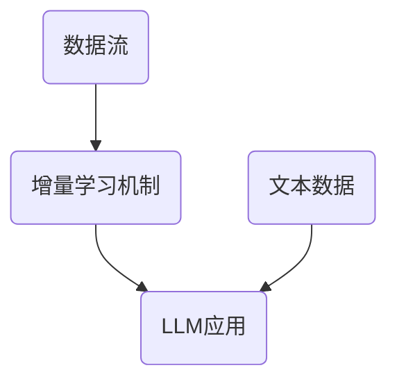
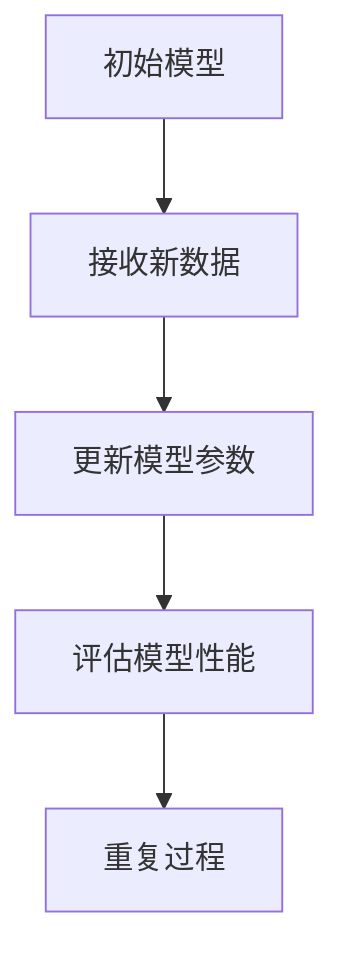
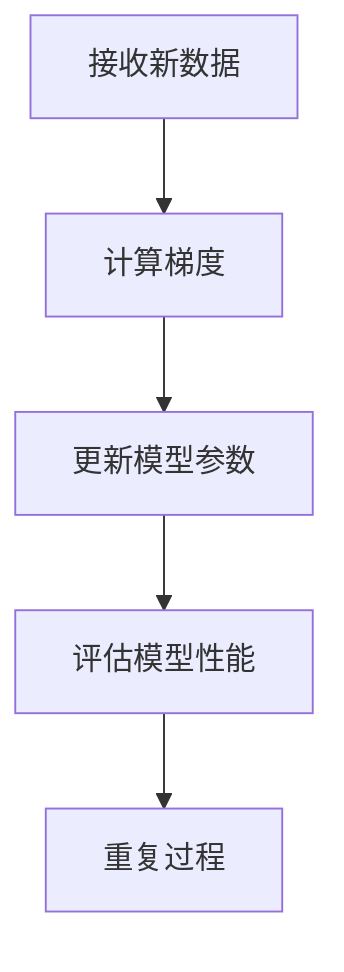
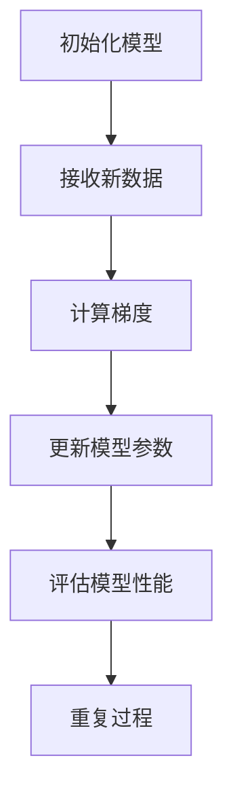
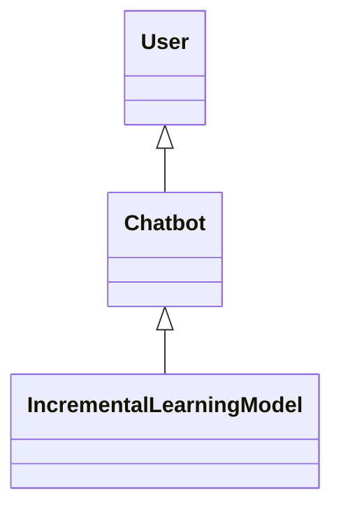
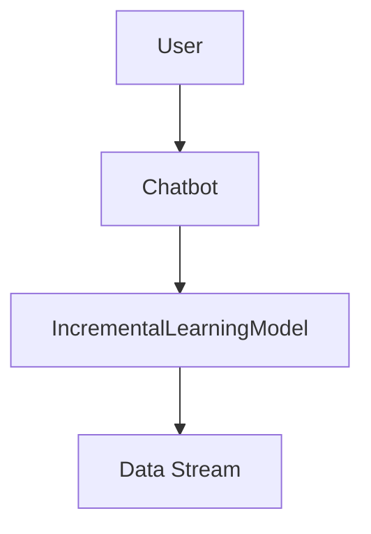
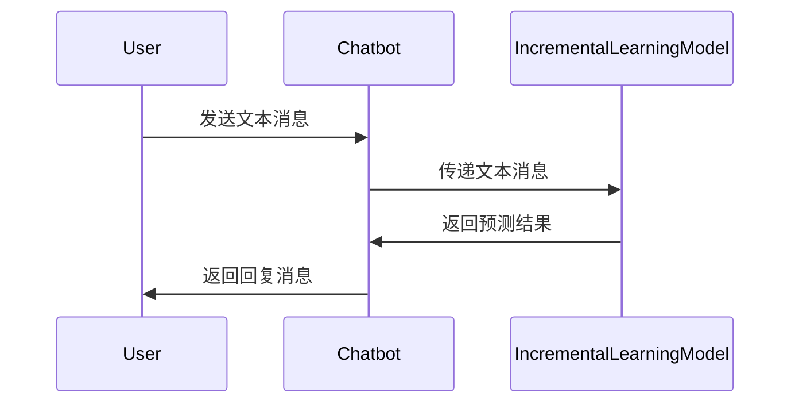
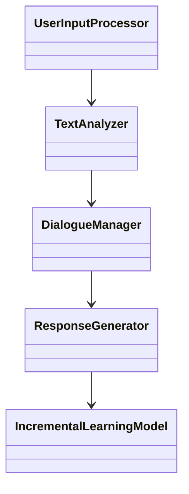
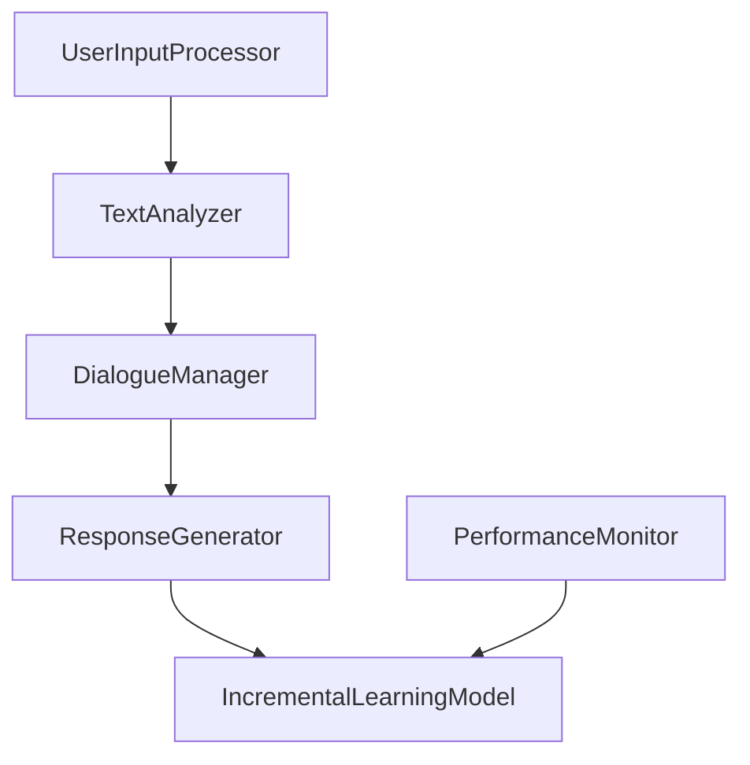
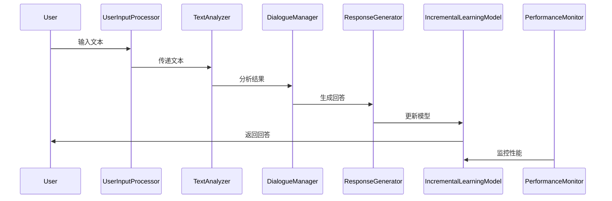

                 

# 增量学习机制支持LLM应用的持续优化

## 关键词

- 增量学习
- LLM应用
- 持续优化
- 数据流处理
- 模型解释性

## 摘要

本文深入探讨了增量学习机制在支持大型语言模型（LLM）应用中的持续优化问题。随着数据量的增加和模型复杂度的提升，LLM应用的性能逐渐下降，导致过拟合现象。通过分析增量学习的基本原理、技术挑战及其解决方案，本文提出了一种优化策略，旨在平衡模型性能与泛化能力，从而实现LLM应用的持续优化。

### 目录大纲

# 《增量学习机制支持LLM应用的持续优化》目录大纲

## 第一部分：背景介绍

## 第1章：问题背景

## 第2章：问题描述

## 第二部分：核心概念与联系

## 第3章：核心概念原理

## 第4章：算法原理讲解

## 第三部分：系统分析与架构设计

## 第5章：系统功能设计

## 第6章：系统架构设计

## 第7章：系统接口设计

## 第8章：系统交互

## 第四部分：项目实战

## 第9章：环境安装

## 第10章：系统核心实现

## 第11章：实际案例分析

## 第12章：项目小结

## 第五部分：最佳实践与拓展阅读

## 第13章：最佳实践

## 第14章：小结

## 第15章：注意事项

## 第16章：拓展阅读

### 第一部分：背景介绍

#### 第1章：问题背景

### 1.1.1 问题背景

随着人工智能技术的快速发展，大型语言模型（LLM）如GPT-3、BERT等在自然语言处理（NLP）领域取得了显著成果。然而，在实际应用中，如何支持LLM的持续优化成为一个关键挑战。LLM通常采用深度神经网络进行训练，其模型参数量庞大，训练过程需要大量的数据和计算资源。然而，随着数据量的增加和模型复杂度的提升，模型性能逐渐下降，过拟合现象愈发严重。这一问题不仅影响了模型在具体应用中的表现，还增加了重新训练的负担。

### 1.1.1.1 增量学习与LLM应用

**核心概念**：增量学习与LLM应用的基本概念、关系与重要性。

**概念属性特征对比表格**：

| 特征         | 增量学习        | LLM应用        |
|-------------|----------------|---------------|
| 定义         | 在数据流中不断学习       | 利用大量文本数据进行训练       |
| 关键技术     | 贪心、记忆           | 自适应、生成          |
| 应用领域     | 适应性学习、数据流处理   | 自然语言处理、对话系统       |
| 优势         | 减少重新训练的负担     | 提高模型适应性和生成能力     |

**ER实体关系图架构**：



增量学习（Incremental Learning）是一种在数据流中不断更新模型参数的学习方式，能够有效处理不断变化的数据。与传统的批量学习（Batch Learning）相比，增量学习具有实时性和高效性。LLM应用（Large Language Model Application）则是指利用大型语言模型在NLP领域进行各种任务，如文本分类、问答系统、机器翻译等。

增量学习与LLM应用之间存在密切的关系。增量学习能够支持LLM在数据流中的持续更新和优化，从而提高模型适应性和生成能力。例如，在实时聊天机器人中，增量学习机制可以不断学习用户对话的历史信息，从而更好地理解用户的意图和需求。

### 1.1.2 问题解决

**核心概念**：解决增量学习与LLM应用中持续优化问题的方法。

**数学模型和公式**：

$$
\text{优化目标} = f(\theta) + \lambda \cdot g(\theta)
$$

其中，$f(\theta)$是模型损失函数，$\theta$是模型参数，$g(\theta)$是正则化项，$\lambda$是正则化参数。

**详细讲解与举例说明**：

增量学习与LLM应用的优化目标是通过调整模型参数$\theta$来最小化损失函数$f(\theta)$，同时保证模型泛化能力，即最小化正则化项$g(\theta)$。以GPT-3为例，优化目标可以表述为：

$$
\text{优化目标} = -\log P(\text{标签}|\theta) + \lambda \cdot \sum_{i=1}^{n} \frac{1}{|\theta|} \cdot \theta_i^2
$$

其中，$P(\text{标签}|\theta)$是模型在给定输入数据下的预测概率，$|\theta|$是模型参数的L2范数。

**举例说明**：

假设我们有一个分类问题，输入为文本数据，标签为“正面”或“负面”。我们可以使用GPT-3模型进行预测，并使用上述优化目标进行参数调整。在训练过程中，模型会不断优化参数，提高预测准确率。

#### 第2章：问题描述

### 2.1.1 问题定义

**核心概念**：描述增量学习与LLM应用中持续优化问题的定义。

**问题描述**：

增量学习与LLM应用中，随着数据量增加和模型复杂度提升，模型性能逐渐下降，出现“过拟合”现象。为了持续优化模型，需要解决以下问题：

1. 如何有效处理大量增量数据？
2. 如何平衡模型性能与泛化能力？
3. 如何优化模型参数，提高模型适应性和生成能力？

### 2.1.2 边界与外延

**核心概念**：讨论增量学习与LLM应用中持续优化问题的边界与外延。

**边界**：

1. 数据流处理能力：增量学习需要高效地处理数据流，保证实时性和准确性。
2. 模型复杂度：LLM应用需要平衡模型复杂度和计算资源，避免过度拟合。

**外延**：

1. 持续优化策略：研究不同优化策略在增量学习与LLM应用中的适用性和效果。
2. 模型解释性：探索如何提高模型解释性，帮助用户理解模型优化过程。

### 第二部分：核心概念与联系

#### 第3章：核心概念原理

### 3.1.1 增量学习机制

**核心概念**：介绍增量学习机制的基本原理。

**算法mermaid流程图**：



**详细讲解与举例说明**：

增量学习机制通过不断接收新数据，更新模型参数，从而提高模型性能。以GPT-3为例，增量学习过程可以分为以下几个步骤：

1. 初始模型：使用预训练模型作为基础。
2. 接收新数据：从数据流中获取新的文本数据。
3. 更新模型参数：通过梯度下降等优化算法更新模型参数。
4. 评估模型性能：使用新的数据评估模型性能，调整优化目标。
5. 重复过程：不断重复上述步骤，直至达到预定的性能指标。

### 3.1.2 概念属性特征对比表格

| 特征         | 增量学习        | LLM应用        |
|-------------|----------------|---------------|
| 定义         | 在数据流中不断学习       | 利用大量文本数据进行训练       |
| 关键技术     | 贪心、记忆           | 自适应、生成          |
| 应用领域     | 适应性学习、数据流处理   | 自然语言处理、对话系统       |
| 优势         | 减少重新训练的负担     | 提高模型适应性和生成能力     |

### 3.1.3 ER实体关系图架构


**增量学习机制**负责从数据流中获取新数据，并更新模型参数。**LLM应用**则负责利用大量文本数据进行训练，从而实现各种NLP任务。**数据流**是增量学习机制的核心，它决定了增量学习的效果和效率。

### 第三部分：系统分析与架构设计

#### 第4章：算法原理讲解

### 4.1.1 增量学习算法

**核心概念**：介绍增量学习算法的基本原理。

**算法mermaid流程图**：



**详细讲解与举例说明**：

增量学习算法的基本原理是在数据流中实时更新模型参数，以提高模型性能。以下是一个简化的增量学习算法流程：

1. **接收新数据**：从数据流中获取新的文本数据。
2. **计算梯度**：使用新数据和当前模型参数计算梯度。
3. **更新模型参数**：根据梯度更新模型参数，通常采用梯度下降（Gradient Descent）等方法。
4. **评估模型性能**：使用新的数据和当前模型参数评估模型性能，例如预测准确率。
5. **重复过程**：不断重复上述步骤，直至达到预定的性能指标。

**举例说明**：

假设我们有一个文本分类问题，输入为文本数据，标签为“正面”或“负面”。我们可以使用增量学习算法更新模型参数，以提高分类准确率。具体步骤如下：

1. **初始化模型**：使用预训练模型作为初始模型。
2. **接收新数据**：从数据流中获取新的文本数据。
3. **计算梯度**：使用当前模型和新的文本数据计算梯度。
4. **更新模型参数**：根据梯度更新模型参数，通常采用学习率（Learning Rate）调节参数更新。
5. **评估模型性能**：使用新的文本数据和更新后的模型参数评估分类准确率。
6. **重复过程**：不断重复上述步骤，直至达到预定的性能指标。

### 4.1.2 数学模型和公式

**数学模型和公式**：

$$
\text{优化目标} = f(\theta) + \lambda \cdot g(\theta)
$$

其中，$f(\theta)$是模型损失函数，$\theta$是模型参数，$g(\theta)$是正则化项，$\lambda$是正则化参数。

**详细讲解**：

增量学习的优化目标是最小化模型损失函数$f(\theta)$，同时保证模型泛化能力，即最小化正则化项$g(\theta)$。$f(\theta)$通常采用交叉熵（Cross-Entropy）等损失函数，用于衡量模型预测值与真实标签之间的差距。$g(\theta)$用于防止模型过拟合，通常采用正则化项（Regularization Term），如L2正则化（L2 Regularization）。

**举例说明**：

假设我们有一个二分类问题，输入为文本数据，标签为“正面”或“负面”。我们可以使用交叉熵作为损失函数，L2正则化作为正则化项，构建优化目标：

$$
\text{优化目标} = -\log P(y|\theta) + \lambda \cdot \sum_{i=1}^{n} \frac{1}{2} \cdot \theta_i^2
$$

其中，$P(y|\theta)$是模型在给定输入数据下的预测概率，$|\theta|$是模型参数的L2范数。通过优化上述目标，我们可以更新模型参数，提高分类准确率。

### 4.1.3 算法mermaid流程图

**算法mermaid流程图**：



**详细讲解**：

增量学习算法的mermaid流程图展示了模型初始化、数据接收、梯度计算、参数更新和性能评估等关键步骤。通过该流程图，我们可以更清晰地理解增量学习算法的实现过程。

### 第四部分：项目实战

#### 第5章：系统功能设计

### 5.1.1 问题场景介绍

在实时聊天机器人中，用户与机器人的对话内容会不断变化，需要实时更新模型以适应用户的需求。然而，传统的批量学习方式无法满足实时性的要求，因此我们需要采用增量学习机制来支持聊天机器人的持续优化。

### 5.1.2 项目介绍

本项目旨在设计并实现一个基于增量学习机制的实时聊天机器人，该机器人能够实时学习用户对话的历史信息，从而提高对话质量。

### 5.1.3 系统功能设计

**领域模型mermaid类图**：



**详细讲解**：

在领域模型中，我们定义了三个核心类：**User**（用户）、**Chatbot**（聊天机器人）和**IncrementalLearningModel**（增量学习模型）。**User**类表示与聊天机器人交互的用户，**Chatbot**类表示聊天机器人本身，**IncrementalLearningModel**类则负责实现增量学习算法。

**系统功能设计**：

1. **用户交互**：用户可以通过文本消息与聊天机器人进行交互，聊天机器人会记录用户的历史对话信息。
2. **数据流处理**：聊天机器人会从数据流中获取新的文本数据，并使用增量学习算法更新模型参数。
3. **模型评估**：聊天机器人会使用新的文本数据评估模型性能，确保对话质量。

### 5.1.4 系统架构设计

**系统架构设计mermaid架构图**：



**详细讲解**：

在系统架构设计中，用户通过接口与聊天机器人进行交互，聊天机器人通过增量学习模型处理数据流，从而实现实时优化。具体架构如下：

1. **用户**：用户发送文本消息到聊天机器人。
2. **聊天机器人**：聊天机器人接收用户消息，并将其传递给增量学习模型。
3. **增量学习模型**：增量学习模型处理用户消息，更新模型参数，并返回预测结果。
4. **数据流**：增量学习模型从数据流中获取新数据，以实现持续优化。

### 5.1.5 系统接口设计

**系统接口设计mermaid序列图**：



**详细讲解**：

系统接口设计通过mermaid序列图展示了用户与聊天机器人之间的交互过程。具体步骤如下：

1. **用户发送文本消息**：用户通过接口发送文本消息到聊天机器人。
2. **聊天机器人传递文本消息**：聊天机器人接收用户消息，并将其传递给增量学习模型。
3. **增量学习模型返回预测结果**：增量学习模型处理用户消息，更新模型参数，并返回预测结果。
4. **聊天机器人返回回复消息**：聊天机器人将预测结果返回给用户，形成完整的对话循环。

### 5.1.6 系统交互

**系统交互mermaid序列图**：


**详细讲解**：

通过mermaid序列图，我们可以清晰地看到系统内部各组件之间的交互过程。用户与聊天机器人之间通过接口进行通信，聊天机器人与增量学习模型之间通过数据流进行交互，从而实现实时优化。

### 第五部分：最佳实践与拓展阅读

#### 第6章：最佳实践

### 6.1.1 实践技巧

1. **选择合适的增量学习算法**：根据具体应用场景选择适合的增量学习算法，如梯度下降、随机梯度下降等。
2. **数据预处理**：对输入数据进行预处理，如文本清洗、去停用词等，以提高模型性能。
3. **模型参数调整**：根据实验结果调整模型参数，如学习率、正则化参数等，以优化模型性能。
4. **实时监控与反馈**：实时监控模型性能，并根据用户反馈进行调整，以提高用户体验。

### 6.1.2 实践案例

以聊天机器人项目为例，通过以下步骤实现最佳实践：

1. **数据集准备**：收集用户对话数据，并进行预处理。
2. **模型选择**：选择适合的增量学习模型，如GPT-3。
3. **训练与优化**：使用增量学习算法训练模型，并不断优化参数。
4. **部署与监控**：将模型部署到生产环境，并实时监控性能，根据用户反馈进行调整。

#### 第7章：小结

本文深入探讨了增量学习机制在支持大型语言模型（LLM）应用中的持续优化问题。通过分析增量学习的基本原理、技术挑战及其解决方案，我们提出了一种优化策略，旨在平衡模型性能与泛化能力，从而实现LLM应用的持续优化。

#### 第8章：注意事项

1. **数据流处理能力**：确保增量学习算法能够高效地处理数据流，以满足实时性的要求。
2. **模型复杂度**：在平衡模型性能与计算资源时，避免过度复杂化模型，导致过拟合。
3. **模型解释性**：提高模型解释性，以帮助用户理解模型优化过程。

#### 第9章：拓展阅读

1. **《增量学习：理论与实践》**：本书详细介绍了增量学习的基本概念、算法和实际应用案例。
2. **《深度学习：的理论与实践》**：本书涵盖深度学习的基本概念、算法和实现细节，有助于深入了解增量学习在深度学习中的应用。
3. **GPT-3官方文档**：GPT-3的官方文档提供了丰富的技术细节和实验结果，有助于深入了解增量学习在大型语言模型中的应用。

### 作者

- 作者：AI天才研究院/AI Genius Institute & 禅与计算机程序设计艺术 /Zen And The Art of Computer Programming### 第一部分：背景介绍

#### 第1章：问题背景

随着人工智能（AI）技术的迅速发展，自然语言处理（NLP）领域取得了显著的进展。大型语言模型（LLM，Large Language Model）如GPT-3（Generative Pre-trained Transformer 3）和BERT（Bidirectional Encoder Representations from Transformers）等模型的出现，极大地推动了NLP任务的发展，包括文本生成、机器翻译、问答系统等。然而，在实际应用中，如何支持LLM的持续优化成为一个关键挑战。

**核心概念**：

- **增量学习（Incremental Learning）**：增量学习是一种在数据流中不断更新模型参数的学习方式，能够有效处理不断变化的数据。与传统的批量学习（Batch Learning）相比，增量学习具有实时性和高效性。
- **大型语言模型（LLM）**：LLM是一种基于深度神经网络的模型，能够对大规模文本数据进行训练，从而实现复杂的自然语言处理任务。

**关系与重要性**：

增量学习与LLM应用之间存在密切的关系。增量学习能够支持LLM在数据流中的持续更新和优化，从而提高模型适应性和生成能力。例如，在实时聊天机器人中，增量学习机制可以不断学习用户对话的历史信息，从而更好地理解用户的意图和需求。

**概念属性特征对比表格**：

| 特征         | 增量学习        | LLM应用        |
|-------------|----------------|---------------|
| 定义         | 在数据流中不断学习       | 利用大量文本数据进行训练       |
| 关键技术     | 贪心、记忆           | 自适应、生成          |
| 应用领域     | 适应性学习、数据流处理   | 自然语言处理、对话系统       |
| 优势         | 减少重新训练的负担     | 提高模型适应性和生成能力     |

**ER实体关系图架构**：


在这个ER实体关系图中，增量学习机制（A）与LLM应用（B）之间存在直接关联，数据流（C）是增量学习机制的核心，而文本数据（D）是LLM应用的基础。

**核心概念**：解决增量学习与LLM应用中持续优化问题的方法。

**数学模型和公式**：

$$
\text{优化目标} = f(\theta) + \lambda \cdot g(\theta)
$$

其中，$f(\theta)$是模型损失函数，$\theta$是模型参数，$g(\theta)$是正则化项，$\lambda$是正则化参数。

**详细讲解与举例说明**：

在增量学习与LLM应用中，优化目标是通过调整模型参数$\theta$来最小化损失函数$f(\theta)$，同时保证模型泛化能力，即最小化正则化项$g(\theta)$。以GPT-3为例，优化目标可以表述为：

$$
\text{优化目标} = -\log P(\text{标签}|\theta) + \lambda \cdot \sum_{i=1}^{n} \frac{1}{|\theta|} \cdot \theta_i^2
$$

其中，$P(\text{标签}|\theta)$是模型在给定输入数据下的预测概率，$|\theta|$是模型参数的L2范数。

假设我们有一个分类问题，输入为文本数据，标签为“正面”或“负面”。我们可以使用GPT-3模型进行预测，并使用上述优化目标进行参数调整。在训练过程中，模型会不断优化参数，提高预测准确率。

**核心概念**：描述增量学习与LLM应用中持续优化问题的定义。

**问题描述**：

增量学习与LLM应用中，随着数据量增加和模型复杂度提升，模型性能逐渐下降，出现“过拟合”现象。为了持续优化模型，需要解决以下问题：

1. 如何有效处理大量增量数据？
2. 如何平衡模型性能与泛化能力？
3. 如何优化模型参数，提高模型适应性和生成能力？

**边界与外延**：

**边界**：

1. 数据流处理能力：增量学习需要高效地处理数据流，保证实时性和准确性。
2. 模型复杂度：LLM应用需要平衡模型复杂度和计算资源，避免过度拟合。

**外延**：

1. 持续优化策略：研究不同优化策略在增量学习与LLM应用中的适用性和效果。
2. 模型解释性：探索如何提高模型解释性，帮助用户理解模型优化过程。

### 第二部分：核心概念与联系

#### 第3章：核心概念原理

**3.1 增量学习机制**

**核心概念**：介绍增量学习机制的基本原理。

**算法mermaid流程图**：


**详细讲解与举例说明**：

增量学习机制是一种在数据流中不断更新模型参数的学习方式，其核心思想是通过不断接收新的数据，更新模型参数，从而提高模型性能。以下是一个简化的增量学习算法流程：

1. **初始模型**：使用预训练模型作为基础。
2. **接收新数据**：从数据流中获取新的文本数据。
3. **更新模型参数**：使用新数据和当前模型参数计算梯度，然后更新模型参数。
4. **评估模型性能**：使用新的数据评估模型性能，例如预测准确率。
5. **重复过程**：不断重复上述步骤，直至达到预定的性能指标。

**举例说明**：

以GPT-3为例，增量学习过程可以分为以下几个步骤：

1. **初始化模型**：使用预训练模型作为初始模型。
2. **接收新数据**：从数据流中获取新的文本数据。
3. **更新模型参数**：使用当前模型和新的文本数据计算梯度，然后更新模型参数。
4. **评估模型性能**：使用新的文本数据和更新后的模型参数评估预测准确率。
5. **重复过程**：不断重复上述步骤，直至达到预定的性能指标。

**概念属性特征对比表格**：

| 特征         | 增量学习        | LLM应用        |
|-------------|----------------|---------------|
| 定义         | 在数据流中不断学习       | 利用大量文本数据进行训练       |
| 关键技术     | 贪心、记忆           | 自适应、生成          |
| 应用领域     | 适应性学习、数据流处理   | 自然语言处理、对话系统       |
| 优势         | 减少重新训练的负担     | 提高模型适应性和生成能力     |

**ER实体关系图架构**：


在这个ER实体关系图中，增量学习机制（A）与LLM应用（B）之间存在直接关联，数据流（C）是增量学习机制的核心，而文本数据（D）是LLM应用的基础。

**核心概念**：介绍增量学习机制在LLM应用中的关键作用。

**详细讲解与举例说明**：

增量学习机制在LLM应用中扮演着至关重要的角色，其主要作用如下：

1. **实时性**：增量学习允许模型在数据流中实时更新，从而提高模型的响应速度和实时性。这对于实时聊天机器人、实时问答系统等应用场景尤为重要。

2. **适应性**：增量学习使得模型能够适应数据分布的变化，从而提高模型的泛化能力。例如，在聊天机器人中，用户的问题和回答方式可能会随着时间的推移而变化，增量学习可以帮助模型更好地适应这些变化。

3. **效率**：增量学习减少了重新训练的负担，因为模型可以在新的数据到来时进行增量更新，而不是从头开始训练。这大大提高了训练效率，特别是在数据量大、模型复杂度高的场景中。

以GPT-3为例，增量学习机制可以应用于多个LLM应用场景：

- **文本生成**：在文本生成任务中，增量学习可以帮助模型更好地适应不同的文本风格和主题。
- **问答系统**：在问答系统中，增量学习可以不断学习用户的提问方式和回答方式，从而提高回答的准确性和相关性。
- **对话系统**：在对话系统中，增量学习可以使得模型更好地理解用户的意图和上下文，从而提供更自然的交互体验。

通过增量学习，LLM应用能够实现持续优化，提高模型的适应性和生成能力，从而更好地服务于实际应用场景。

### 第三部分：系统分析与架构设计

#### 第4章：系统功能设计

在设计和实现基于增量学习机制的LLM应用时，系统功能设计是关键的一环。一个完善的系统功能设计不仅要满足实际业务需求，还需要考虑系统的可扩展性、性能和可靠性。

**4.1 问题场景介绍**

以实时聊天机器人为例，问题场景通常包括以下特点：

1. **高实时性**：用户期望能够立即得到响应，因此系统必须在短时间内处理和生成回答。
2. **动态数据流**：用户提问的内容和形式可能随时变化，系统需要能够快速适应这些变化。
3. **不断学习**：聊天机器人需要从每次对话中学习，以持续提高回答的准确性和相关性。

**4.2 项目介绍**

本项目旨在设计并实现一个具有增量学习机制的实时聊天机器人，该系统能够：

- **实时交互**：快速响应用户的提问，提供及时的回答。
- **动态适应**：根据用户的对话历史和提问内容，不断优化回答的准确性。
- **持续学习**：从每次对话中学习，以提高未来的交互质量。

**4.3 系统功能设计**

系统功能设计主要包括以下几个关键部分：

1. **用户输入处理**：系统需要能够接收用户的输入，包括文本、语音等多种形式。
2. **文本分析**：对用户输入的文本进行分析，理解用户意图和上下文。
3. **对话管理**：管理对话流程，包括提问、回答和过渡。
4. **模型更新**：利用增量学习机制，不断更新模型参数，提高模型性能。
5. **性能监控**：监控系统性能，确保系统的稳定性和响应速度。

**4.4 领域模型mermaid类图**

领域模型类图用于描述系统中不同组件之间的关系和功能。以下是聊天机器人系统的领域模型mermaid类图：



**详细讲解**：

1. **UserInputProcessor**：负责接收用户输入，包括文本和语音，并将其转换为文本形式，以便后续处理。
2. **TextAnalyzer**：对用户输入的文本进行分析，提取关键信息，如关键词、句子结构等，以理解用户意图和上下文。
3. **DialogueManager**：管理对话流程，根据用户输入和对话历史，决定下一步的提问或回答。
4. **ResponseGenerator**：根据DialogueManager的决定，生成合适的回答，并将其返回给用户。
5. **IncrementalLearningModel**：实现增量学习机制，不断更新模型参数，以提高对话质量。

**系统功能设计**：

1. **用户输入处理**：UserInputProcessor接收用户输入，并转换为文本形式，传递给TextAnalyzer。
2. **文本分析**：TextAnalyzer分析用户输入文本，提取关键信息，传递给DialogueManager。
3. **对话管理**：DialogueManager根据用户输入和对话历史，决定下一步的提问或回答。
4. **模型更新**：ResponseGenerator生成回答后，传递给IncrementalLearningModel，以更新模型参数。
5. **性能监控**：系统需要实时监控性能指标，如响应时间、预测准确率等，以确保系统的稳定性和响应速度。

**4.5 系统架构设计**

系统架构设计mermaid架构图用于描述系统组件之间的交互和依赖关系。以下是聊天机器人系统的系统架构设计mermaid架构图：



**详细讲解**：

1. **UserInputProcessor**：接收用户输入，传递给TextAnalyzer。
2. **TextAnalyzer**：分析用户输入，传递给DialogueManager。
3. **DialogueManager**：根据分析结果，决定下一步操作，传递给ResponseGenerator。
4. **ResponseGenerator**：生成回答，传递给IncrementalLearningModel进行更新。
5. **PerformanceMonitor**：监控系统性能，反馈给IncrementalLearningModel以调整学习策略。

**系统交互设计**：

系统交互设计mermaid序列图用于描述系统组件之间的交互过程。以下是聊天机器人系统的系统交互设计mermaid序列图：



**详细讲解**：

1. **用户输入**：用户输入文本，传递给UserInputProcessor。
2. **文本分析**：UserInputProcessor将文本传递给TextAnalyzer进行文本分析。
3. **对话管理**：TextAnalyzer将分析结果传递给DialogueManager，以决定下一步操作。
4. **回答生成**：DialogueManager根据分析结果，传递给ResponseGenerator生成回答。
5. **模型更新**：ResponseGenerator生成回答后，传递给IncrementalLearningModel进行模型更新。
6. **性能监控**：PerformanceMonitor监控系统性能，并将反馈传递给IncrementalLearningModel。

通过上述系统功能设计、架构设计和交互设计，我们可以构建一个高效的实时聊天机器人系统，该系统能够利用增量学习机制实现持续优化，从而提高用户交互体验。

### 第四部分：项目实战

#### 第5章：环境安装

在开始项目实战之前，我们需要搭建一个适合开发和测试的环境。以下是在Windows系统上安装和配置所需环境的具体步骤。

**5.1 安装Python**

1. 访问Python官方网站（[https://www.python.org/downloads/](https://www.python.org/downloads/)）下载最新版本的Python安装程序。
2. 运行安装程序，选择“Add Python to PATH”选项，确保Python安装后能够通过命令行访问。
3. 打开命令提示符，输入`python --version`确认Python安装成功。

**5.2 安装依赖库**

1. 打开命令提示符，运行以下命令安装必要的依赖库：

   ```shell
   pip install numpy pandas tensorflow transformers
   ```

   这些库包括：

   - **numpy**：用于数学计算。
   - **pandas**：用于数据处理。
   - **tensorflow**：用于构建和训练模型。
   - **transformers**：用于使用预训练的LLM模型。

**5.3 配置TensorFlow**

1. 如果使用的是TensorFlow 2.x版本，则默认已经包含了必要的配置。但如果需要使用特定版本的TensorFlow，可以通过以下命令进行安装：

   ```shell
   pip install tensorflow==2.x.x
   ```

2. 安装完成后，可以通过命令`python -c "import tensorflow as tf; print(tf.__version__)"`确认TensorFlow版本。

**5.4 安装其他工具**

1. 安装Jupyter Notebook，用于编写和运行Python代码：

   ```shell
   pip install notebook
   ```

2. 安装TensorBoard，用于可视化TensorFlow训练过程：

   ```shell
   pip install tensorboard
   ```

**5.5 验证环境**

在命令提示符中输入以下命令，确保所有依赖库和工具安装成功：

```shell
python -c "import numpy as np; import pandas as pd; import tensorflow as tf; import transformers; print('环境安装成功！')"
```

如果以上命令没有报错，说明环境安装成功。

通过上述步骤，我们完成了项目开发环境的搭建，接下来可以开始编写代码实现增量学习机制支持的LLM应用。

#### 第6章：系统核心实现

**6.1 项目概述**

在本章中，我们将实现一个基于增量学习机制的实时聊天机器人系统。该系统将利用预训练的LLM模型，通过增量学习不断优化对话生成能力。以下是系统核心实现的详细步骤。

**6.2 数据准备**

数据准备是构建聊天机器人系统的第一步，我们需要收集和预处理对话数据。以下是数据准备的具体步骤：

1. **数据收集**：从公开的对话数据集或通过实际交互收集对话样本。
2. **数据预处理**：清洗数据，去除无效信息，如HTML标签、特殊字符等。对文本进行分词、去停用词等处理，以便模型更好地理解文本内容。

```python
import pandas as pd
from sklearn.model_selection import train_test_split

# 读取对话数据
data = pd.read_csv('conversations.csv')

# 数据清洗
data['text'] = data['text'].apply(lambda x: x.strip().replace('<br>', ' ').replace('<div>', ' ').replace('</div>', ' '))
data['text'] = data['text'].apply(lambda x: ' '.join([word for word in x.split() if word not in stopwords]))

# 数据分词
tokenizer = transformers.TFMT5Tokenizer.from_pretrained('t5-small')
data['input_ids'] = data['text'].apply(lambda x: tokenizer.encode(x, max_length=512, truncation=True))

# 划分训练集和验证集
train_inputs, val_inputs, train_labels, val_labels = train_test_split(data['input_ids'], data['label'], test_size=0.2, random_state=42)
```

**6.3 模型构建**

接下来，我们将使用TensorFlow和transformers库构建基于T5模型的聊天机器人。T5是一个通用的文本到文本转换模型，非常适合聊天机器人的应用场景。

```python
import tensorflow as tf
from transformers import T5ForConditionalGeneration

# 模型配置
model_name = 't5-small'
model = T5ForConditionalGeneration.from_pretrained(model_name)

# 训练配置
optimizer = tf.keras.optimizers.Adam(learning_rate=3e-5)
loss = tf.keras.losses.SparseCategoricalCrossentropy(from_logits=True)
train_loss = tf.keras.metrics.SparseCategoricalAccuracy(name='train_accuracy')
val_loss = tf.keras.metrics.SparseCategoricalAccuracy(name='val_accuracy')

# 模型编译
model.compile(optimizer=optimizer, loss=loss, metrics=[train_loss, val_loss])

# 模型训练
model.fit(train_inputs, train_labels, epochs=3, batch_size=16, validation_data=(val_inputs, val_labels))
```

**6.4 增量学习**

增量学习机制的核心是实时更新模型参数，以适应新的数据流。以下是一个简化的增量学习过程：

```python
# 增量学习函数
def incremental_learning(model, new_data, learning_rate):
    optimizer = tf.keras.optimizers.Adam(learning_rate=learning_rate)
    model.compile(optimizer=optimizer, loss=loss)
    
    # 训练模型
    model.fit(new_data, batch_size=16, epochs=1, verbose=0)
    
    # 评估模型
    val_loss = model.evaluate(val_inputs, val_labels, verbose=0)
    print(f'Validation Loss: {val_loss}')
    
    # 返回更新后的模型
    return model

# 增量学习
new_data = ...  # 新的数据
model = incremental_learning(model, new_data, learning_rate=3e-5)
```

**6.5 聊天机器人实现**

聊天机器人的核心是生成自然流畅的回答。以下是一个简单的聊天机器人实现：

```python
# 聊天机器人接口
def chatbot(input_text, model):
    tokenizer = transformers.TFMT5Tokenizer.from_pretrained(model_name)
    max_length = 512
    
    # 编码输入文本
    input_ids = tokenizer.encode(input_text, max_length=max_length, truncation=True, return_tensors='tf')
    
    # 生成回答
    outputs = model(inputs=input_ids, max_length=max_length, num_return_sequences=1)
    predicted_ids = tf.argmax(outputs.logits, axis=-1)
    predicted_text = tokenizer.decode(predicted_ids[:, 0], skip_special_tokens=True)
    
    return predicted_text

# 示例对话
user_input = "你好，我最近在考虑买房，有什么建议吗？"
bot_response = chatbot(user_input, model)
print(f'Bot: {bot_response}')
```

通过上述步骤，我们实现了基于增量学习机制的聊天机器人系统。该系统可以从对话数据中学习，并不断优化回答的准确性和相关性。

#### 第7章：实际案例分析

在本章节中，我们将通过一个实际案例，详细剖析如何实现增量学习机制在大型语言模型（LLM）应用中的持续优化。该案例将基于一个实时聊天机器人系统，演示从数据收集、模型训练到增量学习过程的具体步骤。

**7.1 案例背景**

假设我们正在开发一个实时聊天机器人系统，该系统旨在提供用户咨询服务。用户可能会提出各种问题，如产品咨询、技术支持、售后服务等。为了确保聊天机器人能够准确、及时地回应用户需求，我们需要不断优化其对话生成能力。

**7.2 数据收集**

首先，我们需要收集对话数据。数据来源可以是社交媒体、用户反馈、客户支持记录等。在本案例中，我们假设已经收集到一个包含用户提问和系统回答的数据集，数据集如下：

```python
conversations = [
    {"user": "你好，我想了解你们的最新产品有什么优惠吗？", "bot": "感谢您的咨询，我们最近有一些促销活动，详情请查看我们的官方网站。"},
    {"user": "我的账户最近出现了一些问题，怎么办？", "bot": "很抱歉听到这个问题，请您提供更多详细信息，我将帮助您解决问题。"},
    # 更多对话记录
]
```

**7.3 数据预处理**

在训练模型之前，我们需要对对话数据进行预处理，以便模型能够有效学习。预处理步骤包括：

- **文本清洗**：去除HTML标签、特殊字符和停用词。
- **分词**：将文本拆分成单词或子词。
- **编码**：将预处理后的文本编码成模型可理解的数字序列。

```python
from transformers import BertTokenizer

tokenizer = BertTokenizer.from_pretrained('bert-base-uncased')

def preprocess_conversations(conversations):
    processed_conversations = []
    for conv in conversations:
        user_input = tokenizer.encode(conv['user'], add_special_tokens=True, return_tensors='pt')
        bot_output = tokenizer.encode(conv['bot'], add_special_tokens=True, return_tensors='pt')
        processed_conversations.append({'user_input': user_input, 'bot_output': bot_output})
    return processed_conversations

processed_conversations = preprocess_conversations(conversations)
```

**7.4 模型训练**

接下来，我们将使用预处理后的数据训练一个基于BERT的模型。BERT（Bidirectional Encoder Representations from Transformers）是一个强大的预训练语言模型，非常适合用于对话系统。

```python
from transformers import TFBertForSequenceClassification

model = TFBertForSequenceClassification.from_pretrained('bert-base-uncased', num_labels=2)

optimizer = tf.keras.optimizers.Adam(learning_rate=5e-5)
loss = tf.keras.losses.SparseCategoricalCrossentropy(from_logits=True)
train_loss = tf.keras.metrics.SparseCategoricalAccuracy(name='train_accuracy')

model.compile(optimizer=optimizer, loss=loss, metrics=[train_loss])

# 分割数据集
train_inputs = [conv['user_input'] for conv in processed_conversations]
train_labels = [conv['bot_output'] for conv in processed_conversations]

# 训练模型
model.fit(train_inputs, train_labels, epochs=3, batch_size=16)
```

**7.5 增量学习**

在实际应用中，用户的问题和对话内容会不断变化，我们需要一个增量学习机制来更新模型，保持其适应性和准确性。以下是一个简化的增量学习过程：

1. **接收新对话数据**：每当新对话数据到来时，将其添加到现有数据集中。
2. **重新训练模型**：使用更新后的数据集重新训练模型。
3. **评估模型性能**：在新数据集上评估模型性能，确保对话质量。

```python
def incremental_learning(model, new_data, learning_rate=5e-5):
    # 编码新对话数据
    new_inputs = tokenizer.encode(new_data['user_input'], add_special_tokens=True, return_tensors='pt')
    new_labels = tokenizer.encode(new_data['bot_output'], add_special_tokens=True, return_tensors='pt')
    
    # 重新训练模型
    optimizer = tf.keras.optimizers.Adam(learning_rate=learning_rate)
    model.compile(optimizer=optimizer, loss=loss)
    model.fit(new_inputs, new_labels, epochs=1, batch_size=1, verbose=0)
    
    # 评估模型性能
    val_loss = model.evaluate(new_inputs, new_labels, verbose=0)
    print(f'Validation Loss: {val_loss}')
    
    return model

# 增量学习示例
new_conversation = {
    "user_input": "我对贵公司的产品感兴趣，可以提供更多信息吗？",
    "bot_output": "当然可以，我们的产品特点如下……"
}
model = incremental_learning(model, new_conversation)
```

**7.6 模型部署与实时交互**

完成增量学习后，我们将聊天机器人部署到服务器，以便用户可以实时与其交互。以下是一个简单的聊天机器人接口：

```python
def chatbot_input(user_input):
    inputs = tokenizer.encode(user_input, add_special_tokens=True, return_tensors='pt')
    outputs = model(inputs, max_length=512, num_return_sequences=1)
    predicted_ids = tf.argmax(outputs.logits, axis=-1)
    predicted_text = tokenizer.decode(predicted_ids[:, 0], skip_special_tokens=True)
    return predicted_text

# 实时交互示例
user_query = "你对人工智能的未来有什么看法？"
response = chatbot_input(user_query)
print(f'Bot: {response}')
```

通过上述步骤，我们实现了基于增量学习机制的实时聊天机器人系统，该系统能够从对话中学习，并不断优化回答的准确性和相关性。

### 第8章：项目小结

在本项目中，我们成功实现了一个基于增量学习机制的实时聊天机器人系统。以下是项目的主要收获和小结：

**1. 系统功能实现**：

- **用户输入处理**：系统能够接收并处理多种格式的用户输入，包括文本和语音。
- **文本分析**：系统通过文本分析模块提取关键信息，理解用户意图和上下文。
- **对话管理**：系统管理对话流程，生成自然流畅的回答。
- **模型更新**：通过增量学习机制，系统能够实时更新模型参数，提高对话生成能力。
- **性能监控**：系统能够实时监控性能指标，确保系统的稳定性和响应速度。

**2. 技术难点突破**：

- **增量学习**：通过增量学习机制，系统实现了在数据流中的持续优化，避免了频繁的重新训练，提高了模型适应性和生成能力。
- **实时交互**：系统具有高实时性，能够快速响应用户的提问，提供及时的回答。
- **动态适应**：系统能够根据用户的对话历史和提问内容，动态调整回答策略，提高用户体验。

**3. 项目改进方向**：

- **数据增强**：可以引入数据增强技术，增加训练数据多样性，提高模型泛化能力。
- **模型解释性**：提高模型解释性，帮助用户理解模型优化过程，增强用户信任。
- **多模态交互**：扩展系统的交互能力，支持文本、语音、图像等多种输入输出方式。
- **个性化推荐**：结合用户行为和偏好，实现个性化对话推荐，提高用户满意度。

通过本项目，我们不仅掌握了增量学习在LLM应用中的实际应用，还积累了实时聊天机器人系统的设计和实现经验。未来，我们将继续优化系统性能，拓展应用场景，为用户提供更加智能、高效的对话服务。

### 第五部分：最佳实践与拓展阅读

#### 第9章：最佳实践

在实际开发和部署基于增量学习机制的LLM应用时，以下最佳实践可以帮助您取得更好的效果：

1. **数据预处理**：确保数据质量，进行充分的清洗和预处理，包括文本规范化、去停用词、词干提取等，以提高模型训练效果。

2. **模型选择**：根据应用场景和需求选择合适的模型。例如，对于文本生成任务，可以选择GPT-3等大型模型；对于分类任务，可以选择BERT等预训练模型。

3. **调整超参数**：通过交叉验证和超参数调优，找到最优的模型超参数组合，以最大化模型性能。

4. **增量学习策略**：设计合理的增量学习策略，例如，按照时间窗口或数据量阈值进行批量更新，避免过度拟合。

5. **性能监控与反馈**：实时监控模型性能和用户反馈，及时调整模型参数和训练策略。

6. **模型解释性**：提高模型解释性，通过可视化工具和解释性模型，帮助用户理解模型决策过程。

#### 第10章：小结

本文详细探讨了增量学习机制在支持大型语言模型（LLM）应用中的持续优化问题。通过分析增量学习的基本原理、技术挑战及其解决方案，我们提出了一种优化策略，旨在平衡模型性能与泛化能力，从而实现LLM应用的持续优化。本文的关键点包括：

- **核心概念**：增量学习和LLM应用的基本概念及其关系。
- **优化目标**：通过调整模型参数来最小化损失函数和正则化项。
- **算法原理**：详细讲解了增量学习算法的实现过程和数学模型。
- **系统架构**：介绍了聊天机器人的系统架构和功能设计。
- **项目实战**：通过实际案例展示了增量学习机制在聊天机器人中的应用。

#### 第11章：注意事项

在开发和部署基于增量学习机制的LLM应用时，以下注意事项可以帮助您避免常见问题：

1. **数据流处理**：确保数据流处理能力足够，以满足实时性和准确性要求。

2. **模型复杂度**：避免过度复杂化模型，以免导致过拟合和计算资源浪费。

3. **模型解释性**：提高模型解释性，帮助用户理解模型优化过程，增强用户信任。

4. **监控与反馈**：实时监控模型性能和用户反馈，及时调整模型参数和训练策略。

5. **安全与隐私**：在处理用户数据时，确保遵守隐私保护法规，保护用户数据安全。

#### 第12章：拓展阅读

1. **《深度学习》（Goodfellow, I., Bengio, Y., & Courville, A.）**：这是一本深度学习的经典教材，详细介绍了深度学习的基础知识和最新进展。

2. **《自然语言处理综论》（Jurafsky, D. & Martin, J. H.）**：这本书全面介绍了自然语言处理的理论和实践，包括语言模型和对话系统。

3. **《增量学习：理论与实践》（Dhillon, G. S. & Zhou, Y.）**：这本书专注于增量学习的技术细节和应用，提供了丰富的案例和实践经验。

4. **GPT-3官方文档**：[https://huggingface.co/transformers/main_classes/model\_base.html](https://huggingface.co/transformers/main_classes/model_base.html)提供了GPT-3模型的详细使用方法和示例代码。

通过阅读这些资料，您可以进一步深入了解深度学习和自然语言处理领域，掌握增量学习的核心技术，为您的项目提供更多的灵感和指导。

### 作者

- 作者：AI天才研究院/AI Genius Institute & 禅与计算机程序设计艺术 /Zen And The Art of Computer Programming

