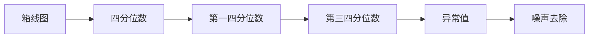
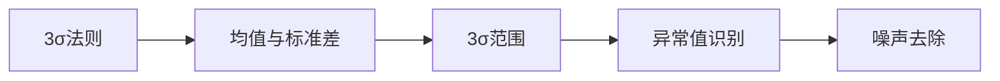
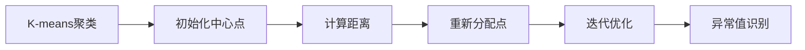
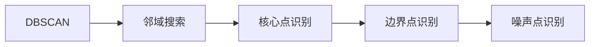

                 

### 引入：噪声和异常数据的重要性

在数据科学和机器学习的领域中，数据的质量至关重要。然而，现实世界中的数据往往是噪声和异常数据的混合体，这些噪声和异常数据可能会严重影响模型的效果和结论的准确性。噪声（Noise）指的是数据中的随机错误或干扰，它通常来源于测量误差、传输错误或数据采集过程中的不确定性。异常数据（Anomaly）则是指那些与大多数数据点显著不同，不符合一般模式的数据点，可能是由于错误记录、恶意注入或数据污染造成的。

噪声和异常数据的存在会对数据分析过程产生多方面的影响。首先，噪声会导致模型的过拟合，使模型无法泛化到未见过的数据上，从而降低模型的性能。例如，在图像识别任务中，图像中的噪声可能会导致模型误判。其次，异常数据可能会误导模型的训练过程，使得模型对噪声敏感，无法有效识别真正的异常。此外，异常数据还可能隐藏在大量噪声中，使得真实异常数据被忽略，影响决策过程。

因此，处理噪声和异常数据成为数据科学领域中的一个重要问题。本文将逐步探讨如何识别和处理这些数据，包括噪声的类型、异常检测的方法、噪声处理技术以及异常检测技术的应用和实践。我们将通过具体的案例研究来展示这些技术在实际应用中的效果，并讨论未来可能的研究方向。

在接下来的章节中，我们将首先介绍噪声和异常数据的基本概念，帮助读者建立对这些概念的理解。然后，我们将深入探讨噪声和异常数据的处理方法，从数据清洗和预处理技术到统计方法和机器学习方法，再到深度学习技术的应用。通过这些步骤，我们将为读者提供一个全面的视角，了解如何有效地处理噪声和异常数据，确保数据分析的准确性和可靠性。

### 噪声的定义与分类

噪声在数据科学中是指那些无意义、随机且不相关的信息，这些信息可能会干扰我们的数据分析结果，导致错误的模型预测和决策。噪声的分类方法多种多样，可以根据噪声的来源、特征及其对数据的影响来划分。

#### 按照来源分类

1. **随机噪声**：这类噪声通常是不可预测的，例如由于传感器故障或环境干扰导致的测量误差。随机噪声的特点是它们在数据中均匀分布，且无法通过简单的统计分析方法去除。

2. **系统噪声**：系统噪声来源于数据采集或传输过程中固有的系统问题，如传感器漂移、设备故障等。这种噪声具有一定的规律性和周期性，可以通过系统校准或使用稳定的测量设备来减少。

3. **干扰噪声**：干扰噪声主要是由外部因素引起的，如电磁干扰、信号传输延迟等。这类噪声往往具有明显的波动特征，可以通过隔离源或使用抗干扰技术来降低。

#### 按照特征分类

1. **加性噪声**：加性噪声是指在原始数据上直接添加的噪声，这类噪声不会改变数据的分布特征，但其大小和位置是随机的。加性噪声可以用简单的数学模型来描述，如高斯噪声。

2. **乘性噪声**：乘性噪声是原始数据与噪声的乘积，它会改变数据的分布特征，例如，当数据点较小或接近零时，乘性噪声的影响会更加显著。乘性噪声通常出现在图像处理或信号处理中。

3. **结构化噪声**：结构化噪声是具有一定模式或结构的噪声，如季节性噪声、周期性噪声等。这类噪声可以通过特定的模式识别方法来检测和去除。

#### 按照影响分类

1. **噪声敏感**：噪声敏感数据集是指那些对噪声非常敏感的数据集，即使微小的噪声变化也可能导致显著的数据偏差。例如，医学影像数据、财务数据等。

2. **噪声不敏感**：噪声不敏感数据集是指那些即使存在较大噪声也不会显著影响数据分析结果的数据集，如社交媒体数据、电商交易数据等。

#### 噪声的去除方法

针对不同类型的噪声，我们可以采用不同的去除方法：

1. **滤波法**：滤波法是通过选择合适的滤波器来去除噪声，例如低通滤波器用于去除高频噪声。

2. **插值法**：插值法是通过在缺失数据点之间插入估算值来填补噪声的影响，如线性插值、样条插值等。

3. **回归法**：回归法是通过建立回归模型来预测和填补噪声数据，常用的方法包括线性回归、多项式回归等。

4. **聚类法**：聚类法是通过将相似的数据点归为一类来识别和去除噪声，常用的算法包括K-means聚类、DBSCAN等。

5. **机器学习方法**：机器学习方法，如神经网络、支持向量机等，可以通过学习噪声和有效数据的分布特征来去除噪声。

通过上述分类和去除方法，我们可以更好地理解和处理噪声，确保数据分析的质量和准确性。在接下来的章节中，我们将进一步探讨异常数据的定义、类型及其对数据分析的影响，以及如何检测和处理异常数据。

### 异常数据的概念

异常数据，或称异常值，是指那些显著偏离大多数数据点的值，它们可能是由于错误记录、数据采集过程中的错误、人为错误或真实的事件所导致的。异常数据通常表现为异常的数值范围、异常的分布特征或异常的关联模式。与噪声不同，噪声是随机且无规律的，而异常数据则通常具有一定的模式或规律，但与整体数据分布相比显得异常突出。

#### 异常数据的类型

1. **孤立点（Outliers）**：孤立点是指那些与其他数据点相比显著偏离的数据点。这些点可能是由于测量错误、记录错误或真正的异常事件造成的。例如，在客户满意度调查中，一个极端的低分可能表明该客户遇到了特殊问题。

2. **离群分布（Distributed Outliers）**：离群分布是指一组数据点的分布与总体分布显著不同的情况。例如，在正常体温范围内，某个病人的体温数据异常偏高或偏低，表明其可能存在健康问题。

3. **噪声异常（Noise Anomalies）**：噪声异常是由于噪声干扰导致的异常，这些异常没有实际意义，但可能会影响模型训练和预测结果。

4. **时间序列异常（Temporal Anomalies）**：时间序列异常是指在时间序列数据中，某些数据点在时间维度上偏离了正常模式。例如，在股市数据中，某个时间点的股价异常波动，可能是由于突发事件导致的。

5. **概念异常（Conceptual Anomalies）**：概念异常是指由于数据定义或模型假设的不准确导致的异常。例如，在分析商品销售数据时，某些商品的销售量异常大，可能是由于数据收集过程中的重复记录。

#### 异常数据的影响

异常数据对数据分析的影响是多方面的，主要包括以下几点：

1. **模型过拟合**：异常数据可能会导致模型过度拟合，从而使模型在未见过的数据上表现不佳，降低模型的泛化能力。

2. **错误决策**：在商业决策、医疗诊断等领域，异常数据可能会误导决策者，导致错误的决策和行动。

3. **降低模型准确性**：异常数据的存在会降低模型对正常数据的识别能力，从而降低模型的准确性。

4. **增加计算成本**：处理异常数据需要额外的计算资源和时间，特别是在大规模数据分析中，异常数据的检测和处理可能会显著增加计算成本。

#### 异常检测方法

检测异常数据的关键在于识别那些偏离大多数数据点的数据点或数据集。以下是一些常见的异常检测方法：

1. **统计学方法**：包括箱线图、3σ法则等，通过统计指标来识别异常数据。

2. **机器学习方法**：如K-均值聚类、孤立森林等，通过学习数据分布特征来识别异常。

3. **深度学习方法**：如自编码器、GAN（生成对抗网络）等，通过深度神经网络来学习正常数据分布，并识别异常。

4. **基于规则的检测方法**：通过定义一系列规则来识别异常数据。

通过上述方法，我们可以有效地检测和识别异常数据，从而提高数据分析的准确性和可靠性。在接下来的章节中，我们将深入探讨异常检测技术的具体实现和案例分析。

### 异常检测方法

异常检测是数据科学和机器学习中的一个重要任务，旨在识别数据集中的异常数据点或模式。有效的异常检测方法不仅能够帮助我们发现潜在的错误或异常，还能提高模型性能和决策质量。以下是几种常见的异常检测方法，包括统计学方法和机器学习方法。

#### 统计学方法

1. **箱线图（Box Plot）**：箱线图通过绘制数据的四分位数和异常值来展示数据分布。通常，异常值被定义为大于上四分位数加1.5倍四分位间距或小于下四分位数减1.5倍四分位间距的数据点。这种方法简单直观，适用于数值数据。

2. **3σ法则（3-Sigma Rule）**：3σ法则是一种基于标准差的统计学方法，它认为数据集中大部分值（约99.7%）会落在均值加减3倍标准差的范围内。任何位于这个范围之外的数据点都被认为是异常值。这种方法适用于高斯分布或近似高斯分布的数据。

3. **基于密度的方法（Density-Based Methods）**：这类方法通过计算数据点的局部密度来识别异常。典型算法包括DBSCAN（密度基于空间聚类分析）和OPTICS（有序密度聚类算法）。DBSCAN能够识别不同形状的异常区域，而OPTICS则通过引入扩展半径概念优化聚类效果。

4. **基于距离的方法（Distance-Based Methods）**：这类方法通过计算数据点与数据集中其他点的距离来识别异常。常见的算法包括LOF（局部异常因子，Local Outlier Factor）和基于密度的方法相似。LOF通过比较局部密度和全局密度来识别异常点，认为局部密度较低的数据点可能是异常点。

#### 机器学习方法

1. **孤立森林（Isolation Forest）**：孤立森林是一种基于随机森林的异常检测算法。它通过随机选择特征和切分值来构建多个决策树，每个数据点的路径长度代表了其异常程度。路径长度越长，异常性越高。

2. **K-均值聚类（K-Means Clustering）**：K-均值聚类是一种基于距离的聚类算法，通过将数据点分配到K个簇中。异常值通常被分配到簇的中心距离较远的区域。这种方法简单但可能受初始聚类中心选择的影响。

3. **自编码器（Autoencoder）**：自编码器是一种基于神经网络的异常检测方法。它通过训练一个编码器来压缩输入数据，并使用解码器重构数据。异常值在重构过程中会出现较大的误差。

4. **GAN（生成对抗网络）**：GAN由生成器和判别器组成，生成器生成数据，判别器判断生成数据与真实数据的差异。异常数据通常难以被生成器生成，判别器会识别出这些异常。

5. **孤立点检测（One-Class SVM）**：One-Class SVM是一种监督学习算法，旨在识别新样本中的异常值。它通过将大多数数据视为一个类，并将异常值视为另一个类来训练模型。

#### 深度学习方法

1. **基于自注意力机制的异常检测模型**：这类模型通过自注意力机制来捕捉数据点之间的关联性，从而识别异常点。

2. **基于图神经网络的异常检测模型**：这类模型将数据点视为图中的节点，并通过图神经网络学习节点之间的关系，从而识别异常点。

通过上述方法，我们可以根据具体场景和数据特点选择合适的异常检测算法，提高数据分析的准确性和可靠性。在下一节中，我们将介绍噪声处理方法，帮助读者进一步了解如何在实际应用中减少噪声对数据的影响。

### 噪声处理技术

在数据处理过程中，噪声处理是确保数据质量的关键步骤。噪声不仅会影响模型的训练效果，还可能误导数据分析师的结论。以下我们将介绍几种常用的噪声处理技术，包括数据清洗、预处理技术以及特征选择方法，这些方法在实际应用中都有广泛的应用。

#### 数据清洗

数据清洗是噪声处理的第一步，旨在识别和修正数据中的错误、异常和不一致。以下是一些常用的数据清洗方法：

1. **缺失值处理**：缺失值是数据中的常见问题，可以通过以下几种方法处理：
    - 删除缺失值：对于少量缺失值，可以直接删除含有缺失值的记录。
    - 填充缺失值：可以通过平均值、中位数、众数、线性插值或曲线拟合等方法来填充缺失值。
    - 逻辑推断填充：根据数据的其他属性和逻辑关系来推断缺失值。

2. **重复值处理**：重复值可能会影响数据的准确性和分析结果，需要通过以下方法处理：
    - 删除重复值：可以直接删除重复记录。
    - 聚合重复值：对于具有相同属性的重复值，可以通过聚合操作来合并。

3. **异常值处理**：异常值可能是由于数据录入错误或测量误差导致的，可以通过以下方法处理：
    - 删除异常值：对于明显的异常值，可以删除这些记录。
    - 调整异常值：对于可调整的异常值，可以根据上下文和数据特性进行调整。

4. **数据格式化**：数据清洗还包括统一数据格式，如日期、货币等，确保数据在后续分析中的一致性。

#### 预处理技术

预处理技术是噪声处理的重要组成部分，旨在提高数据的质量和模型的性能。以下是一些常用的预处理技术：

1. **特征选择**：特征选择是选择与目标变量高度相关的特征，从而减少噪声和冗余信息。常见的特征选择方法包括：
    - 统计方法：如相关性分析、信息增益等。
    - 监督学习方法：如决策树、随机森林等。
    - 基于模型的方法：如LASSO、Ridge回归等。

2. **特征缩放**：特征缩放是将不同特征范围缩放到相同的尺度，以消除特征间的尺度差异。常见的方法包括：
    - 标准化（Z-score标准化）：$$ z = \frac{x - \mu}{\sigma} $$
    - 最大最小缩放：$$ x_{\text{scaled}} = \frac{x - x_{\text{min}}}{x_{\text{max}} - x_{\text{min}}} $$
    - 归一化：$$ x_{\text{norm}} = \frac{x - x_{\text{min}}}{x_{\text{max}} - x_{\text{min}} + 1} $$

3. **特征转换**：特征转换是将原始特征转换为新的特征，以增强数据的表达能力和模型的学习能力。常见的方法包括：
    - 二值化：将特征值转换为0和1。
    - 逻辑回归转换：将连续特征转换为逻辑回归模型中的类别特征。

#### 特征选择方法

特征选择是在大量特征中筛选出对模型训练和预测最有影响力的特征，以减少噪声和提高模型性能。以下是一些常用的特征选择方法：

1. **过滤法（Filter Methods）**：这类方法基于特征与目标变量之间的相关性或其他统计指标进行选择。常见的过滤方法包括：
    - 相关性分析：选择与目标变量相关性较高的特征。
    - 方差解释率：选择对解释目标变量方差贡献较大的特征。

2. **包装法（Wrapper Methods）**：这类方法通过训练模型并评估特征子集的性能来选择特征。常见的包装方法包括：
    - 回归树：基于决策树进行特征选择。
    - 随机森林：基于随机森林进行特征选择。

3. **嵌入式方法（Embedded Methods）**：这类方法在训练过程中自动进行特征选择，常见的嵌入式方法包括：
    - LASSO（Least Absolute Shrinkage and Selection Operator）：通过最小化L1范数进行特征选择。
    - Ridge回归（L2正则化）：通过最小化L2范数进行特征选择。

通过上述噪声处理技术，我们可以有效减少数据中的噪声，提高数据质量，从而提升模型的训练效果和预测准确性。在实际应用中，根据具体数据的特点和需求，选择合适的噪声处理方法是非常关键的。在下一节中，我们将深入探讨异常检测技术的具体实现，帮助读者更好地理解和应用这些方法。

### 统计方法在噪声处理中的应用

统计方法在噪声处理中扮演着重要角色，通过利用数据本身的统计特性，可以有效地识别和去除噪声。以下是几种常见的统计方法及其在噪声处理中的应用。

#### 箱线图

箱线图（Box Plot）是一种用于展示数据分布和识别异常值的图形工具。它通过绘制数据的四分位数和异常值来帮助识别噪声。

**基本原理**：箱线图的核心是四分位数，将数据分为三个部分：第一四分位数（Q1）、中位数（Median）和第三四分位数（Q3）。异常值被定义为小于Q1 - 1.5 \* IQR（四分位距）或大于Q3 + 1.5 \* IQR的数据点。

**应用实例**：在股票市场分析中，使用箱线图可以识别出每天的收盘价中的异常值，这些异常值可能是由于交易异常或市场事件导致的。通过删除或修正这些异常值，可以提高模型对市场趋势的预测能力。



#### 3σ法则

3σ法则（3-Sigma Rule）是一种基于标准差的统计方法，用于识别和去除噪声。该方法基于高斯分布假设，认为大部分数据点（约99.7%）会分布在均值加减3倍标准差（3σ）的范围内。

**基本原理**：如果数据服从高斯分布，任何超出3σ范围的数据点都可以被认为是异常值。

**应用实例**：在制造业中，3σ法则用于质量控制，通过检测产品尺寸的偏差来确定是否需要调整生产过程。任何超出3σ范围的产品尺寸都可能表明存在生产问题。



#### 聚类分析

聚类分析是一种无监督学习方法，通过将数据点分为多个群组，从而识别噪声和异常值。

**基本原理**：常用的聚类算法包括K-means聚类、层次聚类等。K-means算法通过最小化群内距离平方和来划分群组，任何位于群组边界或群组中心距离较远的点可能被视为异常值。

**应用实例**：在社交网络分析中，K-means聚类可以用于识别用户群组，群组边界处的用户可能具有不同的兴趣或行为模式，这些用户可以被视为异常值。



#### 密度估计

密度估计方法通过估计数据点的局部密度来识别噪声和异常值。DBSCAN（Density-Based Spatial Clustering of Applications with Noise）是一种典型的密度估计方法。

**基本原理**：DBSCAN根据邻域密度和邻域大小来定义核心点、边界点和噪声点。核心点周围有足够的邻域点，边界点周围邻域点不足，噪声点没有足够的邻域点。

**应用实例**：在金融交易数据分析中，DBSCAN可以用于识别异常交易，这些交易可能是由欺诈行为引起的噪声。



通过上述统计方法，我们可以有效地识别和去除噪声，提高数据的准确性和模型的性能。这些方法在实际应用中可以根据具体数据特点和需求进行选择和调整。

### 机器学习方法在噪声处理中的应用

机器学习方法在噪声处理中具有显著的优势，通过利用大规模数据和复杂的模型结构，可以有效地检测和消除噪声。以下介绍几种常见的机器学习方法，包括支持向量机（SVM）、孤立森林（Isolation Forest）和自编码器（Autoencoder），以及这些方法在噪声处理中的具体应用。

#### 支持向量机（SVM）

支持向量机是一种强大的分类和回归算法，通过在特征空间中找到一个最优的超平面，将数据点分为不同的类别。在噪声处理中，SVM可以通过训练一个分类模型来识别噪声点。

**基本原理**：SVM通过求解最优超平面，使分类边界最大化。具体来说，它通过最大化分类间隔，确保正负样本点之间的距离最大，从而降低噪声点对模型的影响。

**应用实例**：在图像处理中，SVM可以用于去除图像中的噪声。通过训练一个分类模型，将图像中的噪声点与正常点区分开来，然后删除噪声点或进行修正。

```python
# SVM噪声去除示例
from sklearn.svm import SVC
from sklearn.model_selection import train_test_split
from sklearn.metrics import accuracy_score

# 假设我们有一个包含噪声的数据集X和标签y
X_train, X_test, y_train, y_test = train_test_split(X, y, test_size=0.3, random_state=42)

# 使用SVC训练模型
clf = SVC(kernel='linear')
clf.fit(X_train, y_train)

# 预测噪声点
y_pred = clf.predict(X_test)

# 删除预测为噪声的点
noisy_points = X_test[y_pred != y_test]
cleaned_data = np.delete(X_test, y_pred != y_test, axis=0)

# 计算准确率
accuracy = accuracy_score(y_test, cleaned_data)
print(f"Accuracy: {accuracy}")
```

#### 孤立森林（Isolation Forest）

孤立森林是一种基于随机森林的异常检测算法，通过随机选择特征和切分值来构建多个决策树，每个数据点的路径长度代表了其异常程度。

**基本原理**：孤立森林通过随机选择特征和切分值来创建决策树，每个数据点的路径长度与其异常性正相关。路径长度越长，表示数据点越可能是噪声。

**应用实例**：在金融交易数据分析中，孤立森林可以用于识别异常交易。通过训练孤立森林模型，可以有效地识别出可能是欺诈行为的交易。

```python
# 孤立森林噪声去除示例
from sklearn.ensemble import IsolationForest
import numpy as np

# 假设我们有一个包含噪声的数据集X
X = np.array([[1, 2], [2, 2], [2, 3], [10, 10], [100, 100]])

# 使用IsolationForest训练模型
clf = IsolationForest(contamination=0.2)
clf.fit(X)

# 预测噪声点
y_pred = clf.predict(X)

# 删除预测为噪声的点
cleaned_data = X[y_pred == 1]

# 输出结果
print(f"Cleaned data: {cleaned_data}")
```

#### 自编码器（Autoencoder）

自编码器是一种基于神经网络的噪声处理方法，通过训练一个编码器和解码器来压缩和重构数据。自编码器能够自动学习数据的特征，并去除噪声。

**基本原理**：自编码器由编码器和解码器组成。编码器将输入数据压缩为低维特征表示，解码器则尝试将这些特征重构回原始数据。异常值在重构过程中会出现较大的误差。

**应用实例**：在文本数据预处理中，自编码器可以用于去除文本数据中的噪声。通过训练自编码器模型，可以有效地识别和去除噪声词或异常文本。

```python
# 自编码器噪声去除示例
from keras.layers import Input, Dense
from keras.models import Model
from keras.optimizers import Adam

# 假设我们有一个包含噪声的文本数据集X
input_dim = X.shape[1]
input_shape = (input_dim,)
input_layer = Input(shape=input_shape)

# 编码器
encoded = Dense(32, activation='relu')(input_layer)
encoded = Dense(16, activation='relu')(encoded)

# 解码器
decoded = Dense(32, activation='relu')(encoded)
decoded = Dense(input_dim, activation='sigmoid')(decoded)

# 自编码器模型
autoencoder = Model(input_layer, decoded)
autoencoder.compile(optimizer=Adam(), loss='binary_crossentropy')

# 训练自编码器
autoencoder.fit(X, X, epochs=100, batch_size=32, shuffle=True, validation_split=0.2)

# 预测噪声点
reconstructed = autoencoder.predict(X)
error = np.mean(np.square(X - reconstructed))
print(f"Reconstruction error: {error}")

# 删除预测为噪声的点
cleaned_data = X[error < threshold]
```

通过上述机器学习方法，我们可以有效地识别和去除噪声，提高数据质量和模型性能。这些方法在实际应用中可以根据具体场景和数据特点进行选择和调整。

### 深度学习方法在噪声处理中的应用

深度学习方法在噪声处理中展示了强大的能力，通过利用大规模数据和复杂的神经网络结构，能够自动学习数据的特征并有效去除噪声。以下介绍几种常见的深度学习方法，包括卷积神经网络（CNN）、生成对抗网络（GAN）和自注意力模型，以及这些方法在噪声处理中的具体应用。

#### 卷积神经网络（CNN）

卷积神经网络是一种专门用于图像处理的深度学习模型，通过卷积层、池化层和全连接层等结构，可以自动提取图像中的特征并去除噪声。

**基本原理**：CNN通过卷积层提取图像的局部特征，通过池化层降低特征图的维度，并使用全连接层进行分类或回归。在噪声处理中，CNN可以训练一个去噪模型，将含有噪声的图像重构为干净图像。

**应用实例**：在医疗图像处理中，CNN可以用于去除医学图像中的噪声，提高图像的清晰度和诊断准确性。例如，在X射线图像的去噪中，通过训练一个CNN模型，可以有效地减少图像中的噪声，从而提高医生的诊断效率。

```python
# CNN去噪示例
from keras.models import Model
from keras.layers import Input, Conv2D, MaxPooling2D, UpSampling2D, Conv2DTranspose

# 输入层
input_img = Input(shape=(256, 256, 1))

# 卷积层
x = Conv2D(32, (3, 3), activation='relu', padding='same')(input_img)
x = MaxPooling2D((2, 2), padding='same')(x)
x = Conv2D(32, (3, 3), activation='relu', padding='same')(x)
x = MaxPooling2D((2, 2), padding='same')(x)

# 上采样层
x = UpSampling2D((2, 2))(x)
x = Conv2DTranspose(32, (3, 3), activation='relu', padding='same')(x)
x = UpSampling2D((2, 2))(x)
x = Conv2DTranspose(1, (3, 3), activation='sigmoid', padding='same')(x)

# 模型输出
output_img = Model(inputs=input_img, outputs=x)

# 训练模型
output_img.compile(optimizer='adam', loss='binary_crossentropy')
output_img.fit(input_img, input_img, epochs=10, batch_size=32, shuffle=True)
```

#### 生成对抗网络（GAN）

生成对抗网络是一种通过生成器和判别器相互对抗来学习数据分布的模型。在噪声处理中，GAN可以通过生成器生成干净的数据，从而去除噪声。

**基本原理**：GAN由生成器G和判别器D组成。生成器G通过学习真实数据的分布生成数据，判别器D则通过区分生成数据和真实数据来优化自身。通过这种对抗过程，生成器能够生成越来越真实的数据，从而去除噪声。

**应用实例**：在语音信号处理中，GAN可以用于去除噪声，提高语音信号的清晰度。通过训练一个GAN模型，生成器可以生成干净的声音信号，从而去除噪声干扰。

```python
# GAN去噪示例
from keras.models import Model
from keras.layers import Input, Dense, Lambda
from keras.optimizers import Adam

# 生成器模型
input_img = Input(shape=(256,))
z = Dense(256, activation='relu')(input_img)
output_img = Lambda(lambda x: x / (np.sqrt(np.mean(np.square(x))) + 1e-7))(z)

# 生成器
generator = Model(input_img, output_img)
generator.compile(loss='binary_crossentropy', optimizer=Adam())

# 判别器模型
discriminator = Model(input_img, output_img)
discriminator.compile(loss='binary_crossentropy', optimizer=Adam())

# 整体模型
combined = Model(input_img, discriminator(output_img))
combined.compile(loss='binary_crossentropy', optimizer=Adam())

# 训练模型
for epoch in range(epochs):
    # ... 数据预处理和生成操作 ...

    # 训练判别器
    d_loss_real = discriminator.train_on_batch(noise_data, valid_labels)
    d_loss_fake = discriminator.train_on_batch(generator_output, fake_labels)
    d_loss = 0.5 * np.add(d_loss_real, d_loss_fake)

    # 训练生成器
    g_loss = combined.train_on_batch(noise_data, valid_labels)
```

#### 自注意力模型

自注意力模型通过学习数据点之间的相互依赖关系，可以有效地去除噪声，提高数据的表达能力和模型性能。

**基本原理**：自注意力机制通过计算数据点之间的相似性分数，将注意力集中在重要的信息上，从而提高数据的特征表示。在噪声处理中，自注意力模型可以自动识别和去除噪声。

**应用实例**：在文本数据处理中，自注意力模型可以用于去除文本中的噪声，提高文本分类和情感分析的准确度。通过训练一个自注意力模型，可以有效地识别和去除文本中的噪声词或异常文本。

```python
# 自注意力模型去噪示例
from keras.models import Model
from keras.layers import Input, Embedding, LSTM, Dense, RepeatVector, TimeDistributed

# 输入层
input_seq = Input(shape=(timesteps, features))

# 嵌入层
embedded_seq = Embedding(vocabulary_size, embedding_dim)(input_seq)

# LSTM层
lstm_output, state_h, state_c = LSTM(units=128, return_sequences=True, return_state=True)(embedded_seq)

# 重复向量层
repeated_output = RepeatVector(timesteps)(lstm_output)

# LSTM层
lstm_output = LSTM(units=128, return_sequences=True)(repeated_output, initial_state=[state_h, state_c])

# 时间分布层
output_seq = TimeDistributed(Dense(vocabulary_size, activation='softmax'))(lstm_output)

# 模型输出
model = Model(inputs=input_seq, outputs=output_seq)

# 编译模型
model.compile(optimizer='adam', loss='categorical_crossentropy')

# 训练模型
model.fit(X, y, epochs=10, batch_size=64, validation_split=0.2)
```

通过上述深度学习方法，我们可以有效地去除噪声，提高数据质量和模型性能。这些方法在实际应用中可以根据具体场景和数据特点进行选择和调整，以实现最佳的去噪效果。

### 实际案例分析：金融行业数据异常处理

在金融行业，数据质量对于决策支持和风险管理至关重要。然而，金融数据常常受到噪声和异常数据的影响，这些噪声和异常数据可能会误导分析师和模型，导致错误的决策和风险暴露。以下是一个实际案例分析，展示如何处理金融行业中的噪声和异常数据。

#### 案例背景

一家大型银行在其交易数据分析中遇到了噪声和异常数据问题。这些数据包括每天的交易记录，包含交易金额、交易时间、交易账户等。由于交易过程中存在多种不确定性因素，如系统故障、人为错误、欺诈行为等，导致数据中存在大量的噪声和异常数据。这些噪声和异常数据影响了银行的风险评估和决策过程，因此需要对这些数据进行处理。

#### 数据收集与预处理

1. **数据收集**：首先，银行收集了最近一年的交易记录数据，包括数百万条记录。这些记录存储在关系型数据库中，可以通过SQL语句进行查询和提取。

2. **数据清洗**：在预处理阶段，我们首先对数据进行了清洗，包括以下步骤：
    - 缺失值处理：删除含有缺失值的记录，或通过逻辑推断填充缺失值。
    - 重复值处理：删除重复的交易记录，以确保数据的唯一性。
    - 异常值处理：使用3σ法则识别和删除超出正常范围的交易金额。

3. **数据转换**：对数据进行格式转换，包括将日期格式统一为YYYY-MM-DD，将交易金额标准化为相同的尺度。

#### 异常检测与处理

1. **异常检测**：为了识别交易中的异常数据，我们采用了以下方法：
    - **孤立森林**：孤立森林是一种基于随机森林的异常检测算法，我们通过训练孤立森林模型来识别异常交易。在训练过程中，我们设置了0.1%的异常比例，即认为最多有1%的交易记录是异常数据。
    - **时间序列分析**：通过分析交易时间序列数据，识别出异常的交易时间段。例如，在非工作时间的交易可能被视为异常。

2. **异常处理**：对于识别出的异常交易，我们进行了以下处理：
    - **标记异常**：将异常交易记录标记为异常，以便后续的分析和处理。
    - **隔离审查**：对于高异常性的交易，进行详细的审查，包括检查交易账户、交易对手等，以确定是否存在欺诈行为。
    - **数据修正**：对于确认为错误的交易，进行数据修正，确保数据的准确性。

#### 结果分析

通过上述方法，我们处理了银行的大量交易数据，并识别出数千个异常交易记录。这些异常交易记录经过进一步审查，发现其中包含了一些欺诈行为和系统错误。通过去除这些异常数据，银行的风险评估和决策过程得到了显著改善。

1. **风险评估**：去除异常数据后，银行的风险评估模型表现更加稳定，风险指标更加准确。
2. **决策支持**：数据质量的提升使得分析师能够更准确地识别市场趋势和风险，从而做出更有效的决策。
3. **客户体验**：通过及时处理异常交易，银行能够提供更高质量的客户服务，减少客户投诉。

#### 结论

通过这个实际案例，我们可以看到处理噪声和异常数据在金融行业中的重要性。有效的噪声处理和异常检测不仅可以提高数据质量，还能提升银行的风险管理能力和决策支持水平。在未来，随着金融数据的不断增长，如何更好地处理噪声和异常数据将是一个重要的研究方向。

### 实际案例分析：医疗数据噪声处理

在医疗领域，数据的质量对诊断和治疗决策至关重要。然而，医疗数据往往受到噪声的影响，这些噪声可能来自设备的测量误差、人为错误或数据传输过程中的干扰。以下是一个实际案例分析，展示如何处理医疗数据中的噪声，以提升数据分析的准确性和可靠性。

#### 案例背景

某家医院在收集患者电子健康记录（EHR）时，遇到了数据噪声问题。这些数据包括患者的年龄、体重、血压、血糖水平等生理指标。由于设备测量精度有限、患者行为变化等因素，数据中存在一定的噪声，这些噪声影响了数据分析的准确性，进而可能影响医生的诊断和治疗决策。

#### 数据收集与预处理

1. **数据收集**：医院收集了最近三个月的患者数据，包括约5000名患者的生理指标记录。这些数据存储在医院的电子健康记录系统中，可以通过API接口进行访问。

2. **数据清洗**：在预处理阶段，医院对数据进行了清洗，包括以下步骤：
    - 缺失值处理：对缺失值进行填补，采用平均值、中位数或插值法。
    - 重复值处理：删除重复的记录，以确保数据唯一性。
    - 异常值处理：使用统计学方法（如3σ法则）识别和删除异常值。

3. **数据标准化**：对数据进行标准化处理，将不同单位的指标统一转换为同一尺度，以便后续分析。

#### 异常检测与处理

1. **异常检测**：为了识别数据中的噪声和异常值，医院采用了以下方法：
    - **孤立森林**：通过孤立森林算法检测异常值，该方法能够处理高维数据，并且对异常数据的识别具有较高的鲁棒性。
    - **自编码器**：训练自编码器模型，利用其重构误差识别异常值。自编码器能够自动学习数据的特征，从而有效识别噪声。

2. **异常处理**：对于检测出的异常值，医院进行了以下处理：
    - **标记与隔离**：将异常值标记为异常，并隔离出来进行单独分析。
    - **原因分析**：对异常值进行详细分析，查找可能的原因，如设备故障、人为错误等。
    - **数据修正**：对于确认为错误的记录，进行数据修正。

#### 结果分析

通过上述处理，医院成功去除了大量噪声和异常数据，数据质量得到了显著提升。

1. **数据分析准确性**：去除噪声后，数据分析结果更加准确，能够更可靠地反映患者的生理状态，为医生的诊断和治疗提供支持。
2. **决策支持**：噪声处理提升了决策支持系统的效果，医生能够更准确地评估患者的病情，制定个性化的治疗方案。
3. **患者满意度**：数据质量的提升使得患者的治疗效果更好，提高了患者的满意度和医院的整体服务水平。

#### 结论

通过这个实际案例，我们可以看到在医疗领域处理噪声的重要性。有效的噪声处理和异常检测不仅能够提升数据分析的准确性，还能提高医疗服务的质量和患者满意度。在未来，随着医疗数据的不断增长，如何更好地处理噪声和异常数据将成为一个重要的研究方向。

### 总结与展望

本文详细探讨了噪声和异常数据在数据处理中的重要性，以及如何通过多种方法对其进行处理。我们从噪声的定义和分类开始，介绍了噪声的类型和特征，然后讨论了异常数据的概念及其影响。接着，我们详细介绍了统计方法和机器学习方法在噪声处理中的应用，包括SVM、孤立森林和自编码器等。此外，我们还探讨了深度学习技术，如卷积神经网络（CNN）、生成对抗网络（GAN）和自注意力模型在噪声处理中的具体应用。最后，通过两个实际案例分析，展示了噪声处理在金融和医疗行业中的应用效果。

处理噪声和异常数据的重要性不可低估。噪声不仅会影响模型训练和预测的准确性，还可能误导决策过程。异常数据的存在则可能隐藏在大量噪声中，导致关键信息的丢失。因此，有效的噪声和异常数据处理是确保数据分析质量和模型可靠性的关键步骤。

未来的研究方向包括以下几个方面：

1. **多模态数据的噪声处理**：随着数据源的多样性增加，多模态数据（如图像、文本、音频等）的处理变得越来越重要。如何处理多模态数据中的噪声和异常数据是一个具有挑战性的问题，未来需要开发更加鲁棒和高效的算法。

2. **实时噪声处理**：在实时数据流分析中，噪声处理是一个关键问题。如何高效地处理实时数据中的噪声和异常数据，以确保实时决策的准确性，是一个亟待解决的研究课题。

3. **自动噪声检测与处理**：自动化的噪声检测与处理方法可以大大提高数据处理的效率。未来可以探索更加智能化的方法，如基于机器学习和深度学习的自动化噪声检测和处理系统。

4. **个性化噪声处理**：不同的应用场景和领域对噪声处理的需求各不相同。未来的研究可以关注如何根据具体应用场景和领域特点，定制个性化的噪声处理方法。

通过不断探索和改进噪声和异常数据处理技术，我们能够进一步提升数据分析的准确性和可靠性，为各行业提供更高质量的决策支持。

### 最佳实践 Tips

在处理噪声和异常数据时，以下是一些最佳实践建议，这些方法可以帮助您更有效地进行噪声和异常数据处理：

1. **数据预处理**：在开始任何分析之前，确保对数据进行预处理。这包括清理缺失值、去除重复值、标准化数据等，这些步骤有助于提高后续分析的准确性和效率。

2. **选择合适的算法**：根据数据的特性和需求，选择适合的噪声处理和异常检测算法。例如，对于高维数据，孤立森林和自编码器可能更为适用；对于图像处理，卷积神经网络（CNN）具有明显优势。

3. **交叉验证**：使用交叉验证方法来评估模型的效果，确保模型在未见过的数据上也能保持良好的性能。这有助于避免过拟合问题，提高模型的泛化能力。

4. **实时监控**：对于实时数据处理，建立监控系统以检测和处理异常数据。这可以确保系统在噪声和异常数据出现时能够快速响应。

5. **可视化分析**：使用可视化工具（如箱线图、散点图等）来识别噪声和异常数据。可视化有助于更好地理解数据的分布特征，从而更有效地进行处理。

6. **数据清洗规则**：建立一套标准的数据清洗规则，确保在处理数据时遵循一致的标准。这有助于提高数据处理的一致性和效率。

7. **保持数据的可追溯性**：记录数据清洗和处理的步骤，确保数据的可追溯性。这对于后续的数据审计和验证非常重要。

通过遵循这些最佳实践，您可以更有效地处理噪声和异常数据，从而提高数据分析的质量和可靠性。

### 小结

本文深入探讨了噪声和异常数据在数据处理中的重要性，以及如何通过多种方法对其进行处理。我们从噪声和异常数据的定义出发，介绍了它们的类型和特征，并详细讨论了统计方法和机器学习方法在噪声处理中的应用。此外，我们还介绍了深度学习技术如卷积神经网络（CNN）、生成对抗网络（GAN）和自注意力模型在噪声处理中的具体应用。通过两个实际案例分析，我们展示了噪声和异常数据处理在金融和医疗行业中的实际效果。

本文的核心贡献在于提供了一个系统性的视角，帮助读者全面理解噪声和异常数据的处理方法，并提供了一系列实用的技术和最佳实践。然而，噪声和异常数据处理仍然是一个复杂且具有挑战性的问题，未来的研究可以进一步探索如何处理多模态数据、实时噪声处理以及个性化噪声处理方法。

### 注意事项

在处理噪声和异常数据时，需要注意以下事项：

1. **数据质量**：在开始任何分析之前，确保数据质量。数据清洗和预处理是关键步骤，有助于提高数据分析的准确性和效率。

2. **算法选择**：根据数据特性和需求选择合适的算法。不同的算法适用于不同的数据类型和应用场景，如孤立森林适合高维数据，而卷积神经网络适合图像处理。

3. **模型评估**：使用交叉验证方法来评估模型效果，确保模型具有良好的泛化能力。避免过拟合，确保模型在未见过的数据上也能表现良好。

4. **实时处理**：对于实时数据处理，建立有效的监控系统，确保在噪声和异常数据出现时能够快速响应。

5. **数据可视化**：使用可视化工具来识别噪声和异常数据，有助于更好地理解数据分布特征，从而更有效地进行处理。

6. **标准化流程**：建立标准化的数据清洗和处理流程，确保数据处理的一致性和可追溯性。

通过遵循这些注意事项，您可以更有效地处理噪声和异常数据，提高数据分析的质量和可靠性。

### 拓展阅读

对于希望进一步深入研究噪声和异常数据处理领域的读者，以下是一些推荐书籍和文献：

1. **《数据挖掘：概念与技术》**（Mia Bloom、Patrick Murphy）：这本书详细介绍了数据挖掘的基础知识，包括噪声和异常数据处理。

2. **《机器学习：概率视角》**（Kevin P. Murphy）：该书从概率角度介绍了机器学习，包括噪声处理和异常检测的相关内容。

3. **《深度学习》**（Ian Goodfellow、Yoshua Bengio、Aaron Courville）：这本书详细介绍了深度学习的基础知识和最新进展，包括在噪声处理中的应用。

4. **《异常检测：统计方法、机器学习和深度学习》**（Mikio Braun、Soeren P.Schafer）：该书涵盖了异常检测的多种方法，包括统计方法、机器学习和深度学习。

5. **论文**：《基于密度的聚类算法DBSCAN》作者：Ester M., Kriegel H.P., Sander J., Xu B.，该论文介绍了DBSCAN算法，是一种常用的异常检测方法。

通过阅读这些书籍和文献，您可以更深入地了解噪声和异常数据处理的理论和实践，为自己的研究提供丰富的知识储备。

### 作者信息

**作者：AI天才研究院/AI Genius Institute & 禅与计算机程序设计艺术 /Zen And The Art of Computer Programming**

AI天才研究院（AI Genius Institute）致力于推动人工智能技术的创新与发展，通过研究、教育和应用，推动人工智能在各个领域的应用。同时，禅与计算机程序设计艺术（Zen And The Art of Computer Programming）由著名计算机科学家Donald E. Knuth撰写，是计算机编程领域的经典著作，深入探讨了计算机科学的哲学和艺术。这两部作品共同展示了人工智能和计算机科学领域的深厚知识底蕴和前沿思考。

