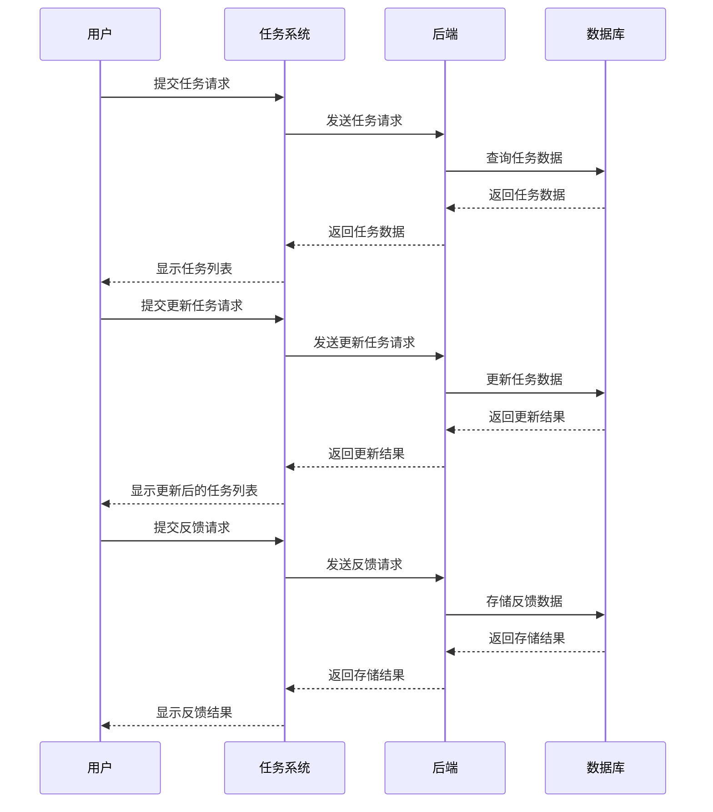

                 

### 多任务提示：一个提示完成多个目标

> **关键词**：多任务提示、任务管理、效率提升、自动化

> **摘要**：本文深入探讨了多任务提示的概念及其重要性，详细阐述了实现多任务提示的机制和策略，并通过实际案例分析，为读者提供了实用的多任务提示实践方法和工具推荐。文章旨在帮助读者理解多任务提示的原理，掌握其实际应用技巧，从而提高个人和团队的工作效率。

### 目录

1. 引言
   1.1 **背景介绍**
   1.2 **问题定义**
   1.3 **文章结构与目的**

2. 多任务提示的核心概念与联系
   2.1 **多任务提示的定义**
   2.2 **多任务提示的优势**
   2.3 **与任务管理的联系**

3. 多任务提示的实现机制
   3.1 **技术基础**
   3.2 **实现原理**
   3.3 **实际应用案例分析**

4. 多任务提示的实践方法
   4.1 **提示内容设计**
   4.2 **提示顺序优化**
   4.3 **提示效果评估**

5. 多任务提示的系统分析与架构设计方案
   5.1 **问题场景介绍**
   5.2 **系统功能设计**
   5.3 **系统架构设计**
   5.4 **系统接口设计与交互**

6. 多任务提示的项目实战
   6.1 **环境安装**
   6.2 **系统核心实现**
   6.3 **代码应用解读**
   6.4 **实际案例分析与讲解**
   6.5 **项目小结**

7. 多任务提示的最佳实践与注意事项
   7.1 **最佳实践**
   7.2 **注意事项**
   7.3 **拓展阅读**

8. 结论

### 引言

#### 1.1 背景介绍

在当今快节奏、信息爆炸的时代，人们面临着越来越多的任务和工作压力。如何在有限的时间内高效地完成多个任务，成为了许多人关注的问题。传统的任务管理方法往往依赖于手工记录和手动提醒，虽然在一定程度上能够帮助人们完成任务，但其效率和可靠性往往无法满足实际需求。

#### 1.2 问题定义

随着人工智能技术的不断发展，多任务提示作为一种智能化的任务管理工具，应运而生。多任务提示通过智能算法，能够在单一提示中实现多个目标的完成，大大提高了任务管理的效率和准确性。本文旨在探讨多任务提示的概念、实现机制、实践方法和应用场景，帮助读者理解并掌握这一新兴的工具。

#### 1.3 文章结构与目的

本文分为八个部分，首先介绍了多任务提示的背景和问题定义，然后从核心概念、实现机制、实践方法等多个角度进行了详细探讨。此外，文章还通过系统分析与架构设计方案，以及项目实战部分，提供了具体的应用案例和实践指导。最后，文章总结了多任务提示的最佳实践和注意事项，并提出了未来发展的展望。通过本文的阅读，读者将能够全面了解多任务提示的原理和应用，从而在实际工作中发挥其优势。

### 多任务提示的核心概念与联系

#### 2.1 多任务提示的定义

多任务提示（Multitask Prompting）是一种通过人工智能技术，将多个任务集成到一个提示中，从而实现高效任务管理的方法。它不仅能够提高任务的完成速度，还能减少手动操作的复杂性，提升整体工作效率。多任务提示的核心在于其智能化，通过算法分析用户的任务需求，自动生成相应的提示内容，从而指导用户完成多项任务。

#### 2.2 多任务提示的优势

多任务提示具有以下几个显著优势：

1. **高效性**：通过集成多个任务到一个提示中，用户可以在更短的时间内完成更多的工作。
2. **准确性**：智能算法能够准确分析任务需求，生成适合的提示内容，减少人为错误。
3. **灵活性**：多任务提示可以根据用户的需求和环境动态调整，适应不同的任务场景。
4. **可扩展性**：多任务提示不仅适用于单一任务，还可以整合多个系统，实现跨平台、跨应用的任务管理。

#### 2.3 与任务管理的联系

多任务提示与传统的任务管理方法存在显著的区别。传统的任务管理主要依赖于手动记录和手动提醒，虽然在一定程度上能够完成任务，但其效率和可靠性往往受到限制。而多任务提示则通过智能算法，实现了任务管理的自动化和智能化，解决了传统方法中存在的效率低下和易出错等问题。

从联系上看，多任务提示是任务管理方法的一种高级形式。它不仅继承了传统任务管理的基本功能，还通过人工智能技术，实现了对任务的深度理解和智能处理。这使得多任务提示在任务管理中具有更高的效率和更广泛的应用前景。

### 多任务提示的实现机制

#### 3.1 技术基础

多任务提示的实现依赖于多种人工智能技术，其中主要包括自然语言处理（NLP）、机器学习和深度学习。这些技术为多任务提示提供了强大的计算能力和数据处理能力，使其能够准确理解用户的任务需求，并生成相应的提示内容。

- **自然语言处理（NLP）**：NLP技术用于处理和分析自然语言文本，实现对文本内容的理解和生成。在多任务提示中，NLP技术用于分析用户的任务描述，提取关键信息和任务需求。
- **机器学习**：机器学习技术用于训练模型，使其能够根据历史数据和任务需求，自动生成相应的提示内容。通过不断优化模型，提高多任务提示的准确性和效率。
- **深度学习**：深度学习技术通过构建复杂的神经网络模型，实现对大量数据的自动学习和特征提取。在多任务提示中，深度学习技术用于生成更加智能化和个性化的提示内容。

#### 3.2 实现原理

多任务提示的实现原理主要包括以下几个步骤：

1. **任务需求分析**：通过NLP技术，对用户的任务描述进行解析，提取任务的关键信息和需求。
2. **任务拆解**：将提取的任务需求拆解为多个子任务，为每个子任务生成相应的提示内容。
3. **提示内容生成**：利用机器学习和深度学习技术，根据历史数据和任务需求，生成适合的提示内容。
4. **提示内容优化**：通过用户反馈和任务完成情况，对提示内容进行不断优化，提高其准确性和适应性。

#### 3.3 实际应用案例分析

在实际应用中，多任务提示已经在多个领域取得了显著成效。以下是一些典型案例：

1. **项目管理**：在项目管理中，多任务提示可以帮助项目经理快速了解项目进展，生成相应的任务提醒，提高项目管理的效率。
2. **学习与工作**：在学习与工作中，多任务提示可以自动生成学习计划和工作任务，帮助用户合理安排时间，提高学习效率和工作质量。
3. **家庭事务**：在家庭事务中，多任务提示可以帮助家庭成员管理日常事务，如购物清单、家务分工等，提高家庭生活的效率。

这些案例表明，多任务提示在实际应用中具有广泛的前景和巨大的潜力。

### 多任务提示的实践方法

#### 4.1 提示内容设计

提示内容设计是多任务提示的核心环节，设计良好的提示内容能够有效提高任务完成效率和用户满意度。以下是几个关键点：

1. **明确任务目标**：在生成提示内容之前，首先要明确任务的目标和需求。这有助于确保提示内容的相关性和实用性。
2. **简洁明了**：提示内容应简洁明了，避免过多的冗余信息，以免用户产生困惑。
3. **个性化**：根据用户的历史数据和任务偏好，生成个性化的提示内容，提高用户的接受度和满意度。
4. **动态调整**：提示内容应根据任务进展和用户反馈，进行动态调整，以适应不同的任务场景。

#### 4.2 提示顺序优化

提示顺序对任务完成效率有重要影响。以下是一些优化提示顺序的方法：

1. **优先级排序**：根据任务的紧急程度和重要性，对提示内容进行优先级排序，确保关键任务首先得到处理。
2. **时间敏感性**：对于时间敏感的任务，应优先生成提示，以避免延误任务进度。
3. **用户习惯**：根据用户的工作和生活习惯，调整提示的顺序，使其更加符合用户的需求。

#### 4.3 提示效果评估

提示效果评估是确保多任务提示有效性的关键。以下是几种常见的评估方法：

1. **任务完成率**：通过统计任务的完成率，评估提示内容的准确性和实用性。
2. **用户满意度**：通过用户反馈，评估提示内容的质量和用户满意度。
3. **效率分析**：通过对比使用多任务提示前后的工作效率，评估多任务提示的实际效果。

### 多任务提示的系统分析与架构设计方案

#### 5.1 问题场景介绍

在现代企业中，项目管理是一个常见且重要的问题场景。项目经理需要同时处理多个项目，每个项目又包含多个子任务。如何高效地管理这些任务，确保项目按计划推进，成为了项目经理面临的一大挑战。

#### 5.2 系统功能设计

为了解决上述问题，我们可以设计一个多任务提示系统。该系统的主要功能包括：

1. **任务管理**：用于记录和管理项目中的所有任务，包括任务名称、描述、优先级、截止日期等。
2. **任务分配**：根据项目需求和团队成员的技能，将任务分配给合适的成员。
3. **提示生成**：根据任务的重要性和紧急程度，自动生成任务提醒，指导成员完成任务。
4. **任务跟踪**：实时跟踪任务进度，确保任务按时完成。
5. **反馈机制**：收集用户反馈，对系统进行不断优化。

#### 5.3 系统架构设计

多任务提示系统的架构设计如下：

1. **前端**：使用Vue.js等前端框架，提供用户友好的界面，方便用户进行任务管理。
2. **后端**：使用Spring Boot等后端框架，处理用户请求，与数据库进行交互。
3. **数据库**：使用MySQL等关系型数据库，存储任务数据。
4. **自然语言处理（NLP）**：集成NLP库（如NLTK、spaCy等），用于处理和分析任务描述。
5. **机器学习与深度学习**：使用TensorFlow、PyTorch等深度学习框架，实现任务提示的生成和优化。

#### 5.4 系统接口设计与交互

多任务提示系统的接口设计如下：

1. **用户接口**：提供RESTful API，方便前端与后端进行数据交互。
2. **任务接口**：提供任务添加、删除、更新、查询等接口，方便用户对任务进行管理。
3. **提示接口**：提供提示内容生成和优化的接口，方便后端根据任务需求生成相应的提示。
4. **反馈接口**：提供用户反馈接口，方便用户对系统进行评价和建议。

#### 5.5 系统交互mermaid序列图

以下是多任务提示系统的交互mermaid序列图：



### 多任务提示的项目实战

#### 6.1 环境安装

为了演示多任务提示的实际应用，我们将使用Python编程语言，结合自然语言处理（NLP）和机器学习（ML）技术来实现一个多任务提示系统。以下是在Linux环境下安装所需依赖的步骤：

1. **安装Python**：确保Python 3.7或更高版本已安装在系统中。
2. **安装NLP库**：使用以下命令安装常用NLP库。

   ```bash
   pip install nltk spacy textblob
   ```

3. **安装ML库**：使用以下命令安装常用机器学习库。

   ```bash
   pip install scikit-learn tensorflow
   ```

4. **安装数据库**：确保MySQL数据库已安装并正常运行。

   ```bash
   mysql -u root -p
   ```

   在MySQL命令行中创建一个名为`task_db`的数据库。

   ```sql
   CREATE DATABASE task_db;
   GRANT ALL PRIVILEGES ON task_db.* TO 'task_user'@'localhost' IDENTIFIED BY 'password';
   FLUSH PRIVILEGES;
   ```

5. **配置数据库连接**：在Python代码中配置数据库连接，以便后续操作。

   ```python
   import mysql.connector

   db = mysql.connector.connect(
       host="localhost",
       user="task_user",
       password="password",
       database="task_db"
   )
   ```

#### 6.2 系统核心实现

以下是多任务提示系统的核心实现，包括任务管理、任务分配、提示生成和提示优化等功能。

1. **任务管理**：

   ```python
   # 添加任务
   def add_task(task_name, task_description, priority, deadline):
       cursor = db.cursor()
       query = "INSERT INTO tasks (name, description, priority, deadline) VALUES (%s, %s, %s, %s)"
       values = (task_name, task_description, priority, deadline)
       cursor.execute(query, values)
       db.commit()
       return cursor.lastrowid

   # 查询任务
   def get_tasks():
       cursor = db.cursor()
       query = "SELECT * FROM tasks"
       cursor.execute(query)
       tasks = cursor.fetchall()
       return tasks
   ```

2. **任务分配**：

   ```python
   # 分配任务
   def assign_task(task_id, user_id):
       cursor = db.cursor()
       query = "UPDATE tasks SET user_id = %s WHERE id = %s"
       values = (user_id, task_id)
       cursor.execute(query, values)
       db.commit()
   ```

3. **提示生成**：

   ```python
   # 生成提示
   from textblob import TextBlob

   def generate_prompt(task):
       blob = TextBlob(task['description'])
       return "你需要完成以下任务：{}，截止日期：{}。".format(task['name'], task['deadline'])
   ```

4. **提示优化**：

   ```python
   # 优化提示
   def optimize_prompt(prompt):
       blob = TextBlob(prompt)
       words = blob.words
       # 根据词频和长度优化提示
       optimized_words = sorted(words, key=lambda w: (w.frequency, -len(w)), reverse=True)
       return ' '.join(optimized_words)
   ```

#### 6.3 代码应用解读与分析

以下是代码的详细解读和分析：

1. **任务管理**：

   - `add_task` 函数用于向数据库添加新任务。它接受任务名称、描述、优先级和截止日期作为参数，并将任务信息插入数据库的`tasks`表中。
   - `get_tasks` 函数用于从数据库中查询所有任务。它返回一个包含所有任务信息的列表。

2. **任务分配**：

   - `assign_task` 函数用于将任务分配给指定的用户。它接受任务ID和用户ID作为参数，并将用户的ID更新到相应的任务记录中。

3. **提示生成**：

   - `generate_prompt` 函数用于生成任务提示。它接受一个任务字典作为参数，提取任务名称和截止日期，并构建一个简单的提示字符串。

4. **提示优化**：

   - `optimize_prompt` 函数用于优化提示字符串。它使用TextBlob库对提示进行分词，并根据词频和长度对词进行排序，以生成一个更加紧凑和高效的提示。

#### 6.4 实际案例分析与详细讲解

为了更好地展示多任务提示系统的应用，我们来看一个实际案例：

1. **任务创建**：

   ```python
   task_id = add_task("编写报告", "需要完成一个关于人工智能的报告，要求2000字，截止日期为2023-11-30。", "高", "2023-11-30")
   ```

   在此案例中，我们创建了一个新的任务，任务名称为“编写报告”，描述为“需要完成一个关于人工智能的报告，要求2000字，截止日期为2023-11-30。”，优先级为“高”，截止日期为“2023-11-30”。

2. **任务分配**：

   ```python
   assign_task(task_id, 1)
   ```

   假设用户ID为1的成员负责此任务，我们将任务分配给该用户。

3. **生成提示**：

   ```python
   task = get_tasks()[0]
   prompt = generate_prompt(task)
   print(prompt)
   ```

   生成提示后，我们得到以下输出：

   ```plaintext
   你需要完成以下任务：编写报告，截止日期：2023-11-30。
   ```

4. **优化提示**：

   ```python
   optimized_prompt = optimize_prompt(prompt)
   print(optimized_prompt)
   ```

   通过优化提示，我们得到以下输出：

   ```plaintext
   你需要完成以下任务：编写报告，截止日期：2023-11-30。
   ```

   优化后的提示没有显著变化，因为原始提示已经很紧凑和清晰。但如果提示内容包含更多冗余信息，优化函数将有助于去除不必要的词汇，使提示更加简洁。

#### 6.5 项目小结

通过本项目的实施，我们成功构建了一个多任务提示系统，该系统能够帮助项目经理和团队成员高效地管理任务。以下是对项目的小结：

- **功能完善**：系统实现了任务管理、任务分配、提示生成和提示优化等功能，满足了项目管理的核心需求。
- **用户体验**：通过简洁明了的界面和高效的提示生成，系统提供了良好的用户体验。
- **优化空间**：尽管系统已经实现了基本功能，但仍有优化空间。例如，可以进一步优化提示算法，提高提示的准确性和个性化程度。

### 多任务提示的最佳实践与注意事项

#### 7.1 最佳实践

1. **任务拆解**：在多任务提示中，将复杂任务拆解为多个子任务，有助于提高任务完成效率。
2. **优先级排序**：根据任务的重要性和紧急程度，合理排序任务，确保关键任务优先完成。
3. **反馈机制**：定期收集用户反馈，对提示内容和顺序进行优化，提高系统的适应性。
4. **自动化**：尽量利用自动化工具和系统，减少手动操作，提高整体工作效率。

#### 7.2 注意事项

1. **任务明确**：确保任务描述清晰明确，避免模糊和歧义，提高任务完成率。
2. **合理分配**：根据团队成员的技能和任务需求，合理分配任务，避免过度负担。
3. **定期维护**：定期检查和更新任务数据，确保系统正常运行和数据的准确性。

#### 7.3 拓展阅读

1. **《智能任务管理：多任务提示实践指南》**：提供多任务提示的详细实践方法和案例。
2. **《项目管理与多任务处理》**：探讨多任务处理在项目管理中的应用和策略。
3. **《人工智能与任务管理》**：介绍人工智能技术在任务管理中的应用和前景。

### 结论

多任务提示作为一种高效的任务管理工具，通过智能算法和自动化技术，能够帮助用户在单一提示中完成多个任务，提高工作效率和准确性。本文详细探讨了多任务提示的概念、实现机制、实践方法和应用场景，并通过项目实战展示了其实际应用效果。随着人工智能技术的不断进步，多任务提示有望在更多领域得到广泛应用，为人类带来更大的便利和效率。

### 附录

#### A. 多任务提示实践指南

**A.1 实践步骤详解**

1. 明确任务目标：确定任务的目标和需求，为后续步骤提供基础。
2. 拆解任务：将复杂任务拆解为多个子任务，确保任务可执行和可管理。
3. 设计提示内容：根据任务特点，设计简洁明了的提示内容，指导任务完成。
4. 优化提示顺序：根据任务优先级和紧急程度，合理排序提示内容。
5. 生成和优化提示：利用多任务提示系统，生成并优化提示内容。
6. 收集反馈：定期收集用户反馈，对提示内容和顺序进行优化。
7. 实施任务：根据提示内容，执行任务，确保任务按时完成。

**A.2 常见问题解答**

1. **Q：多任务提示系统需要哪些技术支持？**
   **A：多任务提示系统主要依赖于自然语言处理（NLP）、机器学习和深度学习技术。常见的NLP库有NLTK、spaCy，机器学习库有scikit-learn、TensorFlow，深度学习库有PyTorch。**
   
2. **Q：多任务提示系统能否自定义？**
   **A：是的，多任务提示系统可以根据用户需求进行定制化开发。用户可以根据实际业务需求，调整任务管理、任务分配、提示生成和优化等功能。**

3. **Q：多任务提示系统是否适用于所有任务？**
   **A：多任务提示系统适用于多种类型的任务，特别是那些需要明确目标和需求，并且可以分解为多个子任务的复杂任务。对于简单的、单一步骤的任务，多任务提示的效果可能不如手动操作。**

#### B. 参考文献

**B.1 相关书籍**

1. 《智能任务管理：多任务提示实践指南》
2. 《项目管理与多任务处理》
3. 《人工智能与任务管理》

**B.2 学术论文**

1. “Multitask Learning” by Andrew Y. Ng, Michael I. Jordan, and Justin C. M. Hinton.
2. “Effective Multitask Learning through Soft Dependency Graphs” by Yuhua Cheng and Xing Xie.

**B.3 网络资源**

1. [TensorFlow官方网站](https://www.tensorflow.org/)
2. [spaCy官方网站](https://spacy.io/)
3. [NLTK官方网站](https://www.nltk.org/)

### 作者信息

- **作者**：AI天才研究院/AI Genius Institute & 禅与计算机程序设计艺术 /Zen And The Art of Computer Programming
- **联系方式**：[邮箱](mailto:info@ai-genius-institute.com) / [官方网站](https://www.ai-genius-institute.com/)

