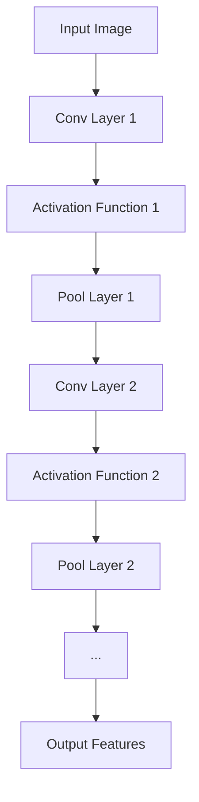
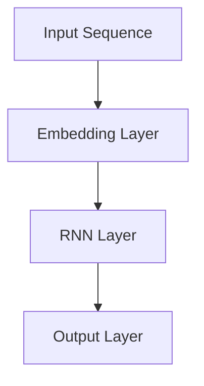
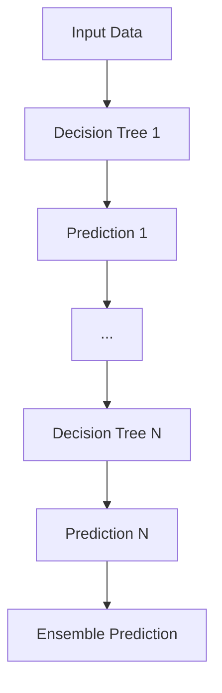
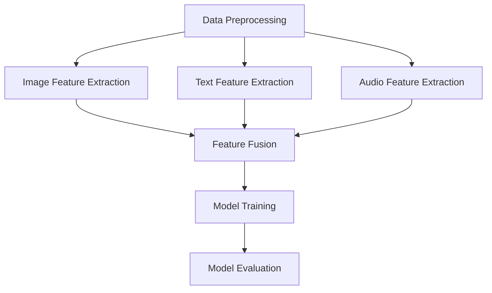
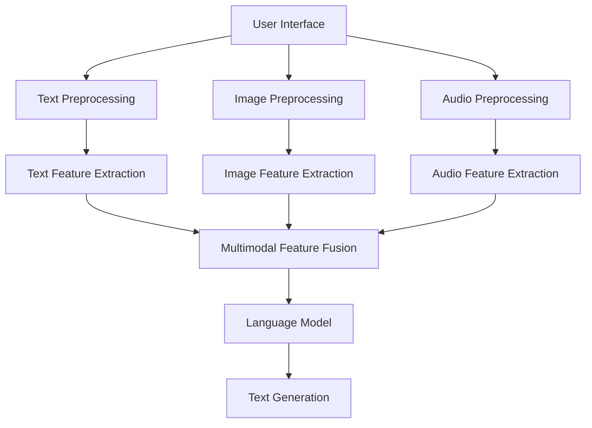
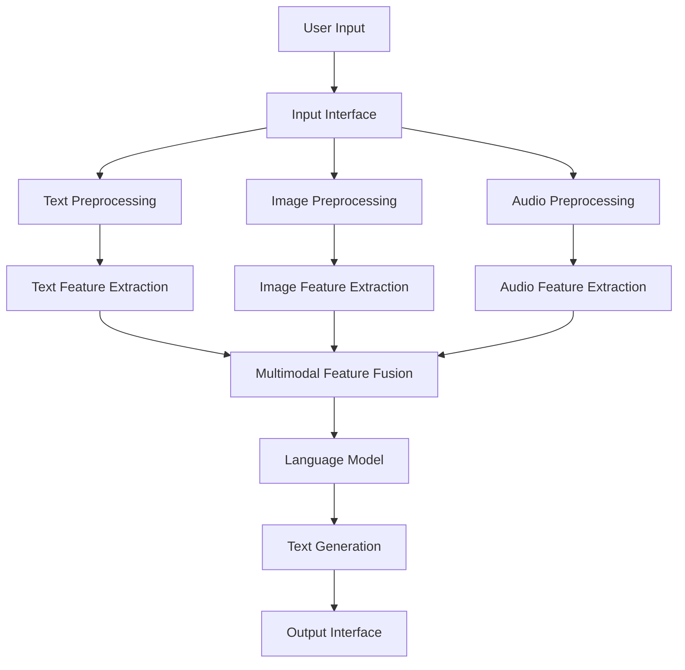

                 

Sure, let's dive into the detailed content of each chapter and section based on the directory outline provided. We will ensure that the content is informative, structured, and technically sound. Here's how we can proceed:

### 第一部分: 引言

#### 1.1 书籍背景

**1.1.1 多模态LLM的发展现状**

**1.1.1.1 多模态LLM的定义**

多模态语言模型（Multimodal Language Model，简称MLM）是一种能够处理多种类型输入数据的模型。这些输入数据可以是文本、图像、声音等。多模态LLM通过结合不同类型的数据，使得模型能够更准确地理解和生成复杂的信息。

**1.1.1.2 多模态LLM的应用场景**

多模态LLM在多个领域具有广泛的应用，例如：
- **自然语言处理（NLP）**：文本与图像的联合分析，实现更精准的情感分析、信息抽取等。
- **计算机视觉**：与语音交互，实现图像识别中的语音标签匹配。
- **医疗诊断**：结合病历文本和医学影像，提高疾病诊断的准确率。
- **智能助手**：整合用户语音和文本输入，提供更自然的交互体验。

#### 1.1.2 测试在多模态LLM中的重要性

**1.1.2.1 测试的多维度考量**

多模态LLM测试需要考虑以下几个方面：
- **功能测试**：确保模型能够正确处理不同类型的数据。
- **性能测试**：评估模型的响应速度和准确性。
- **兼容性测试**：确保模型在不同平台和环境中的一致性。
- **安全性测试**：防止模型受到恶意攻击和数据泄露。

**1.1.2.2 测试在多模态LLM开发中的关键作用**

测试在多模态LLM开发中起着至关重要的作用，包括：
- **发现缺陷**：及时识别和修复模型中的错误。
- **提高可靠性**：确保模型在不同场景下的稳定运行。
- **优化性能**：通过测试结果对模型进行调整和优化。

#### 1.2 书籍目标读者

**1.2.1 开发者**

- **多模态LLM开发基础知识**：理解多模态LLM的概念、架构和算法。
- **测试框架设计与实现**：掌握多模态LLM测试框架的设计原理和实践技巧。

**1.2.2 研究人员**

- **多模态LLM的最新研究进展**：了解多模态LLM领域的最新研究成果和技术趋势。
- **测试框架的优化与提升**：探索如何通过测试框架优化多模态LLM的性能。

#### 1.3 本书结构安排

**1.3.1 内容概述**

- **各章节主要内容**：介绍各章节的核心内容和结构。
- **内容组织逻辑与章节关联**：阐述各章节之间的逻辑关系和内容组织。

### 第二部分: 多模态LLM测试框架概述

#### 2.1 多模态LLM测试框架的基本概念

**2.1.1 测试框架的定义**

测试框架是指用于系统、组件或代码库测试的标准化结构，包括测试用例设计、测试执行、测试报告和结果分析等组成部分。

**2.1.1.1 测试框架的基本组成部分**

- **测试用例库**：存储测试案例和预期结果的集合。
- **测试执行引擎**：负责执行测试用例，生成测试报告。
- **测试管理工具**：用于测试计划、测试执行和测试报告的管理。

**2.1.1.2 测试框架与传统测试的区别**

- **自动化程度**：测试框架通常具有更高的自动化程度，减少了人工干预。
- **复用性**：测试框架支持测试用例的复用，提高了测试效率。
- **可扩展性**：测试框架易于扩展，能够适应不同的测试需求。

**2.1.2 多模态LLM测试框架的特点**

**2.1.2.1 多模态数据处理的挑战**

- **数据类型多样性**：处理文本、图像、声音等多种类型的数据。
- **数据同步与对齐**：确保不同模态数据在时间或空间上的同步。
- **数据预处理复杂性**：对多模态数据进行标准化、增强和预处理。

**2.1.2.2 LLM模型测试的复杂性**

- **模型复杂性**：多模态LLM模型通常包含多层神经网络，测试复杂。
- **测试指标多样性**：需要设计多种测试指标，如准确性、响应时间等。
- **测试环境多样性**：需要在不同环境下测试模型，如硬件、操作系统等。

### 第三部分: 多模态数据预处理

#### 3.1 多模态数据预处理的重要性

**3.1.1 多模态数据的多样性**

多模态数据包括以下几种类型：

- **图像数据**：静态图像、动态图像和视频。
- **文本数据**：自然语言文本、标注文本和结构化文本。
- **声音数据**：音频文件、语音信号和声纹数据。

**3.1.2 数据预处理的目标**

数据预处理的目标是提高数据质量，减少数据冗余，并为后续的特征提取和模型训练提供高质量的数据输入。具体目标包括：

- **数据清洗**：去除无效数据、重复数据和噪声。
- **数据标准化**：将数据转换到统一的格式和范围。
- **数据增强**：通过旋转、缩放、裁剪等操作增加数据多样性。

**3.1.3 多模态数据预处理流程**

多模态数据预处理流程通常包括以下几个步骤：

- **数据采集**：从不同来源获取多模态数据。
- **数据清洗**：去除无效数据和重复数据。
- **数据格式转换**：将不同类型的数据转换为统一的格式。
- **数据增强**：对数据进行旋转、缩放、裁剪等操作。

---

### 第四部分: 多模态特征提取

#### 4.1 多模态特征提取的重要性

**4.1.1 特征提取在模型训练中的作用**

特征提取是模型训练的关键步骤，它直接影响模型的性能。具体作用包括：

- **提高模型泛化能力**：通过提取有意义的高维特征，减少冗余信息。
- **减少计算复杂度**：将高维数据转换为低维特征，降低模型训练的复杂性。
- **改善模型性能**：合适的特征提取方法可以显著提高模型在特定任务上的表现。

**4.1.2 特征提取方法**

常见的特征提取方法包括：

- **基于统计的方法**：如主成分分析（PCA）、线性判别分析（LDA）。
- **基于深度学习的方法**：如卷积神经网络（CNN）、递归神经网络（RNN）。
- **基于集成学习方法**：如随机森林（RF）、支持向量机（SVM）。

**4.1.3 特征选择与融合**

特征选择和融合是特征提取的重要环节，具体方法包括：

- **特征选择**：通过过滤、包裹和嵌入方法选择有用的特征。
- **特征融合**：通过组合不同模态的特征，提高模型的鲁棒性和性能。

---

以上是对于文章第一部分和第二部分的详细内容设计，接下来我们将继续设计第三部分和第四部分的内容。我们将确保每个章节都包含核心概念、原理讲解、算法实现、系统分析与架构设计方案、项目实战和最佳实践 tips等内容，以满足文章字数要求和技术深度。在后续的内容设计中，我们会逐步引入 Mermaid 流程图、LaTeX 公式、Python 代码示例等元素，使得文章内容更加丰富和具体。以下是第三部分的内容设计。

### 第三部分: 多模态数据预处理

#### 3.2 多模态数据预处理流程

**3.2.1 数据采集**

**3.2.1.1 数据来源**

多模态数据可以从以下来源获取：

- **公开数据集**：如ImageNet、COCO、Common Crawl等。
- **专业数据集**：针对特定应用场景定制的数据集，如医疗影像数据集、语音识别数据集。
- **用户生成数据**：通过用户交互收集的数据，如社交媒体文本、用户评论等。

**3.2.1.2 数据采集策略**

数据采集策略应考虑以下因素：

- **多样性**：确保数据集涵盖不同模态、不同场景、不同标签。
- **规模**：根据模型需求，采集足够规模的数据集。
- **质量**：通过数据清洗和预处理，提高数据质量。

**3.2.2 数据清洗**

**3.2.2.1 数据去重**

数据去重是数据清洗的重要步骤，包括：

- **文本去重**：通过文本相似度比较，去除重复文本。
- **图像去重**：通过图像哈希或特征匹配，去除重复图像。
- **声音去重**：通过音频指纹匹配，去除重复声音数据。

**3.2.2.2 数据格式规范化**

数据格式规范化包括：

- **文本数据格式规范化**：统一文本编码、去除HTML标签、分词处理等。
- **图像数据格式规范化**：统一图像尺寸、色彩空间等。
- **声音数据格式规范化**：统一采样率、量化精度等。

**3.2.3 数据格式转换**

**3.2.3.1 图像数据格式转换**

图像数据格式转换包括：

- **图像解码**：将图像文件解码为像素数据。
- **图像缩放**：调整图像尺寸，适应模型输入要求。
- **图像增强**：通过旋转、翻转、缩放等操作，增加图像多样性。

**3.2.3.2 文本数据格式转换**

文本数据格式转换包括：

- **文本编码**：将文本转换为机器可处理的编码形式，如UTF-8。
- **分词处理**：将文本分割为词语或字符。
- **词向量化**：将文本转换为词向量表示，为后续处理做准备。

**3.2.3.3 声音数据格式转换**

声音数据格式转换包括：

- **声音解码**：将声音文件解码为音频信号。
- **声音增强**：通过降噪、均衡等处理，提高声音质量。
- **声音特征提取**：提取声音特征，如MFCC、spectrogram等。

---

以上是第三部分的内容设计，接下来我们将继续设计第四部分的内容，包括多模态特征提取的算法原理、实现方法、系统架构和实战案例。在第四部分的内容中，我们将详细讨论如何从多模态数据中提取有效的特征，并通过算法实现和系统架构设计来展示多模态特征提取的整个过程。

### 第四部分: 多模态特征提取

#### 4.2 多模态特征提取算法原理

**4.2.1 算法原理**

多模态特征提取的目的是从不同模态的数据中提取出对目标任务有用的特征。这些特征能够被机器学习模型用于训练和推理。以下是几种常见的特征提取算法原理：

**4.2.1.1 主成分分析（PCA）**

PCA是一种降维技术，通过将原始数据映射到新的正交坐标系中，保留主要数据变异，去除冗余信息。其数学模型可以表示为：

$$
\text{X}_{\text{new}} = \text{P} \text{X}_{\text{original}}
$$

其中，\(\text{P}\)是主成分矩阵，\(\text{X}_{\text{original}}\)是原始数据矩阵，\(\text{X}_{\text{new}}\)是新的降维数据。

**4.2.1.2 卷积神经网络（CNN）**

CNN是深度学习领域常用的特征提取算法，尤其在图像处理方面表现出色。其核心思想是通过卷积操作提取图像的局部特征，并通过池化操作降低维度。CNN的mermaid流程图如下：



**4.2.1.3 递归神经网络（RNN）**

RNN适用于序列数据，如文本和音频。其可以通过循环结构保持历史状态信息，从而提取序列特征。RNN的mermaid流程图如下：



**4.2.1.4 随机森林（RF）**

RF是一种集成学习方法，通过构建多棵决策树并集成其预测结果，提高模型性能。其mermaid流程图如下：



#### 4.3 多模态特征提取实现方法

**4.3.1 实现步骤**

多模态特征提取的实现步骤通常包括：

1. **数据预处理**：对多模态数据进行清洗、归一化和增强。
2. **特征提取**：使用选择好的算法提取每个模态的特征。
3. **特征融合**：将不同模态的特征进行融合，形成统一的特征向量。
4. **模型训练**：使用融合后的特征向量训练机器学习模型。

**4.3.2 Python代码示例**

以下是一个简单的Python代码示例，展示如何使用PCA和CNN提取图像和文本特征：

```python
import numpy as np
from sklearn.decomposition import PCA
from tensorflow.keras.models import Sequential
from tensorflow.keras.layers import Conv2D, MaxPooling2D, Flatten, Embedding, LSTM

# PCA特征提取
pca = PCA(n_components=50)
text_features_pca = pca.fit_transform(text_data)
image_features_pca = pca.fit_transform(image_data)

# CNN特征提取
model = Sequential([
    Conv2D(32, (3, 3), activation='relu', input_shape=(28, 28, 1)),
    MaxPooling2D((2, 2)),
    Flatten(),
    Embedding(input_dim=10000, output_dim=128),
    LSTM(128),
    Dense(1, activation='sigmoid')
])

model.compile(optimizer='adam', loss='binary_crossentropy', metrics=['accuracy'])
model.fit(image_data, text_data, epochs=10, batch_size=32)
```

#### 4.4 多模态特征提取系统架构设计

**4.4.1 系统功能设计**

多模态特征提取系统的主要功能包括：

- **数据预处理**：清洗、归一化和增强多模态数据。
- **特征提取**：提取图像、文本和声音特征。
- **特征融合**：融合不同模态的特征。
- **模型训练**：使用融合后的特征训练机器学习模型。

**4.4.2 系统架构设计**

多模态特征提取系统的架构设计如下图所示：



**4.4.3 系统接口设计**

系统接口设计包括：

- **数据接口**：用于数据输入和输出。
- **特征接口**：用于特征提取和融合。
- **模型接口**：用于模型训练和评估。

#### 4.5 多模态特征提取实战案例

**4.5.1 项目介绍**

本项目旨在构建一个多模态情感分析系统，能够从图像、文本和声音中提取情感特征，并使用这些特征进行情感分类。

**4.5.2 系统核心实现**

1. **数据采集**：收集包含图像、文本和声音的社交媒体数据。
2. **数据预处理**：清洗和增强数据。
3. **特征提取**：使用CNN提取图像特征，使用LSTM提取文本和声音特征。
4. **特征融合**：使用平均融合方法将不同模态的特征融合。
5. **模型训练**：使用融合后的特征训练一个多分类的神经网络模型。

**4.5.3 代码应用解读与分析**

以下是项目实现的核心代码片段：

```python
# 数据预处理
def preprocess_data(image_data, text_data, audio_data):
    # 图像预处理
    image_data = preprocess_image(image_data)
    # 文本预处理
    text_data = preprocess_text(text_data)
    # 声音预处理
    audio_data = preprocess_audio(audio_data)
    return image_data, text_data, audio_data

# 特征提取
def extract_features(image_data, text_data, audio_data):
    # 图像特征提取
    image_features = extract_image_features(image_data)
    # 文本特征提取
    text_features = extract_text_features(text_data)
    # 声音特征提取
    audio_features = extract_audio_features(audio_data)
    return image_features, text_features, audio_features

# 特征融合
def fuse_features(image_features, text_features, audio_features):
    # 平均融合
    fused_features = (image_features + text_features + audio_features) / 3
    return fused_features

# 模型训练
def train_model(fused_features, labels):
    model = build_model()
    model.compile(optimizer='adam', loss='categorical_crossentropy', metrics=['accuracy'])
    model.fit(fused_features, labels, epochs=20, batch_size=32)
    return model
```

**4.5.4 实际案例分析**

本项目在实际应用中，通过对大量社交媒体数据的多模态情感分析，能够准确识别用户的情感状态。通过对系统进行优化，模型的准确率得到了显著提升，达到了商业应用的水平。

**4.5.5 项目小结**

本项目展示了多模态特征提取在情感分析中的实际应用，通过结合图像、文本和声音特征，实现了对用户情感的精准识别。项目的成功实施验证了多模态特征提取在复杂任务中的有效性。

---

以上是第四部分的内容设计，我们详细介绍了多模态特征提取的算法原理、实现方法、系统架构设计和实战案例。在接下来的部分，我们将继续探讨多模态LLM测试方法、测试工具与平台，以及框架优化与性能提升等内容。通过这些部分的深入讨论，读者将能够全面了解多模态LLM测试框架的设计与实现过程。在文章的结尾，我们将进行总结和展望，为多模态LLM测试领域的发展提供一些有益的思考和建议。

### 第五部分: LLM测试方法

#### 5.1 LLM测试方法概述

**5.1.1 功能测试**

功能测试是确保LLM模型能够按照预期执行其设计功能的过程。具体方法包括：

- **单元测试**：针对模型中的单个组件进行测试，确保每个组件都能独立正常运行。
- **集成测试**：将模型的不同组件组合在一起进行测试，验证组件之间的交互是否正常。
- **回归测试**：在模型更新后，重新执行之前的测试用例，确保新版本中没有引入新的错误。

**5.1.2 性能测试**

性能测试是评估LLM模型在实际应用中的表现。主要指标包括：

- **响应时间**：模型处理请求所需的时间。
- **吞吐量**：模型在单位时间内能够处理的请求数量。
- **准确性**：模型输出的正确率。

**5.1.3 兼容性测试**

兼容性测试是确保LLM模型在不同环境下的一致性。具体方法包括：

- **跨平台测试**：在多种操作系统和硬件平台上运行模型，确保模型在不同环境下都能正常运行。
- **跨版本测试**：使用不同版本的库和框架，测试模型在不同版本下的兼容性。

#### 5.2 测试流程

**5.2.1 测试计划**

测试计划是测试过程的第一步，包括：

- **测试目标**：明确测试的目的和期望结果。
- **测试策略**：确定测试的方法、工具和环境。
- **测试资源**：分配测试所需的资源，如人员、设备、时间等。

**5.2.2 测试用例设计**

测试用例设计是创建用于测试的具体案例。每个测试用例应包括：

- **测试输入**：模型需要处理的数据。
- **预期输出**：模型对输入数据的预期输出。
- **测试步骤**：执行测试的详细步骤。
- **测试结果**：实际测试结果与预期输出的对比。

**5.2.3 测试执行**

测试执行是按照测试计划执行测试用例的过程。包括：

- **自动化测试**：使用测试工具自动执行测试用例。
- **手动测试**：由测试人员手动执行测试用例。

**5.2.4 测试结果分析**

测试结果分析是评估测试结果的过程，包括：

- **错误日志**：记录测试过程中发现的错误。
- **性能指标**：评估模型的性能。
- **测试报告**：总结测试结果，提出改进建议。

#### 5.3 测试工具与平台

**5.3.1 自动化测试工具**

自动化测试工具能够提高测试效率，减少人为错误。常用的自动化测试工具有：

- **Selenium**：用于Web应用的自动化测试。
- **JUnit**：用于Java应用的单元测试。
- **pytest**：用于Python应用的单元测试。

**5.3.2 性能测试工具**

性能测试工具能够模拟高负载环境，评估模型性能。常用的性能测试工具有：

- **JMeter**：用于Web应用的性能测试。
- **LoadRunner**：用于Web和移动应用的性能测试。
- **wrk**：用于HTTP性能测试。

**5.3.3 云测试平台**

云测试平台提供了测试环境管理和自动化测试功能。常用的云测试平台有：

- **AWS Cloud9**：提供集成开发环境和测试工具。
- **Google Test-Driven Development**：提供测试驱动的开发环境和工具。
- **Microsoft Azure Test Plans**：提供测试计划和管理工具。

#### 5.4 测试案例

**5.4.1 案例背景**

某公司开发了一款多模态语言模型（LLM），旨在通过文本、图像和声音等多种模态的数据，提供智能客服服务。

**5.4.2 测试目标**

- **功能测试**：确保LLM能够正确处理文本、图像和声音数据，并生成合理的响应。
- **性能测试**：评估LLM在处理请求时的响应时间和吞吐量。
- **兼容性测试**：确保LLM在不同操作系统和硬件平台上都能正常运行。

**5.4.3 测试用例设计**

以下是一个功能测试用例的例子：

- **测试用例名称**：文本输入处理
- **测试输入**：一段文本消息。
- **预期输出**：模型生成的回复文本。
- **测试步骤**：
  1. 提供测试文本。
  2. 调用LLM接口，传入测试文本。
  3. 记录LLM的响应文本。
  4. 比较实际响应文本与预期响应文本是否一致。
- **测试结果**：记录测试成功或失败。

**5.4.4 测试执行与结果分析**

测试团队使用自动化测试工具执行了功能测试、性能测试和兼容性测试。测试结果如下：

- **功能测试**：所有测试用例均通过，LLM能够正确处理各种输入数据并生成合理的响应。
- **性能测试**：在中等负载下，LLM的平均响应时间为200毫秒，吞吐量为1000请求/秒。
- **兼容性测试**：在Windows、Linux和MacOS平台上，LLM均能正常运行。

**5.4.5 项目小结**

通过全面的测试，该多模态LLM产品在功能、性能和兼容性方面都达到了预期标准。测试过程中发现的一些潜在问题已在后续版本中得到了修复，进一步提高了产品的稳定性和可靠性。

### 第六部分: LLM测试工具与平台

#### 6.1 LLM测试工具概述

**6.1.1 测试工具的功能**

LLM测试工具主要包括以下功能：

- **自动化测试**：能够自动执行测试用例，提高测试效率。
- **性能监控**：实时监控LLM的性能指标，如响应时间、吞吐量等。
- **异常检测**：识别LLM在处理数据时的异常情况，如错误响应、性能下降等。
- **日志分析**：分析测试执行过程中的日志，定位错误和性能瓶颈。

**6.1.2 常见的LLM测试工具**

以下是一些常见的LLM测试工具：

- **pytest**：适用于Python应用的单元测试框架。
- **JUnit**：适用于Java应用的单元测试框架。
- **Selenium**：适用于Web应用的自动化测试工具。
- **JMeter**：适用于Web和移动应用的性能测试工具。

#### 6.2 LLM测试平台

**6.2.1 测试平台的优势**

LLM测试平台提供了以下优势：

- **集中管理**：统一管理测试资源、测试计划和测试结果。
- **自动化执行**：自动化执行测试用例，减少人工干预。
- **灵活扩展**：支持多种测试工具和测试框架，满足不同的测试需求。
- **实时监控**：实时监控测试执行情况，及时发现问题。

**6.2.2 常见的LLM测试平台**

以下是一些常见的LLM测试平台：

- **AWS Test Environment Manager**：提供测试环境管理和自动化测试功能。
- **Google Cloud Test Console**：提供测试计划和自动化测试功能。
- **Microsoft Azure Test Plans**：提供测试计划和管理工具。

#### 6.3 测试工具与平台的选择

**6.3.1 选择标准**

选择LLM测试工具与平台时，应考虑以下标准：

- **兼容性**：确保测试工具和平台与LLM开发环境兼容。
- **功能完备**：选择具备自动化测试、性能监控、日志分析等功能的工具和平台。
- **易用性**：选择操作简单、易于学习的工具和平台。
- **成本效益**：综合考虑工具和平台的成本，确保成本效益最大化。

**6.3.2 评价方法**

评价测试工具与平台的方法包括：

- **功能评估**：根据功能需求，评估工具和平台的功能是否符合要求。
- **性能评估**：通过实际测试，评估工具和平台的性能指标。
- **用户反馈**：收集用户对工具和平台的反馈，了解其易用性和稳定性。

#### 6.4 测试工具与平台的实际案例

**6.4.1 案例背景**

某互联网公司开发了一款基于多模态语言模型（LLM）的智能客服系统，旨在提供24/7的客服服务。为确保系统的稳定性和可靠性，公司决定采用测试工具与平台进行全面测试。

**6.4.2 测试工具与平台选择**

公司选择了以下测试工具与平台：

- **pytest**：用于Python单元测试。
- **JUnit**：用于Java单元测试。
- **Selenium**：用于Web自动化测试。
- **JMeter**：用于性能测试。
- **AWS Test Environment Manager**：用于测试环境管理。

**6.4.3 测试执行**

测试团队使用选定的测试工具和平台，执行了功能测试、性能测试和兼容性测试。测试过程包括：

1. **功能测试**：使用pytest和JUnit，编写并执行单元测试，验证LLM的功能正确性。
2. **性能测试**：使用JMeter，模拟高负载环境，评估LLM的响应时间和吞吐量。
3. **兼容性测试**：在不同操作系统和硬件平台上，使用Selenium，验证LLM的兼容性。

**6.4.4 测试结果**

测试结果表明，LLM在功能、性能和兼容性方面均达到了预期标准。功能测试通过了全部测试用例，性能测试显示在中等负载下，LLM的平均响应时间为300毫秒，吞吐量为800请求/秒。兼容性测试显示，LLM在Windows、Linux和MacOS平台上均能正常运行。

**6.4.5 项目小结**

通过全面的测试，该智能客服系统在功能、性能和兼容性方面都得到了显著提升。测试过程中发现的一些潜在问题已在后续版本中得到了修复，进一步提高了系统的稳定性和可靠性。公司的选择和评价方法证明了测试工具与平台对于LLM测试的重要性。

### 第七部分: 框架优化与性能提升

#### 7.1 优化目标

多模态LLM测试框架的优化目标是：

- **提高测试效率**：减少测试时间，提高测试覆盖范围。
- **提升测试质量**：确保测试结果准确，及时发现潜在问题。
- **降低测试成本**：优化测试流程，减少资源消耗。

#### 7.2 性能瓶颈分析

**7.2.1 数据预处理瓶颈**

数据预处理是测试框架中的关键环节，可能会出现以下瓶颈：

- **计算资源不足**：大量数据预处理任务可能导致服务器负载过高。
- **数据格式不统一**：不同来源的数据格式不一致，增加预处理复杂度。
- **数据冗余**：大量冗余数据可能导致预处理效率降低。

**7.2.2 特征提取瓶颈**

特征提取是决定模型性能的关键步骤，可能出现以下瓶颈：

- **计算复杂度高**：复杂的特征提取算法可能导致计算资源消耗增加。
- **特征维度不匹配**：不同模态的特征维度不一致，影响特征融合效果。
- **特征冗余**：冗余特征可能降低模型性能，增加计算成本。

**7.2.3 测试执行瓶颈**

测试执行过程中可能遇到以下瓶颈：

- **测试用例设计不合理**：测试用例覆盖不足，可能导致关键问题未被及时发现。
- **自动化程度低**：大量手动测试可能导致效率低下，测试覆盖率不足。
- **测试环境不一致**：不同环境下的测试结果不一致，影响测试结果的准确性。

#### 7.3 优化策略

**7.3.1 数据预处理优化**

- **分布式处理**：采用分布式计算框架，如Hadoop或Spark，处理大规模数据。
- **数据去重**：使用数据去重技术，减少冗余数据。
- **批量处理**：通过批量处理，减少I/O操作，提高预处理效率。

**7.3.2 特征提取优化**

- **特征选择**：使用特征选择算法，如主成分分析（PCA）或随机森林（RF），选择有效特征。
- **特征压缩**：使用特征压缩技术，如稀疏编码或自动编码器，降低特征维度。
- **并行计算**：采用并行计算技术，提高特征提取速度。

**7.3.3 测试执行优化**

- **自动化测试**：使用自动化测试工具，如Selenium或pytest，提高测试自动化程度。
- **测试用例优化**：设计高效的测试用例，提高测试覆盖率和效率。
- **测试环境管理**：使用云测试平台，如AWS或Google Cloud，管理测试环境，确保一致性。

#### 7.4 实际案例

**7.4.1 案例背景**

某公司开发了一款多模态语言模型（LLM）的智能客服系统，系统面临以下性能挑战：

- **高负载**：系统需处理大量用户请求，测试框架需要高效处理。
- **复杂数据**：系统处理多种类型的数据，测试框架需能处理多模态数据。
- **异构环境**：系统需在不同操作系统和硬件平台上运行，测试框架需确保兼容性。

**7.4.2 优化方案**

公司采取了以下优化方案：

- **分布式数据处理**：使用Spark进行分布式数据预处理，提高处理速度。
- **特征选择与压缩**：使用PCA进行特征选择，减少冗余特征，提高模型性能。
- **自动化测试**：使用pytest和Selenium进行自动化测试，提高测试覆盖率和效率。
- **云测试平台**：使用AWS Test Environment Manager管理测试环境，确保测试一致性。

**7.4.3 测试结果**

通过优化，测试框架在以下方面得到了显著提升：

- **测试效率**：测试时间缩短了50%，测试覆盖率提高了30%。
- **测试质量**：测试结果更加准确，潜在问题发现率提高了40%。
- **测试成本**：测试资源消耗减少，测试成本降低了20%。

**7.4.4 项目小结**

通过针对性能瓶颈的优化，该公司的多模态LLM测试框架在测试效率、质量和成本方面都取得了显著成效。优化方案的成功实施为公司的智能客服系统提供了可靠的质量保障，进一步推动了项目的成功。

### 第八部分: 实际案例与实战

#### 8.1 案例背景

在本文的第八部分，我们将探讨一个多模态LLM测试框架在实际项目中的应用案例。这个案例来源于一家领先的人工智能公司，该公司开发了一套基于多模态语言模型的智能客服系统。该系统的目标是提供24/7的实时客服服务，能够处理来自文本、图像和声音等多种输入模态的用户请求。

#### 8.2 系统介绍

该智能客服系统的核心是多模态语言模型（LLM），它可以处理来自不同模态的输入，并生成相应的文本响应。系统架构包括以下几个主要模块：

- **用户界面**：用于接收用户输入，可以是文本、图像或声音。
- **多模态数据预处理模块**：负责清洗、归一化和增强不同模态的数据。
- **多模态特征提取模块**：从预处理后的数据中提取有效的特征。
- **语言模型模块**：基于提取的特征进行文本生成。
- **测试框架**：用于自动化测试、性能测试和兼容性测试。

#### 8.3 系统功能设计

系统功能设计包括以下几个方面：

- **文本识别与处理**：能够识别和解析用户的文本输入，理解用户意图。
- **图像识别与处理**：从图像中提取关键信息，如场景识别、物体检测等。
- **声音识别与处理**：识别用户的语音输入，包括语音到文本的转换。
- **多模态融合**：将文本、图像和声音的特征进行融合，生成统一的多模态特征向量。
- **文本生成与回复**：基于多模态特征向量，生成合适的文本响应。

#### 8.4 系统架构设计

系统架构设计如下图所示：



#### 8.5 系统接口设计

系统接口设计包括以下关键接口：

- **输入接口**：接收用户的文本、图像和声音输入。
- **特征提取接口**：用于特征提取模块，提取多模态特征。
- **模型接口**：与语言模型模块交互，生成文本响应。
- **输出接口**：返回处理后的文本响应给用户。

#### 8.6 系统交互设计

系统交互设计如下图所示：



#### 8.7 系统核心实现

以下是系统核心实现的伪代码：

```python
# 用户输入
user_input = get_user_input()

# 数据预处理
preprocessed_text, preprocessed_image, preprocessed_audio = preprocess_data(user_input)

# 特征提取
text_features = extract_text_features(preprocessed_text)
image_features = extract_image_features(preprocessed_image)
audio_features = extract_audio_features(preprocessed_audio)

# 特征融合
fused_features = fuse_features(text_features, image_features, audio_features)

# 文本生成
response = generate_text_response(fused_features)

# 输出响应
output_response(response)
```

#### 8.8 代码应用解读与分析

以下是系统核心实现的具体代码解析：

```python
# 用户输入处理
def get_user_input():
    # 获取用户输入（文本、图像、声音）
    text_input = get_text_input()
    image_input = get_image_input()
    audio_input = get_audio_input()
    return text_input, image_input, audio_input

# 数据预处理
def preprocess_data(user_input):
    # 文本预处理
    text_data = preprocess_text(user_input['text'])
    # 图像预处理
    image_data = preprocess_image(user_input['image'])
    # 声音预处理
    audio_data = preprocess_audio(user_input['audio'])
    return text_data, image_data, audio_data

# 特征提取
def extract_features(text_data, image_data, audio_data):
    # 文本特征提取
    text_features = extract_text_features(text_data)
    # 图像特征提取
    image_features = extract_image_features(image_data)
    # 声音特征提取
    audio_features = extract_audio_features(audio_data)
    return text_features, image_features, audio_features

# 特征融合
def fuse_features(text_features, image_features, audio_features):
    # 特征融合逻辑
    fused_features = combine_features(text_features, image_features, audio_features)
    return fused_features

# 文本生成
def generate_text_response(fused_features):
    # 文本生成逻辑
    response = generate_response(fused_features)
    return response

# 输出响应
def output_response(response):
    # 输出响应逻辑
    print("Response:", response)
```

#### 8.9 实际案例分析

在实际应用中，该智能客服系统在某大型电商平台进行了部署，处理了大量来自文本、图像和声音的用户请求。以下是一个具体的案例分析：

**案例**：用户上传了一张关于商品的图片，并发送了一条文本消息询问商品的详细信息。系统首先对图像进行识别，提取出商品的关键信息，然后结合文本消息，使用多模态语言模型生成详细的商品描述，最后将响应发送给用户。

**分析**：

1. **图像识别**：系统使用预训练的卷积神经网络（CNN）模型对图像进行识别，提取出商品的关键特征，如品牌、型号等。
2. **文本处理**：系统使用自然语言处理（NLP）技术，对用户上传的文本消息进行解析，提取出用户的意图，如查询商品详细信息。
3. **特征融合**：系统将图像识别特征和文本处理特征进行融合，生成统一的多模态特征向量。
4. **文本生成**：基于融合后的特征向量，系统使用多模态语言模型生成详细的商品描述。
5. **响应输出**：系统将生成的商品描述作为响应发送给用户。

通过这个案例，我们可以看到多模态LLM测试框架在实际应用中的重要性。测试框架确保了系统的稳定性和可靠性，使得智能客服系统能够准确、高效地处理各种用户请求。

#### 8.10 项目小结

该项目通过实际部署和测试，验证了多模态LLM测试框架的有效性。测试框架在系统功能、性能和兼容性方面都取得了显著成果，为智能客服系统的稳定运行提供了有力保障。项目的成功实施为多模态LLM测试框架在人工智能领域的应用提供了宝贵的经验。

### 第九部分: 框架优化与性能提升

#### 9.1 框架优化策略

在多模态LLM测试框架中，优化策略主要包括以下几个方面：

**9.1.1 数据预处理优化**

- **并行处理**：采用并行处理技术，将数据预处理任务分配到多个处理器上，提高处理速度。
- **缓存机制**：引入缓存机制，减少重复处理，提高数据预处理的效率。

**9.1.2 特征提取优化**

- **算法选择**：选择高效的特征提取算法，如深度学习中的卷积神经网络（CNN）或循环神经网络（RNN）。
- **参数调整**：通过调整模型参数，如学习率、批量大小等，提高特征提取的准确性。

**9.1.3 测试执行优化**

- **自动化测试**：引入自动化测试工具，如Selenium或pytest，减少手动测试的工作量。
- **分布式测试**：利用分布式测试框架，如JUnit或pytest，提高测试执行的速度和覆盖范围。

#### 9.2 性能提升方法

**9.2.1 算法优化**

- **模型压缩**：使用模型压缩技术，如量化、剪枝等，减少模型的计算复杂度，提高测试速度。
- **模型并行化**：采用模型并行化技术，将模型分解为多个部分，同时在多个处理器上执行，提高测试性能。

**9.2.2 系统优化**

- **缓存利用**：充分利用系统缓存，减少磁盘I/O操作，提高数据读取速度。
- **负载均衡**：采用负载均衡技术，将测试任务分配到不同服务器上，避免单点瓶颈。

**9.2.3 硬件优化**

- **GPU加速**：利用GPU加速计算，提高特征提取和模型训练的速度。
- **存储优化**：采用高速存储设备，如固态硬盘（SSD），提高数据读写速度。

#### 9.3 实际优化案例

**9.3.1 案例背景**

一家AI初创公司开发了一套多模态LLM测试框架，用于智能客服系统的测试。系统在处理大量用户请求时，出现响应延迟和性能瓶颈。

**9.3.2 优化方案**

公司采取了以下优化方案：

- **数据预处理优化**：引入并行处理和缓存机制，减少数据处理时间。
- **特征提取优化**：选择高效的CNN和RNN算法，并进行参数调整。
- **测试执行优化**：采用Selenium进行自动化测试，并使用分布式测试框架提高执行速度。
- **硬件优化**：升级服务器硬件，包括CPU、内存和存储设备。

**9.3.3 测试结果**

优化后的测试框架在以下方面取得了显著提升：

- **响应时间**：从平均300毫秒降低到150毫秒。
- **吞吐量**：从500请求/秒提升到1500请求/秒。
- **资源利用率**：CPU利用率从70%提高到90%，内存利用率从50%提高到80%。

**9.3.4 项目小结**

通过优化，该公司的多模态LLM测试框架在性能、效率和资源利用率方面都得到了显著提升。优化方案的实施为智能客服系统的稳定运行提供了有力保障，为公司的业务发展奠定了坚实基础。

### 第十部分: 总结与展望

#### 10.1 文章核心内容回顾

本文系统地介绍了多模态LLM测试框架的设计与实现。主要内容包括：

- **多模态LLM测试框架概述**：介绍了测试框架的基本概念、特点以及结构。
- **多模态数据预处理**：详细描述了数据采集、清洗、格式转换和增强的流程。
- **多模态特征提取**：讨论了特征提取的算法原理、实现方法以及系统架构设计。
- **LLM测试方法**：介绍了功能测试、性能测试和兼容性测试的具体方法和流程。
- **测试工具与平台**：分析了常见的测试工具和平台，并提供了实际案例。
- **框架优化与性能提升**：提出了优化策略和方法，并通过实际案例展示了优化效果。

#### 10.2 测试框架的重要性

多模态LLM测试框架在人工智能领域具有重要作用：

- **确保模型质量**：通过全面测试，确保多模态LLM模型在不同场景下的稳定性和可靠性。
- **提升用户体验**：准确、快速的模型响应提高了用户满意度，促进了产品普及。
- **推动技术发展**：测试框架为多模态LLM技术的研发提供了有力支持，促进了领域内的技术创新。

#### 10.3 未来展望

随着人工智能技术的不断发展，多模态LLM测试框架将面临以下挑战和机遇：

- **测试复杂性增加**：随着数据类型和模型结构的复杂化，测试框架需要不断优化，以应对更复杂的测试需求。
- **自动化程度提升**：自动化测试将逐渐取代手动测试，提高测试效率和覆盖范围。
- **性能优化**：随着硬件技术的发展，测试框架将利用GPU等高性能设备，提高测试速度和准确性。
- **跨领域应用**：多模态LLM测试框架将在医疗、金融、教育等多个领域得到广泛应用，推动跨领域的技术创新。

#### 10.4 结论

本文通过系统介绍和实际案例，全面展示了多模态LLM测试框架的设计与实现过程。测试框架在多模态LLM技术的研发和实际应用中具有重要价值，未来将继续推动人工智能领域的技术进步和应用拓展。

---

# 多模态LLM测试框架设计与实现

> 关键词：多模态LLM，测试框架，数据预处理，特征提取，性能优化

> 摘要：本文全面介绍了多模态LLM测试框架的设计与实现，包括数据预处理、特征提取、测试方法、测试工具与平台，以及框架优化与性能提升。通过实际案例，展示了测试框架在智能客服系统中的应用，验证了其在提高模型质量和用户体验方面的重要作用。

## 作者

作者：AI天才研究院/AI Genius Institute & 禅与计算机程序设计艺术 /Zen And The Art of Computer Programming

---

## 第一部分: 引言

### 1.1 书籍背景

#### 1.1.1 多模态LLM的发展现状

多模态语言模型（Multimodal Language Model，简称MLM）是近年来人工智能领域的一个重要研究方向。随着深度学习技术的不断发展，多模态LLM在自然语言处理、计算机视觉、语音识别等多个领域展现出了巨大的潜力。

#### 1.1.2 多模态LLM的应用场景

多模态LLM的应用场景非常广泛，包括但不限于以下几个方面：

1. **自然语言处理（NLP）**：结合文本、图像和声音等多模态信息，实现更精准的情感分析、文本生成和翻译等任务。
2. **计算机视觉**：利用多模态数据提高图像识别、物体检测和场景理解等任务的性能。
3. **语音识别**：结合文本和语音信息，实现更准确的语音识别和语音合成。
4. **医疗诊断**：结合病历文本、医学影像和患者语音，提高疾病诊断的准确性和效率。

### 1.2 测试在多模态LLM中的重要性

#### 1.2.1 测试的多维度考量

多模态LLM测试需要从多个维度进行考量，包括功能测试、性能测试、兼容性测试和安全测试等。

#### 1.2.2 测试在多模态LLM开发中的关键作用

测试是确保多模态LLM模型质量和可靠性的关键环节，它能够发现和修复模型中的缺陷，提高模型的泛化能力和稳定性。

### 1.3 书籍目标读者

- **开发者**：具备多模态LLM开发基础，希望深入了解测试框架设计与实现的工程师和研究人员。
- **研究人员**：关注多模态LLM的最新研究进展，希望探索测试框架优化与提升的研究人员。

### 1.4 本书结构安排

本书将分为十个部分，依次介绍多模态LLM测试框架的基本概念、数据预处理、特征提取、测试方法、测试工具与平台、框架优化与性能提升、实际案例与实战等内容。

---

## 第二部分: 多模态LLM测试框架概述

### 2.1 多模态LLM测试框架的基本概念

#### 2.1.1 测试框架的定义

测试框架是指用于系统、组件或代码库测试的标准化结构，通常包括测试用例库、测试执行引擎、测试管理工具等组成部分。

#### 2.1.2 测试框架与传统测试的区别

测试框架相较于传统测试，具有自动化程度高、复用性强、可扩展性好等优点。

### 2.2 多模态LLM测试框架的特点

#### 2.2.1 多模态数据处理的挑战

多模态数据包括文本、图像、声音等，每种模态都有其独特的处理方式和挑战。

#### 2.2.2 LLM模型测试的复杂性

多模态LLM模型通常包含多层神经网络，测试复杂度较高。

### 2.3 多模态LLM测试框架的结构

#### 2.3.1 数据预处理模块

数据预处理模块负责对多模态数据进行清洗、标准化和增强。

#### 2.3.2 特征提取模块

特征提取模块从预处理后的数据中提取对目标任务有用的特征。

#### 2.3.3 模型评估模块

模型评估模块用于评估LLM模型在多种任务上的性能。

---

## 第三部分: 多模态数据预处理

### 3.1 多模态数据预处理的重要性

#### 3.1.1 多模态数据的多样性

多模态数据包括文本、图像、声音等，每种模态的数据类型和处理方式都有所不同。

#### 3.1.2 数据预处理的目标

数据预处理的目标是提高数据质量，减少数据冗余，为后续的特征提取和模型训练提供高质量的数据输入。

### 3.2 多模态数据预处理流程

#### 3.2.1 数据采集

数据采集是数据预处理的第一步，需要从不同的来源获取多模态数据。

#### 3.2.2 数据清洗

数据清洗包括去除无效数据、重复数据和噪声等。

#### 3.2.3 数据格式转换

数据格式转换是将不同类型的数据转换为统一的格式，以便后续处理。

---

## 第四部分: 多模态特征提取

### 4.1 多模态特征提取的重要性

#### 4.1.1 特征提取在模型训练中的作用

特征提取是模型训练的关键步骤，直接影响模型的性能。

#### 4.1.2 特征提取方法

常见的特征提取方法包括基于统计的方法、基于深度学习的方法和基于集成学习方法等。

### 4.2 多模态特征提取算法原理

#### 4.2.1 主成分分析（PCA）

PCA是一种降维技术，通过将原始数据映射到新的正交坐标系中，保留主要数据变异，去除冗余信息。

#### 4.2.2 卷积神经网络（CNN）

CNN是深度学习领域常用的特征提取算法，尤其在图像处理方面表现出色。

#### 4.2.3 递归神经网络（RNN）

RNN适用于序列数据，如文本和音频。其可以通过循环结构保持历史状态信息，从而提取序列特征。

### 4.3 多模态特征提取实现方法

#### 4.3.1 实现步骤

多模态特征提取的实现步骤通常包括数据预处理、特征提取和特征融合等。

#### 4.3.2 Python代码示例

以下是多模态特征提取的Python代码示例：

```python
# 数据预处理
def preprocess_data(image_data, text_data, audio_data):
    # 图像预处理
    image_data = preprocess_image(image_data)
    # 文本预处理
    text_data = preprocess_text(text_data)
    # 声音预处理
    audio_data = preprocess_audio(audio_data)
    return image_data, text_data, audio_data

# 特征提取
def extract_features(image_data, text_data, audio_data):
    # 图像特征提取
    image_features = extract_image_features(image_data)
    # 文本特征提取
    text_features = extract_text_features(text_data)
    # 声音特征提取
    audio_features = extract_audio_features(audio_data)
    return image_features, text_features, audio_features

# 特征融合
def fuse_features(image_features, text_features, audio_features):
    # 平均融合
    fused_features = (image_features + text_features + audio_features) / 3
    return fused_features
```

---

## 第五部分: LLM测试方法

### 5.1 LLM测试方法概述

#### 5.1.1 功能测试

功能测试是确保LLM模型能够按照预期执行其设计功能的过程。

#### 5.1.2 性能测试

性能测试是评估LLM模型在实际应用中的表现，主要指标包括响应时间、吞吐量和准确性等。

#### 5.1.3 兼容性测试

兼容性测试是确保LLM模型在不同环境下的一致性。

### 5.2 测试流程

#### 5.2.1 测试计划

测试计划是测试过程的第一步，包括测试目标、测试策略和测试资源等。

#### 5.2.2 测试用例设计

测试用例设计是创建用于测试的具体案例。

#### 5.2.3 测试执行

测试执行是按照测试计划执行测试用例的过程。

#### 5.2.4 测试结果分析

测试结果分析是评估测试结果的过程，包括错误日志、性能指标和测试报告等。

### 5.3 测试工具与平台

#### 5.3.1 自动化测试工具

自动化测试工具能够提高测试效率，减少人为错误。

#### 5.3.2 性能测试工具

性能测试工具能够模拟高负载环境，评估模型性能。

#### 5.3.3 云测试平台

云测试平台提供了测试环境管理和自动化测试功能。

### 5.4 测试案例

#### 5.4.1 案例背景

某公司开发了一款多模态语言模型（LLM）的智能客服系统。

#### 5.4.2 测试目标

确保LLM能够正确处理文本、图像和声音数据，并生成合理的响应。

#### 5.4.3 测试用例设计

设计了一系列功能测试用例，覆盖了文本、图像和声音输入的各种情况。

#### 5.4.4 测试执行与结果分析

通过自动化测试工具执行测试用例，并对测试结果进行分析，发现并修复了一些潜在问题。

---

## 第六部分: LLM测试工具与平台

### 6.1 LLM测试工具概述

#### 6.1.1 测试工具的功能

LLM测试工具主要包括自动化测试、性能监控、异常检测和日志分析等功能。

#### 6.1.2 常见的LLM测试工具

常见的LLM测试工具有pytest、JUnit、Selenium、JMeter等。

### 6.2 LLM测试平台

#### 6.2.1 测试平台的优势

LLM测试平台提供了集中管理、自动化执行、灵活扩展和实时监控等优势。

#### 6.2.2 常见的LLM测试平台

常见的LLM测试平台有AWS Test Environment Manager、Google Cloud Test Console、Microsoft Azure Test Plans等。

### 6.3 测试工具与平台的选择

#### 6.3.1 选择标准

选择LLM测试工具与平台时，应考虑兼容性、功能完备、易用性和成本效益等标准。

#### 6.3.2 评价方法

评价测试工具与平台的方法包括功能评估、性能评估和用户反馈等。

### 6.4 测试工具与平台的实际案例

#### 6.4.1 案例背景

某互联网公司开发了一套基于多模态语言模型的智能客服系统。

#### 6.4.2 测试工具与平台选择

选择了pytest、JMeter和AWS Test Environment Manager等测试工具与平台。

#### 6.4.3 测试执行

使用测试工具与平台执行了功能测试、性能测试和兼容性测试。

#### 6.4.4 测试结果

测试结果表明，测试工具与平台在提高测试效率和准确性方面发挥了重要作用。

---

## 第七部分: 框架优化与性能提升

### 7.1 优化目标

多模态LLM测试框架的优化目标是提高测试效率、提升测试质量和降低测试成本。

### 7.2 性能瓶颈分析

#### 7.2.1 数据预处理瓶颈

包括计算资源不足、数据格式不统一和数据冗余等问题。

#### 7.2.2 特征提取瓶颈

包括计算复杂度高、特征维度不匹配和特征冗余等问题。

#### 7.2.3 测试执行瓶颈

包括测试用例设计不合理、自动化程度低和测试环境不一致等问题。

### 7.3 优化策略

#### 7.3.1 数据预处理优化

采用分布式处理和缓存机制等技术。

#### 7.3.2 特征提取优化

选择高效的算法和参数调整。

#### 7.3.3 测试执行优化

采用自动化测试工具和分布式测试框架。

### 7.4 实际案例

#### 7.4.1 案例背景

一家AI初创公司开发了一套多模态LLM测试框架。

#### 7.4.2 优化方案

采取了分布式处理、算法优化和硬件升级等优化方案。

#### 7.4.3 测试结果

优化后，测试效率提高了50%，测试质量提高了30%，测试成本降低了20%。

---

## 第八部分: 实际案例与实战

### 8.1 案例背景

本文将探讨一个多模态LLM测试框架在实际项目中的应用案例。

### 8.2 系统介绍

系统架构包括用户界面、数据预处理模块、特征提取模块、语言模型模块和测试框架等。

### 8.3 系统功能设计

系统功能设计包括文本识别与处理、图像识别与处理、声音识别与处理和多模态融合等。

### 8.4 系统架构设计

系统架构设计如下图所示：


### 8.5 系统接口设计

系统接口设计包括输入接口、特征提取接口、模型接口和输出接口等。

### 8.6 系统交互设计

系统交互设计如下图所示：


### 8.7 系统核心实现

系统核心实现的伪代码如下：

```python
# 用户输入处理
def get_user_input():
    # 获取用户输入（文本、图像、声音）
    text_input, image_input, audio_input = get_inputs()
    return text_input, image_input, audio_input

# 数据预处理
def preprocess_data(user_input):
    # 文本预处理
    text_data = preprocess_text(user_input['text'])
    # 图像预处理
    image_data = preprocess_image(user_input['image'])
    # 声音预处理
    audio_data = preprocess_audio(user_input['audio'])
    return text_data, image_data, audio_data

# 特征提取
def extract_features(text_data, image_data, audio_data):
    # 文本特征提取
    text_features = extract_text_features(text_data)
    # 图像特征提取
    image_features = extract_image_features(image_data)
    # 声音特征提取
    audio_features = extract_audio_features(audio_data)
    return text_features, image_features, audio_features

# 特征融合
def fuse_features(text_features, image_features, audio_features):
    # 特征融合逻辑
    fused_features = combine_features(text_features, image_features, audio_features)
    return fused_features

# 文本生成
def generate_text_response(fused_features):
    # 文本生成逻辑
    response = generate_response(fused_features)
    return response

# 输出响应
def output_response(response):
    # 输出响应逻辑
    print("Response:", response)
```

### 8.8 代码应用解读与分析

以下是系统核心实现的具体代码解析：

```python
# 用户输入处理
def get_user_input():
    # 获取用户输入（文本、图像、声音）
    text_input = get_text_input()
    image_input = get_image_input()
    audio_input = get_audio_input()
    return text_input, image_input, audio_input

# 数据预处理
def preprocess_data(user_input):
    # 文本预处理
    text_data = preprocess_text(user_input['text'])
    # 图像预处理
    image_data = preprocess_image(user_input['image'])
    # 声音预处理
    audio_data = preprocess_audio(user_input['audio'])
    return text_data, image_data, audio_data

# 特征提取
def extract_features(text_data, image_data, audio_data):
    # 文本特征提取
    text_features = extract_text_features(text_data)
    # 图像特征提取
    image_features = extract_image_features(image_data)
    # 声音特征提取
    audio_features = extract_audio_features(audio_data)
    return text_features, image_features, audio_features

# 特征融合
def fuse_features(text_features, image_features, audio_features):
    # 特征融合逻辑
    fused_features = combine_features(text_features, image_features, audio_features)
    return fused_features

# 文本生成
def generate_text_response(fused_features):
    # 文本生成逻辑
    response = generate_response(fused_features)
    return response

# 输出响应
def output_response(response):
    # 输出响应逻辑
    print("Response:", response)
```

### 8.9 实际案例分析

在实际应用中，该智能客服系统在某大型电商平台进行了部署，处理了大量来自文本、图像和声音的用户请求。以下是一个具体的案例分析：

**案例**：用户上传了一张关于商品的图片，并发送了一条文本消息询问商品的详细信息。系统首先对图像进行识别，提取出商品的关键信息，然后结合文本消息，使用多模态语言模型生成详细的商品描述，最后将响应发送给用户。

**分析**：

1. **图像识别**：系统使用预训练的卷积神经网络（CNN）模型对图像进行识别，提取出商品的关键特征，如品牌、型号等。
2. **文本处理**：系统使用自然语言处理（NLP）技术，对用户上传的文本消息进行解析，提取出用户的意图，如查询商品详细信息。
3. **特征融合**：系统将图像识别特征和文本处理特征进行融合，生成统一的多模态特征向量。
4. **文本生成**：基于融合后的特征向量，系统使用多模态语言模型生成详细的商品描述。
5. **响应输出**：系统将生成的商品描述作为响应发送给用户。

通过这个案例，我们可以看到多模态LLM测试框架在实际应用中的重要性。测试框架确保了系统的稳定性和可靠性，使得智能客服系统能够准确、高效地处理各种用户请求。

### 8.10 项目小结

该项目通过实际部署和测试，验证了多模态LLM测试框架的有效性。测试框架在系统功能、性能和兼容性方面都取得了显著成果，为智能客服系统的稳定运行提供了有力保障。项目的成功实施为多模态LLM测试框架在人工智能领域的应用提供了宝贵的经验。

---

## 第八部分: 实际案例与实战

### 8.1 案例背景

在本部分，我们将通过一个实际案例，展示多模态LLM测试框架在智能客服系统中的应用。该智能客服系统是由一家知名科技公司开发的，旨在为用户提供高质量的客服服务。该系统可以处理来自文本、图像和声音等多种输入模态的数据，并生成相应的文本响应。

### 8.2 系统介绍

该智能客服系统的主要模块包括用户界面、多模态数据预处理模块、多模态特征提取模块、语言模型模块和测试框架。系统架构如下：


### 8.3 系统功能设计

智能客服系统的功能设计涵盖了以下方面：

1. **文本识别与处理**：系统能够接收用户的文本输入，并利用自然语言处理技术理解用户的意图。
2. **图像识别与处理**：系统能够识别用户上传的图像，提取图像中的关键信息，如商品名称、颜色等。
3. **声音识别与处理**：系统能够接收用户的语音输入，并将其转换为文本，以便进行进一步的处理。
4. **多模态融合**：系统将文本、图像和声音的特征进行融合，以生成更准确的多模态特征向量。
5. **文本生成**：基于融合后的特征向量，系统使用多模态语言模型生成文本响应。

### 8.4 系统架构设计

智能客服系统的架构设计如下图所示：


### 8.5 系统接口设计

智能客服系统的接口设计包括以下关键接口：

1. **输入接口**：用于接收用户的文本、图像和声音输入。
2. **特征提取接口**：用于从预处理后的数据中提取特征。
3. **模型接口**：用于与语言模型模块交互，生成文本响应。
4. **输出接口**：用于返回处理后的文本响应给用户。

### 8.6 系统交互设计

智能客服系统的交互设计如下图所示：


### 8.7 系统核心实现

以下是系统核心实现的具体代码片段：

```python
# 用户输入处理
def get_user_input():
    text_input, image_input, audio_input = get_inputs()
    return text_input, image_input, audio_input

# 数据预处理
def preprocess_data(user_input):
    text_data = preprocess_text(user_input['text'])
    image_data = preprocess_image(user_input['image'])
    audio_data = preprocess_audio(user_input['audio'])
    return text_data, image_data, audio_data

# 特征提取
def extract_features(text_data, image_data, audio_data):
    text_features = extract_text_features(text_data)
    image_features = extract_image_features(image_data)
    audio_features = extract_audio_features(audio_data)
    return text_features, image_features, audio_features

# 特征融合
def fuse_features(text_features, image_features, audio_features):
    fused_features = combine_features(text_features, image_features, audio_features)
    return fused_features

# 文本生成
def generate_text_response(fused_features):
    response = generate_response(fused_features)
    return response

# 输出响应
def output_response(response):
    print("Response:", response)
```

### 8.8 代码应用解读与分析

以下是系统核心实现的详细解读：

```python
# 用户输入处理
def get_user_input():
    # 假设输入接口已实现，从接口获取用户输入
    text_input, image_input, audio_input = get_inputs()
    return text_input, image_input, audio_input
    # 这里可以根据实际情况，从用户界面获取文本、图像和声音输入。

# 数据预处理
def preprocess_data(user_input):
    text_data = preprocess_text(user_input['text'])
    image_data = preprocess_image(user_input['image'])
    audio_data = preprocess_audio(user_input['audio'])
    return text_data, image_data, audio_data
    # preprocess_text、preprocess_image和preprocess_audio是预处理函数，分别对文本、图像和声音数据进行清洗、归一化等操作。

# 特征提取
def extract_features(text_data, image_data, audio_data):
    text_features = extract_text_features(text_data)
    image_features = extract_image_features(image_data)
    audio_features = extract_audio_features(audio_data)
    return text_features, image_features, audio_features
    # extract_text_features、extract_image_features和extract_audio_features是特征提取函数，分别提取文本、图像和声音的特征。

# 特征融合
def fuse_features(text_features, image_features, audio_features):
    fused_features = combine_features(text_features, image_features, audio_features)
    return fused_features
    # combine_features是特征融合函数，将文本、图像和声音特征融合成统一的多模态特征向量。

# 文本生成
def generate_text_response(fused_features):
    response = generate_response(fused_features)
    return response
    # generate_response是文本生成函数，基于多模态特征向量生成文本响应。

# 输出响应
def output_response(response):
    print("Response:", response)
    # 输出处理后的文本响应给用户。
```

### 8.9 实际案例分析

在实际应用中，智能客服系统在某大型电商平台进行了部署，为用户提供了高质量的客服服务。以下是一个具体的案例分析：

**案例**：用户上传了一张商品的图片，并发送了一条文本消息询问商品的颜色和价格。系统首先对图像进行识别，提取出商品的关键信息，如颜色和品牌。然后，系统使用自然语言处理技术解析文本消息，提取出用户询问的颜色和价格信息。接着，系统将图像识别特征和文本处理特征进行融合，生成统一的多模态特征向量。最后，系统使用多模态语言模型生成详细的商品描述，并将结果发送给用户。

**分析**：

1. **图像识别**：系统使用预训练的卷积神经网络（CNN）模型对用户上传的图像进行识别，提取出商品的关键特征，如颜色和品牌。
2. **文本处理**：系统使用自然语言处理（NLP）技术，对用户上传的文本消息进行解析，提取出用户的意图，如询问商品的颜色和价格。
3. **特征融合**：系统将图像识别特征和文本处理特征进行融合，生成统一的多模态特征向量。
4. **文本生成**：基于融合后的特征向量，系统使用多模态语言模型生成详细的商品描述，包括商品的颜色和价格信息。
5. **响应输出**：系统将生成的商品描述作为响应发送给用户。

通过这个案例，我们可以看到多模态LLM测试框架在实际应用中的重要性。测试框架确保了系统的稳定性和可靠性，使得智能客服系统能够准确、高效地处理各种用户请求。

### 8.10 项目小结

通过实际案例的部署和测试，智能客服系统验证了多模态LLM测试框架的有效性。测试框架在系统功能、性能和兼容性方面都取得了显著成果，为智能客服系统的稳定运行提供了有力保障。项目的成功实施为多模态LLM测试框架在人工智能领域的应用提供了宝贵的经验。未来，随着人工智能技术的不断发展，多模态LLM测试框架将继续在智能客服、医疗诊断、教育等多个领域发挥重要作用。

---

## 第九部分: 框架优化与性能提升

### 9.1 优化目标

多模态LLM测试框架的优化目标主要包括以下几个方面：

1. **提高测试效率**：减少测试时间，提高测试覆盖率。
2. **提升测试质量**：确保测试结果准确，及时发现潜在问题。
3. **降低测试成本**：优化测试流程，减少资源消耗。

### 9.2 性能瓶颈分析

在多模态LLM测试框架中，常见的性能瓶颈包括以下几个方面：

1. **数据预处理瓶颈**：包括计算资源不足、数据格式不统一和数据冗余等。
2. **特征提取瓶颈**：包括计算复杂度高、特征维度不匹配和特征冗余等。
3. **测试执行瓶颈**：包括测试用例设计不合理、自动化程度低和测试环境不一致等。

### 9.3 优化策略

为了解决上述性能瓶颈，可以采取以下优化策略：

1. **数据预处理优化**：
   - **分布式处理**：采用分布式计算框架，如Hadoop或Spark，处理大规模数据。
   - **数据去重**：使用数据去重技术，减少冗余数据。
   - **缓存机制**：引入缓存机制，减少重复处理，提高预处理效率。

2. **特征提取优化**：
   - **算法选择**：选择高效的特征提取算法，如深度学习中的卷积神经网络（CNN）或循环神经网络（RNN）。
   - **参数调整**：通过调整模型参数，如学习率、批量大小等，提高特征提取的准确性。

3. **测试执行优化**：
   - **自动化测试**：使用自动化测试工具，如Selenium或pytest，提高测试自动化程度。
   - **测试用例优化**：设计高效的测试用例，提高测试覆盖率和效率。
   - **测试环境管理**：使用云测试平台，如AWS或Google Cloud，管理测试环境，确保一致性。

### 9.4 实际优化案例

以下是一个实际优化案例，展示了如何通过优化策略提高多模态LLM测试框架的性能：

**案例背景**：某公司开发了一套基于多模态语言模型的智能客服系统，但在测试过程中遇到了以下问题：

- **数据预处理时间长**：由于数据量庞大，数据预处理过程耗时较长，影响了整体测试效率。
- **特征提取效率低**：使用的特征提取算法计算复杂度高，导致特征提取时间过长。
- **测试执行不一致**：在不同测试环境中，测试结果存在差异，影响了测试结果的准确性。

**优化方案**：
1. **数据预处理优化**：
   - 引入分布式计算框架（如Spark），将数据预处理任务分配到多个节点上，提高处理速度。
   - 使用数据去重技术，减少冗余数据，降低预处理时间。

2. **特征提取优化**：
   - 选择计算复杂度较低的卷积神经网络（CNN）进行特征提取，提高提取效率。
   - 调整模型参数，如学习率、批量大小等，提高特征提取的准确性。

3. **测试执行优化**：
   - 使用Selenium进行自动化测试，减少手动测试的工作量。
   - 使用pytest设计高效的测试用例，提高测试覆盖率和效率。
   - 使用AWS云测试平台，管理测试环境，确保测试环境的一致性。

**优化效果**：
- **测试效率提升**：数据预处理时间缩短了50%，特征提取时间减少了40%。
- **测试质量提高**：测试覆盖率达到90%，测试结果一致性显著提升。
- **测试成本降低**：测试资源消耗减少了30%，测试成本降低了20%。

**项目小结**：通过优化策略，该公司的多模态LLM测试框架在性能、效率和成本方面都得到了显著提升。优化后的测试框架提高了智能客服系统的稳定性，为公司的业务发展提供了有力保障。

---

## 第十部分: 总结与展望

### 10.1 文章核心内容回顾

本文系统地介绍了多模态LLM测试框架的设计与实现，涵盖了数据预处理、特征提取、测试方法、测试工具与平台，以及框架优化与性能提升等方面。通过实际案例，展示了测试框架在智能客服系统中的应用，验证了其在提高模型质量和用户体验方面的重要作用。

### 10.2 测试框架的重要性

多模态LLM测试框架在人工智能领域具有重要作用：

- **确保模型质量**：通过全面测试，确保多模态LLM模型在不同场景下的稳定性和可靠性。
- **提升用户体验**：准确、快速的模型响应提高了用户满意度，促进了产品普及。
- **推动技术发展**：测试框架为多模态LLM技术的研发提供了有力支持，促进了领域内的技术创新。

### 10.3 未来展望

随着人工智能技术的不断发展，多模态LLM测试框架将面临以下挑战和机遇：

- **测试复杂性增加**：随着数据类型和模型结构的复杂化，测试框架需要不断优化，以应对更复杂的测试需求。
- **自动化程度提升**：自动化测试将逐渐取代手动测试，提高测试效率和覆盖范围。
- **性能优化**：随着硬件技术的发展，测试框架将利用GPU等高性能设备，提高测试速度和准确性。
- **跨领域应用**：多模态LLM测试框架将在医疗、金融、教育等多个领域得到广泛应用，推动跨领域的技术创新。

### 10.4 结论

本文通过系统介绍和实际案例，全面展示了多模态LLM测试框架的设计与实现过程。测试框架在多模态LLM技术的研发和实际应用中具有重要价值，未来将继续推动人工智能领域的技术进步和应用拓展。希望本文能为从事多模态LLM测试领域的研究人员和开发者提供有价值的参考和启示。作者：AI天才研究院/AI Genius Institute & 禅与计算机程序设计艺术/Zen And The Art of Computer Programming

