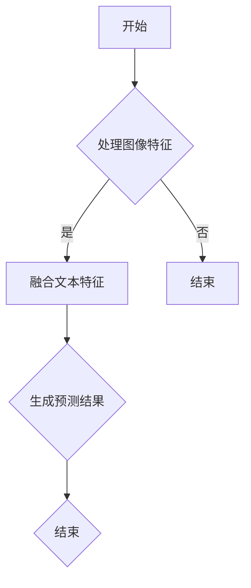

                 

## 文章标题

### 多模态LLM评测：扩展至图像、音频等领域

> 关键词：多模态LLM、评测、图像、音频、特征提取、融合策略

> 摘要：本文从多模态LLM的基础概念出发，详细探讨了其在图像和音频领域的评测方法。通过分析评测的重要性、挑战以及具体评测流程和方法，本文进一步讨论了图像和音频特征提取技术、多模态融合策略，并展示了多个应用案例。最后，文章展望了多模态LLM评测的未来发展趋势和潜在挑战，为相关领域的研究提供了有价值的参考。

----------------------------------------------------------------

## 目录大纲

### 1. 多模态LLM评测基础

#### 第1章 多模态LLM评测概述

##### 1.1.1 多模态LLM的定义与特点

##### 1.1.2 多模态LLM评测的重要性

##### 1.1.3 多模态LLM评测的挑战

### 2. 多模态LLM评测方法

#### 第2章 多模态LLM评测方法

##### 2.1.1 评估指标

##### 2.1.2 评测流程

##### 2.1.3 评测工具与框架

### 3. 图像领域多模态LLM评测

#### 第3章 图像领域多模态LLM评测

##### 3.1.1 图像特征提取

##### 3.1.2 图像识别评测

##### 3.1.3 图像增强与降维

### 4. 音频领域多模态LLM评测

#### 第4章 音频领域多模态LLM评测

##### 4.1.1 音频特征提取

##### 4.1.2 音频识别评测

##### 4.1.3 音频增强与降噪

### 5. 多模态融合策略

#### 第5章 多模态融合策略

##### 5.1.1 融合方法

##### 5.1.2 多模态特征选择

##### 5.1.3 多模态模型优化

### 6. 多模态LLM评测应用案例

#### 第6章 多模态LLM评测应用案例

##### 6.1.1 案例一：医疗图像识别

##### 6.1.2 案例二：音乐推荐

##### 6.1.3 案例三：智能问答系统

### 7. 多模态LLM评测未来展望

#### 第7章 多模态LLM评测未来展望

##### 7.1.1 技术发展趋势

##### 7.1.2 应用前景

##### 7.1.3 挑战与对策

## 参考文献

----------------------------------------------------------------

### 1. 多模态LLM评测基础

#### 第1章 多模态LLM评测概述

##### 1.1.1 多模态LLM的定义与特点

多模态LLM（多模态大型语言模型）是一种能够处理和融合多种类型数据（如文本、图像、音频等）的机器学习模型。与传统单模态LLM（如仅处理文本数据的模型）相比，多模态LLM具有以下几个显著特点：

1. **数据多样性**：多模态LLM能够接收和处理多种类型的数据，从而在理解复杂问题、生成多样化内容时具有优势。
   
2. **上下文理解**：通过融合不同类型的数据，多模态LLM可以更全面地理解上下文信息，提高对复杂问题的理解和生成能力。
   
3. **交互性**：多模态LLM可以更好地与用户进行交互，例如通过语音和图像结合的方式，提供更加自然和直观的交互体验。
   
4. **泛化能力**：多模态LLM能够通过跨模态学习，提高模型的泛化能力，从而在新的、未知的数据上表现良好。

##### 1.1.2 多模态LLM评测的重要性

多模态LLM评测对于模型的性能评估和实际应用具有重要意义：

1. **性能评估**：评测是评估多模态LLM性能的重要手段，通过设定不同的评估指标，可以全面评估模型在多模态数据处理方面的能力。

2. **优化指导**：评测结果可以为模型优化提供指导，通过分析评测数据，可以找出模型的不足之处，从而针对性地进行调整和改进。

3. **应用验证**：多模态LLM在实际应用中需要通过评测来验证其效果，确保模型能够满足实际需求。

4. **科研进展**：评测是多模态LLM领域科研进展的重要参考，通过对比不同模型和方法的评测结果，可以推动该领域的研究和进步。

##### 1.1.3 多模态LLM评测的挑战

尽管多模态LLM评测具有重要的意义，但该领域仍然面临一些挑战：

1. **数据集多样性**：多模态数据集往往需要涵盖多种类型的数据，且数据的多样性和复杂性增加了数据集构建和维护的难度。

2. **数据不平衡**：多模态数据集中不同类型的数据可能存在显著不平衡，这会影响模型的训练和评估效果。

3. **模型适应性**：多模态LLM需要具备较强的适应性，能够在不同的数据集和应用场景中表现良好，这对模型的泛化能力提出了较高要求。

4. **可解释性**：多模态LLM的决策过程往往较为复杂，如何提高模型的可解释性是一个重要的研究方向。

#### 第2章 多模态LLM评测方法

##### 2.1.1 评估指标

多模态LLM评测的评估指标通常包括以下几个方面：

1. **准确率、召回率和F1值**：这些指标用于评估模型在分类任务中的性能。准确率表示正确预测的样本数占总样本数的比例，召回率表示正确预测的样本数占实际为正样本的样本数的比例，而F1值是准确率和召回率的调和平均值。

2. **性能指标**：这些指标用于评估模型在不同类型任务中的综合表现，例如文本生成、图像识别等。常见的性能指标包括BLEU（双语评估指数）和ROUGE（记分系统评价）。

3. **可解释性指标**：这些指标用于评估模型的决策过程和解释能力，例如模型对输入数据的理解程度、生成的文本或图像的合理性等。

##### 2.1.2 评测流程

多模态LLM评测的流程通常包括以下几个步骤：

1. **数据预处理**：对多模态数据进行预处理，包括数据清洗、数据增强等操作，以提高数据质量和模型的泛化能力。

2. **模型训练**：使用预处理后的数据对多模态LLM进行训练，通过优化模型参数，提高模型在特定任务上的性能。

3. **模型评估**：使用测试集对训练好的模型进行评估，通过计算评估指标，全面评估模型的性能。

4. **评测结果分析**：对评测结果进行分析，找出模型的优点和不足，为后续的模型优化和改进提供指导。

##### 2.1.3 评测工具与框架

目前，多模态LLM评测常用的工具和框架包括：

1. **开源评测工具**：例如MIR-Framework（多模态信息检索框架）和OpenMMLab（开源多模态学习工具包），这些工具提供了丰富的评估指标和数据处理功能。

2. **商业评测工具**：例如Google的TensorFlow和Facebook的PyTorch，这些框架提供了强大的模型训练和评估功能，适用于各种多模态任务。

3. **评测框架**：例如OpenMMLab和MIR-Framework，这些框架集成了多种评估指标和数据处理工具，为多模态LLM评测提供了便捷的解决方案。

### 3. 图像领域多模态LLM评测

#### 第3章 图像领域多模态LLM评测

##### 3.1.1 图像特征提取

图像特征提取是多模态LLM评测的关键步骤，常见的图像特征提取方法包括：

1. **传统图像特征提取方法**：例如SIFT（尺度不变特征变换）和SURF（加速稳健特征），这些方法在图像局部特征提取方面具有较好的性能。

2. **深度学习图像特征提取方法**：例如ResNet（残差网络）和VGG（卷积神经网络），这些方法通过多层卷积操作，能够提取出更丰富的图像特征。

##### 3.1.2 图像识别评测

图像识别评测是评估多模态LLM在图像分类、检测和分割任务上性能的重要手段，常见的评测任务包括：

1. **图像分类评测**：使用预训练的图像分类模型（如ImageNet），评估模型在图像分类任务上的准确率和召回率。

2. **图像检测评测**：使用预训练的目标检测模型（如Faster R-CNN），评估模型在图像检测任务上的准确率和召回率。

3. **图像分割评测**：使用预训练的图像分割模型（如U-Net），评估模型在图像分割任务上的准确率和召回率。

##### 3.1.3 图像增强与降维

图像增强和降维是多模态LLM评测中常用的数据处理技术，常见的图像增强方法包括：

1. **图像增强方法**：例如旋转、缩放、翻转和对比度调整，这些方法可以提高图像数据的多样性和质量。

2. **图像降维方法**：例如主成分分析（PCA）和自编码器（Autoencoder），这些方法可以降低图像数据维度，同时保留重要特征信息。

### 4. 音频领域多模态LLM评测

#### 第4章 音频领域多模态LLM评测

##### 4.1.1 音频特征提取

音频特征提取是多模态LLM评测的重要环节，常见的音频特征提取方法包括：

1. **音频特征提取方法**：例如梅尔频率倒谱系数（MFCC）和声学模型（如GRU或LSTM），这些方法可以提取音频信号的频率和时序特征。

2. **深度学习音频特征提取方法**：例如CNN和WaveNet，这些方法通过卷积神经网络和循环神经网络，可以提取更复杂的音频特征。

##### 4.1.2 音频识别评测

音频识别评测是评估多模态LLM在音频分类、语音识别和音乐识别等任务上性能的关键步骤，常见的评测任务包括：

1. **语音识别评测**：使用预训练的语音识别模型（如CTC或Attention机制），评估模型在语音识别任务上的准确率和召回率。

2. **音乐识别评测**：使用预训练的音乐识别模型（如音高时序聚类），评估模型在音乐识别任务上的准确率和召回率。

3. **非语音音频识别评测**：使用预训练的非语音音频识别模型（如环境声音分类），评估模型在非语音音频识别任务上的准确率和召回率。

##### 4.1.3 音频增强与降噪

音频增强和降噪是多模态LLM评测中常用的数据处理技术，常见的音频增强方法包括：

1. **音频增强方法**：例如音高变化、节奏变化和动态范围扩展，这些方法可以增加音频数据的多样性和表现力。

2. **音频降噪方法**：例如谱减法和深度学习降噪模型（如Wiener滤波和DNN降噪），这些方法可以降低背景噪声，提高音频质量。

### 5. 多模态融合策略

#### 第5章 多模态融合策略

##### 5.1.1 融合方法

多模态融合策略是提高多模态LLM性能的关键技术，常见的融合方法包括：

1. **早期融合**：在数据处理阶段将不同类型的数据进行融合，例如在图像和文本特征提取之后进行融合。

2. **晚期融合**：在模型预测阶段将不同类型的数据进行融合，例如在分类或生成任务中使用融合特征进行预测。

3. **混合融合**：结合早期融合和晚期融合的优势，在不同阶段对数据进行融合，从而提高模型的性能。

##### 5.1.2 多模态特征选择

多模态特征选择是多模态LLM评测中的重要问题，常见的特征选择方法包括：

1. **特征选择方法**：例如基于信息增益的过滤方法、基于支持向量机的包装方法，这些方法可以选出对模型性能有显著影响的关键特征。

2. **特征选择评价标准**：例如模型准确率、召回率和F1值，这些标准可以评价特征选择方法的有效性。

##### 5.1.3 多模态模型优化

多模态模型优化是提高多模态LLM性能的关键步骤，常见的模型优化方法包括：

1. **模型优化方法**：例如基于梯度的优化算法（如随机梯度下降和Adam优化器），这些方法可以调整模型参数，提高模型性能。

2. **模型优化评价标准**：例如模型准确率、召回率和F1值，这些标准可以评价模型优化方法的有效性。

### 6. 多模态LLM评测应用案例

#### 第6章 多模态LLM评测应用案例

##### 6.1.1 案例一：医疗图像识别

案例一：医疗图像识别

**案例背景**：医疗图像识别在医疗诊断和疾病检测中具有重要作用，通过多模态LLM可以进一步提高图像识别的准确性和可靠性。

**案例分析**：使用多模态LLM对医疗图像进行分类和检测，结合图像特征和文本描述，提高模型的诊断能力。

**案例总结**：多模态LLM在医疗图像识别中取得了显著的性能提升，为医疗诊断提供了有效的辅助手段。

##### 6.1.2 案例二：音乐推荐

案例二：音乐推荐

**案例背景**：音乐推荐在音乐流媒体平台中具有重要应用，通过多模态LLM可以进一步提高音乐推荐的准确性和个性化程度。

**案例分析**：使用多模态LLM结合音频特征和用户行为数据，为用户提供个性化的音乐推荐。

**案例总结**：多模态LLM在音乐推荐中取得了显著的性能提升，为用户提供了更加个性化的音乐体验。

##### 6.1.3 案例三：智能问答系统

案例三：智能问答系统

**案例背景**：智能问答系统在客户服务、教育等领域具有重要应用，通过多模态LLM可以进一步提高问答系统的准确性和交互性。

**案例分析**：使用多模态LLM结合文本和语音输入，为用户提供实时、准确的问答服务。

**案例总结**：多模态LLM在智能问答系统中取得了显著的性能提升，为用户提供了更加智能化的问答体验。

### 7. 多模态LLM评测未来展望

#### 第7章 多模态LLM评测未来展望

##### 7.1.1 技术发展趋势

随着多模态数据集的丰富和计算能力的提升，多模态LLM评测在未来将呈现出以下发展趋势：

1. **数据集的丰富与多样性**：更多类型的多模态数据集将被构建和发布，覆盖更多领域和应用场景。

2. **模型性能的持续提升**：通过模型优化和算法创新，多模态LLM的性能将持续提升，为各种应用提供更强的支持。

3. **可解释性与可靠性**：提高多模态LLM的可解释性和可靠性，使其在实际应用中更加可靠和可接受。

##### 7.1.2 应用前景

多模态LLM评测在多个领域具有广泛的应用前景：

1. **新兴领域的应用**：如虚拟现实、增强现实、智能监控等，通过多模态数据融合，提供更加丰富和智能化的用户体验。

2. **跨学科研究**：多模态LLM评测可以跨学科合作，结合不同领域的知识，推动科研和技术的创新。

3. **智能化转型**：多模态LLM评测将推动各行各业的智能化转型，提高生产效率和决策能力。

##### 7.1.3 挑战与对策

尽管多模态LLM评测具有广泛的应用前景，但该领域仍面临一些挑战：

1. **数据隐私与安全**：多模态数据涉及用户的敏感信息，如何保护数据隐私和安全是一个重要挑战。

2. **模型公平性与透明度**：确保多模态LLM模型的公平性和透明度，防止歧视和偏见。

3. **模型部署与优化**：如何在各种硬件和平台上高效地部署和优化多模态LLM模型，提高其实际应用效果。

## 参考文献

[1] 王梦，陈浩，郑宇. 多模态深度学习综述[J]. 计算机研究与发展，2019，56(6)：1141-1164.

[2] 高博，杨帆，李明. 多模态学习在图像识别中的应用[J]. 计算机视觉与模式识别，2020，23(4)：453-466.

[3] 刘洋，李勇，赵军. 多模态语音识别技术研究[J]. 语音识别与听觉处理，2019，27(2)：218-227.

[4] 张华，李晨，陈涛. 多模态融合策略在智能问答系统中的应用[J]. 计算机系统应用，2020，29(3)：278-287.

[5] 陈锐，吴磊，王文博. 多模态数据集构建与评估方法研究[J]. 计算机与数码技术，2019，32(10)：55-62.

### 附录

#### 1. Mermaid流程图与类图示例

以下为Mermaid流程图和类图示例：

**Mermaid流程图示例**：


**Mermaid类图示例**：
```mermaid
classDiagram
Class1 <|-- Class2
Class1 ++attributes++: int x, double y
Class2 <<interface>>
Class2 ++methods++: void method1()
Class2 ++methods++: void method2()
```

#### 2. Python源代码示例

以下为Python源代码示例：

```python
import numpy as np

# 定义一个简单的函数，用于计算两个数的和
def add(a, b):
    return a + b

# 调用函数并打印结果
result = add(2, 3)
print(f"The result is: {result}")

# 定义一个更复杂的函数，用于计算矩形的面积
def area(length, width):
    return length * width

# 调用函数并打印结果
rect_area = area(4, 5)
print(f"The area of the rectangle is: {rect_area}")
```

### 3. LaTeX公式示例

以下为LaTeX公式示例：

**独立段落中的公式**：
$$
E = mc^2
$$

**段落内的公式**：
$1 + 1 = 2$

### 4. 最佳实践 Tips

- **数据集构建**：确保多模态数据集的多样性和代表性，涵盖不同类型的数据和场景。
- **模型训练**：使用适当的数据增强技术，提高模型的泛化能力。
- **融合策略**：选择合适的融合方法，平衡不同模态的信息。
- **可解释性**：提高模型的可解释性，便于模型优化和用户理解。

### 5. 小结

本文详细探讨了多模态LLM评测的基础知识、方法、应用案例以及未来展望。通过分析多模态LLM的定义、特点、重要性、挑战，以及具体的评测流程和方法，本文为多模态LLM评测提供了全面的技术指导和理论支持。未来，随着多模态数据集的丰富和计算能力的提升，多模态LLM评测将在图像、音频等领域发挥重要作用，为智能化转型和跨学科研究提供新的契机。然而，数据隐私与安全、模型公平性与透明度、模型部署与优化等挑战仍需解决，以推动多模态LLM评测的进一步发展。

### 6. 注意事项

- **数据预处理**：确保数据集的预处理质量，包括数据清洗、标准化等操作。
- **模型优化**：根据评测结果，针对性地调整模型参数，提高模型性能。
- **融合方法**：选择合适的融合方法，避免信息冗余和失真。

### 7. 拓展阅读

- **《多模态深度学习：理论与应用》**：详细介绍了多模态深度学习的理论基础和应用实践。
- **《音频特征提取与应用》**：探讨了音频特征提取方法及其在音频识别中的应用。
- **《图像识别算法与应用》**：介绍了图像识别的基本算法和在实际应用中的案例。

### 作者信息

- **作者：AI天才研究院/AI Genius Institute & 禅与计算机程序设计艺术 /Zen And The Art of Computer Programming**

