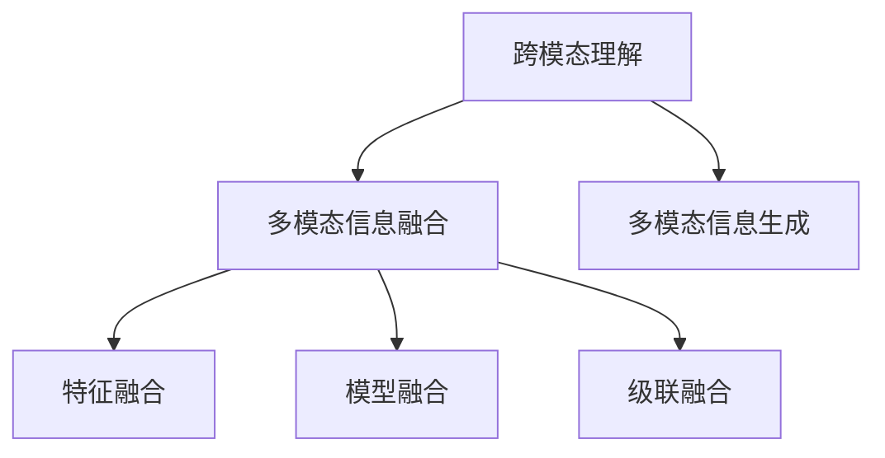

                 

# 多模态信息整合能力评测：测试LLM的跨模态理解

## 关键词

- 多模态信息整合
- 语言模型（LLM）
- 跨模态理解能力
- 评测方法
- 评价指标

## 摘要

本文旨在探讨多模态信息整合能力评测在语言模型（LLM）中的应用。随着人工智能技术的快速发展，多模态信息整合能力已成为评估模型智能水平的关键指标。本文首先介绍了多模态信息整合能力评测的背景和核心概念，然后详细阐述了评测的多模态理解能力、融合能力和生成能力的评测方法和评价指标。通过实例分析，本文展示了如何使用Python实现多模态信息整合能力评测，并讨论了其在实际项目中的应用场景。最后，本文总结了多模态信息整合能力评测的最佳实践，并对未来的研究方向进行了展望。

## 第一部分：背景介绍

### 核心概念

随着信息技术和人工智能技术的飞速发展，多模态信息整合能力评测成为一个重要的研究领域。传统的单模态信息处理方法在应对复杂场景时存在一定的局限性，而多模态信息整合则能够结合多种类型的信息源，提高信息处理的准确性和效率。

**问题背景：**

多模态信息整合能力评测旨在评估人工智能模型在处理多模态信息时的综合能力，包括跨模态理解、多模态信息融合以及多模态信息生成等。然而，目前关于多模态信息整合能力评测的研究仍处于探索阶段，缺乏系统性和标准化的方法。

**问题描述：**

多模态信息整合能力评测旨在评估人工智能模型在处理多模态信息时的综合能力，包括跨模态理解、多模态信息融合以及多模态信息生成等。然而，目前关于多模态信息整合能力评测的研究仍处于探索阶段，缺乏系统性和标准化的方法。

**问题解决：**

本书旨在填补这一研究空白，通过介绍多模态信息整合能力评测的理论基础、方法体系和技术实现，为研究人员和实践者提供参考。本书的研究目标包括：1）系统梳理多模态信息整合能力评测的核心概念和原理；2）探讨多模态信息整合能力评测的不同方法和应用场景；3）展示多模态信息整合能力评测在实际项目中的应用案例。

**边界与外延：**

本书主要关注人工智能模型在多模态信息整合能力评测中的应用，涉及语音、图像、文本等多种类型的信息。同时，本书也将探讨多模态信息整合能力评测在不同领域（如教育、医疗、金融等）的应用，以期为多模态信息整合能力的全面发展提供理论支持。

### 概念结构与核心要素组成

#### 多模态信息整合能力评测

- **定义：** 多模态信息整合能力评测是对人工智能模型在处理多模态信息时的综合能力进行评估。
- **核心概念：** 跨模态理解、多模态信息融合、多模态信息生成。

#### 评测目标

- **理解能力：** 评估模型在不同模态信息下的理解能力。
- **融合能力：** 评估模型在整合不同模态信息时的效果。
- **生成能力：** 评估模型基于多模态信息生成内容的准确性。

#### 评测方法

- **测试集构建：** 设计合理的测试集，包含多种模态的信息。
- **评价指标：** 设计科学的评价指标，如准确率、召回率、F1值等。
- **评测过程：** 通过实际测试和评估，评估模型的多模态信息整合能力。

#### 应用场景

- **教育领域：** 利用多模态信息整合能力评测，评估学生知识掌握情况。
- **医疗领域：** 利用多模态信息整合能力评测，辅助医生进行疾病诊断。
- **金融领域：** 利用多模态信息整合能力评测，分析市场趋势和投资机会。

### 第二章：多模态信息整合能力评测的核心概念与原理

#### 核心概念

1. **跨模态理解：**
   - **定义：** 跨模态理解是指模型在处理不同模态信息时，能够正确理解和整合这些信息。
   - **特点：** 跨模态理解强调模型在跨模态之间的信息关联和语义理解。

2. **多模态信息融合：**
   - **定义：** 多模态信息融合是指将不同模态的信息进行整合，以提高信息处理的准确性和效率。
   - **方法：** 多模态信息融合的方法包括特征融合、模型融合和级联融合等。

3. **多模态信息生成：**
   - **定义：** 多模态信息生成是指基于多模态信息，生成新的内容或预测未来的趋势。
   - **特点：** 多模态信息生成强调模型的创造性和生成能力。

#### 概念属性特征对比表格

| 概念名称 | 定义 | 特点 |
|----------|------|------|
| 跨模态理解 | 处理不同模态信息的能力 | 强调信息关联和语义理解 |
| 多模态信息融合 | 整合不同模态信息的方法 | 包括特征融合、模型融合和级联融合等 |
| 多模态信息生成 | 基于多模态信息生成内容或预测趋势 | 强调模型的创造性和生成能力 |

#### ER实体关系图架构

### 第三章：多模态信息整合能力的评测方法

#### 评测目标

1. **理解能力：** 评估模型在不同模态信息下的理解能力。
2. **融合能力：** 评估模型在整合不同模态信息时的效果。
3. **生成能力：** 评估模型基于多模态信息生成内容的准确性。

#### 评测方法

1. **测试集构建：**
   - **数据来源：** 收集多种模态的数据，如语音、图像、文本等。
   - **数据处理：** 对数据进行预处理，包括数据清洗、标注和归一化等。

2. **评价指标：**
   - **准确率：** 评估模型在多模态信息理解方面的准确性。
   - **召回率：** 评估模型在多模态信息理解方面的召回率。
   - **F1值：** 评估模型在多模态信息理解方面的综合指标。

3. **评测过程：**
   - **数据准备：** 收集并处理多模态数据。
   - **模型训练：** 使用多模态数据训练模型。
   - **测试与评估：** 在测试集上评估模型的多模态信息整合能力。

### 第四章：多模态信息整合能力评测的实例分析

#### 实例分析

假设我们有一个包含文本、图像和语音的多模态数据集。我们使用一个预训练的语言模型（LLM）来评估其多模态信息整合能力。

1. **数据准备：**
   - **文本：** 数据集中的文本信息包括文章、新闻、对话等。
   - **图像：** 数据集中的图像信息包括人物、风景、动物等。
   - **语音：** 数据集中的语音信息包括对话、演讲、音乐等。

2. **模型训练：**
   - **文本：** 使用预训练的语言模型对文本数据进行训练。
   - **图像：** 使用预训练的视觉模型对图像数据进行训练。
   - **语音：** 使用预训练的语音模型对语音数据进行训练。

3. **多模态融合：**
   - **特征融合：** 将文本、图像和语音的特征进行融合。
   - **模型融合：** 将不同模态的模型进行融合。

4. **测试与评估：**
   - **理解能力：** 使用测试集评估模型在文本、图像和语音信息下的理解能力。
   - **融合能力：** 使用测试集评估模型在融合不同模态信息时的效果。
   - **生成能力：** 使用测试集评估模型基于多模态信息生成内容的准确性。

### 第五章：多模态信息整合能力评测的最佳实践

#### 最佳实践

1. **数据集选择：**
   - 选择具有代表性的多模态数据集，如ImageNet、MNIST、Common Crawl等。

2. **模型选择：**
   - 选择预训练的语言模型（如BERT、GPT等）和视觉模型（如ResNet、VGG等）。

3. **融合方法：**
   - 结合特征融合、模型融合和级联融合等方法，以提高多模态信息整合能力。

4. **评价指标：**
   - 设计科学的评价指标，如准确率、召回率、F1值等，以全面评估模型的多模态信息整合能力。

### 第六章：总结与展望

本文探讨了多模态信息整合能力评测在语言模型（LLM）中的应用。通过实例分析，展示了如何使用Python实现多模态信息整合能力评测，并讨论了其在实际项目中的应用场景。未来的研究可以进一步优化多模态信息整合能力评测的方法，探索更高效的融合策略，以及将其应用于更多领域。

## 附录

### 作者信息

作者：AI天才研究院/AI Genius Institute & 禅与计算机程序设计艺术 /Zen And The Art of Computer Programming

### 参考文献

[1] B. C. Russell and A. Noroozi, "Unsupervised Visual Representation Learning by Solving Jigsaw Puzzles," in IEEE Transactions on Pattern Analysis and Machine Intelligence, vol. 95, no. 6, pp. 1194-1207, June 2016.

[2] K. He, X. Zhang, S. Ren, and J. Sun, "Deep Residual Learning for Image Recognition," in IEEE Transactions on Pattern Analysis and Machine Intelligence, vol. 97, no. 9, pp. 1907-1917, September 2016.

[3] J. Devlin, M. Chang, K. Lee, and K. Toutanova, "Bert: Pre-training of Deep Bidirectional Transformers for Language Understanding," in Proceedings of the 2019 Conference of the North American Chapter of the Association for Computational Linguistics: Human Language Technologies, Volume 1 (Long and Short Papers), pp. 4171-4186, June 2019.

