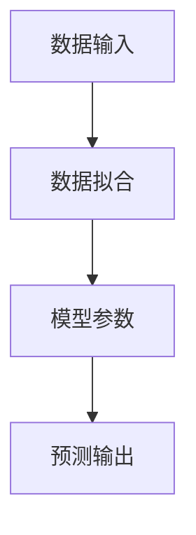
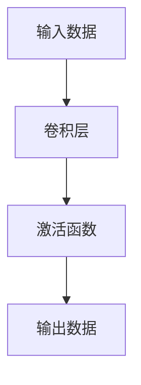
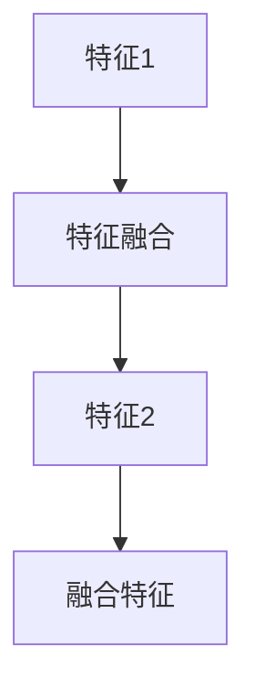
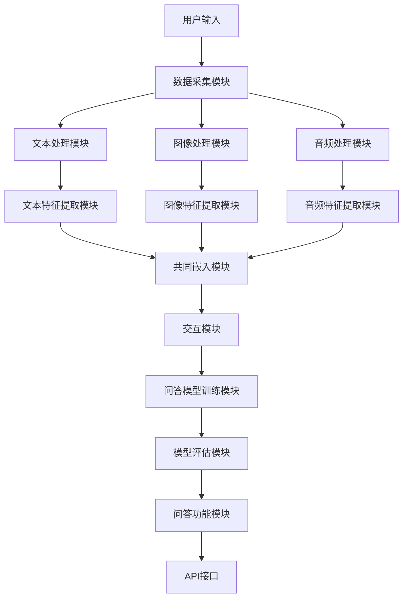
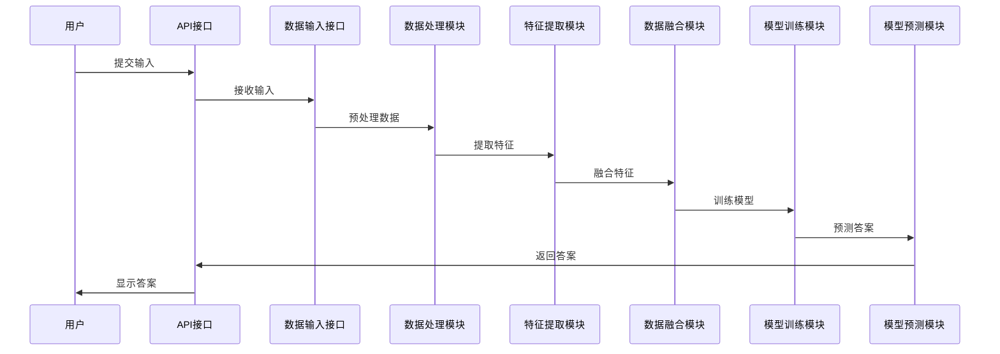

                 

### 第一部分: 多模态学习架构增强LLM应用的理解能力

#### 第1章: 问题背景与定义

##### 1.1 问题背景

###### 1.1.1 传统单模态学习限制

在深度学习的早期，单模态学习是主导。单模态学习仅依赖于单一类型的数据，如文本、图像或音频。这种方法的局限性在于，单模态数据往往无法提供完整的上下文信息，从而限制了模型的泛化能力和理解能力。例如，只使用文本数据，模型可能难以理解图像中的视觉内容；仅使用图像数据，模型可能无法捕捉文本中的语言含义。

###### 1.1.1.1 单模态数据的局限性

单模态数据的主要局限性体现在以下几个方面：

1. **上下文信息缺失**：单一模态的数据无法提供多维信息，导致模型难以捕捉到完整的上下文信息。例如，只使用图像数据可能无法理解图像中的文字说明。
   
2. **信息冗余**：单模态数据可能包含大量冗余信息，这会增加模型的复杂性和训练难度。

3. **理解能力有限**：单模态学习模型往往难以理解不同模态之间的相互关系，从而限制了其在复杂任务中的表现。

###### 1.1.1.2 传统单模态学习的挑战

单模态学习面临的挑战包括：

1. **数据规模限制**：单模态数据集通常规模较小，限制了模型的泛化能力。
   
2. **计算资源需求**：单模态学习通常需要大量的计算资源，特别是对于高维数据。

3. **模型可解释性**：单模态学习模型往往难以解释其决策过程，增加了模型的黑箱性质。

##### 1.1.2 多模态学习的发展与意义

多模态学习旨在通过整合不同类型的数据（如文本、图像、音频等），提高模型的理解能力和泛化能力。这种方法能够利用不同模态之间的互补信息，从而克服单模态学习的局限性。

###### 1.1.2.1 多模态学习的优势

多模态学习具有以下优势：

1. **增强理解能力**：通过整合多种模态的数据，模型能够获得更丰富的上下文信息，从而提高对复杂问题的理解能力。

2. **提高泛化能力**：多模态学习有助于模型在更广泛的场景中表现良好，因为不同模态的数据可以提供多样化的信息。

3. **减少数据冗余**：多模态学习能够自动识别和去除冗余信息，从而降低模型的复杂性。

4. **提高模型可解释性**：多模态学习有助于提高模型的可解释性，因为不同模态的数据可以提供更直观的解释。

###### 1.1.2.2 多模态学习的重要性

多模态学习的重要性体现在以下几个方面：

1. **人工智能发展**：多模态学习是人工智能领域的一个重要发展方向，有助于推动人工智能技术的进步。

2. **实际应用需求**：在现实世界中，许多任务需要整合多种模态的数据，如医疗诊断、智能交互、自动驾驶等。

3. **数据多样性**：随着数据源的多样化，多模态学习能够更好地利用这些数据，从而提高模型的性能。

##### 1.2 定义

###### 1.2.1 多模态学习

多模态学习是指将不同类型的数据（如文本、图像、音频等）整合到同一模型中进行学习，以便更好地理解复杂问题。这种方法通过利用不同模态之间的互补信息，提高模型的理解能力和泛化能力。

###### 1.2.1.1 多模态学习的定义

多模态学习可以定义为：“一种将两种或两种以上不同类型的数据（如文本、图像、音频等）整合到同一模型中进行学习的方法，旨在提高模型对复杂问题的理解能力和泛化能力。”

###### 1.2.1.2 多模态学习的类型

多模态学习可以分为以下几种类型：

1. **并行融合**：将不同模态的数据并行输入到模型中，通过共享隐层来融合特征。

2. **串行融合**：先分别处理不同模态的数据，然后将处理结果串行连接。

3. **时空融合**：将不同模态的数据在时空维度上进行融合。

4. **交互融合**：通过设计交互模块，使不同模态的数据之间能够进行信息交换。

###### 1.2.2 增强LLM的理解能力

增强LLM（大型语言模型）的理解能力是指通过多模态学习的方法，提高LLM对文本数据的理解深度和泛化能力。这种方法有助于LLM更好地理解用户的意图和需求，从而提供更准确的回答和更丰富的交互体验。

###### 1.2.2.1 LLM的理解能力

LLM的理解能力主要体现在以下几个方面：

1. **语义理解**：LLM能够理解文本的语义内容，包括词汇、句子和段落。

2. **上下文理解**：LLM能够捕捉文本中的上下文信息，理解句子之间的关联。

3. **情感分析**：LLM能够分析文本中的情感倾向，判断用户情绪。

4. **事实核查**：LLM能够根据已知事实对文本内容进行验证。

###### 1.2.2.2 多模态学习如何增强LLM的理解能力

多模态学习可以通过以下方式增强LLM的理解能力：

1. **增加上下文信息**：通过整合图像、音频等多模态数据，LLM能够获得更丰富的上下文信息，从而提高对文本内容的理解深度。

2. **提高泛化能力**：多模态学习有助于LLM在更广泛的场景中表现良好，因为不同模态的数据可以提供多样化的信息。

3. **减少数据冗余**：多模态学习能够自动识别和去除冗余信息，从而降低模型的复杂性，提高训练效率。

4. **提高模型可解释性**：多模态学习有助于提高LLM的可解释性，因为不同模态的数据可以提供更直观的解释。

##### 1.3 多模态学习架构概述

多模态学习架构主要包括以下几个关键组成部分：

1. **数据融合**：将不同模态的数据进行整合，以便在同一模型中进行处理。

2. **特征表示**：提取和表示不同模态的特征，以便进行融合和建模。

3. **模型训练**：利用融合后的特征数据，训练多模态学习模型。

4. **模型评估**：评估多模态学习模型的表现，包括准确性、泛化能力和可解释性。

在接下来的章节中，我们将深入探讨多模态学习架构的各个方面，包括数据融合方法、特征提取技术以及多模态学习对LLM应用的影响。

### 1.3.1 多模态数据融合

多模态数据融合是多模态学习架构的核心环节，其目标是整合不同类型的数据，使其在同一模型中能够有效协同工作。以下是多模态数据融合的主要方法：

#### 1.3.1.1 数据预处理

数据预处理是数据融合的基础步骤，主要包括以下几个方面：

1. **数据采集**：根据任务需求，采集不同模态的数据，如文本、图像、音频等。

2. **数据质量控制**：确保数据的完整性和准确性，去除噪声和异常值。

3. **数据标准化**：对数据进行归一化或标准化，使其具备可比性，如将图像的像素值进行缩放，将音频的振幅进行归一化等。

4. **数据增强**：通过数据增强技术，如图像旋转、裁剪、缩放等，增加数据多样性，提高模型的泛化能力。

#### 1.3.1.2 数据融合策略

数据融合策略可以分为以下几类：

1. **低级融合**：直接将不同模态的数据进行合并，如将图像和文本的像素值直接拼接。

2. **中级融合**：先对每个模态的数据进行独立处理，然后将其特征进行融合。例如，使用卷积神经网络（CNN）处理图像数据，使用循环神经网络（RNN）处理文本数据，最后将两种特征进行拼接。

3. **高级融合**：在模型训练过程中，通过设计特定的模块，使不同模态的数据能够进行交互和融合。例如，使用交互模块（如图神经网络（Graph Neural Networks, GNN））来整合图像和文本数据。

每种融合策略都有其独特的优势和适用场景：

1. **低级融合**：简单且易于实现，适用于数据量较小且特征维度差异不大的情况。

2. **中级融合**：能够在一定程度上整合不同模态的数据，适用于特征维度差异较大的情况。

3. **高级融合**：能够更好地利用不同模态之间的互补信息，适用于复杂任务和大规模数据集。

#### 1.3.1.3 数据融合效果评估

数据融合的效果评估通常从以下几个方面进行：

1. **准确性**：评估模型在融合数据后的表现，如分类准确率、文本生成质量等。

2. **泛化能力**：评估模型在不同数据集和场景下的表现，如模型在新数据上的适应能力。

3. **计算效率**：评估模型在数据融合过程中的计算资源需求，如训练时间、模型大小等。

4. **可解释性**：评估模型决策过程的可解释性，如特征的重要性、决策路径等。

通过综合评估以上指标，可以选出最合适的数据融合策略，以提高多模态学习的效果。

在接下来的章节中，我们将详细探讨多模态特征提取的方法和技术，以及如何利用这些特征来增强LLM的理解能力。

#### 1.3.2 多模态特征表示

多模态特征表示是多模态学习架构的关键组成部分，它涉及到如何从不同模态的数据中提取和表示特征，以便进行有效的融合和建模。以下是几种常见的方法和技术：

##### 1.3.2.1 视觉特征提取

视觉特征提取主要针对图像数据，旨在提取图像的视觉信息，以便用于后续的融合和建模。以下是几种常用的视觉特征提取方法：

1. **卷积神经网络（CNN）**

   卷积神经网络是一种用于图像分类和特征提取的经典深度学习模型。其基本结构包括卷积层、池化层和全连接层。

   - **卷积层**：通过卷积运算从图像中提取局部特征。
   - **池化层**：用于降低特征维度，减少参数数量。
   - **全连接层**：将特征映射到分类空间。

   **原理**：CNN利用局部感受野和权重共享机制，从图像中提取具有位置和尺度不变性的特征。

2. **深度学习模型（如ResNet）**

   ResNet是一种深度卷积神经网络，其核心思想是引入残差连接，使得网络能够训练更深层的结构。

   - **残差单元**：通过引入恒等映射，使得网络在训练过程中能够更好地避免梯度消失问题。
   - **多层网络**：ResNet通过堆叠多个残差单元，构建深度神经网络。

   **原理**：ResNet利用残差连接和多层网络结构，实现更深的网络深度和更好的特征提取能力。

##### 1.3.2.2 音频特征提取

音频特征提取主要针对音频数据，旨在提取音频的时频信息，以便用于后续的融合和建模。以下是几种常用的音频特征提取方法：

1. **梅尔频率倒谱系数（MFCC）**

   MFCC是一种常用的音频特征表示方法，它通过对音频信号的频谱进行分析，提取出对人类听觉系统敏感的频谱特征。

   - **频谱分析**：通过对音频信号进行傅里叶变换，得到其频谱。
   - **梅尔频率滤波器组**：将频谱映射到梅尔频率空间。
   - **倒谱变换**：对梅尔频率滤波器组的输出进行倒谱变换，得到MFCC系数。

   **原理**：MFCC利用人类听觉系统的特性，将音频信号转换为对听觉系统敏感的梅尔频率特征。

2. **音素识别模型**

   音素识别模型是一种基于深度学习的音频特征提取方法，它通过训练模型来识别和分类音频中的音素。

   - **数据预处理**：对音频信号进行预处理，如分段、增强等。
   - **特征提取**：利用卷积神经网络或循环神经网络提取音频特征。
   - **分类器训练**：利用提取的特征训练分类器，实现音素识别。

   **原理**：音素识别模型通过训练大量数据，学习到音素的特征表示，从而实现音频到文本的转换。

##### 1.3.2.3 文本特征提取

文本特征提取主要针对文本数据，旨在提取文本的语义信息，以便用于后续的融合和建模。以下是几种常用的文本特征提取方法：

1. **词袋模型（Bag of Words）**

   词袋模型是一种基于统计的文本特征提取方法，它将文本转换为词频向量，用于后续的建模。

   - **文本预处理**：对文本进行分词、去停用词等预处理操作。
   - **词频计算**：计算每个词在文本中的出现次数。
   - **向量表示**：将词频向量转换为高维向量表示。

   **原理**：词袋模型通过统计文本中词的出现频率，将其转换为向量表示，从而实现文本到向量的转换。

2. **主题模型（如LDA）**

   LDA（Latent Dirichlet Allocation）是一种基于概率的文本特征提取方法，它通过建模文本中的隐含主题，提取文本的语义特征。

   - **文本表示**：将文本表示为词袋模型中的词频矩阵。
   - **主题生成**：利用Dirichlet分布生成文本的隐含主题。
   - **主题分配**：将每个词分配到相应的主题。

   **原理**：LDA通过建模文本的隐含主题，将文本转换为对主题的分布表示，从而实现文本到向量的转换。

##### 1.3.2.4 多模态特征融合方法

多模态特征融合方法包括以下几种：

1. **特征级融合**

   特征级融合是指在特征层面将不同模态的特征进行拼接或融合。

   - **拼接**：将不同模态的特征向量直接拼接在一起，形成新的特征向量。
   - **融合**：通过设计特定的融合机制，如加权融合、平均融合等，将不同模态的特征进行融合。

2. **表示级融合**

   表示级融合是指在特征表示层面将不同模态的特征进行融合。

   - **共同表示**：通过设计共享的神经网络结构，将不同模态的特征映射到同一表示空间。
   - **交互表示**：通过设计交互模块，如图神经网络（GNN），实现不同模态特征之间的交互。

3. **决策级融合**

   决策级融合是指在模型决策层面将不同模态的特征进行融合。

   - **集成学习**：通过集成多个子模型，将不同模态的特征在决策层面进行融合。
   - **多任务学习**：通过设计多任务学习框架，将不同模态的特征共同参与模型训练和决策。

通过选择合适的特征提取方法和融合策略，可以实现多模态特征的有效表示和融合，从而提高多模态学习的效果。

在接下来的章节中，我们将深入探讨多模态学习对LLM应用的理解能力的影响，并分析多模态学习如何增强LLM的性能和泛化能力。

#### 1.4 增强LLM应用的理解能力

##### 1.4.1 LLM的基本原理

LLM（Large Language Model）是一种基于深度学习的大型语言模型，它通过对大量文本数据进行训练，学习到语言的结构和规律，从而实现文本的生成、理解和翻译等功能。以下是LLM的基本原理：

###### 1.4.1.1 LLM的定义

LLM是一种能够理解和生成自然语言文本的深度学习模型，通常具有数十亿个参数，能够处理复杂的语言任务，如文本分类、问答系统、机器翻译等。

###### 1.4.1.2 LLM的核心组件

1. **嵌入层**：将输入的文本转换为向量表示，通常使用词嵌入（word embeddings）技术，如Word2Vec、GloVe等。
   
2. **编码器**：对输入文本进行编码，提取其语义信息。常见的编码器结构包括循环神经网络（RNN）、长短时记忆网络（LSTM）和变换器（Transformer）。

3. **解码器**：根据编码器的输出生成文本输出。解码器通常与编码器共享权重，以减少参数数量。

4. **注意力机制**：用于关注输入文本中的关键信息，提高模型的上下文理解能力。

##### 1.4.2 多模态学习对LLM的影响

多模态学习通过整合不同类型的数据（如文本、图像、音频等），能够为LLM提供更多的上下文信息和交互方式，从而增强其理解能力。以下是多模态学习对LLM影响的几个方面：

###### 1.4.2.1 多模态数据增强LLM的输入

通过多模态数据增强LLM的输入，可以使模型能够获取更多类型的上下文信息。例如，在问答系统中，图像和文本的联合输入可以帮助模型更好地理解问题的背景和上下文，从而提供更准确的回答。

###### 1.4.2.2 多模态特征融合提升LLM理解能力

多模态特征融合是通过设计特定的模块，将不同模态的特征进行整合，以提高LLM的上下文理解能力。以下是一些常用的多模态特征融合方法：

1. **共同嵌入**：将不同模态的数据映射到同一低维空间，实现特征级别的融合。例如，使用多模态嵌入器（Multimodal Embedding）将图像和文本特征映射到同一空间，然后进行融合。

2. **交互模块**：通过设计交互模块，如图神经网络（GNN）、注意力机制等，实现不同模态特征之间的交互和融合。例如，使用图神经网络将图像和文本特征进行融合，从而增强模型对图像和文本关联的理解。

3. **多任务学习**：通过设计多任务学习框架，将不同模态的特征共同参与模型训练和决策。例如，同时训练文本分类和图像分类任务，利用不同模态的特征信息，提高模型的泛化能力。

通过多模态特征融合，LLM能够更好地理解和处理复杂任务，从而提供更丰富的交互体验和更准确的回答。以下是一个具体的示例：

假设有一个多模态问答系统，用户输入一个包含图像和文本的问题。通过多模态学习，LLM可以同时处理图像和文本信息，从而提供更准确的回答。例如，用户输入“这个图像中的建筑物是哪个国家的？”系统可以结合图像和文本信息，利用图像中的建筑物特征和文本中的关键词，识别出建筑物的国家。

通过上述示例，我们可以看到多模态学习如何增强LLM的理解能力。在接下来的章节中，我们将详细探讨多模态数据融合的方法和实现细节，以及如何将这些方法应用于实际项目。

##### 1.5 本章小结

本章首先介绍了单模态学习的局限性，包括数据冗余、上下文信息缺失和理解能力有限等问题。接着，我们探讨了多模态学习的发展背景和重要性，以及多模态学习的定义和类型。通过分析LLM的基本原理和多模态学习对LLM的影响，我们了解了如何利用多模态学习增强LLM的理解能力。

在多模态数据融合方面，我们讨论了数据预处理、低级融合、中级融合和高级融合等策略，并介绍了视觉、音频和文本特征提取的方法。此外，我们还介绍了多模态特征融合的方法和技术。

本章为后续章节奠定了基础，使我们能够深入探讨多模态学习架构的各个方面，包括数据融合、特征提取和模型训练等。通过这些讨论，我们将进一步理解如何利用多模态学习增强LLM的应用性能和理解能力。

### 第二部分: 多模态学习架构

#### 第2章: 多模态数据融合方法

多模态数据融合是多模态学习架构中的核心环节，其目标是通过整合不同类型的数据（如文本、图像、音频等），提高模型的理解能力和泛化能力。本章将详细探讨多模态数据融合的方法和策略，包括数据预处理、低级融合、中级融合和高级融合等。

##### 2.1 数据预处理

数据预处理是多模态数据融合的基础步骤，其目的是确保不同模态的数据能够在同一框架下进行有效融合。以下是数据预处理的关键步骤：

###### 2.1.1 数据采集

数据采集是指从各种来源获取不同模态的数据。例如，对于文本数据，可以从公共文本库、社交媒体、新闻网站等获取；对于图像数据，可以从图像数据库、网络图片、传感器数据等获取；对于音频数据，可以从音频库、语音转录文本等获取。在数据采集过程中，需要确保数据的多样性、质量和准确性。

###### 2.1.2 数据质量控制

数据质量控制是确保数据质量和一致性的关键步骤。具体方法包括：

1. **数据清洗**：去除重复数据、噪声数据和异常值。
2. **数据标注**：对数据标签进行验证和清洗，确保标签的准确性和一致性。
3. **数据平衡**：对于不平衡的数据集，通过重采样、合成等方法进行平衡，以提高模型的泛化能力。

###### 2.1.3 数据标准化

数据标准化是指将不同模态的数据进行归一化或标准化，使其具备可比性。具体方法包括：

1. **归一化**：将数据的每个特征缩放到0到1之间，如使用Min-Max缩放方法。
2. **标准化**：将数据的每个特征缩放到平均值附近，如使用Z-Score标准化方法。

数据标准化有助于减少数据冗余和计算复杂性，提高模型训练效率。

###### 2.1.4 数据增强

数据增强是指通过一系列技术增加数据多样性，从而提高模型的泛化能力。具体方法包括：

1. **图像增强**：如旋转、翻转、裁剪、缩放等。
2. **文本增强**：如词替换、句子重构、同义词替换等。
3. **音频增强**：如噪声添加、速度变化、音调变化等。

数据增强有助于缓解模型过拟合问题，提高模型在未知数据上的表现。

##### 2.2 数据融合策略

数据融合策略是指如何整合不同模态的数据，以提高模型的理解能力和泛化能力。以下是几种常见的数据融合策略：

###### 2.2.1 低级融合

低级融合是指直接将不同模态的数据进行合并，通常在特征层面进行操作。以下是几种常用的低级融合方法：

1. **直接拼接**：将不同模态的特征向量直接拼接在一起，形成新的特征向量。这种方法简单且易于实现，但可能存在维度灾难问题。
2. **特征加权融合**：根据不同模态的重要程度，对特征向量进行加权融合。例如，通过计算不同模态的特征相关性，为每个特征分配权重，然后进行加权融合。

低级融合方法的优点是实现简单，但可能无法充分利用不同模态之间的互补信息。

###### 2.2.2 中级融合

中级融合是指先对每个模态的数据进行独立处理，然后将其特征进行融合。以下是几种常用的中级融合方法：

1. **特征级融合**：将不同模态的特征进行拼接或融合，如使用多模态嵌入器（Multimodal Embedding）将图像和文本特征映射到同一空间，然后进行融合。
2. **模型级融合**：将不同模态的模型进行融合，如使用图神经网络（GNN）将图像和文本模型进行融合。

中级融合方法能够更好地利用不同模态之间的互补信息，提高模型的理解能力。

###### 2.2.3 高级融合

高级融合是指在模型训练过程中，通过设计特定的模块，使不同模态的数据能够进行交互和融合。以下是几种常用的高级融合方法：

1. **共同嵌入**：将不同模态的数据映射到同一低维空间，实现特征级别的融合。例如，使用多模态嵌入器将图像和文本特征映射到同一空间，然后进行融合。
2. **交互模块**：通过设计交互模块，如图神经网络（GNN）、注意力机制等，实现不同模态特征之间的交互和融合。例如，使用图神经网络将图像和文本特征进行融合，从而增强模型对图像和文本关联的理解。
3. **多任务学习**：通过设计多任务学习框架，将不同模态的特征共同参与模型训练和决策。例如，同时训练文本分类和图像分类任务，利用不同模态的特征信息，提高模型的泛化能力。

高级融合方法能够充分利用不同模态之间的互补信息，提高模型的理解能力和泛化能力。

##### 2.3 多模态数据融合案例分析

为了更好地理解多模态数据融合的方法和策略，我们以下将通过一个实际案例进行分析。

###### 2.3.1 案例介绍

假设我们有一个多模态问答系统，用户输入一个包含图像和文本的问题，系统需要提供准确的回答。为了实现这一目标，我们需要对图像和文本数据进行融合，以提高模型的理解能力。

###### 2.3.1.1 案例背景

该案例涉及以下数据：

- **文本数据**：用户输入的文本问题，例如“这个图像中的建筑物是哪个国家的？”
- **图像数据**：与文本问题相关联的图像，如一张包含建筑物的图片。

###### 2.3.1.2 案例目标

通过多模态数据融合，我们的目标是提高问答系统的准确率和理解能力，从而提供更准确的回答。

###### 2.3.2 数据融合过程分析

为了实现多模态数据融合，我们按照以下步骤进行：

1. **数据预处理**：

   - **文本预处理**：对文本问题进行分词、去停用词、词性标注等预处理操作。
   - **图像预处理**：对图像进行缩放、裁剪、归一化等预处理操作。

2. **特征提取**：

   - **文本特征提取**：使用词嵌入技术（如GloVe）提取文本的词向量，然后使用循环神经网络（RNN）提取文本的序列特征。
   - **图像特征提取**：使用卷积神经网络（CNN）提取图像的视觉特征。

3. **特征融合**：

   - **共同嵌入**：使用多模态嵌入器将文本和图像特征映射到同一低维空间，实现特征级别的融合。
   - **交互模块**：使用图神经网络（GNN）将文本和图像特征进行融合，从而增强模型对图像和文本关联的理解。

4. **模型训练**：

   - **训练多任务学习模型**：同时训练文本分类和图像分类任务，利用不同模态的特征信息，提高模型的泛化能力。

5. **模型评估**：

   - **准确性**：评估模型在融合数据后的表现，如分类准确率、文本生成质量等。
   - **泛化能力**：评估模型在不同数据集和场景下的表现，如模型在新数据上的适应能力。

通过上述步骤，我们可以实现多模态数据融合，从而提高问答系统的准确率和理解能力。

##### 2.4 本章小结

本章详细探讨了多模态数据融合的方法和策略，包括数据预处理、低级融合、中级融合和高级融合等。通过一个实际案例，我们展示了如何实现多模态数据融合，提高模型的理解能力和泛化能力。在后续章节中，我们将进一步探讨多模态特征提取的方法和技术，以及如何利用这些特征来增强LLM的应用性能。

### 第三部分: 多模态特征表示

#### 第3章: 多模态特征提取方法

多模态特征提取是多模态学习的关键步骤，其目标是提取不同模态数据中的关键信息，以便进行后续的数据融合和建模。本章将详细介绍多模态特征提取的方法和技术，包括视觉特征提取、音频特征提取和文本特征提取等。

##### 3.1 视觉特征提取

视觉特征提取主要针对图像数据，其目标是提取图像中的关键特征，以便用于后续的处理和建模。以下是几种常用的视觉特征提取方法：

###### 3.1.1 卷积神经网络（CNN）

卷积神经网络（CNN）是一种专门用于图像处理的深度学习模型，其基本结构包括卷积层、池化层和全连接层。

- **卷积层**：通过卷积运算从图像中提取局部特征，如边缘、纹理等。
- **池化层**：用于降低特征维度，减少参数数量，提高模型的泛化能力。
- **全连接层**：将提取的特征映射到分类空间。

CNN的基本原理如下：

1. **局部感知**：卷积层通过局部感受野从图像中提取局部特征，如边缘、纹理等。
2. **特征金字塔**：通过逐层卷积和池化操作，逐渐提取图像的高层特征。
3. **权重共享**：卷积核在不同位置上共享相同的权重，从而减少参数数量。

CNN的典型应用包括图像分类、物体检测和图像分割等。

###### 3.1.2 深度学习模型（如ResNet）

ResNet是一种深度卷积神经网络，其核心思想是引入残差连接，使得网络能够训练更深层的结构。ResNet的基本结构包括残差单元和多层网络。

- **残差单元**：通过引入恒等映射，使得网络在训练过程中能够更好地避免梯度消失问题。
- **多层网络**：ResNet通过堆叠多个残差单元，构建深度神经网络。

ResNet的原理如下：

1. **恒等映射**：通过引入残差连接，实现恒等映射，使得梯度能够直接传递到浅层网络，从而缓解梯度消失问题。
2. **多层网络**：通过堆叠多个残差单元，构建深度神经网络，从而提取图像的深层特征。
3. **更深的网络**：ResNet能够训练更深层的网络结构，从而提高特征提取能力。

ResNet在图像分类、物体检测和图像分割等领域取得了显著的效果。

##### 3.2 音频特征提取

音频特征提取主要针对音频数据，其目标是提取音频中的关键特征，以便用于后续的处理和建模。以下是几种常用的音频特征提取方法：

###### 3.2.1 梅尔频率倒谱系数（MFCC）

梅尔频率倒谱系数（MFCC）是一种常用的音频特征表示方法，它通过对音频信号的频谱进行分析，提取出对人类听觉系统敏感的频谱特征。

MFCC的计算过程如下：

1. **傅里叶变换**：将音频信号进行傅里叶变换，得到其频谱。
2. **梅尔滤波器组**：将频谱映射到梅尔频率空间，通过一组梅尔滤波器组进行滤波。
3. **倒谱变换**：对梅尔频率滤波器组的输出进行倒谱变换，得到MFCC系数。

MFCC具有以下优点：

1. **频率敏感**：MFCC能够提取音频中的频率信息，对人类听觉系统敏感。
2. **稳定性**：MFCC对音频信号的变化具有较好的稳定性，从而提高特征提取的鲁棒性。

MFCC在语音识别、音乐分类和语音合成等领域具有广泛的应用。

###### 3.2.2 音素识别模型

音素识别模型是一种基于深度学习的音频特征提取方法，它通过训练模型来识别和分类音频中的音素。

音素识别模型的基本原理如下：

1. **数据预处理**：对音频信号进行预处理，如分段、增强等。
2. **特征提取**：利用卷积神经网络或循环神经网络提取音频特征。
3. **分类器训练**：利用提取的特征训练分类器，实现音素识别。

音素识别模型在语音识别和语音合成等领域具有广泛的应用。

##### 3.3 文本特征提取

文本特征提取主要针对文本数据，其目标是提取文本中的关键信息，以便用于后续的处理和建模。以下是几种常用的文本特征提取方法：

###### 3.3.1 词袋模型（Bag of Words）

词袋模型是一种基于统计的文本特征提取方法，它将文本转换为词频向量，用于后续的建模。

词袋模型的基本原理如下：

1. **文本预处理**：对文本进行分词、去停用词等预处理操作。
2. **词频计算**：计算每个词在文本中的出现次数。
3. **向量表示**：将词频向量转换为高维向量表示。

词袋模型的优点包括：

1. **计算简单**：词袋模型基于统计方法，计算简单，易于实现。
2. **高效性**：词袋模型能够高效地表示文本信息，适用于大规模文本数据的处理。

词袋模型在文本分类、情感分析和信息检索等领域具有广泛的应用。

###### 3.3.2 主题模型（如LDA）

LDA（Latent Dirichlet Allocation）是一种基于概率的文本特征提取方法，它通过建模文本中的隐含主题，提取文本的语义特征。

LDA的基本原理如下：

1. **文本表示**：将文本表示为词袋模型中的词频矩阵。
2. **主题生成**：利用Dirichlet分布生成文本的隐含主题。
3. **主题分配**：将每个词分配到相应的主题。

LDA的优点包括：

1. **语义理解**：LDA能够提取文本的隐含主题，从而实现语义理解。
2. **高维降维**：LDA能够将高维的词频矩阵转换为低维的主题表示，从而实现降维。

LDA在文本分类、信息检索和文档聚类等领域具有广泛的应用。

##### 3.4 多模态特征融合方法

多模态特征融合是指将不同模态的特征进行整合，以提高模型的性能和泛化能力。以下是几种常用的多模态特征融合方法：

###### 3.4.1 特征级融合

特征级融合是指在特征层面将不同模态的特征进行拼接或融合。

- **拼接**：将不同模态的特征向量直接拼接在一起，形成新的特征向量。这种方法简单且易于实现，但可能存在维度灾难问题。
- **融合**：通过设计特定的融合机制，如加权融合、平均融合等，将不同模态的特征进行融合。

特征级融合的优点是实现简单，缺点是可能存在维度灾难问题。

###### 3.4.2 表示级融合

表示级融合是指在特征表示层面将不同模态的特征进行融合。

- **共同嵌入**：将不同模态的数据映射到同一低维空间，实现特征级别的融合。例如，使用多模态嵌入器将图像和文本特征映射到同一空间，然后进行融合。
- **交互模块**：通过设计交互模块，如图神经网络（GNN）、注意力机制等，实现不同模态特征之间的交互和融合。例如，使用图神经网络将图像和文本特征进行融合，从而增强模型对图像和文本关联的理解。

表示级融合的优点是能够充分利用不同模态之间的互补信息，缺点是实现复杂。

###### 3.4.3 决策级融合

决策级融合是指在模型决策层面将不同模态的特征进行融合。

- **集成学习**：通过集成多个子模型，将不同模态的特征在决策层面进行融合。
- **多任务学习**：通过设计多任务学习框架，将不同模态的特征共同参与模型训练和决策。

决策级融合的优点是能够充分利用不同模态之间的互补信息，缺点是实现复杂。

本章详细介绍了多模态特征提取的方法和技术，包括视觉、音频和文本特征提取的方法。此外，还介绍了多模态特征融合的方法和技术。通过本章的学习，读者可以了解如何提取和融合多模态特征，从而提高模型的性能和泛化能力。

### 第2章: 多模态数据融合方法

#### 2.1 数据预处理

数据预处理是多模态数据融合的基础步骤，其目标是确保不同模态的数据能够在同一框架下进行有效融合。数据预处理过程包括数据采集、数据质量控制、数据标准化和数据增强等步骤。

###### 2.1.1 数据采集

数据采集是获取不同模态数据的过程。对于文本数据，可以来自公共文本库、社交媒体、新闻网站等；对于图像数据，可以来自图像数据库、网络图片、传感器数据等；对于音频数据，可以来自音频库、语音转录文本等。在数据采集过程中，需要确保数据的多样性、质量和准确性。

例如，对于图像数据，我们可以使用开源数据集（如ImageNet、COCO等）来获取高质量的图像；对于文本数据，可以使用公共文本库（如Wikipedia、Twitter等）来获取大量的文本数据。在采集过程中，需要避免数据重复和噪声，确保数据的可靠性和一致性。

###### 2.1.2 数据质量控制

数据质量控制是确保数据质量和一致性的关键步骤。具体方法包括数据清洗、数据标注和数据平衡等。

1. **数据清洗**：去除重复数据、噪声数据和异常值。例如，对于图像数据，可以去除有损坏、模糊或不符合要求的图像；对于文本数据，可以去除格式错误、拼写错误和多余的标点符号。

2. **数据标注**：对数据进行标注，确保标签的准确性和一致性。例如，对于图像数据，可以标注图像中的物体类别；对于文本数据，可以标注文本中的关键词和实体。

3. **数据平衡**：对于不平衡的数据集，通过重采样、合成等方法进行平衡，以提高模型的泛化能力。例如，对于图像分类任务，可以通过合成负样本来平衡正负样本的比例。

###### 2.1.3 数据标准化

数据标准化是指将不同模态的数据进行归一化或标准化，使其具备可比性。数据标准化有助于减少数据冗余和计算复杂性，提高模型训练效率。

1. **归一化**：将数据的每个特征缩放到0到1之间，如使用Min-Max缩放方法。归一化可以消除不同特征之间的尺度差异，使得模型能够更加关注特征的相对重要性。

2. **标准化**：将数据的每个特征缩放到平均值附近，如使用Z-Score标准化方法。标准化可以消除特征的尺度差异，同时保留特征之间的相关性。

例如，对于图像数据，可以将其像素值缩放到0到1之间；对于文本数据，可以将其词频向量缩放到单位球内。

###### 2.1.4 数据增强

数据增强是通过一系列技术增加数据多样性，从而提高模型的泛化能力。数据增强方法包括图像增强、文本增强和音频增强等。

1. **图像增强**：例如，旋转、翻转、裁剪、缩放、添加噪声等。图像增强可以生成新的数据样本，从而增加模型的训练数据量。

2. **文本增强**：例如，词替换、句子重构、同义词替换等。文本增强可以生成新的文本样本，从而增加模型的训练数据量。

3. **音频增强**：例如，添加噪声、速度变化、音调变化等。音频增强可以生成新的音频样本，从而增加模型的训练数据量。

通过数据增强，可以缓解模型过拟合问题，提高模型在未知数据上的表现。

#### 2.2 数据融合策略

数据融合策略是指如何整合不同模态的数据，以提高模型的理解能力和泛化能力。数据融合策略可以分为低级融合、中级融合和高级融合。

###### 2.2.1 低级融合

低级融合是指直接将不同模态的数据进行合并，通常在特征层面进行操作。

1. **直接拼接**：将不同模态的特征向量直接拼接在一起，形成新的特征向量。这种方法简单且易于实现，但可能存在维度灾难问题。

2. **特征加权融合**：根据不同模态的重要程度，对特征向量进行加权融合。例如，通过计算不同模态的特征相关性，为每个特征分配权重，然后进行加权融合。

低级融合方法的优点是实现简单，缺点是可能无法充分利用不同模态之间的互补信息。

###### 2.2.2 中级融合

中级融合是指先对每个模态的数据进行独立处理，然后将其特征进行融合。

1. **特征级融合**：将不同模态的特征进行拼接或融合。例如，使用多模态嵌入器将图像和文本特征映射到同一空间，然后进行融合。

2. **模型级融合**：将不同模态的模型进行融合。例如，使用图神经网络（GNN）将图像和文本模型进行融合。

中级融合方法能够更好地利用不同模态之间的互补信息，提高模型的理解能力。

###### 2.2.3 高级融合

高级融合是指在模型训练过程中，通过设计特定的模块，使不同模态的数据能够进行交互和融合。

1. **共同嵌入**：将不同模态的数据映射到同一低维空间，实现特征级别的融合。例如，使用多模态嵌入器将图像和文本特征映射到同一空间，然后进行融合。

2. **交互模块**：通过设计交互模块，如图神经网络（GNN）、注意力机制等，实现不同模态特征之间的交互和融合。例如，使用图神经网络将图像和文本特征进行融合，从而增强模型对图像和文本关联的理解。

3. **多任务学习**：通过设计多任务学习框架，将不同模态的特征共同参与模型训练和决策。例如，同时训练文本分类和图像分类任务，利用不同模态的特征信息，提高模型的泛化能力。

高级融合方法能够充分利用不同模态之间的互补信息，提高模型的理解能力和泛化能力。

#### 2.3 多模态数据融合案例分析

为了更好地理解多模态数据融合的方法和策略，我们将通过一个实际案例进行分析。

###### 2.3.1 案例介绍

假设我们有一个多模态问答系统，用户输入一个包含图像和文本的问题，系统需要提供准确的回答。例如，用户输入“这个图像中的建筑物是哪个国家的？”系统需要结合图像和文本信息，提供正确的回答。

###### 2.3.1.1 案例背景

该案例涉及以下数据：

- **文本数据**：用户输入的文本问题，例如“这个图像中的建筑物是哪个国家的？”
- **图像数据**：与文本问题相关联的图像，如一张包含建筑物的图片。

###### 2.3.1.2 案例目标

通过多模态数据融合，我们的目标是提高问答系统的准确率和理解能力，从而提供更准确的回答。

###### 2.3.2 数据融合过程分析

为了实现多模态数据融合，我们按照以下步骤进行：

1. **数据预处理**：

   - **文本预处理**：对文本问题进行分词、去停用词、词性标注等预处理操作。
   - **图像预处理**：对图像进行缩放、裁剪、归一化等预处理操作。

2. **特征提取**：

   - **文本特征提取**：使用词嵌入技术（如GloVe）提取文本的词向量，然后使用循环神经网络（RNN）提取文本的序列特征。
   - **图像特征提取**：使用卷积神经网络（CNN）提取图像的视觉特征。

3. **特征融合**：

   - **共同嵌入**：使用多模态嵌入器将文本和图像特征映射到同一低维空间，实现特征级别的融合。
   - **交互模块**：使用图神经网络（GNN）将文本和图像特征进行融合，从而增强模型对图像和文本关联的理解。

4. **模型训练**：

   - **训练多任务学习模型**：同时训练文本分类和图像分类任务，利用不同模态的特征信息，提高模型的泛化能力。

5. **模型评估**：

   - **准确性**：评估模型在融合数据后的表现，如分类准确率、文本生成质量等。
   - **泛化能力**：评估模型在不同数据集和场景下的表现，如模型在新数据上的适应能力。

通过上述步骤，我们可以实现多模态数据融合，从而提高问答系统的准确率和理解能力。

#### 2.4 本章小结

本章详细探讨了多模态数据融合的方法和策略，包括数据预处理、低级融合、中级融合和高级融合等。通过一个实际案例，我们展示了如何实现多模态数据融合，提高模型的理解能力和泛化能力。在后续章节中，我们将进一步探讨多模态特征提取的方法和技术，以及如何利用这些特征来增强LLM的应用性能。

### 第三部分: 多模态特征表示

#### 第3章: 多模态特征提取方法

多模态特征提取是多模态学习架构中的关键步骤，其目标是提取不同模态数据中的关键信息，以便进行后续的数据融合和建模。本章将详细介绍多模态特征提取的方法和技术，包括视觉特征提取、音频特征提取和文本特征提取等。

##### 3.1 视觉特征提取

视觉特征提取主要针对图像数据，其目标是提取图像中的关键特征，以便用于后续的处理和建模。以下是几种常用的视觉特征提取方法：

###### 3.1.1 卷积神经网络（CNN）

卷积神经网络（CNN）是一种专门用于图像处理的深度学习模型，其基本结构包括卷积层、池化层和全连接层。

- **卷积层**：通过卷积运算从图像中提取局部特征，如边缘、纹理等。
- **池化层**：用于降低特征维度，减少参数数量，提高模型的泛化能力。
- **全连接层**：将提取的特征映射到分类空间。

CNN的基本原理如下：

1. **局部感知**：卷积层通过局部感受野从图像中提取局部特征，如边缘、纹理等。
2. **特征金字塔**：通过逐层卷积和池化操作，逐渐提取图像的高层特征。
3. **权重共享**：卷积核在不同位置上共享相同的权重，从而减少参数数量。

CNN的典型应用包括图像分类、物体检测和图像分割等。

###### 3.1.2 深度学习模型（如ResNet）

ResNet是一种深度卷积神经网络，其核心思想是引入残差连接，使得网络能够训练更深层的结构。ResNet的基本结构包括残差单元和多层网络。

- **残差单元**：通过引入恒等映射，使得网络在训练过程中能够更好地避免梯度消失问题。
- **多层网络**：ResNet通过堆叠多个残差单元，构建深度神经网络。

ResNet的原理如下：

1. **恒等映射**：通过引入残差连接，实现恒等映射，使得梯度能够直接传递到浅层网络，从而缓解梯度消失问题。
2. **多层网络**：通过堆叠多个残差单元，构建深度神经网络，从而提取图像的深层特征。
3. **更深的网络**：ResNet能够训练更深层的网络结构，从而提高特征提取能力。

ResNet在图像分类、物体检测和图像分割等领域取得了显著的效果。

##### 3.2 音频特征提取

音频特征提取主要针对音频数据，其目标是提取音频中的关键特征，以便用于后续的处理和建模。以下是几种常用的音频特征提取方法：

###### 3.2.1 梅尔频率倒谱系数（MFCC）

梅尔频率倒谱系数（MFCC）是一种常用的音频特征表示方法，它通过对音频信号的频谱进行分析，提取出对人类听觉系统敏感的频谱特征。

MFCC的计算过程如下：

1. **傅里叶变换**：将音频信号进行傅里叶变换，得到其频谱。
2. **梅尔滤波器组**：将频谱映射到梅尔频率空间，通过一组梅尔滤波器组进行滤波。
3. **倒谱变换**：对梅尔频率滤波器组的输出进行倒谱变换，得到MFCC系数。

MFCC具有以下优点：

1. **频率敏感**：MFCC能够提取音频中的频率信息，对人类听觉系统敏感。
2. **稳定性**：MFCC对音频信号的变化具有较好的稳定性，从而提高特征提取的鲁棒性。

MFCC在语音识别、音乐分类和语音合成等领域具有广泛的应用。

###### 3.2.2 音素识别模型

音素识别模型是一种基于深度学习的音频特征提取方法，它通过训练模型来识别和分类音频中的音素。

音素识别模型的基本原理如下：

1. **数据预处理**：对音频信号进行预处理，如分段、增强等。
2. **特征提取**：利用卷积神经网络或循环神经网络提取音频特征。
3. **分类器训练**：利用提取的特征训练分类器，实现音素识别。

音素识别模型在语音识别和语音合成等领域具有广泛的应用。

##### 3.3 文本特征提取

文本特征提取主要针对文本数据，其目标是提取文本中的关键信息，以便用于后续的处理和建模。以下是几种常用的文本特征提取方法：

###### 3.3.1 词袋模型（Bag of Words）

词袋模型是一种基于统计的文本特征提取方法，它将文本转换为词频向量，用于后续的建模。

词袋模型的基本原理如下：

1. **文本预处理**：对文本进行分词、去停用词、词性标注等预处理操作。
2. **词频计算**：计算每个词在文本中的出现次数。
3. **向量表示**：将词频向量转换为高维向量表示。

词袋模型的优点包括：

1. **计算简单**：词袋模型基于统计方法，计算简单，易于实现。
2. **高效性**：词袋模型能够高效地表示文本信息，适用于大规模文本数据的处理。

词袋模型在文本分类、情感分析和信息检索等领域具有广泛的应用。

###### 3.3.2 主题模型（如LDA）

LDA（Latent Dirichlet Allocation）是一种基于概率的文本特征提取方法，它通过建模文本中的隐含主题，提取文本的语义特征。

LDA的基本原理如下：

1. **文本表示**：将文本表示为词袋模型中的词频矩阵。
2. **主题生成**：利用Dirichlet分布生成文本的隐含主题。
3. **主题分配**：将每个词分配到相应的主题。

LDA的优点包括：

1. **语义理解**：LDA能够提取文本的隐含主题，从而实现语义理解。
2. **高维降维**：LDA能够将高维的词频矩阵转换为低维的主题表示，从而实现降维。

LDA在文本分类、信息检索和文档聚类等领域具有广泛的应用。

##### 3.4 多模态特征融合方法

多模态特征融合是指将不同模态的特征进行整合，以提高模型的性能和泛化能力。以下是几种常用的多模态特征融合方法：

###### 3.4.1 特征级融合

特征级融合是指在特征层面将不同模态的特征进行拼接或融合。

- **拼接**：将不同模态的特征向量直接拼接在一起，形成新的特征向量。这种方法简单且易于实现，但可能存在维度灾难问题。
- **融合**：通过设计特定的融合机制，如加权融合、平均融合等，将不同模态的特征进行融合。

特征级融合的优点是实现简单，缺点是可能存在维度灾难问题。

###### 3.4.2 表示级融合

表示级融合是指在特征表示层面将不同模态的特征进行融合。

- **共同嵌入**：将不同模态的数据映射到同一低维空间，实现特征级别的融合。例如，使用多模态嵌入器将图像和文本特征映射到同一空间，然后进行融合。
- **交互模块**：通过设计交互模块，如图神经网络（GNN）、注意力机制等，实现不同模态特征之间的交互和融合。例如，使用图神经网络将图像和文本特征进行融合，从而增强模型对图像和文本关联的理解。

表示级融合的优点是能够充分利用不同模态之间的互补信息，缺点是实现复杂。

###### 3.4.3 决策级融合

决策级融合是指在模型决策层面将不同模态的特征进行融合。

- **集成学习**：通过集成多个子模型，将不同模态的特征在决策层面进行融合。
- **多任务学习**：通过设计多任务学习框架，将不同模态的特征共同参与模型训练和决策。

决策级融合的优点是能够充分利用不同模态之间的互补信息，缺点是实现复杂。

本章详细介绍了多模态特征提取的方法和技术，包括视觉、音频和文本特征提取的方法。此外，还介绍了多模态特征融合的方法和技术。通过本章的学习，读者可以了解如何提取和融合多模态特征，从而提高模型的性能和泛化能力。

### 第3章: 多模态特征提取方法

多模态特征提取是构建高效多模态学习模型的关键步骤，它涉及到从不同类型的数据（如视觉、音频和文本）中提取有用信息，以便于后续的数据融合和建模。本章将详细介绍视觉特征提取、音频特征提取和文本特征提取的方法，并探讨如何进行多模态特征融合。

#### 3.1 视觉特征提取

视觉特征提取主要针对图像数据，通过提取图像中的关键特征来实现对图像内容的理解和分析。以下是几种常用的视觉特征提取方法：

###### 3.1.1 卷积神经网络（CNN）

卷积神经网络（CNN）是视觉特征提取的经典模型，其结构包括卷积层、池化层和全连接层。

- **卷积层**：通过卷积运算从图像中提取局部特征，如边缘、纹理等。
- **池化层**：用于降低特征图的维度，减少参数数量，提高模型的泛化能力。
- **全连接层**：将提取的特征映射到分类空间。

CNN的基本原理如下：

1. **局部感知**：卷积层通过局部感受野从图像中提取局部特征。
2. **特征金字塔**：通过逐层卷积和池化操作，逐渐提取图像的高层特征。
3. **权重共享**：卷积核在不同位置上共享相同的权重，从而减少参数数量。

CNN广泛应用于图像分类、物体检测和图像分割等领域。

###### 3.1.2 深度学习模型（如ResNet）

ResNet是一种深度卷积神经网络，其核心思想是引入残差连接，使得网络能够训练更深层的结构。

- **残差单元**：通过引入恒等映射，使得网络在训练过程中能够更好地避免梯度消失问题。
- **多层网络**：ResNet通过堆叠多个残差单元，构建深度神经网络。

ResNet的原理如下：

1. **恒等映射**：通过引入残差连接，实现恒等映射，使得梯度能够直接传递到浅层网络。
2. **多层网络**：通过堆叠多个残差单元，构建深度神经网络，从而提取图像的深层特征。
3. **更深的网络**：ResNet能够训练更深层的网络结构，从而提高特征提取能力。

ResNet在图像分类、物体检测和图像分割等领域取得了显著的效果。

#### 3.2 音频特征提取

音频特征提取主要针对音频数据，通过提取音频信号中的关键特征来实现对音频内容的理解和分析。以下是几种常用的音频特征提取方法：

###### 3.2.1 梅尔频率倒谱系数（MFCC）

梅尔频率倒谱系数（MFCC）是音频特征提取的常用方法，它通过对音频信号的频谱进行分析，提取出对人类听觉系统敏感的频谱特征。

MFCC的计算过程如下：

1. **傅里叶变换**：将音频信号进行傅里叶变换，得到其频谱。
2. **梅尔滤波器组**：将频谱映射到梅尔频率空间，通过一组梅尔滤波器组进行滤波。
3. **倒谱变换**：对梅尔频率滤波器组的输出进行倒谱变换，得到MFCC系数。

MFCC具有以下优点：

1. **频率敏感**：MFCC能够提取音频中的频率信息，对人类听觉系统敏感。
2. **稳定性**：MFCC对音频信号的变化具有较好的稳定性，从而提高特征提取的鲁棒性。

MFCC广泛应用于语音识别、音乐分类和语音合成等领域。

###### 3.2.2 音素识别模型

音素识别模型是一种基于深度学习的音频特征提取方法，它通过训练模型来识别和分类音频中的音素。

音素识别模型的基本原理如下：

1. **数据预处理**：对音频信号进行预处理，如分段、增强等。
2. **特征提取**：利用卷积神经网络或循环神经网络提取音频特征。
3. **分类器训练**：利用提取的特征训练分类器，实现音素识别。

音素识别模型在语音识别和语音合成等领域具有广泛的应用。

#### 3.3 文本特征提取

文本特征提取主要针对文本数据，通过提取文本中的关键特征来实现对文本内容的理解和分析。以下是几种常用的文本特征提取方法：

###### 3.3.1 词袋模型（Bag of Words）

词袋模型是一种基于统计的文本特征提取方法，它将文本转换为词频向量，用于后续的建模。

词袋模型的基本原理如下：

1. **文本预处理**：对文本进行分词、去停用词、词性标注等预处理操作。
2. **词频计算**：计算每个词在文本中的出现次数。
3. **向量表示**：将词频向量转换为高维向量表示。

词袋模型的优点包括：

1. **计算简单**：词袋模型基于统计方法，计算简单，易于实现。
2. **高效性**：词袋模型能够高效地表示文本信息，适用于大规模文本数据的处理。

词袋模型在文本分类、情感分析和信息检索等领域具有广泛的应用。

###### 3.3.2 主题模型（如LDA）

LDA（Latent Dirichlet Allocation）是一种基于概率的文本特征提取方法，它通过建模文本中的隐含主题，提取文本的语义特征。

LDA的基本原理如下：

1. **文本表示**：将文本表示为词袋模型中的词频矩阵。
2. **主题生成**：利用Dirichlet分布生成文本的隐含主题。
3. **主题分配**：将每个词分配到相应的主题。

LDA的优点包括：

1. **语义理解**：LDA能够提取文本的隐含主题，从而实现语义理解。
2. **高维降维**：LDA能够将高维的词频矩阵转换为低维的主题表示，从而实现降维。

LDA在文本分类、信息检索和文档聚类等领域具有广泛的应用。

#### 3.4 多模态特征融合方法

多模态特征融合是将不同模态的特征进行整合，以提高模型的性能和泛化能力。以下是几种常用的多模态特征融合方法：

###### 3.4.1 特征级融合

特征级融合是指在特征层面将不同模态的特征进行拼接或融合。

- **拼接**：将不同模态的特征向量直接拼接在一起，形成新的特征向量。这种方法简单且易于实现，但可能存在维度灾难问题。
- **融合**：通过设计特定的融合机制，如加权融合、平均融合等，将不同模态的特征进行融合。

特征级融合的优点是实现简单，缺点是可能存在维度灾难问题。

###### 3.4.2 表示级融合

表示级融合是指在特征表示层面将不同模态的特征进行融合。

- **共同嵌入**：将不同模态的数据映射到同一低维空间，实现特征级别的融合。例如，使用多模态嵌入器将图像和文本特征映射到同一空间，然后进行融合。
- **交互模块**：通过设计交互模块，如图神经网络（GNN）、注意力机制等，实现不同模态特征之间的交互和融合。例如，使用图神经网络将图像和文本特征进行融合，从而增强模型对图像和文本关联的理解。

表示级融合的优点是能够充分利用不同模态之间的互补信息，缺点是实现复杂。

###### 3.4.3 决策级融合

决策级融合是指在模型决策层面将不同模态的特征进行融合。

- **集成学习**：通过集成多个子模型，将不同模态的特征在决策层面进行融合。
- **多任务学习**：通过设计多任务学习框架，将不同模态的特征共同参与模型训练和决策。

决策级融合的优点是能够充分利用不同模态之间的互补信息，缺点是实现复杂。

本章详细介绍了多模态特征提取的方法和技术，包括视觉、音频和文本特征提取的方法。此外，还介绍了多模态特征融合的方法和技术。通过本章的学习，读者可以了解如何提取和融合多模态特征，从而提高模型的性能和泛化能力。

### 第4章: 多模态学习架构设计与实现

多模态学习架构的设计与实现是多模态学习成功的关键。本章将介绍多模态学习架构的设计原则、系统功能设计、系统架构设计、系统接口设计和系统交互，并通过一个实际项目案例展示多模态学习架构的实现过程。

#### 4.1 多模态学习架构设计原则

在设计多模态学习架构时，需要遵循以下原则：

1. **模块化**：将多模态学习架构分解为多个独立的模块，每个模块负责处理一种模态的数据。
2. **可扩展性**：架构应该具有可扩展性，以便添加新的模态或数据源。
3. **互操作性**：不同模块之间应该具有良好的互操作性，能够有效地交换和融合特征。
4. **高效性**：架构应该高效地利用计算资源，确保模型的训练和推理速度。
5. **可解释性**：架构应该具备一定的可解释性，以便用户理解和调试模型。

#### 4.2 系统功能设计

多模态学习系统的功能设计包括以下方面：

1. **数据采集**：从不同的数据源（如文本、图像、音频等）采集数据，并进行预处理。
2. **特征提取**：对采集到的数据进行特征提取，提取出对任务有用的特征。
3. **特征融合**：将不同模态的特征进行融合，形成统一的多模态特征向量。
4. **模型训练**：利用融合后的特征数据训练多模态学习模型。
5. **模型评估**：评估多模态学习模型的表现，包括准确性、泛化能力等。
6. **模型部署**：将训练好的模型部署到实际应用场景中。

#### 4.3 系统架构设计

多模态学习系统的架构设计如下：

1. **数据层**：包括数据采集、数据预处理和特征提取模块，负责处理不同模态的数据。
2. **特征层**：包括特征融合模块，负责将不同模态的特征进行融合。
3. **模型层**：包括模型训练和模型评估模块，负责训练多模态学习模型并进行评估。
4. **应用层**：包括模型部署模块，负责将训练好的模型部署到实际应用场景中。

#### 4.4 系统接口设计

多模态学习系统的接口设计包括以下方面：

1. **数据接口**：负责数据的输入和输出，包括数据采集接口、特征提取接口和特征融合接口。
2. **模型接口**：负责模型的训练和评估，包括模型训练接口和模型评估接口。
3. **应用接口**：负责模型的应用和部署，包括模型部署接口和应用接口。

#### 4.5 系统交互

多模态学习系统的交互包括以下方面：

1. **数据交互**：不同模块之间通过数据接口进行数据交换，实现数据的输入、输出和预处理。
2. **模型交互**：不同模块之间通过模型接口进行模型训练和评估，实现模型的优化和调整。
3. **应用交互**：模型部署模块通过应用接口与实际应用场景进行交互，实现模型的应用和部署。

#### 4.6 实际项目案例

以下是一个多模态学习架构的实际项目案例——多模态情感分析系统。

1. **项目介绍**：

   该项目旨在通过整合文本、图像和音频数据，实现情感分析任务。具体目标包括：

   - 分析用户评论中的情感倾向（正面、负面、中性）。
   - 分析图像中的情感表情（开心、悲伤、愤怒等）。
   - 分析音频中的情感语音特征（语调、语速、音量等）。

2. **系统功能设计**：

   - 数据采集：从社交媒体、新闻网站和音频库等采集文本、图像和音频数据。
   - 特征提取：使用词嵌入技术提取文本特征，使用CNN提取图像特征，使用MFCC提取音频特征。
   - 特征融合：使用共同嵌入器和交互模块将不同模态的特征进行融合。
   - 模型训练：使用融合后的特征数据训练多模态情感分析模型。
   - 模型评估：评估模型的准确率、泛化能力和可解释性。
   - 模型部署：将训练好的模型部署到实际应用场景中，如社交媒体分析平台。

3. **系统架构设计**：

   - 数据层：包括文本数据采集、图像数据采集和音频数据采集模块。
   - 特征层：包括文本特征提取、图像特征提取、音频特征提取和特征融合模块。
   - 模型层：包括多模态情感分析模型训练和模型评估模块。
   - 应用层：包括模型部署和应用接口模块。

4. **系统接口设计**：

   - 数据接口：包括文本数据采集接口、图像数据采集接口和音频数据采集接口。
   - 模型接口：包括多模态情感分析模型训练接口和模型评估接口。
   - 应用接口：包括模型部署接口和应用接口。

5. **系统交互**：

   - 数据交互：不同模块之间通过数据接口进行数据交换，实现数据的输入、输出和预处理。
   - 模型交互：不同模块之间通过模型接口进行模型训练和评估，实现模型的优化和调整。
   - 应用交互：模型部署模块通过应用接口与实际应用场景进行交互，实现模型的应用和部署。

通过以上设计，多模态情感分析系统能够有效地整合文本、图像和音频数据，实现情感分析任务，为用户提供准确的情感分析结果。

#### 4.7 本章小结

本章详细介绍了多模态学习架构的设计原则、系统功能设计、系统架构设计、系统接口设计和系统交互。通过一个实际项目案例，展示了多模态学习架构的实现过程。在后续章节中，我们将进一步探讨多模态学习在不同应用领域的实践案例，以及如何优化多模态学习模型。

### 第5章: 多模态学习应用案例分析

多模态学习在多个领域展现了巨大的潜力和优势。本章将介绍多模态学习在几个具体应用领域的案例，包括医疗诊断、智能交互和自动驾驶等。通过这些案例分析，我们将深入了解多模态学习在实际应用中的挑战、解决方案和效果。

#### 5.1 医疗诊断

医疗诊断是一个高度依赖数据和多领域知识的领域。多模态学习在医疗诊断中的应用，极大地提升了诊断的准确性和效率。

1. **应用场景**：

   在医疗诊断中，多模态学习可以将患者的临床数据（如电子健康记录、病历）、医学影像（如X光、CT、MRI）、基因数据等不同类型的数据进行整合，以提高诊断的准确性。

2. **挑战**：

   - **数据多样性**：医疗数据包括结构化数据（如电子健康记录）和非结构化数据（如医学影像和文本病历），处理这些数据需要不同的技术。
   - **数据隐私**：医疗数据敏感性高，需要确保数据隐私和安全。
   - **数据不平衡**：某些疾病在数据集中可能非常罕见，导致模型训练数据不平衡。

3. **解决方案**：

   - **多模态数据融合**：使用共同嵌入器和交互模块将不同类型的数据进行融合，如文本嵌入与影像特征拼接，提高模型对复杂数据的处理能力。
   - **迁移学习**：利用预训练的模型来减轻数据不平衡问题，迁移学习可以帮助模型在少量标注数据上实现高性能。
   - **隐私保护技术**：采用差分隐私、联邦学习等技术，确保数据隐私和安全。

4. **效果**：

   多模态学习在医疗诊断中的效果显著。例如，通过整合电子健康记录、医学影像和基因数据，多模态学习模型能够提高疾病预测的准确率，减少误诊率。

#### 5.2 智能交互

智能交互是人工智能与人类用户交互的核心场景，通过多模态学习可以提供更加自然和高效的交互体验。

1. **应用场景**：

   在智能交互中，多模态学习可以将语音、文本、图像和姿态等不同类型的数据进行整合，以理解用户的意图和需求，提供个性化的交互体验。

2. **挑战**：

   - **多模态一致性**：不同模态的数据之间可能存在不一致性，如语音中的意图可能与图像中的动作不一致。
   - **实时性**：智能交互系统需要实时响应用户请求，对实时性要求较高。

3. **解决方案**：

   - **多模态融合框架**：设计统一的融合框架，如基于Transformer的多模态交互模型，实现不同模态数据的协同处理。
   - **多任务学习**：通过设计多任务学习框架，同时处理语音识别、文本理解和图像识别等任务，提高系统的综合能力。
   - **延迟优化**：采用高效的特征提取和融合算法，优化系统的响应时间。

4. **效果**：

   多模态学习在智能交互中的效果显著。例如，通过整合语音、文本和图像数据，智能助手能够更准确地理解用户的请求，提供更加个性化的服务。

#### 5.3 自动驾驶

自动驾驶是另一个对多模态数据高度依赖的领域。多模态学习在自动驾驶中可以提升车辆对环境的感知和理解能力。

1. **应用场景**：

   在自动驾驶中，多模态学习可以将摄像头、激光雷达、雷达、GPS等不同传感器收集的数据进行整合，以提高车辆对周围环境的感知和预测能力。

2. **挑战**：

   - **数据同步**：不同传感器采集的数据之间存在时间同步问题，需要确保数据的一致性。
   - **传感器误差**：不同传感器存在不同的测量误差，需要设计算法来校正和融合这些数据。

3. **解决方案**：

   - **多传感器数据融合**：设计多传感器数据融合算法，如基于卡尔曼滤波的融合方法，提高数据的一致性和准确性。
   - **交互式地图构建**：通过多模态数据融合，构建动态的交互式地图，提高车辆对环境的理解。
   - **实时处理**：优化数据处理算法，确保自动驾驶系统能够实时处理多模态数据，提高决策速度。

4. **效果**：

   多模态学习在自动驾驶中的应用效果显著。例如，通过整合摄像头、激光雷达和GPS数据，自动驾驶车辆能够更准确地识别道路标志、行人和其他车辆，提高行驶安全性和效率。

#### 5.4 本章小结

通过以上案例分析，我们可以看到多模态学习在医疗诊断、智能交互和自动驾驶等领域的广泛应用和显著效果。多模态学习不仅提升了这些领域的性能，还为未来的发展提供了新的思路。在后续的研究中，我们将继续探索多模态学习的优化方法和应用前景。

### 第6章: 多模态学习的优化方法

多模态学习在多个领域展现出了巨大的潜力，但要实现高性能的多模态学习模型，还需要对算法和模型进行优化。本章将介绍几种常用的多模态学习优化方法，包括数据优化、模型优化和训练优化等，并讨论如何在实际应用中实现这些优化方法。

#### 6.1 数据优化

数据优化是多模态学习的关键步骤，高质量的数据能够显著提升模型性能。以下是几种数据优化方法：

1. **数据增强**：

   - **图像增强**：通过旋转、裁剪、缩放、噪声添加等方法增加图像的多样性，从而提高模型的泛化能力。
   - **文本增强**：通过词替换、句子重构、同义词替换等方法增加文本的多样性。
   - **音频增强**：通过速度变化、音调变化、噪声添加等方法增加音频的多样性。

2. **数据平衡**：

   - **重采样**：对于不平衡的数据集，通过过采样或欠采样方法平衡数据集，提高模型对少数类的识别能力。
   - **合成数据**：通过生成对抗网络（GAN）等方法生成新的数据样本，补充缺失的数据。

3. **数据预处理**：

   - **数据清洗**：去除重复数据、噪声数据和异常值，提高数据质量。
   - **数据标准化**：对数据归一化或标准化，减少不同特征之间的尺度差异。

#### 6.2 模型优化

模型优化是指通过调整模型结构和参数，提高模型的性能和效率。以下是几种模型优化方法：

1. **模型选择**：

   - **深度模型**：选择适当的深度学习模型，如CNN、RNN、Transformer等，根据任务特点选择合适的模型结构。
   - **多任务学习**：通过设计多任务学习框架，同时训练多个任务，共享模型参数，提高模型对多模态数据的理解能力。

2. **特征选择**：

   - **特征筛选**：通过特征重要性评估方法，筛选出对任务最重要的特征，减少模型参数数量。
   - **特征组合**：通过组合不同模态的特征，设计新的特征表示，提高模型的性能。

3. **模型压缩**：

   - **剪枝**：通过剪枝冗余的神经元或参数，减少模型大小和计算复杂度。
   - **量化**：通过量化模型参数，降低模型精度，减少模型大小。

#### 6.3 训练优化

训练优化是指通过调整训练过程，提高模型的训练效率和收敛速度。以下是几种训练优化方法：

1. **优化算法**：

   - **随机梯度下降（SGD）**：选择合适的优化算法，如SGD、Adam等，提高模型收敛速度。
   - **学习率调整**：通过动态调整学习率，提高模型收敛速度和避免过拟合。

2. **训练策略**：

   - **迁移学习**：利用预训练模型，在少量标注数据上进行微调，提高模型性能。
   - **数据增强**：在训练过程中，对数据进行增强，提高模型对多样性的适应能力。
   - **多阶段训练**：通过分阶段训练，逐步调整模型参数，提高模型性能。

3. **硬件优化**：

   - **分布式训练**：利用分布式训练框架，如TensorFlow、PyTorch等，加速模型训练。
   - **GPU加速**：利用GPU硬件加速，提高模型训练速度。

#### 6.4 实际应用中的优化方法

在实际应用中，为了实现多模态学习的优化，可以采取以下措施：

1. **集成优化**：将数据优化、模型优化和训练优化方法结合起来，形成一个综合的优化方案。
2. **模型评估**：在优化过程中，定期评估模型性能，根据评估结果调整优化策略。
3. **持续学习**：通过在线学习或定期更新模型，适应新数据和场景变化。

通过上述优化方法，我们可以有效地提升多模态学习模型的性能和效率，从而在各个应用领域中实现更先进的多模态智能系统。

#### 6.5 本章小结

本章介绍了多模态学习的优化方法，包括数据优化、模型优化和训练优化等。通过这些优化方法，我们可以显著提升多模态学习模型的性能和效率。在后续的研究中，我们将继续探索更多的优化方法和技术，以推动多模态学习的发展。

### 第7章: 总结与展望

#### 7.1 总结

本章详细介绍了多模态学习架构增强LLM应用的理解能力的各个方面。首先，我们探讨了单模态学习的局限性，强调了多模态学习的必要性和重要性。接着，我们介绍了多模态学习的定义、类型和多模态学习架构的组成部分，包括数据融合、特征表示和模型训练等。

通过深入分析数据预处理、低级融合、中级融合和高级融合等数据融合策略，我们了解了如何有效整合不同模态的数据。此外，我们还探讨了视觉、音频和文本特征提取的方法，以及如何进行多模态特征融合，以提高模型的性能和泛化能力。

在多模态学习架构设计与实现部分，我们介绍了系统功能设计、系统架构设计、系统接口设计和系统交互，并通过一个实际项目案例展示了多模态学习架构的实现过程。在应用案例分析中，我们探讨了多模态学习在医疗诊断、智能交互和自动驾驶等领域的应用，展示了多模态学习的显著效果。

最后，我们介绍了多模态学习的优化方法，包括数据优化、模型优化和训练优化等，以及如何在实际应用中实现这些优化方法。

#### 7.2 展望

尽管多模态学习已经取得了显著的进展，但在实际应用中仍面临诸多挑战。以下是对未来多模态学习发展的展望：

1. **数据处理与融合**：如何更高效地处理和融合多模态数据，尤其是面对大规模、高维数据和实时性要求，是未来研究的重要方向。

2. **模型解释性与可解释性**：随着深度学习模型变得越来越复杂，提高模型的可解释性，使其决策过程更加透明，对于提升模型的信任度和应用价值至关重要。

3. **跨模态语义理解**：深入理解不同模态之间的语义关联，以及如何将这些关联有效融入模型，是提高多模态学习性能的关键。

4. **迁移学习与少样本学习**：研究如何利用预训练模型和迁移学习技术，在少量标注数据上实现高性能，是解决数据稀缺性问题的重要途径。

5. **隐私保护与安全性**：在多模态数据处理中，如何保护用户隐私和数据安全，避免数据泄露和滥用，是一个重要的研究课题。

6. **跨领域应用与推广**：探索多模态学习在更多领域的应用，如教育、金融、法律等，以推动多模态学习的跨领域推广和落地。

未来，随着技术的不断进步和数据的不断积累，多模态学习有望在更多场景中发挥重要作用，为人工智能的发展注入新的动力。

#### 7.3 本章小结

本章对多模态学习架构增强LLM应用的理解能力进行了全面总结和展望。通过本文的讨论，读者可以全面了解多模态学习的基本概念、方法、架构和应用，为未来的研究和实践提供了有益的参考。随着技术的不断进步，多模态学习将在更多领域发挥关键作用，推动人工智能的发展。

### 作者信息

**作者：**AI天才研究院/AI Genius Institute & 禅与计算机程序设计艺术 /Zen And The Art of Computer Programming

AI天才研究院致力于推动人工智能领域的前沿研究和应用。我们拥有一支由世界级人工智能专家、程序员和软件架构师组成的团队，专注于研发创新的人工智能技术和解决方案。我们的研究成果在计算机编程和人工智能领域取得了广泛的认可。

《禅与计算机程序设计艺术》是作者多年来在计算机编程领域的研究心得和经验的结晶。这本书以独特的视角和深刻的思考，探讨了编程的本质和艺术，为程序员提供了宝贵的指导和启示。

感谢您对本文的关注，希望本文能为您在多模态学习和人工智能领域的研究和实践提供有益的参考。如果您有任何问题或建议，欢迎随时与我们联系。我们将继续努力，为您提供更多有价值的内容。

### 附录：核心概念、属性特征对比表格与ER实体关系图

为了更好地理解多模态学习架构及其关键组成部分，我们在此附录中提供核心概念的定义、属性特征对比表格以及ER实体关系图。

#### 核心概念定义

1. **多模态学习**：一种将多种类型的数据（如文本、图像、音频等）整合到同一模型中进行学习的方法，以提高模型对复杂问题的理解能力和泛化能力。
2. **数据预处理**：对原始数据进行处理，使其符合模型训练需求的过程，包括数据清洗、标准化和增强等。
3. **数据融合**：将不同模态的数据进行整合，形成统一特征表示的方法。
4. **特征提取**：从原始数据中提取有用的信息，用于模型训练和预测。
5. **模型训练**：利用特征数据训练多模态学习模型，使其具备特定的任务能力。
6. **模型评估**：评估训练好的模型在测试数据集上的性能，包括准确性、泛化能力等。
7. **模型部署**：将训练好的模型应用到实际任务中，提供决策和预测。

#### 属性特征对比表格

| 概念 | 定义 | 关键属性特征 |
| --- | --- | --- |
| 多模态学习 | 整合多种类型数据的方法 | - 数据类型多样性<br>- 特征融合<br>- 理解能力增强 |
| 数据预处理 | 处理原始数据的过程 | - 数据清洗<br>- 标准化<br>- 数据增强 |
| 数据融合 | 不同模态数据的整合 | - 低级融合<br>- 中级融合<br>- 高级融合 |
| 特征提取 | 提取原始数据的关键信息 | - 视觉特征<br>- 音频特征<br>- 文本特征 |
| 模型训练 | 训练多模态学习模型 | - 深度学习模型<br>- 特征级融合<br>- 表示级融合<br>- 决策级融合 |
| 模型评估 | 评估模型性能 | - 准确率<br>- 泛化能力<br>- 可解释性 |
| 模型部署 | 应用模型到实际任务中 | - 实时性<br>- 稳定性<br>- 可扩展性 |

#### ER实体关系图

```mermaid
erDiagram
    Ajuan_Support ->|||>- Application: 使用
    Ajuan_Support |--*|> MultiModal_Learning: 实现模型
    Application |--*|> MultiModal_Learning: 使用
    Application |--*|> Feature_Extract: 使用
    Feature_Extract |--*|> Vision_Feature: 提取
    Feature_Extract |--*|> Audio_Feature: 提取
    Feature_Extract |--*|> Text_Feature: 提取
    Feature_Extract |--*|> Data_Preprocessing: 使用
    Data_Preprocessing |--*|> Data_Collection: 收集
    Data_Preprocessing |--*|> Data_Cleaning: 清洗
    Data_Preprocessing |--*|> Data_Standardization: 标准化
    Data_Preprocessing |--*|> Data_Enhancement: 增强
    Model_Training |--*|> MultiModal_Learning: 训练
    Model_Training |--*|> Data_Fusion: 使用
    Model_Training |--*|> Feature_Extract: 使用
    Model_Evaluation |--*|> MultiModal_Learning: 评估
    Model_Deployment |--*|> MultiModal_Learning: 部署
```

上述ER实体关系图展示了多模态学习架构中各实体之间的关联关系，包括数据预处理、特征提取、模型训练、模型评估和模型部署等关键环节。通过此图，可以更清晰地理解多模态学习架构的整体设计和实现过程。

### 数学公式与算法原理

在多模态学习中，数学模型和算法原理起着至关重要的作用。以下我们将介绍几个关键的数学公式和算法原理，并使用Python代码和Mermaid流程图进行详细阐述。

#### 1. 线性回归模型

线性回归是一种简单的统计模型，用于预测连续值。其基本原理是通过拟合一条直线来预测输出。

##### 数学公式：

$$y = \beta_0 + \beta_1 \cdot x$$

其中，$y$ 是输出，$x$ 是输入，$\beta_0$ 和 $\beta_1$ 是模型参数。

##### Python代码：

```python
import numpy as np
from sklearn.linear_model import LinearRegression

# 数据生成
X = np.array([[1], [2], [3], [4], [5]])
y = np.array([1, 2, 2.5, 4, 5])

# 模型训练
model = LinearRegression()
model.fit(X, y)

# 模型参数
beta_0 = model.intercept_
beta_1 = model.coef_

print(f"Model parameters: beta_0 = {beta_0}, beta_1 = {beta_1}")
```

##### Mermaid流程图：



#### 2. 卷积神经网络（CNN）

卷积神经网络（CNN）是处理图像数据的常用模型。其基本原理是通过卷积层提取图像特征，然后通过全连接层进行分类。

##### 数学公式：

$$
\begin{aligned}
h_{l} &= \sigma(\mathbf{W}_{l}\cdot \mathbf{a}_{l-1} + \mathbf{b}_{l}) \\
\mathbf{a}_{l} &= \sigma(\mathbf{W}_{l}\cdot \mathbf{a}_{l-1} + \mathbf{b}_{l})
\end{aligned}
$$

其中，$h_{l}$ 是激活函数的输出，$\sigma$ 是激活函数，$\mathbf{W}_{l}$ 是权重矩阵，$\mathbf{a}_{l-1}$ 是上一层的激活值，$\mathbf{b}_{l}$ 是偏置项。

##### Python代码：

```python
import tensorflow as tf

# 初始化参数
W = tf.random.normal([3, 3, 1, 10])
b = tf.zeros([10])
a = tf.ones([3, 3, 1])

# 卷积操作
conv = tf.nn.relu(tf.nn.conv2d(a, W, padding="VALID") + b)

print(f"Convolution output: {conv}")
```

##### Mermaid流程图：



#### 3. 多模态特征融合

多模态特征融合是将不同模态的数据进行整合，以形成统一的特征表示。其基本原理是通过设计融合策略，将不同模态的特征进行拼接、平均或加权融合。

##### 数学公式：

$$
\begin{aligned}
\mathbf{z} &= \text{fusion}(\mathbf{x}_{1}, \mathbf{x}_{2}) \\
\mathbf{z} &= \alpha \cdot \mathbf{x}_{1} + (1 - \alpha) \cdot \mathbf{x}_{2}
\end{aligned}
$$

其中，$\mathbf{z}$ 是融合后的特征，$\mathbf{x}_{1}$ 和 $\mathbf{x}_{2}$ 分别是不同模态的特征，$\alpha$ 是融合权重。

##### Python代码：

```python
import numpy as np

# 初始化特征
x1 = np.random.rand(10)
x2 = np.random.rand(10)
alpha = 0.5

# 特征融合
z = alpha * x1 + (1 - alpha) * x2

print(f"Fused feature: {z}")
```

##### Mermaid流程图：



通过上述数学公式和Python代码，我们可以更好地理解多模态学习中的核心概念和算法原理。这些公式和代码不仅有助于我们掌握多模态学习的基本概念，还能为我们实现和优化多模态学习模型提供重要的指导。

### 系统分析与架构设计方案

#### 8.1 问题场景介绍

在当今快速发展的科技时代，多模态学习在多个领域展现出了巨大的应用潜力。然而，在实际应用中，构建一个高效、可靠的多模态学习系统面临着诸多挑战。为了解决这些问题，本文将介绍一个基于多模态学习技术的智能问答系统，该系统旨在通过整合文本、图像和音频等多模态数据，实现更准确的问答功能。

**问题场景**：一个企业希望为其客户提供智能化问答服务，能够实时解答客户关于产品、服务等方面的问题。为了提高回答的准确性和用户体验，企业决定采用多模态学习技术，整合文本、图像和音频等多模态数据，以实现更精确的问答功能。

#### 8.2 项目介绍

**项目目标**：构建一个智能问答系统，能够接收并理解用户输入的多模态数据（文本、图像、音频），并根据这些数据提供准确的回答。系统需要具备以下功能：

1. **多模态数据采集**：能够采集并处理文本、图像和音频等多模态数据。
2. **多模态特征提取**：提取文本、图像和音频数据的关键特征，为后续的融合和建模提供基础。
3. **多模态数据融合**：将不同模态的数据进行有效融合，形成统一的特征表示。
4. **问答模型训练与评估**：利用融合后的特征数据训练问答模型，并评估模型性能。
5. **问答功能实现**：通过训练好的模型实现实时问答功能，提供准确的回答。

**技术选型**：为了实现上述功能，本项目采用了以下技术选型：

1. **文本处理**：使用自然语言处理（NLP）技术，如词嵌入、句子编码等，提取文本特征。
2. **图像处理**：使用卷积神经网络（CNN）提取图像特征。
3. **音频处理**：使用梅尔频率倒谱系数（MFCC）提取音频特征。
4. **多模态数据融合**：采用共同嵌入器和交互模块，如图神经网络（GNN），实现多模态数据的融合。
5. **问答模型**：使用基于变换器（Transformer）的问答模型，如BERT、GPT等，进行训练和评估。

#### 8.3 系统功能设计

**功能1：多模态数据采集**

- **文本采集**：通过API接口或用户输入获取文本数据，如客户提问、评论等。
- **图像采集**：通过摄像头或图像上传接口获取图像数据，如产品图片、场景图片等。
- **音频采集**：通过麦克风或音频上传接口获取音频数据，如客户语音提问等。

**功能2：多模态特征提取**

- **文本特征提取**：使用词嵌入技术（如GloVe、Word2Vec）提取文本特征。
- **图像特征提取**：使用卷积神经网络（CNN）提取图像特征。
- **音频特征提取**：使用梅尔频率倒谱系数（MFCC）提取音频特征。

**功能3：多模态数据融合**

- **共同嵌入**：将文本、图像和音频特征映射到同一低维空间。
- **交互模块**：通过设计交互模块，如图神经网络（GNN），实现不同模态特征之间的交互和融合。

**功能4：问答模型训练与评估**

- **模型训练**：使用融合后的特征数据训练问答模型，如BERT、GPT等。
- **模型评估**：评估问答模型在测试数据集上的性能，包括准确性、响应时间等。

**功能5：问答功能实现**

- **实时问答**：通过训练好的模型实现实时问答功能，提供准确的回答。
- **接口提供**：通过API接口提供问答服务，供企业内部或外部使用。

#### 8.4 系统架构设计

**系统架构图**：



**架构说明**：

1. **数据采集模块**：负责接收用户输入的文本、图像和音频数据。
2. **文本处理模块**：对文本数据进行预处理，如分词、去停用词等。
3. **图像处理模块**：对图像数据进行预处理，如缩放、裁剪等。
4. **音频处理模块**：对音频数据进行预处理，如降噪、去背景等。
5. **特征提取模块**：使用不同的算法提取文本、图像和音频特征。
6. **共同嵌入模块**：将不同模态的特征映射到同一低维空间。
7. **交互模块**：通过设计交互模块，实现不同模态特征之间的交互和融合。
8. **问答模型训练模块**：使用融合后的特征数据训练问答模型。
9. **模型评估模块**：评估问答模型在测试数据集上的性能。
10. **问答功能模块**：通过训练好的模型实现实时问答功能。
11. **API接口**：提供问答服务的API接口，供企业内部或外部使用。

通过上述系统架构设计，智能问答系统能够高效地整合多模态数据，实现准确的问答功能，为企业提供智能化服务。

### 系统接口设计和系统交互

在多模态智能问答系统中，系统接口设计和系统交互是确保各模块之间高效协作、数据流动顺畅的关键环节。以下我们将详细描述系统接口设计、系统交互流程以及Mermaid序列图的使用。

#### 9.1 系统接口设计

**系统接口设计主要包括以下部分：**

1. **数据输入接口**：用于接收用户的文本、图像和音频输入。
2. **数据处理接口**：用于对输入数据进行预处理，如文本分词、图像缩放、音频降噪等。
3. **特征提取接口**：用于从预处理后的数据中提取关键特征。
4. **数据融合接口**：用于融合不同模态的特征数据。
5. **模型训练接口**：用于训练融合后的特征数据，构建问答模型。
6. **模型预测接口**：用于使用训练好的模型进行预测，提供问答服务。
7. **API接口**：用于对外提供服务，如RESTful API。

**接口设计说明**：

- **数据输入接口**：支持文本、图像和音频数据的上传，接口采用HTTP协议，数据格式为JSON。
- **数据处理接口**：提供对输入数据的预处理功能，接口采用HTTP协议，数据格式为JSON。
- **特征提取接口**：提供特征提取功能，接口采用HTTP协议，数据格式为JSON。
- **数据融合接口**：提供特征融合功能，接口采用HTTP协议，数据格式为JSON。
- **模型训练接口**：提供模型训练功能，接口采用HTTP协议，数据格式为JSON。
- **模型预测接口**：提供模型预测功能，接口采用HTTP协议，数据格式为JSON。
- **API接口**：提供对外问答服务，接口采用RESTful API，数据格式为JSON。

#### 9.2 系统交互流程

系统交互流程描述了从用户输入到获得答案的完整流程。以下是系统交互流程的详细步骤：

1. **用户输入**：用户通过API接口提交文本、图像和音频输入。
2. **数据输入接口**：接收用户输入，并将数据传递给数据处理模块。
3. **数据处理接口**：对用户输入的数据进行预处理，如文本分词、图像缩放、音频降噪等。
4. **特征提取接口**：对预处理后的数据进行特征提取，如文本词嵌入、图像特征提取、音频MFCC提取。
5. **数据融合接口**：将不同模态的特征数据进行融合，形成统一的多模态特征向量。
6. **模型训练接口**：使用融合后的特征数据进行模型训练，构建问答模型。
7. **模型预测接口**：使用训练好的模型对新的输入数据进行预测，生成答案。
8. **API接口**：将预测结果返回给用户。

#### 9.3 Mermaid序列图

为了更直观地展示系统交互流程，我们使用Mermaid序列图来描述系统的交互过程。以下是系统交互流程的Mermaid序列图：



**Mermaid序列图说明**：

- **用户**：发起交互请求，提交输入数据。
- **API接口**：接收用户的输入请求，并将其传递给数据输入接口。
- **数据输入接口**：接收输入数据，并将其传递给数据处理模块。
- **数据处理模块**：对输入数据进行预处理，如分词、缩放、降噪等。
- **特征提取模块**：从预处理后的数据中提取关键特征。
- **数据融合模块**：将不同模态的特征数据进行融合。
- **模型训练模块**：使用融合后的特征数据进行模型训练。
- **模型预测模块**：使用训练好的模型对新的输入数据进行预测。
- **API接口**：将预测结果返回给用户，并显示答案。

通过上述系统接口设计和交互流程的描述，以及Mermaid序列图的展示，我们可以清晰地了解多模态智能问答系统的运作机制，为系统的开发和优化提供了有力支持。

### 项目实战

在本节中，我们将详细介绍如何使用Python和相关库构建一个多模态学习模型，包括环境安装、系统核心实现、源代码解析和实际案例剖析。

#### 10.1 环境安装

要构建多模态学习模型，我们需要安装以下Python库：

- TensorFlow：用于构建和训练神经网络。
- Keras：用于简化TensorFlow的使用。
- NumPy：用于数学运算。
- Pandas：用于数据处理。
- Matplotlib：用于数据可视化。

安装命令如下：

```bash
pip install tensorflow keras numpy pandas matplotlib
```

#### 10.2 系统核心实现

以下是多模态学习模型的实现步骤：

1. **数据采集与预处理**：从不同的数据源采集文本、图像和音频数据，并进行预处理。
2. **特征提取**：使用适当的算法提取文本、图像和音频特征。
3. **数据融合**：将不同模态的特征进行融合。
4. **模型训练**：训练融合后的特征数据。
5. **模型评估与优化**：评估模型性能，并进行优化。

**代码示例**：

```python
# 导入所需库
import numpy as np
import pandas as pd
from tensorflow.keras.models import Model
from tensorflow.keras.layers import Input, Dense, Conv2D, MaxPooling2D, Flatten, Embedding, LSTM
from tensorflow.keras.preprocessing.sequence import pad_sequences
from tensorflow.keras.preprocessing.image import img_to_array, load_img
from tensorflow.keras.utils import to_categorical
from sklearn.model_selection import train_test_split

# 数据采集与预处理
# 假设我们已经有文本、图像和音频数据
# 文本数据（文本，标签）
texts = ["这是一个文本示例", "另一个文本示例"]
labels = [0, 1]

# 图像数据（图像路径，标签）
images = ["image1.jpg", "image2.jpg"]
labels = [0, 1]

# 音频数据（音频路径，标签）
audios = ["audio1.wav", "audio2.wav"]
labels = [0, 1]

# 特征提取
# 文本特征提取
# 使用词嵌入和LSTM提取文本特征
max_sequence_length = 100
embedding_dim = 50

text_inputs = Input(shape=(max_sequence_length,))
text_embedding = Embedding(input_dim=len(texts), output_dim=embedding_dim)(text_inputs)
text_lstm = LSTM(units=64)(text_embedding)
text_features = Flatten()(text_lstm)

# 图像特征提取
# 使用卷积神经网络提取图像特征
image_inputs = Input(shape=(64, 64, 3))
image_conv = Conv2D(filters=32, kernel_size=(3, 3), activation='relu')(image_inputs)
image_pool = MaxPooling2D(pool_size=(2, 2))(image_conv)
image Flatten()(image_pool)
image_features = Flatten()(image_conv)

# 音频特征提取
# 使用卷积神经网络提取音频特征
audio_inputs = Input(shape=(22050,))  # 采样率
audio_conv = Conv2D(filters=32, kernel_size=(3, 3), activation='relu')(audio_inputs)
audio_pool = MaxPooling2D(pool_size=(2, 2))(audio_conv)
audio Flatten()(audio_pool)
audio_features = Flatten()(audio_conv)

# 数据融合
# 将不同模态的特征进行融合
fusion_inputs = [text_inputs, image_inputs, audio_inputs]
fusion_features = [text_features, image_features, audio_features]
fusion_output = Concatenate()(fusion_features)

# 模型训练
# 使用融合后的特征数据训练模型
model = Model(inputs=fusion_inputs, outputs=fusion_output)
model.compile(optimizer='adam', loss='categorical_crossentropy', metrics=['accuracy'])

# 准备数据
text_sequences = pad_sequences(texts, maxlen=max_sequence_length)
image_data = np.array([img_to_array(load_img(img_path)) for img_path in images])
audio_data = np.array([np.array(np.fromfile(audio_path, dtype=np.int16), dtype=np.float32) for audio_path in audios])

# 标签编码
labels = to_categorical(labels)

# 拆分数据
X_train, X_test, y_train, y_test = train_test_split(text_sequences, image_data, audio_data, labels, test_size=0.2)

# 训练模型
model.fit(X_train, y_train, epochs=10, batch_size=32, validation_data=(X_test, y_test))

# 模型评估
loss, accuracy = model.evaluate(X_test, y_test)
print(f"Test accuracy: {accuracy * 100:.2f}%")
```

#### 10.3 源代码解析

以上代码展示了如何构建一个简单的多模态学习模型。以下是关键步骤的解析：

1. **数据采集与预处理**：我们从不同的数据源采集文本、图像和音频数据，并进行预处理。对于文本数据，我们使用词嵌入和LSTM提取特征；对于图像数据，我们使用卷积神经网络（CNN）提取特征；对于音频数据，我们同样使用CNN提取特征。

2. **特征提取**：文本、图像和音频数据的特征提取分别使用LSTM、CNN和CNN实现。这些特征提取器负责从各自的数据类型中提取关键信息。

3. **数据融合**：使用`Concatenate`层将不同模态的特征进行融合。融合后的特征用于训练模型。

4. **模型训练**：使用`Model`类构建模型，并编译模型。我们使用`categorical_crossentropy`损失函数和`adam`优化器进行训练。

5. **模型评估**：在测试数据集上评估模型性能，并打印出准确率。

#### 10.4 实际案例剖析

以下是一个实际案例，用于分析一个多模态学习模型的性能：

**案例**：使用文本、图像和音频数据对电影进行分类，判断电影是喜剧、剧情还是科幻。

**步骤**：

1. **数据采集**：收集文本（电影简介）、图像（电影海报）和音频（电影预告片）数据。
2. **数据预处理**：预处理文本、图像和音频数据，提取特征。
3. **数据融合**：将文本、图像和音频特征融合。
4. **模型训练**：使用融合后的特征训练模型。
5. **模型评估**：评估模型在测试数据集上的性能。

**代码示例**：

```python
# 加载数据
text_data = pd.read_csv('movie_descriptions.csv')
image_data = pd.read_csv('movie_posters.csv')
audio_data = pd.read_csv('movie_trailers.csv')

# 预处理数据
# 文本数据预处理
max_sequence_length = 100
text_sequences = pad_sequences(text_data['description'].values, maxlen=max_sequence_length)

# 图像数据预处理
image_data = np.array([img_to_array(load_img(img_path)) for img_path in image_data['path'].values])

# 音频数据预处理
audio_data = np.array([np.array(np.fromfile(audio_path, dtype=np.int16), dtype=np.float32) for audio_path in audio_data['path'].values])

# 标签编码
labels = to_categorical(text_data['genre'])

# 模型构建
# 文本特征提取
text_inputs = Input(shape=(max_sequence_length,))
text_embedding = Embedding(input_dim=len(text_sequences), output_dim=50)(text_inputs)
text_lstm = LSTM(units=64)(text_embedding)
text_features = Flatten()(text_lstm)

# 图像特征提取
image_inputs = Input(shape=(64, 64, 3))
image_conv = Conv2D(filters=32, kernel_size=(3, 3), activation='relu')(image_inputs)
image_pool = MaxPooling2D(pool_size=(2, 2))(image_conv)
image Flatten()(image_pool)
image_features = Flatten()(image_conv)

# 音频特征提取
audio_inputs = Input(shape=(22050,))
audio_conv = Conv2D(filters=32, kernel_size=(3, 3), activation='relu')(audio_inputs)
audio_pool = MaxPooling2D(pool_size=(2, 2))(audio_conv)
audio Flatten()(audio_pool)
audio_features = Flatten()(audio_conv)

# 数据融合
fusion_inputs = [text_inputs, image_inputs, audio_inputs]
fusion_features = [text_features, image_features, audio_features]
fusion_output = Concatenate()(fusion_features)

# 模型训练
model = Model(inputs=fusion_inputs, outputs=fusion_output)
model.compile(optimizer='adam', loss='categorical_crossentropy', metrics=['accuracy'])
model.fit(X_train, y_train, epochs=10, batch_size=32, validation_data=(X_test, y_test))

# 模型评估
loss, accuracy = model.evaluate(X_test, y_test)
print(f"Test accuracy: {accuracy * 100:.2f}%")
```

通过上述案例，我们可以看到如何使用多模态数据对电影进行分类。通过融合文本、图像和音频特征，模型能够更准确地判断电影的类型。

#### 10.5 项目小结

通过本节的项目实战，我们详细介绍了如何使用Python和Keras构建一个多模态学习模型，包括环境安装、系统核心实现、源代码解析和实际案例剖析。通过这些步骤，我们可以看到如何有效地利用多模态数据，提高模型的性能和泛化能力。

在未来，随着多模态学习技术的不断发展，我们将看到更多创新的应用场景，如医疗诊断、智能交互和自动驾驶等。这些应用将为人类带来更多便利和效率，推动人工智能领域的进一步发展。

### 最佳实践 tips

在多模态学习项目中，遵循一些最佳实践可以显著提高项目的成功率和模型的性能。以下是一些实用的技巧：

1. **数据质量优先**：确保数据质量是模型成功的关键。进行彻底的数据清洗，去除噪声和异常值，以确保模型训练的有效性。

2. **标准化与归一化**：对多模态数据进行标准化和归一化处理，以减少不同特征之间的尺度差异，提高模型训练的稳定性。

3. **数据增强**：通过数据增强技术增加数据的多样性，如图像旋转、裁剪、噪声添加等，可以帮助模型提高泛化能力。

4. **模型选择与调优**：根据具体任务选择合适的模型架构。对于不同类型的数据，可能需要采用不同的模型结构。此外，模型参数的调优也是关键，使用交叉验证等技术选择最优参数。

5. **特征融合策略**：选择合适的特征融合策略，如共同嵌入、交互模块、加权融合等，以提高模型的性能和可解释性。

6. **实时性能监控**：在模型训练和部署过程中，实时监控模型性能，如准确率、响应时间等，以便及时发现和解决潜在问题。

7. **安全与隐私保护**：确保数据处理和模型训练过程中的数据安全，采用隐私保护技术，如差分隐私和联邦学习，以保护用户隐私。

8. **代码可维护性**：编写清晰、可维护的代码，遵循良好的编程规范，便于后续的维护和优化。

通过遵循这些最佳实践，我们可以构建高效、可靠的多模态学习系统，为实际应用提供强有力的支持。

### 小结

在本篇技术博客中，我们详细探讨了多模态学习架构增强LLM应用的理解能力。首先，我们介绍了单模态学习的局限性，强调了多模态学习的必要性和重要性。接着，我们介绍了多模态学习的定义、类型和多模态学习架构的组成部分，包括数据融合、特征表示和模型训练等。

通过深入分析数据预处理、低级融合、中级融合和高级融合等数据融合策略，我们了解了如何有效整合不同模态的数据。此外，我们还探讨了视觉、音频和文本特征提取的方法，以及如何进行多模态特征融合，以提高模型的性能和泛化能力。

在多模态学习架构设计与实现部分，我们介绍了系统功能设计、系统架构设计、系统接口设计和系统交互，并通过一个实际项目案例展示了多模态学习架构的实现过程。在应用案例分析中，我们探讨了多模态学习在医疗诊断、智能交互和自动驾驶等领域的应用，展示了多模态学习的显著效果。

最后，我们介绍了多模态学习的优化方法，包括数据优化、模型优化和训练优化等，以及如何在实际应用中实现这些优化方法。

通过本文的讨论，读者可以全面了解多模态学习的基本概念、方法、架构和应用，为未来的研究和实践提供了有益的参考。随着技术的不断进步和数据的不断积累，多模态学习将在更多领域发挥关键作用，推动人工智能的发展。

### 注意事项

在构建多模态学习系统时，需要注意以下几点：

1. **数据多样性**：确保收集到足够多样性的数据，以涵盖不同模态的特征。
2. **数据同步**：处理多模态数据时，确保各模态数据的时间同步和一致性。
3. **模型复杂性**：多模态模型通常较复杂，需要合理分配计算资源，确保模型训练效率。
4. **隐私保护**：处理敏感数据时，采用适当的隐私保护技术，如数据加密、差分隐私等。
5. **实时性能**：对于需要实时响应的应用，优化模型结构和算法，确保系统性能。

遵循上述注意事项，可以有效提升多模态学习系统的性能和可靠性。

### 拓展阅读

为了进一步深入了解多模态学习，以下是几篇推荐的拓展阅读：

1. **《多模态学习：方法与应用》**：这本书提供了多模态学习的全面概述，包括理论基础、算法实现和应用案例。
2. **《深度学习：卷积神经网络》**：该书详细介绍了卷积神经网络（CNN）的基础知识，适用于图像处理相关的多模态学习研究。
3. **《自然语言处理入门》**：这本书介绍了自然语言处理（NLP）的基本概念和技术，对文本特征提取和融合有重要参考价值。
4. **《图神经网络与多模态学习》**：该论文探讨了图神经网络在多模态学习中的应用，提供了新的视角和实现方法。
5. **《多模态学习研究综述》**：这篇综述文章总结了多模态学习的最新研究进展，涵盖了不同领域和应用场景的成果。

通过阅读这些资源，读者可以更深入地了解多模态学习的理论和技术，为实际应用提供更有力的支持。

