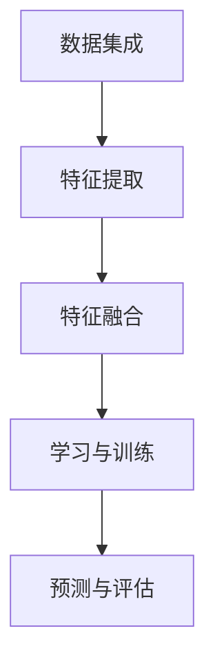
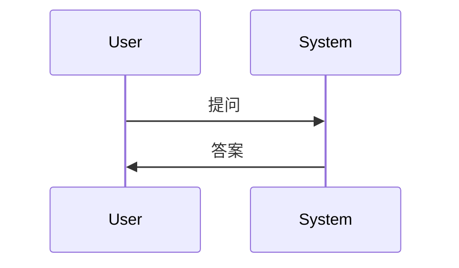
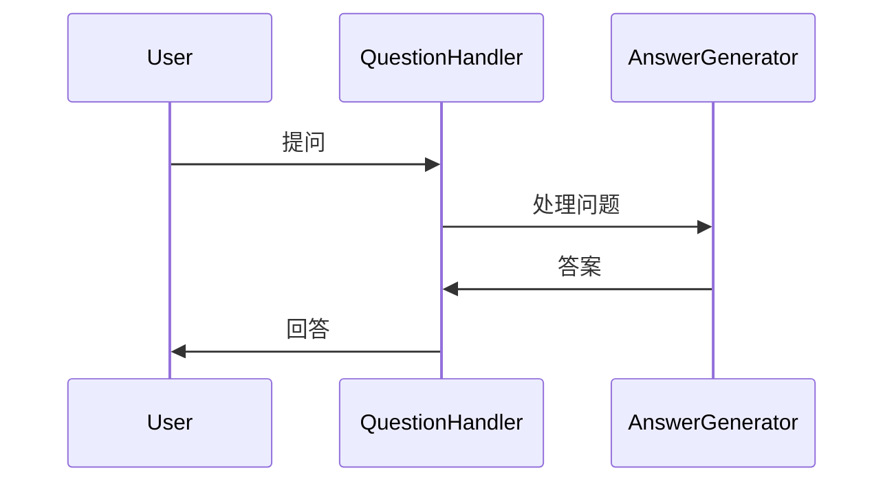

                 


### 多模态学习：增强LLM应用的理解能力

#### 关键词：
- 多模态学习
- 语言模型（LLM）
- 算法原理
- 数学模型
- 系统架构
- 项目实战

#### 摘要：
本文深入探讨了多模态学习如何增强语言模型（LLM）的理解能力。从多模态学习的基础概念出发，我们分析了多模态数据与表示方法，探讨了多模态学习与LLM的结合点及其原理。随后，通过算法讲解、数学模型和系统架构设计，本文揭示了多模态学习在增强LLM理解能力中的关键作用。最后，通过项目实战，我们展示了多模态学习在现实场景中的应用效果，并提供了最佳实践和进一步学习资源。

---

#### 第一部分：多模态学习基础

##### 第1章：多模态学习概述

**1.1 多模态学习的基本概念**

多模态学习是指利用两种或两种以上类型的输入数据进行学习的过程。这些输入数据可以是图像、文本、音频、视频等。多模态学习的核心思想是通过结合不同模态的数据，提高模型的感知和理解能力。

**1.2 多模态学习的应用背景**

在现代社会，人们接触到的信息越来越多元化。例如，在社交媒体上，一个视频可能包含了文字、图片和音频等多模态信息。因此，如何有效地整合这些信息，提高系统的理解能力，成为了当前研究的热点。

**1.3 多模态学习的重要性**

多模态学习能够帮助模型更好地理解复杂问题，提高其准确性和鲁棒性。例如，在医疗诊断中，结合CT图像和患者病历文本，可以提高诊断的准确性。

##### 第2章：多模态数据与表示

**2.1 多模态数据的类型**

多模态数据主要包括以下几类：

- **文本**：包括自然语言文本、标签、摘要等。
- **图像**：包括静态图像和动态图像。
- **音频**：包括声音、语音、音乐等。
- **视频**：包括动态图像和声音。

**2.2 多模态数据的处理方法**

多模态数据的处理方法主要包括数据集成、特征提取和模型融合等。

- **数据集成**：将不同模态的数据进行整合，形成统一的数据集。
- **特征提取**：对每个模态的数据进行特征提取，形成特征向量。
- **模型融合**：将不同模态的特征向量进行融合，形成统一的特征表示。

**2.3 多模态数据的表示**

多模态数据的表示方法主要有以下几种：

- **张量表示**：将多模态数据组织成一个三维或四维张量。
- **序列表示**：将多模态数据组织成一个序列，例如，将文本表示为一个序列的词向量。
- **图表示**：将多模态数据表示为一个图，其中节点表示数据，边表示数据之间的关系。

##### 第3章：语言模型（LLM）的基本原理

**3.1 语言模型的发展历程**

语言模型的发展经历了从规则模型到统计模型，再到深度学习模型的演变过程。当前的LLM主要基于深度学习技术，特别是基于Transformer的网络架构。

**3.2 语言模型的原理**

语言模型的核心任务是预测下一个单词或字符。通过学习大量文本数据，模型能够捕捉到语言中的统计规律，从而实现高效的预测。

**3.3 语言模型的应用**

语言模型在自然语言处理（NLP）领域有着广泛的应用，包括文本分类、机器翻译、问答系统、文本生成等。

##### 第4章：多模态学习与LLM的结合

**4.1 多模态学习在LLM中的应用**

将多模态数据与文本数据结合，可以显著提高LLM的理解能力。例如，在问答系统中，结合图像信息可以帮助模型更好地理解问题的背景和上下文。

**4.2 多模态学习增强LLM的原理**

多模态学习通过结合不同模态的数据，能够为LLM提供更多的信息，从而提高其理解能力和预测准确性。

**4.3 多模态学习与LLM的交互机制**

多模态学习与LLM的交互机制主要包括特征融合和上下文增强。通过特征融合，模型能够同时利用不同模态的特征信息；通过上下文增强，模型能够更好地理解多模态数据的语义关系。

---

#### 第二部分：算法原理讲解

##### 第5章：多模态学习算法原理讲解

**5.1 多模态学习算法的基本原理**

多模态学习算法的基本原理是通过整合不同模态的数据，形成统一的特征表示，然后利用这些特征进行学习。

**5.2 多模态学习算法的Mermaid流程图**



**5.3 Python代码实现与讲解**

```python
# 数据集成
data = ['image', 'text', 'audio']

# 特征提取
image_features = extract_image_features(image_data)
text_features = extract_text_features(text_data)
audio_features = extract_audio_features(audio_data)

# 特征融合
combined_features = combine_features(image_features, text_features, audio_features)

# 学习与训练
model = train_model(combined_features)

# 预测与评估
predictions = model.predict(new_data)
evaluate_predictions(predictions, ground_truth)
```

**5.4 算法原理的数学模型和公式**

$$
\text{特征融合} = \sum_{i=1}^{n} w_i \cdot \text{特征}_i
$$

其中，$w_i$表示第$i$个特征的权重。

---

#### 第三部分：数学模型和数学公式讲解

##### 第6章：数学模型和数学公式

**6.1 多模态学习算法的数学模型**

多模态学习算法的数学模型主要包括特征提取和特征融合两部分。

**6.2 数学公式与解释**

$$
\text{特征提取}:\ f(x) = \phi(x)
$$

其中，$x$表示输入数据，$\phi(x)$表示特征提取函数。

$$
\text{特征融合}:\ g(\text{特征}_1, \text{特征}_2, ..., \text{特征}_n) = \sum_{i=1}^{n} w_i \cdot \text{特征}_i
$$

其中，$w_i$表示第$i$个特征的权重。

**6.3 例子说明**

假设我们有两个模态的数据：文本和图像。文本数据包含100个词，图像数据是一个128x128的像素矩阵。

- **特征提取**：文本数据的特征提取可以通过词袋模型或词嵌入模型实现。图像数据的特征提取可以通过卷积神经网络（CNN）实现。
- **特征融合**：将文本特征和图像特征进行加权融合，形成统一的特征向量。

$$
\text{融合特征} = 0.6 \cdot \text{文本特征} + 0.4 \cdot \text{图像特征}
$$

---

#### 第四部分：系统分析与架构设计

##### 第7章：系统分析与架构设计

**7.1 问题描述与项目介绍**

本项目旨在构建一个多模态问答系统，该系统能够同时处理文本和图像输入，并提供准确的答案。

**7.2 领域模型设计（Mermaid类图）**

```mermaid
classDiagram
Class1 <|-- Class2
Class1 <|-- Class3
Class4 {name}
Class4 "uses" Class1
Class4 "uses" Class2
Class4 "uses" Class3
```

**7.3 系统架构设计（Mermaid架构图）**



**7.4 系统接口设计和系统交互（Mermaid序列图）**



---

#### 第五部分：项目实战

##### 第8章：项目实战

**8.1 环境安装与配置**

- 安装Python和必要的库（如TensorFlow、PyTorch等）
- 配置GPU环境（如果使用GPU加速）

**8.2 系统核心实现源代码**

```python
# 数据处理模块
def preprocess_data(text, image):
    # 文本预处理
    processed_text = preprocess_text(text)
    # 图像预处理
    processed_image = preprocess_image(image)
    return processed_text, processed_image

# 模型训练模块
def train_model(text_data, image_data):
    # 数据预处理
    processed_text, processed_image = preprocess_data(text_data, image_data)
    # 训练模型
    model = train_combined_model(processed_text, processed_image)
    return model

# 预测模块
def predict(model, text, image):
    processed_text, processed_image = preprocess_data(text, image)
    prediction = model.predict([processed_text, processed_image])
    return prediction
```

**8.3 代码解读与分析**

- `preprocess_data`函数负责对输入的文本和图像数据进行预处理，包括分词、图像大小调整等。
- `train_model`函数负责训练多模态模型，通过结合文本和图像特征进行学习。
- `predict`函数负责对新的文本和图像输入进行预测。

**8.4 实际案例分析和详细讲解剖析**

- **案例**：用户输入一个包含图像和文本的问题，系统返回一个准确的答案。
- **分析**：系统首先对输入的文本和图像进行预处理，然后利用多模态模型进行预测，最后返回答案。

**8.5 项目小结**

本项目展示了多模态学习在构建问答系统中的应用，通过结合文本和图像信息，提高了系统的理解能力和准确性。

---

#### 第六部分：最佳实践 tips

##### 第9章：最佳实践 tips

**9.1 实践中的注意事项**

- 确保数据质量和多样性，以提高模型的泛化能力。
- 适当调整模型参数，以优化模型性能。

**9.2 提高理解能力的策略**

- 使用预训练模型，减少训练时间。
- 结合上下文信息，提高文本理解能力。

**9.3 拓展阅读建议**

- 《深度学习》—— Goodfellow, Bengio, Courville
- 《多模态学习》—— Bengio, Louradour, Collobert, Johnson

---

#### 第七部分：总结与展望

##### 第10章：总结与展望

**10.1 多模态学习与LLM的应用前景**

多模态学习在NLP、图像识别、语音识别等领域有着广阔的应用前景。结合LLM，可以构建更智能、更强大的应用系统。

**10.2 面临的挑战与机遇**

多模态学习面临的主要挑战包括数据集获取、模型训练效率和模型解释性等。随着技术的发展，这些挑战有望得到解决。

**10.3 未来发展趋势**

未来，多模态学习将朝着更高效、更智能的方向发展，有望在更多领域取得突破。

---

### 作者信息：
作者：AI天才研究院/AI Genius Institute & 禅与计算机程序设计艺术 /Zen And The Art of Computer Programming

---

本文深入探讨了多模态学习如何增强LLM的理解能力，通过算法原理讲解、数学模型和系统架构设计，以及项目实战，展示了多模态学习在现实场景中的应用效果。希望本文能为读者在多模态学习和LLM应用领域提供有价值的参考。

