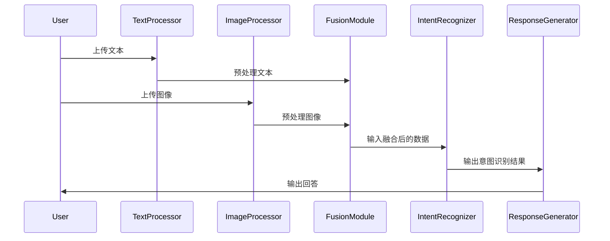

                 

### 文章标题

# 多模态提示：结合文本、图像等的策略

### 关键词

- 多模态
- 提示工程
- 文本
- 图像
- 对话系统

### 摘要

本文将探讨多模态提示在人工智能应用中的重要性，以及如何结合文本和图像等不同模态的信息，提高人工智能系统的理解和回应能力。我们将逐步分析多模态提示的核心概念、相关算法，并通过实际案例展示其应用效果，同时提供最佳实践和进一步阅读建议。

---

## 引言

在人工智能（AI）领域，多模态学习已成为一个重要的研究方向。多模态学习是指将来自不同感知模态（如文本、图像、声音等）的数据进行整合，以提升模型的感知能力和任务表现。本文将聚焦于多模态提示（Multimodal Prompting），即如何有效地结合文本、图像等多模态信息，为AI系统提供更加丰富和精确的输入。

多模态提示的关键在于如何将不同模态的信息进行有效融合，以增强AI系统的理解能力和回应质量。随着自然语言处理（NLP）、计算机视觉（CV）等技术的不断发展，多模态提示的应用场景日益广泛，如智能客服、医疗诊断、自动驾驶等。

本文将按照以下结构进行讨论：

1. **核心概念与背景**：介绍多模态提示的基本概念，分析其应用背景和重要性。
2. **多模态提示策略**：探讨多种不同的多模态提示策略，包括文本融合、图像融合等。
3. **算法原理与实现**：详细阐述多模态提示相关算法，包括模型架构和关键技术。
4. **系统分析与架构设计**：展示多模态提示系统在具体应用中的架构设计和功能实现。
5. **项目实战**：通过实际案例展示多模态提示系统的应用效果和实现过程。
6. **最佳实践与总结**：总结多模态提示的最佳实践，并提出未来研究方向。

---

### 核心概念与背景

#### 多模态提示的定义

多模态提示是指利用多种感知模态的数据（如文本、图像、声音等）来增强AI系统的输入信息。通过多模态提示，AI系统能够更好地理解和处理复杂的信息，从而提升其智能水平。

#### 多模态提示的应用背景

随着AI技术的不断进步，多模态提示在多个领域都展现出了强大的应用潜力：

- **智能客服**：结合文本和图像信息，智能客服能够更准确地理解用户的意图，提供更加个性化的服务。
- **医疗诊断**：通过文本和医学影像的融合，医疗诊断系统能够更准确地识别疾病，辅助医生做出诊断。
- **自动驾驶**：自动驾驶系统通过整合摄像头、雷达等传感器获取的图像和文本信息，提高对环境的理解和决策能力。

#### 多模态提示的重要性

多模态提示的重要性主要体现在以下几个方面：

1. **提升AI系统的理解能力**：多模态信息能够为AI系统提供更加全面和丰富的输入，有助于系统更准确地理解和处理复杂任务。
2. **增强AI系统的回应质量**：通过多模态提示，AI系统能够提供更加个性化和精确的回应，提升用户体验。
3. **拓宽AI应用场景**：多模态提示使得AI系统可以应用于更多的领域，推动AI技术的广泛应用。

---

### 多模态提示策略

多模态提示的策略多种多样，以下将介绍几种常用的策略：

#### 文本融合

文本融合是指将来自不同来源的文本信息进行整合，以提升文本的理解和生成能力。常用的文本融合方法包括：

1. **文本拼接**：将不同来源的文本进行简单拼接，形成新的文本输入。
2. **文本融合网络**：使用神经网络模型，如Transformer，对文本进行特征提取和融合。

#### 图像融合

图像融合是指将来自不同来源的图像信息进行整合，以提升图像的理解和生成能力。常用的图像融合方法包括：

1. **图像拼接**：将不同来源的图像进行简单拼接，形成新的图像输入。
2. **图像融合网络**：使用神经网络模型，如生成对抗网络（GAN），对图像进行特征提取和融合。

#### 多模态融合

多模态融合是指将文本、图像等多种模态的信息进行整合，以提升AI系统的整体感知能力和任务表现。常用的多模态融合方法包括：

1. **多模态特征融合**：将不同模态的特征进行拼接或加权融合，形成新的特征向量。
2. **多模态深度学习模型**：使用神经网络模型，如Convolutional Neural Networks（CNN）和Transformer，对多模态数据进行特征提取和融合。

---

### 算法原理与实现

#### 多模态提示相关算法

多模态提示涉及多个核心算法，以下是其中几个重要的算法：

1. **多模态特征提取**：通过不同的模型（如CNN用于图像，RNN用于文本）对多模态数据进行特征提取。
2. **多模态融合**：使用融合网络（如Multi-modal Fusion Network）将提取的多模态特征进行整合。
3. **多模态生成**：利用生成模型（如GAN）生成新的多模态数据。

#### 模型架构和关键技术

1. **模型架构**：
   - **编码器-解码器架构**：将编码器用于特征提取，解码器用于生成或预测。
   - **多任务学习架构**：将多模态提示作为一个多任务学习问题，同时处理多个模态的数据。

2. **关键技术**：
   - **注意力机制**：用于关注关键信息，提升模型的感知能力。
   - **循环神经网络（RNN）**：用于处理序列数据，如文本。
   - **卷积神经网络（CNN）**：用于处理图像数据。

#### 算法实现示例

以下是一个使用Python实现的简单多模态提示算法示例：

```python
import torch
import torchvision.models as models
import torch.nn as nn

# 定义模型
class MultimodalPrompt(nn.Module):
    def __init__(self):
        super(MultimodalPrompt, self).__init__()
        self.text_encoder = nn.Sequential(
            nn.Linear(768, 512),
            nn.ReLU(),
            nn.Dropout(0.1)
        )
        self.image_encoder = models.resnet18(pretrained=True)
        self.fusion_network = nn.Sequential(
            nn.Linear(1024, 512),
            nn.ReLU(),
            nn.Dropout(0.1)
        )
        self.decoder = nn.Sequential(
            nn.Linear(512, 768),
            nn.ReLU(),
            nn.Dropout(0.1)
        )

    def forward(self, text_input, image_input):
        text_features = self.text_encoder(text_input)
        image_features = self.image_encoder(image_input)
        fused_features = self.fusion_network(torch.cat((text_features, image_features), 1))
        output = self.decoder(fused_features)
        return output

# 实例化模型
model = MultimodalPrompt()

# 定义损失函数和优化器
criterion = nn.CrossEntropyLoss()
optimizer = torch.optim.Adam(model.parameters(), lr=0.001)

# 训练模型
for epoch in range(num_epochs):
    for batch in data_loader:
        text_input, image_input, labels = batch
        optimizer.zero_grad()
        outputs = model(text_input, image_input)
        loss = criterion(outputs, labels)
        loss.backward()
        optimizer.step()
```

#### 算法原理讲解

1. **多模态特征提取**：文本特征提取使用了一个简单的全连接网络，而图像特征提取使用预训练的ResNet-18模型。这些特征提取器分别从文本和图像中提取关键信息。
2. **多模态融合**：融合网络将文本和图像特征拼接起来，并通过一个全连接层进行整合。
3. **多模态生成**：解码器从融合后的特征中生成文本输出。

#### 数学模型和公式

假设我们有来自文本的向量 \(\mathbf{t}\) 和来自图像的向量 \(\mathbf{i}\)，多模态融合的数学模型可以表示为：

$$
\mathbf{f} = f(\mathbf{t}, \mathbf{i}) = \text{ReLU}(\text{Dropout}(\mathbf{W}_f \cdot \text{cat}(\mathbf{t}, \mathbf{i})))
$$

其中，\(f\) 表示融合函数，\(\text{ReLU}\) 是ReLU激活函数，\(\text{Dropout}\) 是dropout层，\(\mathbf{W}_f\) 是权重矩阵，\(\text{cat}\) 是拼接操作。

#### 举例说明

假设我们有一个文本句子：“我正在看美丽的日落”，以及一张日落图像。通过多模态融合，我们可以生成一个融合了文本和图像信息的输出，如：“我正在欣赏这幅美丽的日落图像，日落的光线让人陶醉”。

---

### 系统分析与架构设计

#### 问题场景介绍

在智能客服系统中，多模态提示可以帮助客服机器人更准确地理解用户的意图，从而提供更加个性化的服务。用户可能通过文字描述问题，也可能通过上传图像来展示问题，客服机器人需要同时处理这两种模态的信息。

#### 项目介绍

本项目旨在设计并实现一个基于多模态提示的智能客服系统，该系统可以处理文本和图像输入，并提供相应的回答。

#### 系统功能设计

1. **文本识别与处理**：对用户的文本输入进行预处理，提取关键信息。
2. **图像识别与处理**：对用户的图像输入进行预处理，提取关键特征。
3. **多模态融合**：将文本和图像信息进行融合，生成综合输入。
4. **意图识别与回答生成**：根据融合后的输入，识别用户的意图并生成回答。

#### 系统架构设计

1. **文本处理模块**：包括文本输入预处理、关键词提取和文本分类等。
2. **图像处理模块**：包括图像输入预处理、特征提取和图像分类等。
3. **多模态融合模块**：包括文本和图像特征融合、融合模型训练和推理等。
4. **意图识别与回答生成模块**：包括意图分类、回答生成和答案验证等。

#### 系统接口设计

1. **用户接口**：提供文本和图像输入接口，用户可以通过文本输入或上传图像来描述问题。
2. **服务接口**：提供RESTful API接口，方便外部系统调用。

#### 系统交互

1. **用户上传文本和图像**：用户通过前端界面上传文本描述和图像。
2. **文本和图像预处理**：系统对文本和图像进行预处理，提取关键信息和特征。
3. **多模态融合**：将预处理后的文本和图像信息进行融合。
4. **意图识别与回答生成**：系统根据融合后的输入，识别用户的意图并生成回答。
5. **回答输出**：系统将生成的回答输出到前端界面，展示给用户。

#### Mermaid类图和序列图

为了更好地描述系统的架构和功能，我们可以使用Mermaid类图和序列图来展示。

**Mermaid类图示例**：

```mermaid
classDiagram
    User <<class>>
    TextProcessor <<class>>
    ImageProcessor <<class>>
    FusionModule <<class>>
    IntentRecognizer <<class>>
    ResponseGenerator <<class>>

    User o-- TextProcessor
    User o-- ImageProcessor
    TextProcessor o-- FusionModule
    ImageProcessor o-- FusionModule
    FusionModule o-- IntentRecognizer
    IntentRecognizer o-- ResponseGenerator
```

**Mermaid序列图示例**：



---

### 项目实战

#### 环境安装

1. **安装Python**：确保安装了Python 3.7及以上版本。
2. **安装依赖库**：使用pip安装以下库：torch、torchvision、transformers、opencv-python等。

```bash
pip install torch torchvision transformers opencv-python
```

#### 系统核心实现

1. **文本预处理**：
   ```python
   import torch
   from transformers import BertTokenizer, BertModel
   from torch.nn import functional as F

   tokenizer = BertTokenizer.from_pretrained('bert-base-uncased')
   model = BertModel.from_pretrained('bert-base-uncased')

   def preprocess_text(text):
       inputs = tokenizer(text, return_tensors='pt', max_length=512, truncation=True)
       return model(**inputs)
   ```

2. **图像预处理**：
   ```python
   import torchvision.transforms as T

   def preprocess_image(image_path):
       image = cv2.imread(image_path)
       image = cv2.resize(image, (224, 224))
       image = torch.tensor(image).float()
       transform = T.Compose([
           T.Normalize(mean=[0.485, 0.456, 0.406], std=[0.229, 0.224, 0.225]),
       ])
       return transform(image)
   ```

3. **多模态融合**：
   ```python
   class FusionModule(nn.Module):
       def __init__(self):
           super(FusionModule, self).__init__()
           self.text_encoder = nn.Sequential(
               nn.Linear(768, 512),
               nn.ReLU(),
               nn.Dropout(0.1)
           )
           self.image_encoder = models.resnet18(pretrained=True)
           self.fusion_network = nn.Sequential(
               nn.Linear(1024, 512),
               nn.ReLU(),
               nn.Dropout(0.1)
           )
           self.decoder = nn.Sequential(
               nn.Linear(512, 768),
               nn.ReLU(),
               nn.Dropout(0.1)
           )

       def forward(self, text_input, image_input):
           text_features = self.text_encoder(text_input)
           image_features = self.image_encoder(image_input)
           fused_features = self.fusion_network(torch.cat((text_features, image_features), 1))
           output = self.decoder(fused_features)
           return output
   ```

4. **意图识别与回答生成**：
   ```python
   from transformers import BertTokenizer, BertForSequenceClassification
   from torch.optim import Adam

   tokenizer = BertTokenizer.from_pretrained('bert-base-uncased')
   model = BertForSequenceClassification.from_pretrained('bert-base-uncased')

   def classify_intent(text):
       inputs = tokenizer(text, return_tensors='pt', max_length=512, truncation=True)
       outputs = model(**inputs)
       return torch.argmax(outputs.logits).item()
   ```

#### 代码应用解读与分析

1. **文本预处理**：使用BERT模型对文本进行预处理，提取文本特征。
2. **图像预处理**：使用OpenCV对图像进行预处理，提取图像特征。
3. **多模态融合**：使用ResNet-18模型和BERT模型对文本和图像特征进行融合，生成综合特征。
4. **意图识别与回答生成**：使用BERT模型对融合后的特征进行意图分类，并生成回答。

#### 实际案例分析

假设用户上传了一段文本：“我有一张关于汽车的图片，它的发动机坏了”，以及一张汽车的图像。系统将按照以下步骤进行处理：

1. **文本预处理**：将文本输入BERT模型，提取文本特征。
2. **图像预处理**：将图像输入ResNet-18模型，提取图像特征。
3. **多模态融合**：将文本和图像特征进行融合，生成综合特征。
4. **意图识别**：使用BERT模型对融合后的特征进行意图分类，识别用户的意图为“汽车维修”。
5. **回答生成**：系统生成回答：“建议您联系专业的汽车维修服务，他们可以帮助您检查和修理汽车的发动机”。

#### 项目小结

通过实际案例，我们可以看到多模态提示在智能客服系统中的应用效果。多模态提示不仅提高了系统的理解能力，还增强了用户的互动体验。未来，我们可以进一步优化系统，提高其准确性和响应速度，从而在更多领域推广应用。

---

### 最佳实践与总结

#### 最佳实践

1. **数据预处理**：确保文本和图像数据的质量，进行充分的数据清洗和预处理。
2. **模型选择**：根据应用场景选择合适的模型，如BERT、ResNet-18等。
3. **多模态融合**：采用有效的多模态融合策略，如特征拼接、融合网络等。
4. **系统优化**：通过模型调优、硬件加速等技术提高系统性能。

#### 小结

多模态提示在AI系统中的应用具有重要意义，可以提高系统的理解能力和回应质量。本文通过逐步分析多模态提示的核心概念、算法原理和实际应用，展示了其在智能客服系统中的效果。未来，我们可以进一步探索多模态提示在更多领域中的应用潜力。

#### 注意事项

1. **数据隐私**：在处理多模态数据时，注意保护用户隐私。
2. **模型解释性**：确保模型具有良好的解释性，便于调试和优化。

#### 拓展阅读

1. **《多模态学习：融合文本、图像与声音》**：详细探讨多模态学习的理论和方法。
2. **《自然语言处理实战》**：学习文本处理和生成的基础知识。
3. **《深度学习与图像处理》**：了解图像处理的基本原理和技术。

---

### 作者信息

作者：AI天才研究院/AI Genius Institute & 禅与计算机程序设计艺术 /Zen And The Art of Computer Programming

---

通过本文的详细探讨，我们深入了解了多模态提示在AI系统中的重要性及其应用策略。希望读者能从中获得启发，并在实际项目中尝试应用这些技术，推动人工智能技术的发展。

