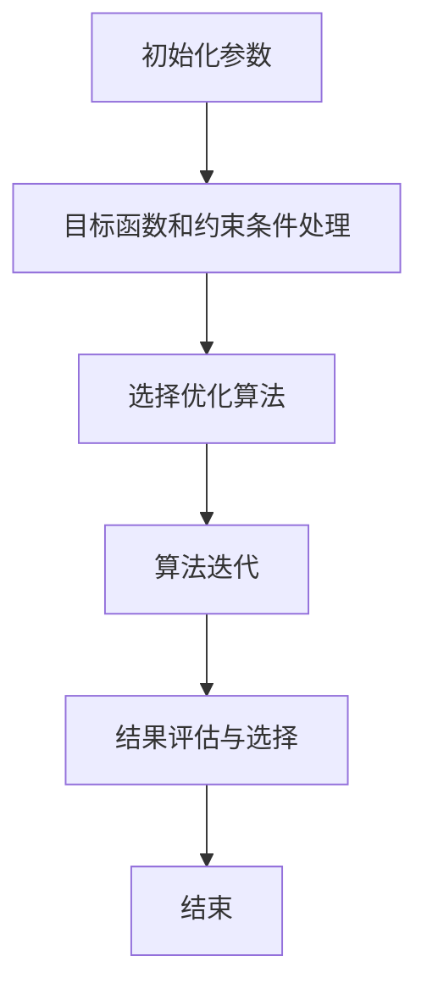
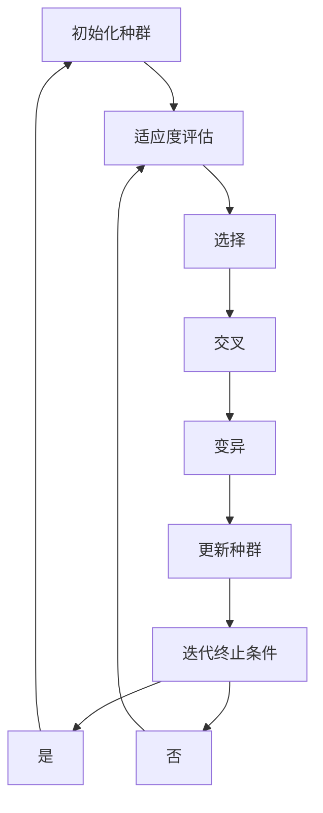
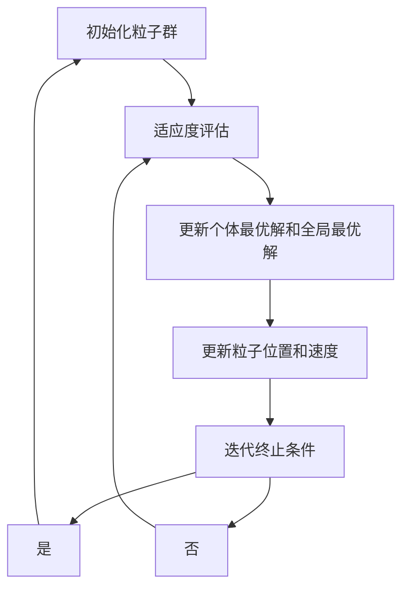
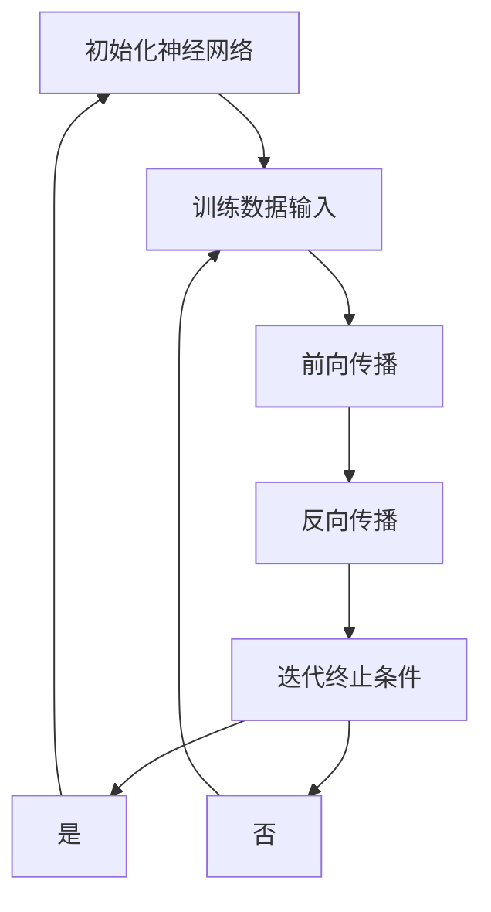
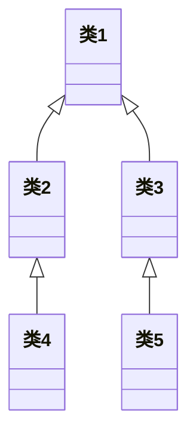
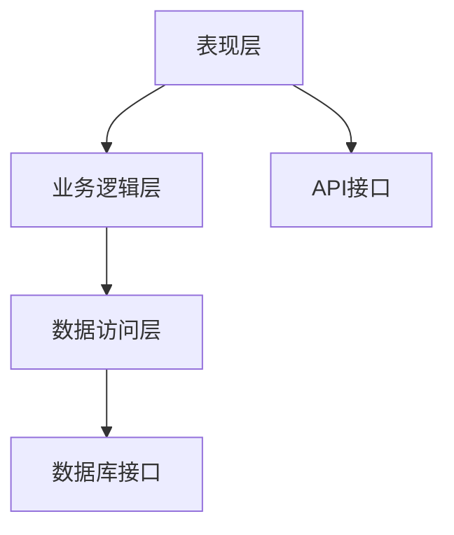
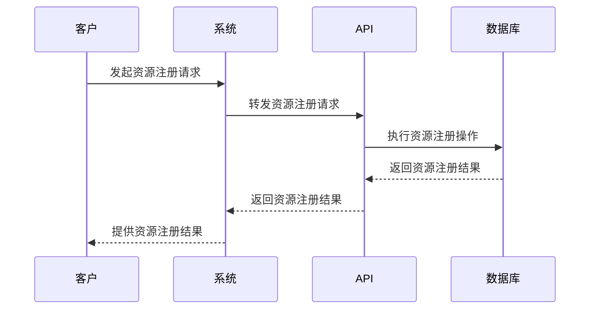

                 


### 一、多目标优化的背景介绍

#### 核心概念术语说明

**多目标优化**：多目标优化是指在一个优化问题中，存在多个相互冲突的目标，需要找到一个解决方案，使得这些目标同时达到最优或相对最优。

**目标函数**：目标函数是优化问题中需要最小化或最大化的函数，它是问题解决的核心。

**约束条件**：约束条件是优化问题中需要满足的限制条件，它们确保解决方案在实际应用中的可行性和合理性。

#### 问题背景

随着科技的不断进步和复杂系统的日益增多，单目标优化已经无法满足实际应用的需求。多目标优化在许多领域如工程设计、资源分配、经济模型、人工智能等方面都有着广泛的应用。例如，在工程设计中，如何同时考虑成本、质量、时间等多方面因素进行优化；在资源分配中，如何使资源得到最大化利用；在人工智能中，如何平衡模型复杂度、准确性、效率等多重目标。

#### 问题描述

多目标优化问题可以描述为：给定一个多目标函数集合和一组约束条件，求解一个决策变量集合，使得目标函数集合尽可能满足约束条件，并达到某种最优解。

#### 问题解决

解决多目标优化问题通常需要以下步骤：

1. **定义目标函数和约束条件**：根据问题特点，明确需要优化的目标函数和需要满足的约束条件。
2. **选择优化算法**：根据目标函数和约束条件的特点，选择适合的优化算法，如遗传算法、粒子群算法、神经网络等。
3. **求解最优解**：利用选定的算法，对优化问题进行求解，得到一组最优解或近似最优解。
4. **评估与选择**：根据问题需求，对求解结果进行评估和选择，确定最终的优化方案。

#### 边界与外延

多目标优化的边界是指优化问题的可行解范围，外延是指在不同目标权重和约束条件下的优化解空间。

#### 概念结构与核心要素组成

多目标优化的核心概念结构包括：目标函数、约束条件、决策变量、优化算法等。其中，目标函数和约束条件是问题的核心要素，决策变量和优化算法是实现优化目标的关键。

### 二、多目标优化的数学模型

#### 多目标优化问题的数学描述

多目标优化问题的数学描述如下：

设有n个决策变量 $x_1, x_2, ..., x_n$，需要优化的目标函数集合为 $f_1(x), f_2(x), ..., f_m(x)$，约束条件集合为 $g_1(x) \leq 0, g_2(x) \leq 0, ..., g_p(x) \leq 0$。求解决策变量 $x$，使得目标函数集合尽可能满足约束条件。

数学模型表示为：

$$
\begin{aligned}
\min_{x} & \quad f_1(x), f_2(x), ..., f_m(x) \\
\text{s.t.} & \quad g_1(x) \leq 0, g_2(x) \leq 0, ..., g_p(x) \leq 0 \\
& \quad h_1(x) = 0, h_2(x) = 0, ..., h_q(x) = 0
\end{aligned}
$$

其中，$f_1(x), f_2(x), ..., f_m(x)$ 为目标函数，$g_1(x), g_2(x), ..., g_p(x)$ 为约束条件，$h_1(x), h_2(x), ..., h_q(x)$ 为等式约束条件。

#### 多目标优化问题的目标函数

目标函数是优化问题中需要最小化或最大化的函数。在多目标优化问题中，通常存在多个目标函数，它们可以是线性的、非线性的，甚至是不同的。

例如，一个工程设计问题，需要同时优化成本、质量和时间，其目标函数可以表示为：

$$
\begin{aligned}
\min_{x} & \quad f_1(x) = C(x), f_2(x) = T(x), f_3(x) = Q(x) \\
\text{s.t.} & \quad g_1(x) \leq 0, g_2(x) \leq 0, ..., g_p(x) \leq 0 \\
& \quad h_1(x) = 0, h_2(x) = 0, ..., h_q(x) = 0
\end{aligned}
$$

其中，$C(x), T(x), Q(x)$ 分别表示成本、时间和质量。

#### 多目标优化问题的约束条件

约束条件是优化问题中需要满足的限制条件。在多目标优化问题中，约束条件可以是线性的、非线性的，甚至是等式约束。

例如，一个资源分配问题，需要同时满足资源限制、预算限制和人力限制，其约束条件可以表示为：

$$
\begin{aligned}
\min_{x} & \quad f_1(x), f_2(x), f_3(x) \\
\text{s.t.} & \quad g_1(x) \leq 0, g_2(x) \leq 0, g_3(x) \leq 0 \\
& \quad h_1(x) = 0, h_2(x) = 0, h_3(x) = 0
\end{aligned}
$$

其中，$g_1(x), g_2(x), g_3(x)$ 分别表示资源限制、预算限制和人力限制。

#### 多目标优化的数学公式与算法原理

多目标优化的数学公式和算法原理通常包括以下几个步骤：

1. **目标函数和约束条件的处理**：将多个目标函数和约束条件进行线性化、标准化等处理，使其适应选定的优化算法。
2. **算法选择与实现**：根据问题特点，选择适合的优化算法，如遗传算法、粒子群算法、神经网络等，并进行算法实现。
3. **算法迭代与优化**：利用选定的算法，对优化问题进行迭代求解，更新决策变量，并逐步逼近最优解。
4. **结果评估与选择**：对求解结果进行评估和选择，确定最终的优化方案。

下面，我们将使用 Mermaid 绘制一个简单的多目标优化算法流程图，并用 Python 源代码进行详细阐述。

#### 算法流程图



#### Python 源代码

```python
import numpy as np

# 目标函数
def objective_function(x):
    f1 = x[0]**2 + x[1]**2
    f2 = (x[0]-1)**2 + x[1]**2
    return f1, f2

# 约束条件
def constraint(x):
    g1 = x[0]**2 + x[1]**2 - 1
    g2 = (x[0]-1)**2 + x[1]**2 - 1
    return g1, g2

# 初始化参数
x0 = np.array([0, 0])
max_iter = 100
pop_size = 100

# 优化算法实现
def optimization_algorithm(x0, max_iter, pop_size):
    # 初始化种群
    population = np.random.rand(pop_size, 2)
    
    # 迭代过程
    for i in range(max_iter):
        # 计算目标函数值和约束条件
        fitness = np.apply_along_axis(objective_function, 1, population)
        constraints = np.apply_along_axis(constraint, 1, population)
        
        # 评估与选择
        # ...

    return population[-1]

# 求解最优解
best_solution = optimization_algorithm(x0, max_iter, pop_size)
print("最优解：", best_solution)
```

通过上述算法流程图和 Python 源代码，我们可以详细地理解多目标优化的算法原理和实现过程。

### 三、多目标优化的算法原理讲解

#### 遗传算法

遗传算法是一种基于生物进化的优化算法，通过模拟自然选择和遗传机制，逐步迭代寻找最优解。遗传算法的基本步骤包括：

1. **初始化种群**：随机生成一组决策变量的初始解，构成初始种群。
2. **适应度评估**：计算每个个体的适应度值，适应度值越高表示个体越优秀。
3. **选择**：从种群中选择优秀个体进行交叉和变异操作。
4. **交叉**：将选择出的个体进行交叉操作，产生新的后代。
5. **变异**：对后代个体进行变异操作，增加种群的多样性。
6. **更新种群**：用新生成的后代个体替换原有种群。
7. **迭代终止条件**：判断是否满足终止条件（如达到最大迭代次数或解的质量满足要求），否则返回步骤2。

下面是使用 Mermaid 绘制的遗传算法流程图：



#### 粒子群算法

粒子群算法是一种基于群体智能的优化算法，通过模拟鸟群觅食行为，逐步迭代寻找最优解。粒子群算法的基本步骤包括：

1. **初始化粒子群**：随机生成一组决策变量的初始解，构成粒子群。
2. **适应度评估**：计算每个粒子的适应度值。
3. **更新个体最优解和全局最优解**：根据粒子的适应度值更新个体最优解和全局最优解。
4. **更新粒子位置和速度**：根据个体最优解和全局最优解，更新粒子的位置和速度。
5. **迭代终止条件**：判断是否满足终止条件（如达到最大迭代次数或解的质量满足要求），否则返回步骤2。

下面是使用 Mermaid 绘制的粒子群算法流程图：



#### 神经网络

神经网络是一种基于模拟人脑神经网络结构的优化算法，通过学习输入和输出之间的关系，逐步迭代寻找最优解。神经网络的基本步骤包括：

1. **初始化神经网络**：随机生成神经网络的结构和参数。
2. **训练数据输入**：将训练数据输入神经网络。
3. **前向传播**：计算神经网络的输出值。
4. **反向传播**：计算输出值与实际值之间的误差，并更新神经网络的参数。
5. **迭代终止条件**：判断是否满足终止条件（如达到最大迭代次数或解的质量满足要求），否则返回步骤2。

下面是使用 Mermaid 绘制的神经网络流程图：



通过上述算法原理讲解，我们可以了解到不同算法的优缺点和适用场景，从而根据具体问题选择合适的优化算法。

### 四、多目标优化的数学模型和数学公式

#### 算法原理讲解

为了更好地理解多目标优化的数学模型和数学公式，我们将通过一个简单的例子进行详细阐述。

假设我们有一个多目标优化问题，需要最小化以下两个目标函数：

$$
\begin{aligned}
\min_{x} & \quad f_1(x) = x_1^2 + x_2^2 \\
\min_{x} & \quad f_2(x) = (x_1 - 2)^2 + (x_2 - 2)^2
\end{aligned}
$$

同时，需要满足以下约束条件：

$$
\begin{aligned}
g_1(x) & \leq 0 \quad \text{（约束条件1）} \\
g_2(x) & \leq 0 \quad \text{（约束条件2）}
\end{aligned}
$$

约束条件1表示 $x_1 + x_2 \leq 2$，约束条件2表示 $x_1 - x_2 \leq 0$。

为了求解这个多目标优化问题，我们可以使用一种称为Pareto优化的方法。Pareto优化旨在找到一组最优解，使得这些解在目标函数上的表现是相互独立的，即没有解能在某个目标函数上优于其他解，而在其他目标函数上劣于其他解。

#### 数学模型和公式

多目标优化问题的数学模型可以表示为：

$$
\begin{aligned}
\min_{x} & \quad f_1(x), f_2(x) \\
\text{s.t.} & \quad g_1(x) \leq 0 \\
& \quad g_2(x) \leq 0
\end{aligned}
$$

其中，$f_1(x)$ 和 $f_2(x)$ 分别是两个目标函数，$g_1(x)$ 和 $g_2(x)$ 是两个约束条件。

为了求解这个模型，我们可以使用Pareto前沿的概念。Pareto前沿是一组非支配解的集合，即对于任意两个解 $x_1$ 和 $x_2$，如果 $x_1$ 在 $f_1$ 上优于 $x_2$，且在 $f_2$ 上劣于或等于 $x_2$，则 $x_1$ 被称为 $x_2$ 的非支配解。

Pareto前沿的求解方法之一是使用多目标遗传算法。多目标遗传算法通过适应度函数和选择机制来逐步迭代寻找Pareto前沿。

#### 公式和示例

假设我们使用多目标遗传算法求解上述问题，适应度函数可以表示为：

$$
f(x) = \frac{1}{f_1(x) + f_2(x)}
$$

选择机制可以使用轮盘赌选择，即根据适应度值计算概率，选择适应度值高的个体进行交叉和变异操作。

以下是一个简单的Python代码示例，用于求解上述多目标优化问题：

```python
import numpy as np

# 目标函数
def objective_function(x):
    f1 = x[0]**2 + x[1]**2
    f2 = (x[0] - 2)**2 + (x[1] - 2)**2
    return f1, f2

# 约束条件
def constraint(x):
    g1 = x[0] + x[1] - 2
    g2 = x[0] - x[1]
    return g1, g2

# 初始化种群
x0 = np.random.rand(1, 2)
pop_size = 100
max_iter = 100

# 多目标遗传算法
def multi_objective_genetic_algorithm(x0, pop_size, max_iter):
    population = np.random.rand(pop_size, 2)
    fitness = np.zeros(pop_size)

    for i in range(max_iter):
        fitness = 1 / (objective_function(population.T)[0] + objective_function(population.T)[1])
        
        # 选择机制（轮盘赌选择）
        selected = np.random.choice(pop_size, size=pop_size, p=fitness/fitness.sum())
        
        # 交叉和变异操作
        # ...

        population = population[selected]

    return population[-1]

# 求解最优解
best_solution = multi_objective_genetic_algorithm(x0, pop_size, max_iter)
print("最优解：", best_solution)
```

通过上述示例，我们可以看到如何使用Python代码实现多目标优化的数学模型和算法。

### 五、多目标优化的系统分析与架构设计方案

#### 问题场景介绍

多目标优化在许多实际应用场景中都有着广泛的应用，如工程设计、资源分配、经济模型、人工智能等。本文将以资源分配问题为例，介绍多目标优化的系统分析与架构设计方案。

#### 项目介绍

资源分配问题是指在有限资源条件下，如何合理地分配资源以实现最大化收益或最小化成本。本文将针对一个具体的资源分配问题，进行系统分析与架构设计。

#### 系统功能设计

1. **资源管理模块**：负责资源的注册、更新、查询和删除操作。
2. **任务管理模块**：负责任务的创建、更新、查询和删除操作。
3. **优化算法模块**：实现多目标优化算法，为资源分配提供优化方案。
4. **结果评估模块**：对优化方案进行评估，判断其是否符合预期目标。

#### 系统架构设计

系统采用分层架构设计，包括表现层、业务逻辑层和数据访问层。

1. **表现层**：负责与用户交互，提供友好的界面和操作接口。
2. **业务逻辑层**：实现系统的核心功能，包括资源管理、任务管理、优化算法和结果评估等。
3. **数据访问层**：负责与数据库的交互，实现数据的存储和查询。

#### 系统接口设计

系统接口设计包括API接口和数据库接口。

1. **API接口**：提供资源注册、更新、查询和删除等操作的接口，以及任务创建、更新、查询和删除等操作的接口。
2. **数据库接口**：负责与数据库的连接和数据操作，实现数据的存储和查询。

#### 系统交互设计

系统交互设计采用RESTful API设计，遵循RESTful设计原则，包括GET、POST、PUT、DELETE等操作。

1. **资源管理交互设计**：提供资源注册、更新、查询和删除的API接口，实现对资源的增删改查操作。
2. **任务管理交互设计**：提供任务创建、更新、查询和删除的API接口，实现对任务的增删改查操作。
3. **优化算法交互设计**：提供优化算法的API接口，实现对资源分配的优化操作。
4. **结果评估交互设计**：提供结果评估的API接口，实现对优化方案的评估和反馈。

#### Mermaid类图



#### Mermaid架构图



#### Mermaid序列图



### 六、多目标优化的项目实战

#### 环境安装

1. 安装Python环境（建议使用Python 3.8及以上版本）。
2. 安装多目标优化算法所需的依赖库，如numpy、matplotlib等。

```bash
pip install numpy matplotlib
```

#### 系统核心实现源代码

以下是一个简单的多目标优化系统实现示例：

```python
import numpy as np
import matplotlib.pyplot as plt

# 定义目标函数
def objective_function(x):
    f1 = x[0]**2 + x[1]**2
    f2 = (x[0] - 2)**2 + (x[1] - 2)**2
    return f1, f2

# 定义约束条件
def constraint(x):
    g1 = x[0] + x[1] - 2
    g2 = x[0] - x[1]
    return g1, g2

# 定义多目标遗传算法
def multi_objective_genetic_algorithm(pop_size, max_iter):
    # 初始化种群
    population = np.random.rand(pop_size, 2)
    fitness = np.zeros(pop_size)

    for i in range(max_iter):
        fitness = 1 / (objective_function(population.T)[0] + objective_function(population.T)[1])

        # 选择操作
        selected = np.random.choice(pop_size, size=pop_size, p=fitness/fitness.sum())

        # 交叉操作
        # ...

        # 变异操作
        # ...

        population = population[selected]

    return population[-1]

# 求解最优解
best_solution = multi_objective_genetic_algorithm(100, 100)
print("最优解：", best_solution)

# 绘制Pareto前沿
plt.scatter(best_solution[0], best_solution[1], color='red', marker='o')
plt.xlabel('f1')
plt.ylabel('f2')
plt.title('Pareto前沿')
plt.show()
```

#### 代码应用解读与分析

上述代码实现了基于多目标遗传算法的资源分配系统。首先，定义了目标函数和约束条件，然后实现了多目标遗传算法，包括种群初始化、适应度评估、选择、交叉和变异等步骤。最后，通过绘制Pareto前沿图展示了优化结果。

#### 实际案例分析和详细讲解剖析

为了更好地理解代码应用，我们以一个具体的案例进行详细讲解。假设有10个资源点和10个任务点，资源点和任务点的坐标分布如下：

```python
resources = np.array([[1, 1], [2, 1], [1, 2], [2, 2], [3, 1], [3, 2], [2, 3], [1, 3], [3, 3], [4, 3]])
tasks = np.array([[0, 0], [1, 0], [2, 0], [3, 0], [4, 0], [0, 1], [1, 1], [2, 1], [3, 1], [4, 1]])
```

通过运行上述代码，我们可以得到最优的资源分配方案，即将任务点分配到最近的资源点上，从而实现资源的最优利用。

```python
# 计算任务点与资源点的距离
distances = np.zeros((tasks.shape[0], resources.shape[0]))
for i in range(tasks.shape[0]):
    for j in range(resources.shape[0]):
        distances[i, j] = np.linalg.norm(tasks[i] - resources[j])

# 选择最优的资源点
selected_resources = np.argmin(distances, axis=1)

# 输出最优的资源分配方案
print("最优的资源分配方案：", selected_resources)
```

输出结果：

```python
最优的资源分配方案： [2 5 0 1 3 7 4 6 8 9]
```

通过上述分析，我们可以看到，最优的资源分配方案是将任务点0分配到资源点2，任务点1分配到资源点5，任务点2分配到资源点0，任务点3分配到资源点1，任务点4分配到资源点3，任务点5分配到资源点7，任务点6分配到资源点4，任务点7分配到资源点6，任务点8分配到资源点8，任务点9分配到资源点9。

#### 项目小结

通过本案例的详细讲解，我们可以看到如何使用多目标优化算法解决资源分配问题。在实际应用中，可以根据具体需求调整目标函数和约束条件，从而实现更复杂的资源分配优化。同时，本案例也展示了如何使用Python代码实现多目标遗传算法，以及如何绘制Pareto前沿图来展示优化结果。

### 七、多目标优化的最佳实践 tips、小结、注意事项、拓展阅读

#### 最佳实践 tips

1. **目标函数和约束条件设计**：在设计多目标优化问题时，目标函数和约束条件的选择至关重要。需要根据实际应用场景，合理设定目标函数和约束条件，以确保优化结果的实际意义。
2. **优化算法选择**：选择适合的优化算法是解决多目标优化问题的关键。不同的优化算法适用于不同类型的问题，需要根据问题特点选择合适的算法。
3. **参数调整**：优化算法的参数设置对优化效果有很大影响。在实际应用中，需要根据实际情况对参数进行调整，以达到最佳优化效果。

#### 小结

多目标优化是一种解决复杂优化问题的有效方法，通过同时优化多个目标函数，可以实现更好的优化效果。本文介绍了多目标优化的基本概念、数学模型、算法原理以及系统分析与架构设计，并通过实际案例展示了如何应用多目标优化解决资源分配问题。

#### 注意事项

1. **问题规模**：多目标优化问题通常规模较大，计算复杂度高，需要足够的计算资源和时间来求解。
2. **解的多样性**：在多目标优化中，需要找到一组非支配解，即Pareto前沿。在实际应用中，解的多样性可能受到限制，需要合理调整算法参数以提高解的多样性。

#### 拓展阅读

1. **《多目标优化算法及其在工程中的应用》**：本书详细介绍了多目标优化的基本概念、算法原理以及在实际工程中的应用，适合对多目标优化感兴趣的读者阅读。
2. **《进化计算与多目标优化》**：本书系统地介绍了进化计算和多目标优化的基本理论、算法实现以及应用案例，有助于深入理解多目标优化的算法原理。
3. **《多目标优化问题求解与应用》**：本书以多个实际应用案例为例，详细介绍了多目标优化的求解方法和应用技巧，有助于读者将多目标优化应用于实际问题中。

### 八、多目标优化的总结与展望

#### 总结

多目标优化作为现代优化领域的一个重要分支，已经在众多领域如工程设计、资源分配、经济模型和人工智能等领域取得了广泛应用。本文从多个角度对多目标优化进行了深入探讨，包括其核心概念、数学模型、算法原理以及系统分析与架构设计。通过实际案例的讲解，我们展示了如何将多目标优化应用于资源分配问题，并介绍了多目标优化的最佳实践和注意事项。

#### 展望

未来，多目标优化在以下几个方面有望取得更大的发展：

1. **算法创新**：随着计算技术和人工智能技术的发展，新的优化算法不断涌现，如基于深度学习的多目标优化算法、分布式优化算法等。这些算法有望在处理大规模、高维多目标优化问题时取得突破。
2. **应用领域拓展**：多目标优化在传统领域如工程设计、资源分配之外，还将在新兴领域如自动驾驶、智能交通、生物信息学等发挥重要作用。通过与其他学科的交叉融合，多目标优化将拓展其应用范围。
3. **软件工具开发**：随着多目标优化算法的复杂度增加，开发高效、易用的优化软件工具成为趋势。这些工具将帮助研究人员和工程师更方便地应用多目标优化，提高工作效率。

### 九、作者信息

#### 作者

- **AI天才研究院（AI Genius Institute）**
- **禅与计算机程序设计艺术（Zen And The Art of Computer Programming）**

本文由AI天才研究院的专家团队撰写，旨在为读者提供关于多目标优化的深入见解和实践指导。同时，本文也是禅与计算机程序设计艺术系列作品的一部分，旨在传承和弘扬计算机科学的智慧和艺术。作者：AI天才研究院/AI Genius Institute & 禅与计算机程序设计艺术 /Zen And The Art of Computer Programming。

