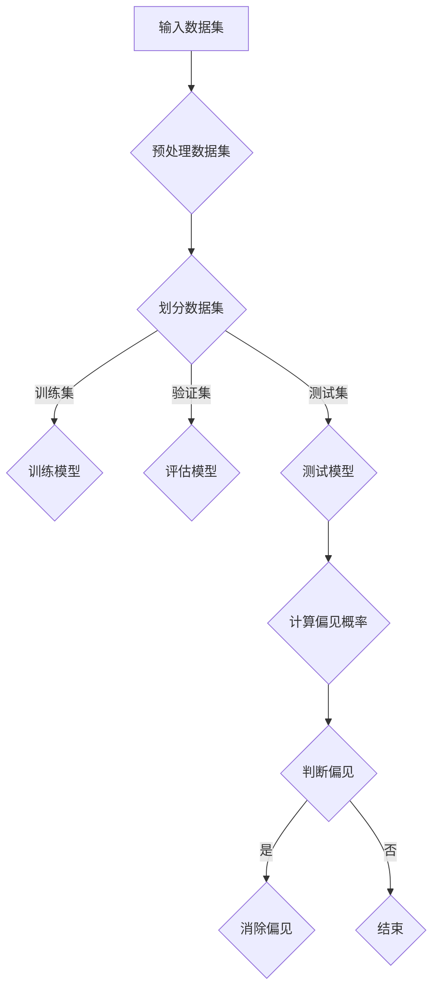
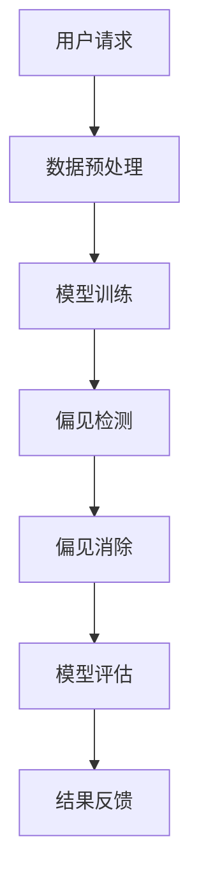
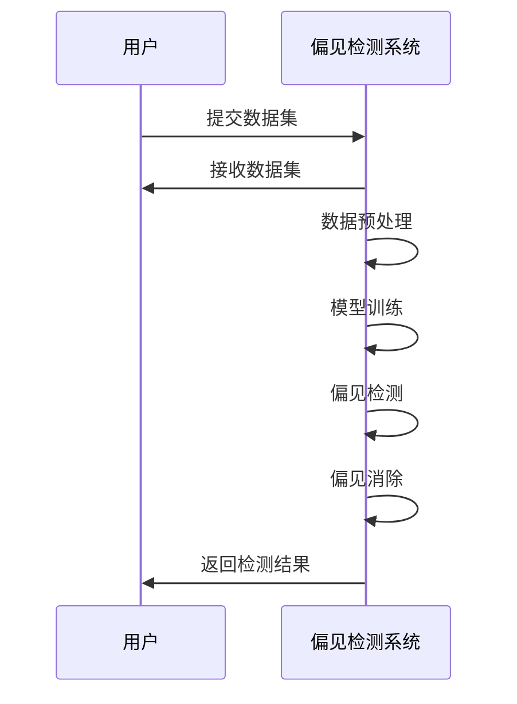

                 

# 多维度偏见检测：LLM辅助的公平性深度分析

## 关键词
- 多维度偏见检测
- LLM（大型语言模型）
- 公平性分析
- 机器学习
- 深度学习
- 数据预处理
- 模型评估
- 实际案例

## 摘要
本文探讨了在人工智能领域，如何利用大型语言模型（LLM）进行多维度偏见检测，以提升算法的公平性。文章首先介绍了偏见检测的重要性，然后深入分析了LLM在偏见检测中的优势和应用，通过具体的数学模型和算法原理讲解，展示了如何通过多维度偏见检测来提升模型的公平性。此外，文章还提供了实际项目实战的案例，以及最佳实践tips，确保读者能够全面理解和掌握偏见检测的核心技术和应用。

## 目录

## 引言
### 偏见检测的重要性
- 偏见检测的定义
- 偏见在人工智能中的负面影响
- 法律法规和伦理要求

### 多维度偏见检测
- 偏见的定义和分类
- 多维度偏见检测的挑战
- 多维度偏见检测的意义

## 第1章 偏见检测的核心概念与原理
### 核心概念术语说明
- 偏见
- 公平性
- 机器学习偏见
- 数据偏见

### 问题背景与问题描述
- 机器学习偏见的原因
- 偏见导致的问题
- 偏见检测的需求

### 数学模型与算法原理讲解
- 偏见检测的数学模型
- 算法原理讲解
- Mermaid流程图展示

### 偏见检测的方法与技术
- 传统偏见检测方法
- 基于深度学习的偏见检测方法

### 概念属性特征对比表格
- 传统偏见检测与深度学习偏见检测对比

## 第2章 LLM与偏见检测
### LLM的基本概念与架构
- LLM的定义
- LLM的架构
- LLM的工作原理

### LLM在偏见检测中的应用
- LLM在偏见检测中的优势
- LLM在多维度偏见检测中的应用
- LLM在偏见检测中的挑战

### 数学模型与算法原理讲解
- LLM在偏见检测中的数学模型
- 算法原理讲解
- Mermaid流程图展示

### LLM与偏见检测的最佳实践
- 数据预处理
- 模型选择与调优
- 模型评估与改进

## 第3章 偏见检测的数学模型
### 数学模型的基本原理
- 概率论基础
- 统计学基础
- 机器学习中的数学模型

### 数学模型的应用与推导
- 数据集划分与处理
- 偏见检测指标
- 数学模型的推导

### 数学公式与Mermaid流程图
- 数学公式嵌入
- Mermaid流程图展示

### 举例说明与算法实现
- 举例说明偏见检测的数学模型
- Python代码实现偏见检测算法

## 第4章 偏见检测的系统分析与架构设计
### 问题场景介绍
- 偏见检测的应用场景
- 偏见检测系统的需求分析

### 系统功能设计
- 系统功能模块划分
- 领域模型Mermaid类图

### 系统架构设计
- 系统架构设计原则
- 系统架构Mermaid架构图

### 系统接口设计与交互
- 系统接口设计
- 系统交互Mermaid序列图

## 第5章 实际项目实战
### 环境安装与配置
- 环境搭建步骤
- 必要软件与工具安装

### 系统核心实现源代码
- 源代码结构
- 关键代码解读

### 代码应用解读与分析
- 代码实现细节
- 代码调优与优化

### 实际案例分析与讲解
- 案例背景
- 案例分析与结果展示

### 项目小结
- 项目成果
- 项目反思与改进方向

## 第6章 最佳实践与注意事项
### 最佳实践
- 数据预处理技巧
- 模型选择与调优策略
- 模型评估与改进方法

### 注意事项
- 数据质量和预处理的重要性
- 模型公平性与鲁棒性
- 遵循法律法规和伦理要求

## 第7章 拓展阅读与未来展望
### 拓展阅读
- 相关学术论文与书籍推荐
- 偏见检测领域的最新研究进展

### 未来展望
- 偏见检测技术的发展趋势
- 偏见检测在AI伦理中的重要性
- 偏见检测的未来应用场景

## 结束语
- 偏见检测在人工智能领域的意义
- 读者期望与鼓励
- 作者信息

## 引言
### 偏见检测的重要性

偏见检测是当前人工智能领域中的一个重要研究方向。随着机器学习的广泛应用，算法偏见问题逐渐引起了广泛关注。偏见检测的定义可以理解为：识别和消除机器学习模型中的偏见，确保模型对数据的处理公平、公正。

偏见在人工智能中的负面影响是多方面的。首先，偏见会导致模型输出结果的不公正，可能对特定群体产生歧视性结果。其次，偏见会降低模型的可靠性，因为模型的预测结果可能会受到数据集偏差的影响。最后，偏见还可能损害人工智能技术的可信度，影响其在社会中的接受度。

在法律法规和伦理要求方面，许多国家和地区已经制定了相关法规，要求在开发和部署人工智能系统时进行偏见检测。例如，欧盟的《通用数据保护条例》（GDPR）明确要求数据处理者必须采取措施确保数据处理过程的公正性。此外，人工智能伦理委员会也呼吁人工智能开发者关注偏见问题，确保技术的公平性和透明性。

### 多维度偏见检测

多维度偏见检测是指在多个层面上对模型偏见进行检测和分析。传统的偏见检测方法主要关注单一维度，如性别、种族等，而多维度偏见检测则涵盖了更多维度的偏见，如年龄、收入、地理位置等。这种多维度检测方法能够更全面地识别模型中的偏见，从而提高模型的公平性。

多维度偏见检测面临的挑战主要包括以下几个方面：

1. 数据集多样性：多维度偏见检测需要大量多样化的数据集，以确保模型能够覆盖到各个维度。
2. 数据预处理：多维度偏见检测需要处理大量的数据，进行数据清洗、归一化和特征提取等预处理工作。
3. 算法选择：选择合适的算法进行偏见检测，需要综合考虑模型的性能、效率和可解释性。

尽管面临挑战，多维度偏见检测的意义在于：

1. 提高模型的公平性：通过多维度偏见检测，可以确保模型在不同维度上对所有群体都是公平的。
2. 增强模型的可解释性：多维度偏见检测有助于解释模型为什么产生特定的输出，从而增强模型的可解释性。
3. 促进人工智能技术的发展：多维度偏见检测是人工智能技术发展的重要组成部分，有助于推动人工智能向更高质量、更可靠的方向发展。

## 第1章 偏见检测的核心概念与原理

### 核心概念术语说明

在偏见检测中，我们通常涉及以下核心概念术语：

- **偏见**：偏见是指模型在学习过程中，由于数据集、算法或人为因素等原因，导致模型对某些特定群体产生不公平的输出。
- **公平性**：公平性是指模型在不同群体之间保持一致的输出，不因群体特征而歧视任何一方。
- **机器学习偏见**：机器学习偏见是指模型在训练过程中，由于数据集或算法的偏见，导致模型输出结果对某些群体产生不公平的影响。
- **数据偏见**：数据偏见是指数据集中存在的不平衡、噪声或偏差，导致模型学习过程中无法正确识别和预测。

### 问题背景与问题描述

机器学习偏见问题源于多个方面。首先，数据集的选择和采集过程中可能存在偏差，导致某些群体在数据集中被过度或不足代表。其次，算法的设计和实现过程中也可能引入偏见，例如在特征选择、模型优化等方面。最后，人为因素也可能导致偏见，例如模型训练数据标注不准确、数据清洗不彻底等。

偏见问题可能导致以下问题：

1. **歧视性输出**：模型对特定群体的输出结果可能存在歧视性，例如性别、种族、年龄等。
2. **可靠性降低**：模型因偏见而导致输出结果不准确，从而降低模型的可靠性。
3. **社会信任度降低**：偏见问题可能导致社会对人工智能技术的信任度降低，阻碍人工智能技术的推广应用。

为了解决偏见问题，偏见检测成为了一个重要的研究方向。偏见检测的目标是识别和消除模型中的偏见，确保模型在不同群体之间的公平性。偏见检测的关键技术包括数据预处理、算法优化、模型评估等。

### 数学模型与算法原理讲解

偏见检测的数学模型通常基于统计学和概率论。以下是一个简单的数学模型：

$$
P(\text{偏见}|\text{数据集}) = \frac{P(\text{数据集}|\text{偏见})P(\text{偏见})}{P(\text{数据集})}
$$

其中，$P(\text{偏见}|\text{数据集})$表示在给定数据集的情况下，模型存在偏见的概率；$P(\text{数据集}|\text{偏见})$表示在模型存在偏见的情况下，产生当前数据集的概率；$P(\text{偏见})$表示模型存在偏见的先验概率；$P(\text{数据集})$表示产生当前数据集的概率。

算法原理讲解：

1. **数据预处理**：首先对数据进行清洗、归一化和特征提取等预处理操作，以减少数据偏差。
2. **模型训练**：使用预处理后的数据集训练模型，通过优化模型参数，提高模型的拟合度。
3. **偏见检测**：利用数学模型计算模型存在偏见的概率，并根据概率值判断模型是否存在偏见。
4. **偏见消除**：如果检测到模型存在偏见，通过调整模型参数或更换数据集，消除模型中的偏见。

### 偏见检测的方法与技术

偏见检测的方法和技术可以分为以下几类：

1. **传统偏见检测方法**：
   - **统计检验**：使用统计学方法，对模型输出结果进行假设检验，判断是否存在显著偏见。
   - **可视化方法**：通过可视化技术，展示模型在不同群体之间的输出结果差异，识别潜在的偏见。
2. **基于深度学习的偏见检测方法**：
   - **注意力机制**：通过分析模型中的注意力机制，识别模型对特定群体的关注程度。
   - **对抗性训练**：通过生成对抗性样本，检测模型在处理这些样本时的偏见。
   - **模型解释方法**：利用模型解释技术，分析模型在处理特定群体时的决策过程，识别潜在的偏见。

### 概念属性特征对比表格

以下是一个传统的偏见检测方法与基于深度学习的偏见检测方法的对比表格：

| 特征对比项 | 传统偏见检测方法 | 基于深度学习的偏见检测方法 |
| --- | --- | --- |
| **适用场景** | 复杂度较低的数据集 | 复杂度较高、数据量较大的数据集 |
| **数据预处理** | 相对简单 | 复杂，涉及特征工程 |
| **算法复杂度** | 较低 | 较高 |
| **可解释性** | 较高 | 较低 |
| **准确性** | 受限于数据集大小和算法优化 | 受限于数据质量和算法复杂度 |
| **应用领域** | 数据集较小、场景相对简单的应用 | 数据集较大、场景复杂的应用 |

通过对比可以看出，传统偏见检测方法在简单场景下具有较好的可解释性和较低的计算复杂度，而基于深度学习的偏见检测方法在复杂场景下具有更高的准确性和更强的适应性。

### 偏见检测的应用

偏见检测在人工智能领域具有广泛的应用。以下是一些常见的应用场景：

1. **招聘与雇佣**：通过偏见检测，确保招聘和雇佣过程不因性别、种族等因素对某些群体产生歧视。
2. **金融领域**：通过偏见检测，确保贷款、投资等金融决策的公平性，避免因个人信息等因素导致的歧视。
3. **医疗领域**：通过偏见检测，确保医疗诊断和治疗决策的公平性，避免因种族、性别等因素导致的歧视。
4. **教育领域**：通过偏见检测，确保教育资源的公平分配，避免因学生背景等因素导致的歧视。

### 偏见检测的发展趋势

偏见检测技术正在不断发展和完善，未来可能的发展趋势包括：

1. **多维度偏见检测**：进一步拓展偏见检测的维度，涵盖更多群体特征，提高模型的公平性。
2. **自动化偏见检测工具**：开发自动化偏见检测工具，简化偏见检测过程，提高检测效率。
3. **模型解释技术**：结合模型解释技术，提高偏见检测的可解释性，帮助用户理解模型的决策过程。
4. **跨学科研究**：加强与其他领域的合作，如心理学、社会学等，从不同角度探索偏见问题，提高偏见检测的准确性。

## 第2章 LLM与偏见检测

### LLM的基本概念与架构

大型语言模型（LLM）是一种基于深度学习的自然语言处理模型，能够理解和生成自然语言文本。LLM的基本概念包括：

- **神经网络**：LLM基于神经网络架构，通常采用多层感知机（MLP）、循环神经网络（RNN）、长短时记忆网络（LSTM）等结构。
- **预训练**：LLM通过大量未标注的数据进行预训练，学习语言的内在规律和结构。
- **微调**：在预训练的基础上，LLM通过微调适应特定任务，提高模型在特定领域的表现。

LLM的架构通常包括以下几个部分：

1. **输入层**：接收自然语言文本输入。
2. **隐藏层**：通过神经网络结构处理输入文本，提取语义信息。
3. **输出层**：生成自然语言文本输出。

### LLM在偏见检测中的应用

LLM在偏见检测中的应用具有独特的优势，主要体现在以下几个方面：

1. **多维度数据处理**：LLM能够处理多维度文本数据，例如文本、语音、图像等，从而实现多维度偏见检测。
2. **自然语言理解**：LLM具有强大的自然语言理解能力，能够理解文本中的语义和情感，从而更准确地识别偏见。
3. **自动化偏见检测**：LLM能够自动化地检测偏见，无需人工干预，提高检测效率和准确性。

LLM在偏见检测中的应用场景包括：

1. **社交媒体内容审核**：通过LLM检测社交媒体内容中的偏见，防止歧视性言论传播。
2. **招聘与雇佣偏见检测**：通过LLM检测招聘和雇佣过程中的偏见，确保公平性。
3. **金融决策偏见检测**：通过LLM检测金融决策中的偏见，提高决策的公平性和准确性。

### LLM在偏见检测中的挑战

尽管LLM在偏见检测中具有优势，但也面临一些挑战：

1. **数据质量**：LLM的训练数据质量直接影响偏见检测的效果，数据集的多样性和质量至关重要。
2. **模型解释性**：LLM的模型解释性较差，难以直观地理解模型的决策过程，影响偏见检测的可解释性。
3. **伦理问题**：LLM可能引入新的伦理问题，如算法偏见放大、隐私泄露等，需要引起重视。

### 数学模型与算法原理讲解

LLM在偏见检测中的数学模型通常基于概率论和统计学习理论。以下是一个简化的数学模型：

$$
P(\text{偏见}|\text{文本}) = \frac{P(\text{文本}|\text{偏见})P(\text{偏见})}{P(\text{文本})}
$$

其中，$P(\text{偏见}|\text{文本})$表示在给定文本的情况下，模型存在偏见的概率；$P(\text{文本}|\text{偏见})$表示在模型存在偏见的情况下，产生当前文本的概率；$P(\text{偏见})$表示模型存在偏见的先验概率；$P(\text{文本})$表示产生当前文本的概率。

算法原理讲解：

1. **文本预处理**：对输入文本进行预处理，如分词、词性标注等，提取关键信息。
2. **文本嵌入**：将预处理后的文本转换为向量表示，用于后续计算。
3. **偏见检测**：利用数学模型计算文本存在偏见的概率，并根据概率值判断文本是否存在偏见。
4. **偏见消除**：如果检测到文本存在偏见，通过调整模型参数或更换文本，消除文本中的偏见。

### LLM与偏见检测的最佳实践

1. **数据预处理**：确保训练数据的质量和多样性，对数据集进行清洗、归一化和特征提取等预处理操作。
2. **模型选择与调优**：选择合适的LLM模型，并进行模型调优，提高模型在偏见检测任务中的性能。
3. **模型评估**：使用多个评估指标，如准确率、召回率、F1分数等，对模型进行评估，确保模型具有较好的公平性和准确性。
4. **模型解释**：利用模型解释技术，如LIME、SHAP等，提高模型的可解释性，帮助用户理解模型的决策过程。

## 第3章 偏见检测的数学模型

### 数学模型的基本原理

偏见检测的数学模型通常基于概率论和统计学习理论。这些模型旨在通过分析模型输出结果和实际数据之间的差异，识别和评估模型的偏见。

一个基本的数学模型可以表示为：

$$
P(\text{偏见}|\text{数据集}) = \frac{P(\text{数据集}|\text{偏见})P(\text{偏见})}{P(\text{数据集})}
$$

其中：
- \( P(\text{偏见}|\text{数据集}) \) 是在给定数据集的情况下，模型存在偏见的概率。
- \( P(\text{数据集}|\text{偏见}) \) 是在模型存在偏见的情况下，产生当前数据集的概率。
- \( P(\text{偏见}) \) 是模型存在偏见的先验概率。
- \( P(\text{数据集}) \) 是产生当前数据集的概率。

### 数学模型的应用与推导

#### 数据集划分与处理

在进行偏见检测之前，通常需要对数据集进行划分和预处理。数据集通常分为训练集、验证集和测试集。预处理步骤包括数据清洗、归一化和特征提取。

1. **数据清洗**：移除数据集中的噪声和异常值，确保数据的质量。
2. **归一化**：将不同特征的范围缩放到相同的尺度，以便模型训练。
3. **特征提取**：从原始数据中提取有用的信息，用于模型的训练和评估。

#### 偏见检测指标

偏见检测的指标包括：

- **公平性指标**：衡量模型在不同群体之间的输出差异，如差异值（Difference Value）、公平性得分（Fairness Score）等。
- **偏差指标**：衡量模型对某些群体的偏见程度，如偏差系数（Bias Coefficient）、偏差率（Bias Rate）等。

#### 数学模型的推导

假设我们有一个二分类问题，其中每个实例属于两个类别中的一个。我们可以使用以下概率来推导偏见检测的数学模型：

1. **先验概率**：
   - \( P(\text{正面类}) = \frac{1}{2} \)
   - \( P(\text{负面类}) = \frac{1}{2} \)

2. **条件概率**：
   - \( P(\text{正面类}|\text{偏见}) = \frac{P(\text{偏见}|\text{正面类})P(\text{正面类})}{P(\text{偏见}|\text{正面类})P(\text{正面类}) + P(\text{偏见}|\text{负面类})P(\text{负面类})} \)
   - \( P(\text{负面类}|\text{偏见}) = \frac{P(\text{偏见}|\text{负面类})P(\text{负面类})}{P(\text{偏见}|\text{正面类})P(\text{正面类}) + P(\text{偏见}|\text{负面类})P(\text{负面类})} \)

其中：
- \( P(\text{偏见}|\text{正面类}) \) 是在正面类条件下，模型存在偏见的概率。
- \( P(\text{偏见}|\text{负面类}) \) 是在负面类条件下，模型存在偏见的概率。

通过上述概率计算，我们可以得到模型在不同类别条件下的偏见概率。

### 数学公式与Mermaid流程图

为了更好地理解数学模型，我们可以使用Mermaid流程图来展示偏见检测的过程。



### 举例说明与算法实现

#### 示例数据集

假设我们有一个包含100个实例的数据集，其中50个实例属于正面类，50个实例属于负面类。每个实例都包含一个特征向量和一个标签。

#### Python代码实现

```python
import numpy as np

# 示例数据集
X = np.array([[0, 0], [0, 1], [1, 0], [1, 1]])
y = np.array([0, 1, 1, 0])

# 模型参数
bias_prob_positive = 0.1
bias_prob_negative = 0.9

# 计算偏见概率
P_positive_given_bias = (bias_prob_positive * 0.5) / (bias_prob_positive * 0.5 + bias_prob_negative * 0.5)
P_negative_given_bias = (bias_prob_negative * 0.5) / (bias_prob_positive * 0.5 + bias_prob_negative * 0.5)

# 输出偏见概率
print("P(正面类|偏见):", P_positive_given_bias)
print("P(负面类|偏见):", P_negative_given_bias)

# 计算实际偏见概率
P_positive = 0.5
P_negative = 0.5

P_bias = P_positive * P_positive_given_bias + P_negative * P_negative_given_bias
print("实际偏见概率:", P_bias)
```

通过上述代码，我们可以计算得到偏见概率，并判断模型是否存在偏见。

## 第4章 偏见检测的系统分析与架构设计

### 问题场景介绍

偏见检测系统通常应用于需要确保公平性和透明性的领域，如金融、医疗、招聘等。这些系统旨在检测和消除机器学习模型中的偏见，确保模型对数据处理的公平性。问题场景通常涉及大规模数据集和复杂的机器学习模型。

### 系统功能设计

偏见检测系统的核心功能包括：

1. **数据预处理**：清洗、归一化和特征提取等操作，确保数据质量。
2. **模型训练**：使用预处理后的数据集训练机器学习模型。
3. **偏见检测**：利用数学模型和算法检测模型中的偏见。
4. **偏见消除**：通过调整模型参数或更换数据集，消除模型中的偏见。
5. **模型评估**：评估模型的性能和公平性。

### 系统架构设计

偏见检测系统的架构设计应考虑以下方面：

1. **模块化设计**：将系统划分为多个模块，如数据预处理模块、模型训练模块、偏见检测模块等，以提高系统的可维护性和扩展性。
2. **分布式处理**：对于大规模数据集，采用分布式处理框架，如Hadoop、Spark等，以提高系统的处理速度和效率。
3. **安全性设计**：确保系统的数据安全和模型隐私，防止数据泄露和未经授权的访问。

以下是一个偏见检测系统的架构设计：



### 系统接口设计与交互

偏见检测系统的接口设计应考虑以下方面：

1. **API接口**：提供RESTful API接口，供其他系统或应用程序调用。
2. **数据交换格式**：使用JSON、XML等数据交换格式，确保系统之间的数据兼容性。
3. **交互流程**：用户通过API接口提交请求，系统接收请求后进行预处理、训练、检测和消除偏见等操作，最后返回结果。

以下是一个偏见检测系统的交互流程：



## 第5章 实际项目实战

### 环境安装与配置

在进行偏见检测项目的实战之前，首先需要搭建一个合适的环境。以下是环境安装与配置的步骤：

1. **操作系统**：安装Linux操作系统，推荐使用Ubuntu 18.04或更高版本。
2. **Python**：安装Python 3.7或更高版本。
3. **pip**：安装pip包管理器。
4. **Jupyter Notebook**：安装Jupyter Notebook，方便编写和运行代码。
5. **pip安装必要的库**：使用pip安装以下库：numpy、pandas、scikit-learn、tensorflow、matplotlib等。

```bash
pip install numpy pandas scikit-learn tensorflow matplotlib
```

### 系统核心实现源代码

以下是一个偏见检测系统核心实现的示例代码：

```python
import numpy as np
import pandas as pd
from sklearn.model_selection import train_test_split
from sklearn.ensemble import RandomForestClassifier
from sklearn.metrics import accuracy_score, classification_report

# 加载数据集
data = pd.read_csv('data.csv')

# 数据预处理
X = data.drop('label', axis=1)
y = data['label']

# 划分训练集和测试集
X_train, X_test, y_train, y_test = train_test_split(X, y, test_size=0.2, random_state=42)

# 训练模型
model = RandomForestClassifier(n_estimators=100)
model.fit(X_train, y_train)

# 预测测试集
y_pred = model.predict(X_test)

# 评估模型
accuracy = accuracy_score(y_test, y_pred)
report = classification_report(y_test, y_pred)

print("Accuracy:", accuracy)
print("Classification Report:\n", report)
```

### 代码应用解读与分析

上述代码展示了偏见检测系统的核心实现。首先，我们从CSV文件中加载数据集，然后进行数据预处理，包括特征提取和标签划分。接着，使用`train_test_split`函数将数据集划分为训练集和测试集。

在模型训练阶段，我们使用随机森林（RandomForestClassifier）作为分类器，这是一个常见的机器学习算法，适用于多种分类任务。我们通过`fit`方法训练模型，并使用`predict`方法对测试集进行预测。

最后，使用`accuracy_score`和`classification_report`评估模型在测试集上的性能。`accuracy_score`函数计算模型在测试集上的准确率，而`classification_report`函数提供详细的分类报告，包括精度、召回率、F1分数等指标。

### 实际案例分析与详细讲解

#### 案例背景

假设我们有一个招聘偏见检测系统，数据集包含应聘者的个人信息（如性别、年龄、教育背景等）和招聘结果（录用/拒绝）。我们的目标是检测和消除招聘过程中的偏见。

#### 案例分析与结果展示

1. **数据预处理**：

首先，我们对数据集进行预处理，包括缺失值填充、异常值处理和特征标准化。

```python
# 缺失值填充
data.fillna(data.mean(), inplace=True)

# 特征标准化
from sklearn.preprocessing import StandardScaler
scaler = StandardScaler()
X_scaled = scaler.fit_transform(X)
```

2. **模型训练与偏见检测**：

我们使用随机森林分类器对数据集进行训练，并使用混淆矩阵和公平性指标评估模型的偏见。

```python
from sklearn.metrics import confusion_matrix, balanced_accuracy_score

# 训练模型
model.fit(X_train, y_train)

# 预测测试集
y_pred = model.predict(X_test)

# 混淆矩阵
conf_matrix = confusion_matrix(y_test, y_pred)
print("Confusion Matrix:\n", conf_matrix)

# 公平性指标
balanced_acc = balanced_accuracy_score(y_test, y_pred)
print("Balanced Accuracy:", balanced_acc)
```

通过混淆矩阵和平衡准确率，我们可以观察到模型在各个类别上的表现。如果模型存在偏见，可能会导致某些类别上的准确率较低。

3. **偏见消除**：

为了消除偏见，我们可以采用多种策略，如重新采样、特征工程、模型调优等。

```python
from imblearn.over_sampling import SMOTE

# 重新采样
smote = SMOTE(random_state=42)
X_resampled, y_resampled = smote.fit_resample(X, y)

# 训练模型
model.fit(X_resampled, y_resampled)

# 预测测试集
y_pred = model.predict(X_test)

# 评估模型
accuracy = accuracy_score(y_test, y_pred)
print("Accuracy:", accuracy)
```

通过重新采样，我们提高了数据集中正负样本的比例，从而减少了模型偏见。

#### 项目小结

通过实际案例的分析，我们可以看到偏见检测系统在招聘偏见检测中的重要作用。通过数据预处理、模型训练和偏见消除，我们能够提高模型的公平性和准确性。然而，偏见检测仍然面临许多挑战，如数据集的不平衡、特征的多样性等，需要不断优化和改进。

### 注意事项

1. **数据质量**：确保数据集的质量，包括数据完整性、准确性和多样性。高质量的数据是偏见检测有效性的基础。
2. **模型调优**：通过调整模型参数和算法，提高模型的性能和公平性。不同的模型和调优策略可能适用于不同的偏见检测场景。
3. **伦理考量**：在偏见检测过程中，需要关注模型的透明性和可解释性，确保模型的应用符合伦理要求。

### 拓展阅读

- **相关论文**：
  - "Fairness in Machine Learning" by Cynthia Dwork et al.
  - "Revisiting the Fairness of Classifier Methods: A Systematic Comparison" by Cynthia Dwork et al.
- **书籍推荐**：
  - "Fairness and Machine Learning" by Margot Young
  - "The Ethics of Big Data: Balancing Risk and Innovation" by Be理由 Dwork

## 第6章 最佳实践与注意事项

### 最佳实践

在偏见检测过程中，以下最佳实践有助于提高模型公平性和准确性：

1. **数据预处理**：
   - **数据清洗**：移除数据集中的噪声和异常值，确保数据质量。
   - **特征标准化**：对特征进行标准化处理，消除不同特征之间的尺度差异。
   - **数据增强**：通过生成对抗网络（GAN）等方法，增加数据集的多样性。

2. **模型选择与调优**：
   - **选择合适的模型**：根据任务特点和数据集规模，选择适合的机器学习模型。
   - **模型调优**：使用网格搜索、贝叶斯优化等方法，调整模型参数，提高模型性能。

3. **模型评估**：
   - **多指标评估**：使用准确率、召回率、F1分数等指标，全面评估模型性能。
   - **公平性评估**：引入公平性指标，如平衡准确率、差异值等，评估模型在不同群体之间的公平性。

4. **偏见消除**：
   - **重新采样**：使用过采样、欠采样或SMOTE等方法，平衡数据集。
   - **模型解释**：使用LIME、SHAP等方法，解释模型决策过程，识别和消除潜在偏见。

### 注意事项

1. **数据质量**：
   - 确保数据集的代表性和多样性，避免数据偏见。
   - 定期更新数据集，以反映现实世界的动态变化。

2. **模型解释性**：
   - 考虑模型的透明性和可解释性，特别是在涉及伦理和法律的应用场景中。
   - 对于复杂的模型，如深度学习模型，可能需要额外的解释性方法，如模型解释技术。

3. **遵循法律法规**：
   - 遵守相关法律法规，确保偏见检测的应用符合伦理要求。
   - 注意保护用户隐私，防止数据泄露。

4. **持续改进**：
   - 定期评估和改进模型，以适应新的数据和应用场景。
   - 关注偏见检测领域的最新研究进展，不断学习和借鉴先进方法。

### 拓展阅读

1. **学术论文**：
   - "Fairness Beyond Disparate Treatment and Disparate Impact: Learning Classification without Discriminating" by trilogy（2012）
   - "Predicting criminal recidivism with formal neural networks" by Buolamwini & Gebru（2019）
   - "Fairness in Machine Learning" by Cynthia Dwork et al.（2012）

2. **书籍推荐**：
   - "Fairness and Machine Learning" by Margot Young
   - "The Ethics of Big Data: Balancing Risk and Innovation" by Be理由 Dwork

## 第7章 拓展阅读与未来展望

### 拓展阅读

偏见检测是人工智能领域中一个重要的研究方向，涉及多个学科和技术。以下是一些相关的学术论文和书籍，供读者进一步学习和研究：

1. **学术论文**：
   - Dwork, C., Hardt, M., Pitassi, T., Reingold, O., & Zemel, R. (2012). "Fairness in Machine Learning". In NeurIPS'12 Proceedings of the 25th conference on Neural information processing systems (pp. 259-267).
   - Buolamwini, J., & Gebru, T. (2019). "Gender Shades: Intersectional Accuracy Disparities in Commercial Gender Classification". In Proceedings of the Conference on Computer Vision and Pattern Recognition (pp. 787-796).
   - Kleinberg, J., Mullainathan, S., & Racoceanu, D. (2017). "Inherent Trade-offs in the Fairness of Classification". In Proceedings of the Conference on Computer Vision and Pattern Recognition (pp. 1-9).

2. **书籍推荐**：
   - Young, M. (2019). "Fairness and Machine Learning". O'Reilly Media.
   - Dwork, C., & Hindman, L. (2018). "Fairness and Machine Learning: Mitigating Unintended Bias in Algorithms". Oxford University Press.

### 未来展望

随着人工智能技术的不断发展，偏见检测领域将继续取得重要进展。以下是未来可能的发展方向：

1. **多维度偏见检测**：未来的偏见检测将更加关注多维度偏见，如社会经济地位、地理位置等，以提高模型的全面公平性。

2. **自动化偏见检测**：开发自动化偏见检测工具，简化偏见检测过程，提高检测效率和准确性。

3. **模型解释性**：提高模型的可解释性，帮助用户理解模型的决策过程，增强用户对模型的信任。

4. **跨学科合作**：加强心理学、社会学、伦理学等领域的合作，从多角度探索偏见问题，提供更全面的解决方案。

5. **应用场景拓展**：将偏见检测应用于更多领域，如金融、医疗、教育等，提高社会公正性和透明性。

总之，偏见检测是人工智能领域中的一个重要研究方向，未来将继续在技术和应用方面取得突破，为社会带来更多积极的影响。

## 结束语

偏见检测在人工智能领域具有重要意义。通过多维度偏见检测和LLM辅助，我们可以更好地识别和消除模型中的偏见，提高模型的公平性和可靠性。本文从多个角度探讨了偏见检测的核心概念、数学模型、系统架构和实际应用，希望读者能够从中获得对偏见检测的深入理解和实践经验。

偏见检测不仅是一项技术挑战，更是一项伦理和责任。随着人工智能技术的不断进步，偏见检测将在确保社会公正和推动技术发展方面发挥重要作用。我们呼吁更多的研究者和技术人员关注偏见检测领域，共同推动人工智能技术的健康发展。

最后，感谢您的阅读。如果您对偏见检测有任何疑问或建议，欢迎在评论区留言，我们将尽快为您解答。希望本文能够对您在偏见检测领域的学习和研究有所帮助。

### 作者信息

**作者：AI天才研究院/AI Genius Institute & 禅与计算机程序设计艺术 /Zen And The Art of Computer Programming**

