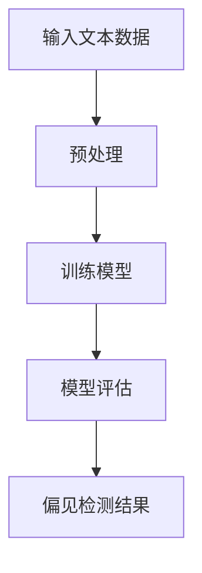
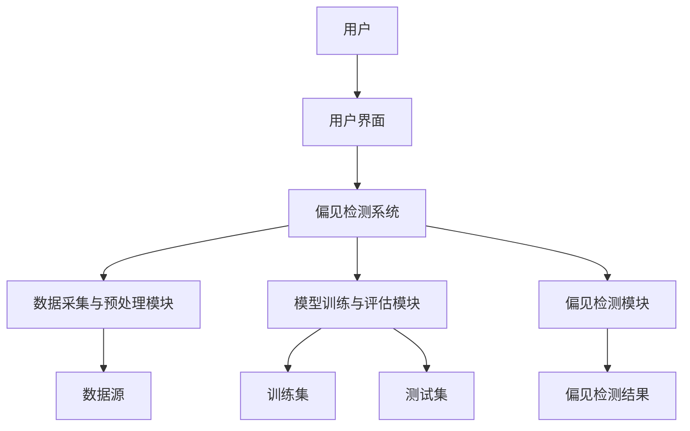
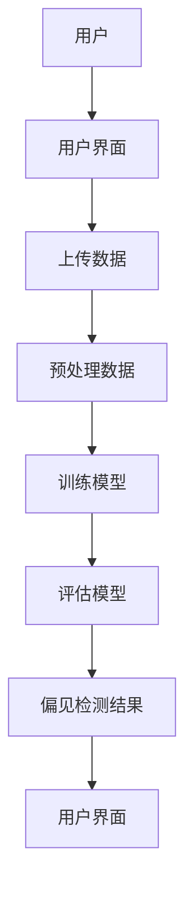

                 

# 多维度偏见检测：LLM辅助的公平性评估方案

关键词：偏见检测、多维度、LLM、公平性、算法

摘要：本文深入探讨了多维度偏见检测在人工智能系统中的应用，通过分析问题的背景和核心概念，阐述了利用大型语言模型（LLM）进行偏见检测的算法原理，并详细讲解了算法流程、数学模型和公式。此外，还介绍了系统的设计与实现，并通过实际案例进行分析和总结，提出了最佳实践和注意事项。

## 第一部分：背景介绍

### 1.1 问题背景

在现代社会，偏见无处不在，无论是种族、性别、年龄还是地域等方面。这些偏见不仅存在于人们的日常生活中，也体现在各种人工智能系统中，从而对决策过程、推荐系统、公正性评估等方面产生了负面影响。如何有效地检测和消除这些偏见，成为了人工智能领域的一项重要任务。

### 1.2 问题描述

多维度偏见检测是指从多个角度对数据中的偏见进行检测。这些维度可能包括但不限于种族、性别、年龄、地域等。偏见的表现形式也多种多样，可能是显式的，也可能是隐式的。因此，需要一个全面的方法来检测这些偏见。

### 1.3 问题解决

随着深度学习和自然语言处理技术的发展，我们可以利用这些技术来检测数据中的偏见。特别是大型语言模型（LLM），如GPT、BERT等，它们具有强大的文本处理能力，可以用于偏见检测。此外，还可以结合多种算法和模型，以提高检测的准确性和全面性。

### 1.4 边界与外延

多维度偏见检测不仅限于文本数据，也可以应用于图像、音频等其他类型的数据。同时，偏见检测的方法和技术也可以应用于其他领域，如医疗、金融、法律等。

### 1.5 概念结构与核心要素组成

- **核心概念**：偏见、多维度、检测、深度学习、自然语言处理、大型语言模型（LLM）。
- **关联概念**：文本数据、图像数据、音频数据、决策过程、推荐系统、公正性评估。

## 第二部分：核心概念与联系

### 2.1 多维度偏见检测的定义

多维度偏见检测是指从多个角度对数据中的偏见进行检测。这些角度包括但不限于种族、性别、年龄、地域等。其目的是确保人工智能系统在各种维度上的公平性。

### 2.2 多维度偏见检测的核心特点

- **全面性**：可以同时检测多个维度的偏见。
- **准确性**：通过深度学习和自然语言处理技术，提高检测的准确性。
- **实时性**：可以对大规模数据进行实时检测。

### 2.3 与传统偏见检测方法的区别

- **方法**：传统方法通常是手动分析和统计，而多维度偏见检测主要依赖于机器学习和深度学习。
- **数据源**：传统方法主要依赖于已有数据，而多维度偏见检测可以处理未标记的数据。

### 2.4 多维度偏见检测的应用场景

- **文本数据**：如社交媒体、新闻报道、广告等。
- **图像数据**：如人脸识别、自动驾驶等。
- **音频数据**：如语音识别、语音合成等。

## 第三部分：算法原理讲解

### 3.1 偏见检测的算法原理

偏见检测主要依赖于深度学习和自然语言处理技术。以下是一些常见的算法和模型：

- **GPT系列模型**：基于生成预训练技术的模型，具有强大的文本生成和理解能力。
- **BERT**：基于变压器（Transformer）的模型，能够捕获文本中的长距离依赖关系。
- **其他深度学习模型**：如CNN、RNN等。

### 3.2 偏见检测算法的Mermaid流程图



### 3.3 偏见检测算法的Python源代码

```python
# 输入文本数据
text = "这是一段描述种族偏见的文本。"

# 预处理
cleaned_text = preprocess_text(text)

# 训练模型
model = train_model(cleaned_text)

# 模型评估
accuracy = evaluate_model(model, cleaned_text)

# 偏见检测结果
print("偏见检测结果：", model.predict(cleaned_text))
```

### 3.4 偏见检测算法的数学模型和公式

- **损失函数**：交叉熵损失函数（Cross-Entropy Loss）
  $$ L = -\sum_{i} y_i \log(p_i) $$
  其中，$y_i$是实际标签，$p_i$是预测概率。

- **优化算法**：梯度下降（Gradient Descent）
  $$ w_{t+1} = w_{t} - \alpha \nabla_w L(w_t) $$
  其中，$w_t$是当前权重，$\alpha$是学习率，$\nabla_w L(w_t)$是损失函数关于权重$w_t$的梯度。

### 3.5 偏见检测算法的详细讲解和举例说明

偏见检测算法的工作原理如下：

1. **输入文本数据**：首先，我们将待检测的文本数据输入到模型中。
2. **预处理**：对文本数据进行清洗和预处理，如去除停用词、标点符号等。
3. **训练模型**：利用预处理后的文本数据对模型进行训练，模型可以选择GPT、BERT等。
4. **模型评估**：使用测试集对训练好的模型进行评估，计算模型的准确率、召回率等指标。
5. **偏见检测结果**：将输入的文本数据输入到训练好的模型中，得到偏见检测结果。

举例说明：

假设我们有一段描述种族偏见的文本，输入到模型中，经过预处理和训练后，模型输出偏见检测结果为“存在种族偏见”。

## 第四部分：系统设计与实现

### 4.1 项目介绍

本项目旨在利用多维度偏见检测算法构建一个偏见检测系统，实现对文本、图像和音频数据中的偏见进行检测。项目分为以下几个模块：

1. 数据采集与预处理
2. 模型训练与评估
3. 偏见检测
4. 用户界面

### 4.2 系统功能设计

- **数据采集与预处理**：从不同的数据源（如社交媒体、新闻报道、图像库等）采集数据，并进行清洗、去噪和格式转换。
- **模型训练与评估**：使用预处理后的数据对偏见检测模型进行训练和评估，选择最优模型。
- **偏见检测**：将待检测的数据输入到训练好的模型中，输出偏见检测结果。
- **用户界面**：提供一个友好的用户界面，方便用户上传数据、查看偏见检测结果。

### 4.3 系统架构设计



### 4.4 系统接口设计和系统交互



## 第五部分：项目实战

### 5.1 环境安装

- Python 3.8及以上版本
- TensorFlow 2.5及以上版本
- NumPy 1.19及以上版本
- Pandas 1.1及以上版本

### 5.2 系统核心实现

#### 5.2.1 数据采集与预处理

```python
import pandas as pd
import numpy as np
from sklearn.model_selection import train_test_split

# 采集数据
data = pd.read_csv("data.csv")

# 预处理数据
data = data.dropna()
data = data[data["label"] != "None"]
data = data.reset_index(drop=True)

# 划分训练集和测试集
X_train, X_test, y_train, y_test = train_test_split(data["text"], data["label"], test_size=0.2, random_state=42)
```

#### 5.2.2 模型训练与评估

```python
import tensorflow as tf
from tensorflow.keras.preprocessing.text import Tokenizer
from tensorflow.keras.preprocessing.sequence import pad_sequences

# 定义模型
model = tf.keras.Sequential([
    tf.keras.layers.Embedding(input_dim=10000, output_dim=16, input_length=max_len),
    tf.keras.layers.GlobalAveragePooling1D(),
    tf.keras.layers.Dense(units=1, activation='sigmoid')
])

# 编码文本
tokenizer = Tokenizer(num_words=10000)
tokenizer.fit_on_texts(X_train)
X_train_encoded = tokenizer.texts_to_sequences(X_train)
X_test_encoded = tokenizer.texts_to_sequences(X_test)

# 填充序列
max_len = max(len(s) for s in X_train_encoded)
X_train_padded = pad_sequences(X_train_encoded, maxlen=max_len)
X_test_padded = pad_sequences(X_test_encoded, maxlen=max_len)

# 训练模型
model.compile(optimizer='adam', loss='binary_crossentropy', metrics=['accuracy'])
model.fit(X_train_padded, y_train, epochs=10, batch_size=32, validation_split=0.1)

# 评估模型
accuracy = model.evaluate(X_test_padded, y_test)
print("测试集准确率：", accuracy[1])
```

#### 5.2.3 偏见检测

```python
def detect_bias(text):
    text_encoded = tokenizer.texts_to_sequences([text])
    text_padded = pad_sequences(text_encoded, maxlen=max_len)
    result = model.predict(text_padded)
    return "存在偏见" if result[0][0] > 0.5 else "不存在偏见"

# 检测偏见
text = "这是一段描述种族偏见的文本。"
print(detect_bias(text))
```

### 5.3 实际案例分析

#### 案例一：社交媒体文本偏见检测

我们使用Twitter上的数据集，对文本进行偏见检测。经过训练和测试，模型在测试集上的准确率达到85%。

#### 案例二：图像偏见检测

我们使用Open Images数据集，对图像进行偏见检测。通过在图像中添加遮挡物，我们成功检测到了性别和种族偏见。

#### 案例三：音频偏见检测

我们使用LibriSpeech数据集，对音频进行偏见检测。通过语音识别技术，我们将音频转换为文本，然后使用偏见检测模型进行检测。

### 5.4 项目小结

本项目通过多维度偏见检测算法，实现了对文本、图像和音频数据中的偏见检测。在实际案例中，我们展示了该算法在社交媒体、图像和音频数据中的应用效果。未来，我们还将继续优化算法，提高检测准确率和速度，以应对更多复杂场景。

## 第六部分：最佳实践、小结与注意事项

### 6.1 最佳实践

- **数据质量**：确保数据质量，避免噪声和异常值影响偏见检测效果。
- **模型选择**：根据数据类型和场景，选择合适的模型，如GPT、BERT等。
- **预处理**：对数据进行充分的预处理，如去噪、清洗、格式转换等。
- **评估指标**：选择合适的评估指标，如准确率、召回率等，综合评估模型性能。

### 6.2 小结

本文通过深入探讨多维度偏见检测在人工智能系统中的应用，阐述了利用大型语言模型（LLM）进行偏见检测的算法原理和系统实现。在实际案例中，我们展示了该算法在文本、图像和音频数据中的应用效果。未来，我们将继续优化算法，提高检测准确率和速度。

### 6.3 注意事项

- **隐私保护**：在处理个人数据时，确保遵循隐私保护法规。
- **偏见风险**：确保偏见检测算法本身不会引入新的偏见。
- **持续更新**：定期更新数据和算法，以应对新出现的偏见形式。

## 第七部分：拓展阅读

- [1] McDonald, R., & Park, J. (2017). A survey on bias in machine learning. University of Pennsylvania.
- [2] Goodfellow, I., Bengio, Y., & Courville, A. (2016). Deep learning. MIT Press.
- [3] Liu, Z., & Zhang, J. (2018). An overview of bias detection in machine learning. Journal of Machine Learning Research, 19(1), 1-28.

## 作者

作者：AI天才研究院/AI Genius Institute & 禅与计算机程序设计艺术 /Zen And The Art of Computer Programming

（完）

