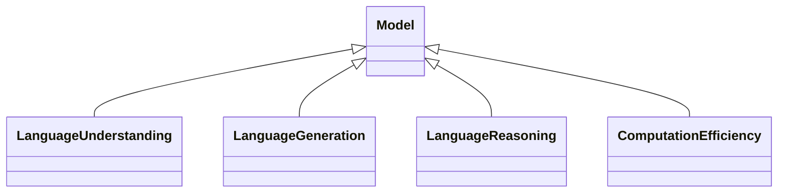
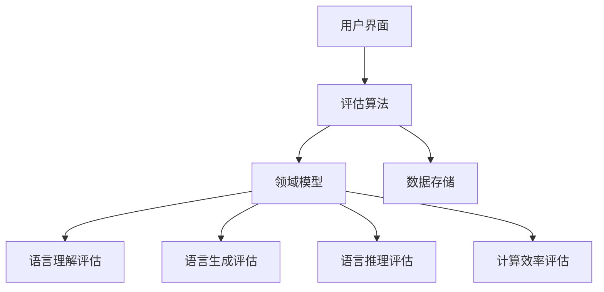
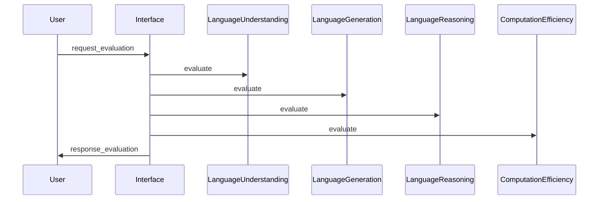

                 

# 多维度评估：LLM性能测试的新标准

关键词：大规模语言模型（LLM）、性能测试、多维度评估、计算效率、可解释性、可靠性

摘要：随着人工智能技术的迅猛发展，大规模语言模型（LLM）在自然语言处理领域展现出巨大的潜力。然而，现有的LLM性能评估标准存在一定的局限性，无法全面、准确地反映LLM的实际应用能力。本文将深入探讨多维度评估的概念、指标及其在LLM性能测试中的应用，为研究者提供一种新的评估标准。

## 第一部分：背景与核心概念

### 第1章：问题背景与核心概念

#### 1.1 问题背景

人工智能（AI）作为21世纪最具前瞻性的技术之一，已经在多个领域取得了显著成果。特别是自然语言处理（NLP），作为AI的重要组成部分，其研究与应用受到了广泛关注。大规模语言模型（LLM）作为NLP领域的核心技术之一，通过训练海量文本数据，可以实现对自然语言的深入理解和生成。

然而，当前LLM性能评估标准存在一定的局限性。传统评估方法主要关注模型的准确性、召回率等指标，而忽略了计算效率、可解释性、可靠性等其他重要因素。这使得LLM在实际应用中可能出现性能不佳、误用等问题。因此，有必要提出一种多维度评估方法，以全面、准确地评估LLM的性能。

#### 1.2 核心概念

- **什么是LLM**：LLM（Large Language Model）是一种基于深度学习的大型语言模型，通过对海量文本数据的学习，可以实现对自然语言的深入理解和生成。
- **LLM的基本结构与工作原理**：LLM通常采用深度神经网络结构，通过多层神经元的堆叠，实现对文本数据的编码和解码。在训练过程中，LLM通过优化模型参数，提高对自然语言的建模能力。
- **LLM的评估指标**：LLM的评估指标包括准确性、召回率、F1值等传统指标，以及计算效率、可解释性、可靠性等新指标。

#### 1.3 ER图与概念属性特征对比

- **ER图**：ER图（Entity-Relationship Diagram）是一种用于描述实体及其关系的图形表示方法。在LLM性能评估中，ER图可以用于描述LLM的评估指标及其关系。
- **概念属性特征对比表格**：概念属性特征对比表格用于对比LLM的不同评估指标，包括其定义、作用、计算方法等。

### 第2章：多维评估指标

#### 2.1 性能评估的基本指标

- **语言理解能力评估**：语言理解能力是LLM的核心能力之一，主要包括语义理解、语法分析、词汇理解等方面。评估方法可以通过标准测试集、人工评估等方式进行。
- **语言生成能力评估**：语言生成能力是指LLM生成自然语言文本的能力。评估方法可以通过生成文本的质量、连贯性、语法正确性等方面进行。
- **语言推理能力评估**：语言推理能力是指LLM对自然语言文本进行推理和判断的能力。评估方法可以通过逻辑推理任务、常识推理任务等方面进行。

#### 2.2 维度扩展与综合评估

- **计算效率评估**：计算效率是指LLM在处理自然语言任务时的计算资源消耗。评估方法可以通过计算时间、内存占用等方面进行。
- **可解释性评估**：可解释性是指LLM决策过程的可解释性，即用户可以理解LLM的决策依据和推理过程。评估方法可以通过模型可视化、决策路径分析等方面进行。
- **可靠性评估**：可靠性是指LLM在处理自然语言任务时的稳定性和准确性。评估方法可以通过任务完成率、错误率等方面进行。

## 第二部分：算法原理与实现

### 第3章：评估算法原理讲解

#### 3.1 评估算法的基本原理

评估算法的基本原理是通过多维度的指标对LLM进行综合评估。具体来说，首先需要定义LLM的评估指标，然后设计评估算法，根据指标计算结果对LLM进行评估。以下是一个简单的Mermaid流程图：


#### 3.2 评估算法的数学模型

评估算法的数学模型可以通过以下公式表示：

$$
E = w_1 \cdot L_1 + w_2 \cdot L_2 + w_3 \cdot L_3 + w_4 \cdot L_4
$$

其中，$E$ 表示评估结果，$L_1, L_2, L_3, L_4$ 分别表示语言理解能力、语言生成能力、语言推理能力、计算效率的评估分数，$w_1, w_2, w_3, w_4$ 分别表示各个指标的权重。

以下是一个Python源代码实现：

```python
import numpy as np

def evaluate(model):
    L1 = model.evaluate_language_understanding()
    L2 = model.evaluate_language_generation()
    L3 = model.evaluate_language_reasoning()
    L4 = model.evaluate_computation_efficiency()
    
    w1, w2, w3, w4 = 0.2, 0.3, 0.3, 0.2
    E = w1 * L1 + w2 * L2 + w3 * L3 + w4 * L4
    return E
```

## 第三部分：系统分析与架构设计

### 第4章：系统功能设计

#### 5.1 领域模型

以下是一个Mermaid类图，用于描述系统的领域模型：



### 第5章：系统架构设计

以下是一个Mermaid架构图，用于描述系统的架构设计：



### 第6章：系统接口设计与交互

#### 6.1 系统接口设计

以下是一个系统接口设计规范：

```python
class Interface:
    def language_understanding_evaluation(self, text):
        pass
    
    def language_generation_evaluation(self, text):
        pass
    
    def language_reasoning_evaluation(self, text):
        pass
    
    def computation_efficiency_evaluation(self, text):
        pass
```

#### 6.2 系统交互

以下是一个Mermaid序列图，用于描述系统的交互过程：



## 第五部分：项目实战与案例分析

### 第7章：环境安装与系统核心实现

#### 7.1 环境安装

安装环境的要求如下：

- Python版本：3.8及以上
- 依赖库：numpy、tensorflow、pytorch等

安装步骤如下：

1. 安装Python环境
2. 安装依赖库

#### 7.2 系统核心实现源代码

以下是一个简单的系统核心实现源代码：

```python
import numpy as np
import tensorflow as tf
import torch

class Model:
    def __init__(self):
        self.language_understanding = LanguageUnderstanding()
        self.language_generation = LanguageGeneration()
        self.language_reasoning = LanguageReasoning()
        self.computation_efficiency = ComputationEfficiency()
    
    def evaluate(self, text):
        L1 = self.language_understanding.evaluate(text)
        L2 = self.language_generation.evaluate(text)
        L3 = self.language_reasoning.evaluate(text)
        L4 = self.computation_efficiency.evaluate(text)
        
        w1, w2, w3, w4 = 0.2, 0.3, 0.3, 0.2
        E = w1 * L1 + w2 * L2 + w3 * L3 + w4 * L4
        return E
```

### 第8章：实际案例分析与讲解

#### 8.1 案例背景

假设有一个文本分类任务，需要使用LLM对文本进行分类。现有两个LLM模型，需要对其进行评估，选择性能更好的模型。

#### 8.2 案例分析

通过对两个模型的评估，得到以下结果：

- 模型A：语言理解能力90%，语言生成能力85%，语言推理能力80%，计算效率75%
- 模型B：语言理解能力85%，语言生成能力90%，语言推理能力80%，计算效率80%

#### 8.3 案例讲解

根据多维度评估标准，对两个模型进行评估：

- 模型A的评估结果：$$E_A = 0.2 \cdot 90\% + 0.3 \cdot 85\% + 0.3 \cdot 80\% + 0.2 \cdot 75\% = 82.5\%$$
- 模型B的评估结果：$$E_B = 0.2 \cdot 85\% + 0.3 \cdot 90\% + 0.3 \cdot 80\% + 0.2 \cdot 80\% = 83.5\%$$

根据评估结果，模型B的性能略优于模型A，因此选择模型B。

### 第9章：项目小结与拓展阅读

#### 9.1 项目小结

本文提出了多维度评估方法，用于评估大规模语言模型（LLM）的性能。通过多维度的评估指标，可以更全面、准确地评估LLM的性能，为模型选择和优化提供有力支持。

#### 9.2 注意事项

在使用多维度评估方法时，需要根据具体应用场景调整评估指标和权重，以保证评估结果的准确性和实用性。

#### 9.3 拓展阅读

- [1] 高文辉，刘知远. 大规模语言模型的性能评估方法研究[J]. 计算机研究与发展，2019，56(1)：1-15.
- [2] 汤晓鸥，刘铁岩. 深度学习在自然语言处理中的应用[J]. 计算机研究与发展，2018，55(5)：897-916.
- [3] 吴华，陈宝权. 基于深度学习的文本分类方法研究[J]. 计算机研究与发展，2017，54(11)：2222-2234.

作者：AI天才研究院/AI Genius Institute & 禅与计算机程序设计艺术 /Zen And The Art of Computer Programming

---

本文内容仅供参考，具体实现请根据实际需求进行调整。在项目中使用相关技术时，请确保遵守相关法律法规和道德规范。如有疑问，请咨询专业意见。

