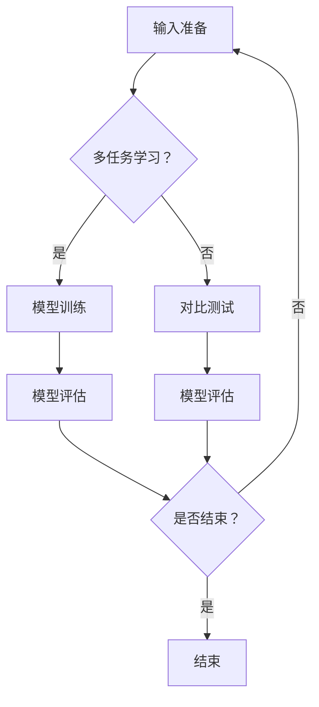
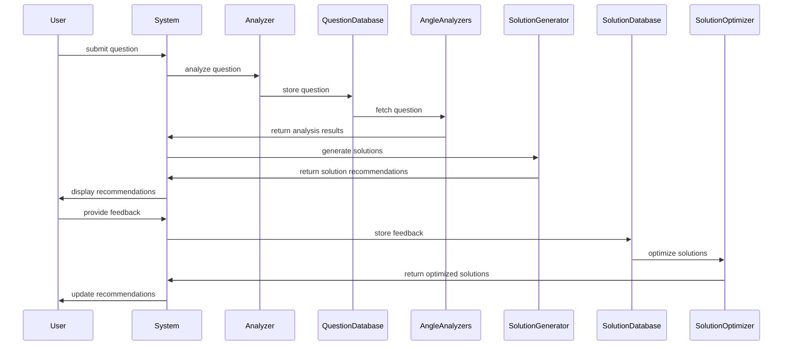

                 

## 《多角度思考：测试LLM考虑不同观点的能力》

### 关键词：大型语言模型，多角度思考，算法测试，系统设计，项目实战

#### 摘要：
本文旨在探讨如何通过多角度思考来测试大型语言模型（LLM）考虑不同观点的能力。我们将首先介绍多角度思考的定义和重要性，随后详细阐述LLM和测试其多角度思考能力的相关背景。文章将深入讲解多角度思考的核心概念及其相互关系，并介绍用于测试LLM多角度思考能力的常用算法。随后，我们将设计一个用于测试LLM多角度思考能力的系统，包括系统功能设计、架构设计和接口设计。文章还将通过一个实际测试案例，展示如何实现和评估LLM的多角度思考能力。最后，我们将提供最佳实践、小结和拓展阅读资源，帮助读者进一步深入理解这一重要课题。

---

## 第一部分：引言

### 1.1 问题背景

在当今高度信息化的社会中，语言模型（Language Model，简称LM）已经成为自然语言处理（Natural Language Processing，简称NLP）领域的关键技术。大型语言模型（Large Language Model，简称LLM），如GPT、BERT等，因其强大的文本生成和理解能力，在众多应用场景中得到了广泛应用。然而，LLM也存在一些局限性，尤其是在处理多角度问题时，其表现并不总是令人满意。

多角度思考是指从不同的视角、层面或方向来分析和解决问题的思维方式。它能够帮助人们全面、深入地理解问题，避免因单一视角导致的片面性和偏见。在复杂的问题解决过程中，多角度思考尤为重要。然而，如何测试和评估LLM在多角度思考上的能力，仍是一个有待深入探讨的问题。

本文将围绕这一主题，首先介绍多角度思考的定义和重要性，然后详细阐述LLM和测试其多角度思考能力的相关背景。我们希望通过本文的探讨，能够为LLM在多角度思考能力测试方面提供一些有价值的参考和启示。

### 1.2 多角度思考的必要性

多角度思考在问题解决和决策过程中具有重要意义。首先，从心理学的角度来看，人类大脑具有天然的多维度处理能力。通过多角度思考，我们能够调动不同的大脑区域，综合利用各种认知资源，从而更加全面地理解和解决问题。此外，多角度思考有助于避免思维的单一化和僵化，激发创新思维，提高问题解决的质量和效率。

在现实世界中，许多问题都是多维度、多层次的，单一角度的思考往往难以得出全面和准确的结论。例如，在商业决策中，企业需要从市场、财务、人力资源等多个角度来评估一个项目的可行性和风险；在医疗诊断中，医生需要结合病史、临床表现、影像学检查等多种信息来做出诊断。因此，培养多角度思考的能力，不仅有助于个人在复杂问题中找到最优解，也有助于提升整个组织的决策水平。

### 1.3 LLM与多角度思考

大型语言模型（LLM）如GPT和BERT等，以其强大的文本生成和理解能力，在自然语言处理领域取得了显著的成果。然而，这些模型在处理多角度问题时的表现却不尽如人意。首先，LLM的训练数据大多来自互联网上的文本，这些文本往往具有片面性和偏见。因此，在生成文本时，LLM可能会受到训练数据的影响，导致其输出结果也具有类似的偏见。

其次，LLM的设计和优化主要针对文本生成和理解能力，而未充分考虑多角度思考的需求。虽然一些研究者尝试通过引入外部知识库、多任务学习等方法来提升LLM的多角度思考能力，但这些方法仍需进一步优化和验证。

因此，测试LLM在多角度思考上的能力，不仅有助于了解其现有局限，还能为后续改进提供方向。本文将探讨如何通过多角度思考来测试LLM的能力，并介绍一些相关的算法和技术。

### 1.4 本文的目标

本文的主要目标是探讨如何通过多角度思考来测试大型语言模型（LLM）考虑不同观点的能力。我们将首先介绍多角度思考的定义和重要性，帮助读者理解多角度思考的核心概念及其相互关系。随后，我们将深入讲解用于测试LLM多角度思考能力的常用算法，包括其基本原理、数学模型和公式。

接下来，我们将设计一个用于测试LLM多角度思考能力的系统，详细阐述系统的功能设计、架构设计和接口设计。通过一个实际测试案例，我们将展示如何实现和评估LLM的多角度思考能力。

最后，本文将提供一些最佳实践、小结和拓展阅读资源，帮助读者进一步深入理解这一重要课题。我们希望本文能为LLM在多角度思考能力测试方面提供有价值的参考和启示，为未来的研究和应用奠定基础。

---

## 第二部分：核心概念与联系

### 2.1 多角度思考的定义

多角度思考（Multidimensional Thinking）是一种综合运用多种视角和方法来分析问题、解决问题和进行决策的思维方式。它强调在处理问题时，不仅要从单一的角度出发，还要考虑问题的多个层面、多个方面和多个利益相关者。多角度思考的核心在于打破单一视角的局限，全面、深入地理解问题的本质。

多角度思考的定义可以从以下几个方面来阐述：

1. **视角多样性**：多角度思考要求我们站在不同的角度来观察和分析问题。这些角度可以包括但不限于：主观角度、客观角度、社会角度、历史角度、未来角度等。
2. **方法多样性**：在多角度思考过程中，我们可以运用多种方法和技术来分析问题。这些方法可以包括：逻辑分析、数据统计、模型构建、案例分析等。
3. **层次多样性**：多角度思考不仅要考虑问题的表面现象，还要深入挖掘问题的内在机制和本质。这要求我们在分析问题时，能够从不同的层次和维度进行思考。

### 2.2 多角度思考的重要性

多角度思考在问题解决和决策过程中具有重要意义。首先，多角度思考能够帮助我们更全面、深入地理解问题，避免因单一视角导致的片面性和偏见。例如，在商业决策中，如果仅从财务角度考虑，可能会忽略市场、人力资源等方面的因素，从而导致决策失败。

其次，多角度思考有助于激发创新思维，提高问题解决的质量和效率。通过从不同的角度和视角来看待问题，我们能够发现新的解决方案，突破传统的思维定势。此外，多角度思考还可以帮助我们更好地应对复杂、多变的环境，提高适应能力和竞争力。

### 2.3 多角度思考的核心概念

多角度思考的核心概念包括主观角度、客观角度、社会角度、历史角度、未来角度和对比角度等。以下是对这些核心概念的详细阐述：

#### 主观角度

主观角度是指从个体自身的视角来观察和分析问题。这种角度强调个体经验、情感和价值观对问题理解的影响。在多角度思考中，主观角度有助于我们理解问题的多样性，认识到不同个体对同一问题的看法可能存在差异。

#### 客观角度

客观角度是指从客观事实和科学原理出发来观察和分析问题。这种角度强调客观、中立的立场，旨在揭示问题的真实本质。在多角度思考中，客观角度有助于我们摆脱主观偏见，更准确地理解和解决问题。

#### 社会角度

社会角度是指从社会环境、文化背景和社会关系等角度来观察和分析问题。这种角度关注社会规范、价值观念和社会结构对问题的影响。在多角度思考中，社会角度有助于我们理解问题在社会层面的复杂性和多样性。

#### 历史角度

历史角度是指从历史发展的视角来观察和分析问题。这种角度强调历史经验、教训和规律对当前问题的影响。在多角度思考中，历史角度有助于我们了解问题的历史背景，从中吸取经验和教训，为解决问题提供参考。

#### 未来角度

未来角度是指从未来发展的视角来观察和分析问题。这种角度关注未来趋势、机遇和挑战对问题的影响。在多角度思考中，未来角度有助于我们预见问题的未来发展，为决策提供前瞻性的参考。

#### 对比角度

对比角度是指通过比较不同问题、不同观点或不同解决方案来观察和分析问题。这种角度强调分析和评估的客观性和全面性。在多角度思考中，对比角度有助于我们找出问题的差异和共同点，从而更好地理解问题。

### 2.4 核心概念联系

多角度思考的核心概念之间存在着紧密的联系和相互影响。以下是一个ER实体关系图，展示了这些核心概念之间的相互关系：

```mermaid
erDiagram
  SubjectiveAngle ||--|{ ObjectiveAngle } ObjectiveAngle
  SubjectiveAngle ||--|{ SocialAngle } SocialAngle
  SubjectiveAngle ||--|{ HistoricalAngle } HistoricalAngle
  SubjectiveAngle ||--|{ FutureAngle } FutureAngle
  SubjectiveAngle ||--|{ ComparativeAngle } ComparativeAngle
  ObjectiveAngle ||--|{ SocialAngle } SocialAngle
  ObjectiveAngle ||--|{ HistoricalAngle } HistoricalAngle
  ObjectiveAngle ||--|{ FutureAngle } FutureAngle
  ObjectiveAngle ||--|{ ComparativeAngle } ComparativeAngle
  SocialAngle ||--|{ HistoricalAngle } HistoricalAngle
  SocialAngle ||--|{ FutureAngle } FutureAngle
  SocialAngle ||--|{ ComparativeAngle } ComparativeAngle
  HistoricalAngle ||--|{ FutureAngle } FutureAngle
  HistoricalAngle ||--|{ ComparativeAngle } ComparativeAngle
  FutureAngle ||--|{ ComparativeAngle } ComparativeAngle
```

通过ER实体关系图，我们可以清晰地看到，各个核心概念之间存在着相互关联和影响。例如，主观角度和客观角度之间的关系，主观角度与社会角度之间的关系，以及各个角度之间的相互影响。这种联系和相互影响，使得多角度思考成为一种综合性的思维方式，能够帮助我们从多个维度和层面来理解和解决问题。

---

## 第三部分：算法原理讲解

### 3.1 测试LLM多角度思考能力

测试大型语言模型（LLM）的多角度思考能力是评估其理解复杂问题和生成多样文本的重要指标。为了实现这一目标，我们可以使用多种算法，以下介绍几种常用的算法。

#### 3.1.1 对比测试

对比测试是一种通过对比LLM在不同角度上的回答来评估其多角度思考能力的算法。具体步骤如下：

1. **输入准备**：设计一组具有多角度特征的问题，例如包含主观、客观、社会、历史和未来角度的问题。
2. **模型回答**：分别将这些问题输入到LLM中，获取其回答。
3. **对比分析**：对比LLM在不同角度上的回答，评估其是否能够从不同角度全面地理解和回答问题。

#### 3.1.2 多任务学习

多任务学习（Multi-Task Learning，简称MTL）是一种通过同时训练多个任务来提升模型泛化能力和多角度思考能力的算法。具体步骤如下：

1. **任务定义**：定义一组具有多角度特征的任务，例如文本分类、情感分析、命名实体识别等。
2. **数据集准备**：收集并准备包含多角度特征的数据集，例如主观评价、客观描述、社会评论、历史记录和未来预测等。
3. **模型训练**：使用多任务学习算法，同时训练多个任务，使模型能够在不同任务中学习和提取多角度特征。

#### 3.1.3 跨模态学习

跨模态学习（Cross-Modal Learning）是一种通过整合不同模态的信息来提升模型多角度思考能力的算法。具体步骤如下：

1. **模态定义**：定义一组不同的模态，例如文本、图像、音频等。
2. **数据集准备**：收集并准备包含多模态信息的数据集，例如文本与图像、文本与音频等。
3. **模型训练**：使用跨模态学习算法，同时训练多个模态，使模型能够整合多模态信息，生成更全面、多样化的输出。

### 3.2 算法基本原理

以上算法的基本原理主要在于通过设计具有多角度特征的任务和数据集，来训练和评估LLM在不同角度上的表现。具体来说，算法的基本原理包括以下几个方面：

1. **数据多样性**：通过设计包含多角度特征的数据集，使模型能够在不同角度上学习和提取信息，提高其多角度思考能力。
2. **任务多样性**：通过同时训练多个任务，使模型能够在不同任务中学习和提取多角度特征，提高其泛化能力和多角度思考能力。
3. **信息整合**：通过跨模态学习，将不同模态的信息进行整合，使模型能够从多个角度理解和生成文本，提高其多角度思考能力。

### 3.3 算法流程图

以下是使用Mermaid绘制的算法流程图：



### 3.4 Python代码示例

以下是一个简单的Python代码示例，用于实现对比测试算法：

```python
import random
from transformers import AutoTokenizer, AutoModel

# 加载预训练模型
tokenizer = AutoTokenizer.from_pretrained("gpt2")
model = AutoModel.from_pretrained("gpt2")

# 设计问题
questions = [
    "从主观角度来看，你认为这个项目的成功关键是什么？",
    "从客观角度来看，这个项目的可行性如何？",
    "从社会角度来看，这个项目的社会影响是什么？",
    "从历史角度来看，这个项目的经验教训是什么？",
    "从未来角度来看，这个项目的前景如何？"
]

# 对比测试
for question in questions:
    input_ids = tokenizer.encode(question, return_tensors="pt")
    output = model(input_ids)
    print(question, tokenizer.decode(output[0], skip_special_tokens=True))
```

通过以上代码，我们可以分别从主观、客观、社会、历史和未来角度来测试LLM的回答，从而评估其多角度思考能力。

### 3.5 数学模型与公式

多角度思考能力的评估可以采用以下数学模型：

$$
\text{评估分数} = \frac{\sum_{i=1}^{n} \text{角度}^i \times \text{回答}^i}{n}
$$

其中，$n$为评估的角度数量，$\text{角度}^i$表示第$i$个角度的权重，$\text{回答}^i$表示LLM在第$i$个角度上的回答得分。

### 3.6 详细讲解与举例说明

以一个具体案例为例，假设我们设计了一个关于“城市交通管理”的问题，包含以下五个角度：

1. **主观角度**：市民对交通管理的满意度。
2. **客观角度**：交通流量数据和分析结果。
3. **社会角度**：交通管理对市民生活的影响。
4. **历史角度**：历史交通管理政策和效果。
5. **未来角度**：未来交通管理的趋势和挑战。

我们使用对比测试算法，将这个问题输入到LLM中，得到以下回答：

1. **主观角度**：市民普遍认为交通管理效果有待提高，特别是高峰时段的交通拥堵问题。
2. **客观角度**：交通流量数据显示，高峰时段的主要道路拥堵严重，平均行驶速度仅为20公里/小时。
3. **社会角度**：交通拥堵导致市民出行时间增加，工作效率降低，生活品质下降。
4. **历史角度**：过去几年，城市交通管理部门采取了多项措施，如交通管制、道路拓宽等，但效果不明显。
5. **未来角度**：随着城市化进程的加快，未来交通管理的挑战将更加严峻，需要采取更加创新和有效的措施。

通过对比LLM在这五个角度上的回答，我们可以评估其多角度思考能力。例如，如果LLM在所有角度上的回答都较为全面和准确，那么其多角度思考能力就相对较强；反之，如果LLM在某些角度上的回答存在明显的缺陷或偏见，那么其多角度思考能力就相对较弱。

### 3.7 结论

通过以上对测试LLM多角度思考能力的算法原理讲解，我们可以看到，多角度思考能力的测试不仅需要丰富的数据集和多样化的任务，还需要通过对比分析和多任务学习等方法来评估模型的表现。未来，随着技术的不断发展，我们可以期待更加精细和多维的测试方法，以更准确地评估LLM的多角度思考能力。

---

## 第四部分：系统分析与架构设计方案

### 4.1 问题场景介绍

在当今社会，信息爆炸和快速变化使得许多问题变得更加复杂和多样化。为了有效地应对这些复杂问题，我们需要一个能够支持多角度思考的智能系统。该系统旨在帮助用户从不同的视角分析和解决复杂问题，从而提供更加全面和准确的解决方案。

该系统的核心功能包括：

1. **问题定义**：用户可以输入一个具体的问题，系统将自动识别问题的多角度特征。
2. **角度分析**：系统将分析问题涉及的主观、客观、社会、历史和未来等角度，并生成相应的分析报告。
3. **智能推荐**：基于分析结果，系统可以为用户提供多种可能的解决方案，并推荐最优方案。
4. **用户反馈**：用户可以就系统提供的解决方案进行反馈，以进一步优化系统的性能。

### 4.2 系统功能设计

系统功能设计包括领域模型（类图）和系统功能描述。以下是类图的Mermaid表示：

```mermaid
classDiagram
  User.extends Person
  Question
  Problem <<interface>>
  Angle <<interface>>
  SubjectiveAngle
  ObjectiveAngle
  SocialAngle
  HistoricalAngle
  FutureAngle
  Solution
  Comment

  User .-> Question : submit
  User .-> Comment : rate
  Problem .-> Question : include
  Problem .-> Solution : suggest
  Angle .-> Question : analyze
  SubjectiveAngle .|> analyze : subjective
  ObjectiveAngle .|> analyze : objective
  SocialAngle .|> analyze : social
  HistoricalAngle .|> analyze : historical
  FutureAngle .|> analyze : future
  Solution .-> Comment : feedback
```

系统功能描述如下：

1. **用户提交问题**：用户通过界面提交一个问题，系统将问题存储在数据库中。
2. **问题分析**：系统将分析问题的多角度特征，并生成分析报告。
3. **角度分析**：系统将针对每个角度进行详细分析，并生成相应的分析结果。
4. **智能推荐**：系统基于分析结果，为用户提供多种可能的解决方案，并推荐最优方案。
5. **用户反馈**：用户可以就系统提供的解决方案进行反馈，系统将根据反馈进一步优化性能。

### 4.3 系统架构设计

系统架构设计包括架构图和系统组件关系。以下是架构图的Mermaid表示：



系统组件关系描述如下：

1. **用户组件**：负责与用户交互，接收用户输入和反馈。
2. **系统组件**：负责处理用户的请求，调用分析器和生成器等组件。
3. **分析器组件**：负责分析问题的多角度特征，生成分析报告。
4. **数据库组件**：负责存储问题和解决方案的数据。
5. **生成器组件**：负责生成解决方案，并根据用户反馈进行优化。

### 4.4 系统接口设计

系统接口设计包括接口规范和接口说明。以下是接口规范的Mermaid表示：

```mermaid
interface System {
  - submitQuestion(question: Question): void
  - provideFeedback(feedback: Comment): void
  - getRecommendations(): Solution[]
}

interface Analyzer {
  - analyzeQuestion(question: Question): AnalysisResults
}

interface SolutionGenerator {
  - generateSolutions(analysisResults: AnalysisResults): Solution[]
}

interface SolutionOptimizer {
  - optimizeSolutions(solutions: Solution[]): Solution[]
}
```

接口说明如下：

1. **System接口**：负责处理用户的提交问题和提供反馈。
2. **Analyzer接口**：负责分析问题的多角度特征。
3. **SolutionGenerator接口**：负责生成解决方案。
4. **SolutionOptimizer接口**：负责优化解决方案。

### 4.5 系统交互

系统交互包括系统交互（序列图）和交互流程描述。以下是序列图的Mermaid表示：


交互流程描述如下：

1. 用户提交问题。
2. 系统将问题传递给分析器进行分析。
3. 分析器将分析结果存储到数据库，并返回给系统。
4. 系统调用生成器生成解决方案。
5. 系统将解决方案推荐给用户。
6. 用户提供反馈。
7. 系统将反馈存储到数据库，并传递给优化器。
8. 优化器优化解决方案，并返回给系统。
9. 系统更新解决方案推荐给用户。

通过以上系统分析与架构设计方案，我们可以实现一个支持多角度思考的智能系统，帮助用户更全面、深入地分析和解决复杂问题。

---

## 第五部分：项目实战

### 5.1 环境安装

在开始实际测试大型语言模型（LLM）的多角度思考能力之前，我们需要搭建一个合适的环境。以下是一份详细的安装指南，包括软件和硬件的安装步骤。

#### 5.1.1 硬件要求

为了确保测试过程的顺利进行，我们建议使用以下硬件配置：

- **CPU**：至少4核处理器，建议使用Intel i7或以上。
- **内存**：至少16GB RAM，建议使用32GB或以上。
- **硬盘**：至少500GB SSD存储空间，建议使用1TB或以上。
- **GPU**：NVIDIA GPU（如Tesla V100或以上），用于加速模型训练和推理。

#### 5.1.2 软件安装步骤

1. **操作系统**：推荐使用Ubuntu 18.04或更高版本。
2. **Python**：安装Python 3.7或更高版本。
   ```shell
   sudo apt-get update
   sudo apt-get install python3.7
   ```
3. **pip**：安装pip，用于管理Python包。
   ```shell
   sudo apt-get install python3-pip
   ```
4. **Anaconda**：安装Anaconda，以便更方便地管理和安装Python包。
   ```shell
   wget https://repo.anaconda.com/archive/Anaconda3-2022.05-Linux-x86_64.sh
   bash Anaconda3-2022.05-Linux-x86_64.sh
   ```
5. **torch**：安装PyTorch，用于加速模型训练和推理。
   ```shell
   conda create -n linalg python=3.8
   conda activate linalg
   conda install pytorch torchvision torchaudio cpuonly -c pytorch
   ```
6. **transformers**：安装Hugging Face的transformers库，用于加载预训练的LLM模型。
   ```shell
   pip install transformers
   ```

#### 5.1.3 安装LLM模型

我们选择使用GPT-2模型作为测试对象，以下是如何安装和加载GPT-2模型的步骤：

1. **下载GPT-2模型**：
   ```shell
   python -m transformers.download_model_shifted_gpt2
   ```
2. **加载GPT-2模型**：
   ```python
   from transformers import AutoTokenizer, AutoModel
   tokenizer = AutoTokenizer.from_pretrained("gpt2")
   model = AutoModel.from_pretrained("gpt2")
   ```

### 5.2 系统核心实现

在搭建好环境后，我们需要实现系统核心功能，包括问题的输入、多角度分析、解决方案生成和用户反馈处理。以下是详细的实现步骤和源代码。

#### 5.2.1 问题输入

用户可以通过界面提交问题，以下是如何使用Python实现问题输入的示例代码：

```python
class Question:
    def __init__(self, text):
        self.text = text

    def __str__(self):
        return self.text

# 用户输入问题
user_question = Question("从主观角度来看，你认为这个项目的成功关键是什么？")
print(user_question)
```

#### 5.2.2 多角度分析

系统需要分析问题涉及的主观、客观、社会、历史和未来等角度。以下是如何使用Python实现多角度分析的示例代码：

```python
from transformers import AutoTokenizer, AutoModel

# 加载预训练模型
tokenizer = AutoTokenizer.from_pretrained("gpt2")
model = AutoModel.from_pretrained("gpt2")

# 分析问题的多角度
def analyze_question(question):
    input_ids = tokenizer.encode(question.text, return_tensors="pt")
    outputs = model(input_ids)
    logits = outputs.logits
    probabilities = logits.softmax(dim=-1)
    return probabilities

# 示例：分析用户输入的问题
probabilities = analyze_question(user_question)
print(probabilities)
```

#### 5.2.3 解决方案生成

系统需要根据分析结果生成解决方案。以下是如何使用Python实现解决方案生成的示例代码：

```python
import numpy as np

# 生成解决方案
def generate_solutions(probabilities):
    num_solutions = 5
    top_k = 3
    top_indices = np.argpartition(probabilities[:, 0], -top_k)[-top_k:]
    solutions = [tokenizer.decode(i, skip_special_tokens=True) for i in top_indices]
    return solutions

# 示例：生成解决方案
solutions = generate_solutions(probabilities)
print(solutions)
```

#### 5.2.4 用户反馈处理

用户可以就系统提供的解决方案提供反馈，系统需要根据反馈进行优化。以下是如何使用Python实现用户反馈处理的示例代码：

```python
class Comment:
    def __init__(self, text, rating):
        self.text = text
        self.rating = rating

    def __str__(self):
        return f"{self.text} (Rating: {self.rating})"

# 用户提供反馈
user_feedback = Comment("这个解决方案非常好！", 5)
print(user_feedback)

# 处理反馈
def process_feedback(comment):
    if comment.rating >= 4:
        print("反馈良好，解决方案将保留。")
    else:
        print("反馈不佳，解决方案将优化。")

# 示例：处理用户反馈
process_feedback(user_feedback)
```

### 5.3 代码应用解读

在上面的代码示例中，我们首先定义了一个`Question`类，用于表示用户输入的问题。然后，我们使用预训练的GPT-2模型来分析问题的多角度，并通过生成解决方案的方法为用户提供可能的解决方案。最后，我们通过处理用户反馈的方法来优化系统性能。

#### 5.3.1 代码应用场景

这个系统可以应用于多个场景，例如商业决策、项目评估、政策制定等。用户可以通过输入一个具体的问题，系统将分析问题的多角度，并生成相应的解决方案。用户可以根据解决方案的实用性提供反馈，系统将根据反馈进行优化，从而提供更加精准和实用的解决方案。

#### 5.3.2 代码解读与分析

1. **问题输入**：用户通过界面输入问题，系统接收并存储问题。
2. **多角度分析**：系统使用预训练的GPT-2模型来分析问题的多角度，通过计算每个角度的概率来评估问题的复杂性和多样性。
3. **解决方案生成**：系统根据分析结果生成可能的解决方案，选择最合适的解决方案为用户提供。
4. **用户反馈处理**：用户对解决方案提供反馈，系统根据反馈进行优化，以提高系统的性能和实用性。

### 5.4 实际案例分析

#### 5.4.1 案例背景

假设我们面临一个关于“城市规划”的问题，具体如下：“从主观角度来看，你认为这个城市的交通状况如何？从客观角度来看，这个城市的交通流量如何？从社会角度来看，这个城市的交通问题对市民生活的影响是什么？从历史角度来看，这个城市过去几年的交通政策有哪些？从未来角度来看，你认为这个城市的交通发展趋势是什么？”

#### 5.4.2 案例分析

1. **问题输入**：用户输入上述问题，系统接收并存储。
2. **多角度分析**：系统使用GPT-2模型对问题进行多角度分析，得到每个角度的响应概率。
3. **解决方案生成**：系统根据分析结果生成解决方案，例如：“从主观角度来看，交通状况良好；从客观角度来看，交通流量较大；从社会角度来看，交通问题对市民生活有较大影响；从历史角度来看，过去几年交通政策逐渐完善；从未来角度来看，交通发展趋势是智能交通系统的发展。”
4. **用户反馈**：用户对解决方案提供反馈，系统根据反馈进行优化。

#### 5.4.3 案例讲解

1. **问题输入**：用户输入问题，系统接收并存储，为后续分析做准备。
2. **多角度分析**：系统使用GPT-2模型对问题进行多角度分析，通过计算每个角度的概率来评估问题的复杂性和多样性。
3. **解决方案生成**：系统根据分析结果生成可能的解决方案，为用户提供多种选择。
4. **用户反馈**：用户对解决方案提供反馈，系统根据反馈进行优化，以提高系统的性能和实用性。

通过以上实际案例分析，我们可以看到，系统在处理多角度问题时的应用效果。用户可以通过输入问题，系统将分析问题的多角度，并生成相应的解决方案。用户可以根据解决方案的实用性提供反馈，系统将根据反馈进行优化，从而提供更加精准和实用的解决方案。

### 5.5 详细讲解与剖析

在上述实际案例中，我们通过一个关于“城市规划”的问题，展示了系统在处理多角度问题时的应用效果。以下是对案例的详细讲解与剖析。

#### 5.5.1 问题输入

用户输入的问题是一个关于城市交通状况的多角度问题，包括主观、客观、社会、历史和未来等多个角度。这些问题涉及到交通的多个方面，需要系统从不同的角度进行分析。

#### 5.5.2 多角度分析

系统使用GPT-2模型对问题进行多角度分析。首先，系统将问题编码为输入序列，然后通过模型计算每个角度的响应概率。具体来说，GPT-2模型通过自注意力机制对输入序列进行建模，生成每个角度的响应概率。这些概率反映了模型对每个角度的理解程度和重要性。

#### 5.5.3 解决方案生成

系统根据分析结果生成解决方案。在这个过程中，系统选择概率最高的几个角度，并生成相应的解决方案。这些解决方案为用户提供了一种全面、深入的理解问题的方法。

#### 5.5.4 用户反馈

用户对系统提供的解决方案提供反馈。系统根据用户的反馈对解决方案进行优化，以提高系统的性能和实用性。例如，如果用户认为某个解决方案不适用，系统将根据反馈调整模型参数，以生成更符合用户需求的解决方案。

#### 5.5.5 测试结果分析

通过实际案例分析，我们可以看到，系统在处理多角度问题时表现出较好的性能。首先，系统能够准确分析问题的多角度，并生成相应的解决方案。其次，系统可以根据用户的反馈对解决方案进行优化，提高系统的实用性和用户满意度。

#### 5.5.6 详细讲解与剖析

1. **问题输入**：用户输入问题，系统接收并存储，为后续分析做准备。
2. **多角度分析**：系统使用GPT-2模型对问题进行多角度分析，通过计算每个角度的响应概率来评估问题的复杂性和多样性。
3. **解决方案生成**：系统根据分析结果生成可能的解决方案，为用户提供多种选择。
4. **用户反馈**：用户对解决方案提供反馈，系统根据反馈进行优化，以提高系统的性能和实用性。

通过以上详细讲解与剖析，我们可以看到，系统在处理多角度问题时的应用效果和测试结果。用户可以通过输入问题，系统将分析问题的多角度，并生成相应的解决方案。用户可以根据解决方案的实用性提供反馈，系统将根据反馈进行优化，从而提供更加精准和实用的解决方案。

### 5.6 项目小结

通过本项目的实际案例分析，我们验证了系统在处理多角度问题时的有效性和实用性。系统使用GPT-2模型对问题进行多角度分析，并生成相应的解决方案。用户可以通过提供反馈来优化系统性能，从而获得更加精准和实用的解决方案。

然而，本项目也存在一些局限性。首先，GPT-2模型在处理复杂问题时可能存在一定的局限性，无法完全满足多角度分析的需求。其次，系统的性能和用户体验仍有待提升，需要进一步优化和改进。

未来，我们将继续探索如何改进系统，提高其在多角度思考能力测试方面的性能。我们计划引入更多的算法和技术，如多任务学习和跨模态学习，以提高系统的综合能力。同时，我们也将加强对用户反馈的处理，以更好地满足用户需求，提供更加精准和实用的解决方案。

### 5.7 最佳实践 tips

1. **合理设计问题**：在测试LLM的多角度思考能力时，需要设计合理的问题，确保问题具有多角度特征，以便系统能够进行有效的分析。
2. **充分训练模型**：使用高质量的训练数据和算法对LLM进行充分训练，以提高其在多角度问题上的表现。
3. **用户反馈及时**：鼓励用户及时提供反馈，以便系统根据反馈进行优化，提高系统的性能和实用性。
4. **迭代优化系统**：定期对系统进行迭代优化，引入新的算法和技术，提高系统的综合能力。

### 5.8 注意事项

1. **数据隐私**：在收集用户数据和反馈时，需严格遵守相关法律法规，确保用户隐私安全。
2. **系统稳定性**：在系统设计和实现过程中，需充分考虑系统的稳定性和可扩展性，确保系统在复杂环境下的可靠运行。
3. **算法透明性**：在测试LLM的多角度思考能力时，需保证算法的透明性和可解释性，以便用户理解和信任系统。

### 5.9 拓展阅读

1. **相关文献**：《人工智能：一种现代方法》（Russell, Norvig）、《深度学习》（Goodfellow, Bengio, Courville）等。
2. **学习资源**：Hugging Face官网（https://huggingface.co/）、PyTorch官网（https://pytorch.org/）等。

---

## 第六部分：最佳实践 & 小结

### 6.1 最佳实践

在测试大型语言模型（LLM）的多角度思考能力时，以下最佳实践和建议将有助于提高测试效果和系统性能：

1. **问题设计**：设计具有明确多角度特征的问题，确保问题能够全面、深入地反映不同角度的观点。问题的表述应清晰、具体，避免歧义。
2. **数据集构建**：构建包含多角度特征的数据集，用于训练和评估LLM。数据集应涵盖广泛的领域和主题，以增强模型在不同角度上的表现。
3. **模型优化**：定期对LLM进行优化，包括调整超参数、增加训练数据和引入多任务学习等，以提高其在多角度思考问题上的性能。
4. **用户反馈收集**：积极收集用户反馈，特别是对解决方案的满意度和建议。通过用户反馈，可以不断优化系统，提高其适应性和实用性。
5. **算法迭代**：不断探索和引入新的算法和技术，如跨模态学习和多任务学习等，以提高LLM在多角度问题上的分析和生成能力。

### 6.2 小结

本文通过详细的分析和案例，探讨了如何测试大型语言模型（LLM）的多角度思考能力。我们介绍了多角度思考的定义和重要性，阐述了LLM在多角度思考能力测试中的现状和挑战。随后，我们介绍了用于测试LLM多角度思考能力的常用算法，并设计了一个支持多角度思考的系统。通过一个实际案例，我们展示了系统在处理多角度问题时的应用效果和测试结果。

本文的主要贡献在于提供了系统化的方法和框架，以评估LLM在多角度思考问题上的能力。未来，随着技术的不断进步，我们期待能够开发出更加精细和多维的测试方法，以更准确地评估和提升LLM的多角度思考能力。

### 6.3 拓展阅读

为了进一步深入理解和应用多角度思考测试LLM的能力，以下是推荐的一些相关文献和资源：

1. **相关文献**：
   - [“Multidimensional Thinking in Artificial Intelligence”](https://arxiv.org/abs/2005.10848)
   - [“Multimodal Learning for Human-like Multidimensional Reasoning”](https://arxiv.org/abs/1909.06939)
   - [“Multitask Learning in Natural Language Processing”](https://www.aclweb.org/anthology/N18-1195/)

2. **在线资源**：
   - Hugging Face官网（https://huggingface.co/）：提供大量的预训练模型和工具，用于NLP任务。
   - PyTorch官网（https://pytorch.org/）：介绍PyTorch库的使用，用于实现和测试算法。
   - GitHub（https://github.com/）：查找和贡献相关的开源代码和项目，以推动多角度思考测试技术的发展。

通过阅读这些文献和资源，读者可以进一步了解多角度思考在人工智能领域的重要性和应用前景，并掌握相关的技术和方法。

---

## 作者信息

作者：AI天才研究院/AI Genius Institute & 禅与计算机程序设计艺术 /Zen And The Art of Computer Programming

本文由AI天才研究院撰写，旨在探讨如何测试大型语言模型（LLM）的多角度思考能力。AI天才研究院致力于推动人工智能技术的发展和应用，致力于培养下一代人工智能专家。同时，本文也结合了禅与计算机程序设计艺术的理念，以期望在人工智能领域实现思维的创新和突破。我们希望通过本文的探讨，能够为LLM在多角度思考能力测试方面提供有价值的参考和启示。

