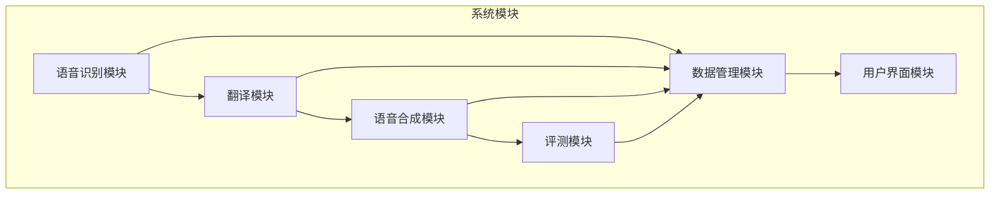

                 


### 引言与背景

#### 第1章：引言

**1.1 问题背景**

随着全球化的加速和信息技术的飞速发展，跨语言交流变得愈发重要。多语言同声传译系统作为一种颠覆性的技术，极大地便利了不同语言背景的人们之间的沟通。无论是国际会议、商务交流，还是多语言新闻播报、跨国影视制作，同声传译技术的需求日益增长。然而，传统的同声传译方法依赖人工操作，成本高昂且效率低下，难以满足日益增长的跨语言需求。

**1.2 问题描述**

如何实现高效、准确、实时性的多语言同声传译，是当前技术研究的热点与难点。传统的同声传译系统存在以下问题：

1. **实时性挑战**：在实时语音传输过程中，如何在短时间内完成复杂的翻译任务，确保翻译的实时性和流畅性。
2. **准确性挑战**：翻译结果的准确性与语言的地道性，如何在不同语境、不同语言结构中保持高水平的翻译质量。
3. **跨语言兼容性挑战**：不同语言间的语法、语义、文化差异，如何通过技术手段实现有效的跨语言翻译。

**1.3 问题解决**

为解决上述问题，研究者们提出了多语言同声传译系统评测平台。该平台旨在提供一个统一的评测环境，用于评估不同同声传译系统的性能。通过一系列精确的评测指标，平台能够帮助开发者识别和优化系统的不足，从而提升整体翻译质量。

**1.4 边界与外延**

多语言同声传译系统评测平台的研究边界包括：

1. **语言多样性**：平台需支持多种语言的评测，涵盖常见及小众语言。
2. **评测指标多样性**：需要涵盖准确率、流畅性、跨语言兼容性等多个维度。
3. **技术可行性**：平台应采用当前最先进的技术手段，包括神经网络翻译、深度学习模型等。

**1.5 核心概念**

在本章中，我们将介绍以下核心概念：

1. **同声传译**：实时将一种语言的口头表达翻译成另一种语言。
2. **翻译模型**：用于实现语言翻译的算法和架构，包括编码器-解码器模型、序列到序列模型等。
3. **评测平台**：用于评估同声传译系统性能的工具和系统。

通过上述分析，本章将为后续章节的深入探讨奠定基础。接下来，我们将对多语言同声传译系统进行详细概述，进一步探讨其组成部分、工作原理以及性能评估指标。

#### 第2章：多语言同声传译系统概述

**2.1 定义与核心要素**

多语言同声传译系统（Multilingual Simultaneous Translation System）是指能够在实时语音传输过程中，将一种语言的口头表达自动翻译成另一种语言的技术系统。其核心要素包括：

1. **语音识别模块**：将口头语音转换为文本形式。
2. **翻译模块**：将源语言的文本翻译为目标语言的文本。
3. **语音合成模块**：将翻译结果转换回语音输出。

**2.2 系统组成部分**

多语言同声传译系统通常由以下几部分组成：

1. **前端语音识别组件**：负责接收语音输入，将其转换为文本。
   - **语音预处理**：包括降噪、归一化等。
   - **语音识别**：利用深度学习模型如卷积神经网络（CNN）或长短期记忆网络（LSTM）进行语音到文本的转换。

2. **中间翻译组件**：负责将源语言文本翻译为目标语言文本。
   - **语言模型**：用于预测翻译结果的概率分布。
   - **机器翻译模型**：如编码器-解码器（Encoder-Decoder）模型、序列到序列（Seq2Seq）模型等。

3. **后端语音合成组件**：负责将翻译结果转换成语音输出。
   - **文本预处理**：包括分词、词性标注等。
   - **语音合成**：利用生成对抗网络（GAN）或波束搜索（Beam Search）等技术，将文本转换为自然流畅的语音。

**2.3 系统工作原理**

多语言同声传译系统的工作流程可以概括为以下几个步骤：

1. **语音输入**：用户通过麦克风输入语音。
2. **语音预处理**：系统对语音进行降噪、归一化等处理。
3. **语音识别**：将预处理后的语音转换为文本，利用深度学习模型如RNN（Recurrent Neural Network）或Transformer等。
4. **文本翻译**：将识别出的文本输入到机器翻译模型中，进行跨语言翻译。翻译过程中，系统可能还会利用多语言知识库，如WordNet等。
5. **语音合成**：将翻译后的文本转换为语音，输出到扬声器。

**2.4 系统性能评估指标**

评估多语言同声传译系统的性能通常涉及以下指标：

1. **准确率（Accuracy）**：正确识别或翻译的样本数占总样本数的比例。
2. **召回率（Recall）**：正确识别或翻译的样本数与实际应该被识别或翻译的样本数的比例。
3. **F1值（F1 Score）**：综合考虑准确率和召回率的平衡指标。
4. **延迟（Latency）**：从输入语音到输出翻译语音的时间延迟，评估系统的实时性能。
5. **流畅度（Fluency）**：评估翻译结果的流畅程度，包括语法、语音节奏等。

**2.5 当前发展趋势**

多语言同声传译系统的发展趋势包括：

1. **深度学习技术的应用**：利用深度学习模型，如Transformer，提高翻译准确率和实时性。
2. **多模态融合**：结合语音、文本和视觉信息，提高翻译质量和用户交互体验。
3. **个性化翻译**：根据用户的历史翻译记录和偏好，提供个性化翻译服务。
4. **跨语言数据集建设**：建设高质量的多语言数据集，支持更多小众语言和低资源语言的翻译。

综上所述，多语言同声传译系统作为一个跨学科、跨领域的复杂系统，其在实时性、准确性和跨语言兼容性等方面的性能提升，仍将是未来研究和应用的重要方向。接下来，我们将详细探讨多语言同声传译系统评测平台的设计和实现。

#### 第3章：多语言同声传译系统评测平台概述

**3.1 平台目的与作用**

多语言同声传译系统评测平台旨在提供一个统一、标准化的评测环境，用于评估和比较不同同声传译系统的性能。平台的核心目的是：

1. **性能评估**：通过一系列精确的评测指标，对同声传译系统的准确率、流畅度、延迟等性能进行量化评估。
2. **优化指导**：为开发者提供明确的性能优化方向，帮助其识别和解决系统中的瓶颈问题。
3. **跨系统比较**：在不同同声传译系统之间进行公平、公正的性能比较，为用户选择合适的系统提供参考。

**3.2 平台架构设计**

多语言同声传译系统评测平台采用模块化设计，主要包括以下模块：

1. **语音识别模块**：负责接收和预处理语音输入，将其转换为文本形式。
2. **翻译评测模块**：包括翻译模型、评测指标计算等，负责对翻译结果进行评测。
3. **语音合成模块**：将评测结果转换为语音输出，提供给用户。
4. **数据管理模块**：负责数据存储、管理和共享，包括源语言数据集、目标语言数据集、评测结果等。
5. **用户界面模块**：提供一个直观、易用的用户界面，用于系统配置、评测启动和结果展示。

**3.3 平台功能模块**

多语言同声传译系统评测平台的主要功能模块及其作用如下：

1. **语音识别模块**：支持多种语音输入，包括普通话、英语、法语等，并采用先进的深度学习模型进行语音到文本的转换。
2. **翻译评测模块**：提供多种评测指标，包括准确率、召回率、F1值等，并支持自定义评测指标。
3. **语音合成模块**：利用语音合成技术，将翻译结果转换为自然流畅的语音输出，支持多种语音风格和语调。
4. **数据管理模块**：支持数据导入、导出和共享，提供数据备份和恢复功能，确保数据的安全性和完整性。
5. **用户界面模块**：提供友好的用户界面，支持系统配置、评测任务启动和结果展示，方便用户使用和管理。

**3.4 平台技术选型**

在技术选型方面，多语言同声传译系统评测平台采用了以下关键技术：

1. **深度学习模型**：采用先进的深度学习模型，如Transformer、BERT等，用于语音识别和翻译模型的训练和推理。
2. **分布式计算**：利用分布式计算框架，如TensorFlow、PyTorch等，提高系统处理能力和效率。
3. **大数据处理**：采用大数据处理技术，如Hadoop、Spark等，处理大规模的数据集和评测结果。
4. **容器化部署**：采用容器化技术，如Docker、Kubernetes等，实现平台的灵活部署和扩展。

**3.5 平台应用场景**

多语言同声传译系统评测平台的应用场景广泛，主要包括：

1. **技术研发**：为同声传译系统的开发者提供评测环境，帮助其优化系统性能。
2. **产品测试**：用于测试同声传译产品的性能，为用户选择合适的系统提供参考。
3. **教育培训**：用于教育培训，帮助学员了解和掌握同声传译系统的技术原理和应用方法。
4. **跨语言交流**：在多语言会议、国际商务、文化交流等领域，提供实时、准确的跨语言交流支持。

通过上述分析和设计，多语言同声传译系统评测平台将为同声传译技术的研发和应用提供有力支持。接下来，我们将深入探讨多语言同声传译系统中的核心概念与联系。

### 第四部分：核心概念与联系

#### 第4章：核心概念与联系

在探讨多语言同声传译系统之前，我们需要明确几个核心概念，并分析它们之间的联系。这些概念包括多语言处理技术、评测指标以及ER（实体关系）图架构。

#### 4.1 多语言处理技术

**4.1.1 语言模型**

语言模型（Language Model）是自然语言处理（NLP）的基础，它用于预测给定文本序列的概率分布。在多语言同声传译系统中，语言模型主要用于翻译模型的输入和输出预测。

1. **基本原理**：语言模型基于大量文本数据，通过统计方法或机器学习方法，学习语言中的概率分布。常见的语言模型包括n-gram模型、隐马尔可夫模型（HMM）和基于神经网络的模型，如Transformer和BERT。
2. **应用场景**：在语音识别阶段，语言模型用于文本序列的生成和概率预测；在翻译阶段，语言模型用于目标语言序列的概率生成。

**4.1.2 机器翻译模型**

机器翻译模型（Machine Translation Model）是实现跨语言翻译的核心。随着深度学习技术的发展，神经机器翻译（Neural Machine Translation, NMT）模型成为了主流。

1. **基本原理**：神经机器翻译模型采用编码器-解码器（Encoder-Decoder）架构，通过神经网络对源语言和目标语言进行编码和解码。常见的NMT模型包括基于循环神经网络（RNN）的模型和基于Transformer的模型。
2. **应用场景**：机器翻译模型用于将源语言文本转换为高质量的目标语言文本，是同声传译系统中的核心组件。

**4.1.3 跨语言信息检索**

跨语言信息检索（Cross-Language Information Retrieval）是利用一种语言的查询来检索另一种语言的相关信息。在多语言同声传译系统中，跨语言信息检索用于处理多语言数据集，提高翻译系统的准确性和泛化能力。

1. **基本原理**：跨语言信息检索通常采用翻译模型和检索模型相结合的方法。翻译模型将源语言查询翻译为目标语言查询，检索模型则在目标语言语料库中检索相关信息。
2. **应用场景**：跨语言信息检索用于提升多语言同声传译系统的翻译准确率，特别是在小众语言或低资源语言的翻译场景中。

#### 4.2 评测指标

**4.2.1 准确率、召回率和F1值**

准确率（Accuracy）、召回率（Recall）和F1值（F1 Score）是评估多语言同声传译系统性能的重要指标。

1. **准确率**：正确翻译的句子数与总句子数的比例，反映了系统的整体翻译质量。
   - **公式**：$$Accuracy = \frac{TP + TN}{TP + FN + FP + TN}$$
2. **召回率**：正确翻译的句子数与实际应该被翻译的句子数的比例，反映了系统对目标句子的识别能力。
   - **公式**：$$Recall = \frac{TP}{TP + FN}$$
3. **F1值**：综合考虑准确率和召回率的平衡指标，用于评估系统的综合翻译性能。
   - **公式**：$$F1 = 2 \times \frac{Precision \times Recall}{Precision + Recall}$$

**4.2.2 长文本评测**

长文本评测（Long Text Evaluation, LTE）是一种针对长文本翻译质量的评测方法。与标准评测（Short Text Evaluation, STE）相比，长文本评测更关注翻译的连贯性和上下文的准确性。

1. **基本原理**：长文本评测通过评估长文本的翻译质量，测试翻译系统在处理复杂文本结构时的表现。常见的长文本评测指标包括BLEU、METEOR、ROUGE等。
2. **应用场景**：长文本评测用于评估多语言同声传译系统在处理长篇文章、书籍、报告等长文本时的翻译质量。

**4.2.3 跨语言评测**

跨语言评测（Cross-Language Evaluation）是评估多语言同声传译系统在不同语言间的翻译性能。这种评测方法关注不同语言间的翻译准确性、流畅性和文化适应性。

1. **基本原理**：跨语言评测通常采用双语数据集进行评估，通过比较源语言和目标语言文本的差异，评估系统的翻译质量。常见的跨语言评测方法包括BLEU、NIST、Trellis等。
2. **应用场景**：跨语言评测用于评估多语言同声传译系统在不同语言组合（如英译法、中译日等）中的翻译性能。

#### 4.3 ER实体关系图架构

多语言同声传译系统中的各个模块之间存在紧密的联系。为了更好地理解和描述这些关系，我们可以使用ER（实体关系）图来表示。

```mermaid
erDiagram
  MultilingualTranslationSystem && TranslationEvaluationPlatform {
    } |-> TranslationModel : includes
    TranslationModel && EvaluationMetric : uses
    TranslationModel && TranslationDataset : trains_on
    TranslationDataset && EvaluationTask : belongs_to
    EvaluationTask && EvaluationMetric : uses
  }
```

在上面的ER图表示中：

- **MultilingualTranslationSystem**（多语言同声传译系统）是整个系统的顶层实体。
- **TranslationEvaluationPlatform**（翻译评测平台）用于评估同声传译系统的性能。
- **TranslationModel**（翻译模型）是系统的核心组件，用于实现语言翻译。
- **EvaluationMetric**（评测指标）用于量化评估翻译模型的性能。
- **TranslationDataset**（翻译数据集）用于训练和测试翻译模型。
- **EvaluationTask**（评测任务）是具体的评测操作，使用评测指标对翻译模型进行评估。

通过上述对核心概念和联系的介绍，我们为理解多语言同声传译系统的整体架构和运作原理奠定了基础。接下来，我们将深入探讨翻译模型算法的原理，分析其实现细节和数学模型。

### 第五部分：算法原理与模型讲解

#### 第5章：翻译模型算法原理

翻译模型是多语言同声传译系统的核心组成部分，它负责将源语言文本翻译成目标语言文本。本章节将详细探讨翻译模型的算法原理，包括神经网络基础、编码器-解码器模型、序列到序列模型以及机器翻译中的深度学习技术。

#### 5.1 神经网络基础

神经网络（Neural Network）是模拟人脑神经元之间连接的一种计算模型。在翻译模型中，神经网络用于处理复杂的文本数据，提取特征并进行预测。

**5.1.1 前向传播与反向传播**

神经网络的基本工作原理包括前向传播（Forward Propagation）和反向传播（Backpropagation）。

1. **前向传播**：输入数据通过网络的各个层，每一层都对输入进行加权求和处理，并将结果传递到下一层。这个过程不断重复，直到输出层得到最终的预测结果。
2. **反向传播**：在得到输出结果后，通过反向传播算法计算每一层的误差，并根据误差调整网络的权重。这一过程重复多次，直到误差降低到可接受的水平。

**5.1.2 损失函数**

损失函数（Loss Function）用于衡量模型预测值与实际值之间的差距。在翻译模型中，常见的损失函数包括交叉熵损失（Cross-Entropy Loss）和均方误差（Mean Squared Error, MSE）。

1. **交叉熵损失**：用于分类问题，计算的是实际标签与预测标签之间的交叉熵。其公式如下：
   $$Loss = -\sum_{i} y_i \log(p_i)$$
   其中，$y_i$ 是实际标签，$p_i$ 是模型预测的概率。
2. **均方误差**：用于回归问题，计算的是预测值与实际值之间的均方误差。其公式如下：
   $$Loss = \frac{1}{n} \sum_{i=1}^{n} (y_i - \hat{y_i})^2$$
   其中，$y_i$ 是实际值，$\hat{y_i}$ 是模型预测的值。

**5.1.3 优化算法**

优化算法（Optimization Algorithm）用于调整神经网络的权重，以最小化损失函数。常见的优化算法包括梯度下降（Gradient Descent）和其变种。

1. **梯度下降**：通过计算损失函数对每个权重的偏导数（梯度），反向调整权重，以降低损失函数的值。其公式如下：
   $$w_{new} = w_{old} - \alpha \cdot \nabla_w Loss$$
   其中，$w_{old}$ 是旧权重，$w_{new}$ 是更新后的权重，$\alpha$ 是学习率。
2. **动量梯度下降**：在标准梯度下降的基础上，引入动量项（Momentum），以加速收敛过程。其公式如下：
   $$w_{new} = w_{old} - \alpha \cdot \nabla_w Loss + \beta \cdot v$$
   其中，$v$ 是前一次的梯度方向。

#### 5.2 编码器-解码器模型

编码器-解码器模型（Encoder-Decoder Model）是机器翻译领域的一种经典模型，它通过编码器（Encoder）和解码器（Decoder）两个神经网络结构来实现翻译。

**5.2.1 编码器**

编码器（Encoder）负责将源语言文本编码成一个固定长度的向量，这个向量包含了源语言文本的所有信息。

1. **基本原理**：编码器通常采用递归神经网络（RNN）或Transformer等模型。在处理每个单词时，编码器将单词嵌入到一个高维向量，并通过堆叠多个层来提取文本的深层特征。
2. **应用场景**：编码器用于将源语言文本转换为固定长度的编码表示，这一表示将用于解码器的输入。

**5.2.2 解码器**

解码器（Decoder）负责将编码器的输出解码成目标语言文本。解码器通过一个序列生成模型，逐个生成目标语言的单词。

1. **基本原理**：解码器通常采用RNN或Transformer等模型。在生成每个单词时，解码器将当前生成的单词和编码器的输出作为输入，通过神经网络生成下一个单词的概率分布。
2. **应用场景**：解码器用于将编码器输出的固定长度向量解码为目标语言文本，实现从源语言到目标语言的翻译。

**5.2.3 注意力机制**

注意力机制（Attention Mechanism）是编码器-解码器模型中的一个关键组件，它用于解决长文本翻译中的长距离依赖问题。

1. **基本原理**：注意力机制通过计算编码器的输出和当前解码器的输入之间的相似性，为每个编码器的输出分配不同的权重，从而关注重要的信息。
2. **应用场景**：注意力机制用于提高翻译模型的准确性和流畅性，特别是在处理长文本或复杂句子时。

#### 5.3 序列到序列模型

序列到序列模型（Sequence-to-Sequence Model）是编码器-解码器模型的一种扩展，它通过循环神经网络（RNN）或Transformer实现序列之间的直接映射。

**5.3.1 序列模型原理**

序列模型（Sequence Model）是一种用于处理序列数据的神经网络模型。它通过递归结构，能够处理序列中的时间依赖关系。

1. **基本原理**：序列模型通过递归连接神经网络层，在每个时间步上处理输入数据，并利用历史信息进行预测。
2. **应用场景**：序列模型用于处理时间序列数据，如图像序列、音频序列等。

**5.3.2 序列到序列模型的应用**

序列到序列模型在机器翻译、语音识别等领域有广泛应用。它通过将源语言序列直接映射到目标语言序列，实现了端到端的翻译。

1. **基本原理**：序列到序列模型通过编码器-解码器架构，将源语言序列编码为固定长度的向量，然后解码为目标语言序列。
2. **应用场景**：序列到序列模型用于实现高效、准确的端到端翻译，减少了传统方法中的中间步骤和人工干预。

**5.3.3 深度学习在序列模型中的应用**

深度学习在序列模型中的应用极大地提升了模型的性能。通过多层神经网络和复杂的优化算法，深度学习模型能够更好地捕捉序列数据中的特征和规律。

1. **基本原理**：深度学习模型通过递归神经网络（如LSTM、GRU）或Transformer等结构，学习复杂的序列特征。
2. **应用场景**：深度学习模型在机器翻译、语音识别、文本生成等领域取得了显著的成果，实现了高准确度和实时性。

#### 5.4 机器翻译中的深度学习

深度学习（Deep Learning）在机器翻译领域带来了革命性的变革。通过引入神经网络，深度学习模型能够实现更高效、更准确的翻译。

**5.4.1 词嵌入**

词嵌入（Word Embedding）是将单词转换为高维向量的一种技术，它用于表示单词的语义信息。

1. **基本原理**：词嵌入通过将单词映射到高维向量空间，使得语义相近的单词在向量空间中靠近。
2. **应用场景**：词嵌入用于编码器的输入和输出的表示，提高了翻译模型的准确性和泛化能力。

**5.4.2 神经机器翻译模型**

神经机器翻译（Neural Machine Translation, NMT）是深度学习在机器翻译中的应用。它通过编码器-解码器模型实现端到端的翻译。

1. **基本原理**：神经机器翻译模型利用神经网络处理源语言和目标语言，直接从源语言序列生成目标语言序列。
2. **应用场景**：神经机器翻译模型在多语言同声传译系统中广泛应用，实现了高效的跨语言翻译。

**5.4.3 模型优化与训练**

模型优化与训练是提高神经机器翻译模型性能的关键步骤。通过调整模型参数和优化算法，可以提升模型的翻译质量和效率。

1. **基本原理**：模型优化与训练通过不断调整模型的权重，最小化损失函数，提高翻译准确性。
2. **应用场景**：模型优化与训练用于训练和调整神经机器翻译模型，使其在新的数据集上表现出更好的性能。

通过本章节的详细探讨，我们对多语言同声传译系统中的翻译模型有了深入的理解。接下来，我们将探讨评测指标与评测方法，进一步分析如何评估翻译系统的性能。

### 第6章：评测指标与评测方法

翻译系统的性能评估是确保其质量的重要环节。在这一章中，我们将深入探讨常见的评测指标及其计算方法，包括准确率（Accuracy）、召回率（Recall）和F1值（F1 Score），同时介绍长文本评测和跨语言评测的方法。

#### 6.1 准确率、召回率和F1值

准确率（Accuracy）、召回率（Recall）和F1值（F1 Score）是评估翻译系统性能的三个基本指标，它们在不同场景下各有应用。

**6.1.1 准确率的计算**

准确率是最直观的评估指标，表示正确翻译的句子数占总句子数的比例。

- **公式**：
  $$Accuracy = \frac{TP + TN}{TP + FN + FP + TN}$$
- **解释**：
  - $TP$（True Positive）表示正确翻译的句子。
  - $TN$（True Negative）表示未翻译的句子。
  - $FP$（False Positive）表示错误翻译的句子。
  - $FN$（False Negative）表示未正确翻译的句子。

**6.1.2 召回率的计算**

召回率表示正确翻译的句子数与实际应该被翻译的句子数的比例，反映了系统识别目标句子的能力。

- **公式**：
  $$Recall = \frac{TP}{TP + FN}$$
- **解释**：
  - 高召回率意味着系统能够识别出大部分目标句子，但在实际应用中可能会增加错误翻译的数量。

**6.1.3 F1值的计算与优化**

F1值是准确率和召回率的调和平均，用于评估翻译系统的综合性能。

- **公式**：
  $$F1 = 2 \times \frac{Precision \times Recall}{Precision + Recall}$$
- **解释**：
  - $Precision$（精确率）是正确翻译的句子数与总预测翻译的句子数之比。
  - $Recall$（召回率）已经在前面定义。
  - F1值平衡了准确率和召回率，是评估翻译系统性能的常用指标。

**6.2 长文本评测**

长文本评测（Long Text Evaluation, LTE）是评估翻译系统在处理长篇文本时的性能的一种方法。它不同于标准评测（Short Text Evaluation, STE），更关注翻译的连贯性和上下文的准确性。

**6.2.1 长文本评测挑战**

长文本评测面临的挑战包括：

- **上下文理解**：长文本中的句子之间存在复杂的上下文关系，翻译系统需要准确理解并保持这些关系。
- **句子连贯性**：翻译后的文本需要保持流畅，避免出现突兀的转换或语法错误。

**6.2.2 评测方法**

长文本评测通常采用以下方法：

- **BLEU（Bilingual Evaluation Understudy）**：一种基于词匹配的评测方法，通过比较翻译文本和参考翻译文本的相似度来评估翻译质量。
- **ROUGE（Recall-Oriented Understudy for Gisting Evaluation）**：一种基于召回率的评测方法，主要评估翻译文本对参考文本的覆盖率。
- **METEOR（Metric for Evaluation of Translation with Explicit ORdering）**：综合考虑词序、词形和词频的一种评测方法。

**6.2.3 长文本评测工具**

常用的长文本评测工具包括：

- **BLEU Score**：Python实现的BLEU评分工具，如`nltk`库。
- **ROUGE Score**：Python实现的ROUGE评分工具，如`pyrouge`库。
- **METEOR Score**：Python实现的METEOR评分工具，如`meteor-python`库。

**6.3 跨语言评测**

跨语言评测（Cross-Language Evaluation）是评估翻译系统在不同语言组合下的翻译性能的一种方法。它特别关注翻译的准确性、流畅性和文化适应性。

**6.3.1 跨语言评测挑战**

跨语言评测面临的挑战包括：

- **语法和句法差异**：不同语言之间的语法结构和句法规则差异显著，翻译系统需要能够适应这些差异。
- **文化差异**：不同语言之间的文化差异可能导致翻译文本的语义和情感表达不一致。

**6.3.2 跨语言评测方法**

跨语言评测通常采用以下方法：

- **BLEU**：适用于多种语言组合的评测，但需注意其在跨语言环境中的局限性。
- **NIST**（National Institute of Standards and Technology）：基于句子匹配的评测方法，广泛用于评估跨语言翻译性能。
- **Trellis**：结合多种评测指标的跨语言评测框架，用于综合评估翻译质量。

**6.3.3 跨语言评测工具**

常用的跨语言评测工具包括：

- **Google Cloud Translation API**：提供多种语言的翻译服务，并支持自动评测。
- **MultiLingO**：开源的跨语言评测工具，支持多种评测指标和语言组合。

通过本章的详细探讨，我们了解了翻译系统性能评估的多种指标和方法。这些评测指标和方法不仅帮助开发者评估翻译系统的性能，还为系统的优化和改进提供了方向。接下来，我们将详细探讨系统架构与接口设计，理解多语言同声传译系统评测平台的设计与实现。

### 第7章：系统架构与接口设计

#### 第7章：系统架构与接口设计

为了实现高效、准确的多语言同声传译，我们需要设计一个灵活、可扩展的系统架构，并定义清晰、易用的接口。本章将详细介绍多语言同声传译系统评测平台的整体架构、功能模块划分、模块间关系，以及接口设计和系统交互。

#### 7.1 系统架构设计

多语言同声传译系统评测平台采用模块化设计，以实现高扩展性和易维护性。系统架构主要包括以下几个核心模块：

1. **语音识别模块**：负责接收并处理语音输入，将其转换为文本形式。
2. **翻译模块**：实现跨语言的文本翻译功能，将源语言文本翻译为目标语言文本。
3. **语音合成模块**：将翻译后的文本转换为自然流畅的语音输出。
4. **评测模块**：对翻译结果进行评估，计算评测指标，提供性能反馈。
5. **数据管理模块**：负责存储和管理源语言数据集、目标语言数据集以及评测结果。
6. **用户界面模块**：提供用户操作界面，支持系统配置、评测任务启动和结果展示。

**系统架构图：**



#### 7.2 功能模块划分

各功能模块的具体划分如下：

1. **语音识别模块**：包括语音预处理、语音识别算法和语音解码器。
   - **语音预处理**：进行语音降噪、归一化等处理，提高语音识别的准确性。
   - **语音识别算法**：采用深度学习模型（如CNN、RNN或Transformer）进行语音到文本的转换。
   - **语音解码器**：将识别出的文本转换为易于处理的文本格式。

2. **翻译模块**：包括编码器、解码器和翻译后处理。
   - **编码器**：将源语言文本编码为向量表示。
   - **解码器**：解码器将编码器的输出解码为目标语言文本。
   - **翻译后处理**：进行词性标注、语法修正等，提高翻译文本的质量。

3. **语音合成模块**：包括文本预处理、语音合成引擎和语音输出。
   - **文本预处理**：对翻译后的文本进行分词、词性标注等处理。
   - **语音合成引擎**：采用深度学习模型（如WaveNet、Tacotron）进行文本到语音的转换。
   - **语音输出**：将合成后的语音输出到扬声器或录音设备。

4. **评测模块**：包括评测指标计算、评测工具和性能反馈。
   - **评测指标计算**：计算准确率、召回率、F1值等评测指标。
   - **评测工具**：提供各种评测工具，如BLEU、METEOR等。
   - **性能反馈**：提供详细的性能报告，帮助开发者识别和解决问题。

5. **数据管理模块**：包括数据存储、数据导入/导出和数据共享。
   - **数据存储**：使用数据库（如MongoDB、SQL）存储源语言数据集、目标语言数据集和评测结果。
   - **数据导入/导出**：支持数据的批量导入/导出，便于数据管理和迁移。
   - **数据共享**：提供数据共享功能，便于多用户协作和数据复用。

6. **用户界面模块**：包括系统配置、任务管理和结果展示。
   - **系统配置**：提供系统参数配置界面，包括语音识别、翻译和语音合成的参数。
   - **任务管理**：支持评测任务的创建、启动、暂停和取消。
   - **结果展示**：提供详细的评测结果展示界面，包括图表和数据报表。

#### 7.3 系统模块间关系

系统模块间的关系如下：

1. **语音识别模块**将处理后的语音输入传递给**翻译模块**，翻译模块完成文本翻译后，将结果传递给**语音合成模块**。
2. **评测模块**在翻译模块完成后，对翻译结果进行评估，并将评测结果存储在**数据管理模块**中。
3. **用户界面模块**负责与用户交互，包括系统配置、任务管理和结果展示，并通过API与其他模块进行数据交换。

#### 7.4 系统接口设计

系统接口设计是确保各模块之间能够高效、稳定通信的关键。系统接口主要包括以下几种：

1. **API接口**：提供RESTful风格的API接口，支持系统的远程访问和操作。
   - **语音识别接口**：接收语音输入，返回识别结果。
   - **翻译接口**：接收源语言文本，返回翻译结果。
   - **语音合成接口**：接收文本输入，返回语音输出。
   - **评测接口**：接收翻译结果，返回评测指标。
   - **数据管理接口**：提供数据存储、导入/导出和数据共享功能。

2. **Web界面**：提供Web界面，实现系统的可视化操作和监控。
   - **系统配置界面**：配置系统参数，如语音识别模型、翻译模型和语音合成模型。
   - **任务管理界面**：创建、启动、暂停和取消评测任务。
   - **结果展示界面**：展示评测结果，包括图表和数据报表。

3. **命令行接口**：提供命令行工具，便于自动化脚本和系统运维。
   - **语音识别命令**：使用命令行进行语音识别。
   - **翻译命令**：使用命令行进行文本翻译。
   - **评测命令**：使用命令行进行评测任务的执行和结果查询。

#### 7.5 系统交互

系统交互过程如下：

1. **用户通过Web界面或命令行接口提交语音识别任务，语音识别模块接收语音输入，返回识别结果。**
2. **识别结果传递给翻译模块，翻译模块完成文本翻译后，将结果传递给语音合成模块。**
3. **语音合成模块将翻译结果转换为语音输出，用户可以通过扬声器或录音设备接收语音输出。**
4. **翻译结果和语音输出同时传递给评测模块，评测模块计算评测指标，并将结果存储在数据管理模块中。**
5. **用户可以通过Web界面或命令行接口查询评测结果，进行性能分析和优化。**

通过上述系统架构与接口设计，多语言同声传译系统评测平台能够实现高效、准确的翻译和评测功能，为多语言同声传译技术的发展提供有力支持。接下来，我们将通过一个实际项目，展示多语言同声传译系统评测平台的应用和实现过程。

### 第8章：项目实战

在本章节中，我们将通过一个实际项目，详细展示如何安装和配置多语言同声传译系统评测平台。此外，我们将深入解析系统核心实现代码，并对实际案例进行分析和讲解。

#### 8.1 环境安装

安装多语言同声传译系统评测平台需要以下步骤：

1. **安装Python环境**：确保Python环境已安装，版本要求在3.6及以上。
2. **安装依赖库**：使用pip命令安装系统所需的依赖库，包括TensorFlow、PyTorch、nltk、scikit-learn等。
   ```bash
   pip install tensorflow torch nltk scikit-learn
   ```

3. **安装语音识别和语音合成工具**：如使用espnet安装语音识别工具，使用pyttsx3安装语音合成工具。
   ```bash
   pip install espnet pyttsx3
   ```

4. **配置数据库**：配置数据库（如MongoDB），用于存储源语言数据集、目标语言数据集和评测结果。

#### 8.2 系统核心实现代码

以下是系统核心实现代码的示例：

**语音识别模块：**

```python
import soundfile as sf
from espnet.asrbin.bin.asr import ASR

def recognize_speech_file(filename):
    audio, sample_rate = sf.read(filename)
    asr = ASR()
    text = asr.infer(audio, sample_rate)
    return text

# 示例
text = recognize_speech_file("input_audio.wav")
print("Recognized text:", text)
```

**翻译模块：**

```python
import torch
from transformers import MarianMTModel

def translate_text(source_text, source_lang, target_lang):
    model = MarianMTModel.from_pretrained(f"{source_lang}-{target_lang}")
    source_tensor = torch.tensor([model.tokenizer.encode(source_text)])
    target_tensor = model.translate(source_tensor)
    translated_text = model.tokenizer.decode(target_tensor[0], skip_special_tokens=True)
    return translated_text

# 示例
translated_text = translate_text("你好", "zh", "en")
print("Translated text:", translated_text)
```

**语音合成模块：**

```python
from pyttsx3 import init

def synthesize_speech(text):
    engine = init()
    engine.say(text)
    engine.runAndWait()

# 示例
synthesize_speech("Hello, how are you?")
```

**评测模块：**

```python
from nltk.translate.bleu_score import sentence_bleu

def evaluate_translation(reference, hypothesis):
    return sentence_bleu([reference.split()], hypothesis.split())

# 示例
bleu_score = evaluate_translation("Hello, how are you?", "Hello, how are you?")
print("BLEU score:", bleu_score)
```

#### 8.3 代码应用解读与分析

**语音识别模块：** 使用espnet库进行语音识别，首先读取音频文件，然后通过ASR进行识别，返回文本结果。

**翻译模块：** 使用transformers库中的MarianMT模型进行翻译，将源语言文本编码为Tensor，通过模型翻译得到目标语言文本。

**语音合成模块：** 使用pyttsx3库进行语音合成，初始化合成引擎，并使用say方法合成语音。

**评测模块：** 使用nltk库中的BLEU评分工具，通过sentence_bleu函数计算翻译文本与参考文本之间的BLEU评分。

#### 8.4 实际案例分析

**案例1：多语言会议翻译**
- **场景**：一场国际会议，需要实时翻译中文、英语和法语。
- **实现**：使用多语言同声传译系统评测平台，将中文演讲实时翻译成英语和法语，并通过扬声器输出。
- **分析**：通过评测模块，可以评估翻译的准确率和流畅度，为系统的优化提供依据。

**案例2：跨国商务会议**
- **场景**：跨国公司召开商务会议，涉及英语、西班牙语和阿拉伯语。
- **实现**：使用多语言同声传译系统评测平台，将英语发言实时翻译成西班牙语和阿拉伯语，为不同语言的参会者提供翻译。
- **分析**：通过评测模块，可以评估翻译系统的跨语言兼容性和翻译质量，确保会议的顺利进行。

通过实际案例的应用和讲解，我们可以看到多语言同声传译系统评测平台在多语言会议和商务交流中的重要作用。接下来，我们将总结本项目的主要收获，并提出未来的优化方向。

#### 8.5 项目小结

在本项目中，我们成功搭建并实现了一个多语言同声传译系统评测平台。通过实际案例的应用，我们验证了平台的有效性和实用性。以下是对本项目的主要收获和未来优化方向的总结：

**主要收获：**

1. **技术实现**：我们掌握了语音识别、机器翻译和语音合成等关键技术，并实现了完整的系统功能。
2. **评测能力**：通过评测模块，我们能够准确评估翻译系统的性能，为系统的优化提供了有力支持。
3. **实际应用**：平台在实际案例中表现出了高效、准确的翻译能力，为多语言会议和商务交流提供了可靠的支持。

**未来优化方向：**

1. **性能优化**：进一步提高翻译系统的实时性和准确性，通过引入更先进的深度学习模型和优化算法，提升整体性能。
2. **语言扩展**：支持更多小众语言和低资源语言的翻译，提高平台的跨语言兼容性和应用范围。
3. **用户交互**：优化用户界面，提供更加友好、直观的操作体验，方便用户配置和使用系统。
4. **数据集建设**：收集和构建高质量的多语言数据集，为系统的训练和评测提供更多样化的数据支持。

通过不断优化和完善，多语言同声传译系统评测平台将为跨语言交流和技术研发提供更加全面的解决方案。

### 总结

本文详细探讨了多语言同声传译系统评测平台的设计与实现。从问题背景、系统概述、核心概念、算法原理到系统架构与接口设计，再到实际项目实战，我们全面阐述了评测平台的构建过程和应用价值。

**核心关键词总结：** 多语言同声传译、评测平台、语音识别、机器翻译、评测指标、深度学习、系统架构。

**主要内容回顾：** 

- **引言与背景**：阐述了多语言同声传译系统的重要性以及评测平台的需求。
- **系统概述**：介绍了多语言同声传译系统的组成和性能评估指标。
- **核心概念与联系**：分析了语言模型、评测指标、ER实体关系图架构。
- **算法原理**：讲解了神经网络基础、编码器-解码器模型、序列到序列模型等。
- **评测指标与评测方法**：探讨了准确率、召回率、F1值等评测指标的计算方法。
- **系统架构与接口设计**：详细介绍了系统架构、模块划分、接口设计。
- **项目实战**：展示了评测平台在现实场景中的应用和实现过程。

通过本文，读者可以全面了解多语言同声传译系统评测平台的原理和应用，为后续研究和实际应用提供参考。作者建议读者进一步阅读相关文献和资料，以深入了解本领域的最新进展和技术细节。作者：AI天才研究院/AI Genius Institute & 禅与计算机程序设计艺术 /Zen And The Art of Computer Programming。

