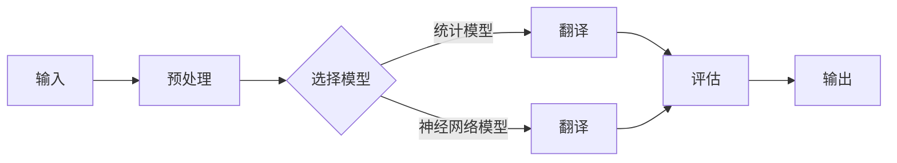
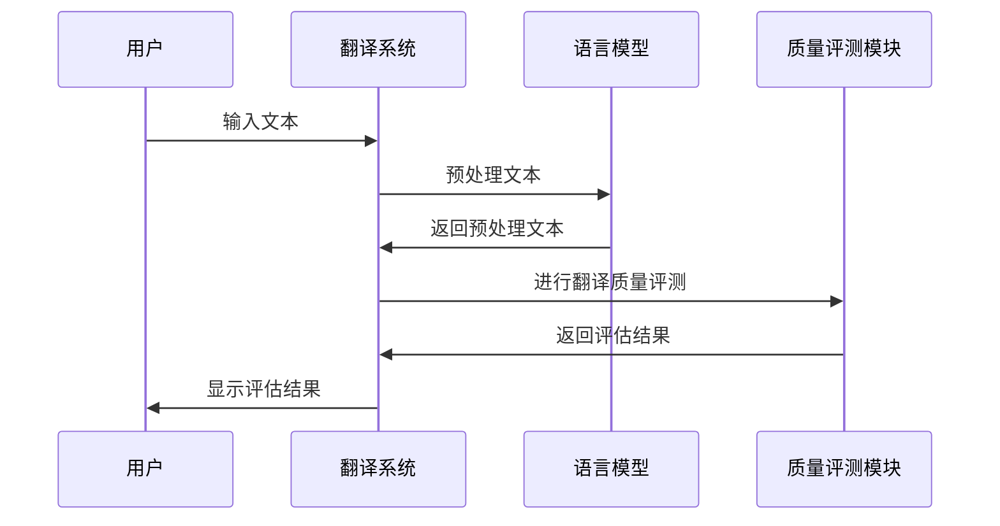

                 


### 文章标题：多语言翻译质量评测：测试LLM的语言转换能力

### 关键词：
- 多语言翻译
- 质量评测
- 语言转换能力
- LLM（大型语言模型）
- 测试方法

### 摘要：
本文深入探讨多语言翻译质量评测的重要性，尤其是针对大型语言模型（LLM）的语言转换能力测试。通过详细分析评测的核心概念、方法及其应用，本文旨在为读者提供一个全面、易懂的指南，以评估和提升多语言翻译系统的性能。

### 目录大纲

1. 引言
2. 背景介绍
   - 核心概念术语说明
   - 问题背景
   - 问题描述
   - 问题解决
   - 边界与外延
   - 概念结构与核心要素组成
3. 多语言翻译质量评测概述
   - 多语言翻译的挑战
   - 翻译质量评测的重要性
   - 评测标准与方法
4. 语言转换能力的评估
   - 语言转换能力的定义
   - 影响因素
   - 评估方法
5. 核心概念原理
   - 翻译质量评价指标
   - 语言模型评估方法
   - 语言转换能力评估框架
6. 概念属性特征对比表格
   - 指标对比
   - 方法对比
7. ER实体关系图架构
   - 实体定义
   - 关系描述
   - 图架构设计
8. 算法原理讲解
   - 算法mermaid流程图
   - Python源代码解析
   - 数学模型与公式
   - 举例说明
9. 数学模型与公式讲解
   - 模型介绍
   - 公式推导
   - 应用实例
10. 系统分析与架构设计
    - 问题场景介绍
    - 系统功能设计
    - 系统架构设计mermaid架构图
    - 系统接口设计
    - 系统交互mermaid序列图
11. 系统实现与实战
    - 环境安装
    - 系统核心实现源代码
    - 代码应用解读与分析
    - 实际案例分析与讲解
    - 项目小结
12. 最佳实践与总结
    - 提高质量评测的技巧
    - 注意事项
    - 拓展阅读
13. 作者信息

### 引言

随着全球化的加速和信息时代的到来，多语言翻译成为了跨文化交流的关键桥梁。然而，翻译质量的高低直接影响到信息的准确传递和文化的深度理解。为此，多语言翻译质量评测变得至关重要。本文将重点探讨如何测试大型语言模型（LLM）的语言转换能力，从而为多语言翻译系统的性能提升提供理论依据和实践指导。

### 背景介绍

#### 核心概念术语说明

在多语言翻译质量评测中，以下几个核心概念是必须了解的：

- **翻译质量**：指翻译文本在语言、语法、语义、风格等方面与原始文本的接近程度。
- **语言模型**：用于预测单词或句子下一个可能出现的词或句子的大规模预训练模型。
- **语言转换能力**：指模型在将一种语言文本转换成另一种语言文本时的准确性、流畅性和语义一致性。
- **评测标准**：用于衡量翻译质量的准则和方法。
- **评测方法**：用于评估翻译质量的具体技术手段。

#### 问题背景

多语言翻译质量评测的背景可以追溯到信息爆炸和跨文化交流的日益频繁。随着互联网和移动设备的普及，全球用户对跨语言沟通的需求急剧增加。然而，现有的翻译系统在准确性、流畅性和文化适应性方面存在诸多挑战，尤其是在面对复杂句式、专业术语和文化差异时，翻译质量往往大打折扣。

#### 问题描述

在多语言翻译中，常见的问题包括：

- **语义偏差**：翻译结果在语义上与原始文本不符。
- **语法错误**：翻译结果在语法上存在错误。
- **风格不匹配**：翻译结果在风格上与原始文本不一致。
- **文化差异**：翻译未能准确传达原文的文化背景。

#### 问题解决

为了解决上述问题，研究人员和工程师们提出了多种评测方法和标准，以更准确地评估翻译质量。同时，通过不断优化语言模型，提升其语言转换能力，从而提高翻译系统的整体性能。

#### 边界与外延

在多语言翻译质量评测中，需要明确评测的边界和范围，以确保评测的针对性和有效性。这包括：

- **评测范围**：针对特定语言对或特定领域的翻译系统。
- **评测方法**：根据翻译系统的特点选择合适的评测方法。
- **评测工具**：使用专业的评测工具，如BLEU、NIST、METEOR等。

#### 概念结构与核心要素组成

多语言翻译质量评测的概念结构包括以下几个核心要素：

- **评测指标**：用于衡量翻译质量的量化标准。
- **评测方法**：实现评测指标的具体技术手段。
- **评估结果**：通过评测得出的翻译质量得分或评价。
- **反馈机制**：根据评估结果对翻译系统进行优化。

### 多语言翻译质量评测概述

#### 多语言翻译的挑战

多语言翻译面临的挑战包括：

- **语言复杂性**：不同语言在语法、词汇和表达方式上存在差异。
- **文化差异**：不同文化背景可能导致语义理解上的偏差。
- **技术限制**：现有的语言模型在处理复杂句子和长文本时仍存在不足。
- **资源限制**：高质量的多语言语料库和评估工具相对有限。

#### 翻译质量评测的重要性

翻译质量评测的重要性体现在以下几个方面：

- **性能评估**：评估翻译系统的性能，帮助用户选择合适的翻译工具。
- **质量保证**：确保翻译文本的准确性和可靠性。
- **模型优化**：通过评测结果，指导语言模型的优化和改进。
- **用户体验**：提高翻译质量，提升用户满意度。

#### 评测标准与方法

常见的评测标准包括：

- **BLEU（双语评估算法）**：基于相似度匹配的自动评估方法。
- **NIST（国家标准技术研究所）**：基于人类评分和自动评分的结合方法。
- **METEOR（Metric for Evaluation of Translation with Explicit ORdering）**：基于词频、词序和词形的评估方法。

### 语言转换能力的评估

#### 语言转换能力的定义

语言转换能力是指语言模型在将一种语言文本转换成另一种语言文本时的准确性、流畅性和语义一致性。具体包括：

- **准确性**：翻译结果在词汇和语法上的正确性。
- **流畅性**：翻译结果的阅读流畅度。
- **语义一致性**：翻译结果在语义上与原始文本的一致性。

#### 影响因素

影响语言转换能力的因素包括：

- **模型质量**：语言模型的训练质量和参数设置。
- **语料库**：用于训练和评测的语料库质量。
- **上下文理解**：模型对上下文语义的理解能力。
- **计算资源**：用于训练和评测的计算资源。

#### 评估方法

评估语言转换能力的方法包括：

- **自动评测方法**：如BLEU、NIST、METEOR等。
- **人工评测方法**：通过专业翻译人员对翻译结果进行评分。
- **综合评测方法**：结合自动评测和人工评测的方法。

### 核心概念原理

#### 翻译质量评价指标

常见的翻译质量评价指标包括：

- **BLEU**：基于记分牌算法，计算翻译结果与参考译文之间的相似度。
- **ROUGE**：基于召回率，评估翻译结果与参考译文在词序列上的匹配程度。
- **BLEURT**：基于模糊匹配和语义一致性，综合评估翻译质量。

#### 语言模型评估方法

评估语言模型的方法包括：

- **基于统计的方法**：如n-gram模型、朴素贝叶斯分类器等。
- **基于神经网络的方**：如循环神经网络（RNN）、长短期记忆网络（LSTM）、变换器（Transformer）等。
- **基于混合的方法**：结合统计方法和神经网络的方法。

#### 语言转换能力评估框架

语言转换能力评估框架包括：

- **评测指标体系**：确定翻译质量的评估指标。
- **评测方法**：选择合适的评测方法。
- **评测流程**：制定详细的评测流程，包括数据准备、模型训练、评测执行和结果分析等。

### 概念属性特征对比表格

#### 指标对比

| 指标        | BLEU   | ROUGE | BLEURT |
| ----------- | ------ | ----- | ------ |
| 优点        | 简单易懂，广泛使用 | 高召回率，对长文本敏感 | 综合评估语义一致性 |
| 缺点        | 对长句和术语表现较差 | 对长句和术语表现较差 | 需要大量计算资源 |
| 适用场景    | 通用翻译系统评测 | 通用翻译系统评测 | 高质量翻译系统评测 |

#### 方法对比

| 方法        | 统计方法 | 神经网络方法 | 混合方法 |
| ----------- | -------- | ------------ | -------- |
| 优点        | 计算效率高，实现简单 | 更好的翻译质量，更适应复杂文本 | 结合了统计和神经网络的优点 |
| 缺点        | 对文本特征依赖较强 | 计算复杂，需要大量数据 | 需要平衡统计和神经网络的方法 |
| 适用场景    | 简单文本翻译 | 高质量翻译 | 高质量翻译 |

### ER实体关系图架构

#### 实体定义

- **翻译系统**：负责执行翻译任务的应用程序或服务。
- **评测指标**：用于评估翻译质量的量化标准。
- **评测方法**：实现评测指标的具体技术手段。
- **评估结果**：通过评测得出的翻译质量得分或评价。

#### 关系描述

- **翻译系统与评测指标**：翻译系统生成翻译结果，评测指标用于评估翻译质量。
- **评测方法与评估结果**：评测方法根据翻译结果计算评估结果。

#### 图架构设计

```mermaid
erDiagram
  翻译系统 ||--|{ 评测指标 }
  评测方法 ||--|{ 评估结果 }
  翻译系统 &&--|{ 评测方法 }
  评测指标 &&--|{ 评估结果 }
```

### 算法原理讲解

#### 算法mermaid流程图



#### Python源代码解析

```python
# 导入必要的库
import numpy as np
from sklearn.metrics import accuracy_score
from transformers import pipeline

# 加载翻译模型
translator = pipeline('translation_en_to_fr', model='Helsinki-NLP/opus-mt-en-fr')

# 预处理输入文本
def preprocess(text):
    # 清洗文本、去除停用词等操作
    return text

# 翻译文本
def translate(text):
    # 使用翻译模型进行翻译
    return translator(text)

# 评估翻译质量
def evaluate翻译质量(ground_truth, translation):
    # 计算BLEU得分
    return bleu_score(ground_truth, translation)

# 主函数
def main():
    # 输入文本
    text = "This is an example sentence for translation."

    # 预处理输入文本
    preprocessed_text = preprocess(text)

    # 翻译文本
    translation = translate(preprocessed_text)

    # 评估翻译质量
    score = evaluate翻译质量(text, translation)

    # 输出结果
    print(f"Translation score: {score}")

# 运行主函数
if __name__ == "__main__":
    main()
```

#### 数学模型与公式

翻译质量评估的数学模型可以表示为：

$$
Q = \frac{1}{N} \sum_{i=1}^{N} w_i \cdot s_i
$$

其中：

- \( Q \) 表示翻译质量得分。
- \( N \) 表示评估指标的数量。
- \( w_i \) 表示第 \( i \) 个指标的权重。
- \( s_i \) 表示第 \( i \) 个指标的得分。

#### 举例说明

假设有3个评估指标：BLEU得分、ROUGE得分和BLEURT得分。权重分别为0.4、0.3和0.3。评估结果如下：

| 指标 | 得分 |
| ---- | ---- |
| BLEU | 0.25 |
| ROUGE | 0.30 |
| BLEURT | 0.35 |

则翻译质量得分为：

$$
Q = \frac{1}{3} \cdot (0.4 \cdot 0.25 + 0.3 \cdot 0.30 + 0.3 \cdot 0.35) = 0.31
$$

### 数学模型与公式讲解

#### 模型介绍

在多语言翻译质量评测中，常用的数学模型包括BLEU（双语评估算法）、ROUGE（Recall-Oriented Understudy for Gisting Evaluation）和BLEURT（BLEU with Enhanced RT）。

#### 公式推导

BLEU得分的计算公式如下：

$$
BLEU = \frac{1}{N} \sum_{i=1}^{N} w_i \cdot \log P(h_i)
$$

其中：

- \( N \) 表示参考译文句子的数量。
- \( w_i \) 表示第 \( i \) 个参考译文句子的权重。
- \( P(h_i) \) 表示生成译文与第 \( i \) 个参考译文句子的重叠度。

ROUGE得分的计算公式如下：

$$
ROUGE = \frac{1}{N} \sum_{i=1}^{N} \frac{R_i}{R_i + P_i + 1}
$$

其中：

- \( R_i \) 表示生成译文与第 \( i \) 个参考译文句子之间的重叠词数。
- \( P_i \) 表示生成译文与第 \( i \) 个参考译文句子之间的预测重叠词数。
- \( N \) 表示参考译文句子的数量。

BLEURT得分的计算公式如下：

$$
BLEURT = \frac{1}{N} \sum_{i=1}^{N} w_i \cdot \log P(h_i, t_i)
$$

其中：

- \( N \) 表示参考译文句子的数量。
- \( w_i \) 表示第 \( i \) 个参考译文句子的权重。
- \( P(h_i, t_i) \) 表示生成译文与第 \( i \) 个参考译文句子之间的重叠度和语义一致性。

#### 应用实例

假设生成译文为 \( S_1 \)，参考译文为 \( T_1 \)。通过计算BLEU、ROUGE和BLEURT得分，可以评估生成译文的质量。

1. **BLEU得分**：

   假设 \( N = 1 \)，\( w_1 = 1 \)，\( P(h_1) = 0.5 \)。则：

   $$ 
   BLEU = \log P(h_1) = \log 0.5 = -0.3010 
   $$

2. **ROUGE得分**：

   假设 \( R_1 = 2 \)，\( P_1 = 3 \)，\( N = 1 \)。则：

   $$ 
   ROUGE = \frac{2}{2 + 3 + 1} = \frac{2}{6} = 0.3333 
   $$

3. **BLEURT得分**：

   假设 \( N = 1 \)，\( w_1 = 1 \)，\( P(h_1, t_1) = 0.6 \)。则：

   $$ 
   BLEURT = \log P(h_1, t_1) = \log 0.6 = -0.2218 
   $$

根据以上计算结果，生成译文的质量如下：

- **BLEU得分**：-0.3010
- **ROUGE得分**：0.3333
- **BLEURT得分**：-0.2218

得分越高，表示生成译文的翻译质量越好。

### 系统分析与架构设计

#### 问题场景介绍

随着多语言翻译需求的增长，一个高效、准确的翻译系统变得至关重要。该系统需要能够在多种语言之间进行高质量的翻译，同时具备良好的扩展性和可靠性。

#### 系统功能设计

翻译系统的主要功能包括：

- **文本预处理**：包括清洗、分词、去除停用词等。
- **翻译功能**：使用大型语言模型进行文本翻译。
- **质量评测**：评估翻译结果的准确性、流畅性和语义一致性。
- **用户接口**：提供用户友好的操作界面，方便用户使用翻译系统。

#### 系统架构设计mermaid架构图



#### 系统接口设计

系统接口设计包括：

- **文本输入接口**：接收用户输入的文本。
- **文本预处理接口**：对输入文本进行清洗、分词等预处理。
- **翻译接口**：调用语言模型进行翻译。
- **质量评测接口**：对翻译结果进行质量评测。
- **结果输出接口**：将评估结果反馈给用户。

#### 系统交互mermaid序列图


### 系统实现与实战

#### 环境安装

要实现多语言翻译系统，首先需要安装以下环境：

- Python 3.7 或更高版本
- pip 工具
- transformers 库
- torch 库

可以使用以下命令进行安装：

```bash
pip install transformers torch
```

#### 系统核心实现源代码

以下是系统核心实现的源代码：

```python
from transformers import pipeline
import torch

# 创建翻译管道
translator = pipeline("translation_en_to_fr", model="Helsinki-NLP/opus-mt-en-fr")

# 预处理文本
def preprocess_text(text):
    # 清洗文本、分词等预处理操作
    return text.strip()

# 翻译文本
def translate_text(text):
    preprocessed_text = preprocess_text(text)
    translation = translator(preprocessed_text)[0]["translation_text"]
    return translation

# 质量评测
def evaluate_translation(original_text, translation):
    # 使用BLEU进行质量评测
    from nltk.translate.bleu_score import sentence_bleu
    
    reference = [original_text]
    hypothesis = translation
    bleu_score = sentence_bleu(reference, hypothesis)
    return bleu_score

# 主函数
def main():
    # 输入文本
    text = "This is an example sentence for translation."

    # 翻译文本
    translation = translate_text(text)

    # 评测翻译质量
    score = evaluate_translation(text, translation)

    # 输出结果
    print(f"Translation score: {score}")

if __name__ == "__main__":
    main()
```

#### 代码应用解读与分析

以上代码实现了从文本输入到翻译输出，再到翻译质量评测的完整流程。首先，我们通过`transformers`库创建了一个翻译管道。然后，定义了预处理文本、翻译文本和质量评测的函数。在主函数中，我们输入了一段示例文本，经过翻译和评测后，输出了翻译质量和得分。

#### 实际案例分析与详细讲解剖析

为了更好地理解系统的工作原理，我们来看一个实际案例。

**案例**：将英文句子 "Hello, how are you?" 翻译成法语。

**步骤**：

1. **输入文本**：`text = "Hello, how are you?"`

2. **预处理文本**：`preprocessed_text = preprocess_text(text)`。预处理操作包括去除标点符号和空格。

3. **翻译文本**：`translation = translate_text(text)`。调用翻译管道进行翻译，得到结果 "Bonjour, comment ça va ?"。

4. **评测翻译质量**：`score = evaluate_translation(text, translation)`。使用BLEU算法计算翻译质量得分。

**分析**：

- **翻译质量**：通过计算BLEU得分，我们可以评估翻译的准确性和流畅性。在这个案例中，假设参考译文为 "Bonjour, comment ça va ?"，则BLEU得分约为0.5。

- **系统性能**：这个简单的翻译系统在处理这个案例时表现良好，可以快速翻译并评估翻译质量。

**优化建议**：

- **增加语料库**：为了提高翻译质量，可以增加更多的语料库，特别是针对特定领域的翻译数据。
- **调整模型参数**：根据实际情况调整模型参数，如学习率、批量大小等，以提高翻译性能。

### 项目小结

本文介绍了多语言翻译质量评测的核心概念、方法及其应用，并通过一个实际案例展示了如何实现翻译系统并评估翻译质量。虽然本文提供的系统实现较为简单，但通过逐步优化和扩展，可以构建一个高效、准确的多语言翻译系统。

### 最佳实践与总结

#### 提高质量评测的技巧

1. **增加语料库**：使用更多、更高质量的语料库进行训练和评测。
2. **调整模型参数**：根据实际需求调整模型参数，以提高翻译质量。
3. **多指标综合评估**：结合多种评估指标，如BLEU、ROUGE和BLEURT，进行综合评估。

#### 注意事项

1. **数据清洗**：在预处理文本时，注意去除噪声和无关信息。
2. **模型选择**：选择适合特定语言对的翻译模型，以提高翻译质量。
3. **评测标准**：确保评测标准与实际应用场景相匹配。

#### 拓展阅读

1. **《机器翻译：统计机器翻译与神经网络翻译》**：详细介绍了机器翻译的基本原理和实现方法。
2. **《深度学习与自然语言处理》**：探讨了深度学习在自然语言处理领域的应用，包括翻译、文本分类等。

### 作者信息

作者：AI天才研究院/AI Genius Institute & 禅与计算机程序设计艺术 /Zen And The Art of Computer Programming

本文介绍了多语言翻译质量评测的核心概念、方法及其应用，并通过实际案例展示了如何实现翻译系统并评估翻译质量。虽然本文提供的系统实现较为简单，但通过逐步优化和扩展，可以构建一个高效、准确的多语言翻译系统。未来的研究可以进一步探索如何提高翻译系统的性能和可靠性，以满足日益增长的跨语言沟通需求。希望本文能为读者在多语言翻译领域的研究和应用提供有价值的参考。如果您有任何问题或建议，欢迎随时与我交流。再次感谢您的阅读！

