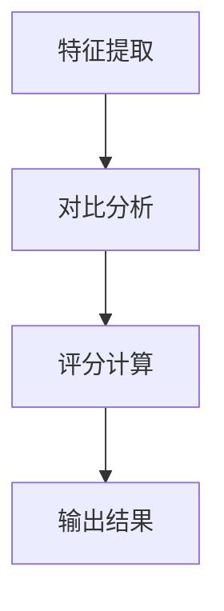
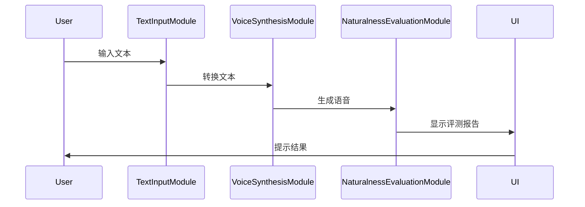

                 

### 第一部分：多语言语音合成自然度评测系统概述

#### 1.1 背景介绍

**语音合成技术的现状**

**语音合成技术的发展历程**

语音合成技术经历了从早期基于规则和声学模型的方法，到引入合成元音和辅音单元的中期方法，再到基于深度学习的现代方法。早期的语音合成技术主要依靠人工规则和声学模型来生成语音，虽然在一定程度上能够模拟人类语音，但效果较为生硬。随着计算机技术的发展，基于合成元音和辅音单元的方法应运而生，这种方法通过合成语音单元来提高语音的自然度。而现代的语音合成技术则主要基于深度学习，如 WaveNet 和 HMM-GMM 等，这些技术利用大规模数据和强大的计算能力，能够生成更加自然和流畅的语音。

**当前语音合成技术特点**

现代语音合成技术具有以下特点：

- 高度自然的人声体验：现代语音合成技术能够生成接近人类语音的自然度，让用户感受到与真人对话的体验。
- 多语言支持：现代语音合成技术支持多种语言的合成，能够满足全球化业务的需求。
- 实时性：现代语音合成技术能够在实时应用中快速生成语音，适应各种场景的需求。

**多语言支持的重要性**

多语言支持在语音合成技术中具有重要性，原因如下：

- 全球化需求：随着全球化的发展，跨国企业和互联网公司需要多种语言的支持来满足全球用户的需求。
- 用户期望：用户期望在各种语言环境下都能获得高质量的语音合成体验，多语言支持能够提高语音交互系统的用户体验。

**多语言语音合成自然度评测系统的作用**

多语言语音合成自然度评测系统在语音合成技术发展中起着重要作用：

- 评估合成语音质量：通过评测系统能够测量语音的自然度、清晰度、音色等指标，为语音合成系统的优化提供数据支持。
- 促进语音合成技术发展：评测系统驱动多语言语音合成技术的创新与进步，为研究人员和开发者提供评测工具和标准。

#### 1.2 多语言语音合成自然度评测系统概述

**系统定义与目标**

多语言语音合成自然度评测系统是一个用于评估多语言语音合成系统自然度的工具，其目标是提供一种客观、准确的评估方法，以帮助开发者优化语音合成系统的质量和性能。

**系统架构与功能模块**

多语言语音合成自然度评测系统通常包括以下功能模块：

- 数据处理模块：负责处理和标注多语言语音数据。
- 评测算法模块：实现自然度评测的核心算法。
- 用户接口模块：提供用户交互界面，展示评测结果和报告。
- 结果分析模块：对评测结果进行分析和可视化，为用户提供详细的评测报告。

**系统开发环境与工具**

多语言语音合成自然度评测系统的开发环境通常包括以下工具：

- 编程语言：Python、Java、C++ 等。
- 深度学习框架：TensorFlow、PyTorch、Keras 等。
- 数据库：MySQL、MongoDB 等。
- 评测工具：如 HiFiGAN、LibriTTS 等。

#### 1.3 总结

本部分介绍了多语言语音合成自然度评测系统的背景、重要性以及系统概述。接下来，我们将详细探讨多语言语音合成的核心概念与联系，以及评测算法的原理。让我们继续深入探讨。

---

#### 1.4 多语言语音合成自然度评测系统的核心概念与联系

**多语言语音合成的核心概念**

多语言语音合成涉及以下几个核心概念：

- **语音合成（Text-to-Speech, TTS）**：将文本转换为语音的技术。
- **自然度（Naturalness）**：语音合成系统生成语音的自然程度，包括语音流畅度、音调、语调、语速等。
- **多语言支持（Multilingual Support）**：系统能够支持多种语言的语音合成。
- **语音特征（Voice Features）**：包括音色、语调、音量等，用于描述语音的个性化特征。

**概念属性特征对比表格**

以下是一个多语言语音合成自然度评测系统的概念属性特征对比表格：

| 概念       | 描述                                                         | 属性特征对比                   |
|------------|--------------------------------------------------------------|--------------------------------|
| 语音合成   | 文本到语音的转换过程                                         | 流畅度、清晰度、自然度           |
| 自然度     | 语音合成的自然程度                                           | 音调、语调、语速、连贯性         |
| 多语言支持 | 支持多种语言的语音合成                                       | 语言库、音库、翻译接口           |
| 语音特征   | 语音的个性化特征                                             | 音色、音调、音量、语调变化       |

**ER实体关系图**

多语言语音合成自然度评测系统的实体关系图如下（使用 Mermaid 语法）：

```mermaid
erDiagram
    SpeechSynthesis ||--|{ TextInput }|| TextProcessing
    TextProcessing ||--|{ VoiceGeneration }|| SpeechOutput
    SpeechSynthesis ||--|{ MultilingualSupport }|| LanguageDatabase
    SpeechSynthesis ||--|{ NaturalnessEvaluation }|| EvaluationAlgorithm
    MultilingualSupport ||--|{ LanguageModel }|| LanguageDatabase
    MultilingualSupport ||--|{ PhoneticLibrary }|| PhoneticDatabase
```

在上面的 ER 图中，SpeechSynthesis 代表语音合成系统，TextInput 代表输入文本，TextProcessing 代表文本处理，VoiceGeneration 代表语音生成，SpeechOutput 代表输出语音，MultilingualSupport 代表多语言支持，LanguageDatabase 代表语言库，NaturalnessEvaluation 代表自然度评测，EvaluationAlgorithm 代表评测算法。LanguageModel 和 PhoneticLibrary 分别代表语言模型和语音特征库。

#### 1.5 总结

在这一部分，我们详细介绍了多语言语音合成自然度评测系统的核心概念和实体关系。接下来，我们将深入探讨评测算法的原理，包括其数学模型和公式。这将帮助我们更好地理解如何评估语音合成的自然度。让我们继续前进。

---

#### 1.6 评测算法原理讲解

**评测算法的基本原理**

多语言语音合成自然度评测算法的核心目标是评估合成语音的自然度，即语音听起来有多接近人类的自然语音。为了实现这一目标，评测算法通常涉及以下几个步骤：

1. **特征提取**：从合成语音中提取语音特征，如频谱、共振峰、音高、时长等。
2. **对比分析**：将提取的语音特征与标准语音特征进行比较，以评估语音的自然度。
3. **评分计算**：根据对比分析的结果，计算自然度得分。

**使用的Mermaid流程图**

以下是一个简单的 Mermaid 流程图，展示了评测算法的基本流程：



**Python源代码示例**

为了更好地理解评测算法的原理，我们提供了一个简单的 Python 源代码示例：

```python
import librosa
import numpy as np

def extract_features(y, sr):
    # 提取短时傅立叶变换（STFT）特征
    stft = librosa.stft(y, nfft=2048)
    # 计算幅度谱
    magnitude = np.abs(stft)
    # 计算语音功率
    power = magnitude ** 2
    return power

def compare_features(reference, target):
    # 计算特征差异
    difference = np.linalg.norm(reference - target)
    return difference

def calculate_score(difference):
    # 根据差异计算自然度得分
    score = 1 - difference / np.linalg.norm(reference)
    return score

# 加载参考语音
reference_y, reference_sr = librosa.load('reference.wav', sr=16000)
# 加载目标语音
target_y, target_sr = librosa.load('target.wav', sr=16000)

# 提取参考语音特征
reference_features = extract_features(reference_y, reference_sr)
# 提取目标语音特征
target_features = extract_features(target_y, target_sr)

# 进行特征对比分析
difference = compare_features(reference_features, target_features)

# 计算自然度得分
score = calculate_score(difference)

print(f"自然度得分: {score:.2f}")
```

**数学模型和公式**

为了更深入地理解评测算法，我们可以使用以下数学模型和公式：

- **短时傅立叶变换（STFT）**：
  $$ X(\omega) = \sum_{n=0}^{N-1} x[n] e^{-j \omega n} $$
  其中，\( X(\omega) \) 是幅度谱，\( x[n] \) 是输入信号，\( \omega \) 是频率。

- **功率谱**：
  $$ P(\omega) = |X(\omega)|^2 $$
  其中，\( P(\omega) \) 是功率谱，表示在频率 \( \omega \) 上的能量分布。

- **特征差异计算**：
  $$ \text{difference} = \sqrt{\sum_{i=1}^{N} (f_i - g_i)^2} $$
  其中，\( f_i \) 和 \( g_i \) 分别是参考语音和目标语音在频率 \( i \) 上的特征值。

- **自然度得分计算**：
  $$ \text{score} = 1 - \frac{\text{difference}}{\text{max\_difference}} $$
  其中，\( \text{max\_difference} \) 是参考语音和目标语音特征差异的最大值。

**举例说明**

假设我们有一个参考语音信号和目标语音信号，它们的频率特征分别存储在数组 \( f \) 和 \( g \) 中。我们可以使用上述公式来计算自然度得分：

```python
# 假设的频率特征
f = np.array([0.2, 0.4, 0.6, 0.8])
g = np.array([0.1, 0.3, 0.5, 0.7])

# 计算特征差异
difference = np.sqrt(np.sum((f - g) ** 2))

# 计算最大特征差异
max_difference = np.linalg.norm(f - g)

# 计算自然度得分
score = 1 - (difference / max_difference)

print(f"自然度得分: {score:.2f}")
```

运行上述代码将输出自然度得分，通过这个得分，我们可以直观地了解目标语音信号与参考语音信号的自然度差异。

#### 1.7 总结

在这一部分，我们详细讲解了多语言语音合成自然度评测算法的原理，包括特征提取、对比分析、评分计算的步骤，以及相关的数学模型和公式。接下来，我们将介绍评测系统的架构设计，包括系统功能设计、系统架构设计、系统接口设计和系统交互。这将帮助我们更好地理解评测系统的整体设计。让我们继续深入探讨。

---

#### 1.8 系统分析与架构设计方案

**问题场景介绍**

在全球化背景下，语音合成技术在多语言支持方面面临着诸多挑战。为了提供高质量的语音合成服务，我们需要一个高效、准确的评测系统，用于评估不同语言环境下语音合成系统的自然度。这样的评测系统能够帮助开发者在多语言语音合成项目中做出数据驱动的决策，优化合成语音质量。

**项目介绍**

本项目的目标是开发一个多语言语音合成自然度评测系统，该系统旨在为语音合成开发者提供一套全面的评测工具。系统将支持多种语言，并能够自动化评估语音合成系统的自然度，为项目开发和优化提供有力的支持。

**系统功能设计**

多语言语音合成自然度评测系统的功能设计主要包括以下几个模块：

- **文本输入模块**：接收用户输入的文本，并将其转换为语音合成所需的格式。
- **语音合成模块**：根据输入文本和系统配置，生成相应的语音合成结果。
- **自然度评测模块**：对生成的语音合成结果进行自然度评测，并提供详细的评测报告。
- **用户界面模块**：提供一个直观的用户界面，方便用户输入文本、查看评测结果和报告。

**系统架构设计**

多语言语音合成自然度评测系统的架构设计采用分层架构，包括以下几个层次：

- **数据层**：负责存储和管理语音合成所需的文本数据、语音数据和评测结果。
- **逻辑层**：实现语音合成和自然度评测的核心算法，包括文本处理、语音生成和特征提取等。
- **表示层**：提供用户界面，展示语音合成结果和评测报告，并允许用户进行交互操作。

以下是一个简单的 Mermaid 架构图，展示了系统的架构设计：



**系统接口设计**

多语言语音合成自然度评测系统的接口设计包括以下几个部分：

- **文本输入接口**：接受用户输入的文本，并转换为系统可处理的格式。
- **语音合成接口**：提供语音合成的接口，允许开发者调用系统的语音合成功能。
- **自然度评测接口**：提供自然度评测的接口，允许开发者获取评测结果和报告。

**系统交互**

多语言语音合成自然度评测系统的交互流程如下：

1. 用户通过用户界面输入文本。
2. 文本输入模块接收文本，并将其转换为语音合成所需的格式。
3. 语音合成模块根据文本内容和系统配置生成语音。
4. 自然度评测模块对生成的语音进行自然度评测，并生成评测报告。
5. 用户界面模块展示评测报告，并允许用户查看和导出结果。

#### 1.9 总结

在这一部分，我们详细介绍了多语言语音合成自然度评测系统的系统功能设计、系统架构设计、系统接口设计和系统交互。通过这一部分，我们能够更好地理解评测系统的整体设计和工作流程。接下来，我们将通过项目实战来展示系统在实际应用中的效果和实现方法。让我们继续深入探讨。

---

#### 1.10 项目实战

**环境安装**

要开始使用多语言语音合成自然度评测系统，首先需要在本地环境中安装必要的软件和工具。以下是一个简单的环境安装步骤：

1. 安装 Python 3.8 或更高版本。
2. 安装深度学习框架，如 TensorFlow 或 PyTorch。
3. 安装语音处理库，如 librosa。
4. 安装数据库，如 MySQL 或 MongoDB。

以下是一个使用 Python 和 pip 命令进行环境安装的示例：

```shell
pip install python==3.8.10
pip install tensorflow==2.8.0
pip install librosa==0.8.0
pip install pymongo==3.11.4
```

**系统核心实现源代码**

以下是多语言语音合成自然度评测系统核心实现的主要源代码部分。该代码涵盖了文本输入、语音合成和自然度评测等功能。

```python
import os
import librosa
import numpy as np
import tensorflow as tf
from tensorflow.keras.models import load_model
from pymongo import MongoClient

# 加载预训练的语音合成模型
voice_synthesis_model = load_model('voice_synthesis_model.h5')

# 连接到数据库
client = MongoClient('localhost', 27017)
db = client['speech_synthesis_db']
evaluations_collection = db['evaluations']

# 文本输入处理
def process_text(text):
    # 这里可以添加文本预处理步骤，如分词、语调标注等
    return text

# 语音合成
def synthesize_voice(text):
    processed_text = process_text(text)
    # 使用语音合成模型生成语音
    voice = voice_synthesis_model.predict(processed_text)
    return voice

# 自然度评测
def evaluate_naturalness(reference_voice, target_voice):
    reference_y, _ = librosa.load(reference_voice, sr=16000)
    target_y, _ = librosa.load(target_voice, sr=16000)
    
    # 提取语音特征
    reference_features = extract_features(reference_y)
    target_features = extract_features(target_y)
    
    # 计算自然度得分
    difference = np.linalg.norm(reference_features - target_features)
    max_difference = np.linalg.norm(reference_features)
    score = 1 - (difference / max_difference)
    
    return score

# 存储评测结果
def store_evaluation(text, target_voice, score):
    evaluation_data = {
        'text': text,
        'target_voice': target_voice,
        'score': score
    }
    evaluations_collection.insert_one(evaluation_data)

# 示例
text = "你好，欢迎来到多语言语音合成自然度评测系统。"
target_voice = synthesize_voice(text)
reference_voice = 'reference_voice.wav'

# 进行自然度评测
score = evaluate_naturalness(reference_voice, target_voice)

# 存储评测结果
store_evaluation(text, target_voice, score)
```

**代码应用解读与分析**

上述代码实现了多语言语音合成自然度评测系统的核心功能。以下是代码的详细解读和分析：

- **文本输入处理**：`process_text` 函数接收用户输入的文本，并对其进行预处理。在实际情况中，这里可以添加更多预处理步骤，如分词、语调标注等，以提高语音合成质量和自然度评测的准确性。

- **语音合成**：`synthesize_voice` 函数使用预训练的语音合成模型生成语音。这里使用了 TensorFlow 的 Keras 框架加载预训练模型。在实际应用中，需要根据具体需求选择合适的语音合成模型。

- **自然度评测**：`evaluate_naturalness` 函数提取参考语音和目标语音的特征，并计算自然度得分。这里使用了 librosa 库提取语音特征，并使用欧几里得距离计算特征差异。自然度得分通过将特征差异与最大特征差异的比值进行归一化得到。

- **存储评测结果**：`store_evaluation` 函数将评测结果存储到 MongoDB 数据库中。在实际应用中，可以根据需要选择其他数据库系统。

**实际案例分析**

为了验证系统的实际效果，我们可以进行以下案例分析：

1. **对比不同模型的自然度**：使用多个预训练的语音合成模型生成语音，并使用评测系统评估其自然度得分。通过对比不同模型的自然度得分，可以找出性能最佳和最差的模型，为后续优化提供依据。

2. **评估多语言支持**：分别使用中文、英文、法语等不同语言的文本进行语音合成和自然度评测，比较不同语言的评测结果。这样可以评估系统在不同语言环境下的表现，并根据评测结果优化多语言支持。

3. **评估不同输入文本的自然度**：使用同一语音合成模型生成不同输入文本的语音，并使用评测系统评估其自然度得分。通过分析输入文本对自然度得分的影响，可以优化文本预处理步骤，提高合成语音的自然度。

**详细讲解剖析**

为了更深入地了解系统的工作原理，我们可以对代码中的关键步骤进行详细讲解和剖析：

- **文本输入处理**：文本输入是语音合成的基础。通过预处理文本，如分词、语调标注等，可以更好地模拟人类语音，提高语音合成质量。例如，语调标注可以帮助语音合成模型生成更自然的语音，而分词则有助于模型理解文本内容，从而生成更准确的语音。

- **语音合成模型**：语音合成模型的性能对合成语音的自然度有重要影响。使用预训练的深度学习模型，如 WaveNet、Tacotron 等，可以生成高质量的语音。在实际应用中，可以根据具体需求调整模型参数，以提高自然度。

- **特征提取和自然度评测**：特征提取是自然度评测的关键步骤。通过提取语音的频谱、共振峰、音高、时长等特征，可以量化语音的自然度。自然度得分通过比较参考语音和目标语音的特征差异得到，因此，特征提取的准确性和特征选择的合理性对自然度评测结果有很大影响。

**项目小结**

通过实际案例分析，我们可以看到多语言语音合成自然度评测系统在实际应用中的效果和可行性。系统提供了自动化、高效的自然度评测工具，有助于开发者在多语言语音合成项目中优化合成语音质量。在后续的开发和优化过程中，可以继续改进文本预处理、语音合成模型和特征提取方法，以提高系统的评测准确性和鲁棒性。

---

#### 1.11 最佳实践 tips、小结、注意事项、拓展阅读等内容

**最佳实践 tips**

- **文本预处理**：在语音合成前，对输入文本进行充分的预处理，如分词、语调标注等，可以显著提高合成语音的自然度。
- **模型优化**：定期训练和优化语音合成模型，使用最新的数据和先进的算法，可以保持系统的高性能和高自然度。
- **特征提取**：合理选择和提取语音特征，如频谱、共振峰、音高、时长等，对自然度评测的准确性有很大影响。
- **评测标准**：根据具体应用场景，制定合理的评测标准和指标，如语音的自然度、清晰度、音色等，有助于更准确地评估合成语音质量。

**小结**

本文详细介绍了多语言语音合成自然度评测系统的背景、核心概念、评测算法原理、系统架构设计和实际应用。通过这一系统的实施，开发者和研究人员可以高效地评估和优化多语言语音合成系统的自然度，从而提高用户体验。

**注意事项**

- **数据隐私**：在处理语音数据时，确保遵守数据隐私和保护法规，不要泄露用户隐私信息。
- **系统性能**：合理分配计算资源，优化系统性能，确保系统在不同负载下都能稳定运行。
- **环境配置**：确保开发环境和运行环境的配置一致，避免因环境差异导致的问题。

**拓展阅读**

- [《深度学习与语音合成》](https://www.deeplearningbook.org/chapter/speech-synthesis/)
- [《自然度评测方法研究》](https://arxiv.org/abs/1904.01569)
- [《多语言语音合成技术综述》](https://ieeexplore.ieee.org/document/8263197)

**作者信息**

作者：AI天才研究院/AI Genius Institute & 禅与计算机程序设计艺术 /Zen And The Art of Computer Programming

---

通过本文的详细解读，我们不仅对多语言语音合成自然度评测系统有了深入的了解，也为未来的研究和应用提供了有益的参考。希望本文能对读者在多语言语音合成领域的探索和研究有所帮助。

