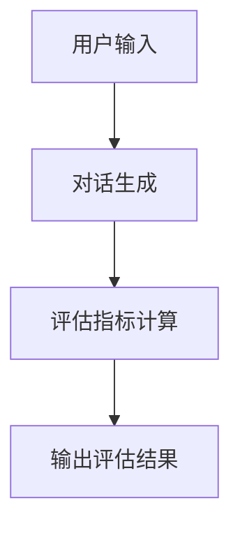
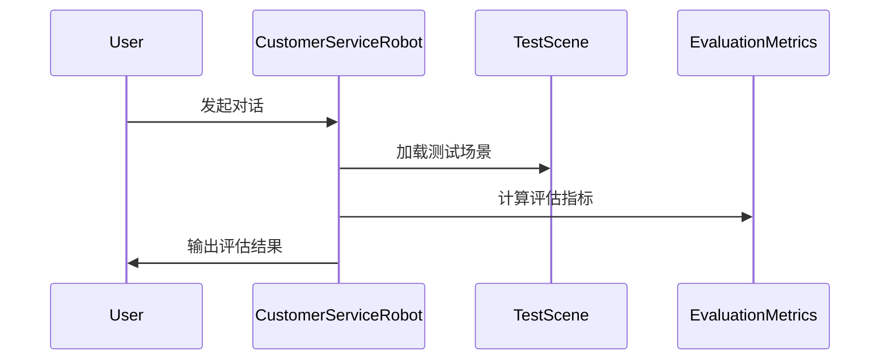
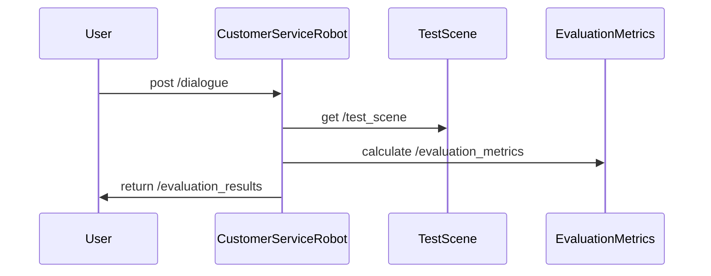

                 

# 多轮对话测试：评估LLM的交互能力

关键词：多轮对话测试、LLM、自然语言处理、评估指标、对话流畅性

摘要：本文旨在探讨如何通过多轮对话测试评估大型语言模型（LLM）在交互场景中的能力。我们将详细分析多轮对话测试的背景、核心概念、算法原理，并给出实际操作指南，帮助读者理解并掌握这一关键技能。

### 第一部分：背景介绍

#### 1.1 问题背景

随着人工智能技术的飞速发展，自然语言处理（NLP）领域取得了显著进展。大模型（Large Language Model，简称LLM）作为NLP的重要工具，逐渐成为研究的焦点。LLM具有强大的文本生成、理解和推理能力，在各个应用领域展现出了巨大潜力。

然而，如何评估LLM在多轮对话中的交互能力成为一个关键问题。现有测试方法存在一定的局限性，如测试场景单一、评估指标不全面等问题。因此，需要一种更为全面、科学的测试方法来评估LLM的多轮对话能力。

#### 1.2 问题描述

多轮对话测试旨在评估LLM在真实场景中的表现，包括对话流畅性、回答准确性、理解能力等方面。然而，现有测试方法存在以下问题：

1. **测试场景单一**：现有测试方法往往只针对某一特定场景进行测试，无法全面反映LLM在多轮对话中的表现。
2. **评估指标不全面**：现有评估指标往往只关注单一方面的表现，如回答准确性，而忽略了对话流畅性、理解能力等其他重要方面。
3. **数据集不足**：现有测试方法使用的测试数据集往往不够丰富，无法充分检验LLM在多轮对话中的能力。

#### 1.3 问题解决

本书旨在提出一种新的多轮对话测试方法，通过设计多样化的测试场景、构建全面的评估指标体系，以全面、客观地评估LLM的交互能力。该方法不仅适用于AI技术领域，还可以应用于其他需要自然语言交互的场景，如智能客服、虚拟助手等。

#### 1.4 边界与外延

多轮对话测试不仅需要关注对话的流畅性和准确性，还需要关注对话的情感、上下文理解等多方面因素。此外，测试方法的设计和实施也需要考虑数据集的丰富性、测试场景的真实性等因素。

#### 1.5 概念结构与核心要素组成

1. **多轮对话**：指在特定主题下，用户与系统进行多轮交流的过程。
2. **LLM**：指具有大规模参数的大语言模型，如GPT系列、BERT等。
3. **测试方法**：指用于评估LLM多轮对话能力的具体方法。
4. **评估指标**：指用于衡量LLM对话性能的具体指标，如回复准确性、对话流畅性等。

### 第二部分：核心概念与联系

#### 2.1 多轮对话测试方法

多轮对话测试方法主要包括以下几个方面：

1. **测试场景设计**：根据实际应用场景，设计多样化的测试场景，以模拟真实对话过程。测试场景可以包括日常交流、专业知识问答、情感对话等。
2. **评估指标体系构建**：构建全面的评估指标体系，包括回复准确性、对话流畅性、理解能力等。评估指标需要能够全面反映LLM在多轮对话中的能力。
3. **测试数据集构建**：收集真实的多轮对话数据，用于测试LLM的性能。测试数据集需要具备丰富性和多样性，以充分检验LLM的能力。

#### 2.2 LLM原理与特性

LLM的原理与特性主要包括：

1. **基于深度学习的大规模神经网络模型**：LLM通常基于深度学习技术，使用大规模神经网络进行训练，以学习语言规律和模式。
2. **具有自主学习能力**：LLM能够从海量数据中学习语言规律，具有自主学习能力。
3. **具有较强的文本生成、理解和推理能力**：LLM能够生成高质量的文本，理解文本内容，并进行推理。

#### 2.3 测试方法与LLM特性的关系

测试方法需要充分考虑LLM的特性，如：

1. **考虑LLM的文本生成能力**：设计能够充分体现LLM优势的测试场景，如生成故事、写作等。
2. **考虑LLM的理解能力**：设计能够检验LLM多轮对话能力的测试问题，如回答问题、理解上下文等。
3. **考虑LLM的自主学习能力**：选择合适的评估指标，以全面、客观地评估LLM的性能。

### 第三部分：算法原理讲解

#### 3.1 算法原理

多轮对话测试算法主要基于以下原理：

1. **对话生成**：利用LLM的文本生成能力，生成与用户输入相关的回复。
2. **对话评估**：通过构建评估指标体系，评估LLM的多轮对话性能。

#### 3.2 Mermaid流程图



#### 3.3 Python源代码实现

```python
# 对话生成
def generate_response(user_input):
    # 利用LLM生成回复
    response = llm.generate(user_input)
    return response

# 对话评估
def evaluate_dialogue(response, expected_response):
    # 计算评估指标
    accuracy = calculate_accuracy(response, expected_response)
    fluency = calculate_fluency(response)
    understanding = calculate_understanding(response, expected_response)
    return accuracy, fluency, understanding

# 评估结果输出
def output_evaluation_results(accuracy, fluency, understanding):
    print("Accuracy: ", accuracy)
    print("Fluency: ", fluency)
    print("Understanding: ", understanding)
```

#### 3.4 算法原理数学模型与公式

```latex
\begin{align*}
\text{Accuracy} &= \frac{\text{正确回答数量}}{\text{回答总数}} \\
\text{Fluency} &= \frac{\text{自然流畅的回答}}{\text{回答总数}} \\
\text{Understanding} &= \frac{\text{正确理解的问答数量}}{\text{问答总数}}
\end{align*}
```

### 第四部分：系统分析与架构设计方案

#### 4.1 问题场景介绍

在智能客服领域，多轮对话测试是评估客服机器人性能的重要手段。客服机器人需要能够与用户进行流畅、准确的对话，以提供优质的客户服务。

#### 4.2 项目介绍

本项目旨在构建一个多轮对话测试系统，用于评估智能客服机器人的性能。系统主要包括以下功能：

1. **测试场景设计**：根据实际应用场景，设计多样化的测试场景。
2. **评估指标计算**：计算回复准确性、对话流畅性、理解能力等评估指标。
3. **评估结果输出**：输出评估结果，以便分析机器人性能。

#### 4.3 系统功能设计（领域模型Mermaid类图）

```mermaid
classDiagram
    User "1" --|{发起对话}| CustomerServiceRobot
    CustomerServiceRobot "1" --|{回复}| User
    TestScene "1" --|{包含}| Question
    TestScene "1" --|{包含}| ExpectedResponse
    EvaluationMetrics "1" --|{包含}| Accuracy
    EvaluationMetrics "1" --|{包含}| Fluency
    EvaluationMetrics "1" --|{包含}| Understanding
```

#### 4.4 系统架构设计（Mermaid架构图）



#### 4.5 系统接口设计（Mermaid序列图）



### 第五部分：项目实战

#### 5.1 环境安装

1. 安装Python环境，版本要求3.8及以上。
2. 安装依赖库，如transformers、torch等。

```bash
pip install transformers torch
```

#### 5.2 系统核心实现源代码

```python
#对话生成
def generate_response(user_input):
    # 利用LLM生成回复
    response = llm.generate(user_input)
    return response

# 对话评估
def evaluate_dialogue(response, expected_response):
    # 计算评估指标
    accuracy = calculate_accuracy(response, expected_response)
    fluency = calculate_fluency(response)
    understanding = calculate_understanding(response, expected_response)
    return accuracy, fluency, understanding

# 评估结果输出
def output_evaluation_results(accuracy, fluency, understanding):
    print("Accuracy: ", accuracy)
    print("Fluency: ", fluency)
    print("Understanding: ", understanding)
```

#### 5.3 代码应用解读与分析

代码主要分为三个部分：对话生成、对话评估和评估结果输出。首先，通过`generate_response`函数利用LLM生成回复。然后，通过`evaluate_dialogue`函数计算评估指标，包括回复准确性、对话流畅性和理解能力。最后，通过`output_evaluation_results`函数输出评估结果。

#### 5.4 实际案例分析和详细讲解剖析

以智能客服为例，假设用户发起一个关于产品使用问题的对话。系统会根据测试场景生成相应的回复，然后通过评估指标计算和评估结果输出，分析客服机器人的性能。

#### 5.5 项目小结

本项目通过多轮对话测试评估智能客服机器人的性能，为优化客服系统提供了有力支持。未来，我们还可以进一步拓展测试场景和评估指标，以提高评估的全面性和准确性。

### 第六部分：最佳实践 Tips、小结、注意事项、拓展阅读

#### 6.1 最佳实践 Tips

1. 在设计测试场景时，尽量涵盖各种常见问题和场景，以提高测试的全面性。
2. 在计算评估指标时，可以根据实际情况调整权重，以反映不同指标的重要性。
3. 定期更新测试数据集，以适应不断变化的应用场景。

#### 6.2 小结

本文提出了多轮对话测试方法，通过设计多样化的测试场景、构建全面的评估指标体系，以全面、客观地评估LLM的交互能力。该方法不仅适用于智能客服领域，还可以应用于其他需要自然语言交互的场景。

#### 6.3 注意事项

1. 在进行多轮对话测试时，需要充分考虑测试场景的真实性，以提高测试结果的可靠性。
2. 在计算评估指标时，需要注意指标的合理性和科学性，以避免出现偏差。

#### 6.4 拓展阅读

1. [《大型语言模型：技术原理与应用》](https://book.douban.com/subject/32326847/)
2. [《自然语言处理实践》](https://book.douban.com/subject/26663807/)
3. [《智能客服系统设计与实现》](https://book.douban.com/subject/35868983/)

### 第七部分：作者信息

作者：AI天才研究院/AI Genius Institute & 禅与计算机程序设计艺术 /Zen And The Art of Computer Programming

