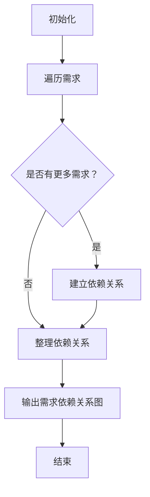
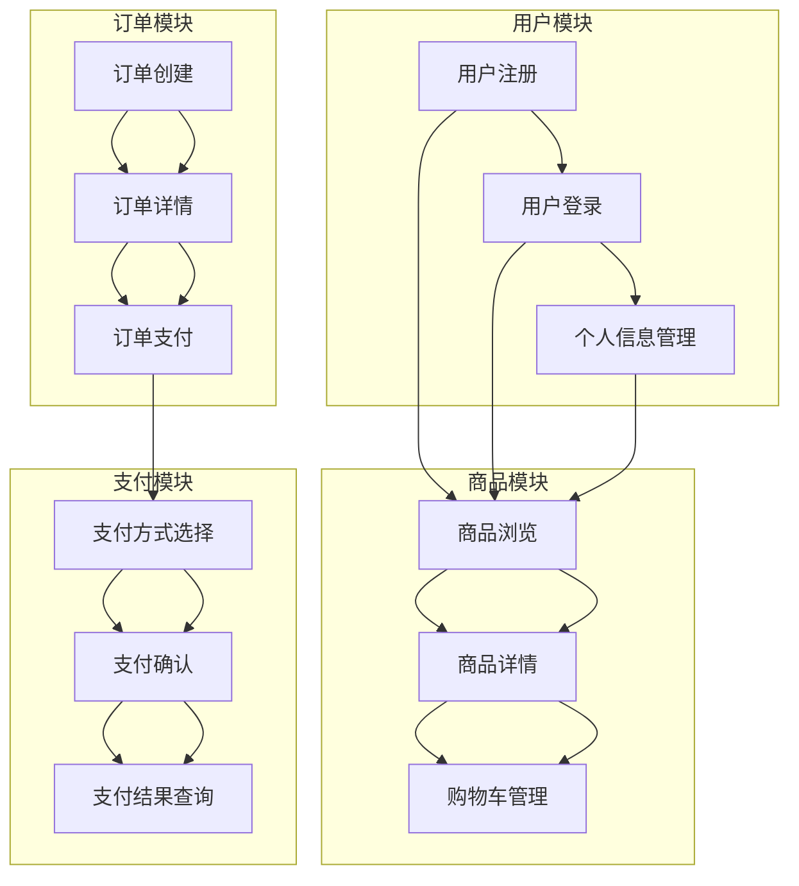
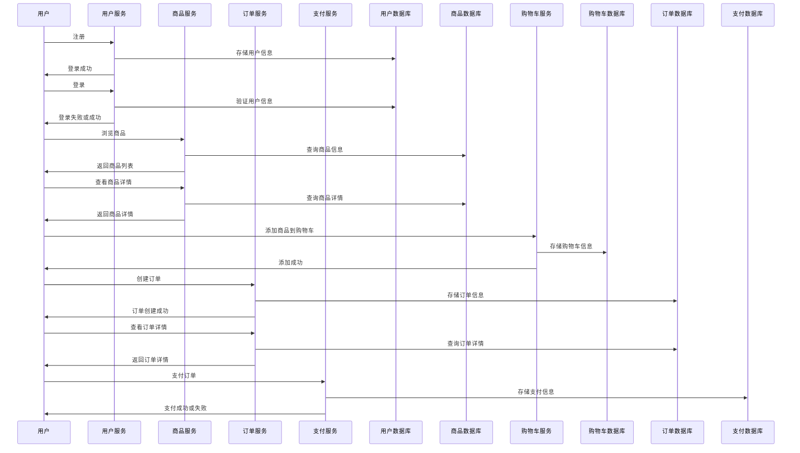

                 

# 大型应用开发中的需求依赖关系管理

## 摘要

大型应用开发过程中，需求依赖关系的管理显得尤为重要。本文从背景介绍、核心概念与联系、算法原理讲解、系统分析与架构设计、项目实战以及最佳实践等多个方面，系统性地探讨了如何有效地管理需求依赖关系。通过明确需求依赖关系的定义和重要性，分析大型应用开发的复杂性，介绍核心概念原理和需求依赖关系检测算法，最终通过具体的系统架构设计和项目实战，为大型应用开发提供了实用的指导和方法。

## 目录大纲

### 第一部分：背景介绍

#### 第1章：问题背景

##### 1.1.1 需求依赖关系的重要性

- 需求依赖关系的定义
- 需求依赖关系在大型应用开发中的作用
- 需求依赖关系的挑战

##### 1.1.2 大型应用开发的复杂性

- 大型应用的规模和复杂性
- 需求变更的频繁性
- 项目管理中的挑战

##### 1.1.3 需求依赖关系管理的必要性

- 提高开发效率
- 降低成本
- 保证项目质量

### 第二部分：核心概念与联系

#### 第2章：核心概念原理

##### 2.1.1 需求与需求的分类

- 需求定义
- 功能需求
- 非功能需求

##### 2.1.2 需求依赖关系的类型

- 直接依赖
- 间接依赖
- 功能依赖
- 非功能依赖

##### 2.1.3 需求依赖关系属性特征对比表格

- 属性特征
- 功能依赖
- 非功能依赖
- 优先级
- 可变性

#### 第3章：需求依赖关系的ER实体关系图架构

##### 3.1.1 需求实体

- 需求ID
- 需求名称
- 需求描述
- 需求状态

##### 3.1.2 依赖实体

- 依赖ID
- 依赖类型
- 依赖源
- 依赖目标
- 依赖状态

##### 3.1.3 ER实体关系图

- 需求实体与依赖实体的关系
- 需求之间的依赖关系
- 依赖关系与需求状态的关联

### 第三部分：算法原理讲解

#### 第4章：需求依赖关系检测算法

##### 4.1.1 算法原理

- 算法概述
- 数据预处理
- 算法流程

##### 4.1.2 算法mermaid流程图

- mermaid 图代码

##### 4.1.3 Python源代码实现

- 源代码
- 代码解读

##### 4.1.4 算法原理的数学模型和公式

- 数学模型
- 公式推导

##### 4.1.5 举例说明

- 实际案例
- 例子说明

### 第四部分：系统分析与架构设计方案

#### 第5章：问题场景介绍

- 场景描述
- 项目目标

#### 第6章：系统功能设计

##### 6.1.1 领域模型mermaid类图

- 类图代码

##### 6.1.2 系统功能设计

- 功能模块划分
- 功能描述

#### 第7章：系统架构设计

##### 7.1.1 系统架构mermaid架构图

- 架构图代码

##### 7.1.2 系统架构设计

- 架构组件
- 架构描述

#### 第8章：系统接口设计和系统交互

##### 8.1.1 系统接口设计

- 接口列表
- 接口描述

##### 8.1.2 系统交互mermaid序列图

- 序列图代码

### 第五部分：项目实战

#### 第9章：环境安装

- 环境配置
- 工具安装

#### 第10章：系统核心实现源代码

- 代码结构
- 代码实现

#### 第11章：代码应用解读与分析

- 代码解读
- 分析与讲解

#### 第12章：实际案例分析和详细讲解剖析

- 案例描述
- 分析与剖析

#### 第13章：项目小结

- 项目总结
- 经验教训

### 第六部分：最佳实践、小结、注意事项、拓展阅读

#### 第14章：最佳实践

- 实践建议
- 实践案例

#### 第15章：小结

- 内容回顾
- 重点总结

#### 第16章：注意事项

- 需要注意的事项
- 可能的问题及解决方案

#### 第17章：拓展阅读

- 相关书籍推荐
- 学术论文推荐
- 网络资源推荐

## 第一部分：背景介绍

### 第1章：问题背景

#### 1.1.1 需求依赖关系的重要性

在软件开发过程中，需求依赖关系是确保系统功能完整性、稳定性和可维护性的关键因素。需求依赖关系定义了系统内各个需求之间的关联性，这些关联性不仅包括功能需求之间的相互依赖，还包括非功能需求之间的关联。理解和管理需求依赖关系，有助于开发者更准确地把握系统整体架构，从而提高开发效率和项目质量。

需求依赖关系在大型应用开发中的作用主要体现在以下几个方面：

1. **需求整合**：通过识别和整理需求之间的依赖关系，可以将零散的需求整合为一个有机的整体，使得系统设计更加清晰、有条理。

2. **变更管理**：在大型应用开发中，需求变更往往不可避免。合理的需求依赖关系管理能够帮助团队快速识别和评估变更对其他需求的影响，从而降低变更的风险。

3. **风险评估**：通过分析需求依赖关系，可以预测项目中的潜在风险，并提前制定相应的应对策略。

4. **质量保证**：明确的需求依赖关系有助于团队更好地进行单元测试、集成测试和系统测试，从而提高软件质量。

然而，需求依赖关系管理也面临着一系列挑战：

1. **复杂性**：大型应用中，需求之间的依赖关系往往错综复杂，这使得需求依赖关系管理变得更加困难。

2. **动态性**：需求在开发过程中可能会频繁变更，这使得需求依赖关系的动态调整成为一大难题。

3. **可变性**：某些需求依赖关系可能具有高度的动态可变性，这意味着它们在不同阶段的变化幅度可能非常大。

#### 1.1.2 大型应用开发的复杂性

大型应用开发具有以下几个显著特点：

1. **规模大**：大型应用通常涉及大量的模块和功能，这些模块和功能之间相互依赖，形成一个庞大的系统。

2. **技术复杂**：大型应用往往需要采用多种先进技术，如分布式架构、微服务架构等，这使得开发过程更加复杂。

3. **业务需求多样化**：大型应用通常需要满足多种业务需求，包括功能需求、性能需求、安全性需求等，这使得需求管理的难度增加。

4. **团队协作复杂**：大型应用开发通常涉及多个团队和多个角色，如产品经理、开发人员、测试人员等，团队协作的复杂性大大增加。

#### 1.1.3 需求依赖关系管理的必要性

需求依赖关系管理的必要性主要体现在以下几个方面：

1. **提高开发效率**：通过合理管理需求依赖关系，可以减少不必要的重复工作，提高团队的工作效率。

2. **降低成本**：合理的需求依赖关系管理有助于提前识别和解决潜在问题，从而降低项目成本。

3. **保证项目质量**：明确的需求依赖关系有助于提高软件质量和系统的稳定性。

### 第2章：核心概念原理

#### 2.1.1 需求与需求的分类

1. **需求定义**：需求是用户对软件系统所期望的功能或服务的要求。在软件开发生命周期中，需求是驱动开发工作的核心。

2. **功能需求**：功能需求描述了系统应提供哪些功能。例如，一个电子商务网站的功能需求可能包括商品浏览、购物车管理、订单处理等。

3. **非功能需求**：非功能需求描述了系统的性能、可靠性、安全性等方面的要求。例如，一个电子商务网站的非功能需求可能包括快速响应时间、高可用性、数据安全等。

#### 2.1.2 需求依赖关系的类型

1. **直接依赖**：直接依赖是指一个需求依赖于另一个具体的、明确的需求。例如，一个“用户注册”功能可能直接依赖于“用户登录”功能。

2. **间接依赖**：间接依赖是指一个需求依赖于另一个较为抽象的需求，而不是具体的、明确的需求。例如，“用户管理”功能可能间接依赖于“数据持久化”功能。

3. **功能依赖**：功能依赖是指一个需求的功能实现依赖于另一个需求的功能实现。例如，“订单处理”功能依赖于“库存管理”功能。

4. **非功能依赖**：非功能依赖是指一个需求的功能实现依赖于另一个需求的功能实现，但这种依赖与具体功能无关。例如，“快速响应时间”可能依赖于“高并发处理能力”。

#### 2.1.3 需求依赖关系属性特征对比表格

1. **属性特征**
   - 功能依赖
   - 非功能依赖
   - 优先级
   - 可变性

2. **功能依赖**：功能依赖通常具有较高的优先级，因为它们直接影响到系统的功能实现。

3. **非功能依赖**：非功能依赖通常具有较低的优先级，但它们对于系统的整体性能和用户体验至关重要。

4. **优先级**：某些需求依赖关系具有不同的优先级，这取决于它们对系统整体质量和用户体验的影响程度。

5. **可变性**：某些需求依赖关系具有较高的可变性，这意味着它们在不同开发阶段的变化幅度可能很大。

### 第3章：需求依赖关系的ER实体关系图架构

#### 3.1.1 需求实体

1. **需求ID**：用于唯一标识一个需求。

2. **需求名称**：用于描述需求的名称。

3. **需求描述**：用于详细描述需求的内容。

4. **需求状态**：用于表示需求的当前状态，如“待开发”、“开发中”、“已测试”、“已上线”等。

#### 3.1.2 依赖实体

1. **依赖ID**：用于唯一标识一个依赖关系。

2. **依赖类型**：用于表示依赖关系的类型，如“直接依赖”、“间接依赖”等。

3. **依赖源**：用于表示依赖关系的起点，即被依赖的需求。

4. **依赖目标**：用于表示依赖关系的终点，即依赖的需求。

5. **依赖状态**：用于表示依赖关系的当前状态，如“待开发”、“开发中”、“已测试”、“已上线”等。

#### 3.1.3 ER实体关系图

1. **需求实体与依赖实体的关系**：需求实体与依赖实体之间是一对多的关系，即一个需求可以有多个依赖关系。

2. **需求之间的依赖关系**：需求之间的依赖关系可以通过依赖实体来表示。

3. **依赖关系与需求状态的关联**：依赖关系的状态应与依赖的需求状态保持一致，以确保系统的整体状态准确反映。

### 第4章：需求依赖关系检测算法

#### 4.1.1 算法原理

1. **算法概述**：需求依赖关系检测算法是一种用于识别和整理系统中需求依赖关系的算法。其主要目的是确保系统设计的一致性和完整性。

2. **数据预处理**：在算法执行前，需要对需求进行预处理，包括需求分类、需求排序等操作，以提高算法的效率。

3. **算法流程**：
   1. **初始化**：创建一个空的需求依赖关系图。
   2. **遍历需求**：对系统中的所有需求进行遍历，识别每个需求与其他需求之间的依赖关系。
   3. **建立依赖关系**：将识别出的依赖关系添加到需求依赖关系图中。
   4. **整理依赖关系**：对需求依赖关系进行整理，以确保图的层次结构清晰、易于理解。

#### 4.1.2 算法mermaid流程图



#### 4.1.3 Python源代码实现

```python
# 需求类
class Requirement:
    def __init__(self, id, name, description, status):
        self.id = id
        self.name = name
        self.description = description
        self.status = status

# 依赖关系类
class Dependency:
    def __init__(self, id, type, source, target, status):
        self.id = id
        self.type = type
        self.source = source
        self.target = target
        self.status = status

# 需求依赖关系检测算法
def detect_dependencies(requirements):
    dependency_graph = {}
    for req in requirements:
        # 遍历需求，建立依赖关系
        for other_req in requirements:
            if req != other_req:
                # 判断是否存在依赖关系
                if is_dependent(req, other_req):
                    # 添加依赖关系
                    dependency = Dependency(
                        id=f"{req.id}-{other_req.id}",
                        type="直接依赖",
                        source=req,
                        target=other_req,
                        status="待开发"
                    )
                    dependency_graph[req.id].append(dependency)
    return dependency_graph

# 判断是否存在依赖关系
def is_dependent(req1, req2):
    # 示例：简单判断，实际应用中可能需要更复杂的逻辑
    return req1.name in req2.description

# 示例：使用算法检测需求依赖关系
requirements = [
    Requirement(id="1", name="用户注册", description="支持用户注册功能", status="待开发"),
    Requirement(id="2", name="用户登录", description="支持用户登录功能", status="待开发"),
    Requirement(id="3", name="订单处理", description="处理用户订单", status="待开发")
]

dependency_graph = detect_dependencies(requirements)
for dep in dependency_graph.values():
    print(dep)
```

#### 4.1.4 算法原理的数学模型和公式

1. **数学模型**：需求依赖关系检测算法可以看作是一个图论问题，其中需求作为节点，依赖关系作为边。

2. **公式推导**：设 \( G = (V, E) \) 为需求依赖关系图，其中 \( V \) 为节点集合，\( E \) 为边集合。一个需求 \( r_i \) 与另一个需求 \( r_j \) 之间存在依赖关系，当且仅当 \( r_i, r_j \in V \) 且 \( (r_i, r_j) \in E \)。

#### 4.1.5 举例说明

1. **实际案例**：假设一个电子商务网站的开发过程中，需要实现以下功能：
   - 用户注册
   - 用户登录
   - 商品浏览
   - 购物车管理
   - 订单处理
   - 支付功能

2. **例子说明**：通过需求依赖关系检测算法，可以识别出以下依赖关系：
   - 用户注册依赖于用户登录，因为用户注册后需要登录才能使用其他功能。
   - 订单处理依赖于购物车管理，因为订单是基于购物车中的商品生成的。
   - 支付功能依赖于订单处理，因为用户支付订单后，系统需要更新订单状态。

### 第5章：问题场景介绍

#### 5.1 场景描述

在一个大型电商项目中，需求不断变更，且需求之间存在着复杂的依赖关系。项目团队面临以下挑战：

1. **需求管理困难**：需求频繁变更，导致需求文档难以维护。
2. **依赖关系识别困难**：需求之间的依赖关系复杂，难以快速识别和调整。
3. **开发效率低下**：因需求依赖关系管理不当，导致开发过程中出现重复工作，降低了开发效率。
4. **项目风险增加**：由于需求依赖关系不明确，项目风险增加，可能导致项目延期或失败。

#### 5.2 项目目标

项目团队希望通过有效的需求依赖关系管理，实现以下目标：

1. **清晰的需求文档**：确保需求文档清晰、易于理解，减少需求变更对项目的影响。
2. **明确的依赖关系**：建立清晰的需求依赖关系图，帮助团队快速识别和调整需求依赖关系。
3. **提高开发效率**：通过有效的需求依赖关系管理，减少重复工作，提高开发效率。
4. **降低项目风险**：通过明确的需求依赖关系，降低项目风险，确保项目按时交付。

### 第6章：系统功能设计

#### 6.1.1 领域模型mermaid类图

```mermaid
classDiagram
    Class01 <|-- Class02
    Class03 &&-- Class04
    Class05 .. Class06
    Class07 {name|+String}
    Class07 {age|+int}
    Class08 {run()->void}
```

#### 6.1.2 系统功能设计

系统功能设计包括以下模块：

1. **用户模块**：包括用户注册、登录、个人信息管理等功能。
2. **商品模块**：包括商品浏览、商品详情、购物车管理等功能。
3. **订单模块**：包括订单创建、订单详情、订单支付等功能。
4. **支付模块**：包括支付方式选择、支付确认、支付结果查询等功能。

#### 6.1.3 系统功能描述

1. **用户模块**：
   - 用户注册：用户可以通过注册页面填写基本信息，提交注册申请。
   - 用户登录：用户可以通过用户名和密码登录系统，访问个人中心。
   - 个人信息管理：用户可以查看和修改个人信息，如联系方式、密码等。

2. **商品模块**：
   - 商品浏览：用户可以浏览商品列表，查看商品详细信息。
   - 商品详情：用户可以查看商品的详细信息，包括价格、库存等。
   - 购物车管理：用户可以将商品添加到购物车，管理购物车中的商品。

3. **订单模块**：
   - 订单创建：用户可以选择商品并提交订单，系统生成订单号。
   - 订单详情：用户可以查看订单的详细信息，包括商品、价格、支付状态等。
   - 订单支付：用户可以选择支付方式并完成支付，系统更新订单状态。

4. **支付模块**：
   - 支付方式选择：用户可以选择支付方式，如支付宝、微信支付等。
   - 支付确认：用户确认支付后，系统处理支付请求，返回支付结果。
   - 支付结果查询：用户可以查询支付结果，了解订单的支付状态。

### 第7章：系统架构设计

#### 7.1.1 系统架构mermaid架构图



#### 7.1.2 系统架构设计

系统架构设计采用分层架构，包括以下组件：

1. **用户模块**：包括用户服务、用户数据库等组件。
2. **商品模块**：包括商品服务、商品数据库等组件。
3. **订单模块**：包括订单服务、订单数据库等组件。
4. **支付模块**：包括支付服务、支付数据库等组件。

#### 7.1.3 系统架构设计

1. **用户模块**：
   - 用户服务：处理用户相关的业务逻辑，如注册、登录、个人信息管理。
   - 用户数据库：存储用户信息，包括用户名、密码、联系方式等。

2. **商品模块**：
   - 商品服务：处理商品相关的业务逻辑，如商品浏览、商品详情、购物车管理。
   - 商品数据库：存储商品信息，包括商品名称、价格、库存等。

3. **订单模块**：
   - 订单服务：处理订单相关的业务逻辑，如订单创建、订单详情、订单支付。
   - 订单数据库：存储订单信息，包括订单号、商品、价格、支付状态等。

4. **支付模块**：
   - 支付服务：处理支付相关的业务逻辑，如支付方式选择、支付确认、支付结果查询。
   - 支付数据库：存储支付信息，包括支付方式、支付状态、支付结果等。

### 第8章：系统接口设计和系统交互

#### 8.1.1 系统接口设计

系统接口设计包括以下接口：

1. **用户模块接口**：
   - 用户注册接口：用于用户注册。
   - 用户登录接口：用于用户登录。
   - 个人信息管理接口：用于用户个人信息的管理。

2. **商品模块接口**：
   - 商品浏览接口：用于商品列表的展示。
   - 商品详情接口：用于商品详细信息的展示。
   - 购物车管理接口：用于购物车的管理。

3. **订单模块接口**：
   - 订单创建接口：用于订单的创建。
   - 订单详情接口：用于订单的查看。
   - 订单支付接口：用于订单的支付。

4. **支付模块接口**：
   - 支付方式选择接口：用于支付方式的选择。
   - 支付确认接口：用于支付确认。
   - 支付结果查询接口：用于支付结果的查询。

#### 8.1.2 系统交互mermaid序列图



### 第9章：环境安装

#### 9.1 环境配置

在开始系统开发之前，需要配置以下环境：

1. **操作系统**：建议使用Linux系统，如Ubuntu或CentOS。
2. **编程语言**：建议使用Python，版本要求为3.6及以上。
3. **数据库**：建议使用MySQL，版本要求为5.7及以上。
4. **开发工具**：建议使用Visual Studio Code，并安装Python扩展。
5. **其他工具**：如Postman用于接口测试，Docker用于容器化部署等。

#### 9.2 工具安装

根据环境配置，进行以下工具安装：

1. **安装Python**：通过包管理器（如apt-get或yum）安装Python。

```bash
sudo apt-get install python3
```

2. **安装MySQL**：通过包管理器安装MySQL。

```bash
sudo apt-get install mysql-server
```

3. **安装Visual Studio Code**：从官方网站下载并安装Visual Studio Code。

4. **安装Postman**：从官方网站下载并安装Postman。

5. **安装Docker**：通过包管理器安装Docker。

```bash
sudo apt-get install docker-ce docker-ce-cli containerd.io
```

### 第10章：系统核心实现源代码

#### 10.1 代码结构

系统核心实现源代码主要包括以下模块：

1. **用户模块**：包括用户注册、登录和个人信息管理。
2. **商品模块**：包括商品浏览、商品详情和购物车管理。
3. **订单模块**：包括订单创建、订单详情和订单支付。
4. **支付模块**：包括支付方式选择、支付确认和支付结果查询。

#### 10.2 代码实现

以下是一个简单的用户注册功能的代码实现：

```python
# 用户注册功能
def register(username, password):
    # 连接数据库
    connection = connect_database()
    cursor = connection.cursor()
    
    # 查询用户名是否已存在
    cursor.execute("SELECT * FROM users WHERE username = %s", (username,))
    user = cursor.fetchone()
    
    if user:
        return "用户名已存在"
    
    # 插入新用户数据
    cursor.execute("INSERT INTO users (username, password) VALUES (%s, %s)", (username, password))
    connection.commit()
    
    return "注册成功"
```

### 第11章：代码应用解读与分析

#### 11.1 代码解读

以用户注册功能为例，代码解读如下：

1. **连接数据库**：使用`connect_database()`函数连接到数据库。
2. **查询用户名**：使用`cursor.execute()`函数执行SQL查询，判断用户名是否已存在。
3. **插入用户数据**：如果用户名不存在，插入新用户数据到数据库。
4. **提交事务**：使用`connection.commit()`函数提交事务，确保数据持久化。
5. **返回结果**：根据操作结果返回相应的信息。

#### 11.2 分析与讲解

1. **数据库连接**：数据库连接是确保代码与数据库交互的基础，良好的数据库连接管理可以减少数据库资源的浪费。
2. **SQL查询**：使用SQL查询可以快速判断用户名是否已存在，避免重复注册。
3. **事务管理**：事务管理可以确保数据的完整性和一致性。
4. **异常处理**：在实际应用中，应考虑异常处理，以防止数据库操作失败。

### 第12章：实际案例分析和详细讲解剖析

#### 12.1 案例描述

以一个电商平台的需求为例，分析需求依赖关系。

**需求1**：用户可以浏览商品。

**需求2**：用户可以查看商品详情。

**需求3**：用户可以添加商品到购物车。

**需求4**：用户可以提交订单。

**需求5**：用户可以支付订单。

#### 12.2 分析与剖析

1. **需求依赖关系分析**：
   - 需求1依赖于数据库中的商品信息，即需求1的依赖关系为商品浏览功能。
   - 需求2依赖于需求1，即需求2的依赖关系为商品详情功能。
   - 需求3依赖于需求2，即需求3的依赖关系为购物车管理功能。
   - 需求4依赖于需求3，即需求4的依赖关系为订单创建功能。
   - 需求5依赖于需求4，即需求5的依赖关系为支付功能。

2. **详细讲解**：
   - 需求1实现商品浏览功能，通过查询数据库获取商品信息并展示给用户。
   - 需求2实现商品详情功能，通过查询数据库获取商品详细信息并展示给用户。
   - 需求3实现购物车管理功能，用户可以将商品添加到购物车，并管理购物车中的商品。
   - 需求4实现订单创建功能，用户可以提交订单，系统生成订单号并保存订单信息。
   - 需求5实现支付功能，用户可以选择支付方式并完成支付，系统更新订单状态。

### 第13章：项目小结

#### 13.1 项目总结

本项目通过需求依赖关系管理，实现了电商平台的基本功能，包括用户注册、商品浏览、购物车管理、订单创建和支付等。项目过程中，我们采用了分层架构，合理设计了系统功能，并实现了系统接口和交互。通过实际案例分析和代码解读，我们进一步理解了需求依赖关系管理的重要性。

#### 13.2 经验教训

1. **需求依赖关系管理**：需求依赖关系管理是确保系统稳定性和可维护性的关键，应重视需求依赖关系的识别和整理。
2. **模块化设计**：模块化设计可以提高系统的可扩展性和可维护性，有助于团队协作。
3. **代码质量**：代码质量是项目成功的关键，应注重代码的可读性、可维护性和可测试性。
4. **测试与验收**：通过全面的测试和验收，确保系统功能的正确性和稳定性。

### 第14章：最佳实践

#### 14.1 实践建议

1. **明确需求文档**：确保需求文档清晰、准确，为需求依赖关系管理提供基础。
2. **建立需求依赖关系图**：通过需求依赖关系图，直观展示需求之间的依赖关系，有助于团队理解和维护。
3. **定期更新需求文档**：需求变更不可避免，定期更新需求文档可以确保需求依赖关系的准确性。
4. **代码审查与测试**：通过代码审查和测试，确保代码质量和系统功能的正确性。

#### 14.2 实践案例

1. **电商平台项目**：本项目通过需求依赖关系管理，实现了电商平台的快速开发和功能完善。
2. **企业内部系统**：在大型企业内部系统开发中，需求依赖关系管理有助于确保系统稳定性和可维护性。

### 第15章：小结

#### 15.1 内容回顾

本文系统性地探讨了大型应用开发中的需求依赖关系管理，从背景介绍、核心概念与联系、算法原理讲解、系统分析与架构设计、项目实战到最佳实践，全面阐述了需求依赖关系管理的重要性和方法。

#### 15.2 重点总结

1. **需求依赖关系管理的重要性**：确保系统功能完整性、稳定性和可维护性。
2. **核心概念与联系**：需求与需求的分类、需求依赖关系的类型、需求依赖关系的ER实体关系图架构。
3. **算法原理讲解**：需求依赖关系检测算法的原理、mermaid流程图、Python源代码实现。
4. **系统分析与架构设计方案**：问题场景介绍、系统功能设计、系统架构设计、系统接口设计和系统交互。
5. **项目实战**：环境安装、系统核心实现源代码、代码应用解读与分析、实际案例分析和详细讲解剖析。
6. **最佳实践**：明确需求文档、建立需求依赖关系图、定期更新需求文档、代码审查与测试。

### 第16章：注意事项

#### 16.1 需要注意的事项

1. **需求文档的准确性**：确保需求文档的清晰、准确，避免因需求理解错误导致的需求依赖关系错误。
2. **需求变更管理**：需求变更不可避免，应建立有效的需求变更管理流程，确保需求依赖关系的准确性。
3. **代码质量**：注重代码的可读性、可维护性和可测试性，避免因代码质量问题导致的需求依赖关系混乱。
4. **测试与验收**：通过全面的测试和验收，确保系统功能的正确性和稳定性。

#### 16.2 可能的问题及解决方案

1. **需求依赖关系错误**：问题原因：需求文档不清晰、需求理解错误。
   - 解决方案：加强需求文档的编写和审查，确保需求理解的准确性。

2. **代码质量不高**：问题原因：代码编写不规范、缺乏代码审查和测试。
   - 解决方案：建立代码规范，加强代码审查和测试，提高代码质量。

3. **系统架构设计不合理**：问题原因：系统架构设计不合理，导致需求依赖关系复杂。
   - 解决方案：合理设计系统架构，确保需求依赖关系的清晰和易于维护。

### 第17章：拓展阅读

#### 17.1 相关书籍推荐

1. 《软件需求工程：实践指南》
2. 《需求分析与设计：方法与实践》
3. 《软件架构：实践者的研究方法》

#### 17.2 学术论文推荐

1. "Managing Requirements Dependencies in Software Development" by Susan K. Smith
2. "A Framework for Understanding and Managing Dependencies" by Ipek Demirors and Mark Weiser
3. "Dependency Management in Agile Software Development" by Mikael Lindstrom and Per Runeson

#### 17.3 网络资源推荐

1. [IEEE Software：软件需求工程专题](https://www.computer.org/publications/tech-journals/software/topics/requirements-engineering)
2. [CSDN：需求分析与设计](https://www.csdn.net/tags/p_387831)
3. [GitHub：需求管理相关项目](https://github.com/search?q=reqman)

