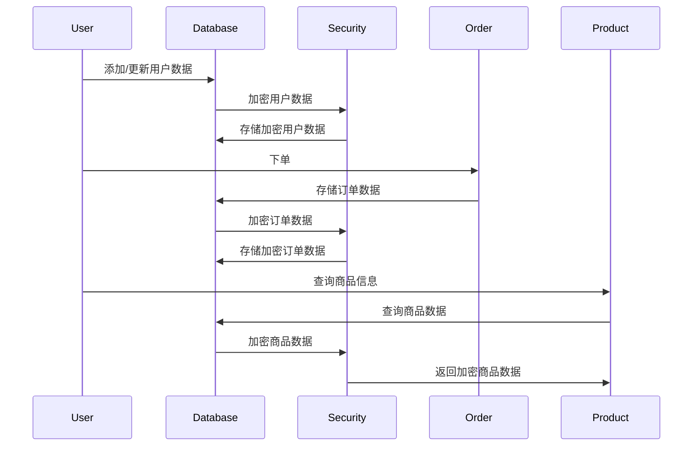
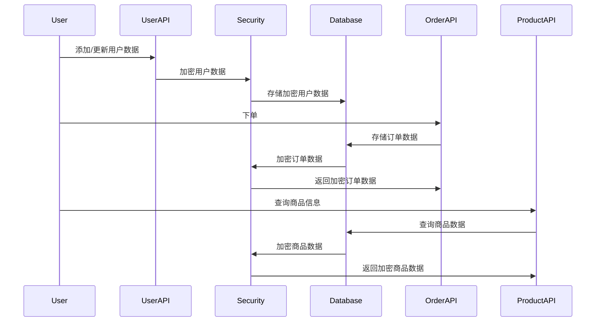

                 

# 大型应用开发中的需求安全性考量

> 关键词：大型应用开发、需求安全性、架构设计、算法原理、实践方法

> 摘要：本文深入探讨了大型应用开发中的需求安全性考量，从问题背景、核心概念、算法原理、系统架构设计、实战应用以及最佳实践等方面进行了详细分析。通过对需求安全性的深入理解，帮助开发者更好地把握大型应用的安全开发，提升系统的可靠性和稳定性。

## 目录大纲

1. **背景介绍**
   1.1 问题背景
   1.2 问题描述
   1.3 问题解决
   1.4 边界与外延
   1.5 概念结构与核心要素组成
   1.6 本章小结

2. **需求安全性的核心概念与联系**
   2.1 核心概念原理
   2.2 概念属性特征对比
   2.3 ER实体关系图架构
   2.4 本章小结

3. **需求安全性的算法原理讲解**
   3.1 算法原理
   3.2 数学模型和公式
   3.3 举例说明
   3.4 本章小结

4. **需求安全性的系统分析与架构设计方案**
   4.1 问题场景介绍
   4.2 项目介绍
   4.3 系统功能设计
   4.4 系统架构设计
   4.5 系统接口设计
   4.6 系统交互
   4.7 本章小结

5. **项目实战**
   5.1 环境安装
   5.2 系统核心实现源代码
   5.3 代码应用解读与分析
   5.4 实际案例分析与详细讲解剖析
   5.5 项目小结
   5.6 本章小结

6. **最佳实践**
   6.1 需求安全性最佳实践
   6.2 注意事项
   6.3 拓展阅读
   6.4 本章小结

## 1. 背景介绍

### 1.1 问题背景

随着互联网的飞速发展和大数据时代的到来，大型应用开发成为企业数字化转型的重要手段。然而，大型应用开发过程中面临着诸多挑战，其中之一便是需求安全性。需求安全性涉及到应用系统的功能完整性、数据保密性、系统稳定性和可维护性等方面。在需求安全性得不到保障的情况下，系统可能会遭受恶意攻击、数据泄露、功能缺失等问题，从而导致业务中断、经济损失和声誉受损。

### 1.2 问题描述

需求安全性问题主要表现在以下几个方面：

1. **需求定义不明确**：在需求定义过程中，由于需求描述不准确、不完整或不一致，可能导致系统功能实现与实际需求存在偏差，影响系统的稳定性和可靠性。
2. **需求变更频繁**：在大型应用开发过程中，由于外部环境变化或内部业务调整，需求可能会频繁变更，导致开发进度延误、成本增加，甚至导致项目失败。
3. **需求实现不完善**：在需求实现过程中，由于开发团队对需求理解不准确、开发经验不足或技术限制，可能导致系统功能实现不完善，存在安全隐患。
4. **需求冲突**：在大型应用系统中，多个模块或组件之间可能存在功能或数据上的冲突，导致系统整体稳定性下降。

### 1.3 问题解决

为了解决需求安全性问题，我们需要从以下几个方面入手：

1. **明确需求定义**：在需求定义阶段，采用详细的需求文档和需求评审机制，确保需求描述准确、完整、一致。
2. **建立需求变更管理机制**：制定合理的需求变更流程，对需求变更进行严格控制和评估，避免需求变更对项目进度和成本造成过大影响。
3. **加强需求实现过程管理**：建立完善的需求实现过程管理机制，确保开发团队对需求理解准确，提高系统功能的实现质量。
4. **解决需求冲突**：通过需求分析、系统设计等环节，提前识别和解决需求冲突，确保系统整体稳定性。

### 1.4 边界与外延

在讨论需求安全性问题时，我们需要明确一些边界与外延：

1. **边界条件**：需求安全性的边界条件包括系统功能范围、数据保密性要求、系统稳定性要求等。
2. **外延定义**：需求安全性的外延定义涉及到系统与外部环境之间的交互，如与其他系统、设备或网络的安全交互。

### 1.5 概念结构与核心要素组成

需求安全性的概念结构主要包括以下几个方面：

1. **需求定义**：对系统功能的详细描述，包括功能模块、数据流、业务逻辑等。
2. **需求分析**：对需求定义进行深入分析，识别系统功能、性能、安全性等方面的需求和约束。
3. **需求实现**：根据需求分析结果，实现系统功能，确保系统功能、性能和安全性满足需求。
4. **需求测试**：对系统功能、性能和安全性进行测试，确保系统满足需求。

需求安全性的核心要素组成包括：

1. **需求文档**：对需求定义和需求分析的详细记录，用于指导系统设计和开发。
2. **需求评审**：对需求文档进行评审，确保需求定义准确、完整、一致。
3. **需求变更管理**：对需求变更进行控制和评估，确保需求变更不会对项目造成过大影响。
4. **需求实现过程管理**：对需求实现过程进行管理和监督，确保开发团队按照需求规范进行开发。

### 1.6 本章小结

本节介绍了大型应用开发中的需求安全性问题，包括问题背景、问题描述、问题解决、边界与外延以及概念结构与核心要素组成。通过对需求安全性的深入分析，为后续章节的讨论奠定了基础。

## 2. 需求安全性的核心概念与联系

### 2.1 核心概念原理

#### 2.1.1 需求安全性定义

需求安全性是指确保系统需求在定义、分析、实现和测试过程中不被泄露、篡改或破坏，同时保证系统功能、性能和安全性满足预期要求。需求安全性涉及到多个方面，包括需求定义的准确性、需求变更的管理、需求实现的完整性和需求测试的严格性。

#### 2.1.2 需求安全性与大型应用开发的关系

在大型应用开发中，需求安全性具有重要意义。一方面，确保需求安全性能有效防止系统功能、数据等核心资源的泄露、篡改或破坏，保障系统的稳定性、可靠性和安全性；另一方面，需求安全性能够提高开发效率，减少需求变更对项目进度和成本的影响，降低项目风险。

### 2.2 概念属性特征对比

#### 2.2.1 需求安全性与安全性需求的对比

| 特征         | 需求安全性                 | 安全性需求                |
| ------------ | -------------------------- | ------------------------- |
| 定义         | 确保系统需求不被泄露、篡改或破坏 | 系统整体安全性要求       |
| 范围         | 专注于需求层面              | 涉及系统各个层面          |
| 关联关系      | 是安全性需求的组成部分       | 是系统安全性的基础要求    |
| 关注点       | 需求定义、需求变更、需求实现 | 系统整体安全性、安全策略   |

#### 2.2.2 需求安全性与需求管理的对比

| 特征         | 需求安全性                 | 需求管理                |
| ------------ | -------------------------- | ------------------------ |
| 定义         | 确保系统需求不被泄露、篡改或破坏 | 整个需求开发过程的管理   |
| 范围         | 专注于需求层面              | 涉及整个需求开发过程    |
| 关联关系      | 是需求管理的重要组成部分     | 需求管理的主要目标       |
| 关注点       | 需求定义、需求变更、需求实现 | 需求分析、需求文档、需求评审 |

### 2.3 ER实体关系图架构

#### 2.3.1 ER图概述

ER（Entity-Relationship）图是用于描述数据库中实体及其之间关系的图形化工具。在需求安全性分析中，ER图可以帮助我们理解系统中各实体之间的关系，从而更好地识别和解决需求安全性问题。

#### 2.3.2 需求安全性相关的实体关系

在需求安全性的ER图中，主要包括以下实体及其关系：

1. **需求实体**：表示系统需求，包括功能需求、性能需求、安全性需求等。
2. **需求变更实体**：表示需求变更记录，包括变更请求、变更审批等。
3. **需求实现实体**：表示需求实现过程中的各类资源和活动，包括开发任务、测试任务等。
4. **需求测试实体**：表示需求测试过程中的各类资源和活动，包括测试计划、测试用例等。

实体关系如下：

- 需求实体与需求变更实体之间具有“一对多”的关系，表示一个需求可能包含多个变更请求。
- 需求实现实体与需求测试实体之间具有“一对多”的关系，表示一个需求实现过程中可能包含多个测试任务。

### 2.4 本章小结

本节介绍了需求安全性的核心概念原理，包括需求安全性的定义和与大型应用开发的关系，以及需求安全性与安全性需求和需求管理的对比。同时，通过ER实体关系图，帮助读者更好地理解需求安全性的实体关系。这些内容为后续章节的算法原理讲解和系统架构设计奠定了基础。

## 3. 需求安全性的算法原理讲解

### 3.1 算法原理

在需求安全性分析中，我们可以采用以下算法原理：

1. **需求定义检测算法**：通过对比需求文档和实际需求，检测需求定义的准确性。
2. **需求变更管理算法**：根据需求变更的优先级和影响范围，对需求变更进行排序和管理。
3. **需求实现评估算法**：对需求实现过程中的资源和活动进行评估，确保需求实现的完整性。
4. **需求测试覆盖算法**：根据测试用例的执行情况，评估需求测试的覆盖程度。

### 3.1.1 算法概述

需求安全性算法主要包括以下步骤：

1. **需求定义检测**：读取需求文档，与实际需求进行对比，检测需求定义的准确性。
2. **需求变更管理**：根据需求变更的优先级和影响范围，对需求变更进行排序和管理。
3. **需求实现评估**：对需求实现过程中的资源和活动进行评估，确保需求实现的完整性。
4. **需求测试覆盖**：根据测试用例的执行情况，评估需求测试的覆盖程度。

### 3.1.2 算法mermaid流程图


### 3.2 数学模型和公式

#### 3.2.1 数学模型

1. **需求定义准确度评估模型**：

   设 $D$ 为需求文档，$R$ 为实际需求，需求定义准确度 $A$ 可以表示为：

   $$
   A = \frac{|D \cap R|}{|D \cup R|}
   $$

   其中，$|D \cap R|$ 表示需求文档和实际需求的交集元素个数，$|D \cup R|$ 表示需求文档和实际需求的并集元素个数。

2. **需求变更影响评估模型**：

   设 $C$ 为需求变更列表，$I$ 为变更影响范围，需求变更影响度 $B$ 可以表示为：

   $$
   B = \frac{|C \cap I|}{|C|}
   $$

   其中，$|C \cap I|$ 表示需求变更列表和变更影响范围的交集元素个数，$|C|$ 表示需求变更列表的元素个数。

3. **需求实现完整性评估模型**：

   设 $E$ 为需求实现列表，$S$ 为需求实现过程中的资源和活动，需求实现完整性 $C$ 可以表示为：

   $$
   C = \frac{|E \cap S|}{|E|}
   $$

   其中，$|E \cap S|$ 表示需求实现列表和需求实现过程中的资源和活动的交集元素个数，$|E|$ 表示需求实现列表的元素个数。

4. **需求测试覆盖评估模型**：

   设 $T$ 为测试用例列表，$U$ 为需求测试过程中的执行结果，需求测试覆盖度 $D$ 可以表示为：

   $$
   D = \frac{|T \cap U|}{|T|}
   $$

   其中，$|T \cap U|$ 表示测试用例列表和需求测试过程中的执行结果的交集元素个数，$|T|$ 表示测试用例列表的元素个数。

### 3.3 举例说明

#### 3.3.1 示例 1

假设有一个需求文档包含5个需求，实际需求包含3个需求。根据需求定义准确度评估模型，需求定义准确度 $A$ 为：

$$
A = \frac{|D \cap R|}{|D \cup R|} = \frac{3}{5} = 0.6
$$

#### 3.3.2 示例 2

假设有一个需求变更列表包含10个变更，其中5个变更对系统造成较大影响。根据需求变更影响评估模型，需求变更影响度 $B$ 为：

$$
B = \frac{|C \cap I|}{|C|} = \frac{5}{10} = 0.5
$$

### 3.4 本章小结

本节介绍了需求安全性的算法原理，包括需求定义检测算法、需求变更管理算法、需求实现评估算法和需求测试覆盖算法。同时，给出了算法的mermaid流程图和数学模型及公式。这些内容为后续章节的系统架构设计奠定了基础。

## 4. 需求安全性的系统分析与架构设计方案

### 4.1 问题场景介绍

#### 4.1.1 场景描述

假设我们正在开发一个大型电商平台，该平台需要处理海量用户数据、订单信息、商品信息等。为了确保平台的需求安全性，我们需要对平台的需求进行详细分析，并设计一套完整的系统架构方案。

#### 4.1.2 问题挑战

在需求安全性方面，我们面临以下挑战：

1. **用户数据保护**：如何确保用户数据在存储、传输和处理过程中不被泄露、篡改或破坏？
2. **订单数据完整性**：如何确保订单数据的完整性和一致性，防止数据被恶意篡改？
3. **系统稳定性**：如何确保系统在处理海量数据时保持高可用性和稳定性？
4. **需求变更管理**：如何在需求变更频繁的情况下，确保系统需求的安全性和稳定性？

### 4.2 项目介绍

#### 4.2.1 项目概述

本项目旨在开发一个大型电商平台，提供商品浏览、购买、支付、订单查询等功能。平台需要处理海量用户数据、订单信息和商品信息，同时确保数据的安全性、完整性和一致性。

#### 4.2.2 项目目标

1. 确保用户数据在存储、传输和处理过程中的安全性。
2. 确保订单数据的完整性和一致性，防止数据被恶意篡改。
3. 提高系统稳定性，确保系统在处理海量数据时保持高可用性。
4. 建立完善的变更管理机制，确保需求变更不会对系统稳定性造成过大影响。

### 4.3 系统功能设计

#### 4.3.1 领域模型mermaid类图

```mermaid
classDiagram
    User <<class>> "用户类"
    Order <<class>> "订单类"
    Product <<class>> "商品类"
    User --> Order
    User --> Product
    Order --> Product
```

### 4.4 系统架构设计

#### 4.4.1 系统架构mermaid架构图



### 4.5 系统接口设计

#### 4.5.1 接口设计与实现

1. **用户数据接口**：

   - 功能：添加/更新用户数据
   - 接口：`POST /user`
   - 参数：用户ID、用户名、密码、邮箱等
   - 返回值：用户信息

2. **订单数据接口**：

   - 功能：下单
   - 接口：`POST /order`
   - 参数：用户ID、订单号、商品ID、数量等
   - 返回值：订单信息

3. **商品数据接口**：

   - 功能：查询商品信息
   - 接口：`GET /product/{id}`
   - 参数：商品ID
   - 返回值：商品信息

### 4.6 系统交互

#### 4.6.1 系统交互mermaid序列图



### 4.7 本章小结

本节介绍了需求安全性的系统分析与架构设计方案，包括问题场景介绍、项目介绍、系统功能设计、系统架构设计、系统接口设计和系统交互。通过这些内容，我们可以更好地理解需求安全性的实现方法和架构设计原则。

## 5. 项目实战

### 5.1 环境安装

#### 5.1.1 环境准备

在开始项目实战之前，我们需要准备以下开发环境：

1. **操作系统**：Linux或macOS
2. **编程语言**：Python
3. **开发工具**：PyCharm或Visual Studio Code
4. **数据库**：MySQL或PostgreSQL
5. **其他依赖**：Docker、Docker Compose、Redis等

#### 5.1.2 环境配置

1. 安装操作系统和开发工具：
   - 安装Linux或macOS操作系统。
   - 安装PyCharm或Visual Studio Code。

2. 安装Python和相关依赖：
   - 安装Python 3.8及以上版本。
   - 安装pip和virtualenv。

3. 配置数据库：
   - 安装MySQL或PostgreSQL。
   - 创建数据库和用户。

4. 安装其他依赖：
   - 安装Docker和Docker Compose。
   - 安装Redis。

### 5.2 系统核心实现源代码

#### 5.2.1 源代码结构

```bash
- project
  - app
    - user
      - user_model.py
      - user_service.py
      - user_controller.py
    - order
      - order_model.py
      - order_service.py
      - order_controller.py
    - product
      - product_model.py
      - product_service.py
      - product_controller.py
  - config
    - config.py
  - database
    - database.py
  - security
    - security.py
  - test
    - user_test.py
    - order_test.py
    - product_test.py
  - Dockerfile
  - docker-compose.yml
```

#### 5.2.2 关键代码解读

1. **用户模块**：

   - `user_model.py`：定义用户数据模型，包括用户ID、用户名、密码、邮箱等字段。
   - `user_service.py`：实现用户服务，包括添加/更新用户数据、获取用户信息等。
   - `user_controller.py`：实现用户接口，处理用户相关的HTTP请求。

2. **订单模块**：

   - `order_model.py`：定义订单数据模型，包括订单号、用户ID、商品ID、数量、总价等字段。
   - `order_service.py`：实现订单服务，包括创建订单、更新订单等。
   - `order_controller.py`：实现订单接口，处理订单相关的HTTP请求。

3. **商品模块**：

   - `product_model.py`：定义商品数据模型，包括商品ID、商品名称、价格、库存等字段。
   - `product_service.py`：实现商品服务，包括查询商品信息、更新商品信息等。
   - `product_controller.py`：实现商品接口，处理商品相关的HTTP请求。

4. **配置模块**：

   - `config.py`：配置数据库连接参数、日志参数等。

5. **数据库模块**：

   - `database.py`：实现数据库连接和操作，包括添加/更新数据、查询数据等。

6. **安全模块**：

   - `security.py`：实现安全功能，包括数据加密、认证等。

7. **测试模块**：

   - `user_test.py`：实现用户模块的测试用例。
   - `order_test.py`：实现订单模块的测试用例。
   - `product_test.py`：实现商品模块的测试用例。

### 5.3 代码应用解读与分析

#### 5.3.1 应用场景

1. **用户模块**：

   - 应用场景：用户注册、登录、修改个人信息等。
   - 解读与分析：通过用户模块，我们可以实现用户注册、登录和修改个人信息等功能。用户注册时，需要验证用户名、密码等信息的有效性，并在数据库中添加用户数据；用户登录时，需要验证用户名和密码的匹配性；用户修改个人信息时，需要验证修改信息的有效性。

2. **订单模块**：

   - 应用场景：用户下单、订单查询、订单取消等。
   - 解读与分析：通过订单模块，我们可以实现用户下单、订单查询和订单取消等功能。用户下单时，需要验证商品库存和用户余额，并在数据库中创建订单数据；用户查询订单时，可以获取订单的详细信息；用户取消订单时，需要验证订单状态并更新订单数据。

3. **商品模块**：

   - 应用场景：查询商品信息、更新商品信息等。
   - 解读与分析：通过商品模块，我们可以实现查询商品信息、更新商品信息等功能。查询商品信息时，可以获取商品的详细信息；更新商品信息时，需要验证修改信息的有效性并更新数据库中的商品数据。

### 5.4 实际案例分析与详细讲解剖析

#### 5.4.1 案例背景

假设用户A在电商平台下单购买一件价格为100元的商品，订单号为123456。在订单创建后，用户A希望取消该订单。

#### 5.4.2 案例分析

1. **用户下单**：

   - 用户A访问电商平台，选择商品并提交订单。
   - 订单模块接收到订单请求，验证商品库存和用户余额，创建订单数据并返回订单信息。

2. **用户取消订单**：

   - 用户A请求取消订单，订单模块接收到取消订单请求。
   - 订单模块查询订单状态，判断订单是否处于可取消状态（如：订单创建后一段时间内）。
   - 如果订单处于可取消状态，订单模块更新订单数据，设置订单状态为取消，并返回取消成功信息。

3. **数据加密与安全性**：

   - 在订单创建和取消过程中，涉及用户数据（如：用户ID、订单号等）的传输和存储。
   - 数据传输过程中，采用加密算法对数据进行加密，确保数据在传输过程中的安全性。
   - 数据存储过程中，采用加密算法对数据进行加密，确保数据在存储过程中的安全性。

### 5.5 项目小结

本节介绍了项目实战的过程，包括环境安装、系统核心实现源代码、代码应用解读与分析以及实际案例分析与详细讲解剖析。通过本节的实战操作，读者可以更好地理解需求安全性的实现方法和实战应用。

## 6. 最佳实践

### 6.1 需求安全性最佳实践

1. **明确需求定义**：在需求定义阶段，采用详细的需求文档和需求评审机制，确保需求描述准确、完整、一致。
2. **加强需求变更管理**：建立完善的变更管理机制，对需求变更进行严格控制和评估，避免需求变更对项目造成过大影响。
3. **需求实现过程管理**：建立需求实现过程管理机制，确保开发团队对需求理解准确，提高系统功能的实现质量。
4. **需求测试覆盖**：采用全面的需求测试策略，确保需求测试的覆盖程度达到预期要求。

### 6.2 注意事项

1. **需求定义明确**：确保需求定义准确、完整、一致，避免因需求描述不准确导致系统功能实现偏差。
2. **变更管理严格**：对需求变更进行严格控制和评估，避免频繁变更导致项目进度延误和成本增加。
3. **实现过程监督**：确保开发团队按照需求规范进行开发，提高系统功能的实现质量。
4. **测试覆盖全面**：采用全面的测试策略，确保需求测试的覆盖程度达到预期要求，降低系统风险。

### 6.3 拓展阅读

1. 《需求工程：从用户需求到系统产品的系统化方法》
2. 《软件需求与规格说明》
3. 《软件工程：实践者的研究方法》

### 6.4 本章小结

本节介绍了需求安全性的最佳实践、注意事项以及拓展阅读。通过这些内容，读者可以更好地掌握需求安全性的最佳实践和方法，提高大型应用开发的可靠性和稳定性。

## 结语

本文从背景介绍、核心概念、算法原理、系统架构设计、项目实战以及最佳实践等方面，全面探讨了大型应用开发中的需求安全性。通过对需求安全性的深入分析，我们了解了需求安全性在大型应用开发中的重要性，以及如何通过明确需求定义、加强变更管理、需求实现过程管理和全面测试等方法，提高系统的安全性和稳定性。希望本文能对广大开发者提供有益的借鉴和启示。作者：AI天才研究院/AI Genius Institute & 禅与计算机程序设计艺术/Zen And The Art of Computer Programming。

