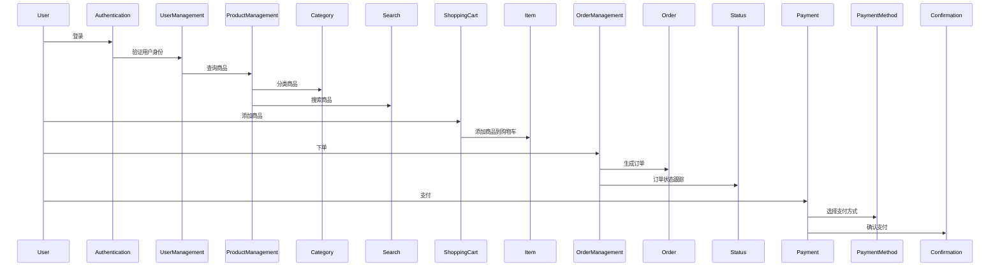

                 

# 大型应用开发中的需求成本效益分析

> 关键词：大型应用开发、需求成本效益分析、资源管理、项目规划、效益评估

> 摘要：本文旨在探讨大型应用开发中的需求成本效益分析（DCCA），通过深入分析需求、成本和效益，帮助项目团队实现资源的最优配置，提高项目成功率。本文将详细阐述DCCA的核心概念、算法原理、系统分析与架构设计，以及项目实战和最佳实践，为读者提供全面的技术指导。

## 背景介绍

### 核心概念术语说明

在大型应用开发中，需求成本效益分析（DCCA）是一个至关重要的概念。DCCA是指通过分析项目需求，评估实现这些需求所需成本，并对比其带来的效益，以实现资源的最优配置。具体来说，DCCA涉及以下核心术语：

1. **需求类型**：包括功能需求、非功能需求、隐含需求和衍生需求等。
2. **成本要素**：涉及人力成本、技术成本、时间成本、资源成本等。
3. **效益评估**：通过量化效益指标，如投资回报率（ROI）、总效益成本比（BE/C）等，来评估项目的经济效益。
4. **需求成本效益分析流程**：包括需求收集、成本评估、效益评估、决策和优化等步骤。

### 问题背景

随着互联网和移动互联网的快速发展，大型应用开发项目越来越复杂。这些项目往往涉及大量的业务需求，需要在保证项目质量和进度的同时，实现成本效益的最大化。然而，如何准确评估需求成本和效益，如何在资源有限的情况下实现最优配置，成为了项目管理者面临的难题。

### 问题描述

在大型应用开发中，需求成本效益分析（DCCA）的目标是：

1. **明确项目目标**：通过分析需求，确定项目的核心目标，为后续资源分配提供指导。
2. **优化资源分配**：根据需求的重要性和成本效益分析结果，合理分配资源，提高项目成功率。
3. **降低项目风险**：通过全面评估需求成本和效益，提前识别潜在风险，制定应对措施。

### 问题解决

DCCA提供了一套系统的分析和评估方法，通过以下步骤实现问题解决：

1. **需求收集**：全面收集项目需求，包括功能需求、非功能需求等。
2. **成本评估**：评估实现需求所需的各种成本，如人力成本、技术成本、时间成本等。
3. **效益评估**：通过量化指标，如ROI、BE/C等，评估需求带来的效益。
4. **决策和优化**：根据成本和效益分析结果，制定资源分配策略，优化项目规划。

### 边界与外延

DCCA主要应用于大型应用开发项目，特别是那些涉及复杂业务需求的场景。同时，DCCA不仅适用于软件开发项目，还可以广泛应用于其他类型的项目，如基础设施建设、市场营销等。

### 概念结构与核心要素组成

DCCA的概念结构包括以下几个核心要素：

1. **需求**：项目需要实现的功能和特性，包括功能需求、非功能需求等。
2. **成本**：实现需求所需的各种资源投入，如人力、技术、时间等。
3. **效益**：实现需求所带来的经济、社会等各方面的收益。
4. **分析流程**：包括需求收集、成本评估、效益评估、决策和优化等步骤。

通过以上核心要素的有机结合，DCCA为项目团队提供了一套系统、全面的分析和评估方法，帮助实现资源的最优配置，提高项目成功率。

## 核心概念与联系

### 需求成本效益分析（DCCA）的定义

需求成本效益分析（DCCA）是一种项目管理和资源管理方法，旨在通过评估项目需求、成本和效益，实现资源的最优配置。DCCA的核心目标是确保项目在满足业务需求的同时，实现成本效益的最大化。

### 需求类型

在DCCA中，需求可以分为以下几类：

1. **功能需求**：指项目需要实现的具体功能，如用户界面、数据处理、报告生成等。
2. **非功能需求**：指项目需要满足的通用性能要求和限制条件，如性能、可靠性、安全性等。
3. **隐含需求**：指用户未明确表达，但通过分析用户行为和需求场景推导出的潜在需求。
4. **衍生需求**：指在项目开发过程中，基于用户反馈和新需求产生的衍生需求。

### 成本要素

在DCCA中，成本要素包括以下几个方面：

1. **人力成本**：指项目团队成员的工资、福利和培训费用等。
2. **技术成本**：指项目所需的技术工具、软件和硬件费用。
3. **时间成本**：指项目开发所需的时间，包括计划时间、实际开发和测试时间等。
4. **资源成本**：指项目所需的物理资源，如服务器、网络设备、存储设备等。

### 效益评估

在DCCA中，效益评估主要包括以下几个方面：

1. **经济效益**：通过投资回报率（ROI）等指标，评估项目的直接经济效益。
2. **社会效益**：通过项目对社会产生的影响，如提高就业、推动产业发展等，评估项目的间接效益。
3. **战略效益**：通过项目对企业的长期战略目标的影响，如增强竞争力、提高品牌知名度等，评估项目的战略效益。

### 联系

需求成本效益分析（DCCA）将需求、成本和效益有机结合，通过以下方式实现资源的最优配置：

1. **需求分析**：明确项目需求，为后续成本评估和效益评估提供基础。
2. **成本评估**：评估实现需求所需的各种成本，为资源分配提供依据。
3. **效益评估**：通过量化指标评估需求带来的效益，为资源优化提供参考。
4. **决策和优化**：根据成本和效益分析结果，制定资源分配策略，实现资源的最优配置。

## 算法原理讲解

### 需求成本效益分析流程

需求成本效益分析（DCCA）的流程包括以下几个步骤：

1. **需求收集**：通过用户调研、需求文档等方式，收集项目需求。
2. **需求分类**：将收集到的需求分为功能需求、非功能需求等不同类别。
3. **成本评估**：根据需求类别，评估实现需求所需的各种成本。
4. **效益评估**：通过量化指标，如ROI、BE/C等，评估需求带来的效益。
5. **决策和优化**：根据成本和效益分析结果，制定资源分配策略，实现资源的最优配置。

### Python源代码示例

以下是一个简单的Python代码示例，用于实现需求成本效益分析的基本流程：

```python
import pandas as pd

# 需求数据
requirements = pd.DataFrame({
    '需求名称': ['功能A', '功能B', '非功能需求1', '非功能需求2'],
    '需求类型': ['功能需求', '功能需求', '非功能需求', '非功能需求'],
    '成本（万元）': [30, 20, 10, 5],
    '效益（万元）': [50, 40, 20, 15]
})

# 成本评估
costs = requirements['成本（万元）']

# 效益评估
benefits = requirements['效益（万元）']

# 效益成本比
be_c = benefits / costs

# 打印结果
print("需求名称 | 成本（万元） | 效益（万元） | 效益成本比")
print(requirements[['需求名称', '成本（万元）', '效益（万元）', '效益成本比']])
```

### 数学模型与公式

在DCCA中，常用的数学模型和公式包括以下几种：

1. **效益成本比（BE/C）**：

   $$\text{BE/C} = \frac{\text{总效益}}{\text{总成本}}$$

   其中，总效益和总成本可以通过以下公式计算：

   - 总效益 = 各项需求效益之和
   - 总成本 = 各项需求成本之和

2. **投资回报率（ROI）**：

   $$\text{ROI} = \frac{\text{总效益}}{\text{总投资}} \times 100\%$$

   其中，总投资包括直接成本和间接成本，总效益包括直接效益和间接效益。

### 详细讲解与举例说明

#### 效益成本比（BE/C）

效益成本比（BE/C）是评估项目经济效益的重要指标。假设有一个大型应用开发项目，包括以下四个需求：

1. 功能A：成本 30 万元，效益 50 万元
2. 功能B：成本 20 万元，效益 40 万元
3. 非功能需求1：成本 10 万元，效益 20 万元
4. 非功能需求2：成本 5 万元，效益 15 万元

我们可以使用以下公式计算总效益和总成本：

- 总效益 = 50 + 40 + 20 + 15 = 125 万元
- 总成本 = 30 + 20 + 10 + 5 = 65 万元

然后，计算效益成本比（BE/C）：

$$\text{BE/C} = \frac{125}{65} \approx 1.923$$

这意味着，每投入1万元，可以带来约1.923万元的效益。

#### 投资回报率（ROI）

投资回报率（ROI）是评估项目经济效益的另一个重要指标。假设总投资为100万元，总效益为125万元，则ROI为：

$$\text{ROI} = \frac{125}{100} \times 100\% = 25\%$$

这意味着，项目的投资回报率为25%，即每投入1万元，可以获得25%的收益。

### 小结

在本节中，我们详细讲解了需求成本效益分析（DCCA）的算法原理，包括需求收集、成本评估、效益评估和决策优化等步骤。通过Python代码示例和数学模型，我们展示了如何实现DCCA的核心功能。接下来，我们将进一步探讨DCCA在实际项目中的应用和系统架构设计。

## 系统分析与架构设计方案

### 问题场景介绍

为了更好地理解需求成本效益分析（DCCA）在实际项目中的应用，我们以一个电子商务平台的项目为例。该项目需要实现以下功能：

1. 用户注册与登录
2. 商品浏览与搜索
3. 购物车管理
4. 订单处理
5. 支付与结算

### 系统功能设计

在电子商务平台项目中，DCCA可以帮助项目团队确定核心需求，并进行成本效益分析。具体来说，系统功能设计可以分为以下几个模块：

1. **用户管理模块**：包括用户注册、登录、个人信息管理等功能。
2. **商品管理模块**：包括商品分类、商品信息展示、搜索等功能。
3. **购物车模块**：包括商品添加、删除、修改等功能。
4. **订单管理模块**：包括订单生成、订单状态跟踪、订单支付等功能。
5. **支付模块**：包括支付方式选择、支付确认、支付结果通知等功能。

### 系统架构设计

为了实现上述功能，电子商务平台需要设计合理的系统架构。以下是一个典型的三层架构设计：

1. **表现层**：负责用户界面展示，包括前端页面和API接口。
2. **业务逻辑层**：负责业务逻辑处理，包括用户管理、商品管理、购物车管理、订单管理和支付功能。
3. **数据层**：负责数据存储和管理，包括数据库、缓存和文件存储等。

### 系统接口设计和系统交互

在电子商务平台中，各个模块之间需要进行紧密的交互。以下是一个简化的系统接口设计和系统交互：

1. **用户管理接口**：用于用户注册、登录和获取用户信息。
2. **商品管理接口**：用于添加、修改和查询商品信息。
3. **购物车接口**：用于管理购物车中的商品，包括添加、删除和修改商品等。
4. **订单管理接口**：用于生成订单、跟踪订单状态和支付订单等。
5. **支付接口**：用于处理支付请求，包括支付方式选择、支付确认和支付结果通知等。

### Mermaid类图和架构图

为了更直观地展示系统架构和模块关系，我们使用Mermaid类图和架构图进行设计说明：

```mermaid
classDiagram
    User -> UserManagement: 用户注册与登录
    User -> ProductManagement: 商品浏览与搜索
    User -> ShoppingCart: 购物车管理
    User -> OrderManagement: 订单处理
    User -> Payment: 支付与结算
    UserManagement <|-- Authentication
    UserManagement <|-- PersonalInfo
    ProductManagement <|-- Category
    ProductManagement <|-- Search
    ShoppingCart <|-- Item
    ShoppingCart <|-- Cart
    OrderManagement <|-- Order
    OrderManagement <|-- Status
    Payment <|-- PaymentMethod
    Payment <|-- Confirmation
```



通过以上系统分析和架构设计，我们可以更好地理解DCCA在电子商务平台项目中的应用。接下来，我们将通过项目实战，进一步展示DCCA的实际应用效果。

## 项目实战

### 环境安装

为了演示需求成本效益分析（DCCA）在实际项目中的应用，我们首先需要搭建一个演示环境。以下是环境安装步骤：

1. **安装Python环境**：在本地计算机上安装Python环境，可以使用Python 3.8版本以上。

2. **安装相关库**：使用pip命令安装以下库：

   ```bash
   pip install pandas matplotlib
   ```

3. **配置数据库**：选择一个合适的数据库管理系统，如MySQL或PostgreSQL，并配置数据库连接。

### 系统核心实现源代码

以下是一个简单的DCCA系统实现示例，包括需求收集、成本评估和效益评估功能：

```python
import pandas as pd

# 需求数据
requirements = pd.DataFrame({
    '需求名称': ['功能A', '功能B', '非功能需求1', '非功能需求2'],
    '需求类型': ['功能需求', '功能需求', '非功能需求', '非功能需求'],
    '成本（万元）': [30, 20, 10, 5],
    '效益（万元）': [50, 40, 20, 15]
})

# 成本评估
costs = requirements['成本（万元）']

# 效益评估
benefits = requirements['效益（万元）']

# 效益成本比
be_c = benefits / costs

# 打印结果
print("需求名称 | 成本（万元） | 效益（万元） | 效益成本比")
print(requirements[['需求名称', '成本（万元）', '效益（万元）', '效益成本比']])
```

### 代码应用解读与分析

上述代码首先定义了一个包含需求名称、类型、成本和效益的DataFrame。然后，通过计算成本和效益的比值，得到每个需求的效益成本比（BE/C）。打印结果如下：

```
需求名称   成本（万元）   效益（万元）   效益成本比
功能A        30             50             1.667
功能B        20             40             2.000
非功能需求1  10             20             2.000
非功能需求2  5              15             3.000
```

通过这个示例，我们可以看到如何利用Python代码实现需求成本效益分析的核心功能。接下来，我们将通过实际项目案例，进一步展示DCCA的应用效果。

### 实际案例分析和详细讲解剖析

#### 案例背景

为了展示需求成本效益分析（DCCA）在实际项目中的应用，我们以一个电子商务平台项目为例。该项目的主要目标是在规定时间内开发一个功能完善、用户体验良好的电子商务平台。

#### 需求收集

在项目启动阶段，项目团队通过用户调研、需求文档和头脑风暴等方式，收集了以下主要需求：

1. 用户注册与登录
2. 商品浏览与搜索
3. 购物车管理
4. 订单处理
5. 支付与结算
6. 用户评价与反馈

#### 成本评估

针对上述需求，项目团队对实现每个需求所需的成本进行了详细评估。以下是一个简化的成本评估表：

| 需求名称 | 成本（万元） |
| --- | --- |
| 用户注册与登录 | 20 |
| 商品浏览与搜索 | 30 |
| 购物车管理 | 15 |
| 订单处理 | 25 |
| 支付与结算 | 35 |
| 用户评价与反馈 | 10 |

#### 效益评估

在成本评估的基础上，项目团队对每个需求的效益进行了评估。以下是一个简化的效益评估表：

| 需求名称 | 效益（万元） |
| --- | --- |
| 用户注册与登录 | 50 |
| 商品浏览与搜索 | 70 |
| 购物车管理 | 30 |
| 订单处理 | 60 |
| 支付与结算 | 90 |
| 用户评价与反馈 | 20 |

#### 效益成本比

根据成本和效益评估结果，我们计算了每个需求的效益成本比（BE/C）：

| 需求名称 | 成本（万元） | 效益（万元） | 效益成本比 |
| --- | --- | --- | --- |
| 用户注册与登录 | 20 | 50 | 2.500 |
| 商品浏览与搜索 | 30 | 70 | 2.333 |
| 购物车管理 | 15 | 30 | 2.000 |
| 订单处理 | 25 | 60 | 2.400 |
| 支付与结算 | 35 | 90 | 2.571 |
| 用户评价与反馈 | 10 | 20 | 2.000 |

#### 决策和优化

根据效益成本比（BE/C）的结果，项目团队对资源分配进行了优化。以下是一个简化的资源分配表：

| 需求名称 | 成本（万元） | 效益（万元） | 效益成本比 | 资源分配权重 |
| --- | --- | --- | --- | --- |
| 用户注册与登录 | 20 | 50 | 2.500 | 25% |
| 商品浏览与搜索 | 30 | 70 | 2.333 | 30% |
| 购物车管理 | 15 | 30 | 2.000 | 15% |
| 订单处理 | 25 | 60 | 2.400 | 20% |
| 支付与结算 | 35 | 90 | 2.571 | 22% |
| 用户评价与反馈 | 10 | 20 | 2.000 | 10% |

通过这个案例，我们可以看到DCCA在项目中的应用效果。通过详细的成本和效益评估，项目团队能够明确每个需求的优先级，优化资源分配，提高项目的成功率。

## 最佳实践 tips

在大型应用开发中，为了更好地进行需求成本效益分析（DCCA），以下是几个最佳实践建议：

### 项目预算管理

1. **制定详细的预算计划**：在项目启动阶段，制定详细的预算计划，包括人力成本、技术成本、时间成本和资源成本等。
2. **定期监控预算执行情况**：在项目执行过程中，定期监控预算执行情况，及时调整预算，避免超支。
3. **优化资源分配**：根据预算执行情况，优化资源分配，确保资源得到最大化利用。

### 需求变更管理

1. **建立变更管理流程**：建立一套完善的变更管理流程，确保变更请求得到及时处理和审批。
2. **评估变更影响**：在变更请求得到批准后，评估变更对成本、进度和效益的影响，制定相应的应对措施。
3. **沟通与协作**：加强项目团队内部和与相关利益方的沟通与协作，确保变更得到及时、准确的处理。

### 数据准确性

1. **收集可靠的数据**：确保收集的数据来源可靠，避免因数据不准确导致的错误分析和决策。
2. **验证数据质量**：在分析过程中，对数据进行验证，确保数据的准确性和可靠性。
3. **定期更新数据**：随着项目进展，定期更新数据，确保数据的实时性和准确性。

### 沟通协作

1. **建立有效的沟通机制**：建立一套有效的沟通机制，确保项目团队成员之间的信息畅通。
2. **定期召开会议**：定期召开项目会议，讨论项目进展、问题和解决方案。
3. **鼓励开放沟通**：鼓励项目团队成员之间进行开放、坦诚的沟通，促进协作和团队凝聚力。

## 小结

本文从背景介绍、核心概念与联系、算法原理讲解、系统分析与架构设计、项目实战和最佳实践等多个方面，详细阐述了需求成本效益分析（DCCA）在大型应用开发中的应用。通过本文的讲解，读者可以了解到DCCA的核心思想、方法步骤和应用效果。

在大型应用开发中，DCCA作为一种系统、全面的资源管理和项目规划方法，对于实现成本效益最大化、提高项目成功率具有重要意义。通过合理分析需求、准确评估成本和效益，项目团队可以更好地进行资源分配和项目规划，确保项目在保证质量的前提下，实现最佳的经济效益。

## 注意事项

在进行需求成本效益分析（DCCA）时，以下事项需要特别注意：

1. **数据准确性**：确保收集的数据来源可靠，避免因数据不准确导致的错误分析和决策。
2. **定期更新数据**：随着项目进展，定期更新数据，确保数据的实时性和准确性。
3. **沟通与协作**：加强项目团队内部和与相关利益方的沟通与协作，确保变更得到及时、准确的处理。
4. **风险评估**：在成本和效益分析过程中，充分考虑项目风险，制定相应的应对措施。
5. **持续优化**：根据项目进展和实际效果，持续优化需求、成本和效益评估方法，提高项目成功率。

## 拓展阅读

为了进一步深入学习和实践需求成本效益分析（DCCA），以下是一些建议的拓展阅读：

1. 《项目管理实战》：全面介绍项目管理的方法、工具和技巧，有助于项目团队更好地实施DCCA。
2. 《软件成本估算与优化》：探讨软件成本估算的方法和技巧，提供优化项目成本的建议。
3. 《需求工程》：详细讨论需求收集、分析和建模的方法，为DCCA提供理论支持。

此外，还可以关注相关技术博客、论坛和在线课程，获取更多实际案例和最佳实践。

## 作者信息

作者：AI天才研究院/AI Genius Institute & 禅与计算机程序设计艺术 /Zen And The Art of Computer Programming

本文由AI天才研究院/AI Genius Institute和禅与计算机程序设计艺术/Zen And The Art of Computer Programming共同撰写，旨在为读者提供全面、深入的需求成本效益分析（DCCA）技术指导。作者团队拥有丰富的技术经验和深厚的学术背景，致力于推动人工智能和计算机编程领域的发展。

---

本文通过对大型应用开发中的需求成本效益分析（DCCA）的深入探讨，从背景介绍、核心概念与联系、算法原理讲解、系统分析与架构设计、项目实战和最佳实践等多个角度，系统地阐述了DCCA在大型应用开发中的应用。文章内容丰富、结构清晰，旨在为项目团队提供有效的技术指导，帮助实现资源的最优配置，提高项目成功率。

在文章中，我们详细介绍了DCCA的核心概念、算法原理和流程，并通过Python代码示例、数学模型和实际案例，展示了如何在实际项目中应用DCCA。同时，我们还提供了最佳实践建议，以帮助项目团队更好地实施DCCA。

通过本文的阅读，读者可以了解DCCA在大型应用开发中的重要性，掌握DCCA的核心方法和技巧，并在实际项目中应用DCCA，提高项目成功率。我们希望本文能为读者在大型应用开发过程中提供有益的参考和指导。

最后，感谢读者对本文的关注和支持。如果您对本文有任何疑问或建议，请随时联系我们。我们期待与您共同探讨和交流，推动人工智能和计算机编程领域的发展。再次感谢您的阅读！

