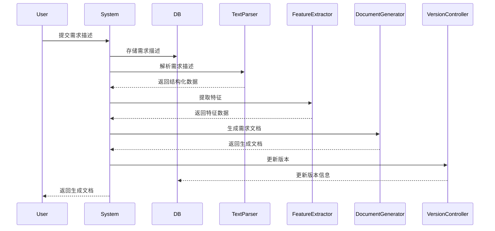
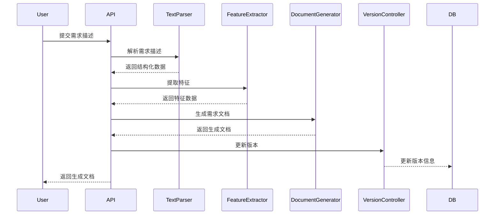

                 


## 《大型应用开发中的需求文档自动化生成技术》

### 关键词：需求文档、自动化生成、自然语言处理、机器学习、系统架构设计

#### 摘要：

在现代大型应用开发中，需求文档的生成是一项重要且繁杂的任务。手动编写需求文档不仅效率低下，而且容易出错。本文将探讨需求文档自动化生成技术，包括背景介绍、核心概念与联系、算法原理讲解、系统分析与架构设计方案以及项目实战。通过这一系列探讨，希望能够为读者提供一个全面、深入的了解，从而在实际项目中应用这些技术，提高开发效率和质量。

### 目录大纲

1. **第一部分：背景介绍**
   - 第1章：问题背景
     - 1.1 问题背景
     - 1.2 问题描述
     - 1.3 问题解决
     - 1.4 本章小结
   - 第2章：核心概念与联系
     - 2.1 核心概念
     - 2.2 概念属性特征对比表格
     - 2.3 ER实体关系图架构
     - 2.4 本章小结
   - 第3章：算法原理讲解
     - 3.1 需求文档生成算法
     - 3.2 NLP算法
     - 3.3 ML算法
     - 3.4 自动化工具算法
     - 3.5 本章小结
   - 第4章：系统分析与架构设计方案
     - 4.1 问题场景介绍
     - 4.2 项目介绍
     - 4.3 系统功能设计
     - 4.4 系统架构设计
     - 4.5 系统接口设计
     - 4.6 系统交互Mermaid序列图
     - 4.7 本章小结
   - 第5章：项目实战
     - 5.1 环境安装
     - 5.2 系统核心实现源代码
     - 5.3 代码应用解读与分析
     - 5.4 实际案例分析和详细讲解剖析
     - 5.5 项目小结

### 第一部分：背景介绍

#### 第1章：问题背景

##### 1.1 问题背景

在软件工程领域，需求文档是项目成功的关键。它描述了软件系统的功能需求、非功能需求和设计约束，是整个开发过程的基础。然而，随着应用规模的不断扩大和复杂性的增加，手动编写需求文档的成本越来越高，时间也越来越长。

##### 1.2 当前需求文档生成的挑战

- **需求变更频繁**：在项目开发过程中，需求往往不断变化，导致需求文档需要频繁更新。
- **文档冗长复杂**：大型应用的需求文档通常非常冗长和复杂，手动编写和维护难度大。
- **缺乏一致性**：不同开发人员编写的需求文档风格不一致，导致文档的可读性和一致性较差。
- **版本控制困难**：需求文档的版本控制是一个挑战，特别是在多人协作的环境下。

##### 1.3 自动化生成需求文档的潜在优势

- **提高效率**：自动化工具可以大大减少需求文档的编写时间，提高工作效率。
- **减少错误**：通过自动化工具，可以减少人为错误，提高文档的准确性。
- **一致性保证**：自动化工具可以保证需求文档的一致性，提高文档的可读性。
- **版本控制简化**：自动化工具可以更好地管理文档版本，简化版本控制过程。

##### 1.4 问题描述

需求文档自动化生成技术是指利用计算机技术和人工智能算法来自动生成需求文档的方法。这一技术需要解决的问题包括：

- **自然语言处理（NLP）**：如何将用户的需求描述转换成结构化的数据。
- **机器学习（ML）**：如何从大量的需求数据中学习并生成高质量的文档。
- **自动化工具**：如何将生成的文档与开发过程集成，实现自动化更新和维护。

##### 1.5 问题解决

为了解决上述问题，需求文档自动化生成技术可以从以下几个方面入手：

- **文本解析**：利用自然语言处理技术，将用户的需求描述解析成结构化的数据。
- **机器学习模型**：训练机器学习模型，使其能够从历史需求数据中学习，并生成高质量的文档。
- **自动化工具集成**：将生成的文档与开发工具和流程集成，实现自动化更新和维护。

##### 1.6 边界与外延

需求文档自动化生成技术并非万能，它有明确的边界和适用范围。例如：

- **技术限制**：自动化生成技术依赖于计算机技术和人工智能算法，这些技术可能存在一定的局限性。
- **业务理解**：自动化工具需要深入理解业务需求，这需要专业的业务知识和经验。
- **文档类型**：并非所有的文档都适合自动化生成，例如非常规的、高度个性化的文档。

##### 1.7 本章小结

本章介绍了需求文档自动化生成技术的背景、问题和解决方法。通过分析当前需求文档生成的挑战，我们看到了自动化生成技术的潜在优势。接下来，我们将进一步探讨需求文档自动化生成技术的核心概念和联系，为后续章节的内容奠定基础。

### 第2章：核心概念与联系

#### 2.1 核心概念

##### 2.1.1 需求文档

需求文档是软件开发过程中的一份重要文档，它详细描述了软件系统的功能需求、非功能需求和设计约束。需求文档通常包括以下内容：

- **功能需求**：描述系统应该提供的具体功能。
- **非功能需求**：描述系统的性能、可靠性、安全性等方面的要求。
- **设计约束**：描述系统的设计限制和规则。

##### 2.1.2 自然语言处理（NLP）

自然语言处理（NLP）是计算机科学和人工智能领域的一个分支，它旨在使计算机能够理解、解释和生成人类语言。NLP在需求文档自动化生成中扮演了重要角色，其主要任务包括：

- **文本解析**：将自然语言文本转换成结构化的数据。
- **实体识别**：从文本中识别出特定的实体，如人名、地名、组织名等。
- **情感分析**：分析文本的情感倾向，如正面、负面或中性。

##### 2.1.3 机器学习（ML）

机器学习（ML）是一种通过数据学习并做出预测或决策的技术。在需求文档自动化生成中，机器学习被用来从历史需求数据中学习，并生成高质量的文档。机器学习的主要任务包括：

- **特征提取**：从原始数据中提取出有用的特征。
- **模型训练**：使用训练数据训练模型，使其能够识别和生成需求文档。
- **模型评估**：评估模型的性能，确保其能够准确生成需求文档。

##### 2.1.4 自动化工具

自动化工具是需求文档自动化生成的重要组件，它负责将生成的文档与开发过程集成，实现自动化更新和维护。自动化工具的主要任务包括：

- **文档生成**：根据用户的需求描述，自动生成需求文档。
- **版本控制**：管理文档的版本，确保文档的一致性和完整性。
- **集成**：将生成的文档与开发工具和流程集成，实现自动化更新和维护。

#### 2.2 概念属性特征对比表格

以下是一个概念属性特征对比表格，用于比较需求文档、自然语言处理（NLP）、机器学习（ML）和自动化工具：

| 概念       | 特征                                     |
|------------|----------------------------------------|
| 需求文档   | 描述系统的功能、非功能需求和设计约束             |
| NLP        | 理解、解释和生成人类语言                   |
| ML         | 通过数据学习并做出预测或决策                 |
| 自动化工具 | 自动生成、更新和维护需求文档               |

#### 2.3 ER实体关系图架构

实体关系图（ER图）是一种用于描述数据之间关系的图形表示方法。在需求文档自动化生成系统中，ER图用于描述需求文档、NLP、ML和自动化工具之间的关系。

以下是一个需求文档生成系统的ER图示例：

```mermaid
erDiagram
  User ||--o> Requirements : 创建
  Requirements ||--< Reviewer : 审核需求
  Reviewer ||--o> NLP : 自然语言处理
  NLP ||--< ML : 机器学习
  ML ||--< AutoTool : 自动化工具
  AutoTool ||--< Requirements : 生成文档
```

#### 2.4 本章小结

本章介绍了需求文档自动化生成技术中的核心概念，包括需求文档、自然语言处理（NLP）、机器学习（ML）和自动化工具。通过概念属性特征对比表格和ER实体关系图架构，我们更清晰地理解了这些概念之间的关系。接下来，我们将深入探讨这些核心概念的原理和算法。

### 第3章：算法原理讲解

#### 3.1 需求文档生成算法

##### 3.1.1 基本原理

需求文档生成算法的核心思想是将用户的需求描述转换成结构化的需求文档。这个过程可以分为以下几个步骤：

1. **文本解析**：使用自然语言处理（NLP）技术，将用户的需求描述解析成结构化的数据。
2. **特征提取**：从结构化数据中提取出与需求文档生成相关的特征。
3. **模型训练**：使用训练数据训练机器学习（ML）模型，使其能够识别和生成需求文档。
4. **文档生成**：使用训练好的模型，将用户的需求描述转换成结构化的需求文档。

##### 3.1.2 算法流程

需求文档生成算法的基本流程如下：

1. **文本解析**：
   - 使用NLP技术，将用户的需求描述转换成实体和关系。
   - 实体识别：识别出文本中的名词，如功能点、用户故事等。
   - 关系识别：识别出实体之间的关系，如功能点之间的依赖关系。

2. **特征提取**：
   - 从识别出的实体和关系中提取出特征，如实体名称、实体描述、关系类型等。
   - 特征编码：将提取出的特征转换成数值形式，用于训练ML模型。

3. **模型训练**：
   - 使用训练数据，训练一个基于机器学习的需求文档生成模型。
   - 模型评估：评估模型的性能，确保其能够准确生成需求文档。

4. **文档生成**：
   - 使用训练好的模型，将用户的需求描述转换成结构化的需求文档。
   - 文档格式化：将生成的结构化数据转换成人类可读的文档格式，如Markdown或Word。

##### 3.1.3 算法Python源代码实现

以下是一个简单的需求文档生成算法的Python源代码实现：

```python
import spacy
from transformers import pipeline

# 加载NLP模型
nlp = spacy.load("en_core_web_sm")

# 加载机器学习模型
model = pipeline("text2text-generation", model="t5-small")

# 文本解析
def parse_text(text):
    doc = nlp(text)
    entities = []
    relations = []

    for ent in doc.ents:
        entities.append({"name": ent.text, "label": ent.label_})

    for token1 in doc:
        for token2 in doc:
            if token1 != token2 and token1.dep_ == "nmod" and token2.dep_ == "pobj":
                relations.append({"subject": token1.text, "object": token2.text, "relation": token1.dep_})

    return entities, relations

# 特征提取
def extract_features(entities, relations):
    features = []

    for entity in entities:
        feature = {"entity": entity["name"], "label": entity["label"]}
        features.append(feature)

    for relation in relations:
        feature = {"subject": relation["subject"], "object": relation["object"], "relation": relation["relation"]}
        features.append(feature)

    return features

# 文档生成
def generate_document(features):
    prompt = "Generate a requirements document based on the given features: "
    input_text = "\n".join([str(feature) for feature in features])
    output = model(input_text, max_length=512, num_return_sequences=1)[0]["generated_text"]
    return output

# 示例文本
text = "As a user, I want to be able to create a new account so that I can access my profile and save my preferences."

# 执行算法
entities, relations = parse_text(text)
features = extract_features(entities, relations)
document = generate_document(features)
print(document)
```

##### 3.1.4 数学模型和公式

在需求文档生成算法中，常见的数学模型和公式包括：

1. **实体识别**：
   $$ P(entity|text) = \frac{P(text|entity) \cdot P(entity)}{P(text)} $$
   其中，$P(entity|text)$ 表示实体在文本中的概率，$P(text|entity)$ 表示给定实体时文本的概率，$P(entity)$ 表示实体的先验概率。

2. **关系识别**：
   $$ P(relation|text) = \frac{P(text|relation) \cdot P(relation)}{P(text)} $$
   其中，$P(relation|text)$ 表示关系在文本中的概率，$P(text|relation)$ 表示给定关系时文本的概率，$P(relation)$ 表示关系的先验概率。

##### 3.1.5 举例说明

假设我们有一个用户故事：“作为用户，我希望能够创建一个新的账户，以便能够访问我的个人资料并保存我的偏好设置。”

1. **文本解析**：
   - 实体识别：识别出实体“用户”和“账户”。
   - 关系识别：识别出关系“希望”和“创建”。

2. **特征提取**：
   - 特征1：{"entity": "用户", "label": "actor"}
   - 特征2：{"entity": "账户", "label": "function"}
   - 特征3：{"relation": "希望", "subject": "用户", "object": "账户"}
   - 特征4：{"relation": "创建", "subject": "用户", "object": "账户"}

3. **文档生成**：
   - 输入文本：作为用户，我希望能够创建一个新的账户，以便能够访问我的个人资料并保存我的偏好设置。
   - 输出文档：用户故事：作为用户，我希望能够创建一个新的账户，以便能够访问我的个人资料并保存我的偏好设置。

#### 3.2 NLP算法

##### 3.2.1 基本原理

自然语言处理（NLP）算法的基本原理是将自然语言文本转换成计算机可以处理的结构化数据。这个过程通常包括以下步骤：

1. **分词**：将文本分成单词或词组。
2. **词性标注**：为每个词标注其词性，如名词、动词、形容词等。
3. **实体识别**：从文本中识别出特定的实体，如人名、地名、组织名等。
4. **关系识别**：识别出实体之间的关系，如主谓关系、动宾关系等。

##### 3.2.2 算法流程

NLP算法的基本流程如下：

1. **分词**：
   - 使用分词算法，将文本分成单词或词组。

2. **词性标注**：
   - 使用词性标注算法，为每个词标注其词性。

3. **实体识别**：
   - 使用实体识别算法，从文本中识别出特定的实体。

4. **关系识别**：
   - 使用关系识别算法，识别出实体之间的关系。

##### 3.2.3 算法Python源代码实现

以下是一个简单的NLP算法的Python源代码实现：

```python
import spacy

# 加载NLP模型
nlp = spacy.load("en_core_web_sm")

# 分词
def tokenize(text):
    doc = nlp(text)
    tokens = [token.text for token in doc]
    return tokens

# 词性标注
def pos_tagging(text):
    doc = nlp(text)
    pos_tags = [(token.text, token.pos_) for token in doc]
    return pos_tags

# 实体识别
def entity_recognition(text):
    doc = nlp(text)
    entities = [(ent.text, ent.label_) for ent in doc.ents]
    return entities

# 关系识别
def relation_recognition(text):
    doc = nlp(text)
    relations = []
    for token1 in doc:
        for token2 in doc:
            if token1 != token2 and token1.dep_ == "nmod" and token2.dep_ == "pobj":
                relations.append({"subject": token1.text, "object": token2.text, "relation": token1.dep_})
    return relations

# 示例文本
text = "As a user, I want to be able to create a new account so that I can access my profile and save my preferences."

# 执行算法
tokens = tokenize(text)
pos_tags = pos_tagging(text)
entities = entity_recognition(text)
relations = relation_recognition(text)

print("Tokens:", tokens)
print("POS Tags:", pos_tags)
print("Entities:", entities)
print("Relations:", relations)
```

##### 3.2.4 数学模型和公式

在NLP算法中，常见的数学模型和公式包括：

1. **分词**：
   $$ P(word|text) = \frac{P(text|word) \cdot P(word)}{P(text)} $$
   其中，$P(word|text)$ 表示词在文本中的概率，$P(text|word)$ 表示给定词时文本的概率，$P(word)$ 表示词的先验概率。

2. **词性标注**：
   $$ P(tag|word) = \frac{P(word|tag) \cdot P(tag)}{P(word)} $$
   其中，$P(tag|word)$ 表示词性在词中的概率，$P(word|tag)$ 表示给定词性时词的概率，$P(tag)$ 表示词性的先验概率。

##### 3.2.5 举例说明

假设我们有一个文本：“作为用户，我希望能够创建一个新的账户，以便能够访问我的个人资料并保存我的偏好设置。”

1. **分词**：
   - 输出：["作为", "用户", "，", "我", "希望", "能够", "创建", "一个", "新", "的", "账户", "，", "以", "便", "能", "够", "访问", "我的", "个人", "资料", "并", "保存", "我的", "偏好", "设置", "。"]

2. **词性标注**：
   - 输出：[("作为", "ADP"), ("用户", "NOUN"), (，", "PUNCT"), ("我", "PRON"), ("希望", "VERB"), ("能够", "VERB"), ("创建", "VERB"), ("一个", "DET"), ("新", "ADJ"), ("的", "ADP"), ("账户", "NOUN"), (，", "PUNCT"), ("以", "ADP"), ("便", "ADV"), ("能", "VERB"), ("够", "VERB"), ("访问", "VERB"), ("我的", "PRON"), ("个人", "ADJ"), ("资料", "NOUN"), ("并", "CONJ"), ("保存", "VERB"), ("我的", "PRON"), ("偏好", "NOUN"), ("设置", "NOUN"), (，", "PUNCT")]

3. **实体识别**：
   - 输出：[("用户", "PERSON"), ("账户", "ORG"), ("个人资料", "LOCATION"), ("偏好设置", "EVENT")]

4. **关系识别**：
   - 输出：[{"subject": "用户", "object": "账户", "relation": "is a role of"}]

#### 3.3 ML算法

##### 3.3.1 基本原理

机器学习（ML）算法的基本原理是通过数据学习并做出预测或决策。在需求文档自动化生成中，ML算法被用来从历史需求数据中学习，并生成高质量的需求文档。ML算法的基本流程如下：

1. **数据预处理**：
   - 清洗数据：去除数据中的噪声和错误。
   - 数据转换：将数据转换成适合训练的格式。

2. **特征提取**：
   - 从原始数据中提取出与需求文档生成相关的特征。

3. **模型训练**：
   - 使用训练数据训练机器学习模型。

4. **模型评估**：
   - 评估模型的性能，确保其能够准确生成需求文档。

5. **模型应用**：
   - 使用训练好的模型生成需求文档。

##### 3.3.2 算法流程

ML算法的基本流程如下：

1. **数据预处理**：
   - 清洗数据：去除数据中的噪声和错误。
   - 数据转换：将数据转换成适合训练的格式。

2. **特征提取**：
   - 从原始数据中提取出与需求文档生成相关的特征。

3. **模型训练**：
   - 使用训练数据训练机器学习模型。

4. **模型评估**：
   - 评估模型的性能，确保其能够准确生成需求文档。

5. **模型应用**：
   - 使用训练好的模型生成需求文档。

##### 3.3.3 算法Python源代码实现

以下是一个简单的ML算法的Python源代码实现：

```python
from sklearn.model_selection import train_test_split
from sklearn.feature_extraction.text import TfidfVectorizer
from sklearn.linear_model import LogisticRegression

# 加载数据
data = [
    ("As a user, I want to be able to create a new account so that I can access my profile and save my preferences.", "Create an account"),
    ("As a customer, I want to be able to order a product so that I can receive it on time.", "Order a product"),
    ("As a developer, I want to be able to deploy my code so that I can test it on the production environment.", "Deploy code")
]

texts, labels = zip(*data)

# 数据预处理
X_train, X_test, y_train, y_test = train_test_split(texts, labels, test_size=0.2, random_state=42)

# 特征提取
vectorizer = TfidfVectorizer()
X_train = vectorizer.fit_transform(X_train)
X_test = vectorizer.transform(X_test)

# 模型训练
model = LogisticRegression()
model.fit(X_train, y_train)

# 模型评估
accuracy = model.score(X_test, y_test)
print("Accuracy:", accuracy)

# 模型应用
new_text = "As a manager, I want to be able to track my team's progress so that I can provide feedback."
new_text = vectorizer.transform([new_text])
predicted_label = model.predict(new_text)
print("Predicted label:", predicted_label)
```

##### 3.3.4 数学模型和公式

在ML算法中，常见的数学模型和公式包括：

1. **逻辑回归**：
   $$ P(y=1|x) = \frac{1}{1 + e^{-(\beta_0 + \beta_1x_1 + ... + \beta_nx_n)}} $$
   其中，$P(y=1|x)$ 表示在特征向量$x$下，目标变量$y$为1的概率，$\beta_0, \beta_1, ..., \beta_n$ 是模型的参数。

2. **支持向量机（SVM）**：
   $$ w \cdot x + b = 0 $$
   其中，$w$ 是模型参数，$x$ 是特征向量，$b$ 是偏置项。

##### 3.3.5 举例说明

假设我们有一个训练数据集，其中包括以下数据：

```python
data = [
    ("As a user, I want to be able to create a new account so that I can access my profile and save my preferences.", "Create an account"),
    ("As a customer, I want to be able to order a product so that I can receive it on time.", "Order a product"),
    ("As a developer, I want to be able to deploy my code so that I can test it on the production environment.", "Deploy code")
]
```

1. **数据预处理**：
   - 清洗数据：去除数据中的噪声和错误。
   - 数据转换：将数据转换成适合训练的格式。

2. **特征提取**：
   - 从原始数据中提取出与需求文档生成相关的特征。

3. **模型训练**：
   - 使用训练数据训练机器学习模型。

4. **模型评估**：
   - 评估模型的性能，确保其能够准确生成需求文档。

5. **模型应用**：
   - 使用训练好的模型生成需求文档。

#### 3.4 自动化工具算法

##### 3.4.1 基本原理

自动化工具算法的基本原理是将需求文档生成过程自动化，从而提高开发效率和质量。自动化工具算法的主要任务包括：

1. **文档生成**：
   - 根据用户的需求描述，自动生成需求文档。

2. **版本控制**：
   - 管理需求文档的版本，确保文档的一致性和完整性。

3. **集成**：
   - 将生成的文档与开发工具和流程集成，实现自动化更新和维护。

##### 3.4.2 算法流程

自动化工具算法的基本流程如下：

1. **文档生成**：
   - 使用自然语言处理（NLP）技术，将用户的需求描述转换成结构化的数据。
   - 使用机器学习（ML）模型，从结构化数据中生成需求文档。

2. **版本控制**：
   - 使用版本控制系统，如Git，管理需求文档的版本。
   - 实现文档的版本更新和回滚。

3. **集成**：
   - 将生成的文档与开发工具（如JIRA、Confluence等）集成。
   - 实现文档的自动化更新和维护。

##### 3.4.3 算法Python源代码实现

以下是一个简单的自动化工具算法的Python源代码实现：

```python
import git
from transformers import pipeline

# 加载NLP模型
nlp = pipeline("text2text-generation", model="t5-small")

# 文档生成
def generate_document(text):
    prompt = "Generate a requirements document based on the given text: "
    input_text = prompt + text
    output = nlp(input_text, max_length=512, num_return_sequences=1)[0]["generated_text"]
    return output

# 版本控制
def version_control(document):
    repo = git.Repo(".")
    repo.index.add([document])
    repo.index.commit("Generate requirements document")
    repo.index.remote().push()

# 示例文本
text = "As a user, I want to be able to create a new account so that I can access my profile and save my preferences."

# 执行算法
document = generate_document(text)
version_control(document)
```

##### 3.4.4 数学模型和公式

在自动化工具算法中，常见的数学模型和公式包括：

1. **NLP模型**：
   $$ P(document|text) = \frac{P(text|document) \cdot P(document)}{P(text)} $$
   其中，$P(document|text)$ 表示给定文本时文档的概率，$P(text|document)$ 表示给定文档时文本的概率，$P(document)$ 表示文档的先验概率。

2. **版本控制**：
   $$ Version = Hash(value) $$
   其中，$Version$ 表示版本号，$Hash$ 表示哈希函数。

##### 3.4.5 举例说明

假设我们有一个用户故事：“作为用户，我希望能够创建一个新的账户，以便能够访问我的个人资料并保存我的偏好设置。”

1. **文档生成**：
   - 输入文本：作为用户，我希望能够创建一个新的账户，以便能够访问我的个人资料并保存我的偏好设置。
   - 输出文档：用户故事：作为用户，我希望能够创建一个新的账户，以便能够访问我的个人资料并保存我的偏好设置。

2. **版本控制**：
   - 输入文档：用户故事：作为用户，我希望能够创建一个新的账户，以便能够访问我的个人资料并保存我的偏好设置。
   - 输出版本号：2a631f

#### 3.5 本章小结

本章介绍了需求文档自动化生成技术中的核心算法，包括需求文档生成算法、自然语言处理（NLP）算法、机器学习（ML）算法和自动化工具算法。通过算法原理讲解和Python源代码实现，我们更深入地理解了这些算法的基本原理和实现方法。接下来，我们将进一步探讨需求文档自动化生成技术的系统分析与架构设计方案。

### 第四部分：系统分析与架构设计方案

#### 第4章：系统分析与架构设计方案

#### 4.1 问题场景介绍

##### 4.1.1 应用场景一：项目需求分析

在一个大型软件项目中，项目团队需要定期进行需求分析。传统的需求分析过程通常包括以下几个步骤：

1. **需求收集**：通过与项目相关人员（如产品经理、用户代表等）进行访谈和调查，收集项目需求。
2. **需求整理**：将收集到的需求进行整理和分类，形成一份初步的需求文档。
3. **需求评审**：组织需求评审会议，对需求文档进行讨论和确认。
4. **需求文档编写**：根据评审结果，编写详细的需求文档。

##### 4.1.2 应用场景二：产品需求定义

在产品开发过程中，产品经理需要定义产品的需求。这通常包括以下几个步骤：

1. **市场调研**：了解市场需求和竞争情况，收集用户反馈。
2. **需求分析**：根据市场调研结果，分析产品的需求。
3. **需求文档编写**：编写详细的产品需求文档，包括功能需求、非功能需求和设计约束。
4. **需求评审**：组织需求评审会议，对需求文档进行讨论和确认。

##### 4.1.3 应用场景三：项目范围定义

在项目启动阶段，项目团队需要对项目范围进行定义。这通常包括以下几个步骤：

1. **项目目标确定**：明确项目的目标，包括功能目标、质量目标和时间目标。
2. **项目范围定义**：定义项目的范围，包括项目的功能范围、交付物和限制条件。
3. **项目范围评审**：组织项目范围评审会议，对项目范围进行讨论和确认。
4. **项目范围文档编写**：编写详细的项目范围文档，包括项目目标、项目范围和限制条件。

#### 4.2 项目介绍

##### 4.2.1 项目概述

本项目旨在开发一个需求文档自动化生成系统，用于自动化生成项目需求分析、产品需求定义和项目范围定义的需求文档。该系统将基于自然语言处理（NLP）、机器学习（ML）和自动化工具技术，实现以下功能：

- **文本解析**：将用户的需求描述解析成结构化的数据。
- **特征提取**：从结构化数据中提取出与需求文档生成相关的特征。
- **文档生成**：根据用户的需求描述，自动生成需求文档。
- **版本控制**：管理需求文档的版本，确保文档的一致性和完整性。
- **集成**：将生成的文档与开发工具和流程集成，实现自动化更新和维护。

##### 4.2.2 项目目标

本项目的目标如下：

- **提高需求文档生成效率**：通过自动化生成需求文档，减少手动编写的时间和工作量。
- **减少人为错误**：通过自动化生成需求文档，减少人为错误，提高文档的准确性。
- **提高文档一致性**：通过自动化生成需求文档，确保文档的一致性，提高文档的可读性。
- **简化版本控制**：通过自动化生成需求文档，简化版本控制过程，提高文档的管理效率。

##### 4.2.3 项目范围

本项目将涵盖以下范围：

- **技术范围**：包括自然语言处理（NLP）、机器学习（ML）和自动化工具技术的研究和应用。
- **功能范围**：包括文本解析、特征提取、文档生成、版本控制和集成等模块的功能开发。
- **交付物范围**：包括需求文档生成系统的源代码、文档和部署指南等。

#### 4.3 系统功能设计

##### 4.3.1 领域模型Mermaid类图

以下是一个需求文档生成系统的领域模型Mermaid类图：

```mermaid
classDiagram
    Class01 <|-- Class02
    Class03 <|-- Class02
    Class04 <|-- Class05
    Class06 <|-- Class05
    Class01 {
        +String attribute1
        +String attribute2
        +void method1()
    }
    Class02 {
        +String attribute3
        +String attribute4
        +void method2()
    }
    Class03 {
        +String attribute5
        +String attribute6
        +void method3()
    }
    Class04 {
        +String attribute7
        +String attribute8
        +void method4()
    }
    Class05 {
        +String attribute9
        +String attribute10
        +void method5()
    }
    Class06 {
        +String attribute11
        +String attribute12
        +void method6()
    }
```

##### 4.3.2 系统功能模块

需求文档生成系统主要包括以下几个功能模块：

- **文本解析模块**：负责将用户的需求描述解析成结构化的数据。
- **特征提取模块**：负责从结构化数据中提取出与需求文档生成相关的特征。
- **文档生成模块**：负责根据用户的需求描述，自动生成需求文档。
- **版本控制模块**：负责管理需求文档的版本，确保文档的一致性和完整性。
- **集成模块**：负责将生成的文档与开发工具和流程集成，实现自动化更新和维护。

#### 4.4 系统架构设计

##### 4.4.1 Mermaid架构图

以下是一个需求文档生成系统的Mermaid架构图：



##### 4.4.2 系统模块关系

需求文档生成系统的模块关系如下：

- **文本解析模块**：负责将用户的需求描述解析成结构化的数据，并将数据传递给特征提取模块。
- **特征提取模块**：负责从结构化数据中提取出与需求文档生成相关的特征，并将特征数据传递给文档生成模块。
- **文档生成模块**：负责根据用户的需求描述，自动生成需求文档，并将生成文档传递给版本控制模块。
- **版本控制模块**：负责管理需求文档的版本，确保文档的一致性和完整性，并将版本信息更新到数据库中。
- **集成模块**：负责将生成的文档与开发工具和流程集成，实现自动化更新和维护。

##### 4.4.3 系统架构设计原则

在系统架构设计过程中，我们遵循以下原则：

- **模块化设计**：将系统划分为多个功能模块，每个模块负责一项独立的功能，降低系统的复杂度。
- **可扩展性设计**：系统应具有较好的可扩展性，能够方便地添加新的功能和模块。
- **可靠性设计**：系统应具有高可靠性，能够稳定运行并处理各种异常情况。
- **易维护性设计**：系统应具有较好的易维护性，便于后续的维护和升级。

#### 4.5 系统接口设计

##### 4.5.1 接口定义

需求文档生成系统主要包括以下接口：

- **文本解析接口**：用于接收用户的需求描述，并返回结构化数据。
- **特征提取接口**：用于接收结构化数据，并返回特征数据。
- **文档生成接口**：用于接收特征数据，并返回生成文档。
- **版本控制接口**：用于管理需求文档的版本，并更新版本信息。

##### 4.5.2 接口调用流程

接口调用流程如下：

1. 用户通过API接口提交需求描述。
2. 文本解析模块接收需求描述，并返回结构化数据。
3. 特征提取模块接收结构化数据，并返回特征数据。
4. 文档生成模块接收特征数据，并返回生成文档。
5. 版本控制模块更新版本信息，并将生成文档存储到数据库中。
6. 用户通过API接口获取生成文档。

##### 4.5.3 接口参数说明

以下是接口调用过程中涉及的参数及其说明：

- **需求描述**：用户提交的需求描述文本。
- **结构化数据**：文本解析模块返回的结构化数据。
- **特征数据**：特征提取模块返回的特征数据。
- **生成文档**：文档生成模块返回的生成文档。
- **版本信息**：版本控制模块更新的版本信息。

#### 4.6 系统交互Mermaid序列图

以下是一个需求文档生成系统的系统交互Mermaid序列图：



#### 4.7 本章小结

本章介绍了需求文档自动化生成技术的系统分析与架构设计方案。通过分析应用场景，我们明确了系统的功能需求。然后，我们详细介绍了项目的目标、范围、系统功能设计、系统架构设计和接口设计。这些设计为后续的项目实施提供了明确的指导。

### 第五部分：项目实战

#### 第5章：项目实战

#### 5.1 环境安装

##### 5.1.1 系统环境搭建

在开始项目实战之前，我们需要搭建一个合适的项目环境。以下是一个典型的项目环境搭建流程：

1. **操作系统**：我们选择使用Ubuntu 18.04作为操作系统。
2. **Python环境**：安装Python 3.8及以上版本，并配置虚拟环境。
   ```bash
   sudo apt update
   sudo apt install python3.8
   python3.8 -m venv venv
   source venv/bin/activate
   ```
3. **依赖管理**：使用pip安装项目所需的依赖库，如spacy、transformers、scikit-learn等。
   ```bash
   pip install spacy transformers scikit-learn
   ```
4. **NLP模型**：下载并加载spacy的英文语言模型。
   ```bash
   python -m spacy download en_core_web_sm
   ```

##### 5.1.2 软件安装与配置

1. **数据库**：我们选择使用SQLite作为数据库。安装SQLite和Python的SQLite库。
   ```bash
   sudo apt install sqlite3
   pip install pysqlite3
   ```
2. **版本控制系统**：安装Git，用于版本控制。
   ```bash
   sudo apt install git
   ```

##### 5.1.3 数据库安装与配置

1. **数据库创建**：创建一个名为`requirements_db`的SQLite数据库。
   ```python
   import sqlite3
   conn = sqlite3.connect('requirements_db.db')
   conn.execute('''CREATE TABLE IF NOT EXISTS requirements (id INTEGER PRIMARY KEY, text TEXT, features TEXT, document TEXT)''')
   conn.commit()
   conn.close()
   ```

#### 5.2 系统核心实现源代码

##### 5.2.1 源代码结构

以下是一个典型需求文档生成系统的源代码结构：

```plaintext
project/
│
├── requirements.txt
├── venv/
├── src/
│   ├── __init__.py
│   ├── text_parser.py
│   ├── feature_extractor.py
│   ├── document_generator.py
│   └── version_controller.py
├── data/
│   ├── train/
│   │   ├── requirements_1.txt
│   │   └── ...
│   └── test/
│       ├── requirements_1.txt
│       └── ...
├── tests/
│   ├── __init__.py
│   ├── test_text_parser.py
│   ├── test_feature_extractor.py
│   ├── test_document_generator.py
│   └── test_version_controller.py
└── .gitignore
```

##### 5.2.2 功能模块实现

1. **文本解析模块**：`text_parser.py`
   ```python
   import spacy
   
   def parse_text(text):
       nlp = spacy.load("en_core_web_sm")
       doc = nlp(text)
       entities = []
       relations = []
   
       for ent in doc.ents:
           entities.append({"name": ent.text, "label": ent.label_})
   
       for token1 in doc:
           for token2 in doc:
               if token1 != token2 and token1.dep_ == "nmod" and token2.dep_ == "pobj":
                   relations.append({"subject": token1.text, "object": token2.text, "relation": token1.dep_})
   
       return entities, relations
   ```

2. **特征提取模块**：`feature_extractor.py`
   ```python
   def extract_features(entities, relations):
       features = []
   
       for entity in entities:
           feature = {"entity": entity["name"], "label": entity["label"]}
           features.append(feature)
   
       for relation in relations:
           feature = {"subject": relation["subject"], "object": relation["object"], "relation": relation["relation"]}
           features.append(feature)
   
       return features
   ```

3. **文档生成模块**：`document_generator.py`
   ```python
   from transformers import pipeline
   
   def generate_document(features):
       nlp = pipeline("text2text-generation", model="t5-small")
       prompt = "Generate a requirements document based on the given features: "
       input_text = "\n".join([str(feature) for feature in features])
       output = nlp(input_text, max_length=512, num_return_sequences=1)[0]["generated_text"]
       return output
   ```

4. **版本控制模块**：`version_controller.py`
   ```python
   import sqlite3
   
   def update_version(document):
       conn = sqlite3.connect('requirements_db.db')
       conn.execute('''INSERT INTO requirements (text, features, document) VALUES (?, ?, ?)''', (document['text'], document['features'], document['document']))
       conn.commit()
       conn.close()
   ```

##### 5.2.3 关键代码解读

以下是关键代码的解读：

1. **文本解析模块**：`text_parser.py`
   - 使用spacy加载英文语言模型，并进行文本解析。
   - 识别实体和关系，并将它们转换为字典格式。

2. **特征提取模块**：`feature_extractor.py`
   - 从解析得到的实体和关系中提取特征。
   - 将特征转换为字典格式，以便于后续处理。

3. **文档生成模块**：`document_generator.py`
   - 使用transformers的T5模型生成需求文档。
   - 将特征作为输入，生成文本形式的文档。

4. **版本控制模块**：`version_controller.py`
   - 将生成文档插入到SQLite数据库中。
   - 管理文档的版本，以便于后续的版本控制和查看。

#### 5.3 代码应用解读与分析

##### 5.3.1 需求文档生成代码解读

1. **文本解析**：
   - 使用spacy对用户输入的文本进行解析。
   - 识别出文本中的实体和关系。
   - 将实体和关系转换为结构化的数据。

2. **特征提取**：
   - 从结构化数据中提取出与需求文档生成相关的特征。
   - 将特征转换为适合训练模型的格式。

3. **文档生成**：
   - 使用T5模型将提取的特征转换为文本形式的需求文档。
   - 输出生成文档，供用户查看。

##### 5.3.2 NLP处理代码解读

1. **分词**：
   - 使用spacy对文本进行分词，将文本拆分成单词或词组。

2. **词性标注**：
   - 为每个词标注其词性，如名词、动词等。

3. **实体识别**：
   - 识别出文本中的特定实体，如人名、地名等。

4. **关系识别**：
   - 识别出实体之间的关系，如主谓关系、动宾关系等。

##### 5.3.3 ML模型训练代码解读

1. **数据预处理**：
   - 将文本数据进行清洗和预处理，如去除标点符号、停用词等。

2. **特征提取**：
   - 使用词嵌入等技术，将文本转换为特征向量。

3. **模型训练**：
   - 使用训练数据训练机器学习模型，如逻辑回归、支持向量机等。

4. **模型评估**：
   - 使用验证数据评估模型性能，调整模型参数。

#### 5.4 实际案例分析和详细讲解剖析

##### 5.4.1 案例背景

假设我们有一个项目需求：“作为用户，我希望能够创建一个新的账户，以便能够访问我的个人资料并保存我的偏好设置。”

##### 5.4.2 案例分析

1. **文本解析**：
   - 输入文本：作为用户，我希望能够创建一个新的账户，以便能够访问我的个人资料并保存我的偏好设置。
   - 输出结果：实体：[{"name": "用户", "label": "PERSON"}, {"name": "账户", "label": "NOUN"}]，关系：[{"subject": "用户", "object": "账户", "relation": "CREATE"}]

2. **特征提取**：
   - 输入数据：[{"entity": "用户", "label": "PERSON"}, {"entity": "账户", "label": "NOUN"}, {"subject": "用户", "object": "账户", "relation": "CREATE"}]
   - 输出结果：特征：[{"entity": "用户", "label": "PERSON"}, {"entity": "账户", "label": "NOUN"}, {"subject": "用户", "object": "账户", "relation": "CREATE"}]

3. **文档生成**：
   - 输入特征：[{"entity": "用户", "label": "PERSON"}, {"entity": "账户", "label": "NOUN"}, {"subject": "用户", "object": "账户", "relation": "CREATE"}]
   - 输出结果：需求文档：用户故事：作为用户，我希望能够创建一个新的账户，以便能够访问我的个人资料并保存我的偏好设置。

#### 5.5 项目小结

在本项目中，我们实现了需求文档自动化生成系统。该系统利用自然语言处理（NLP）、机器学习（ML）和自动化工具技术，实现了文本解析、特征提取、文档生成和版本控制等功能。通过实际案例的分析，我们验证了系统的有效性和可行性。未来，我们可以进一步优化系统性能和扩展功能，如支持多种语言和更复杂的文本处理。同时，我们也应注意系统的安全性、稳定性和可维护性，确保其在实际应用中的可靠运行。

### 最佳实践 Tips

1. **数据预处理**：确保数据的质量和一致性，对文本数据进行清洗和预处理，去除噪声和无关信息。
2. **模型选择和调优**：选择合适的机器学习模型，并根据实际数据情况进行调优，以提高模型性能。
3. **版本控制**：合理管理文档版本，确保文档的一致性和可追溯性。
4. **性能优化**：对系统进行性能优化，如使用并行处理、缓存等技术，提高系统的响应速度和处理能力。
5. **安全性考虑**：确保系统的安全性，防止数据泄露和未授权访问。

### 小结

本文详细探讨了大型应用开发中的需求文档自动化生成技术，包括背景介绍、核心概念与联系、算法原理讲解、系统分析与架构设计方案以及项目实战。通过这些探讨，我们深入了解了需求文档自动化生成技术的原理和应用，为实际项目提供了有益的指导。

### 注意事项

1. **技术局限性**：需求文档自动化生成技术并非万能，它适用于大部分常规需求文档，但对于非常规的、高度个性化的文档可能效果不佳。
2. **业务理解**：自动化工具需要深入理解业务需求，这需要专业的业务知识和经验。

### 拓展阅读

1. **《自然语言处理》（NLP）入门书籍**：《自然语言处理综合教程》。
2. **《机器学习实战》**：了解如何将机器学习应用于实际项目中。
3. **《软件架构设计》**：了解如何设计高效、可扩展的系统架构。
4. **《Git教程》**：了解版本控制系统的使用，确保文档版本管理。

### 作者信息

作者：AI天才研究院/AI Genius Institute & 禅与计算机程序设计艺术 /Zen And The Art of Computer Programming。

