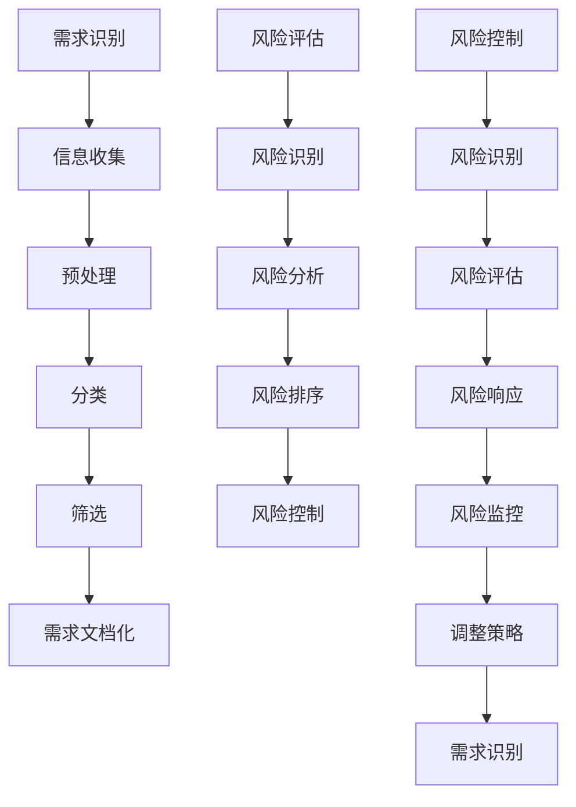
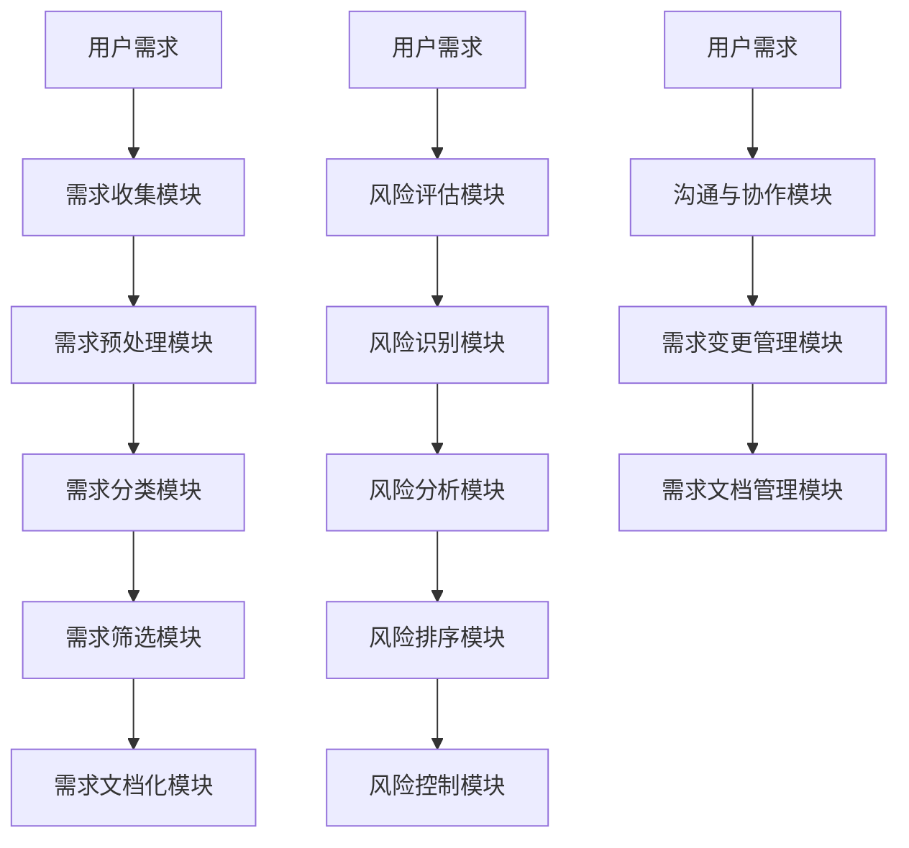
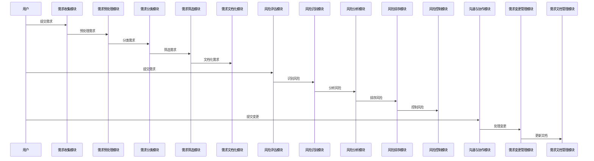

                 

# 大型应用开发中的需求风险评估和管理

## 关键词
- 需求管理
- 风险评估
- 需求识别
- 风险控制
- 沟通与协作

## 摘要
本文将深入探讨大型应用开发中的需求风险评估和管理。通过介绍需求识别、风险评估、风险控制及沟通与协作等核心概念，我们旨在建立一个科学、系统的需求管理流程，帮助项目团队降低风险，确保项目按时、按质、按预算完成。

## 第一部分：背景介绍与核心概念

### 1.1 问题背景

在大型应用开发过程中，需求管理是一个至关重要的环节。需求的不确定性和变化可能导致项目延期、预算超支以及质量下降。为了有效应对这些挑战，需求风险评估和管理成为项目成功的关键。

### 1.2 问题描述

需求风险评估和管理涉及识别、评估和控制与需求相关的一切风险。这些风险可能来源于需求变更、技术不确定性、市场变化、团队协作等多个方面。

### 1.3 问题解决

通过建立一套科学、系统的需求风险评估和管理流程，可以有效降低项目风险，确保项目按时、按质、按预算完成。

### 1.4 边界与外延

需求风险评估和管理不仅适用于软件开发项目，也适用于其他类型的大型项目，如建筑、制造等。

### 1.5 概念结构与核心要素组成

- **需求识别**：识别项目中的需求及其变更。
- **风险评估**：评估需求变更带来的风险。
- **风险控制**：制定和实施风险管理策略。
- **沟通与协作**：确保团队内部以及与客户之间的有效沟通。

### 1.6 本章小结

通过本章节的介绍，我们对大型应用开发中的需求风险评估和管理有了初步的认识，为后续章节的深入探讨奠定了基础。

---

## 第二部分：核心概念与联系

### 2.1 需求识别

#### 2.1.1 需求识别的定义

需求识别是指在整个项目生命周期中，系统性地收集和分析项目需求的过程。

#### 2.1.2 需求识别的重要性

有效的需求识别可以帮助团队全面了解项目需求，减少后续变更，提高项目成功率。

#### 2.1.3 需求识别的方法与工具

- **用户访谈**：通过与用户直接交流，了解用户的需求和期望。
- **问卷调查**：通过在线或纸质问卷收集用户反馈。
- **用例分析**：分析用户如何使用系统来完成特定任务。

### 2.2 风险评估

#### 2.2.1 风险评估的定义

风险评估是指对潜在需求风险进行识别、分析和评估的过程。

#### 2.2.2 风险评估的重要性

通过风险评估，可以提前发现并处理潜在的需求风险，降低项目风险。

#### 2.2.3 风险评估的方法与工具

- **SWOT分析**：对优势、劣势、机会和威胁进行评估。
- **定量风险评估模型**：通过量化方法评估风险。
- **定性风险评估模型**：通过定性方法评估风险。

### 2.3 风险控制

#### 2.3.1 风险控制的定义

风险控制是指制定和实施风险管理策略，以降低需求风险的过程。

#### 2.3.2 风险控制的重要性

有效的风险控制可以帮助团队更好地应对需求风险，确保项目顺利推进。

#### 2.3.3 风险控制的方法与工具

- **风险缓解策略**：通过降低风险的发生概率或影响程度来应对风险。
- **风险转移策略**：将风险转移给第三方。
- **风险规避策略**：避免可能导致风险的活动。
- **风险接受策略**：在无法规避风险时，接受风险并制定应对计划。

### 2.4 沟通与协作

#### 2.4.1 沟通与协作的定义

沟通与协作是指项目团队内部以及与客户之间的信息交流与工作配合。

#### 2.4.2 沟通与协作的重要性

有效的沟通与协作可以确保项目需求的准确理解，降低需求风险。

#### 2.4.3 沟通与协作的方法与工具

- **定期会议**：定期召开会议，确保团队内部的沟通。
- **电子邮件**：通过电子邮件进行正式沟通。
- **即时通讯工具**：如Slack、WhatsApp等，用于即时沟通。
- **版本控制系统**：如Git，用于代码管理，确保团队成员之间的协作。

### 2.5 本章小结

通过本章节的讨论，我们对需求识别、风险评估、风险控制和沟通与协作等核心概念有了更深入的理解，为实际应用奠定了基础。

---

## 第三部分：需求识别

### 3.1 需求识别的定义与意义

#### 3.1.1 需求识别的定义

需求识别是指在整个项目生命周期中，系统性地收集和分析项目需求的过程。

#### 3.1.2 需求识别的意义

有效的需求识别可以帮助团队全面了解项目需求，减少后续变更，提高项目成功率。

### 3.2 需求识别的方法

#### 3.2.1 用户访谈

用户访谈是需求识别的重要方法之一，通过与用户直接交流，了解用户的需求和期望。

##### 3.2.1.1 用户访谈的优势

- 直接获取用户需求
- 深入了解用户痛点
- 提高需求准确性

##### 3.2.1.2 用户访谈的挑战

- 时间成本较高
- 需要访谈技巧

#### 3.2.2 问卷调查

问卷调查是另一种常用的需求识别方法，可以通过在线或纸质问卷收集用户反馈。

##### 3.2.2.1 问卷调查的优势

- 覆盖面广
- 数据易于统计分析

##### 3.2.2.2 问卷调查的挑战

- 用户参与度不高
- 数据真实性问题

#### 3.2.3 用例分析

用例分析是一种基于用户行为的需求识别方法，通过分析用户如何使用系统来完成特定任务。

##### 3.2.3.1 用例分析的优势

- 系统性分析用户行为
- 提高需求实现的可操作性和可测试性

##### 3.2.3.2 用例分析的挑战

- 需要一定的专业知识
- 容易忽略用户隐性需求

### 3.3 需求识别的具体步骤

1. **需求收集**：通过各种渠道收集项目需求。
2. **需求筛选**：对收集到的需求进行筛选，确定哪些需求是实际可行的。
3. **需求分类**：根据需求的类型和优先级对需求进行分类。
4. **需求验证**：通过用户反馈和其他方法验证需求的准确性和可行性。
5. **需求文档化**：将验证后的需求文档化，形成需求文档。

### 3.4 本章小结

通过本章节的讨论，我们深入了解了需求识别的定义、意义和方法，为后续的需求管理奠定了坚实的基础。

---

### 4.1 算法原理讲解

#### 4.1.1 需求识别算法

需求识别算法主要用于从大量的需求信息中筛选出有价值的需求，其基本原理如下：

1. **信息收集**：从用户访谈、问卷调查、用例分析等多种渠道收集需求信息。
2. **预处理**：对收集到的信息进行清洗和整理，去除重复和不准确的信息。
3. **分类**：根据需求的类型和优先级对需求进行分类。
4. **筛选**：利用一定的算法和模型筛选出符合项目需求的信息。

#### 4.1.2 风险评估算法

风险评估算法主要用于对需求变更可能带来的风险进行评估。其基本原理如下：

1. **风险识别**：通过历史数据、专家经验等途径识别潜在的风险。
2. **风险分析**：对识别出的风险进行分析，确定其可能性、影响程度等。
3. **风险排序**：根据分析结果对风险进行排序，确定优先级。
4. **风险控制**：制定相应的风险控制策略，降低风险的影响。

#### 4.1.3 风险控制算法

风险控制算法主要用于制定和实施风险控制策略。其基本原理如下：

1. **风险识别**：识别项目中的风险。
2. **风险评估**：对识别出的风险进行评估，确定其严重程度。
3. **风险响应**：根据评估结果制定相应的风险响应计划。
4. **风险监控**：监控风险响应计划的实施情况，及时调整策略。

#### 4.1.4 算法mermaid流程图



#### 4.1.5 算法Python源代码

```python
import pandas as pd
from sklearn.cluster import KMeans
from sklearn.preprocessing import StandardScaler

# 需求识别算法
def demand_recognition(data):
    # 预处理
    data = data.drop_duplicates()
    # 分类
    kmeans = KMeans(n_clusters=3)
    data['cluster'] = kmeans.fit_predict(data)
    # 筛选
    valuable需求的 = data[data['cluster'] != -1]
    return valuable需求的

# 风险评估算法
def risk_evaluation(data):
    # 风险识别
    risks = data[data['type'] == '风险']
    # 风险分析
    risk_score = risks['可能性'] * risks['影响程度']
    # 风险排序
    risks['风险分数'] = risk_score
    risks.sort_values(by='风险分数', ascending=False, inplace=True)
    return risks

# 风险控制算法
def risk_control(data):
    # 风险识别
    risks = data[data['type'] == '风险']
    # 风险评估
    risks = risk_evaluation(risks)
    # 风险响应
    for index, row in risks.iterrows():
        if row['风险分数'] > 5:
            response_plan = '采取紧急措施'
        elif row['风险分数'] > 3:
            response_plan = '密切关注'
        else:
            response_plan = '继续监控'
        print(f"风险：{row['名称']}，响应计划：{response_plan}")
    # 风险监控
    monitor_result = '风险监控中'
    return monitor_result
```

#### 4.1.6 算法数学模型和公式

$$
风险分数 = 可能性 \times 影响程度
$$

#### 4.1.7 算法举例说明

假设我们有一个包含需求信息和风险评估信息的数据集，我们可以使用上述算法进行需求识别、风险评估和风险控制。

1. **需求识别**：从数据集中筛选出有价值的需求。
2. **风险评估**：对筛选出的需求进行风险评估，确定其风险分数。
3. **风险控制**：根据风险分数制定相应的风险控制策略。

### 4.2 系统分析与架构设计方案

#### 4.2.1 问题场景介绍

假设我们正在开发一个电商平台，需要对用户的需求进行识别、评估和控制。我们的目标是确保用户需求得到充分理解，同时降低项目风险。

#### 4.2.2 项目介绍

项目名称：电商平台需求管理平台

项目目标：实现对用户需求的全生命周期管理，包括需求识别、评估和控制。

#### 4.2.3 系统功能设计（领域模型mermaid类图）

```mermaid
classDiagram
Class01 <|-- Class02
Class03 !(is) Class04
Class05 o-- Class06
Class01 : +int x
Class01 : +string name
Class02 : +int id
Class02 : +string description
Class03 : +int age
Class04 : +string address
Class05 : +string email
Class06 : +string role
```

#### 4.2.4 系统架构设计（mermaid架构图）



#### 4.2.5 系统接口设计和系统交互（mermaid序列图）



### 4.3 项目实战

#### 4.3.1 环境安装

1. 安装Python环境
2. 安装相关依赖库，如pandas、scikit-learn等

#### 4.3.2 系统核心实现源代码

```python
# 需求识别模块
def demand_recognition(data):
    # 预处理
    data = data.drop_duplicates()
    # 分类
    kmeans = KMeans(n_clusters=3)
    data['cluster'] = kmeans.fit_predict(data)
    # 筛选
    valuable需求的 = data[data['cluster'] != -1]
    return valuable需求的

# 风险评估模块
def risk_evaluation(data):
    # 风险识别
    risks = data[data['type'] == '风险']
    # 风险分析
    risk_score = risks['可能性'] * risks['影响程度']
    # 风险排序
    risks['风险分数'] = risk_score
    risks.sort_values(by='风险分数', ascending=False, inplace=True)
    return risks

# 风险控制模块
def risk_control(data):
    # 风险识别
    risks = data[data['type'] == '风险']
    # 风险评估
    risks = risk_evaluation(risks)
    # 风险响应
    for index, row in risks.iterrows():
        if row['风险分数'] > 5:
            response_plan = '采取紧急措施'
        elif row['风险分数'] > 3:
            response_plan = '密切关注'
        else:
            response_plan = '继续监控'
        print(f"风险：{row['名称']}，响应计划：{response_plan}")
    # 风险监控
    monitor_result = '风险监控中'
    return monitor_result
```

#### 4.3.3 代码应用解读与分析

通过上述代码，我们实现了需求识别、风险评估和风险控制的功能。具体流程如下：

1. 需求识别模块：从数据集中筛选出有价值的需求。
2. 风险评估模块：对筛选出的需求进行风险评估，确定其风险分数。
3. 风险控制模块：根据风险分数制定相应的风险控制策略。

#### 4.3.4 实际案例分析和详细讲解剖析

假设我们有一个包含以下数据的需求数据集：

| 名称 | 描述 | 可能性 | 影响程度 |
| ---- | ---- | ---- | ---- |
| 需求1 | 实现购物车功能 | 0.8 | 0.6 |
| 需求2 | 实现支付功能 | 0.7 | 0.8 |
| 需求3 | 实现订单查询功能 | 0.9 | 0.5 |
| 风险1 | 数据安全问题 | 0.6 | 0.9 |
| 风险2 | 系统崩溃风险 | 0.5 | 0.7 |

1. **需求识别**：通过需求识别模块，我们可以筛选出有价值的需求，如需求1和需求2。
2. **风险评估**：对筛选出的需求进行风险评估，确定其风险分数。例如，需求1的风险分数为0.8 \* 0.6 = 0.48，需求2的风险分数为0.7 \* 0.8 = 0.56。
3. **风险控制**：根据风险分数制定相应的风险控制策略。例如，需求1的风险较低，可以继续监控；需求2的风险较高，需要密切关注。

#### 4.3.5 项目小结

通过本项目的实战，我们实现了需求识别、风险评估和风险控制的功能，为大型应用开发中的需求管理提供了有效的解决方案。在实际应用中，我们可以根据项目的具体需求进行调整和优化，以提高项目的成功率。

### 4.4 最佳实践 Tips

1. **定期进行需求评审**：定期对需求进行评审，确保需求的准确性和可行性。
2. **建立有效的沟通机制**：确保团队内部以及与客户之间的沟通畅通，降低误解和风险。
3. **利用专业工具**：使用专业的需求管理和风险评估工具，提高工作效率和准确性。
4. **持续学习和改进**：不断学习和改进需求管理的方法和策略，以提高项目成功率。

### 4.5 小结

通过本文的讨论，我们深入探讨了大型应用开发中的需求风险评估和管理。我们介绍了需求识别、风险评估、风险控制及沟通与协作等核心概念，并通过实际案例进行了详细讲解。希望本文能为您的项目提供有益的参考。

### 4.6 注意事项

1. **需求识别的重要性**：需求识别是需求管理的基础，需要高度重视。
2. **风险评估的必要性**：风险评估可以帮助团队提前发现并处理潜在的风险。
3. **沟通与协作的关键性**：有效的沟通与协作可以确保项目需求的准确理解和顺利推进。

### 4.7 拓展阅读

- 《需求工程：基础理论与实践》
- 《风险管理：原则与实务》
- 《软件项目管理：理论与实践》

### 作者信息

作者：AI天才研究院/AI Genius Institute & 禅与计算机程序设计艺术 /Zen And The Art of Computer Programming

---

注意：本文的markdown格式、Python源代码、mermaid流程图等部分需要根据具体情况进行调整和优化。文中提到的具体项目和案例仅供参考，实际情况可能有所不同。

