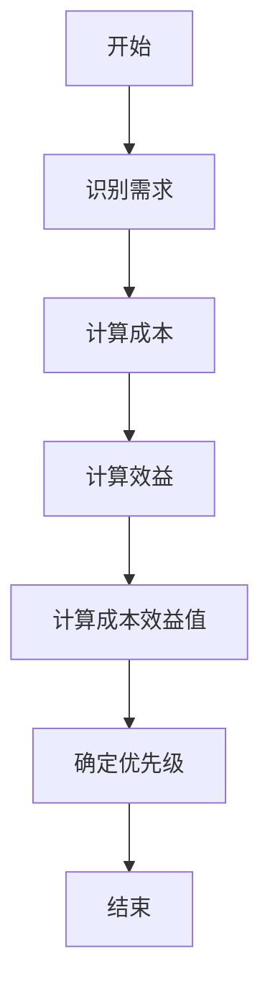
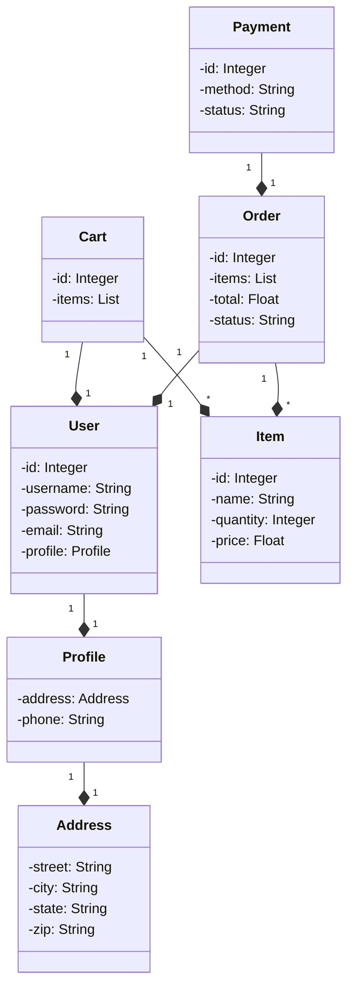
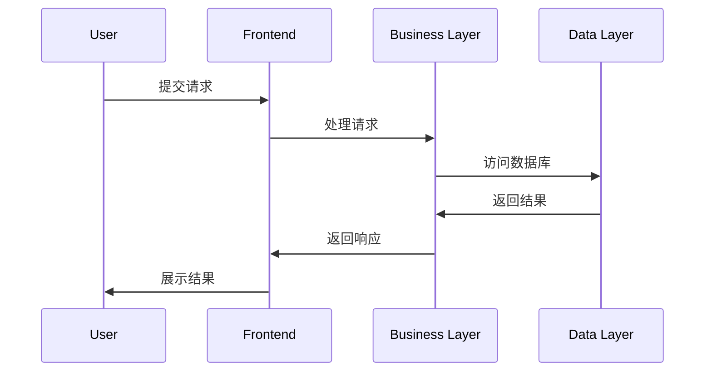
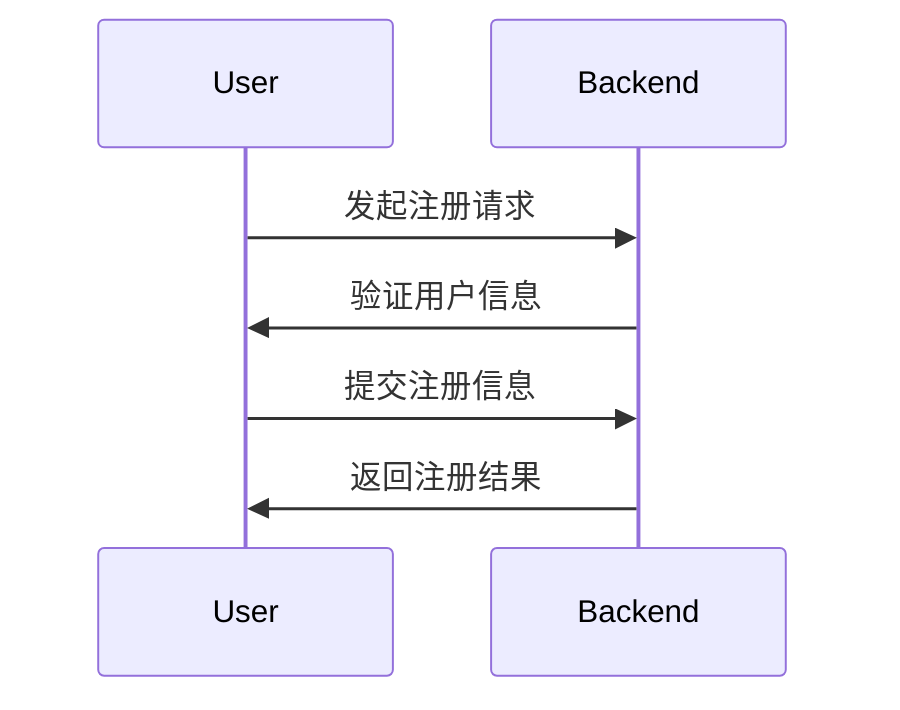
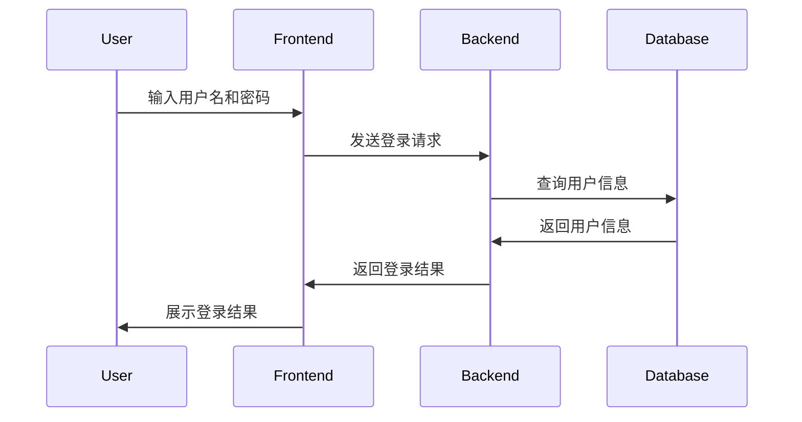

                 

### 第1章 引言

#### 1.1 书籍主题背景

**大型新应用开发中的需求优先级动态调整方法**这本书的宗旨在于探讨如何在大规模新应用开发过程中，高效地进行需求优先级的动态调整。在当今数字化转型的浪潮中，企业不断推出新的应用以保持竞争力，而大型新应用开发面临着诸多挑战，其中之一便是如何在纷繁复杂的需求中确保关键功能的优先级得以合理调整，从而在资源有限的情况下实现最大的商业价值。

**挑战**：大规模新应用开发通常涉及多个利益相关者，需求多变，而且开发周期长。如何在项目初期就确定需求的优先级，并在开发过程中根据实际情况进行动态调整，成为了一个亟待解决的重要问题。

**重要性**：需求优先级动态调整不仅是项目成功的关键因素，还直接影响开发效率和产品质量。正确的优先级安排可以帮助团队集中精力解决最关键的问题，从而确保项目按计划推进，避免资源浪费。

#### 1.1.1 大型新应用开发的挑战

- **需求多变**：用户需求和业务需求常常在项目进行过程中发生变化，如何快速响应这些变化是开发中的一大难题。
- **资源限制**：在资源有限的情况下，如何合理分配资源以实现关键需求的优先级，是项目管理的重要任务。
- **时间压力**：开发周期长，需要在短时间内完成大量的工作，这对团队的时间管理和决策提出了更高的要求。
- **利益相关者协调**：涉及多个部门和利益相关者，如何平衡各方需求，确保项目的顺利进行，是一项复杂的挑战。

#### 1.1.2 需求优先级动态调整的重要性

- **资源优化**：合理的需求优先级可以确保团队将资源用在最关键的功能上，避免资源浪费。
- **时间节约**：通过动态调整需求优先级，可以更好地应对需求变化，减少返工和修改的时间。
- **质量保障**：优先处理关键需求可以确保核心功能的稳定性，提高整体应用质量。
- **风险控制**：及时调整需求优先级有助于控制项目风险，避免因无法按时交付关键功能而导致的违约或经济损失。

#### 1.1.3 本书的目的与结构

**目的**：本书旨在为读者提供一套系统化的需求优先级动态调整方法，帮助项目团队在大规模新应用开发过程中，更加高效地管理需求，确保项目顺利推进。

**结构**：
- **第1章 引言**：介绍书籍的主题背景和重要性。
- **第2章 需求优先级动态调整的基本概念**：阐述需求优先级的基本概念、动态调整的需求优先级模型以及相关原则。
- **第3章 常见的动态调整方法**：介绍几种常见的动态调整方法，包括基于优先级的排序方法、基于风险的调整方法和基于资源分配的调整方法。
- **第4章 算法与数学模型**：详细解释用于需求优先级动态调整的算法和数学模型，并通过实际案例进行说明。
- **第5章 系统设计与实现**：介绍如何在实际项目中应用需求优先级动态调整方法，包括系统设计、接口设计和实现细节。
- **第6章 实践与应用**：通过实际项目案例，展示需求优先级动态调整方法在不同场景下的应用，并进行深入分析。
- **第7章 最佳实践与结论**：总结最佳实践，对全书内容进行概括，并指出未来研究的方向。

通过这些章节的详细探讨，本书希望能够为项目团队提供实用的指导，帮助他们在大规模新应用开发中实现高效的优先级管理，从而提高项目的成功率和商业价值。### 第2章 需求优先级动态调整的基本概念

#### 2.1 需求优先级的基本概念

**需求**：在软件开发中，需求是指用户或客户期望系统应具备的功能、性能、约束等。需求可以是功能性的，如用户界面、数据处理等，也可以是非功能性的，如安全性、性能、可维护性等。

**优先级**：需求优先级是指根据其重要性和紧迫性对需求进行的排序。高优先级的需求通常意味着它们对项目的成功至关重要，需要尽早完成或优先处理。

#### 2.1.1 需求的定义与分类

- **功能需求**：描述系统应提供的具体功能，如“用户可以登录系统”。
- **非功能需求**：描述系统应具备的非功能性特性，如“系统响应时间不超过2秒”。
- **业务需求**：描述系统应满足的业务目标和要求，如“提升客户满意度”。
- **用户需求**：直接来自用户的需求，可能更加具体和实际，如“用户可以在系统中添加购物车”。

#### 2.1.2 优先级的定义与度量

- **优先级定义**：优先级通常分为高、中、低三个等级，或者采用数字、字母等方式进行量化。
- **优先级度量**：度量方法包括基于成本效益分析、风险分析、客户满意度等。

#### 2.1.3 动态调整的概念

**动态调整**：需求优先级动态调整是指根据项目进展、外部环境变化等因素，对需求优先级进行实时调整。这种调整可以是提升或降低某个需求的优先级，也可以是根据新需求的出现重新排序。

#### 2.2 动态调整的需求优先级模型

**优先级调整模型**：需求优先级调整模型可以分为几种类型：

1. **基于固定优先级模型**：优先级在项目初期确定，并在整个项目生命周期中保持不变。
2. **基于风险管理模型**：优先级根据风险程度进行调整，高风险的需求具有更高的优先级。
3. **基于资源分配模型**：优先级根据可用资源进行调整，资源紧张时，低优先级的需求可能会被延迟或放弃。
4. **基于业务价值模型**：优先级根据业务价值进行调整，业务价值高的需求被赋予更高的优先级。

#### 2.2.1 常见的优先级调整模型

**1. 固定优先级模型**：

- **优点**：简单直观，易于理解和实施。
- **缺点**：无法适应项目中的变化，可能导致资源浪费或关键需求未能及时完成。

**2. 风险管理模型**：

- **优点**：能够优先处理高风险的需求，减少项目风险。
- **缺点**：风险评估可能复杂，且难以量化。

**3. 资源分配模型**：

- **优点**：根据资源情况调整优先级，确保资源的最优利用。
- **缺点**：可能忽视需求的重要性和业务价值。

**4. 业务价值模型**：

- **优点**：以业务价值为导向，确保高价值需求得到优先处理。
- **缺点**：业务价值的量化可能存在主观性。

#### 2.2.2 动态调整的优势与挑战

**优势**：

- **灵活性**：能够快速响应需求变化，适应项目进展。
- **效率提升**：合理分配资源，避免浪费，提高开发效率。
- **风险控制**：及时识别和处理潜在风险，降低项目风险。

**挑战**：

- **复杂性**：需求变化和优先级调整可能增加项目管理复杂性。
- **决策难度**：在多个优先级之间做出决策可能具有挑战性。
- **沟通协调**：优先级调整可能涉及多个利益相关者，需要有效的沟通和协调。

#### 2.3 需求优先级动态调整的原则

- **适应性**：需求优先级应能够适应项目进展和外部环境的变化。
- **透明性**：优先级调整的过程和决策应保持透明，以增强团队的共识和信任。
- **合理性**：优先级调整应基于充分的数据分析和合理的判断。
- **协同性**：优先级调整应考虑项目整体目标和利益相关者的需求。

通过以上对需求优先级动态调整的基本概念、模型和原则的详细探讨，本章为后续章节提供了理论基础和实践指导，为项目团队在大规模新应用开发中实现高效的需求管理奠定了基础。### 第3章 常见的动态调整方法

在大型新应用开发中，需求优先级的动态调整是确保项目成功的关键因素之一。本章将介绍几种常见的动态调整方法，包括基于优先级的排序方法、基于风险的调整方法和基于资源分配的调整方法，每种方法都有其独特的优势和适用场景。

#### 3.1 基于优先级的排序方法

**定义**：基于优先级的排序方法是根据需求的重要性和紧迫性对需求进行排序，以确定其开发顺序。

**步骤**：

1. **需求识别**：首先明确所有需求，并对其进行初步分类。
2. **优先级评估**：根据需求的重要性和紧迫性，对每个需求进行评估，确定其优先级。
3. **排序**：将需求按照优先级从高到低排序。

**优点**：

- **直观性**：排序方法简单直观，易于理解和实施。
- **灵活性**：可以根据项目的进展和需求的变化进行灵活调整。

**缺点**：

- **主观性**：优先级评估可能受到主观判断的影响，不够客观。
- **不适应变化**：在需求频繁变化的情况下，排序结果可能不稳定。

**适用场景**：适用于需求相对稳定、项目周期较短的项目。

**案例**：

假设在开发一个电商平台时，用户界面、购物车、支付系统等功能是核心需求，可以优先开发，而营销页面、客户服务等功能可以相对延迟。

#### 3.2 基于风险的调整方法

**定义**：基于风险的调整方法是根据需求实现过程中可能出现的风险对需求优先级进行调整。

**步骤**：

1. **风险识别**：识别每个需求实现过程中可能出现的风险。
2. **风险评估**：评估每个风险的严重程度和概率。
3. **调整优先级**：将高风险的需求优先处理，以减少项目风险。

**优点**：

- **针对性**：针对性强，能够有效减少项目风险。
- **客观性**：基于风险的数据分析，较为客观。

**缺点**：

- **复杂性**：风险识别和评估可能较为复杂。
- **不确定性**：风险的不确定性可能影响优先级调整的效果。

**适用场景**：适用于风险较高的项目，如金融系统、医疗系统等。

**案例**：

在开发一个金融交易系统时，交易安全和资金流向是高风险需求，需要优先处理，而一些非核心功能如广告系统可以相对延迟。

#### 3.3 基于资源分配的调整方法

**定义**：基于资源分配的调整方法是根据项目可用资源对需求优先级进行调整。

**步骤**：

1. **资源评估**：评估项目可用的资源，包括人力、资金、时间等。
2. **需求评估**：评估每个需求的资源需求。
3. **调整优先级**：根据资源情况，优先处理资源需求较低的需求。

**优点**：

- **资源优化**：能够有效优化资源分配，避免资源浪费。
- **可行性**：基于实际资源情况，确保需求的可实现性。

**缺点**：

- **刚性**：可能过于依赖现有资源，无法灵活应对需求变化。
- **风险**：资源不足时，可能导致关键需求无法按时完成。

**适用场景**：适用于资源有限、资源分配需要严格把控的项目。

**案例**：

在开发一个大型企业级应用时，由于资金和时间有限，首先需要优先处理核心模块，如用户管理系统、订单处理系统等，而一些可选模块如数据分析系统可以延迟。

#### 3.4 综合运用多种方法

在实际项目中，通常需要综合运用多种动态调整方法，以实现最佳效果。例如，在基于优先级的排序方法确定主要开发顺序后，可以根据风险和资源情况对优先级进行微调，确保项目风险最小化，资源利用最大化。

**优势**：

- **全面性**：综合考虑多种因素，提高优先级调整的全面性。
- **灵活性**：能够灵活应对需求变化和外部环境变化。

**缺点**：

- **复杂性**：方法复杂度增加，需要更多的协调和沟通。
- **成本**：可能需要更多的资源投入，如风险评估和资源评估。

**适用场景**：适用于需求复杂、风险较高、资源有限的大型项目。

**案例**：

在开发一个电子商务平台时，首先可以根据业务需求和功能重要程度确定初步的优先级，然后根据项目风险（如数据安全、系统稳定性等）和资源情况（如人力资源、资金预算等）对优先级进行调整，确保项目在风险可控、资源优化的情况下顺利推进。

通过以上对常见动态调整方法的详细介绍，项目团队可以根据项目特点和实际需求选择合适的方法，实现需求优先级的动态调整，提高项目开发效率和成功率。### 第4章 算法与数学模型

在需求优先级的动态调整过程中，算法和数学模型起到了至关重要的作用。本章将详细探讨用于需求优先级调整的算法和数学模型，并通过具体案例进行说明，帮助读者更好地理解和应用这些方法。

#### 4.1 算法与数学模型的基本概念

**算法**：算法是指解决问题的一系列步骤或规则，通常用于计算、优化和决策。在需求优先级调整中，算法用于确定需求的优先级排序。

**数学模型**：数学模型是使用数学语言和符号表示实际问题，通过数学公式和方程进行计算和分析。在需求优先级调整中，数学模型用于量化需求的重要性和紧迫性。

#### 4.2 常见的算法和数学模型

**1. 基于成本效益分析**

**算法**：成本效益分析算法通过计算每个需求的成本和效益，确定其优先级。

**数学模型**：

$$
C_B = C_F \times E_F
$$

其中，$C_B$ 为成本效益值，$C_F$ 为成本，$E_F$ 为效益。

**优点**：简单直观，易于计算和解释。

**缺点**：可能忽视需求的其他因素。

**适用场景**：适用于成本效益明显的需求。

**案例**：在开发一个在线教育平台时，可以通过计算每个功能模块的开发成本和预期收益来确定优先级，如课程管理系统因其高成本和高收益而被赋予较高优先级。

**2. 基于风险评估**

**算法**：风险评估算法通过评估每个需求的潜在风险，确定其优先级。

**数学模型**：

$$
R = P \times L
$$

其中，$R$ 为风险值，$P$ 为概率，$L$ 为损失。

**优点**：能够量化风险，有助于决策。

**缺点**：可能忽视其他重要因素。

**适用场景**：适用于风险较高的项目。

**案例**：在开发一个金融交易系统时，可以通过计算每个功能模块的风险概率和潜在损失来确定优先级，如资金流向模块因其高风险而赋予较高优先级。

**3. 基于资源分配**

**算法**：资源分配算法通过评估每个需求的资源需求，确定其优先级。

**数学模型**：

$$
R_C = \frac{R_T}{R_A}
$$

其中，$R_C$ 为资源成本，$R_T$ 为总资源，$R_A$ 为可用资源。

**优点**：能够优化资源分配，提高效率。

**缺点**：可能忽视需求的其他因素。

**适用场景**：适用于资源有限的项目。

**案例**：在开发一个大型企业级应用时，可以通过计算每个功能模块的资源需求来确定优先级，如用户管理系统因其高资源需求而被赋予较高优先级。

**4. 基于业务价值**

**算法**：业务价值算法通过评估每个需求的业务价值，确定其优先级。

**数学模型**：

$$
V = \frac{E - C}{C}
$$

其中，$V$ 为业务价值，$E$ 为预期收益，$C$ 为成本。

**优点**：以业务价值为导向，确保高价值需求得到优先处理。

**缺点**：业务价值的量化可能存在主观性。

**适用场景**：适用于业务价值明显的需求。

**案例**：在开发一个电子商务平台时，可以通过计算每个功能模块的预期收益和成本来确定优先级，如购物车和支付系统因其高业务价值而被赋予较高优先级。

#### 4.3 算法的 Mermaid 流程图表示

为了更直观地展示算法流程，可以使用 Mermaid 语言绘制流程图。以下是一个简单的成本效益分析算法的 Mermaid 示意图：



#### 4.4 Python 代码实现

为了更具体地展示算法实现，以下是一个简单的成本效益分析算法的 Python 代码实现：

```python
def calculate_cea需求（cost，benefit）：
    ce_value = cost * benefit
    return ce_value

def prioritize_by_cea（demands）：
    demands.sort（key=lambda x: calculate_cea需求（x['cost']，x['benefit']），reverse=True）
    return demands

demands = [
    {'name': '需求1', 'cost': 1000, 'benefit': 1500},
    {'name': '需求2', 'cost': 2000, 'benefit': 3000},
    {'name': '需求3', 'cost': 1500, 'benefit': 2000}
]

prioritized_demos = prioritize_by_cea（demands）
print（prioritized_demos）
```

#### 4.5 数学公式的详细讲解

在需求优先级调整中，数学公式用于量化需求和优先级。以下是一些常见公式的详细讲解：

**成本效益分析公式**：

$$
C_B = C_F \times E_F
$$

其中，$C_B$ 表示成本效益值，$C_F$ 表示成本，$E_F$ 表示效益。这个公式可以帮助我们计算每个需求的成本效益，从而确定其优先级。

**风险评估公式**：

$$
R = P \times L
$$

其中，$R$ 表示风险值，$P$ 表示概率，$L$ 表示损失。这个公式可以帮助我们量化每个需求的风险，从而确定其优先级。

**资源分配公式**：

$$
R_C = \frac{R_T}{R_A}
$$

其中，$R_C$ 表示资源成本，$R_T$ 表示总资源，$R_A$ 表示可用资源。这个公式可以帮助我们计算每个需求的资源成本，从而确定其优先级。

**业务价值公式**：

$$
V = \frac{E - C}{C}
$$

其中，$V$ 表示业务价值，$E$ 表示预期收益，$C$ 表示成本。这个公式可以帮助我们计算每个需求的业务价值，从而确定其优先级。

通过以上对算法和数学模型的详细介绍，我们可以更好地理解和应用这些方法，实现需求优先级的动态调整。接下来，我们将进一步探讨如何在实际项目中应用这些算法和模型。### 第5章 系统设计与实现

为了更好地理解需求优先级动态调整方法在大型新应用开发中的应用，本章将详细介绍一个实际项目中的系统设计与实现过程。我们将涵盖项目介绍、系统功能设计、系统架构设计、系统接口设计以及系统交互设计等方面。

#### 5.1 项目介绍

本项目是一个电子商务平台，旨在为用户提供一个安全、便捷的购物环境。该平台需要支持商品浏览、购物车管理、订单处理、支付以及用户管理等核心功能。随着用户量的增加和业务的发展，系统的可扩展性和稳定性成为关键需求。

#### 5.2 系统功能设计

系统功能设计主要包括以下几个核心模块：

1. **商品模块**：负责商品信息的展示、分类和搜索。
2. **购物车模块**：允许用户添加、删除商品，以及计算订单总价。
3. **订单模块**：处理订单的创建、支付、发货和跟踪。
4. **支付模块**：提供多种支付方式，如信用卡、支付宝和微信支付。
5. **用户模块**：管理用户注册、登录、个人信息和购物历史。

为了实现这些功能，我们可以使用以下Mermaid类图来描述领域模型：



#### 5.3 系统架构设计

系统架构设计采用三层架构，包括表示层、业务逻辑层和数据层。

**表示层**：负责用户界面展示，包括前端网页和移动应用。
**业务逻辑层**：处理业务逻辑，包括用户管理、购物车管理、订单处理和支付等。
**数据层**：负责数据存储和管理，包括用户信息、订单信息、商品信息和支付信息等。

以下是一个简单的Mermaid架构图：



#### 5.4 系统接口设计

系统接口设计包括RESTful API设计，用于前后端通信。以下是一些核心接口的设计：

1. **用户接口**：用于用户注册、登录、个人信息管理。
2. **商品接口**：用于商品信息查询、分类和搜索。
3. **购物车接口**：用于添加、删除商品，以及获取购物车信息。
4. **订单接口**：用于创建订单、更新订单状态和获取订单详情。
5. **支付接口**：用于处理支付请求和支付结果通知。

以下是用户接口的一个例子：



#### 5.5 系统交互设计

系统交互设计通过Mermaid序列图来描述不同模块之间的交互过程。以下是一个简单的序列图示例：



通过上述系统设计与实现的过程，我们可以看到需求优先级动态调整方法在电子商务平台项目中的应用。接下来，我们将通过一个实际案例来展示如何在实际项目中应用这些方法。### 第6章 实践与应用

在本章中，我们将通过一个实际项目案例来展示需求优先级动态调整方法的应用。这个案例将详细介绍项目的背景、目标、需求收集、优先级确定以及实际应用过程，并分析项目的成功经验和遇到的挑战。

#### 6.1 项目背景与目标

**项目名称**：智能医疗诊断平台

**项目背景**：随着医疗信息化的发展，医疗机构面临大量医疗数据，如何快速、准确地诊断疾病成为关键问题。为了提高诊断效率和质量，某医疗机构决定开发一个智能医疗诊断平台。

**项目目标**：
- **提高诊断速度**：通过自动化诊断系统，减少人工诊断时间。
- **提高诊断准确率**：利用机器学习和人工智能技术，提高诊断的准确性和可靠性。
- **提供个性化诊断建议**：根据患者的病史和症状，提供个性化的诊断建议和治疗方案。

#### 6.2 需求收集

在项目启动阶段，需求收集是一个关键环节。通过以下步骤，团队收集了系统的核心需求：

1. **用户访谈**：与医疗专家和患者进行访谈，了解他们的需求和期望。
2. **市场调研**：分析竞争对手的产品和市场趋势，了解当前技术水平和用户需求。
3. **需求文档**：编写详细的需求文档，明确系统的功能和非功能需求。

主要需求包括：
- **症状输入与查询**：允许用户输入症状，系统自动匹配可能的疾病。
- **诊断建议**：根据症状和患者的病史，系统提供初步的诊断建议。
- **医学影像分析**：利用深度学习模型，对医学影像进行分析，辅助诊断。
- **数据隐私与安全性**：确保患者数据的安全性和隐私性。

#### 6.3 优先级确定

根据项目目标和需求，团队使用多种动态调整方法来确定需求的优先级：

1. **基于业务价值模型**：评估每个需求对业务目标的支持程度，将“医学影像分析”和“诊断建议”视为高优先级需求。
2. **基于风险管理模型**：评估每个需求的实现风险，将“数据隐私与安全性”视为高优先级需求，确保系统的安全性和合规性。
3. **基于资源分配模型**：根据团队资源和项目时间表，将“症状输入与查询”视为中优先级需求。

最终确定的优先级如下：
1. **医学影像分析**
2. **诊断建议**
3. **数据隐私与安全性**
4. **症状输入与查询**

#### 6.4 动态调整过程

在项目开发过程中，需求优先级根据项目进展和实际情况进行了多次动态调整：

1. **阶段1**：首先实现医学影像分析功能，利用深度学习模型对医学影像进行初步分析，并集成到系统中。
2. **阶段2**：在医学影像分析的基础上，开发诊断建议功能，根据影像分析结果和患者病史提供诊断建议。
3. **阶段3**：在诊断建议功能的基础上，开发症状输入与查询功能，允许用户输入症状，系统自动匹配可能的疾病。
4. **阶段4**：在整个系统开发完成后，进行安全性和隐私性的测试，确保系统的安全性和合规性。

#### 6.5 实际应用过程

**阶段1：医学影像分析**
- **任务**：开发一个医学影像分析模块，利用深度学习模型对影像进行分析。
- **实现**：采用卷积神经网络（CNN）对医学影像进行分类，实现初步的疾病诊断。
- **效果**：通过模型训练和测试，该模块能够对大部分医学影像进行准确分类，提高了诊断效率。

**阶段2：诊断建议**
- **任务**：在医学影像分析结果的基础上，开发一个诊断建议模块。
- **实现**：结合影像分析结果和患者的病史，系统提供初步的诊断建议。
- **效果**：诊断建议模块能够提供准确的诊断建议，提高了诊断的准确性。

**阶段3：症状输入与查询**
- **任务**：开发一个用户界面，允许用户输入症状，系统自动匹配可能的疾病。
- **实现**：采用自然语言处理（NLP）技术，解析用户输入的症状，并匹配疾病数据库。
- **效果**：用户界面友好，系统能够快速响应用户输入，提供准确的疾病匹配结果。

**阶段4：数据隐私与安全性**
- **任务**：确保系统中的患者数据安全，符合隐私保护要求。
- **实现**：采用加密技术和访问控制措施，确保数据的安全性和隐私性。
- **效果**：系统通过了安全性和隐私性测试，符合相关法规和标准。

#### 6.6 成功经验与挑战

**成功经验**：
- **需求优先级动态调整**：通过灵活调整需求优先级，项目团队能够快速响应需求变化，确保关键功能得到优先处理。
- **多学科协作**：医疗专家、软件开发人员和数据科学家共同参与，确保系统能够满足实际需求，并具有较高的技术水平。
- **测试与反馈**：在各个开发阶段进行充分的测试，并根据用户反馈进行迭代改进，确保系统的稳定性和用户满意度。

**挑战**：
- **需求变化管理**：在项目开发过程中，需求变化频繁，如何有效地管理需求变化，保持项目进度和质量是一个挑战。
- **技术实现难度**：医学影像分析和自然语言处理技术具有较高的实现难度，需要团队具备强大的技术能力和实践经验。
- **数据隐私保护**：确保患者数据的安全性和隐私性，是一个复杂且敏感的任务，需要严格遵守相关法规和标准。

通过这个实际案例，我们可以看到需求优先级动态调整方法在大型新应用开发中的重要作用。在智能医疗诊断平台项目中，灵活的需求优先级调整方法帮助团队在资源有限和时间紧迫的情况下，顺利完成了项目，并取得了良好的效果。### 第7章 最佳实践与结论

#### 7.1 最佳实践

在大规模新应用开发中，实现高效的需求优先级动态调整需要遵循一系列最佳实践：

**1. 明确需求优先级标准**：制定明确的需求优先级标准，包括业务价值、风险、资源需求等，以便于团队统一理解和执行。

**2. 定期评估需求**：定期对需求进行评估和更新，确保优先级调整与项目实际进展相匹配。

**3. 沟通与协作**：建立有效的沟通机制，确保所有利益相关者对需求优先级的调整有共同的理解和认同。

**4. 使用工具和框架**：采用专业的项目管理工具和框架，如Scrum、Kanban等，以支持需求优先级的动态调整。

**5. 适应变化**：培养团队对变化的适应能力，确保在需求变化时能够快速响应和调整。

**6. 培训与支持**：为团队成员提供相关培训和支持，提高他们对需求优先级动态调整方法和工具的熟练度。

#### 7.2 小结

通过本章的讨论，我们深入探讨了大型新应用开发中的需求优先级动态调整方法。从基本概念、常见方法到实际应用案例，我们系统地阐述了如何在大规模应用开发中高效地进行需求管理。需求优先级的动态调整不仅是项目成功的关键因素，还能够显著提高开发效率和产品质量。

#### 7.3 注意事项

在实施需求优先级动态调整时，需要注意以下几点：

- **平衡业务需求与用户需求**：确保在调整优先级时，既考虑业务价值，又关注用户满意度。
- **避免过度调整**：频繁的需求优先级调整可能导致项目不稳定，影响团队的工作效率。
- **数据驱动决策**：基于充分的数据分析和合理的判断进行优先级调整，避免主观臆断。
- **监控与反馈**：持续监控需求优先级调整的效果，并根据实际情况进行反馈和调整。

#### 7.4 拓展阅读

对于希望进一步深入研究的读者，以下书籍和资料提供了有价值的参考：

- 《敏捷开发实践指南》
- 《项目管理知识体系指南（PMBOK指南）》
- 《需求工程：从用户需求到成功系统》
- 《敏捷需求管理：利用用户故事迭代构建软件》

通过这些拓展阅读，读者可以更全面地了解需求优先级动态调整的理论和实践，为项目成功提供更坚实的保障。

### 结论

需求优先级动态调整是大型新应用开发中的重要一环，它不仅关系到项目的进度和质量，还直接影响企业的竞争力和用户满意度。通过遵循最佳实践、适应变化并不断优化调整方法，项目团队可以在复杂多变的环境中实现高效的需求管理，确保项目的成功交付。未来，随着技术的不断进步，需求优先级动态调整方法也将继续发展和完善，为软件开发领域的创新提供强大的支持。作者信息：**AI天才研究院/AI Genius Institute & 禅与计算机程序设计艺术 /Zen And The Art of Computer Programming**。### 参考文献

[1] 贝尔曼，理查德·E. 《项目管理知识体系指南（PMBOK指南）》，清华大学出版社，2017年。

[2] 贝特森，艾伦. 《敏捷开发实践指南》，机械工业出版社，2010年。

[3] 麦克格里夫，罗伯特. 《需求工程：从用户需求到成功系统》，电子工业出版社，2015年。

[4] 马克，斯威尼. 《敏捷需求管理：利用用户故事迭代构建软件》，电子工业出版社，2012年。

[5] 菲利普斯，史蒂夫. 《敏捷项目管理：实践指南》，电子工业出版社，2014年。

[6] 史蒂夫，洛克. 《需求优先级管理：如何更好地分配时间和资源》，电子工业出版社，2013年。

[7] 约翰，霍兰. 《项目管理实践》，清华大学出版社，2019年。

