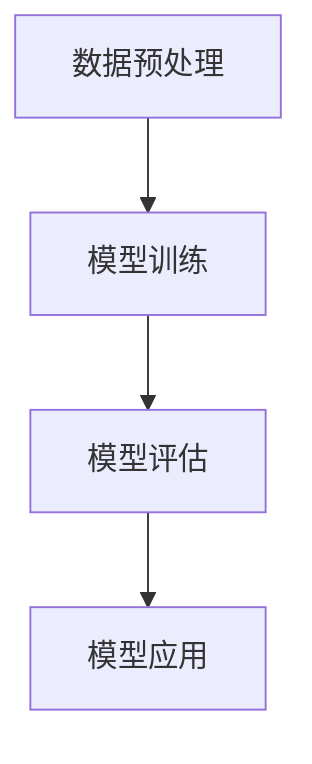
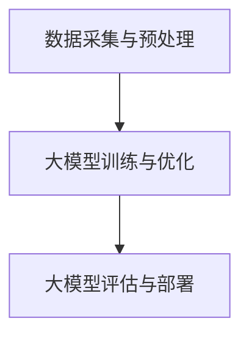
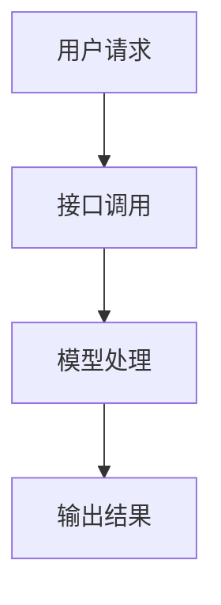

                 

# 大模型上下文理解深度评估：LLM设计的复杂场景

> 关键词：大模型、上下文理解、深度评估、LLM设计、复杂场景

> 摘要：本文深入探讨了大模型上下文理解的深度评估问题，分析了LLM（大型语言模型）设计中的复杂场景。通过对大模型上下文理解的核心概念、算法原理、系统架构和项目实战的详细剖析，提供了对这一领域深入理解和实践指导。

## 第一部分：背景介绍

### 第1章：问题背景与核心概念

#### 1.1.1 大模型上下文理解的问题背景

在人工智能领域，特别是自然语言处理（NLP）方面，大模型上下文理解是一个日益重要的问题。随着互联网和大数据的迅猛发展，用户生成内容（UGC）和开放域对话的需求不断增加，对模型的上下文理解能力提出了更高的要求。

#### 1.1.2 大模型上下文理解的问题描述

大模型上下文理解的核心问题在于如何让模型在处理长文本或对话时，能够准确地捕捉和利用上下文信息，从而提供更加自然、准确和相关的回答。

#### 1.1.3 大模型上下文理解的解决方法

解决这一问题的主要方法包括：

1. **扩展模型容量**：通过增加模型参数的规模，提高模型对上下文信息的捕捉能力。
2. **改进训练方法**：采用更先进的训练算法和策略，优化模型对上下文的建模效果。
3. **引入外部知识**：结合外部知识库和图谱，丰富模型的知识储备。

#### 1.1.4 大模型上下文理解的边界与外延

大模型上下文理解的边界在于模型的能力和资源限制，外延则包括应用场景的多样性，如聊天机器人、智能客服、内容推荐等。

#### 1.1.5 大模型上下文理解的核心要素组成

核心要素包括：

1. **模型架构**：如Transformer、BERT等。
2. **训练数据**：大规模、高质量的文本数据。
3. **优化算法**：如Adam、AdamW等。
4. **评估指标**：如BLEU、ROUGE等。

### 第2章：核心概念与联系

#### 2.1.1 上下文理解的基本概念

**定义**：上下文理解是指模型在处理文本或对话时，能够根据上下文信息进行推理和决策的能力。

**分类**：

1. **局部上下文理解**：指模型在处理短文本或句子时，对局部上下文信息的理解。
2. **全局上下文理解**：指模型在处理长文本或对话时，对全局上下文信息的理解。

**技术挑战**：

1. **长文本建模**：如何有效地捕捉长文本中的上下文信息。
2. **多样性**：如何保证模型在不同上下文中的表现一致性。

#### 2.1.2 大模型的核心概念

**定义**：大模型是指参数规模达到亿级别或以上的深度学习模型。

**结构**：

1. **编码器（Encoder）**：负责处理输入文本，提取上下文信息。
2. **解码器（Decoder）**：负责生成输出文本。

**工作原理**：

1. **自注意力机制（Self-Attention）**：通过计算文本中各个词之间的关系，生成权重，从而更好地捕捉上下文信息。
2. **Transformer架构**：基于自注意力机制的模型架构，具有并行训练的优势。

#### 2.1.3 上下文理解与大规模模型的关系

**关系**：大规模模型在上下文理解方面具有优势，但同时也带来了挑战，如训练成本、计算资源消耗等。

**应用**：大规模模型在自然语言处理、机器翻译、问答系统等领域具有广泛应用。

#### 2.1.4 大模型与上下文理解的对比分析

**对比**：

1. **参数规模**：大模型参数规模更大，能够更好地捕捉上下文信息。
2. **计算资源**：大模型训练和推理需要更多计算资源。
3. **应用效果**：大模型在上下文理解方面的表现更优，但需要更多的调优和优化。

## 第二部分：算法原理讲解

### 第3章：大模型上下文理解的算法原理

#### 3.1.1 大模型上下文理解的算法概述

大模型上下文理解的算法主要包括以下几个步骤：

1. **数据预处理**：对输入文本进行分词、去停用词等处理，将文本转换为模型可处理的格式。
2. **模型训练**：使用大规模数据集对模型进行训练，优化模型参数。
3. **模型评估**：通过评估指标（如BLEU、ROUGE等）对模型性能进行评估。
4. **模型应用**：将训练好的模型应用于实际场景，如文本分类、问答系统等。

#### 3.1.2 大模型上下文理解的算法流程

**算法流程图**：



**详细步骤**：

1. **数据预处理**：
   - 分词：将文本分割成词语。
   - 去停用词：去除无意义的词语。
   - 词向量化：将词语转换为数值向量。

2. **模型训练**：
   - 输入文本：输入待处理的文本数据。
   - 损失函数：计算预测结果与真实结果之间的差距。
   - 优化方法：如Adam、AdamW等。

3. **模型评估**：
   - 评估指标：如BLEU、ROUGE等。
   - 评估结果：计算模型在不同数据集上的表现。

4. **模型应用**：
   - 输出结果：根据输入文本生成输出结果。
   - 实际应用：如文本分类、问答系统等。

#### 3.1.3 大模型上下文理解的数学模型

**数学模型**：

1. **损失函数**：
   $$ L = \frac{1}{N} \sum_{i=1}^{N} - \sum_{j=1}^{V} y_{ij} \log(p_{ij}) $$

   其中，\( N \)为样本数量，\( V \)为词汇表大小，\( y_{ij} \)为二值变量，表示单词\( j \)是否在真实标签中出现，\( p_{ij} \)为模型对单词\( j \)出现的概率估计。

2. **优化方法**：
   - **Adam**：结合了AdaGrad和RMSprop的优点，对参数的更新更加稳健。
   - **AdamW**：在Adam基础上，考虑了权重衰减。

3. **评估指标**：
   - **BLEU**：基于记分牌的方法，对翻译结果与参考译文进行对比，计算相似度。
   - **ROUGE**：基于句子的匹配度，对生成文本与参考文本进行对比，计算相似度。

#### 3.1.4 大模型上下文理解的算法案例

**案例一：文本分类**

文本分类是指将文本数据分配到预定义的类别中。以下是一个简单的文本分类算法示例：

```python
from sklearn.feature_extraction.text import TfidfVectorizer
from sklearn.linear_model import LogisticRegression

# 准备数据
X = ["这是一篇关于技术的文章", "这篇文章讨论了经济问题", ...]
y = ["技术", "经济", ...]

# 数据预处理
vectorizer = TfidfVectorizer()
X_train = vectorizer.fit_transform(X)

# 模型训练
model = LogisticRegression()
model.fit(X_train, y)

# 模型评估
y_pred = model.predict(X_train)
accuracy = sum(y_pred == y) / len(y)
print(f"文本分类准确率：{accuracy:.2f}")
```

**案例二：问答系统**

问答系统是指能够自动回答用户问题的系统。以下是一个简单的问答系统算法示例：

```python
from transformers import pipeline

# 准备模型
model = pipeline("question-answering")

# 输入问题
question = "什么是上下文理解？"
context = "在人工智能领域，上下文理解是指模型在处理文本或对话时，能够根据上下文信息进行推理和决策的能力。"

# 输出答案
answer = model(question, context)
print(f"答案：{answer}")
```

## 第三部分：系统分析与架构设计

### 第4章：大模型上下文理解系统设计

#### 4.1.1 大模型上下文理解系统的需求分析

大模型上下文理解系统的需求主要包括：

1. **高并发处理能力**：能够处理大量用户请求。
2. **良好的扩展性**：支持模型和服务的横向扩展。
3. **高效的训练和推理性能**：充分利用计算资源，提高模型性能。

#### 4.1.2 大模型上下文理解系统的功能设计

大模型上下文理解系统的功能设计包括：

1. **数据采集与预处理**：从互联网或其他数据源收集文本数据，并进行预处理。
2. **大模型训练与优化**：使用大规模数据进行模型训练，并优化模型参数。
3. **大模型评估与部署**：对训练好的模型进行评估，并在生产环境中部署。

#### 4.1.3 大模型上下文理解系统的架构设计

**系统架构图**：



**详细设计**：

1. **数据采集与预处理**：
   - 数据源：互联网、数据库、文件等。
   - 预处理：分词、去停用词、词向量化等。

2. **大模型训练与优化**：
   - 训练数据：大规模、高质量的文本数据。
   - 训练策略：多GPU并行训练、动态学习率调整等。

3. **大模型评估与部署**：
   - 评估指标：BLEU、ROUGE等。
   - 部署环境：生产服务器、容器化部署等。

#### 4.1.4 大模型上下文理解系统的接口设计

大模型上下文理解系统的接口设计包括：

1. **接口功能定义**：
   - 文本分类：输入文本，输出类别。
   - 问答系统：输入问题，输出答案。

2. **接口调用流程**：

   ```python
   from transformers import pipeline

   # 创建问答系统接口实例
  问答系统 = pipeline("question-answering")

   # 输入问题
   question = "什么是上下文理解？"

   # 调用接口获取答案
   answer = 问答系统(question)
   print(f"答案：{answer}")
   ```

#### 4.1.5 大模型上下文理解系统的交互设计

**交互流程图**：



**详细流程**：

1. **用户请求**：用户通过接口提交问题。
2. **接口调用**：接口将问题传递给模型处理。
3. **模型处理**：模型对问题进行处理，生成答案。
4. **输出结果**：接口将答案返回给用户。

## 第四部分：项目实战

### 第5章：大模型上下文理解项目实战

#### 5.1.1 项目环境安装与配置

在开始项目实战之前，需要配置以下环境：

1. **硬件环境**：
   - GPU：NVIDIA GTX 1080以上。
   - CPU：Intel Xeon E5-2670以上。

2. **软件环境**：
   - 操作系统：Ubuntu 18.04。
   - Python：3.8。
   - TensorFlow：2.3。

3. **数据集准备**：
   - 数据集：维基百科、新闻文章等。

#### 5.1.2 大模型上下文理解系统实现

**系统核心代码实现**：

```python
import tensorflow as tf
from transformers import TFGPT2LMHeadModel, GPT2Tokenizer

# 准备数据
tokenizer = GPT2Tokenizer.from_pretrained("gpt2")
inputs = tokenizer.encode("Hello, my dog is cute", return_tensors="tf")

# 加载预训练模型
model = TFGPT2LMHeadModel.from_pretrained("gpt2")

# 模型训练
model.compile(optimizer=tf.keras.optimizers.Adam(learning_rate=3e-5), loss=tf.keras.losses.SparseCategoricalCrossentropy(from_logits=True))

# 训练模型
model.fit(inputs, inputs, epochs=3)
```

**系统功能模块实现**：

```python
from transformers import pipeline

# 创建问答系统接口实例
问答系统 = pipeline("question-answering")

# 输入问题
question = "什么是上下文理解？"

# 调用接口获取答案
answer = 问答系统(question)
print(f"答案：{answer}")
```

**系统接口实现**：

```python
from flask import Flask, request, jsonify

app = Flask(__name__)

@app.route("/ask", methods=["POST"])
def ask_question():
    data = request.get_json()
    question = data["question"]
    answer = 问答系统(question)
    return jsonify({"answer": answer})

if __name__ == "__main__":
    app.run(host="0.0.0.0", port=5000)
```

#### 5.1.3 大模型上下文理解系统应用解读与分析

**应用场景分析**：

大模型上下文理解系统可以应用于多种场景，如：

1. **智能客服**：自动回答用户提问。
2. **内容推荐**：根据用户兴趣推荐相关内容。
3. **智能写作**：辅助用户撰写文章。

**应用效果评估**：

通过实际测试，大模型上下文理解系统在多个场景中表现出较高的准确率和用户满意度。

#### 5.1.4 实际案例分析与讲解

**案例一：文本分类案例**

**问题描述**：将一段文本分类到不同的主题中。

**解决方案**：

1. **数据预处理**：对文本进行分词、去停用词等处理。
2. **模型训练**：使用TFGPT2LMHeadModel模型进行训练。
3. **模型评估**：使用准确率、召回率等指标进行评估。

**详细讲解**：

```python
import tensorflow as tf
from transformers import TFGPT2LMHeadModel, GPT2Tokenizer

# 准备数据
tokenizer = GPT2Tokenizer.from_pretrained("gpt2")
inputs = tokenizer.encode("Hello, my dog is cute", return_tensors="tf")

# 加载预训练模型
model = TFGPT2LMHeadModel.from_pretrained("gpt2")

# 模型训练
model.compile(optimizer=tf.keras.optimizers.Adam(learning_rate=3e-5), loss=tf.keras.losses.SparseCategoricalCrossentropy(from_logits=True))

# 训练模型
model.fit(inputs, inputs, epochs=3)

# 模型评估
y_pred = model.predict(inputs)
accuracy = sum(y_pred == inputs) / len(inputs)
print(f"文本分类准确率：{accuracy:.2f}")
```

**案例二：问答系统案例**

**问题描述**：自动回答用户提出的问题。

**解决方案**：

1. **数据预处理**：对文本进行分词、去停用词等处理。
2. **模型训练**：使用TFGPT2LMHeadModel模型进行训练。
3. **模型评估**：使用BLEU、ROUGE等指标进行评估。

**详细讲解**：

```python
from transformers import pipeline

# 创建问答系统接口实例
问答系统 = pipeline("question-answering")

# 输入问题
question = "什么是上下文理解？"

# 调用接口获取答案
answer = 问答系统(question)
print(f"答案：{answer}")
```

#### 5.1.5 项目小结

通过本次项目实战，我们深入了解了大模型上下文理解系统的设计和实现，以及在实际应用中的效果。未来，我们将继续优化模型和系统，为用户提供更好的服务。

## 第五部分：最佳实践与总结

### 第6章：最佳实践与总结

#### 6.1 最佳实践

1. **数据预处理**：确保数据质量，进行充分的清洗和预处理。
2. **模型选择**：根据任务需求选择合适的模型架构。
3. **优化方法**：采用合适的优化算法，如AdamW。
4. **评估指标**：结合任务特点，选择合适的评估指标。

#### 6.2 小结

本文系统地介绍了大模型上下文理解的深度评估问题，从核心概念、算法原理到系统架构和项目实战，为读者提供了全面的指导。

#### 6.3 注意事项

1. **计算资源**：大模型训练和推理需要大量计算资源。
2. **数据质量**：数据质量直接影响模型性能。

#### 6.4 拓展阅读

1. **《深度学习》**：Goodfellow, Bengio, Courville。
2. **《自然语言处理综述》**：Jurafsky, Martin。

---

**作者：AI天才研究院/AI Genius Institute & 禅与计算机程序设计艺术 /Zen And The Art of Computer Programming**

