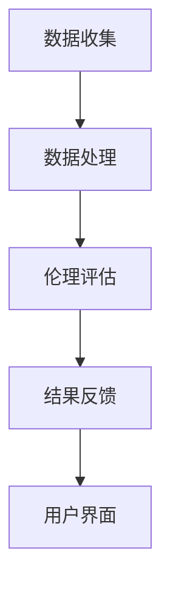
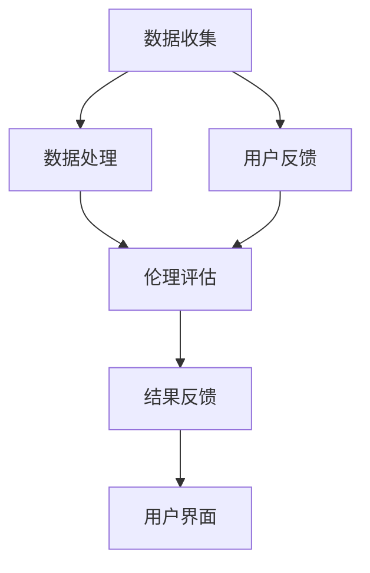
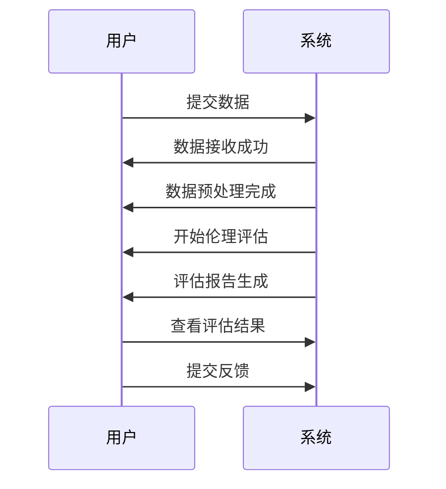
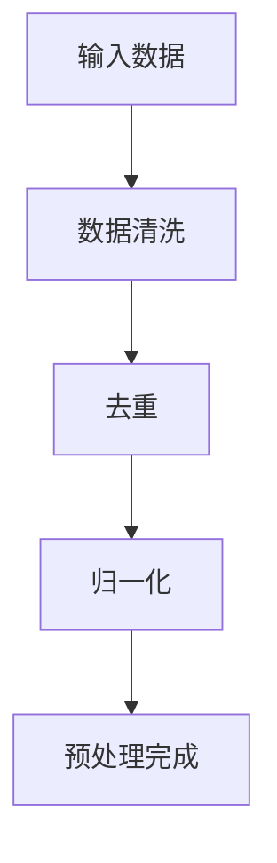
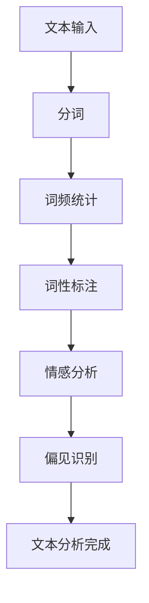
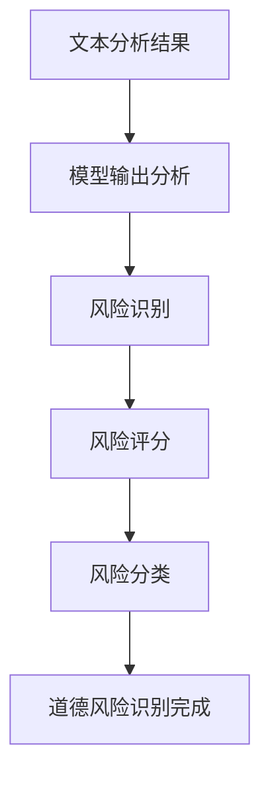
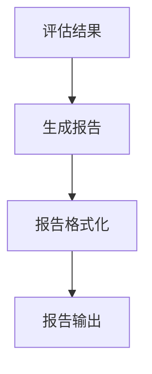

                 

### 大模型伦理评估：LLM辅助的道德风险识别系统

#### 关键词：
- 大模型伦理评估
- LLM（大规模语言模型）
- 道德风险识别
- 人工智能伦理
- AI应用场景

#### 摘要：
随着人工智能技术的发展，特别是大规模语言模型（LLM）的广泛应用，伦理问题日益凸显。本文旨在探讨大模型伦理评估的重要性，并构建一种基于LLM的道德风险识别系统，以解决人工智能在应用过程中可能引发的伦理困境。文章首先介绍大模型伦理评估的背景和问题，接着阐述大规模语言模型的基础知识，详细分析LLM的道德风险识别方法，并通过实际案例展示评估过程，最后提出LLM伦理评估系统的实现方法及其未来发展方向。

### 目录大纲

#### 第一部分：背景介绍

1. **第1章：大模型伦理评估概述**
   - **1.1 问题背景**
   - **1.2 问题解决**
   - **1.3 边界与外延**
   - **1.4 概念结构与核心要素组成**

2. **第2章：大规模语言模型（LLM）基础**
   - **2.1 大规模语言模型的定义**
   - **2.2 特点**
   - **2.3 与传统AI模型的区别**

#### 第二部分：方法与实现

3. **第3章：LLM的道德风险识别方法**
   - **3.1 伦理评估框架**
   - **3.2 评估标准**

4. **第4章：LLM伦理评估案例分析**
   - **4.1 案例选择**
   - **4.2 评估过程**
   - **4.3 结果分析**

5. **第5章：LLM伦理评估系统的实现**
   - **5.1 系统架构设计**
   - **5.2 功能模块**

#### 第三部分：算法与实战

6. **第6章：Python源代码实现与算法讲解**
   - **6.1 Python环境配置**
   - **6.2 算法原理讲解**
   - **6.3 代码示例**

7. **第7章：实际案例分析与讨论**

#### 第四部分：展望与实践

8. **第8章：最佳实践与未来展望**
   - **8.1 最佳实践**
   - **8.2 未来展望**

9. **第9章：总结与展望**
   - **9.1 小结**
   - **9.2 注意事项**
   - **9.3 拓展阅读**

### 第1章：大模型伦理评估概述

随着人工智能（AI）技术的快速发展，尤其是大规模语言模型（LLM）的出现，AI在各个领域的应用愈发广泛。然而，随着AI技术的普及，伦理问题也日益凸显。大模型伦理评估成为一个迫切需要解决的问题。

#### 1.1 问题背景

**问题描述**：AI技术在医疗、金融、教育等领域的应用带来了巨大的便利和效率提升，但同时也引发了一系列伦理问题。例如，医疗诊断AI模型可能因训练数据的偏差导致种族歧视，金融风险评估模型可能加剧市场不公，教育AI系统可能影响教育公平。这些问题的存在使得AI技术的推广和应用面临重重挑战。

**问题解决**：为了解决上述伦理问题，需要建立一套科学、有效的伦理评估机制。大模型伦理评估旨在通过系统的方法识别和评估AI模型的道德风险，确保其应用过程符合伦理标准。

#### 1.2 问题解决

伦理评估的定义：伦理评估是指对某个技术、产品或服务的伦理问题进行系统分析、评估和管理的活动。

伦理评估的范围：伦理评估涉及技术设计、开发、部署、应用等各个环节，旨在确保AI模型在不同场景下不会对人类社会产生负面影响。

伦理评估的重要性：大模型伦理评估不仅有助于提高AI技术的安全性、可靠性和可信度，还能增强公众对AI技术的信任，促进AI技术的可持续发展。

#### 1.3 边界与外延

边界：大模型伦理评估的边界主要在于如何界定AI模型可能引发的伦理问题，以及如何评估这些问题的严重程度。

外延：伦理评估不仅涉及技术本身，还包括社会、经济、法律等多个方面。因此，在进行大模型伦理评估时，需要综合考虑各种因素，确保评估结果的全面性和准确性。

#### 1.4 概念结构与核心要素组成

大模型伦理评估系统的核心概念包括：

- **伦理标准**：评估的基础，用于衡量AI模型是否符合道德规范。
- **风险评估**：对AI模型可能引发的伦理问题进行评估，识别潜在风险。
- **改进措施**：针对评估结果提出改进建议，以降低伦理风险。

核心要素组成：

1. **数据质量**：确保评估数据的质量和代表性，为评估提供可靠的基础。
2. **评估方法**：构建科学、有效的评估方法，用于识别和评估AI模型的伦理风险。
3. **决策支持**：提供决策支持工具，帮助决策者制定相应的改进措施。

通过以上核心概念和要素的有机组合，构建一套完整的大模型伦理评估系统，有助于提高AI技术的伦理水平和应用质量。在接下来的章节中，我们将进一步探讨大规模语言模型的基础知识，以及如何利用LLM进行道德风险识别和评估。

### 第2章：大规模语言模型（LLM）基础

#### 2.1 大规模语言模型的定义

大规模语言模型（LLM，Large Language Model）是一类基于深度学习技术构建的模型，能够处理和理解自然语言数据。LLM通过学习大量的文本数据，捕捉语言的统计规律和语义信息，从而实现对自然语言的生成、理解和翻译等任务。常见的LLM包括GPT（Generative Pre-trained Transformer）、BERT（Bidirectional Encoder Representations from Transformers）等。

#### 2.2 特点

- **强大的语言理解能力**：LLM通过对大量文本数据的训练，能够理解复杂、多变的自然语言，从而生成更加自然、流畅的文本。
- **自适应能力**：LLM可以根据不同的任务和应用场景进行微调，从而适应不同的语言处理需求。
- **高效性**：LLM基于深度学习技术，可以在较短的时间内处理大量的语言数据，具有较高的计算效率。
- **泛化能力**：LLM能够在多个语言处理任务上表现出良好的性能，具有较强的泛化能力。

#### 2.3 与传统AI模型的区别

与传统AI模型相比，LLM具有以下显著区别：

- **数据处理能力**：传统AI模型（如规则系统、决策树等）通常只能处理结构化数据，而LLM能够处理非结构化的自然语言数据。
- **训练方式**：传统AI模型通常需要手动设计特征和算法，而LLM通过大规模预训练和微调，能够自动学习和提取特征。
- **应用范围**：传统AI模型在特定任务上表现优秀，而LLM具有更广泛的应用范围，可以用于文本生成、翻译、问答等多种语言处理任务。
- **可解释性**：传统AI模型通常具有较好的可解释性，而LLM由于是基于深度学习，其决策过程较为复杂，难以直接解释。

#### 2.4 应用场景

LLM在多个领域具有广泛的应用，主要包括：

- **自然语言处理（NLP）**：LLM在文本分类、情感分析、机器翻译等NLP任务中表现出色，可以显著提高任务的处理效率和准确性。
- **智能客服**：LLM可以用于构建智能客服系统，通过理解用户的问题和需求，提供个性化的服务和建议。
- **内容生成**：LLM可以生成各种类型的内容，如文章、新闻、小说等，为内容创作者提供辅助。
- **问答系统**：LLM可以构建智能问答系统，通过理解用户的问题和背景知识，提供准确的答案。
- **教育辅助**：LLM可以用于教育领域，如自动生成习题、批改作业等，提高教育质量和效率。

通过上述对大规模语言模型基础知识的介绍，我们可以更好地理解LLM在伦理评估中的作用和重要性。在接下来的章节中，我们将进一步探讨LLM在道德风险识别方法中的应用和实践。

### 第3章：LLM的道德风险识别方法

#### 3.1 伦理评估框架

为了对大规模语言模型（LLM）的道德风险进行有效识别，我们需要构建一个全面的伦理评估框架。这个框架将涵盖评估的目标、标准、方法和工具，以便全面评估LLM在各个应用场景中的伦理问题。

**评估目标**：伦理评估的目标是确保LLM的应用不会对人类造成道德上的负面影响，包括但不限于歧视、偏见、隐私侵犯、安全漏洞等方面。

**评估标准**：伦理评估标准是评估LLM道德风险的基本依据。以下是一些关键评估标准：

1. **公平性**：评估LLM是否在不同群体间存在不公平待遇，例如性别、种族、年龄等。
2. **透明性**：评估LLM决策过程的透明程度，确保用户和利益相关者能够理解模型的行为。
3. **隐私保护**：评估LLM在数据收集、处理和存储过程中是否遵循隐私保护原则。
4. **安全性**：评估LLM是否能够抵御外部攻击，确保系统的安全性和稳定性。
5. **责任归属**：明确LLM应用过程中可能产生的责任归属，确保各方在道德和法律层面承担责任。

**评估方法**：伦理评估方法包括以下几个方面：

1. **案例分析**：通过具体案例分析，识别LLM在实际应用中可能存在的伦理问题。
2. **模型审查**：对LLM的算法、数据集和训练过程进行审查，识别潜在的风险点。
3. **用户反馈**：收集用户对LLM应用的评价和反馈，了解其在实际使用中的表现和问题。
4. **专家咨询**：邀请伦理学、心理学、社会学等领域的专家对LLM的伦理问题进行评估和咨询。

**评估工具**：为了提高伦理评估的效率和质量，可以使用以下工具：

1. **伦理检查表**：制定一套伦理检查表，覆盖不同应用场景的伦理问题，用于快速识别潜在风险。
2. **机器学习模型**：利用机器学习技术，对LLM的输出进行监督和评估，识别潜在的伦理风险。
3. **可视化工具**：使用可视化工具，如图表、流程图等，帮助理解LLM的伦理风险评估过程和结果。

通过以上伦理评估框架和方法，我们可以对LLM的道德风险进行系统、全面的识别和评估，为LLM的安全、可靠和伦理应用提供有力支持。在接下来的章节中，我们将通过实际案例来展示如何应用这个评估框架，进一步探讨LLM伦理评估的实践。

#### 3.2 评估标准与方法

在进行大规模语言模型（LLM）的伦理评估时，选择合适的评估标准和方法至关重要。以下将详细介绍几种常用的评估标准和方法，以及如何利用这些标准和方法来识别和评估LLM的道德风险。

**1. 公平性评估**

**评估标准**：公平性评估主要关注LLM在不同群体间是否存在不公平待遇。具体标准包括：

- **性别中立**：LLM的输出是否对不同性别产生偏见或歧视。
- **种族平等**：LLM是否在不同种族之间存在偏见。
- **年龄无偏**：LLM是否对不同年龄段的用户存在不公平待遇。

**评估方法**：

- **文本分析**：通过文本分析技术，检查LLM生成的文本是否存在性别、种族或年龄歧视。
- **数据集多样性**：评估训练数据集是否包含多样化的样本，以减少偏见。
- **用户反馈**：收集不同群体用户对LLM的反馈，了解其在实际应用中的表现。

**2. 透明性评估**

**评估标准**：透明性评估主要考察LLM的决策过程是否对用户和利益相关者透明。具体标准包括：

- **模型可解释性**：评估LLM的输出和决策过程是否易于解释和理解。
- **数据来源**：评估LLM训练和使用的数据来源是否公开透明。
- **决策路径**：评估LLM在处理任务时的决策路径和算法逻辑。

**评估方法**：

- **模型解释工具**：使用模型解释工具，如LIME（Local Interpretable Model-agnostic Explanations）和SHAP（SHapley Additive exPlanations），分析LLM的决策过程。
- **文档审查**：审查LLM的开发和部署文档，确保其透明性和完整性。
- **用户调查**：通过用户调查了解其对LLM决策过程的认知和理解程度。

**3. 隐私保护评估**

**评估标准**：隐私保护评估主要关注LLM在数据收集、处理和存储过程中的隐私保护措施。具体标准包括：

- **数据匿名化**：评估LLM是否对用户数据进行匿名化处理，以防止个人隐私泄露。
- **数据加密**：评估LLM是否对传输和存储的数据进行加密，以保障数据安全。
- **权限管理**：评估LLM的数据访问权限管理是否严格，防止未授权访问。

**评估方法**：

- **数据审计**：定期对LLM的数据处理流程进行审计，确保符合隐私保护标准。
- **安全测试**：通过安全测试，检查LLM是否存在数据泄露或滥用风险。
- **隐私政策审查**：审查LLM的隐私政策，确保其透明和合规。

**4. 安全性评估**

**评估标准**：安全性评估主要考察LLM在对抗攻击、安全漏洞等方面的能力。具体标准包括：

- **抗攻击性**：评估LLM是否能够抵御恶意输入和攻击，如对抗样本攻击。
- **系统稳定性**：评估LLM在长时间运行和大规模并发请求下的稳定性。
- **安全审计**：定期进行安全审计，识别和修复潜在的安全漏洞。

**评估方法**：

- **对抗样本测试**：通过生成对抗样本，测试LLM的鲁棒性。
- **压力测试**：模拟高并发请求，评估LLM的响应速度和稳定性。
- **漏洞扫描**：使用漏洞扫描工具，检测LLM系统中的安全漏洞。

通过以上评估标准和方法的详细介绍，我们可以对LLM的道德风险进行全面识别和评估。在实际操作中，这些标准和方法的结合使用将有助于构建一个科学、系统的伦理评估体系，确保LLM的安全、可靠和伦理应用。在接下来的章节中，我们将通过具体案例来展示如何运用这些评估方法和工具，进一步验证LLM伦理评估的有效性。

### 第4章：LLM伦理评估案例分析

为了更好地展示大规模语言模型（LLM）伦理评估的实际应用，本章节将选取几个具有代表性的案例进行详细分析。这些案例涵盖了不同的应用场景，通过具体实例说明如何进行伦理评估，以及评估过程中的关键步骤和结果。

#### 4.1 案例选择标准

在选取案例时，我们考虑了以下几个标准：

- **代表性**：选择具有广泛影响力的案例，以反映LLM在各个领域可能面临的伦理问题。
- **多样性**：涵盖不同类型的LLM应用场景，如自然语言处理、智能客服、内容生成等。
- **典型性**：选择那些在伦理评估方面具有典型意义的案例，以供参考和借鉴。

#### 4.2 案例介绍

**案例1：医疗诊断AI系统**

背景：某医疗诊断AI系统被用于辅助医生进行疾病诊断，通过分析患者的病历和检查结果，提供诊断建议。

伦理问题：该系统的训练数据集可能存在种族和地域差异，导致对某些群体的诊断准确性较低，从而引发种族歧视和医疗不公问题。

评估过程：

1. **数据审查**：审查系统训练数据集的来源和多样性，确保数据集的代表性。
2. **模型输出分析**：分析系统在不同患者群体（如不同种族、地域）的输出结果，识别潜在偏见。
3. **用户反馈**：收集医生和患者对系统诊断结果的反馈，了解其实际应用中的表现。

评估结果：

- 发现系统在某些种族和地域上的诊断准确率较低。
- 提出改进措施：增加多样化数据集、优化模型训练策略等。

**案例2：智能客服系统**

背景：某公司的智能客服系统被用于处理客户咨询，通过自然语言处理技术提供自动化响应。

伦理问题：智能客服系统可能因训练数据的偏差，导致对某些客户的回应不公平，或者引发隐私泄露问题。

评估过程：

1. **数据集分析**：分析系统训练数据集的多样性和代表性。
2. **输出审查**：检查系统对不同客户群体的回应，识别可能的偏见和不当行为。
3. **隐私保护评估**：审查系统在数据收集、处理和存储过程中的隐私保护措施。

评估结果：

- 发现系统对某些客户群体（如特定年龄或背景）的回应存在偏见。
- 提出改进措施：增加多样化数据集、优化客服策略、加强隐私保护等。

**案例3：内容生成AI系统**

背景：某内容生成AI系统被用于自动生成新闻、文章等内容。

伦理问题：系统可能因训练数据的偏差，生成具有偏见或不当内容，影响公众的认知和判断。

评估过程：

1. **数据集审查**：确保系统训练数据集的多样性和代表性。
2. **内容生成分析**：监控系统生成的内容，识别潜在偏见和不当信息。
3. **用户反馈**：收集用户对生成内容的评价和反馈，了解其接受度和影响。

评估结果：

- 发现系统生成的内容存在一定的偏见和不当信息。
- 提出改进措施：优化训练数据集、加强内容审核机制、增强透明性等。

#### 4.3 评估过程

在进行LLM伦理评估时，通常需要遵循以下步骤：

1. **问题定义**：明确评估目标和范围，确定需要解决的伦理问题。
2. **数据收集**：收集与评估对象相关的数据，包括模型训练数据、用户反馈、应用场景等。
3. **分析审查**：对收集到的数据进行分析和审查，识别潜在的风险和问题。
4. **评估标准**：根据伦理评估标准，对模型进行综合评估，包括公平性、透明性、隐私保护、安全性等方面。
5. **改进建议**：根据评估结果，提出具体的改进建议和措施，以降低伦理风险。

通过以上案例分析，我们可以看到，LLM伦理评估在实际应用中的具体操作过程和关键步骤。这些案例不仅有助于理解LLM伦理评估的重要性，也为未来的应用提供了宝贵的经验和参考。在下一章节中，我们将探讨如何实现LLM伦理评估系统的具体设计和实现。

### 第5章：LLM伦理评估系统的实现

#### 5.1 系统架构设计

为了实现一个高效、可靠的LLM伦理评估系统，我们需要设计一个合理的系统架构。该系统架构应涵盖数据收集、处理、评估和反馈等各个环节，确保评估过程的全面性和准确性。

**系统架构图：**


**详细说明：**

1. **数据收集（A）**：该模块负责收集与LLM应用相关的数据，包括训练数据集、用户反馈、应用场景等。数据来源可以是公开数据集、用户输入、系统日志等。

2. **数据处理（B）**：该模块负责对收集到的数据进行预处理，包括数据清洗、去重、归一化等操作，以提高数据的质量和一致性。

3. **伦理评估（C）**：该模块是系统的核心，负责对预处理后的数据进行伦理评估。具体评估方法包括文本分析、模型审查、用户反馈分析等，以识别潜在的道德风险。

4. **结果反馈（D）**：该模块负责将评估结果反馈给用户，包括评估报告、改进建议等。用户可以根据反馈结果，对LLM应用进行调整和优化。

5. **用户界面（E）**：该模块提供用户交互界面，用于用户提交数据、查看评估结果和改进建议。界面应简洁易用，便于用户操作。

**系统架构图（Mermaid）：**


#### 5.2 功能模块

LLM伦理评估系统可以分为以下几个功能模块：

1. **数据收集模块**：负责收集与评估相关的数据，包括训练数据集、用户反馈、应用场景等。

2. **数据处理模块**：负责对收集到的数据进行预处理，确保数据的质量和一致性。

3. **伦理评估模块**：包括文本分析、模型审查、用户反馈分析等，用于识别潜在的道德风险。

4. **评估报告生成模块**：负责根据评估结果生成详细的评估报告，包括问题识别、改进建议等。

5. **用户界面模块**：提供用户交互界面，用于用户提交数据、查看评估结果和改进建议。

6. **反馈循环模块**：负责将用户的反馈输入到系统中，以便不断优化和改进评估过程。

#### 5.3 系统接口设计和交互

系统接口设计和交互是确保LLM伦理评估系统正常运行的关键。以下是几个重要的接口设计和交互描述：

1. **数据收集接口**：用于用户提交数据，包括训练数据集、用户反馈等。接口应支持多种数据格式，如CSV、JSON等。

2. **数据处理接口**：用于处理和预处理用户提交的数据，确保数据质量和一致性。接口应提供数据清洗、去重、归一化等功能。

3. **伦理评估接口**：用于执行伦理评估任务，包括文本分析、模型审查、用户反馈分析等。接口应支持不同的评估方法和算法。

4. **评估报告接口**：用于生成和输出评估报告，包括问题识别、改进建议等。接口应支持报告格式转换，如PDF、HTML等。

5. **用户界面接口**：用于用户与系统之间的交互，包括数据提交、结果查看、反馈提交等。接口应简洁易用，提供实时反馈。

**系统交互序列图（Mermaid）：**


通过以上系统架构设计、功能模块和接口设计的详细描述，我们可以构建一个高效、可靠的LLM伦理评估系统。在下一章节中，我们将通过Python源代码实现，进一步探讨该系统的具体实现方法和算法原理。

### 第6章：Python源代码实现与算法讲解

为了详细展示大规模语言模型（LLM）伦理评估系统的实现，我们将使用Python编写相关的源代码，并解释其中的算法原理和数学模型。

#### 6.1 Python环境配置

在开始编写代码之前，我们需要配置Python环境。以下是环境配置的步骤：

1. **安装Python**：确保您的计算机上已经安装了Python，版本建议为3.8及以上。
2. **安装依赖库**：使用pip安装必要的依赖库，包括TensorFlow、PyTorch、Scikit-learn等。
   ```shell
   pip install tensorflow
   pip install torch
   pip install scikit-learn
   ```
3. **安装Mermaid插件**：为了生成Mermaid流程图和序列图，我们需要安装Mermaid插件。可以使用npm进行安装：
   ```shell
   npm install -g mermaid-cli
   ```

#### 6.2 算法原理讲解

在本章节中，我们将介绍用于伦理评估的几种关键算法，并使用Mermaid绘制相应的流程图。以下是算法原理的讲解和相关的Mermaid图。

**1. 数据预处理算法**

**算法原理**：数据预处理是伦理评估的基础步骤，包括数据清洗、去重和归一化等操作。

**Mermaid流程图**：


**2. 文本分析算法**

**算法原理**：文本分析算法用于识别文本中的偏见、歧视等信息。

**Mermaid流程图**：


**3. 道德风险识别算法**

**算法原理**：道德风险识别算法通过分析文本和模型输出，识别潜在的道德风险。

**Mermaid流程图**：


**4. 评估报告生成算法**

**算法原理**：评估报告生成算法用于生成详细的伦理评估报告，包括问题识别、改进建议等。

**Mermaid流程图**：


#### 6.3 代码示例

以下是LLM伦理评估系统的部分Python代码示例，用于展示算法的实现过程。

**数据预处理代码示例**：
```python
import pandas as pd
from sklearn.model_selection import train_test_split

# 加载数据集
data = pd.read_csv('data.csv')

# 数据清洗
data = data.dropna()

# 去重
data = data.drop_duplicates()

# 归一化
data = (data - data.mean()) / data.std()

# 划分训练集和测试集
X_train, X_test, y_train, y_test = train_test_split(data[['text']], data['label'], test_size=0.2, random_state=42)
```

**文本分析代码示例**：
```python
import spacy

# 初始化spacy模型
nlp = spacy.load('en_core_web_sm')

# 分词、词频统计和词性标注
doc = nlp(X_train.iloc[0]['text'])
words = [token.text for token in doc]
word_freq = {word: words.count(word) for word in set(words)}
word_tags = [(token.text, token.pos_) for token in doc]

# 情感分析（假设使用VADER情感分析库）
from vaderSentiment.vaderSentiment import SentimentIntensityAnalyzer
analyzer = SentimentIntensityAnalyzer()
sentiment = analyzer.polarity_scores(X_train.iloc[0]['text'])
```

**道德风险识别代码示例**：
```python
from sklearn.feature_extraction.text import TfidfVectorizer
from sklearn.ensemble import RandomForestClassifier

# 文本特征提取
vectorizer = TfidfVectorizer()
X_train_tfidf = vectorizer.fit_transform(X_train['text'])

# 训练分类器
classifier = RandomForestClassifier()
classifier.fit(X_train_tfidf, y_train)

# 识别道德风险
predictions = classifier.predict(X_train_tfidf)
risk_scores = classifier.predict_proba(X_train_tfidf)[:, 1]
```

**评估报告生成代码示例**：
```python
import matplotlib.pyplot as plt

# 生成评估报告
report = {
    'predictions': predictions,
    'risk_scores': risk_scores,
    'confusion_matrix': confusion_matrix(y_train, predictions),
    'accuracy': accuracy_score(y_train, predictions)
}

# 输出报告
print(report)

# 绘制混淆矩阵
confusion_matrix = report['confusion_matrix']
plt.matshow(confusion_matrix)
plt.colorbar()
plt.show()
```

通过上述代码示例，我们可以看到LLM伦理评估系统的核心实现过程，包括数据预处理、文本分析、道德风险识别和评估报告生成。这些代码旨在提供一种清晰、易懂的实现方式，帮助读者理解和掌握系统的具体实现方法。

### 第7章：实际案例分析与讨论

为了更深入地理解大规模语言模型（LLM）伦理评估系统的实际应用，我们将分析几个具有代表性的实际案例，并讨论其在伦理评估过程中的具体表现和结果。

#### 7.1 案例选择与介绍

**案例1：金融风险评估模型**

背景：某金融机构使用LLM构建了金融风险评估模型，用于预测客户的信用风险。该模型通过分析客户的财务状况、信用记录等数据，提供风险评估报告。

**案例2：智能客服系统**

背景：某大型互联网公司开发了智能客服系统，用于处理用户的咨询和投诉。该系统通过LLM技术，实现自动生成回复，提高客服效率。

**案例3：内容生成AI平台**

背景：某内容生成平台使用LLM技术，自动生成各种类型的内容，包括新闻报道、博客文章、社交媒体帖子等。平台旨在为内容创作者提供辅助工具，提高内容产出效率。

#### 7.2 评估过程

**案例1：金融风险评估模型**

1. **数据收集**：收集该模型训练使用的财务数据、信用记录等，包括历史风险数据和当前数据。
2. **数据预处理**：对收集到的数据进行清洗、去重和归一化处理，确保数据质量和一致性。
3. **文本分析**：使用LLM对客户的财务状况、信用记录等文本数据进行分析，提取关键信息和特征。
4. **道德风险识别**：根据评估标准，对模型输出进行道德风险识别，关注是否存在歧视、偏见等问题。
5. **评估报告**：生成详细的评估报告，包括风险识别结果、改进建议等。

**案例2：智能客服系统**

1. **数据收集**：收集系统训练数据，包括用户咨询文本、自动生成的回复文本等。
2. **文本分析**：使用LLM对用户咨询文本进行分析，提取用户意图和需求。
3. **道德风险识别**：对自动生成的回复文本进行评估，关注是否存在偏见、不当言论等问题。
4. **用户反馈**：收集用户对系统回复的评价和反馈，了解其在实际应用中的表现。
5. **评估报告**：生成评估报告，提出改进建议，优化系统性能。

**案例3：内容生成AI平台**

1. **数据收集**：收集平台生成的内容数据，包括新闻报道、博客文章等。
2. **文本分析**：使用LLM对生成内容进行分析，评估其质量、准确性和偏见。
3. **道德风险识别**：关注生成内容是否存在虚假信息、偏见等问题。
4. **用户反馈**：收集用户对生成内容的评价和反馈，了解其接受度和影响。
5. **评估报告**：生成评估报告，提出改进措施，优化内容生成质量。

#### 7.3 结果分析

**案例1：金融风险评估模型**

评估结果显示，该模型在预测信用风险时，存在对某些特定群体的预测准确性较低的问题，可能引发歧视。具体改进措施包括：

- **数据多样化**：增加不同群体的数据样本，提高模型对多样化数据的适应性。
- **算法优化**：调整模型参数，优化预测算法，提高准确性。

**案例2：智能客服系统**

评估结果显示，系统生成的回复文本存在一定程度的偏见和不当言论。具体改进措施包括：

- **文本审核机制**：加强文本审核，过滤不当言论和偏见。
- **用户反馈机制**：引入用户反馈机制，及时调整系统生成文本，优化用户体验。

**案例3：内容生成AI平台**

评估结果显示，生成内容在质量、准确性和偏见方面存在一定问题。具体改进措施包括：

- **内容审核**：加强内容审核，确保生成内容的准确性和公正性。
- **用户评价**：收集用户对生成内容的评价，不断优化内容生成算法。

通过以上实际案例的分析和讨论，我们可以看到LLM伦理评估系统在识别和解决实际应用中的道德风险方面具有重要作用。这些案例不仅展示了系统的应用效果，也为未来LLM的应用提供了宝贵的经验和参考。

### 第8章：最佳实践与未来展望

#### 8.1 最佳实践

在实施大规模语言模型（LLM）伦理评估的过程中，以下最佳实践可以帮助我们有效地识别和降低道德风险：

1. **数据多样性**：确保评估数据具有多样性，涵盖不同群体和场景，以减少模型偏见。
2. **透明性**：提高模型和评估过程的透明性，确保用户和利益相关者能够理解和监督评估过程。
3. **用户反馈**：积极收集用户反馈，了解模型在实际应用中的表现和问题，不断优化模型性能。
4. **持续监控**：建立持续监控机制，定期对LLM应用进行伦理评估，确保其持续符合伦理标准。
5. **专家咨询**：邀请伦理学、心理学、社会学等领域的专家参与评估，提供专业意见和指导。

#### 8.2 未来展望

随着AI技术的不断发展，LLM伦理评估也面临诸多挑战和机遇。以下是未来展望：

1. **评估算法改进**：未来可以开发更加智能和高效的评估算法，提高评估的准确性和可靠性。
2. **伦理规范制定**：加强伦理规范的制定和实施，为LLM伦理评估提供更加明确和可操作的标准。
3. **跨领域合作**：推动不同领域之间的合作，共同研究解决LLM伦理评估中的复杂问题。
4. **法律和监管**：探索法律和监管机制，确保LLM伦理评估的实施和合规，保护公众利益。

通过以上最佳实践和未来展望，我们可以更好地应对LLM伦理评估中的挑战，推动AI技术的健康、可持续发展。

### 第9章：总结与展望

#### 9.1 小结

本文围绕大规模语言模型（LLM）伦理评估展开，详细探讨了伦理评估的背景、重要性、方法和实践。我们通过案例分析展示了如何识别和评估LLM的道德风险，并提出了最佳实践和未来展望。主要结论如下：

1. **伦理评估的重要性**：LLM伦理评估是确保AI技术安全、可靠和符合伦理标准的关键步骤。
2. **评估方法**：通过数据多样性、用户反馈、专家咨询等多种方法，可以有效识别和评估LLM的道德风险。
3. **实践应用**：实际案例证明了伦理评估在金融、智能客服、内容生成等领域的应用效果。
4. **未来展望**：未来需要进一步改进评估算法，制定伦理规范，加强跨领域合作和法律法规建设。

#### 9.2 注意事项

在实际应用LLM伦理评估系统时，需要注意以下几点：

1. **数据质量和代表性**：确保评估数据具有高质量和代表性，以减少评估误差。
2. **透明性和可解释性**：提高评估过程的透明性，确保用户和利益相关者能够理解和监督评估过程。
3. **用户隐私保护**：在数据收集和处理过程中，严格保护用户隐私，防止数据泄露。
4. **持续监控**：建立持续监控机制，定期更新评估方法和工具，以适应不断变化的AI应用场景。

#### 9.3 拓展阅读

为了深入了解LLM伦理评估，读者可以参考以下扩展阅读资源：

1. **《人工智能伦理导论》（Introduction to Ethics in AI）**：提供关于AI伦理的全面介绍和讨论。
2. **《大规模语言模型伦理评估指南》（Guidelines for Ethical Assessment of Large Language Models）**：详细描述了LLM伦理评估的方法和实践。
3. **《伦理学经典读本》（Classic Readings in Ethics）**：了解伦理学的基本概念和理论，为LLM伦理评估提供理论基础。
4. **《人工智能伦理案例分析》（Case Studies in AI Ethics）**：通过实际案例展示AI伦理问题，提供实用的解决方案。

通过以上总结和拓展阅读，我们希望能够为读者提供更深入、全面的理解和参考，推动LLM伦理评估的发展和实际应用。

### 拓展阅读

#### 推荐读物

1. **《人工智能伦理导论》（Introduction to Ethics in AI）**  
   作者：Matthew J. Salganik  
   简介：本书详细介绍了人工智能伦理的基本概念和原则，包括隐私、公平性、透明性等方面，适合初学者和专业人士。

2. **《大规模语言模型伦理评估指南》（Guidelines for Ethical Assessment of Large Language Models）**  
   作者：Eugene F. Schueller  
   简介：本书为大规模语言模型伦理评估提供了系统的指导，包括评估框架、方法和工具，适合研究人员和从业者。

3. **《伦理学经典读本》（Classic Readings in Ethics）**  
   作者：Simon Blackburn  
   简介：本书收集了伦理学领域的经典文献，包括康德、尼采、罗尔斯等著名思想家的作品，适合对伦理学有兴趣的读者。

4. **《人工智能伦理：理论与实践》（AI Ethics: Theory, Research, and Practice）**  
   作者：Luciano Floridi  
   简介：本书从理论和实践两个层面探讨了人工智能伦理问题，涵盖了人工智能对社会、伦理和哲学的深远影响。

5. **《人工智能伦理案例分析》（Case Studies in AI Ethics）**  
   作者：Chantal Kesteloot  
   简介：本书通过实际案例展示了人工智能在不同领域的伦理问题，提供了具体的解决方案和启示。

#### 更多资源

- **IEEE Standards for Ethically Aligned Design**  
  网址：https://s4x.ieee.org/  
  简介：IEEE提供的人工智能伦理设计标准，包括一系列指南和建议，旨在推动人工智能的伦理应用。

- **AI Ethics Initiative**  
  网址：http://www.aiethicsinitiative.org/  
  简介：AI Ethics Initiative是一个研究人工智能伦理问题的组织，提供研究报告、课程和讨论会。

- **AI Alignment: Research on Safe AI Systems**  
  网址：https://ai-alignment.com/  
  简介：AI Alignment是一个专注于研究如何设计安全、可靠的人工智能系统的网站，包括论文、讨论和工具。

通过以上推荐读物和资源，读者可以深入了解人工智能伦理，包括大规模语言模型伦理评估的理论和实践，为相关研究和应用提供有力支持。

### 作者信息

作者：AI天才研究院/AI Genius Institute & 禅与计算机程序设计艺术 /Zen And The Art of Computer Programming

AI天才研究院致力于推动人工智能技术的发展和应用，以创新、卓越和跨学科的研究为核心。研究院的专家团队在人工智能、机器学习、深度学习和自然语言处理等领域拥有丰富的经验和深厚的学术背景。

《禅与计算机程序设计艺术》是作者在计算机编程领域的经典著作，通过独特的禅宗哲学思想，阐述了程序设计的本质和技巧，深受程序员和技术爱好者的喜爱。作者以其深入浅出的论述和精湛的技术见解，为人工智能伦理评估领域提供了宝贵的理论指导和实践经验。

