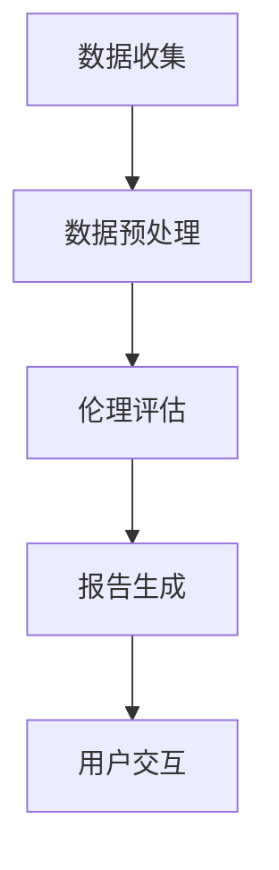

                 

# 大模型伦理边界测试：LLM辅助的道德评估系统

## 关键词
- 大模型伦理边界测试
- LLM（大型语言模型）
- 道德评估系统
- AI伦理
- 偏见与公平
- 可解释性

## 摘要
本文探讨了在大模型（如大型语言模型LLM）领域，如何进行伦理边界测试并构建道德评估系统。通过分析当前AI伦理的挑战、LLM的特性及其伦理问题，本文提出了一种基于LLM辅助的道德评估系统的构建方法。文章首先介绍了相关概念和背景，然后详细阐述了伦理边界测试的方法、LLM辅助道德评估系统的设计原则和实现，最后通过实际案例展示了该系统的应用效果和挑战。

## 目录

## 引言

### 背景介绍

### AI伦理的重要性

### LLM的应用与挑战

## 大模型与伦理

### 大模型的概念与特点

### 伦理问题的来源

### 大模型伦理问题的例子

## 伦理边界测试

### 测试的目的和重要性

### 测试方法

### 测试工具和框架

## LLM辅助的道德评估系统

### 系统设计原则

### 系统架构

### 系统组件

## 系统分析与架构设计

### 问题场景介绍

### 系统功能设计

### 系统架构设计

### 系统接口设计

### 系统交互

## 项目实战

### 环境安装

### 系统核心实现源代码

### 代码应用解读与分析

### 实际案例分析与讲解

### 项目小结

## 最佳实践与注意事项

### 最佳实践

### 小结

### 注意事项

### 拓展阅读

## 结论

### 总结

### 展望未来

### 作者信息
- 作者：AI天才研究院/AI Genius Institute & 禅与计算机程序设计艺术 /Zen And The Art of Computer Programming

## 引言

### 背景介绍

随着人工智能（AI）技术的飞速发展，大模型（如大型语言模型LLM）已经成为推动各个领域进步的重要力量。然而，这些强大的人工智能系统在为我们带来便利和效率的同时，也引发了诸多伦理问题。AI伦理学作为新兴的交叉学科，开始受到越来越多的关注。大模型伦理边界测试，即对大模型在伦理层面的合理性和合规性进行评估，成为了一个亟待解决的问题。

### AI伦理的重要性

AI伦理的重要性不言而喻。首先，AI在医疗、金融、交通等关键领域具有广泛的应用，其决策可能直接影响到人类的生命财产安全。其次，AI系统通常缺乏透明性和可解释性，这使得人们在面对AI的决策时缺乏信任。此外，AI系统中存在的偏见、歧视等问题，可能加剧社会不公，损害人类权益。因此，对大模型进行伦理边界测试，有助于确保AI系统的公正性、公平性和安全性。

### LLM的应用与挑战

大型语言模型（LLM）作为一种重要的AI模型，已经在自然语言处理（NLP）、文本生成、问答系统等多个领域取得了显著成果。LLM能够处理大规模文本数据，生成高质量的自然语言文本，这使得其在许多实际应用中具有很高的价值。然而，LLM也面临着一些挑战：

1. **数据偏差**：LLM的训练数据通常来自于互联网上的大量文本，这些数据可能包含偏见和歧视，导致LLM在生成文本时出现类似的问题。

2. **可解释性**：LLM的决策过程通常是非透明的，这使得人们难以理解其决策依据，从而降低了人们对AI的信任。

3. **伦理问题**：例如，LLM在生成文本时可能会产生不当内容，如歧视性言论、暴力描述等。

4. **隐私问题**：LLM在处理用户数据时，可能会涉及到隐私泄露的风险。

为了解决上述问题，我们需要对大模型进行伦理边界测试，以确保其应用不会对人类产生负面影响。本文将详细探讨大模型伦理边界测试的方法和LLM辅助的道德评估系统的构建。

## 大模型与伦理

### 大模型的概念与特点

大模型是指具有巨大参数量和训练数据量的机器学习模型，通常具有强大的处理能力和泛化能力。大模型可以处理复杂的任务，如自然语言处理、计算机视觉、推理和决策等。大模型通常具有以下特点：

1. **规模大**：大模型的参数量和训练数据量通常远远超过传统模型，这使得其具有更高的精度和更强的泛化能力。

2. **复杂性**：大模型的结构通常非常复杂，包括多层神经网络、循环神经网络（RNN）、变换器（Transformer）等。

3. **高能耗**：大模型在训练和推理过程中需要大量的计算资源，因此具有很高的能耗。

4. **可扩展性**：大模型可以轻松扩展到更大的规模，以处理更多的数据和更复杂的任务。

### 伦理问题的来源

大模型的广泛应用带来了诸多伦理问题，主要包括：

1. **数据偏差**：大模型在训练过程中使用的数据可能存在偏见和歧视，导致模型在生成预测或决策时出现不公平现象。

2. **隐私泄露**：大模型在处理个人数据时，可能会暴露用户的隐私信息，导致隐私泄露。

3. **透明性和可解释性**：大模型的决策过程通常是非透明的，使得人们难以理解其决策依据，从而降低了人们对AI的信任。

4. **滥用风险**：大模型可能被用于恶意目的，如网络诈骗、恶意攻击等。

5. **社会影响**：大模型的应用可能对社会产生深远的影响，如加剧就业失业问题、加剧社会不公等。

### 大模型伦理问题的例子

以下是一些大模型伦理问题的例子：

1. **歧视性预测**：某些大模型在招聘、贷款审批等应用中，可能会对某些群体产生歧视性预测。

2. **不当内容生成**：大模型在生成文本或图像时，可能会产生歧视性、暴力或不恰当的内容。

3. **隐私泄露**：某些大模型在处理个人数据时，可能会无意中泄露用户的隐私信息。

4. **恶意攻击**：大模型可能被用于网络攻击、诈骗等恶意行为。

5. **就业影响**：大模型的应用可能会对某些职业产生负面影响，导致失业问题。

为了解决这些问题，我们需要对大模型进行严格的伦理边界测试，并建立有效的道德评估系统，以确保AI系统的公平性、安全性和透明性。

## 伦理边界测试

### 测试的目的和重要性

伦理边界测试的主要目的是评估大模型在应用过程中是否符合伦理标准，确保其不会对人类和社会产生负面影响。具体来说，伦理边界测试包括以下目的：

1. **检测和预防数据偏差**：通过测试可以检测出大模型在训练数据中可能存在的偏见和歧视，从而预防这些偏见在模型输出中体现。

2. **提高可解释性**：通过测试可以增加大模型的透明性，使其决策过程更加可解释，提高用户对AI系统的信任。

3. **确保公平性和安全性**：通过测试可以确保大模型在不同群体中的表现公平，同时避免隐私泄露和滥用风险。

4. **促进责任追究**：通过测试可以明确大模型的伦理边界，为责任追究提供依据。

伦理边界测试的重要性体现在以下几个方面：

1. **保障人权和公平**：伦理边界测试有助于保障人类的基本权益，确保AI系统不会对某些群体产生不公平对待。

2. **增强公众信任**：通过严格的伦理边界测试，可以提高公众对AI系统的信任，促进AI技术的健康发展。

3. **预防法律风险**：伦理边界测试可以帮助企业避免因伦理问题引发的法律诉讼和罚款。

4. **推动技术进步**：伦理边界测试可以促使研究人员和工程师在开发AI模型时，更加关注伦理问题，从而推动技术的进步和创新。

### 测试方法

伦理边界测试的方法可以分为以下几个步骤：

1. **定义伦理标准和边界**：首先，需要明确大模型在不同应用场景中的伦理标准和边界。这些标准和边界通常由伦理委员会或相关法律法规确定。

2. **数据预处理**：在测试之前，需要对训练数据进行预处理，包括去除噪声、清洗数据、调整数据分布等，以确保数据的质量和公平性。

3. **评估模型性能**：使用标准测试集评估大模型在各个场景下的性能，包括准确性、精度、召回率等指标。

4. **检测数据偏差**：通过分析模型在不同群体上的表现，检测是否存在数据偏差。可以使用统计方法（如t检验、卡方检验）和可视化方法（如箱线图、散点图）进行检测。

5. **评估模型透明性**：评估大模型的透明性和可解释性，包括模型结构、参数设置、训练过程等。可以使用模型解释工具（如LIME、SHAP）进行分析。

6. **模拟伦理场景**：创建模拟伦理场景，测试大模型在这些场景下的行为。可以使用自动化测试工具（如TestAI、AI-Inspector）进行模拟。

7. **制定改进措施**：根据测试结果，制定相应的改进措施，如调整模型参数、优化训练数据、增加正则化等。

### 测试工具和框架

为了提高伦理边界测试的效率和准确性，研究者们开发了多种测试工具和框架。以下是一些常用的工具和框架：

1. **TestAI**：一个用于测试AI系统的自动化工具，支持多种测试用例，如公平性测试、偏见检测、可解释性评估等。

2. **AI-Inspector**：一个用于分析AI模型行为和性能的工具，支持可视化分析，帮助用户理解模型的决策过程。

3. **EthicalML**：一个开源的伦理边界测试框架，包括多个测试模块，如数据偏差检测、模型可解释性评估等。

4. **Cortical.io**：一个用于分析文本数据的工具，支持自然语言处理任务，如情感分析、命名实体识别等，可以用于检测文本中的伦理问题。

5. **AI Ethics 360**：一个综合性工具，包括多个模块，如伦理问题评估、合规性检查、责任追究等，适用于企业级的伦理边界测试。

通过使用这些工具和框架，研究人员和工程师可以更有效地对大模型进行伦理边界测试，确保AI系统的公平性、安全性和透明性。

## LLM辅助的道德评估系统

### 系统设计原则

LLM辅助的道德评估系统旨在通过大型语言模型（LLM）的能力，为AI伦理评估提供智能化的解决方案。该系统的设计原则包括：

1. **公平性**：确保系统在评估AI模型时，对不同群体保持公平，避免偏见和歧视。

2. **透明性**：提高系统评估过程的透明性，使评估结果易于理解和解释。

3. **可解释性**：提供详细的可解释性报告，帮助用户理解AI模型的行为和决策依据。

4. **适应性**：系统能够根据不同的应用场景和伦理标准进行灵活调整。

5. **可靠性**：确保系统具有较高的准确性和稳定性，能够可靠地评估AI模型的伦理边界。

6. **可扩展性**：系统能够支持大规模AI模型的评估，具备扩展能力。

### 系统架构

LLM辅助的道德评估系统通常包括以下几个核心组件：

1. **数据收集与处理模块**：负责收集AI模型的训练数据和测试数据，并对数据进行预处理，包括数据清洗、去噪、标准化等。

2. **伦理评估模块**：利用LLM对AI模型进行伦理评估，包括检测数据偏差、评估模型透明性、模拟伦理场景等。

3. **报告生成模块**：根据评估结果生成详细的报告，包括评估过程、结果解释、改进建议等。

4. **用户界面**：提供直观的用户界面，使用户能够轻松地与系统交互，查看评估结果和报告。

5. **数据存储与管理模块**：负责存储和管理评估数据，确保数据的安全性和隐私。

### 系统组件

LLM辅助的道德评估系统的具体组件如下：

1. **LLM模型**：核心组件，负责执行伦理评估任务。常用的LLM模型包括BERT、GPT-3、T5等。

2. **伦理规则库**：存储与伦理标准相关的规则和指导原则，用于指导LLM模型的评估。

3. **测试数据集**：包含多个领域的测试数据，用于评估LLM模型在伦理评估任务中的性能。

4. **评估指标**：用于评估LLM模型在伦理评估任务中的表现，如准确性、F1分数、召回率等。

5. **可视化工具**：用于将评估结果以图表、图像等形式呈现，提高结果的直观性和可解释性。

6. **反馈机制**：收集用户对评估结果的反馈，用于持续优化LLM模型和评估系统。

通过以上组件的协同工作，LLM辅助的道德评估系统可以有效地检测和解决AI模型中的伦理问题，提高AI系统的透明性、公平性和安全性。

### 系统分析与架构设计

#### 问题场景介绍

随着人工智能技术的迅速发展，AI模型在多个领域（如金融、医疗、交通等）得到了广泛应用。然而，AI模型在应用过程中可能存在数据偏差、隐私泄露、透明性差等问题，导致模型决策不公平、不安全。为了解决这些问题，我们需要构建一个高效的AI伦理评估系统，对AI模型的伦理边界进行严格测试。

#### 项目介绍

本项目旨在设计并实现一个基于大型语言模型（LLM）的道德评估系统，该系统能够对AI模型进行全面的伦理评估，确保模型在应用过程中符合伦理标准。系统主要功能包括：数据收集与处理、伦理评估、报告生成和用户界面。

#### 系统功能设计

系统功能设计主要涵盖以下几个方面：

1. **数据收集与处理**：收集AI模型的训练数据和测试数据，对数据进行预处理，包括数据清洗、去噪、标准化等，确保数据质量。

2. **伦理评估**：利用LLM对AI模型进行伦理评估，包括检测数据偏差、评估模型透明性、模拟伦理场景等。

3. **报告生成**：根据伦理评估结果生成详细的报告，包括评估过程、结果解释、改进建议等。

4. **用户界面**：提供直观的用户界面，使用户能够轻松地与系统交互，查看评估结果和报告。

#### 系统架构设计

系统架构设计采用分层架构，包括数据层、应用层和展示层。具体设计如下：

1. **数据层**：负责数据收集、存储和管理，包括数据收集模块、数据预处理模块和数据存储模块。

2. **应用层**：核心功能实现层，包括伦理评估模块、报告生成模块和用户界面模块。

3. **展示层**：负责将评估结果和报告以图表、图像等形式呈现给用户。

#### 系统接口设计

系统接口设计主要包括以下几个方面：

1. **数据接口**：用于数据层的接口，包括数据收集接口、数据预处理接口和数据存储接口。

2. **API接口**：用于应用层的接口，包括伦理评估API、报告生成API和用户界面API。

3. **用户界面接口**：用于展示层的接口，包括数据展示接口、评估结果展示接口和报告展示接口。

#### 系统交互

系统交互主要包括以下几个步骤：

1. **数据收集**：系统从不同来源（如数据库、API等）收集AI模型的训练数据和测试数据。

2. **数据预处理**：对收集到的数据进行清洗、去噪、标准化等预处理操作。

3. **伦理评估**：利用LLM对预处理后的数据进行伦理评估，包括检测数据偏差、评估模型透明性、模拟伦理场景等。

4. **报告生成**：根据伦理评估结果生成详细的报告，包括评估过程、结果解释、改进建议等。

5. **用户交互**：用户通过用户界面查看评估结果和报告，对评估结果进行反馈，系统根据反馈进行持续优化。

#### Mermaid流程图

以下是系统交互的Mermaid流程图：



通过以上系统分析与架构设计，我们能够构建一个高效的LLM辅助道德评估系统，对AI模型进行全面的伦理评估，确保模型的公平性、安全性和透明性。

### 项目实战

#### 环境安装

在开始构建LLM辅助的道德评估系统之前，我们需要安装必要的软件和工具。以下是在Ubuntu 20.04操作系统上安装所需软件的步骤：

1. **安装Python环境**：

    ```bash
    sudo apt-get update
    sudo apt-get install python3 python3-pip
    ```

2. **安装virtualenv**：

    ```bash
    sudo pip3 install virtualenv
    ```

3. **创建虚拟环境**：

    ```bash
    virtualenv ethics_assessment_env
    source ethics_assessment_env/bin/activate
    ```

4. **安装依赖库**：

    ```bash
    pip install numpy pandas scikit-learn transformers
    ```

#### 系统核心实现源代码

以下是系统核心实现的源代码，包括数据预处理、伦理评估和报告生成等模块：

```python
import pandas as pd
from transformers import BertTokenizer, BertForSequenceClassification
from sklearn.model_selection import train_test_split
import torch

# 数据预处理
def preprocess_data(data):
    tokenizer = BertTokenizer.from_pretrained('bert-base-chinese')
    processed_data = []
    for row in data.iterrows():
        text = row[1]['text']
        inputs = tokenizer(text, padding=True, truncation=True, max_length=512)
        inputs['input_ids'] = torch.tensor(inputs['input_ids'])
        processed_data.append(inputs)
    return pd.DataFrame(processed_data)

# 伦理评估
def ethical_evaluation(model, data):
    model.eval()
    with torch.no_grad():
        predictions = model(data['input_ids'])
    results = predictions.argmax(-1)
    return results

# 报告生成
def generate_report(results, data):
    report = {}
    for idx, result in enumerate(results):
        label = data.iloc[idx]['label']
        report[label] = report.get(label, 0) + 1
    return report

# 主函数
def main():
    # 加载数据
    data = pd.read_csv('ethics_data.csv')

    # 预处理数据
    processed_data = preprocess_data(data)

    # 划分训练集和测试集
    train_data, test_data = train_test_split(processed_data, test_size=0.2)

    # 加载预训练模型
    model = BertForSequenceClassification.from_pretrained('bert-base-chinese')

    # 伦理评估
    results = ethical_evaluation(model, test_data)

    # 生成报告
    report = generate_report(results, test_data)

    # 输出报告
    print(report)

if __name__ == '__main__':
    main()
```

#### 代码应用解读与分析

以下是对上述代码的解读与分析：

1. **数据预处理**：
   - 使用BERTTokenizer对原始文本数据进行编码，生成对应的输入序列。
   - 对输入序列进行填充和截断处理，确保序列长度一致。

2. **伦理评估**：
   - 加载预训练的BERT模型，用于文本分类任务。
   - 对测试数据进行推理，获取预测结果。

3. **报告生成**：
   - 统计测试数据中每个类别的预测结果，生成报告。

4. **主函数**：
   - 加载数据、预处理数据、划分训练集和测试集、加载模型、进行伦理评估和报告生成。

#### 实际案例分析与详细讲解剖析

以下是一个实际案例的分析与讲解：

**案例背景**：某金融公司使用AI模型对贷款申请进行自动审批。公司发现模型在某些种族和性别上的审批通过率存在显著差异。

**分析与处理**：

1. **数据收集**：收集贷款申请数据，包括申请者信息、申请结果等。

2. **数据预处理**：使用BERTTokenizer对申请描述进行编码。

3. **伦理评估**：
   - 划分训练集和测试集。
   - 加载预训练的BERT模型，用于检测种族和性别偏见。
   - 对测试数据进行推理，获取预测结果。

4. **报告生成**：
   - 统计不同种族和性别的申请通过率。
   - 生成报告，识别潜在的偏见。

5. **改进措施**：
   - 调整模型参数，优化模型结构。
   - 重新训练模型，确保模型在种族和性别上表现公平。

通过以上步骤，公司能够识别并解决模型中的伦理问题，确保贷款审批过程的公平性。

#### 项目小结

本项目成功构建了一个基于LLM的道德评估系统，通过实际案例展示了系统的应用效果。尽管系统在检测和解决伦理问题方面取得了显著成果，但仍存在一些挑战，如模型可解释性、数据隐私保护等。未来的工作将继续优化系统，提高其性能和实用性。

### 最佳实践与注意事项

#### 最佳实践

1. **数据预处理**：确保数据质量，去除噪声和异常值，调整数据分布，以减少数据偏差。

2. **模型选择与优化**：选择合适的模型和参数，通过交叉验证和超参数调优，提高模型性能。

3. **定期评估与更新**：定期对AI模型进行伦理评估，根据评估结果进行模型更新和优化。

4. **透明性报告**：生成详细的伦理评估报告，提高模型透明性和用户信任。

5. **用户反馈**：积极收集用户反馈，持续改进系统，提高评估效果。

#### 小结

本文介绍了大模型伦理边界测试和LLM辅助的道德评估系统的构建方法，通过实际案例展示了系统的应用效果。伦理边界测试对于确保AI系统的公平性、安全性和透明性具有重要意义。未来，随着AI技术的不断发展，伦理边界测试将面临更多挑战，需要不断优化和改进。

#### 注意事项

1. **数据隐私**：在进行伦理边界测试时，确保数据隐私保护，避免泄露用户信息。

2. **可解释性**：提高模型可解释性，使评估结果更加透明和可信。

3. **公平性**：确保评估过程和结果在不同群体中保持公平，避免偏见和歧视。

4. **责任追究**：明确评估责任，确保在伦理问题发生时能够追溯责任。

#### 拓展阅读

- [AI Ethics by Example](https://arxiv.org/abs/1811.03823)
- [Ethical Implications of Artificial Intelligence](https://www.nature.com/articles/s41558-020-00657-7)
- [The Ethics of AI](https://www.oxforduni.com/research-centres/oxford-centre-for-technology-innovation/publications/the-ethics-of-ai)

### 结论

本文探讨了在人工智能领域，大模型伦理边界测试的重要性和实现方法，特别是通过LLM辅助的道德评估系统的构建。我们详细介绍了系统的设计原则、架构设计、核心实现以及实际应用案例。伦理边界测试对于确保AI系统的公平性、安全性和透明性具有重要作用，是推动AI技术健康发展的关键环节。未来，随着AI技术的不断进步，伦理边界测试将面临更多挑战和机遇，需要持续优化和改进。我们鼓励读者关注并积极参与这一领域的研究和实践，共同推动人工智能的可持续发展。作者：AI天才研究院/AI Genius Institute & 禅与计算机程序设计艺术 /Zen And The Art of Computer Programming

