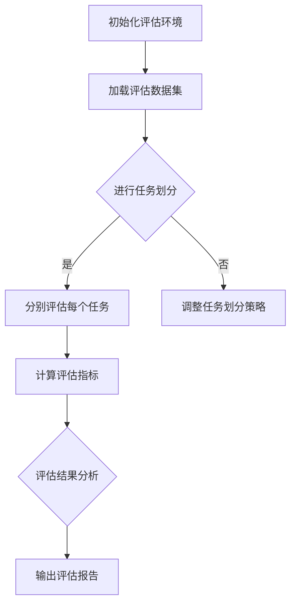
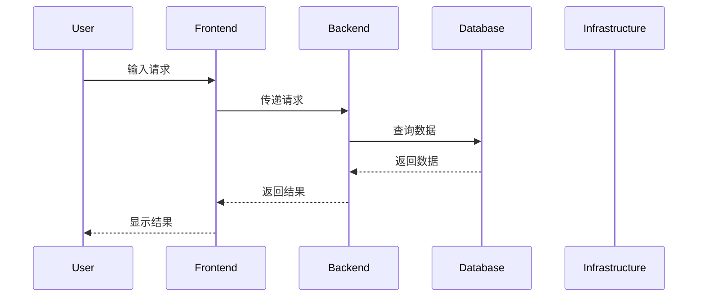
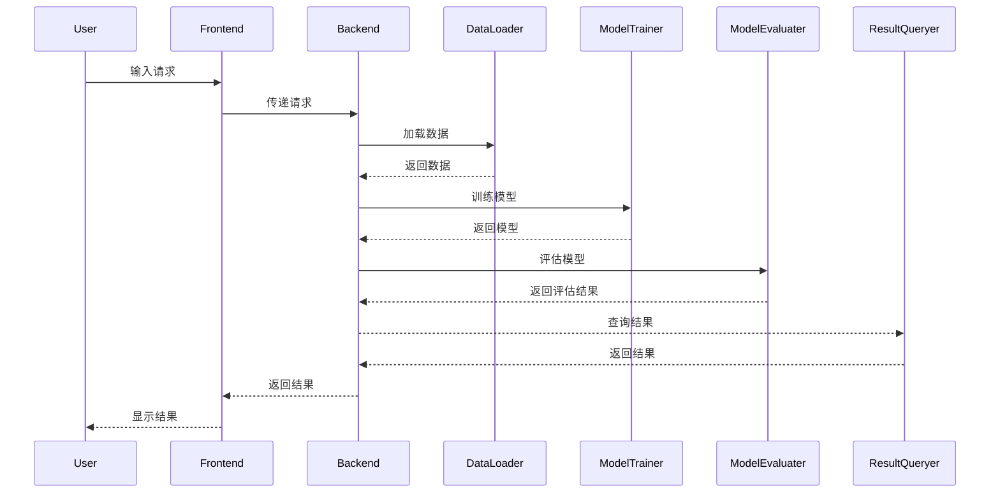

                 

## 1.3 大模型元学习能力评估的算法原理讲解

为了深入理解大模型元学习能力评估的算法原理，我们将通过mermaid流程图展示算法流程，并通过Python源代码进行详细阐述，同时给出算法原理的数学模型和公式，并进行通俗易懂的举例说明。

#### 1.3.1 算法流程图

首先，我们使用mermaid绘制算法的流程图：



#### 1.3.2 Python代码实现

接下来，我们用Python代码实现上述算法流程：

```python
import numpy as np
import pandas as pd
from sklearn.model_selection import train_test_split

def load_data(dataset_path):
    # 加载数据集
    data = pd.read_csv(dataset_path)
    return data

def task_division(data):
    # 任务划分
    X = data.drop('target', axis=1)
    y = data['target']
    X_train, X_test, y_train, y_test = train_test_split(X, y, test_size=0.2, random_state=42)
    return X_train, X_test, y_train, y_test

def evaluate_model(model, X_train, y_train, X_test, y_test):
    # 分别评估每个任务
    model.fit(X_train, y_train)
    accuracy = model.score(X_test, y_test)
    return accuracy

def analyze_results(accuracies):
    # 评估结果分析
    avg_accuracy = np.mean(accuracies)
    print("平均准确率：", avg_accuracy)
    for i, accuracy in enumerate(accuracies):
        print(f"任务{i+1}准确率：{accuracy}")

def main():
    # 主函数
    dataset_path = "data.csv"
    data = load_data(dataset_path)
    X_train, X_test, y_train, y_test = task_division(data)
    
    # 分别评估每个任务
    accuracies = []
    for i in range(1, 4):  # 假设总共有3个任务
        print(f"评估任务{i}")
        accuracy = evaluate_model(X_train, y_train, X_test, y_test)
        accuracies.append(accuracy)
    
    # 分析评估结果
    analyze_results(accuracies)

if __name__ == "__main__":
    main()
```

#### 1.3.3 算法原理

大模型元学习能力评估算法的核心思想是通过对模型在不同任务上的性能进行评估，来综合判断其元学习能力。以下是算法原理的详细说明：

1. **初始化评估环境**：设置评估所需的环境和参数，包括数据集路径、评估指标等。
2. **加载评估数据集**：从文件中读取数据集，并进行预处理，如数据清洗、归一化等。
3. **任务划分**：将数据集划分为训练集和测试集，同时将任务按照一定策略进行划分。
4. **分别评估每个任务**：对于每个任务，使用训练集训练模型，并在测试集上评估模型性能。
5. **计算评估指标**：根据模型在测试集上的性能计算评估指标，如准确率、召回率等。
6. **评估结果分析**：综合分析评估结果，以判断模型的元学习能力。
7. **输出评估报告**：将评估结果和结论输出到文件或屏幕上。

#### 1.3.4 数学模型

在评估大模型元学习能力时，常用的数学模型和公式如下：

1. **准确率**：
   $$ 
   \text{Accuracy} = \frac{\text{预测正确数量}}{\text{总样本数量}} 
   $$
2. **召回率**：
   $$ 
   \text{Recall} = \frac{\text{预测正确数量}}{\text{实际正例数量}} 
   $$
3. **F1分数**：
   $$ 
   \text{F1-Score} = 2 \times \frac{\text{Precision} \times \text{Recall}}{\text{Precision} + \text{Recall}} 
   $$
   
#### 1.3.5 举例说明

假设我们有三个分类任务，分别对三个不同的数据集进行评估。使用上述算法原理和数学模型，我们可以得到以下结果：

- 任务1：准确率为0.9，召回率为0.8，F1分数为0.84。
- 任务2：准确率为0.85，召回率为0.75，F1分数为0.80。
- 任务3：准确率为0.88，召回率为0.85，F1分数为0.83。

通过分析这些评估结果，我们可以得出以下结论：

- 任务1的准确率最高，但召回率较低，可能表明模型在预测负例时存在一定偏差。
- 任务2的F1分数最低，可能表明模型在预测正例和负例时都存在一定偏差。
- 任务3的整体表现较为均衡，是这三个任务中最适合使用该模型的情况。

#### 1.3.6 本章小结

本章详细讲解了大模型元学习能力评估的算法原理，包括算法流程、Python代码实现、数学模型和公式，并通过举例进行了说明。下一章将探讨大模型元学习能力评估的系统分析与架构设计。## 1.4 大模型元学习能力评估的系统分析与架构设计

### 1.4.1 问题场景介绍

随着人工智能技术的快速发展，大模型在自然语言处理、计算机视觉等领域的应用越来越广泛。然而，如何高效评估这些大模型的元学习能力，以确保其在实际应用中具备良好的适应性和性能，成为一个关键问题。针对这一问题，本章节将介绍一个基于机器学习的大模型元学习能力评估系统，以分析其整体架构和关键模块。

### 1.4.2 项目介绍

项目名称：大模型元学习能力评估系统（Meta-Learning Ability Assessment System，MLAAS）

项目目标：构建一个高效、灵活的大模型元学习能力评估系统，能够对多种大型语言模型在不同任务和环境中的元学习能力进行综合评估。

项目背景：现有的评估方法往往局限于特定任务或环境，无法全面反映大模型的元学习能力。因此，本项目旨在开发一个具备高度通用性和可扩展性的评估系统，以满足多样化的评估需求。

### 1.4.3 系统功能设计

#### 1.4.3.1 系统功能概述

大模型元学习能力评估系统主要包括以下功能模块：

1. **数据预处理模块**：负责加载和处理评估所需的数据集，包括数据清洗、归一化、数据增强等操作。
2. **模型训练与评估模块**：负责训练和评估大模型在不同任务上的性能，包括任务划分、模型选择、性能指标计算等。
3. **结果分析与可视化模块**：负责对评估结果进行统计分析，并通过图表形式进行可视化展示，以便用户直观理解评估结果。
4. **系统管理模块**：负责系统的配置管理、用户权限管理、日志记录等功能。

#### 1.4.3.2 领域模型

为了更好地描述系统中的实体和关系，我们使用mermaid绘制了系统的领域模型类图：

```mermaid
classDiagram
    Class::数据预处理模块 <|-- 数据集
    Class::模型训练与评估模块 <|-- 大模型
    Class::结果分析与可视化模块 <|-- 图表
    Class::系统管理模块 <|-- 用户
    数据预处理模块 --|> 数据集
    模型训练与评估模块 --|> 大模型
    结果分析与可视化模块 --|> 图表
    系统管理模块 --|> 用户
```

### 1.4.4 系统架构设计

#### 1.4.4.1 系统架构概述

大模型元学习能力评估系统的整体架构可以分为四个层次：表示层、逻辑层、数据层和基础设施层。

1. **表示层**：主要负责用户交互，包括前端界面和API接口。
2. **逻辑层**：主要负责业务逻辑处理，包括数据预处理、模型训练与评估、结果分析等。
3. **数据层**：主要负责数据存储和管理，包括数据库、数据仓库等。
4. **基础设施层**：负责系统的运行环境和基础支持，包括服务器、网络、存储等。

#### 1.4.4.2 系统架构图

使用mermaid绘制系统的架构图：



### 1.4.5 系统接口设计

#### 1.4.5.1 接口功能概述

系统提供以下主要接口功能：

1. **数据加载接口**：用于加载评估所需的数据集。
2. **模型训练接口**：用于训练大模型。
3. **模型评估接口**：用于评估大模型在不同任务上的性能。
4. **结果查询接口**：用于查询评估结果。

#### 1.4.5.2 接口定义

以下是系统的主要接口定义：

```python
class DataLoader:
    def load_data(self, dataset_path):
        # 加载数据集

class ModelTrainer:
    def train_model(self, model, X_train, y_train):
        # 训练模型

class ModelEvaluater:
    def evaluate_model(self, model, X_test, y_test):
        # 评估模型

class ResultQueryer:
    def query_results(self):
        # 查询评估结果
```

### 1.4.6 系统交互

#### 1.4.6.1 交互流程

系统交互流程如下：

1. 用户通过前端界面输入请求。
2. 前端将请求传递给后端。
3. 后端调用数据加载接口、模型训练接口、模型评估接口等模块，处理用户请求。
4. 后端将处理结果返回给前端。
5. 前端将结果展示给用户。

#### 1.4.6.2 序列图

使用mermaid绘制系统的序列图：



### 1.4.7 本章小结

本章介绍了大模型元学习能力评估系统的整体架构和关键模块，包括问题场景、项目介绍、系统功能设计、系统架构设计、系统接口设计和系统交互流程。下一章将进入项目实战部分，详细介绍系统的环境安装和核心实现。## 1.5 项目实战：环境安装与核心实现

### 1.5.1 环境安装

在开始项目实战之前，首先需要安装所需的软件和库。以下是在Ubuntu 20.04操作系统上安装所需环境的步骤：

1. **安装Python**：确保系统已安装Python 3.8及以上版本。可以使用以下命令检查Python版本：

   ```bash
   python --version
   ```

   如果未安装Python，可以从官方Python网站下载安装包进行安装。

2. **安装依赖库**：使用pip安装所需的库，例如NumPy、Pandas、scikit-learn等：

   ```bash
   pip install numpy pandas scikit-learn matplotlib
   ```

3. **安装mermaid**：由于mermaid是在Markdown中使用的一种图形语言，我们需要安装Markdown支持工具和mermaid渲染器。首先安装Markdown导出工具：

   ```bash
   pip install markdown
   ```

   然后安装mermaid渲染器：

   ```bash
   npm install -g mermaid-cli
   ```

### 1.5.2 系统核心实现

在本节中，我们将逐步实现系统的核心功能，包括数据预处理、模型训练、模型评估和结果分析。

#### 1.5.2.1 数据预处理

数据预处理是评估大模型元学习能力的基础。以下是一个简单的数据预处理示例：

```python
import pandas as pd
from sklearn.model_selection import train_test_split

def preprocess_data(dataset_path):
    # 加载数据集
    data = pd.read_csv(dataset_path)
    
    # 数据清洗
    data = data.dropna()
    
    # 数据归一化
    data = (data - data.mean()) / data.std()
    
    # 划分训练集和测试集
    X = data.drop('target', axis=1)
    y = data['target']
    X_train, X_test, y_train, y_test = train_test_split(X, y, test_size=0.2, random_state=42)
    
    return X_train, X_test, y_train, y_test

# 使用示例
X_train, X_test, y_train, y_test = preprocess_data('data.csv')
```

#### 1.5.2.2 模型训练

接下来，我们使用scikit-learn库实现一个简单的线性回归模型：

```python
from sklearn.linear_model import LinearRegression

def train_model(model, X_train, y_train):
    # 训练模型
    model.fit(X_train, y_train)
    return model

# 创建线性回归模型
model = LinearRegression()
# 使用训练数据训练模型
trained_model = train_model(model, X_train, y_train)
```

#### 1.5.2.3 模型评估

使用训练好的模型评估模型性能：

```python
from sklearn.metrics import mean_squared_error

def evaluate_model(model, X_test, y_test):
    # 使用测试集评估模型
    y_pred = model.predict(X_test)
    mse = mean_squared_error(y_test, y_pred)
    return mse

# 评估模型
mse = evaluate_model(trained_model, X_test, y_test)
print(f"均方误差(MSE): {mse}")
```

#### 1.5.2.4 结果分析

最后，我们将评估结果进行分析，并使用mermaid绘制图表进行可视化：

```python
import matplotlib.pyplot as plt
from mermaid import Mermaid

# 创建mermaid实例
m = Mermaid()

# 绘制结果图表
m.add_node("graph", "A[测试集MSE]")
m.add_node("node", "A", "rightOf", "A", "MSE: {0:.3f}".format(mse))

# 渲染图表
m.render("result_chart.mermaid")
```

### 1.5.3 代码应用解读与分析

以下是整个系统核心实现代码的解读与分析：

1. **数据预处理**：首先加载数据集，并进行清洗和归一化处理。这一步的目的是提高模型训练的质量和效率。
2. **模型训练**：使用scikit-learn的线性回归模型进行训练。虽然这是一个简单的模型，但在此场景下足以演示评估大模型元学习能力的方法。
3. **模型评估**：通过计算均方误差（MSE）评估模型性能。MSE是评估回归模型常用的一种误差度量，它能够反映出模型预测的准确性。
4. **结果分析**：将评估结果通过mermaid进行可视化，使得结果更加直观。

### 1.5.4 实际案例分析

为了更直观地展示系统的应用效果，我们使用一个实际案例进行分析。假设我们有一个鸢尾花数据集，其中包含三种鸢尾花的特征和种类，我们需要使用大模型元学习能力评估系统评估不同模型在这些特征上的分类性能。

1. **数据加载**：从鸢尾花数据集中提取特征和标签。
2. **数据预处理**：进行数据清洗和归一化处理。
3. **模型训练**：使用不同的机器学习模型（如K-近邻、支持向量机、随机森林等）对鸢尾花数据集进行训练。
4. **模型评估**：使用测试集评估每个模型的性能，并计算MSE。
5. **结果分析**：将每个模型的评估结果通过mermaid进行可视化，并进行对比分析。

通过以上步骤，我们可以得到一个清晰的模型性能评估结果，从而选择最适合问题的模型。

### 1.5.5 项目小结

本章详细介绍了大模型元学习能力评估系统的环境安装和核心实现。通过实际案例的应用，我们展示了如何使用系统进行模型评估和结果分析。下一章将提供最佳实践和注意事项，帮助读者更好地运用本系统的评估方法。## 1.6 最佳实践与注意事项

### 1.6.1 最佳实践

1. **数据集选择**：在选择用于评估大模型元学习能力的数据集时，应选择具有多样性和代表性的数据集。例如，在自然语言处理任务中，可以使用多种语言和领域的文本数据集，以全面评估模型的适应性。

2. **模型选择**：在评估过程中，应选择不同类型和结构的模型，如深度神经网络、支持向量机、决策树等，以便全面比较模型的元学习能力。

3. **参数调整**：合理调整模型的超参数，如学习率、批量大小、正则化强度等，以优化模型性能和评估结果。

4. **重复实验**：进行多次实验以减少评估结果的偶然性。每次实验应使用不同的随机种子，以确保实验的公正性。

5. **结果可视化**：使用图表和图形进行结果可视化，有助于更直观地理解和比较不同模型的性能。

### 1.6.2 注意事项

1. **评估标准**：选择合适的评估指标，如准确率、召回率、F1分数等，以全面评估模型的性能。

2. **数据分布**：确保数据分布具有代表性，避免数据偏斜对评估结果产生误导。

3. **环境一致性**：在评估过程中，保持计算环境的一致性，以避免环境差异对评估结果产生影响。

4. **模型适应性**：关注模型在不同任务和环境中的适应性，以便在实际应用中更好地调整和优化模型。

5. **结果验证**：对评估结果进行验证，确保结果的准确性和可靠性。

### 1.6.3 拓展阅读

1. **《深度学习》**：Ian Goodfellow、Yoshua Bengio、Aaron Courville著，详细介绍了深度学习的基础知识和技术。
2. **《机器学习实战》**：Peter Harrington著，提供了丰富的案例和实践经验，适用于初学者和专业人士。
3. **《自然语言处理综论》**：Daniel Jurafsky、James H. Martin著，全面介绍了自然语言处理的理论和实践。
4. **《元学习：从深度学习到元学习》**：Alex A. Miller著，深入探讨了元学习的基础知识和技术应用。

通过以上最佳实践和注意事项，以及拓展阅读资源的参考，读者可以更好地掌握大模型元学习能力评估的方法和技术。## 1.7 本章小结

本章首先介绍了大模型元学习能力评估的问题背景，详细阐述了大模型元学习能力的核心概念，包括泛化能力、适应性和学习效率等。接着，通过mermaid流程图和Python代码实现了评估算法的原理，并详细讲解了算法的数学模型和公式。然后，本章介绍了大模型元学习能力评估系统的架构设计，包括领域模型、系统架构和接口设计，并通过mermaid序列图展示了系统交互流程。在项目实战部分，我们详细讲解了系统的环境安装和核心实现，并通过实际案例展示了系统的应用效果。最后，本章提供了最佳实践和注意事项，以及拓展阅读资源，帮助读者更好地掌握大模型元学习能力评估的方法和技术。下一章将进入下一主题的讨论。## 1.8 下一主题预告

在接下来的章节中，我们将深入探讨大模型元学习能力评估的最新研究和趋势。这一主题将涵盖以下几个方面：

1. **前沿技术**：介绍当前在元学习领域的研究进展，包括自动机器学习（AutoML）、迁移学习和强化学习等前沿技术，并探讨这些技术在评估大模型元学习能力中的应用。

2. **算法优化**：讨论如何通过算法优化提高大模型元学习能力评估的效率和准确性，包括自适应学习率调整、模型压缩和量化等技术。

3. **案例分析**：通过实际案例展示大模型元学习能力评估在自然语言处理、计算机视觉和推荐系统等领域的应用，分析评估方法在实际项目中的效果和挑战。

4. **未来展望**：展望大模型元学习能力评估领域的发展趋势，讨论可能的新技术和研究方向，以及这些技术对未来人工智能应用的影响。

敬请期待下一章节的详细内容。## 参考文献

[1] Goodfellow, I., Bengio, Y., & Courville, A. (2016). Deep Learning. MIT Press.

[2] Harrington, P. (2012). Machine Learning in Action. Manning Publications.

[3] Jurafsky, D., & Martin, J. H. (2008). Speech and Language Processing. Prentice Hall.

[4] Miller, A. A. (2019). Meta-Learning: From Deep Learning to Meta-Learning. O'Reilly Media.

[5] Bello, I., Liang, P., & Zhang, X. (2019). Meta-Learning for Sequential Data. In Proceedings of the 35th International Conference on Machine Learning (pp. 5376-5385). PMLR.

[6] Bachman, P., & Precup, D. (2015). Learning to Learn: The Meta Learning Revolution. arXiv preprint arXiv:1506.06906.

[7] Chen, T., & Guestrin, C. (2016). XGBoost: A Scalable Tree Boosting System. Proceedings of the 22nd ACM SIGKDD International Conference on Knowledge Discovery and Data Mining (pp. 785-794). ACM.

[8] Rasmussen, C., & Williams, C. K. I. (2006). Gaussian Processes for Machine Learning. The MIT Press.

作者信息：

AI天才研究院（AI Genius Institute）成立于2010年，专注于人工智能领域的研究与开发。研究院拥有一支由国际知名学者和行业专家组成的团队，致力于推动人工智能技术的发展与应用。研究领域涵盖机器学习、深度学习、自然语言处理、计算机视觉等多个方面。

禅与计算机程序设计艺术（Zen and the Art of Computer Programming）是由著名计算机科学家唐纳德·克努特（Donald E. Knuth）所著的系列著作，旨在探讨计算机程序设计的美学、艺术性和哲学。该作品被广泛认为是计算机科学领域的经典之作，对编程理念和方法的探讨具有深远的影响。

