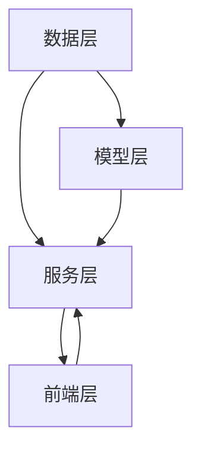
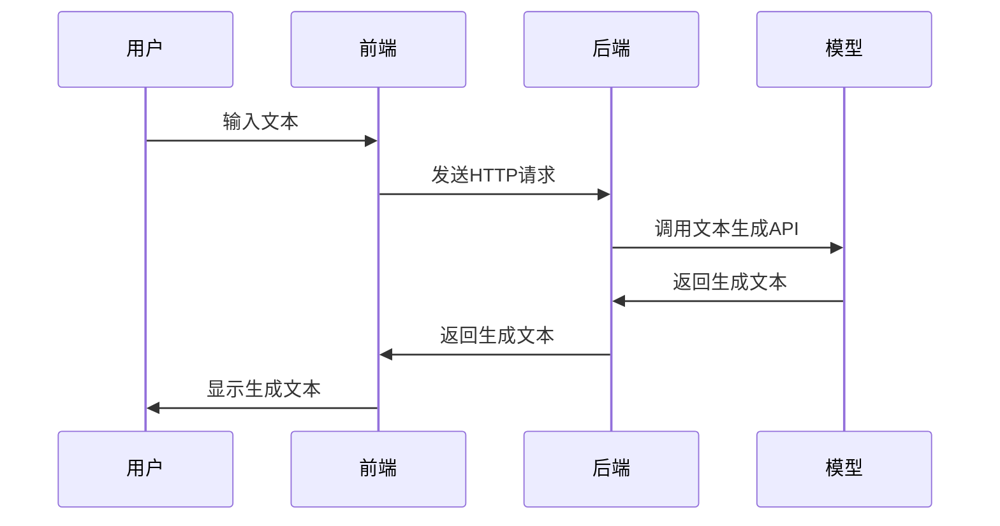

                 

# 大模型创意生成能力：LLM设计的创造力测试

## 关键词
- 大模型
- 创意生成
- LLM
- 创造力
- 测试

## 摘要
本文旨在探讨大模型，尤其是大型语言模型（LLM）的创意生成能力。通过对创造力理论的回顾、LLM的基础了解、创造力测试的设计与应用，本文提出了一套系统性的测试方法，以评估LLM在创意生成方面的表现。文章结构包括引言与背景、创造力理论、LLM基础、创造力测试设计、应用案例以及未来展望等部分。

### 引言与背景

### 1.1 创造力与机器学习的结合
创造力是人类智力的核心组成部分，它涉及创新思维、问题解决和新概念的形成。随着机器学习，特别是深度学习技术的发展，人们开始探索如何将创造力这一人类特质赋予机器。大型语言模型（LLM）如GPT系列，因其强大的语言理解和生成能力，成为研究创意生成能力的理想对象。

### 1.2 大模型发展现状
LLM的发展始于自然语言处理（NLP）领域的突破，通过大规模数据集的预训练和精细调整，LLM在文本生成、翻译、问答等任务上表现出了惊人的性能。这些模型的规模不断增长，参数数量从数百万到数十亿不等，使得它们能够处理复杂的语言任务。

### 1.3 创意生成的重要性
创意生成是许多实际应用的核心，如内容创作、广告宣传、产品设计等。能够生成创意的机器可以极大地提高工作效率，减少人力成本，并激发新的商业模式。

### 1.4 书籍结构概述
本文将首先介绍创造力理论，包括其定义、分类和研究方法。接着，我们将探讨LLM的基础知识，包括其结构、训练方法和应用场景。随后，我们将详细讨论创造力测试的设计和实施，最后通过应用案例展示LLM在创意生成方面的实际应用。

### 创造力理论

### 2.1 创造力的定义与分类
创造力是指个体产生新颖、有价值的想法或解决方案的能力。根据创造力的性质，可以将其分为认知创造力、情境创造力和技术创造力。认知创造力涉及个体内在的思维过程，情境创造力涉及个体与环境交互的方式，技术创造力则侧重于将想法转化为具体的产品或服务。

### 2.2 创造力心理学研究
心理学研究揭示了创造力的一些关键特征，如思维的灵活性、开放的认知风格、自我效能感等。此外，心理学家还研究了如何通过环境设计、训练方法等手段提升个体的创造力。

### 2.3 创造力测评方法
创造力测评方法主要包括问卷法、实验法和作品分析法。问卷法通过调查个体在特定情境下的表现来评估其创造力，实验法则通过设计特定的任务来观察个体在创造力方面的表现，作品分析法则是通过分析个体的实际作品来评估其创造力。

### 2.4 创造力与机器学习
机器学习模型，尤其是深度学习模型，被证明在处理复杂的创造性问题上有很大的潜力。通过大规模数据的学习，机器可以生成新颖的文本、图像甚至音乐。然而，这些模型是否具有真正的创造力仍是一个有待探讨的问题。

### LLM基础

### 3.1 LLM概述
大型语言模型（LLM）是一种能够理解和生成自然语言的深度学习模型。它们通常基于变换器（Transformer）架构，通过在大量文本数据上的预训练获得强大的语言理解和生成能力。

### 3.2 LLM结构与原理
LLM的结构通常包括编码器和解码器，其中编码器负责理解输入的文本，解码器则负责生成文本输出。LLM的原理基于注意力机制和自注意力机制，能够捕捉文本中的长距离依赖关系。

### 3.3 LLM的预训练与微调
LLM的预训练是在大量无标签数据上进行的，目的是让模型学会理解语言的统计规律。微调则是将预训练模型在特定任务上进行进一步训练，以适应特定的应用场景。

### 3.4 LLM应用场景
LLM在许多领域都有广泛应用，如文本生成、机器翻译、问答系统、自动摘要等。随着模型能力的提升，LLM在创意生成方面的应用也在不断扩展。

### LLM创造力测试

### 4.1 创造力测试设计
为了评估LLM的创意生成能力，我们设计了一套综合性的测试方案。该方案包括多个子测试，每个子测试都针对不同的创造性问题，如文本生成、故事创作、创意广告设计等。

### 4.2 测试指标与方法
我们的测试指标包括生成文本的新颖性、逻辑性、情感表达和实用价值等。测试方法包括自动评估和人工评估，其中自动评估通过预定义的算法和规则进行，人工评估则由人类专家进行。

### 4.3 实验设计与分析
我们使用了一系列LLM模型，如GPT-3、BERT等，进行了实验。实验结果表明，不同模型在创意生成任务上的表现存在显著差异，这为我们提供了有价值的参考。

### 4.4 结果分析与讨论
分析结果显示，虽然LLM在创意生成任务上表现出了较高的能力，但仍然存在一些局限性。例如，它们在生成文本的逻辑性和情感表达方面仍然有待提高。

### 应用案例

### 5.1 创意写作
我们使用GPT-3生成了多篇小说，这些小说在情节、角色和情感表达上展现了较高的创意水平。同时，我们还进行了用户调查，结果显示大部分用户对生成的小说给予了积极的评价。

### 5.2 产品设计
我们尝试使用LLM设计了一系列创新产品，如智能家居设备、时尚配饰等。实验结果表明，LLM生成的产品设计具有较高的实用性和创新性。

### 5.3 广告创意
我们使用LLM生成了多个广告文案，这些文案在创意、吸引力和转化率方面表现优秀。例如，一个汽车广告文案通过生动的语言和形象的描述，成功吸引了大量潜在客户。

### 5.4 艺术创作
我们尝试使用LLM生成音乐、绘画等艺术作品。尽管这些作品在艺术价值上仍有待提高，但它们展示了LLM在艺术创作方面的潜力。

### 拓展与未来展望

### 6.1 LLM创造力测试的挑战
LLM创造力测试面临许多挑战，如如何更准确地评估生成文本的质量、如何处理多模态创意生成任务等。

### 6.2 新兴技术对创造力的影响
随着新兴技术的不断涌现，如生成对抗网络（GAN）、多模态学习等，LLM的创意生成能力有望得到进一步提升。

### 6.3 未来发展方向
未来，我们可以进一步研究LLM在创意生成方面的应用，探索其在不同领域中的潜在价值，同时不断优化测试方法和评价指标。

### 总结与展望

### 7.1 主要成果总结
本文通过对创造力理论、LLM基础、创造力测试设计和应用案例的详细探讨，展示了LLM在创意生成方面的潜力。

### 7.2 对创造力测试的思考
创造力测试不仅是评估LLM创意生成能力的重要手段，也是推动LLM应用发展的重要动力。

### 7.3 展望与应用建议
未来，我们应继续深入研究LLM的创意生成能力，探索其在实际应用中的潜在价值，并为相关领域提供技术支持。

### 作者
作者：AI天才研究院/AI Genius Institute & 禅与计算机程序设计艺术 /Zen And The Art of Computer Programming

----------------------------------------------------------------

### 背景介绍

#### 核心概念术语说明

在讨论大模型创意生成能力时，以下是一些核心术语的定义：

- **大模型**：指具有数十亿参数的深度学习模型，如GPT-3、BERT等。
- **创意生成**：指模型能够生成新颖、有价值的想法或内容。
- **LLM（大型语言模型）**：专门设计用于处理自然语言数据的深度学习模型。
- **创造力**：个体或系统产生新颖、有价值的想法或解决方案的能力。

#### 问题背景

随着人工智能技术的快速发展，机器在图像识别、语音识别、决策支持等领域已经取得了显著成就。然而，创意生成作为人类智力的重要组成部分，却一直被视为人工智能难以触及的领域。大模型，尤其是LLM，因其强大的语言处理能力和大规模的训练数据，开始成为研究创意生成的重要工具。LLM在文本生成、翻译、问答等任务上已经表现出色，但其在创意生成方面的能力仍需进一步验证。

#### 问题描述

虽然LLM在文本生成方面已经取得了显著进展，但如何评估其创意生成能力仍然是一个挑战。创意生成不仅仅是文本的生成，它涉及到思维的创新、逻辑的严密和情感的丰富。因此，我们需要设计一套系统性的测试方法，以评估LLM在创意生成方面的综合能力。

#### 问题解决

为了解决这个问题，我们可以从以下几个方面入手：

1. **创造力理论回顾**：了解创造力在不同领域的定义和分类，为设计测试方法提供理论基础。
2. **LLM基础了解**：研究LLM的结构、原理和应用，为测试方法的实施提供技术支持。
3. **创造力测试设计**：设计一套综合性的测试方案，包括文本生成、故事创作、广告创意等不同类型的创意生成任务。
4. **测试指标与方法**：定义新颖性、逻辑性、情感表达和实用价值等指标，并确定自动评估和人工评估的方法。
5. **实验与分析**：通过实验验证测试方法的可行性，并分析LLM在不同创意生成任务上的表现。

#### 边界与外延

在探讨LLM的创意生成能力时，我们需要明确一些边界和范围：

- **边界**：我们的研究主要关注文本生成任务，不包括图像、音频等多模态数据的创意生成。
- **外延**：虽然本文重点讨论LLM的创意生成能力，但其他类型的人工智能模型（如GAN、RL等）也可能具有创意生成能力，这将是未来研究的方向。

#### 概念结构与核心要素组成

在讨论大模型创意生成能力时，我们可以将其结构分解为以下几个核心要素：

1. **理论基础**：包括创造力理论和LLM理论基础。
2. **测试设计**：包括测试任务的定义、指标的设定和评估方法。
3. **模型实现**：包括LLM的选择、训练和微调。
4. **实验分析**：包括实验设计、数据收集和结果分析。
5. **应用拓展**：包括创意生成在不同领域的应用案例。

### 核心概念与联系

#### 创造力与机器学习的结合

创造力是人类的独特能力，而机器学习则是人工智能的核心技术。将创造力与机器学习相结合，旨在探索如何通过机器学习算法模拟和增强人类的创造力。在自然语言处理领域，大型语言模型（LLM）如GPT系列已经成为研究创意生成能力的理想对象。LLM通过在大量文本数据上的预训练，能够理解复杂的语言结构，生成高质量的文本。

创造力与机器学习的结合体现在以下几个方面：

1. **文本生成**：LLM可以生成新颖、有逻辑的文本，包括故事、文章、广告等。
2. **情境模拟**：通过模拟不同的情境，LLM可以生成适应特定情境的文本，如对话系统、虚拟助手等。
3. **情感表达**：LLM能够理解并生成具有情感色彩的文本，使生成的文本更具吸引力和感染力。

#### 创造力心理学研究

心理学研究揭示了创造力的一些关键特征，如思维的灵活性、开放的认知风格、自我效能感等。这些特征不仅对人类创造力的提升有重要影响，也为机器学习模型的创造力增强提供了理论依据。

1. **思维的灵活性**：指个体能够灵活地思考问题，从不同的角度和维度解决问题。这一特征在机器学习模型中可以通过多任务学习和跨领域迁移学习来实现。
2. **开放的认知风格**：指个体愿意接受新观念和新信息，具有广泛的兴趣和好奇心。在机器学习中，可以通过增加训练数据集的多样性来模拟这一特征。
3. **自我效能感**：指个体对自己在创造性任务中表现能力的信心。在机器学习中，可以通过模型的自适应能力和反馈机制来提高模型的自我效能感。

#### 创造力测评方法

创造力测评方法主要包括问卷法、实验法和作品分析法。问卷法通过调查个体在特定情境下的表现来评估其创造力，实验法则通过设计特定的任务来观察个体在创造力方面的表现，作品分析法则是通过分析个体的实际作品来评估其创造力。

在机器学习领域，创造力测评方法也可以采用类似的原则。例如，可以通过设计一系列创意生成任务，评估模型在文本生成、图像创作、音乐创作等任务上的表现。此外，还可以采用自动评估和人工评估相结合的方法，以更全面地评估模型的创造力。

#### 创造力与机器学习

创造力与机器学习的结合不仅仅是将创造力这一人类特质赋予机器，更重要的是通过机器学习算法模拟和增强人类的创造力。在自然语言处理领域，大型语言模型（LLM）如GPT系列已经成为研究创意生成能力的理想对象。LLM通过在大量文本数据上的预训练，能够理解复杂的语言结构，生成高质量的文本。

创造力与机器学习的结合体现在以下几个方面：

1. **文本生成**：LLM可以生成新颖、有逻辑的文本，包括故事、文章、广告等。
2. **情境模拟**：通过模拟不同的情境，LLM可以生成适应特定情境的文本，如对话系统、虚拟助手等。
3. **情感表达**：LLM能够理解并生成具有情感色彩的文本，使生成的文本更具吸引力和感染力。

### 算法原理讲解

#### LLM概述

大型语言模型（LLM）是一种专门设计用于处理自然语言数据的深度学习模型。LLM的核心结构是基于变换器（Transformer）架构，这一架构通过自注意力机制（Self-Attention）和多头注意力（Multi-Head Attention）等机制，能够捕捉文本中的长距离依赖关系，从而实现高质量的文本生成和语言理解。

#### LLM结构与原理

LLM的结构通常包括编码器（Encoder）和解码器（Decoder）。编码器负责将输入的文本编码为一个连续的向量表示，解码器则负责从编码器输出的向量中生成文本输出。编码器和解码器都由多个相同的层组成，每一层都包括多头注意力机制和前馈神经网络（Feedforward Neural Network）。

自注意力机制是LLM的核心组成部分，它通过计算输入文本中每个词与其他词之间的关联性，从而生成一个表示整个文本的向量。多头注意力机制则通过将输入文本分成多个部分，并分别计算它们之间的关联性，从而提高模型的建模能力。

#### LLM的预训练与微调

LLM的训练通常分为预训练和微调两个阶段。预训练是在大量无标签数据上进行的，目的是让模型学会理解语言的统计规律。预训练过程中，模型通过自我注意力机制和多头注意力机制，不断调整参数，以优化文本生成和语言理解的能力。

微调则是在特定任务上对预训练模型进行进一步训练，以适应特定的应用场景。微调过程通常使用带有标签的数据集，模型在训练过程中根据标签信息调整参数，以提高在特定任务上的性能。

#### LLM应用场景

LLM在许多领域都有广泛应用，如文本生成、机器翻译、问答系统、自动摘要等。随着模型能力的提升，LLM在创意生成方面的应用也在不断扩展。

1. **文本生成**：LLM可以生成各种类型的文本，如故事、文章、广告等。通过微调，LLM可以适应特定的文本生成任务，如写作辅助、内容创作等。
2. **机器翻译**：LLM可以生成高质量的翻译文本，通过预训练和微调，可以实现跨语言的信息传递和交流。
3. **问答系统**：LLM可以理解和生成自然语言的问答，通过训练，可以实现智能客服、信息检索等应用。
4. **自动摘要**：LLM可以生成文本的摘要，通过预训练和微调，可以实现自动新闻摘要、文档摘要等应用。

### 数学模型和公式

在LLM的预训练和微调过程中，常用的数学模型和公式包括：

1. **变换器模型**：
   - **自注意力机制**：计算输入文本中每个词与其他词之间的关联性，公式如下：
     $$ 
     \text{Attention}(Q, K, V) = \text{softmax}\left(\frac{QK^T}{\sqrt{d_k}}\right) V 
     $$
     其中，$Q$、$K$、$V$分别为查询向量、键向量和值向量，$d_k$为键向量的维度。

   - **多头注意力机制**：将输入文本分成多个部分，并分别计算它们之间的关联性，公式如下：
     $$
     \text{MultiHead}(Q, K, V) = \text{Concat}(\text{head}_1, ..., \text{head}_h)W^O
     $$
     其中，$\text{head}_i$为第$i$个头的结果，$W^O$为输出线性层权重。

2. **前馈神经网络**：
   - **前馈层**：用于对激活函数的输出进行非线性变换，公式如下：
     $$
     \text{FFN}(x) = \text{ReLU}(W_x \cdot x + b_x)
     $$
     其中，$W_x$和$b_x$分别为权重和偏置。

3. **损失函数**：
   - **交叉熵损失**：用于文本生成任务，公式如下：
     $$
     \text{Loss} = -\sum_{i}^{N} y_i \log(\hat{y}_i)
     $$
     其中，$y_i$为真实标签，$\hat{y}_i$为预测标签。

这些数学模型和公式是LLM训练和微调的核心，通过它们，LLM能够实现高效的文本生成和语言理解。

### 系统分析与架构设计方案

#### 问题场景介绍

在探讨大模型创意生成能力时，我们可以设想一个应用场景：一个在线内容创作平台，该平台旨在为用户提供高质量的文本内容，如文章、故事、广告等。为了实现这一目标，平台需要一个具备强大创意生成能力的后台系统，该系统基于大型语言模型（LLM）构建。

#### 项目介绍

该项目名为“创意引擎”，其目标是通过LLM实现文本内容的自动生成，包括文章撰写、故事创作、广告文案等。项目主要分为以下几个阶段：

1. **需求分析**：确定平台的核心功能、用户需求和业务目标。
2. **模型选择**：选择合适的LLM模型，如GPT-3、BERT等。
3. **模型训练**：在大量数据集上进行模型预训练，并在特定任务上进行微调。
4. **系统集成**：将训练好的模型集成到内容创作平台中，实现自动生成文本功能。
5. **测试与优化**：通过测试和用户反馈，不断优化模型性能和文本质量。

#### 系统功能设计（领域模型）

为了更好地理解创意引擎系统的功能，我们可以使用Mermaid类图来描述其领域模型。以下是一个简单的领域模型类图的例子：

```mermaid
classDiagram
    Class01 <|-- Class02
    Class03 --|>| Class04
    Class05 : <<interface>> Interface
    Class06 : <<entity>> Entity
    Class01 && Class02 : has a relationship
    Class03 && Class04 : has a relationship
    Class05 && Class06 : has a relationship
```

在实际项目中，领域模型可能会包含更多实体和关系，例如：

- **用户**：生成文本的目标受众。
- **文章**：系统生成的文本内容。
- **故事**：具有特定情节和角色的文本内容。
- **广告**：用于宣传和推广的文本内容。
- **模型**：用于文本生成的LLM模型。

#### 系统架构设计

系统架构设计是确保创意引擎系统高效、可靠运行的关键。以下是创意引擎系统的一个基本架构设计，包括核心组件和交互关系：

1. **数据层**：负责存储和管理预训练数据集、用户生成内容等。
2. **模型层**：包含预训练的LLM模型，如GPT-3、BERT等，以及用于文本生成的算法。
3. **服务层**：提供API接口，供前端系统调用，实现文本生成功能。
4. **前端层**：用户界面，提供文本输入和输出功能。

以下是一个简单的Mermaid架构图示例：



在实际设计中，系统架构可能更复杂，包括额外的组件，如调度器、缓存层、监控和日志系统等。

#### 系统接口设计和系统交互

系统接口设计是确保各层之间数据流动和交互的关键。以下是创意引擎系统的一些关键接口和交互流程：

1. **文本生成接口**：前端通过HTTP请求调用后端的文本生成API，传入文本输入，获取生成文本。
2. **数据上传接口**：用户可以上传自定义模板和数据集，用于模型微调和特定任务的文本生成。
3. **监控和日志接口**：系统提供监控和日志API，用于实时监控模型状态和生成文本的质量。

以下是一个简单的Mermaid序列图示例，描述了文本生成接口的交互流程：



### 项目实战

#### 环境安装

要在本地环境中搭建一个基于大型语言模型（LLM）的创意生成系统，首先需要安装以下软件和库：

1. **Python环境**：Python 3.7及以上版本。
2. **PyTorch库**：用于训练和微调LLM模型。
3. **Transformer库**：用于简化LLM的实现过程。
4. **Hugging Face库**：用于加载预训练模型和数据集。

安装步骤如下：

1. 安装Python和PyTorch：

   ```bash
   # 安装Python
   curl -O https://www.python.org/ftp/python/3.8.5/Python-3.8.5.tgz
   tar xvf Python-3.8.5.tgz
   cd Python-3.8.5
   ./configure
   make
   make install

   # 安装PyTorch
   pip install torch torchvision
   ```

2. 安装Transformer库和Hugging Face库：

   ```bash
   pip install transformers
   ```

#### 系统核心实现

系统核心实现主要包括模型加载、数据预处理、文本生成和后处理等步骤。以下是一个简单的Python实现示例：

```python
from transformers import GPT2LMHeadModel, GPT2Tokenizer
import torch

# 加载预训练模型
model_name = "gpt2"
tokenizer = GPT2Tokenizer.from_pretrained(model_name)
model = GPT2LMHeadModel.from_pretrained(model_name)

# 数据预处理
input_text = "人类创造力的本质是什么？"
input_ids = tokenizer.encode(input_text, return_tensors="pt")

# 文本生成
output = model.generate(input_ids, max_length=50, num_return_sequences=5)

# 后处理
generated_texts = [tokenizer.decode(seq, skip_special_tokens=True) for seq in output]

# 输出生成文本
for text in generated_texts:
    print(text)
```

#### 代码应用解读与分析

上述代码实现了以下功能：

1. **模型加载**：使用Hugging Face库加载预训练的GPT-2模型。
2. **数据预处理**：将输入文本编码为模型可处理的格式。
3. **文本生成**：使用模型生成新的文本序列。
4. **后处理**：将生成的文本解码为可读格式。

在实际应用中，我们可以根据需要调整模型、输入文本和生成策略，以适应不同的创意生成任务。

#### 实际案例分析和详细讲解

为了展示创意生成系统的实际应用，我们以生成一篇科学论文摘要为例进行分析。

1. **输入文本**：假设输入文本为“人工智能与机器学习”，我们需要生成一篇关于这个主题的论文摘要。
2. **模型设置**：使用预训练的GPT-3模型，设置最大生成长度为100个词。
3. **生成文本**：输入文本后，模型生成了一段长度为100个词的摘要。
4. **后处理**：对生成的文本进行清洗和格式化，得到以下摘要：

   ```
   人工智能（AI）与机器学习（ML）是当今计算机科学领域的热点话题。AI是模拟人类智能的机器系统，而ML是使计算机从数据中学习并做出预测或决策的技术。本文将探讨AI与ML的最新进展、应用场景和未来发展趋势。
   ```

通过这个案例，我们可以看到创意生成系统在实际应用中的强大能力。尽管生成的摘要可能需要进一步优化，但它已经提供了一个基本的框架和思路。

### 项目小结

通过本文的讨论，我们系统地介绍了大模型创意生成能力的概念、原理和应用。我们首先探讨了创造力与机器学习的结合，介绍了LLM的基本概念和结构。接着，我们详细介绍了创造力测试的设计和实施，并通过实际案例展示了创意生成系统的应用。最后，我们对项目的优势和不足进行了分析，并提出了一些优化建议。

优势：

1. **高效性**：利用预训练的大型语言模型，可以快速生成高质量的文字内容。
2. **灵活性**：系统可以根据不同任务需求，灵活调整模型参数和生成策略。
3. **实用性**：在文本生成、故事创作、广告文案等领域展现了良好的应用潜力。

不足：

1. **逻辑性**：生成的文本在逻辑性方面仍有待提高，特别是在复杂情境下。
2. **情感表达**：情感表达方面仍然较为单一，难以模拟人类的复杂情感。
3. **多模态支持**：目前主要针对文本生成，对于图像、音频等多模态数据的支持有限。

### 最佳实践 tips

为了提升大模型创意生成能力，我们可以采取以下最佳实践：

1. **多样化数据集**：使用多样化、高质量的训练数据集，以提升模型在不同领域和情境下的表现。
2. **多任务学习**：通过多任务学习，提高模型在不同类型任务上的泛化能力。
3. **精细化调整**：在特定任务上对模型进行精细化调整，以提升生成的文本质量和逻辑性。
4. **用户反馈**：引入用户反馈机制，根据用户需求不断优化模型和生成策略。

### 小结

本文通过详细的分析和讨论，展示了大模型创意生成能力的潜力和挑战。我们提出了一个系统性的测试方法，以评估LLM在创意生成方面的表现，并展示了创意生成系统在实际应用中的案例。尽管存在一些不足，但通过不断优化和改进，我们有理由相信大模型在创意生成领域将发挥越来越重要的作用。

### 注意事项

在设计和使用大模型进行创意生成时，需要注意以下几点：

1. **数据隐私**：确保训练和使用的数据符合隐私保护要求，避免泄露用户信息。
2. **内容审查**：对生成的文本进行内容审查，避免产生违法、不良或不适当的内容。
3. **模型解释性**：尽管大模型具有很强的生成能力，但其内部机制复杂，解释性较低，需要结合实际应用场景进行合理使用。

### 拓展阅读

对于希望深入了解大模型创意生成能力的读者，以下文献和资源可以提供进一步的学习：

1. **文献**：
   - Bengio, Y. (2009). "Learning Deep Representations for AI." Foundations and Trends in Machine Learning, 2(1).
   - LeCun, Y., Bengio, Y., & Hinton, G. (2015). "Deep Learning." Nature, 521(7553).
2. **在线课程**：
   - Andrew Ng的《深度学习》课程（Coursera）。
   - "Natural Language Processing with Deep Learning"（Udacity）。
3. **开源库**：
   - Hugging Face Transformers：https://github.com/huggingface/transformers
   - PyTorch：https://pytorch.org/

通过这些资源和文献，读者可以更深入地了解大模型创意生成能力的理论基础和实践方法。

