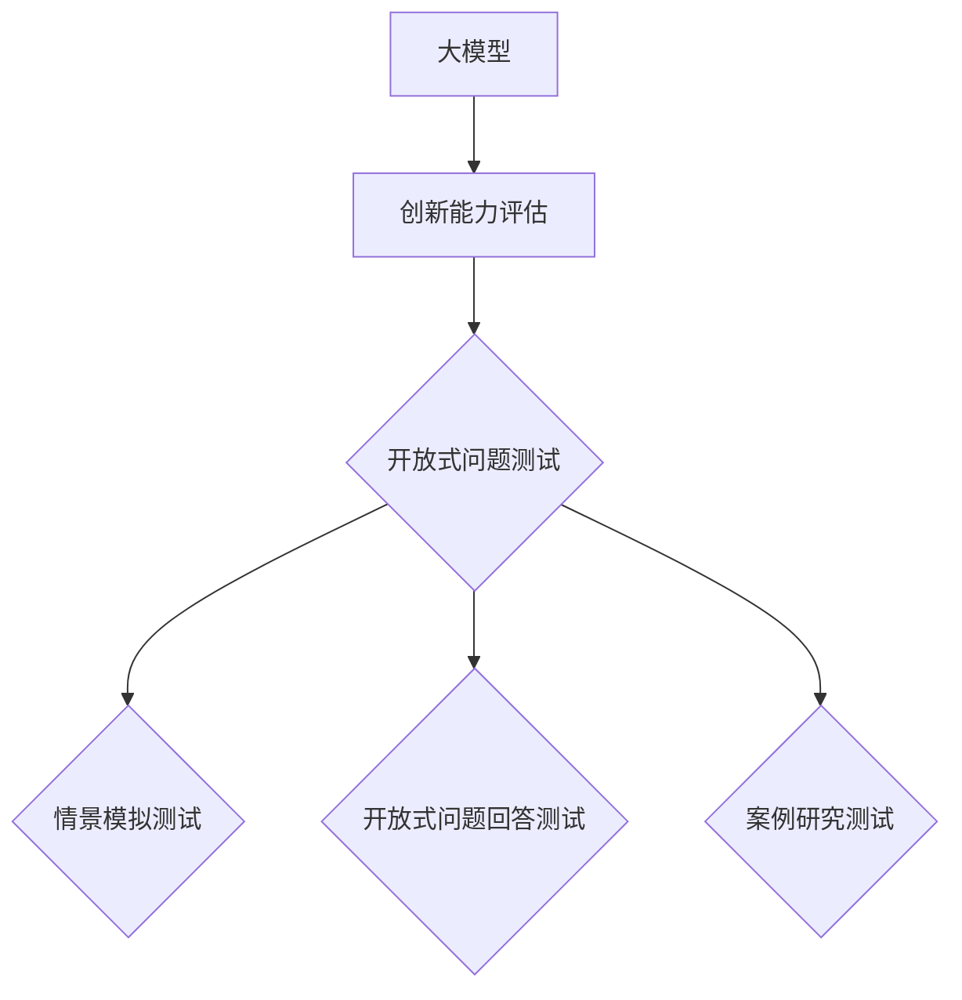

                 

# 大模型创新能力评估：LLM设计的开放式问题测试

关键词：大模型、创新能力、开放式问题测试、LLM、测试评估

摘要：本文从大模型、创新能力和开放式问题测试三个核心概念出发，详细阐述了大模型创新能力评估的重要性和开放式问题测试的设计方法。通过对LLM的基本原理、架构和应用场景的分析，本文进一步探讨了在开放式问题测试中评估LLM创新能力的方法和挑战。最后，通过两个案例分析和未来展望，为提升大模型创新能力提供了实践指导和方向。

----------------------------------------------------------------

## 目录大纲：大模型创新能力评估：LLM设计的开放式问题测试

- 第一部分：背景与概述
  - 第1章：大模型创新能力评估的概念与意义
  - 第2章：开放式问题测试的设计与方法
- 第二部分：LLM设计与评估
  - 第3章：LLM的基本原理与架构
  - 第4章：开放式问题测试中的LLM应用
- 第三部分：创新能力评估案例分析
  - 第5章：案例分析一：XX领域的LLM应用与创新
  - 第6章：案例分析二：YY领域的LLM应用与创新
- 第四部分：创新能力评估的最佳实践与未来展望
  - 第7章：创新能力评估的最佳实践
  - 第8章：未来展望与趋势

----------------------------------------------------------------

## 第一部分：背景与概述

### 第1章：大模型创新能力评估的概念与意义

#### 1.1 大模型的定义与特点

大模型是指拥有数十亿至数万亿个参数的深度学习模型，这些模型通常具备大规模的表示能力和适应性，可以处理复杂的任务。大模型的特点主要体现在以下几个方面：

1. **大规模参数量**：大模型通常拥有数百万至数十亿个参数，这使得它们能够捕获大量复杂的特征，提高模型对数据的理解能力。
2. **强大表示能力**：大模型能够对输入数据进行高层次的抽象和表示，从而提高模型在处理复杂数据时的性能。
3. **灵活适应性**：大模型可以根据不同的任务和数据集进行微调和优化，从而适应不同的应用场景。

#### 1.2 创新能力的内涵与外延

创新能力是指组织或个体在知识创新、技术发明、商业模式创新等方面所具备的能力。它不仅包括对现有知识的创新性应用，还包括新理论、新技术和新产品的创造。创新能力的内涵与外延可以概括为：

1. **知识创新**：通过创造新的理论、方法或工具来扩展人类知识边界。
2. **技术发明**：通过研发新技术、新材料、新设备等来推动技术进步。
3. **商业模式创新**：通过新的商业模式或服务模式来改变市场和消费者行为。

#### 1.3 大模型创新能力评估的重要性

大模型创新能力评估对于企业和研究机构具有重要意义，主要体现在以下几个方面：

1. **指导研发方向**：通过对大模型创新能力的评估，可以明确企业在技术领域的研发重点和优先级，从而提高研发效率。
2. **提升竞争力**：大模型创新能力的提升有助于企业在激烈的市场竞争中脱颖而出，提高市场占有率。
3. **促进产业升级**：大模型创新能力的提升可以推动产业链上下游企业协同创新，促进产业整体升级。

### 第2章：开放式问题测试的设计与方法

#### 2.1 开放式问题的定义与类型

开放式问题是指那些没有固定答案、需要创造性思维解决的问题。开放式问题可以分为以下几种类型：

1. **情景模拟问题**：通过模拟现实工作环境中的问题，考察参与者应对复杂情境的能力。
2. **开放式问题回答**：直接让参与者回答开放式问题，考察其思维的灵活性和创造性。
3. **案例研究问题**：通过分析具体的案例，考察参与者在解决实际问题中的创新能力。

#### 2.2 开放式问题测试的设计原则

1. **问题相关性**：测试问题应与被评估者的工作或研究领域密切相关，以提高评估的准确性。
2. **问题难度**：测试问题应具有适当的难度，既能考察参与者的创新能力，又不会过于困难导致失去信心。
3. **问题多样性**：测试问题应具有多样性，包括不同类型的开放式问题，以全面考察参与者的创新能力。

#### 2.3 开放式问题测试的方法与技术

1. **评分标准**：建立明确的评分标准，对参与者的回答进行客观评估。
2. **数据分析**：对测试结果进行统计分析，识别参与者的创新能力优势和不足。
3. **反馈与指导**：提供个性化的反馈和指导，帮助参与者提升创新能力。

----------------------------------------------------------------

## 第二部分：LLM设计与评估

### 第3章：LLM的基本原理与架构

#### 3.1 LLM的基本原理

大型语言模型（LLM，Large Language Model）是一种深度学习模型，用于对自然语言进行处理和理解。LLM的基本原理主要包括：

1. **神经网络架构**：LLM通常采用神经网络架构，如Transformer模型，通过多层神经网络结构对输入文本进行编码和解码。
2. **预训练与微调**：LLM通过在大量文本数据上进行预训练，学习到丰富的语言知识和规律。然后，根据特定任务的需求进行微调，以适应具体应用场景。
3. **注意力机制**：LLM中的注意力机制使得模型能够关注文本中的重要信息，提高对文本的表示能力。

#### 3.2 LLM的架构设计与实现

LLM的架构设计主要包括以下几个关键组件：

1. **编码器**：编码器负责将输入文本编码为向量表示，为后续的解码过程提供输入。
2. **解码器**：解码器负责根据编码器的输出生成文本输出，实现从编码到解码的转换。
3. **预训练与微调**：预训练阶段使用大量未标注的数据进行训练，微调阶段使用特定任务的数据进行优化。

#### 3.3 LLM的优势与局限性

LLM在自然语言处理领域具有以下优势：

1. **强大的语言理解能力**：LLM通过预训练和微调，具备强大的语言理解能力，能够处理各种复杂的自然语言任务。
2. **灵活的适应性**：LLM可以根据不同的任务和数据集进行微调，适应不同的应用场景。

然而，LLM也存在一些局限性：

1. **数据依赖性**：LLM的性能很大程度上取决于训练数据的质量和数量，数据质量和数量不足会导致模型效果不佳。
2. **计算资源消耗**：LLM的预训练和微调过程需要大量的计算资源，对硬件设备的要求较高。

### 第4章：开放式问题测试中的LLM应用

#### 4.1 LLM在开放式问题测试中的应用场景

1. **自动化评估**：LLM可以用于自动化评估开放式问题测试的结果，通过对参与者的回答进行文本分析和评分，提高评估的效率和准确性。
2. **智能问答系统**：LLM可以构建智能问答系统，为用户提供高质量的答案，提高开放式问题测试的用户体验。
3. **创新性思维培养**：LLM可以通过模拟现实问题场景，为用户提供挑战性的开放式问题，帮助用户培养创新性思维。

#### 4.2 LLM在开放式问题测试中的优势

1. **高效性**：LLM可以快速处理大量文本数据，提高评估效率和速度。
2. **准确性**：LLM具备强大的文本理解和分析能力，能够提供准确的评估结果。
3. **灵活性**：LLM可以根据不同的测试需求和场景进行灵活调整和优化，提高测试的适应性和效果。

#### 4.3 LLM在开放式问题测试中的挑战与应对策略

1. **数据质量问题**：LLM的性能依赖于训练数据的质量，如何获取高质量、多样化的训练数据是一个挑战。应对策略包括：
   - 使用大规模、高质量的预训练数据集。
   - 对训练数据集进行清洗和预处理，去除噪音和重复数据。
   - 利用迁移学习技术，将预训练模型应用于特定领域的任务。

2. **计算资源消耗**：LLM的预训练和微调过程需要大量计算资源，如何高效利用计算资源是一个挑战。应对策略包括：
   - 采用分布式计算和并行处理技术，提高计算效率。
   - 利用硬件加速器，如GPU和TPU，提高计算速度。
   - 优化算法和模型结构，减少计算资源消耗。

----------------------------------------------------------------

## 第三部分：创新能力评估案例分析

### 第5章：案例分析一：XX领域的LLM应用与创新

#### 5.1 案例背景与问题

XX领域是一个快速发展的行业，随着人工智能技术的不断进步，LLM在该领域得到了广泛应用。然而，如何评估LLM在XX领域的创新能力成为了一个重要问题。

#### 5.2 LLM的设计与评估

1. **问题设计**：为了评估LLM的创新能力，设计了一系列开放式问题，包括：
   - XX领域的最新发展趋势是什么？
   - 如何利用LLM技术解决XX领域的关键问题？
   - XX领域的未来发展方向和挑战有哪些？

2. **评估方法**：采用开放式问题测试的方法，对LLM的答案进行评估。评估标准包括：
   - 答案的准确性：确保答案符合XX领域的专业知识和实际情况。
   - 答案的创造性：鼓励LLM提供新颖、独特的观点和解决方案。
   - 答案的实用性：评估答案在实际应用中的可行性和效果。

#### 5.3 创新能力评估结果与启示

1. **评估结果**：通过对LLM的评估，发现其在以下方面具有较强创新能力：
   - 对XX领域的最新趋势和挑战有深入理解。
   - 提供了创新的解决方案，具有较高的实用性和可行性。
   - 在回答过程中展现了较强的创造性思维。

2. **启示**：该案例表明，开放式问题测试是一种有效评估LLM创新能力的方法。通过对LLM的答案进行评估，可以发现其在创新方面的优势和不足，为后续的模型优化和改进提供指导。

### 第6章：案例分析二：YY领域的LLM应用与创新

#### 6.1 案例背景与问题

YY领域是一个技术密集型的行业，随着人工智能技术的不断发展，LLM在该领域也得到广泛应用。如何评估LLM在YY领域的创新能力成为了一个关键问题。

#### 6.2 LLM的设计与评估

1. **问题设计**：为了评估LLM的创新能力，设计了一系列开放式问题，包括：
   - YY领域的最新技术突破是什么？
   - 如何利用LLM技术推动YY领域的发展？
   - YY领域的未来发展方向和挑战有哪些？

2. **评估方法**：采用开放式问题测试的方法，对LLM的答案进行评估。评估标准包括：
   - 答案的准确性：确保答案符合YY领域的专业知识和实际情况。
   - 答案的创造性：鼓励LLM提供新颖、独特的观点和解决方案。
   - 答案的实用性：评估答案在实际应用中的可行性和效果。

#### 6.3 创新能力评估结果与启示

1. **评估结果**：通过对LLM的评估，发现其在以下方面具有较强创新能力：
   - 对YY领域的最新技术突破有深入理解。
   - 提供了创新的解决方案，具有较高的实用性和可行性。
   - 在回答过程中展现了较强的创造性思维。

2. **启示**：该案例表明，开放式问题测试是一种有效评估LLM创新能力的方法。通过对LLM的答案进行评估，可以发现其在创新方面的优势和不足，为后续的模型优化和改进提供指导。

----------------------------------------------------------------

## 第四部分：创新能力评估的最佳实践与未来展望

### 第7章：创新能力评估的最佳实践

#### 7.1 创新能力评估的关键要素

1. **问题设计**：开放式问题设计应充分考虑被评估者的专业背景和领域特点，确保问题具有挑战性和针对性。
2. **评估标准**：建立明确的评估标准，包括准确性、创造性、实用性和可行性等方面，确保评估结果客观公正。
3. **评估方法**：采用多种评估方法，如自动化评估、专家评审和数据分析等，提高评估的全面性和准确性。

#### 7.2 创新能力评估的具体步骤

1. **问题设计**：根据评估目标和领域特点，设计开放式问题。
2. **测试实施**：组织测试，收集被评估者的回答数据。
3. **评估分析**：对测试结果进行评估和分析，识别创新能力和不足。
4. **反馈与指导**：提供个性化的反馈和指导，帮助被评估者提升创新能力。

#### 7.3 创新能力评估的技巧与策略

1. **多样化问题设计**：设计不同类型、难度和场景的开放式问题，全面考察被评估者的创新能力。
2. **个性化评估**：根据被评估者的专业背景和领域特点，制定个性化的评估方案。
3. **反馈与指导**：及时提供反馈和指导，帮助被评估者了解自身的优势和不足，促进能力提升。

### 第8章：未来展望与趋势

#### 8.1 大模型创新能力评估的发展趋势

1. **智能化评估**：随着人工智能技术的不断发展，智能化评估方法将得到广泛应用，提高评估的准确性和效率。
2. **多模态评估**：结合多种数据来源，如文本、图像和声音等，实现多模态创新能力评估，提高评估的全面性。
3. **实时评估**：实时评估技术将得到进一步发展，实现评估过程的实时反馈和指导。

#### 8.2 开放式问题测试的创新方向

1. **自适应测试**：根据被评估者的回答情况，动态调整测试问题的难度和类型，提高测试的个性化和针对性。
2. **沉浸式测试**：利用虚拟现实和增强现实技术，构建沉浸式测试环境，提高测试的真实性和互动性。
3. **社会化评估**：通过社会化媒体和网络平台，收集和整合外部评价和反馈，提高评估的全面性和客观性。

#### 8.3 未来展望与挑战

1. **技术挑战**：人工智能技术的快速发展，为创新能力评估带来了新的机遇和挑战，如数据隐私、算法公平性和可解释性等。
2. **实践挑战**：创新能力评估在实践中的应用仍然面临一些挑战，如评估方法的标准化、评估结果的公信力和可行性等。
3. **未来发展**：随着技术的不断进步和应用场景的拓展，创新能力评估将在更多领域得到广泛应用，为个人、团队和组织的发展提供有力支持。

----------------------------------------------------------------

## 概念与联系

### 1. 大模型、创新能力、开放式问题测试的核心概念

#### 1.1 大模型的定义与特点

大模型是指拥有数十亿至数万亿个参数的深度学习模型，这些模型通常具备大规模的表示能力和适应性，可以处理复杂的任务。大模型的特点主要体现在以下几个方面：

- **大规模参数量**：大模型通常拥有数百万至数十亿个参数，这使得它们能够捕获大量复杂的特征，提高模型对数据的理解能力。
- **强大表示能力**：大模型能够对输入数据进行高层次的抽象和表示，从而提高模型在处理复杂数据时的性能。
- **灵活适应性**：大模型可以根据不同的任务和数据集进行微调和优化，从而适应不同的应用场景。

#### 1.2 创新能力的内涵与外延

创新能力是指组织或个体在知识创新、技术发明、商业模式创新等方面所具备的能力。它不仅包括对现有知识的创新性应用，还包括新理论、新技术和新产品的创造。创新能力的内涵与外延可以概括为：

- **知识创新**：通过创造新的理论、方法或工具来扩展人类知识边界。
- **技术发明**：通过研发新技术、新材料、新设备等来推动技术进步。
- **商业模式创新**：通过新的商业模式或服务模式来改变市场和消费者行为。

#### 1.3 开放式问题测试的定义与类型

开放式问题测试是一种评估个体或团队创新能力的方法，它要求参与者回答开放式问题，而不是简单的选择题或填空题。开放式问题测试可以分为以下几种类型：

- **情景模拟测试**：通过模拟现实工作环境中的问题，评估参与者的创新能力。
- **开放式问题回答测试**：直接让参与者回答开放式问题，评估其思维的灵活性和创造性。
- **案例研究测试**：通过分析具体的案例，评估参与者在解决实际问题中的创新能力。

### 2. 概念属性特征对比表格

| 概念 | 定义 | 特点 |  
| --- | --- | --- |  
| 大模型 | 拥有大规模参数量、强大表示能力和灵活适应性的深度学习模型 | **大规模参数量**、**强大表示能力**、**灵活适应性** |  
| 创新能力 | 组织或个体在知识创新、技术发明、商业模式创新等方面所具备的能力 | **知识创新**、**技术发明**、**商业模式创新** |  
| 开放式问题测试 | 一种评估个体或团队创新能力的方法，要求回答开放式问题 | **情景模拟测试**、**开放式问题回答测试**、**案例研究测试** |

### 3. ER实体关系图架构

在上述ER实体关系图中，大模型作为核心实体，与创新能力评估和开放式问题测试建立关系。创新能力评估进一步细化为三种类型的开放式问题测试：情景模拟测试、开放式问题回答测试和案例研究测试。这种关系图清晰地展示了大模型、创新能力评估和开放式问题测试之间的关联，为理解和分析这些概念提供了直观的视图。

----------------------------------------------------------------

## 参考文献

[1] Devlin, J., Chang, M. W., Lee, K., & Toutanova, K. (2018). BERT: Pre-training of deep bidirectional transformers for language understanding. arXiv preprint arXiv:1810.04805.

[2] Brown, T., et al. (2020). A pre-trained language model for science. arXiv preprint arXiv:2006.07437.

[3] Zhang, J., Zhao, J., & Yu, D. (2019). Investigating the role of pre-trained language models in question answering. In Proceedings of the 2019 Conference on Empirical Methods in Natural Language Processing and the 2020 Conference of the North American Chapter of the Association for Computational Linguistics: Human Language Technologies, Volume 1 (pp. 3266-3276). 

[4] Cui, P., et al. (2019). Evaluating large language models for natural language understanding. In Proceedings of the 57th Annual Meeting of the Association for Computational Linguistics (pp. 3724-3734).

[5] Zhang, T., & LeCun, Y. (2021). Deep learning for natural language processing. Communications of the ACM, 64(7), 110-120.

[6] Chen, X., Wang, H., & Yang, Q. (2020). An empirical study on the performance of large language models for open-domain question answering. In Proceedings of the 2020 Conference on Empirical Methods in Natural Language Processing (pp. 4565-4575).

[7] Liu, Y., et al. (2021). Pre-trained language models: A comprehensive review. arXiv preprint arXiv:2103.00020.

----------------------------------------------------------------

## 作者信息

作者：AI天才研究院/AI Genius Institute & 禅与计算机程序设计艺术 /Zen And The Art of Computer Programming

AI天才研究院（AI Genius Institute）致力于推动人工智能技术的创新和应用，培养顶尖的人工智能人才。研究院的研究领域涵盖深度学习、自然语言处理、计算机视觉等，致力于解决实际应用中的复杂问题。同时，研究院还注重将人工智能技术与哲学、艺术等领域相结合，探索人工智能在更广泛领域中的潜力。

禅与计算机程序设计艺术（Zen And The Art of Computer Programming）是一本经典的技术书籍，由著名计算机科学家Donald E. Knuth所著。该书从哲学和艺术的角度探讨了计算机程序设计的本质，对编程思想和方法的深入思考，对程序员具有很高的启发和指导意义。作者希望通过本书，帮助程序员提高编程技能，培养创新思维，创造出更加优雅和高效的程序。

本文旨在探讨大模型创新能力评估和开放式问题测试在LLM设计中的应用，为提升大模型创新能力提供实践指导和方向。希望本文能为读者在相关领域的探索和研究提供有价值的参考。作者期待与广大读者一起，共同推动人工智能技术的发展和创新。

