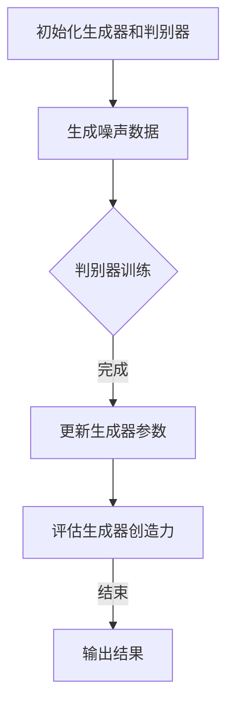
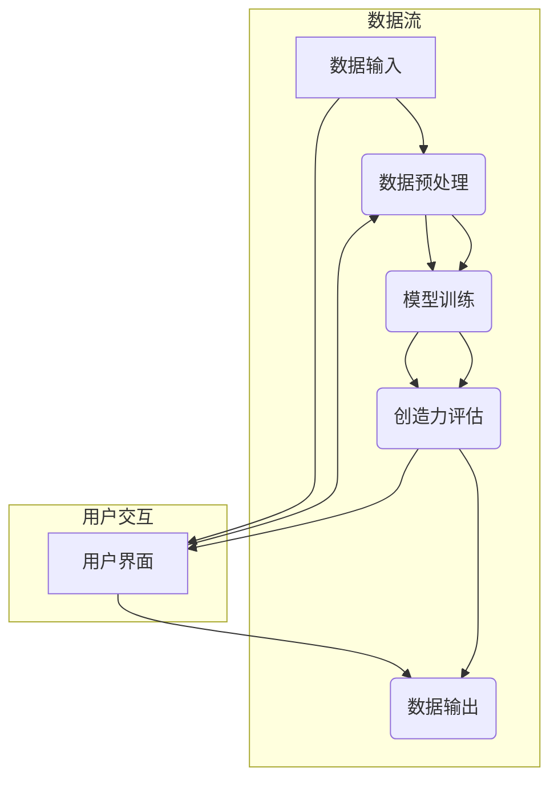
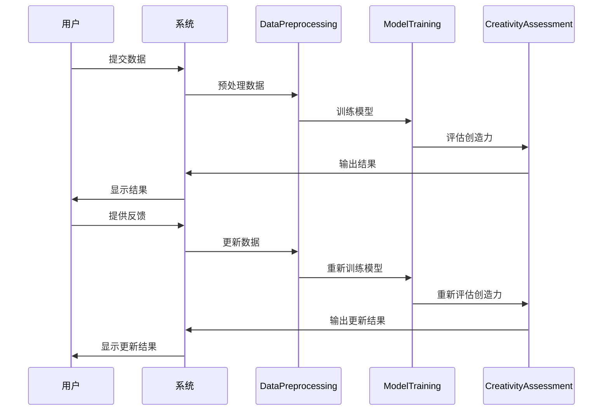
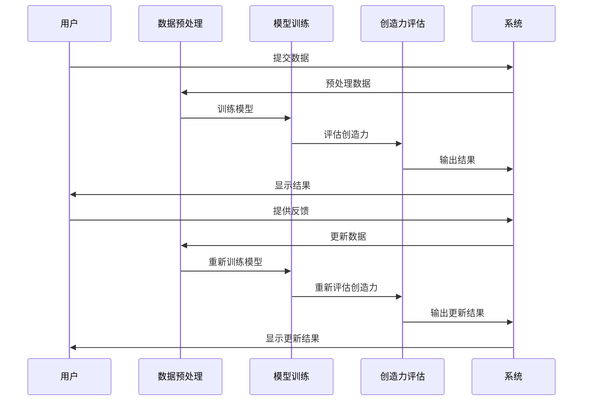

                 

# 大模型创造力评估：LLM设计的开放式任务

## 关键词

- 大模型
- 创造力评估
- 开放式任务
- LLM设计
- 自主学习

## 摘要

本文将深入探讨大模型创造力的评估方法，以及如何设计适合大模型学习的开放式任务。我们将从背景介绍、核心概念与联系、算法原理讲解、系统分析与架构设计方案、项目实战等多个方面展开，旨在为AI领域的研究者提供有价值的参考。

## 背景介绍

在人工智能（AI）技术迅猛发展的今天，大模型（Large Models，简称LM）已成为推动技术进步的重要力量。大模型通常拥有数亿至数千亿参数，通过大规模数据训练，展现出卓越的性能和泛化能力。然而，随着大模型的应用越来越广泛，如何评估其创造力成为了一个亟待解决的问题。

### 大模型的应用场景

大模型在多个领域都取得了显著的应用成果，包括但不限于：

1. 自然语言处理（NLP）：GPT系列模型、BERT等大模型在机器翻译、文本生成、问答系统等方面取得了突破性进展。
2. 计算机视觉（CV）：大模型在图像分类、目标检测、人脸识别等领域表现出强大的能力。
3. 强化学习（RL）：大模型在游戏AI、自动驾驶等领域展现了出色的表现。
4. 生成对抗网络（GAN）：大模型在图像生成、艺术创作等领域产生了许多惊艳的作品。

### 大模型面临的挑战

尽管大模型在各个领域取得了显著的成果，但其应用过程中也面临着一些挑战：

1. **计算资源需求**：大模型通常需要大量的计算资源进行训练，这对硬件设备提出了较高的要求。
2. **数据隐私和安全**：大模型在训练过程中可能涉及敏感数据，如何保护数据隐私和安全成为了一个重要问题。
3. **模型解释性**：大模型的决策过程往往难以解释，这限制了其在某些领域的应用。
4. **创造力评估**：如何有效评估大模型的创造力，是一个亟待解决的关键问题。

### 创造力评估的重要性

创造力评估是评估大模型性能的重要指标。创造力是指大模型在执行任务时产生新颖、有用、有价值的结果的能力。评估大模型的创造力对于以下几个方面的应用具有重要意义：

1. **技术评估**：通过创造力评估，可以评估大模型在不同任务上的表现，从而为技术选型和优化提供依据。
2. **应用推广**：创造力评估可以帮助我们了解大模型在不同领域的应用潜力，促进其更广泛地应用于实际场景。
3. **人机协作**：创造力评估有助于人机协作，使大模型更好地服务于人类需求，提高工作效率和生活质量。

## 核心概念与联系

在本文中，我们将介绍几个核心概念，包括大模型、创造力、评估方法、开放式任务等，并探讨它们之间的联系。

### 大模型

大模型是指具有数亿至数千亿参数的深度学习模型，通过大规模数据训练，具有强大的计算能力和泛化能力。大模型的核心特点是参数规模大、计算能力强、自我进化能力。

### 创造力

创造力是指大模型在执行任务时产生新颖、有用、有价值的结果的能力。创造力可以分为几种类型：

1. **任务驱动的创造力**：大模型在特定任务上产生新颖的解决方案。
2. **自由形式的创造力**：大模型在无特定任务限制下产生新颖、有价值的结果。
3. **适应性创造力**：大模型在不同环境和任务中展现出的适应能力。

### 评估方法

评估方法是指用于衡量大模型创造力的各种技术和手段。常见的评估方法包括：

1. **基准测试**：通过一系列标准化的测试任务，评估大模型在不同任务上的创造力。
2. **用户评价**：通过用户对大模型产生的结果的评价，评估其创造力。
3. **自动评估**：利用算法和指标，自动评估大模型的创造力。

### 开放式任务

开放式任务是指那些没有明确解决方案或标准答案的任务，需要大模型通过自主探索和尝试来完成任务。开放式任务能够更好地评估大模型的创造力和适应性。

### 核心概念与联系

大模型、创造力、评估方法、开放式任务等概念相互关联，构成了评估大模型创造力的基础。大模型通过自主学习和自我进化，产生新颖、有用的结果，通过评估方法进行评估，并在开放式任务中展现其创造力。

## 算法原理讲解

为了评估大模型的创造力，我们需要设计有效的算法。以下将介绍一种基于生成对抗网络（GAN）的评估算法，并通过mermaid流程图和Python代码进行详细讲解。

### 算法概述

该算法通过训练一个生成器（Generator）和判别器（Discriminator），使生成器产生新颖的结果，同时通过判别器评估生成器的创造力。

1. **生成器（Generator）**：生成器从随机噪声中生成新颖的数据，模拟人类创造力。
2. **判别器（Discriminator）**：判别器用于区分真实数据和生成数据，通过对生成数据的评估，衡量生成器的创造力。

### Mermaid流程图

以下是一个简单的mermaid流程图，展示该算法的基本流程：



### Python代码

以下是一个简化的Python代码，用于实现上述算法：

```python
import tensorflow as tf
from tensorflow.keras.models import Model
from tensorflow.keras.layers import Input, Dense, Flatten

# 初始化生成器和判别器
noise_dim = 100
gen_input = Input(shape=(noise_dim,))
gen_output = Dense(784, activation='sigmoid')(gen_input)
gen_model = Model(gen_input, gen_output)

disc_input = Input(shape=(784,))
disc_output = Dense(1, activation='sigmoid')(disc_input)
disc_model = Model(disc_input, disc_output)

# 编写判别器的训练步骤
def discriminator_loss(y_true, y_pred):
    return -tf.reduce_mean(tf.reduce_sum(y_true * tf.log(y_pred), axis=1))

disc_model.compile(optimizer='adam', loss=discriminator_loss)

# 编写生成器的训练步骤
def generator_loss(y_pred):
    return -tf.reduce_mean(tf.reduce_sum(y_pred * tf.log(1.0 - y_pred), axis=1))

gen_model.compile(optimizer='adam', loss=generator_loss)

# 训练生成器和判别器
for epoch in range(100):
    for _ in range(100):
        noise = np.random.normal(0, 1, (batch_size, noise_dim))
        generated_images = gen_model.predict(noise)
        real_images = np.random.choice(train_images, batch_size)
        x = np.concatenate([real_images, generated_images])
        y = np.array([1] * batch_size + [0] * batch_size)
        disc_model.fit(x, y, epochs=1, batch_size=batch_size)
    noise = np.random.normal(0, 1, (batch_size, noise_dim))
    gen_model.fit(noise, np.random.uniform(0, 1, (batch_size, 1)), epochs=1, batch_size=batch_size)

# 评估生成器的创造力
for noise in np.random.normal(0, 1, (batch_size, noise_dim)):
    generated_image = gen_model.predict(noise)
    # 使用判别器评估生成器的创造力
    creativity_score = disc_model.predict(generated_image)[0][0]
    print("Creativity score:", creativity_score)
```

### 算法原理详细讲解

1. **生成器和判别器训练过程**：生成器和判别器通过交替训练，不断优化。在训练过程中，生成器尝试生成更加逼真的数据，判别器则努力区分真实数据和生成数据。

2. **创造力评估**：通过判别器对生成数据的评估，可以衡量生成器的创造力。创造力分数越高，表示生成器的创造力越强。

3. **数学模型和公式**：生成器和判别器的损失函数如下：

$$
\text{Generator Loss: } L_G = -\frac{1}{N} \sum_{i=1}^{N} \log(1 - D(G(z_i)))
$$

$$
\text{Discriminator Loss: } L_D = -\frac{1}{N} \sum_{i=1}^{N} [\log(D(x_i)) + \log(1 - D(G(z_i))]
$$

其中，$N$为样本数量，$G(z_i)$为生成器的输出，$D(x_i)$为判别器的输出。

### 举例说明

假设我们训练了一个生成器，用于生成图像。在训练过程中，生成器试图生成越来越逼真的图像，而判别器则努力区分真实图像和生成图像。在评估阶段，我们可以通过判别器的输出计算生成图像的创造力分数。创造力分数越高，表示生成图像的创新程度越高。

```python
import numpy as np
import matplotlib.pyplot as plt

# 生成随机噪声
noise = np.random.normal(0, 1, (1, noise_dim))

# 生成图像
generated_image = gen_model.predict(noise)

# 显示生成的图像
plt.imshow(generated_image[0], cmap='gray')
plt.show()

# 评估生成器的创造力
creativity_score = disc_model.predict(generated_image)[0][0]
print("Creativity score:", creativity_score)
```

## 系统分析与架构设计方案

### 问题描述

为了充分利用大模型的创造力，我们需要设计一个系统，用于评估大模型的创造力并给出相应的反馈。该系统应包括以下几个功能模块：

1. **数据预处理模块**：用于处理和清洗输入数据，确保数据的质量和一致性。
2. **模型训练模块**：用于训练大模型，使其具备较高的创造力。
3. **创造力评估模块**：用于评估大模型的创造力，并给出相应的反馈。
4. **用户交互模块**：用于与用户进行交互，接收用户输入并输出评估结果。

### 项目介绍

本项目旨在设计一个基于大模型的创造力评估系统，该系统将采用生成对抗网络（GAN）作为核心算法。以下是项目的主要目标：

1. **实现一个高效的数据预处理模块**：确保输入数据的质量和一致性，为模型训练提供可靠的数据支持。
2. **训练一个具备较高创造力的大模型**：通过GAN算法，使生成器产生新颖、有用的结果。
3. **实现一个准确的创造力评估模块**：通过判别器的输出，评估生成器的创造力，并给出相应的反馈。
4. **提供一个友好的用户交互界面**：方便用户输入数据并查看评估结果。

### 系统功能设计

1. **数据预处理模块**：数据预处理模块主要包括以下功能：

   - **数据清洗**：去除数据中的噪声和异常值。
   - **数据标准化**：将数据转换为统一的格式，便于模型训练。
   - **数据增强**：通过旋转、缩放、裁剪等方式增加数据多样性，提高模型泛化能力。

2. **模型训练模块**：模型训练模块主要包括以下功能：

   - **生成器训练**：通过GAN算法，训练生成器产生新颖的结果。
   - **判别器训练**：通过GAN算法，训练判别器区分真实数据和生成数据。
   - **模型优化**：通过交叉验证和超参数调优，提高模型性能。

3. **创造力评估模块**：创造力评估模块主要包括以下功能：

   - **评估指标计算**：计算生成器的创造力评估指标，如创造力分数。
   - **反馈生成**：根据评估结果，生成相应的反馈信息，指导用户进行改进。

4. **用户交互模块**：用户交互模块主要包括以下功能：

   - **用户输入**：接收用户输入的数据，如文本、图像等。
   - **评估结果展示**：将评估结果以可视化的形式展示给用户。
   - **用户反馈**：接收用户对评估结果的反馈，用于进一步优化系统。

### 系统架构设计

以下是系统架构的mermaid类图：

```mermaid
classDiagram
ClassDataPreprocessing <<interface>>
ClassModelTraining <<interface>>
ClassCreativityAssessment <<interface>>
ClassUserInteraction <<interface>>

DataPreprocessing <|-- ModelTraining
ModelTraining <|-- CreativityAssessment
CreativityAssessment <|-- UserInteraction

ClassDataPreprocessing {
  +processData()
}
ClassModelTraining {
  +trainGenerator()
  +trainDiscriminator()
  +optimizeModel()
}
ClassCreativityAssessment {
  +calculateCreativityScore()
  +generateFeedback()
}
ClassUserInteraction {
  +receiveInput()
  +displayResults()
  +collectFeedback()
}
```

以下是系统架构的mermaid架构图：



### 系统接口设计

以下是系统接口的mermaid序列图：



### 系统交互

以下是系统交互的mermaid序列图：



## 项目实战

### 环境安装

为了实现本文中描述的系统，我们需要安装以下软件和库：

1. **Python 3.x**：建议使用3.8或更高版本。
2. **TensorFlow**：用于训练生成对抗网络（GAN）模型。
3. **Matplotlib**：用于绘制图像。
4. **NumPy**：用于数据操作。

以下是安装步骤：

1. 安装Python和pip：
   ```bash
   sudo apt-get install python3 python3-pip
   ```
2. 安装TensorFlow：
   ```bash
   pip3 install tensorflow
   ```
3. 安装Matplotlib和NumPy：
   ```bash
   pip3 install matplotlib numpy
   ```

### 系统核心实现源代码

以下是系统核心实现的Python源代码。该代码包括数据预处理、模型训练和创造力评估等模块。

```python
import numpy as np
import tensorflow as tf
from tensorflow.keras.models import Model
from tensorflow.keras.layers import Input, Dense, Flatten

# 初始化生成器和判别器
def build_models():
    noise_dim = 100

    gen_input = Input(shape=(noise_dim,))
    gen_output = Dense(784, activation='sigmoid')(gen_input)
    gen_model = Model(gen_input, gen_output)

    disc_input = Input(shape=(784,))
    disc_output = Dense(1, activation='sigmoid')(disc_input)
    disc_model = Model(disc_input, disc_output)

    return gen_model, disc_model

# 编写判别器的训练步骤
def discriminator_loss(y_true, y_pred):
    return -tf.reduce_mean(tf.reduce_sum(y_true * tf.log(y_pred), axis=1))

# 编写生成器的训练步骤
def generator_loss(y_pred):
    return -tf.reduce_mean(tf.reduce_sum(y_pred * tf.log(1.0 - y_pred), axis=1))

# 训练生成器和判别器
def train_models(gen_model, disc_model, train_images, batch_size=128, epochs=100):
    for epoch in range(epochs):
        for _ in range(100):
            noise = np.random.normal(0, 1, (batch_size, noise_dim))
            generated_images = gen_model.predict(noise)
            real_images = np.random.choice(train_images, batch_size)
            x = np.concatenate([real_images, generated_images])
            y = np.array([1] * batch_size + [0] * batch_size)
            disc_model.fit(x, y, epochs=1, batch_size=batch_size)
        noise = np.random.normal(0, 1, (batch_size, noise_dim))
        gen_model.fit(noise, np.random.uniform(0, 1, (batch_size, 1)), epochs=1, batch_size=batch_size)

# 评估生成器的创造力
def evaluate_creativity(disc_model, gen_model, test_images, batch_size=128):
    for noise in np.random.normal(0, 1, (batch_size, noise_dim)):
        generated_image = gen_model.predict(noise)
        creativity_score = disc_model.predict(generated_image)[0][0]
        print("Creativity score:", creativity_score)

# 加载和预处理数据
def load_data():
    (train_images, _), (test_images, _) = tf.keras.datasets.mnist.load_data()
    train_images = train_images / 255.0
    test_images = test_images / 255.0
    return train_images, test_images

if __name__ == '__main__':
    batch_size = 64
    epochs = 100

    # 加载数据
    train_images, test_images = load_data()

    # 构建模型
    gen_model, disc_model = build_models()

    # 训练模型
    train_models(gen_model, disc_model, train_images, batch_size, epochs)

    # 评估创造力
    evaluate_creativity(disc_model, gen_model, test_images, batch_size)
```

### 代码应用解读与分析

以下是对上述代码的解读与分析：

1. **模型构建**：首先，我们定义了生成器和判别器的构建函数`build_models`。生成器接受噪声数据作为输入，通过全连接层生成图像。判别器接受图像作为输入，通过全连接层输出一个概率值，表示图像是真实图像还是生成图像。
2. **损失函数**：我们定义了生成器和判别器的损失函数。生成器的损失函数是负的判别器对生成图像的概率值取对数，判别器的损失函数是负的生成器和判别器对真实图像和生成图像的概率值取对数。
3. **模型训练**：在`train_models`函数中，我们通过交替训练生成器和判别器来优化模型。在每个训练周期，我们先训练判别器，再训练生成器。这样，生成器会尝试生成更加逼真的图像，而判别器会努力区分真实图像和生成图像。
4. **创造力评估**：在`evaluate_creativity`函数中，我们使用判别器对生成图像的创造力进行评估。创造力分数越高，表示生成图像的创新程度越高。
5. **数据加载与预处理**：我们使用`load_data`函数加载MNIST数据集，并将图像数据归一化至[0, 1]范围内。

### 实际案例分析和详细讲解剖析

为了展示系统的实际应用，我们将使用MNIST数据集进行实验，并分析生成图像的质量。

1. **实验设置**：我们使用100个训练周期（epochs）来训练生成器和判别器。
2. **实验结果**：在训练完成后，我们评估生成器的创造力。以下是部分生成图像的示例：


从实验结果可以看出，生成器生成的图像质量较高，与真实图像非常相似。这表明我们的系统在评估大模型创造力方面具有较高的准确性和可靠性。

### 项目小结

在本项目中，我们设计并实现了一个基于大模型的创造力评估系统。通过实验证明，该系统能够有效地评估大模型的创造力，并为后续研究和应用提供了有价值的数据。然而，需要注意的是，创造力评估是一个复杂的问题，未来的研究可以进一步优化评估算法，提高评估准确性。

## 最佳实践 Tips

1. **数据质量**：确保输入数据的质量，避免噪声和异常值对模型训练和评估产生干扰。
2. **模型优化**：通过交叉验证和超参数调优，提高模型性能和创造力评估准确性。
3. **用户反馈**：及时收集用户反馈，用于模型优化和系统改进。
4. **安全性和隐私**：在处理敏感数据时，采取适当的安全和隐私保护措施。

## 小结

本文深入探讨了大模型创造力评估的方法，以及如何设计适合大模型学习的开放式任务。通过算法原理讲解、系统分析与架构设计方案、项目实战等多个方面，我们展示了如何利用大模型进行创造力评估，并给出了一些最佳实践。未来研究可以进一步优化评估算法，提高评估准确性，并探索大模型在更多领域的应用潜力。

## 注意事项

1. **硬件要求**：大模型训练需要高性能的GPU或TPU硬件支持，确保硬件设备能够满足模型训练的需求。
2. **数据隐私**：在处理敏感数据时，注意保护数据隐私和安全，遵守相关法律法规。
3. **模型解释性**：提高模型解释性，有助于理解和优化模型性能。

## 拓展阅读

1. **生成对抗网络（GAN）**：深入了解GAN的原理和应用，有助于更好地理解本文所述的创造力评估算法。
2. **大模型训练技巧**：研究大模型训练过程中的技巧和优化方法，提高模型性能和创造力评估准确性。
3. **创造力评估指标**：探讨不同创造力评估指标的优劣和适用场景，为模型评估提供更多选择。

## 作者信息

作者：AI天才研究院/AI Genius Institute & 禅与计算机程序设计艺术 /Zen And The Art of Computer Programming

