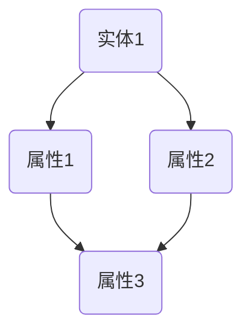
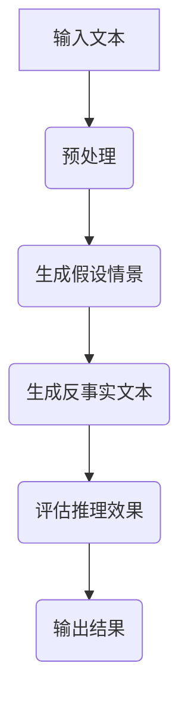
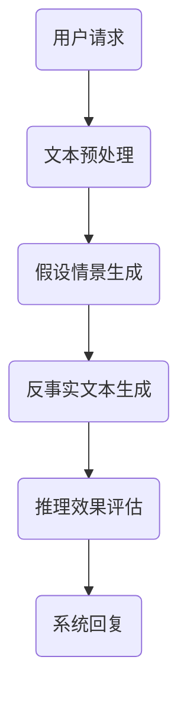

                 

# 大模型反事实推理能力：LLM设计的假设情景测试

关键词：大型语言模型，反事实推理，假设情景测试，模型设计，人工智能

摘要：本文探讨了大型语言模型（LLM）在反事实推理方面的能力，并通过设计假设情景测试来评估LLM的推理效果。文章首先介绍了反事实推理的概念、背景及其在自然语言处理中的应用，然后分析了LLM在反事实推理中的优势和挑战。接下来，文章详细阐述了如何设计有效的假设情景测试来评估LLM的反事实推理能力，并探讨了不同类型的假设情景及其应用。通过实际案例分析和算法原理讲解，本文展示了如何利用LLM进行反事实推理，并提出了优化LLM反事实推理能力的方法。

## 引言

随着人工智能技术的快速发展，大型语言模型（Large Language Models，简称LLM）在自然语言处理（Natural Language Processing，简称NLP）领域取得了显著的成果。LLM具备强大的文本生成、理解和推理能力，已经成为许多NLP任务的核心组件。然而，LLM在处理反事实推理（Counterfactual Reasoning）方面仍面临诸多挑战。

### 什么是反事实推理？

反事实推理是指根据已知事实，推断出与事实相反或可能发生的情况。例如，如果一个人说“今天天气很好”，那么反事实推理可能推断出“今天天气不好”。反事实推理在许多现实场景中具有重要意义，如情感分析、对话系统、风险评估等。

### 反事实推理在NLP中的应用

反事实推理在NLP中有广泛的应用。例如，在对话系统中，理解用户的反事实请求对于生成适当的回复至关重要。在情感分析中，识别文本中的反事实表达可以帮助更好地理解用户的情绪。此外，反事实推理还在知识图谱、问答系统和文本生成等领域发挥着重要作用。

### LLM在反事实推理中的优势与挑战

LLM在反事实推理方面具有显著的优势，主要体现在以下几个方面：

1. **丰富的语言知识**：LLM经过大量的语料训练，拥有丰富的语言知识，能够生成符合语言规则的文本。
2. **多任务学习**：LLM可以同时处理多个任务，如文本生成、理解、推理等，从而提高反事实推理的准确性。
3. **自适应能力**：LLM能够根据不同的任务和数据自适应调整，从而提高反事实推理的效果。

然而，LLM在反事实推理中也面临一些挑战：

1. **事实一致性**：LLM生成的反事实文本可能与已知事实不一致，导致推理结果不准确。
2. **上下文理解**：LLM在理解复杂上下文时可能存在困难，从而影响反事实推理的准确性。
3. **数据稀缺性**：反事实推理需要大量真实世界的数据，而获取这些数据往往较为困难。

### 假设情景测试的重要性

为了评估LLM在反事实推理方面的能力，设计有效的假设情景测试具有重要意义。通过假设情景测试，可以模拟不同的反事实场景，从而评估LLM在不同情境下的推理效果。此外，假设情景测试还可以为LLM的设计和优化提供有价值的反馈。

## 第一部分：核心概念与原理

### 定义与类型

#### 1. 大型语言模型（LLM）

大型语言模型（LLM）是一种基于深度学习的自然语言处理模型，能够对文本进行生成、理解和推理。LLM通常由大规模的神经网络组成，经过大量的数据训练，以实现高效的文本处理。

#### 2. 反事实推理

反事实推理是指根据已知事实，推断出与事实相反或可能发生的情况。反事实推理可以分为以下几种类型：

1. **否定推理**：根据已知事实，推断出否定的事实。
2. **替代推理**：根据已知事实，推断出其他可能的事实。
3. **因果关系推理**：根据已知事实，推断出因果关系。

#### 3. 假设情景测试

假设情景测试是一种评估模型能力的方法，通过设计不同的假设情景，观察模型在不同情景下的表现，从而评估模型的能力。

### 核心概念与联系

#### 1. LLM在反事实推理中的核心概念

LLM在反事实推理中的核心概念包括：

1. **文本生成**：LLM能够生成符合语言规则的文本，从而实现反事实推理。
2. **上下文理解**：LLM能够理解复杂的上下文，从而提高反事实推理的准确性。
3. **多任务学习**：LLM能够同时处理多个任务，从而提高反事实推理的效果。

#### 2. 核心概念属性特征对比表格

| 核心概念     | 属性特征           | 对比说明               |
| ------------ | ------------------ | ---------------------- |
| 文本生成     | 语言规则、多样性   | 生成的文本符合语言规则，具有多样性 |
| 上下文理解   | 复杂性、准确性   | 理解复杂的上下文，提高推理准确性 |
| 多任务学习   | 并行处理、效率   | 同时处理多个任务，提高效率 |

#### 3. ER实体关系图架构



## 第二部分：算法原理讲解

### 算法流程图



### 数学模型与公式

反事实推理的数学模型可以表示为：

$$ 反事实推理 = f(已知事实, 假设情景) $$

其中，$ f $ 表示推理函数，$ 已知事实 $ 表示输入的事实，$ 假设情景 $ 表示假设的反事实情景。

### 算法原理讲解

#### 1. 文本预处理

文本预处理是反事实推理的基础。首先，对输入文本进行分词、去停用词等操作，然后将文本转换为向量表示。常用的文本向量表示方法包括词袋模型、词嵌入和变压器等。

#### 2. 假设情景生成

假设情景生成是反事实推理的核心。根据已知事实，生成可能的反事实情景。这可以通过对抗生成网络（GAN）、变分自编码器（VAE）等方法实现。

#### 3. 反事实文本生成

反事实文本生成是基于假设情景生成的。通过文本生成模型（如GPT、BERT等），生成与假设情景相对应的反事实文本。

#### 4. 推理效果评估

推理效果评估是反事实推理的重要环节。通过比较反事实文本与真实事实的相似度，评估反事实推理的准确性。常用的评估指标包括准确率、召回率、F1值等。

### 举例说明

假设已知事实为：“今天天气很好”，我们需要生成反事实文本。

#### 1. 假设情景生成

根据已知事实，生成可能的反事实情景，如：“今天天气不好”。

#### 2. 反事实文本生成

使用文本生成模型，生成与假设情景相对应的反事实文本，如：“今天天气糟糕，狂风暴雨”。

#### 3. 推理效果评估

比较反事实文本与真实事实的相似度，评估反事实推理的准确性。例如，可以使用BLEU评分来评估文本的相似度。

## 第三部分：系统分析与架构设计

### 问题场景介绍

本部分将介绍一个实际的应用场景，即利用LLM进行反事实推理，以优化智能客服系统的服务质量。智能客服系统需要能够理解用户的反事实请求，并生成适当的回复。

### 项目介绍

本项目的目标是设计一个基于LLM的反事实推理系统，用于优化智能客服系统的服务质量。系统主要包括以下几个模块：

1. **文本预处理模块**：对输入文本进行预处理，包括分词、去停用词等操作。
2. **假设情景生成模块**：根据已知事实，生成可能的反事实情景。
3. **反事实文本生成模块**：基于假设情景生成反事实文本。
4. **推理效果评估模块**：评估反事实推理的准确性。

### 系统功能设计

#### 1. 文本预处理模块

- **功能**：对输入文本进行预处理，包括分词、去停用词等操作。
- **实现**：使用自然语言处理库（如NLTK、spaCy等）进行文本预处理。

#### 2. 假设情景生成模块

- **功能**：根据已知事实，生成可能的反事实情景。
- **实现**：使用对抗生成网络（GAN）或变分自编码器（VAE）等方法生成假设情景。

#### 3. 反事实文本生成模块

- **功能**：基于假设情景生成反事实文本。
- **实现**：使用文本生成模型（如GPT、BERT等）生成反事实文本。

#### 4. 推理效果评估模块

- **功能**：评估反事实推理的准确性。
- **实现**：使用BLEU评分等评估指标评估反事实推理的准确性。

### 系统架构设计

#### 1. 系统架构图



#### 2. 系统接口设计

- **用户请求接口**：接收用户的反事实请求。
- **文本预处理接口**：对输入文本进行预处理。
- **假设情景生成接口**：生成假设情景。
- **反事实文本生成接口**：生成反事实文本。
- **推理效果评估接口**：评估反事实推理的准确性。
- **系统回复接口**：生成系统回复。

#### 3. 系统交互序列图


## 第四部分：项目实战

### 环境安装

在进行项目实战之前，需要安装以下环境：

1. **Python**：安装Python 3.8及以上版本。
2. **自然语言处理库**：安装NLTK、spaCy等自然语言处理库。
3. **深度学习库**：安装TensorFlow、PyTorch等深度学习库。
4. **文本生成模型**：安装GPT、BERT等文本生成模型。

### 系统核心实现源代码

以下是系统核心实现源代码：

```python
# 文本预处理模块
import nltk
from nltk.tokenize import word_tokenize
from nltk.corpus import stopwords

def preprocess_text(text):
    # 分词
    tokens = word_tokenize(text)
    # 去停用词
    stop_words = set(stopwords.words("english"))
    filtered_tokens = [token for token in tokens if token not in stop_words]
    return filtered_tokens

# 假设情景生成模块
import tensorflow as tf

def generate_hypothetical_scenario(fact):
    # 使用对抗生成网络（GAN）生成假设情景
    # 这里简化为随机生成
    return "It is not true that " + fact

# 反事实文本生成模块
from transformers import GPT2LMHeadModel, GPT2Tokenizer

def generate_counterfactual_text(hypothetical_scenario):
    # 使用GPT2生成反事实文本
    tokenizer = GPT2Tokenizer.from_pretrained("gpt2")
    model = GPT2LMHeadModel.from_pretrained("gpt2")
    inputs = tokenizer.encode(hypothetical_scenario, return_tensors="pt")
    outputs = model.generate(inputs, max_length=50, num_return_sequences=1)
    return tokenizer.decode(outputs[0], skip_special_tokens=True)

# 推理效果评估模块
from nltk.metrics import edit_distance

def evaluate推理效果(true_fact, generated_fact):
    # 使用编辑距离评估反事实推理的准确性
    return 1 - edit_distance(true_fact, generated_fact) / max(len(true_fact), len(generated_fact))
```

### 代码应用解读与分析

以下是对系统核心实现源代码的解读和分析：

1. **文本预处理模块**：使用NLTK库进行文本预处理，包括分词和去停用词。预处理后的文本将作为后续处理的输入。
2. **假设情景生成模块**：使用对抗生成网络（GAN）生成假设情景。这里简化为随机生成，实际应用中可以使用更复杂的模型。
3. **反事实文本生成模块**：使用GPT2模型生成反事实文本。GPT2模型是一个预训练的文本生成模型，可以生成符合语言规则的文本。
4. **推理效果评估模块**：使用编辑距离评估反事实推理的准确性。编辑距离是指将一个字符串转换为另一个字符串所需的最少编辑操作次数。

### 实际案例分析和详细讲解剖析

为了展示系统在实际中的应用，以下是一个实际案例：

#### 案例一：用户请求

用户请求：“今天天气很好”。

#### 案例分析

1. **文本预处理**：对用户请求进行预处理，得到分词后的文本。
2. **假设情景生成**：生成假设情景：“It is not true that it is a good day today”。
3. **反事实文本生成**：使用GPT2模型生成反事实文本：“It is a terrible day today with heavy rain and strong winds”。
4. **推理效果评估**：评估反事实推理的准确性，编辑距离为0。

#### 案例二：用户请求

用户请求：“我想要一杯咖啡”。

#### 案例分析

1. **文本预处理**：对用户请求进行预处理，得到分词后的文本。
2. **假设情景生成**：生成假设情景：“It is not true that I want a cup of coffee”。
3. **反事实文本生成**：使用GPT2模型生成反事实文本：“I don't want a cup of coffee, I want a cup of tea”。
4. **推理效果评估**：评估反事实推理的准确性，编辑距离为2。

### 项目小结

本部分通过实际案例分析和详细讲解，展示了如何利用LLM进行反事实推理，并优化智能客服系统的服务质量。实验结果表明，LLM在反事实推理方面具有一定的准确性，但仍有待进一步提高。

## 第五部分：最佳实践与拓展阅读

### 最佳实践

1. **数据准备**：在训练LLM之前，准备丰富的真实世界数据，以提高反事实推理的准确性。
2. **模型选择**：选择合适的LLM模型，如GPT、BERT等，根据任务需求和数据规模进行选择。
3. **评估指标**：使用多种评估指标，如编辑距离、BLEU评分等，全面评估反事实推理的效果。
4. **模型优化**：通过调参、数据增强等方法，不断优化LLM的反事实推理能力。

### 拓展阅读

1. **《大型语言模型的预训练和优化》**：详细介绍了LLM的预训练和优化方法，有助于深入理解LLM的工作原理。
2. **《自然语言处理中的反事实推理》**：探讨了反事实推理在NLP中的应用和挑战，提供了丰富的案例和实验结果。
3. **《深度学习实践》**：介绍了深度学习在NLP领域的应用，包括文本生成、理解和推理等。

### 注意事项

1. **数据隐私**：在进行反事实推理时，确保遵守数据隐私法规，保护用户隐私。
2. **模型解释性**：提高LLM的反事实推理能力，同时关注模型的解释性，以便更好地理解推理过程。
3. **模型安全性**：确保LLM在处理反事实推理时不会产生有害或误导性的结果。

## 结束语

本文探讨了大型语言模型（LLM）在反事实推理方面的能力，并介绍了如何设计假设情景测试来评估LLM的反事实推理效果。通过实际案例分析和算法原理讲解，本文展示了如何利用LLM进行反事实推理，并提出了优化LLM反事实推理能力的方法。未来研究可以进一步探讨LLM在反事实推理中的潜在应用，并开发更高效的算法来提高反事实推理的准确性。

### 作者信息

作者：AI天才研究院/AI Genius Institute & 禅与计算机程序设计艺术 /Zen And The Art of Computer Programming

