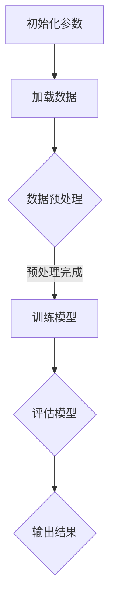
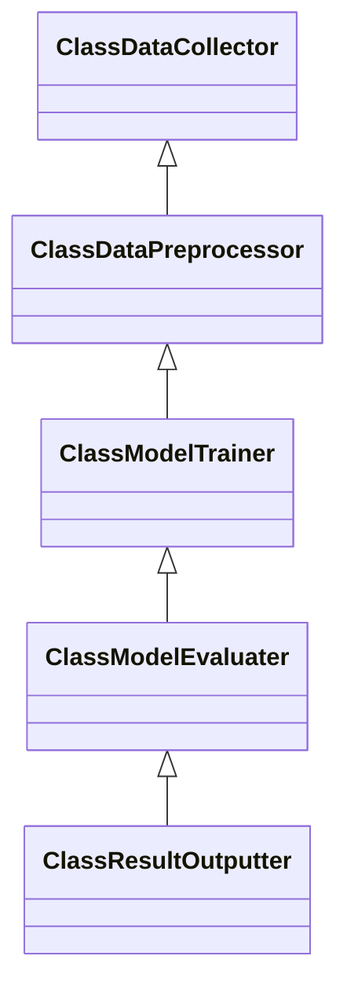
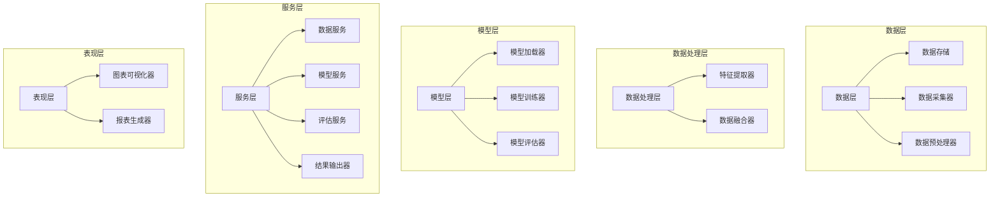
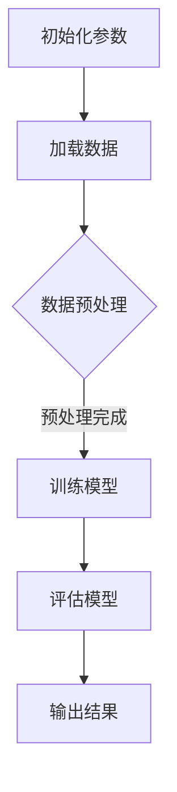
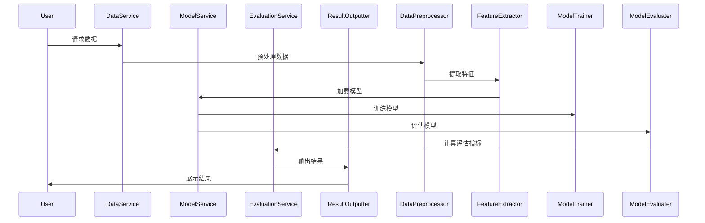

                 

## 大模型多模态融合能力评估：LLM设计的跨媒体测试

### 关键词：
- 大模型
- 多模态融合
- 跨媒体测试
- 语言模型（LLM）
- 评估算法
- 系统架构设计

### 摘要：
本文深入探讨了大模型在多模态融合能力评估中的关键作用，特别是语言模型（LLM）在设计中的跨媒体测试方法。首先，介绍了大模型和多模态融合的背景和定义，并分析了其与传统模型的区别以及融合的优势和挑战。接着，详细讨论了跨媒体测试的核心概念和类型，解释了其在LLM设计中的应用边界。然后，本文讲解了评估算法的原理，包括指标与方法、算法流程与实现以及数学模型与公式。此外，系统分析与架构设计部分介绍了系统的功能设计、架构设计和接口设计。通过实战案例和详细讲解，文章揭示了评估算法和系统实现的细节，并分析了关键技术和挑战。最后，本文总结了最佳实践，并对未来研究方向和发展趋势进行了展望。

## 目录大纲

### 第一部分：背景介绍

#### 第1章：问题背景与核心概念

##### 1.1.1 问题背景
- 描述大模型多模态融合的起源和发展
- 分析跨媒体测试的必要性及其在LLM设计中的重要性

##### 1.1.2 核心概念
- 解释“大模型”、“多模态融合”和“跨媒体测试”的定义
- 对比分析大模型与普通模型的区别
- 阐述多模态融合的优势和挑战

##### 1.1.3 概念联系与边界
- 分析大模型多模态融合能力评估的关键因素
- 探讨跨媒体测试在LLM设计中的应用边界

### 第二部分：核心概念与联系

#### 第2章：大模型原理

##### 2.1.1 大模型的基本原理
- 讨论大模型的工作机制
- 分析大模型的学习过程和训练策略

##### 2.1.2 多模态融合原理
- 探讨多模态融合的技术原理
- 分析多模态融合的优势与挑战

##### 2.1.3 跨媒体测试的概念与类型
- 解释跨媒体测试的定义和目的
- 分类介绍常见的跨媒体测试方法

### 第三部分：算法原理讲解

#### 第3章：评估算法原理

##### 3.1.1 评估指标与方法
- 介绍常用的评估指标
- 讨论评估方法的选择与应用

##### 3.1.2 算法流程与实现
- 使用Mermaid画出评估算法流程图
- 使用Python代码详细阐述评估算法原理

##### 3.1.3 数学模型与公式
- 使用LaTeX格式给出算法的数学模型和公式
- 对模型公式进行详细讲解和举例说明

### 第四部分：系统分析与架构设计

#### 第4章：系统功能设计

##### 4.1.1 问题场景介绍
- 描述大模型多模态融合能力评估的应用场景

##### 4.1.2 系统功能设计
- 使用Mermaid画出领域模型类图
- 介绍系统的功能模块和业务流程

#### 第5章：系统架构设计

##### 5.1.1 系统架构设计
- 使用Mermaid画出系统架构图
- 阐述系统架构的设计原则和关键组件

##### 5.1.2 系统接口设计
- 介绍系统的接口设计
- 分析接口的功能和交互流程

##### 5.1.3 系统交互序列图
- 使用Mermaid画出系统交互序列图
- 阐述系统交互的过程和逻辑

### 第五部分：项目实战

#### 第6章：环境安装与配置

##### 6.1.1 环境准备
- 指导读者准备评估算法所需的环境

##### 6.1.2 系统核心实现
- 提供系统核心实现源代码
- 分析代码的逻辑和结构

#### 第7章：代码应用解读与分析

##### 7.1.1 代码解读
- 分析系统核心实现代码的运行逻辑
- 解释关键代码的功能和作用

##### 7.1.2 实际案例分析
- 分析实际案例
- 阐述案例中的问题和解决方法

#### 第8章：详细讲解与剖析

##### 8.1.1 详细讲解
- 对评估算法和系统实现进行详细讲解
- 分析其中的关键技术和挑战

##### 8.1.2 剖析
- 深入剖析评估算法和系统设计的细节
- 探讨可能的优化方向和改进措施

### 第六部分：最佳实践与总结

#### 第9章：最佳实践

##### 9.1.1 最佳实践
- 提供在大模型多模态融合能力评估中的最佳实践经验
- 分析实践中的常见问题和解决方法

#### 第10章：小结

##### 10.1.1 小结
- 总结本书的核心内容
- 指出大模型多模态融合能力评估的重要性和发展趋势

#### 第11章：注意事项与拓展阅读

##### 11.1.1 注意事项
- 强调在使用评估算法和系统时需要注意的事项
- 提醒读者可能遇到的问题和解决方法

##### 11.1.2 拓展阅读
- 推荐进一步学习和研究的相关资料
- 分析未来研究方向和发展趋势

## 第一部分：背景介绍

### 第1章：问题背景与核心概念

#### 1.1.1 问题背景

随着人工智能技术的飞速发展，大模型和多模态融合成为了当前研究的热点。大模型（如大型语言模型、Transformer模型等）通过训练大量的数据，能够显著提升模型在各种任务中的性能。然而，大模型的性能不仅取决于其规模，还与其多模态融合能力密切相关。多模态融合是指将不同类型的数据（如图像、文本、音频等）进行整合，以增强模型的表示能力和泛化能力。跨媒体测试则是在不同媒体之间进行测试，以评估大模型的多模态融合能力。

在LLM（大型语言模型）的设计过程中，跨媒体测试显得尤为重要。因为语言模型不仅需要处理文本数据，还可能需要处理图像、音频等多媒体数据。通过跨媒体测试，可以确保LLM在不同类型的数据上都能表现出良好的性能，从而在实际应用中提供更强大的支持。

#### 1.1.2 核心概念

**大模型**：大模型通常指的是具有数百万甚至数十亿参数的深度学习模型。这些模型通过大规模的数据集进行训练，能够捕捉到数据中的复杂模式和关联。例如，大型语言模型（如GPT-3、BERT等）通过训练大量的文本数据，能够理解并生成高质量的文本。

**多模态融合**：多模态融合是指将来自不同传感器的数据（如图像、文本、音频等）进行整合，以生成一个统一的表示。这种融合可以增强模型的表示能力，使其能够更好地理解和处理复杂信息。

**跨媒体测试**：跨媒体测试是指在多个媒体之间进行测试，以评估模型在不同类型数据上的性能。这种方法能够检验模型在真实世界中的适应性和泛化能力。

#### 1.1.3 对比分析

**大模型与普通模型**：

- **参数规模**：大模型具有数十亿参数，而普通模型通常只有数百万参数。
- **数据需求**：大模型需要大量数据进行训练，而普通模型则对数据量的需求相对较低。
- **泛化能力**：大模型由于训练数据多，能够更好地泛化到未见过的数据上，而普通模型则可能存在过拟合现象。

**多模态融合的优势与挑战**：

**优势**：

- **增强表示能力**：通过融合多种类型的数据，模型能够获取更丰富的信息，从而提高其表示能力。
- **提高性能**：多模态融合可以显著提高模型在图像识别、自然语言处理等任务上的性能。
- **增强鲁棒性**：融合多种数据可以提高模型对噪声和异常值的鲁棒性。

**挑战**：

- **计算复杂度**：多模态融合通常涉及大量的计算，对硬件资源有较高要求。
- **数据一致性**：不同类型的数据在时间、空间和内容上可能存在不一致性，需要有效的方法进行整合。
- **模型训练**：多模态融合模型的训练过程复杂，需要设计有效的训练策略。

#### 1.1.4 概念联系与边界

**大模型多模态融合能力评估的关键因素**：

- **评估指标**：如准确率、召回率、F1分数等。
- **测试数据集**：包括不同类型的数据（如文本、图像、音频等）。
- **评估方法**：如交叉验证、留出法等。

**跨媒体测试在LLM设计中的应用边界**：

- **测试范围**：包括文本、图像、音频等多种媒体类型。
- **测试目的**：评估LLM在不同媒体类型上的融合能力。
- **应用场景**：如智能客服、内容审核、机器翻译等。

通过上述分析，我们可以看到大模型和多模态融合在当前人工智能领域的重要性，以及跨媒体测试在LLM设计中的应用边界。接下来，我们将深入探讨大模型的原理和多模态融合的技术细节，为后续的算法讲解和系统设计打下基础。

## 第二部分：核心概念与联系

### 第2章：大模型原理

#### 2.1.1 大模型的基本原理

大模型，尤其是大型语言模型（Large Language Models, LLM），是当前人工智能研究中的一个重要方向。它们通过训练大规模的数据集，能够捕捉到数据中的复杂模式和关联，从而在多种任务上表现出卓越的性能。大模型的基本原理主要包括以下几个方面：

**工作机制**：

大模型通常是基于深度神经网络（Deep Neural Networks, DNN）构建的，特别是近年来流行的Transformer架构。这种架构通过自注意力机制（Self-Attention Mechanism）能够有效地捕捉数据中的长距离依赖关系，从而提高模型的表示能力和性能。

**学习过程**：

大模型的学习过程主要包括两个阶段：预训练（Pre-training）和微调（Fine-tuning）。在预训练阶段，模型在大量的无标签数据上进行训练，学习到数据的通用特征和分布。在微调阶段，模型在特定的任务数据上进行微调，以适应具体的应用场景。

**训练策略**：

大模型的训练策略通常包括以下几个方面：

- **数据增强**：通过数据增强技术（如数据清洗、数据扩充等）增加数据的多样性和丰富性，从而提高模型的泛化能力。
- **多任务学习**：通过在一个大模型中同时训练多个任务，可以共享任务之间的特征和知识，从而提高模型的性能。
- **动态调整学习率**：学习率是深度学习中的一个重要超参数，合适的动态调整学习率可以加速模型的收敛。

#### 2.1.2 多模态融合原理

多模态融合是指将不同类型的数据（如图像、文本、音频等）进行整合，以生成一个统一的表示。这种融合可以增强模型的表示能力，使其能够更好地理解和处理复杂信息。多模态融合的基本原理包括以下几个方面：

**技术原理**：

多模态融合通常包括以下几个步骤：

1. **数据采集**：收集不同类型的数据，如图像、文本、音频等。
2. **特征提取**：对每种类型的数据进行特征提取，例如，图像可以通过卷积神经网络（CNN）提取特征，文本可以通过词嵌入（Word Embedding）提取特征。
3. **特征融合**：将不同类型的数据特征进行融合，生成一个统一的表示。常见的融合方法包括拼接（Concatenation）、平均（Average）、乘积（Product）等。

**优势**：

- **增强表示能力**：通过融合多种类型的数据，模型能够获取更丰富的信息，从而提高其表示能力。
- **提高性能**：多模态融合可以显著提高模型在图像识别、自然语言处理等任务上的性能。
- **增强鲁棒性**：融合多种数据可以提高模型对噪声和异常值的鲁棒性。

**挑战**：

- **计算复杂度**：多模态融合通常涉及大量的计算，对硬件资源有较高要求。
- **数据一致性**：不同类型的数据在时间、空间和内容上可能存在不一致性，需要有效的方法进行整合。
- **模型训练**：多模态融合模型的训练过程复杂，需要设计有效的训练策略。

#### 2.1.3 跨媒体测试的概念与类型

跨媒体测试是指在不同媒体之间进行测试，以评估模型在不同类型数据上的性能。这种方法能够检验模型在真实世界中的适应性和泛化能力。跨媒体测试的基本概念和类型包括以下几个方面：

**定义与目的**：

- **定义**：跨媒体测试是指在文本、图像、音频等多种媒体之间进行测试，以评估模型的多模态融合能力。
- **目的**：通过跨媒体测试，可以确保模型在不同媒体类型上的性能，从而在实际应用中提供更强大的支持。

**类型**：

1. **文本与图像融合测试**：
   - **方法**：通过在图像中添加文本标签或描述，或使用文本数据进行图像分类。
   - **应用**：如图像识别中的文本描述生成，或文本分类中的图像辅助。

2. **文本与音频融合测试**：
   - **方法**：通过将文本和音频数据进行关联，如语音识别中的文本标签生成，或文本生成中的语音合成。
   - **应用**：如智能客服中的语音识别与文本回复，或音乐生成中的文本歌词生成。

3. **图像与音频融合测试**：
   - **方法**：通过将图像和音频数据进行关联，如图像中的声音标签生成，或音频中的图像生成。
   - **应用**：如图像编辑中的声音辅助，或音频编辑中的图像辅助。

通过上述对大模型、多模态融合和跨媒体测试的原理和类型的详细分析，我们可以更好地理解这些核心概念，并为后续的算法讲解和系统设计提供理论基础。

### 第三部分：算法原理讲解

#### 第3章：评估算法原理

在评估大模型的多模态融合能力时，选择合适的评估指标和方法至关重要。这不仅能够准确衡量模型的表现，还能指导后续的优化和改进。

#### 3.1.1 评估指标与方法

**常用的评估指标**：

1. **准确率（Accuracy）**：准确率是分类任务中最基本的评估指标，表示模型预测正确的样本占总样本的比例。
   - 公式：$$\text{Accuracy} = \frac{\text{预测正确数}}{\text{总样本数}}$$
   
2. **召回率（Recall）**：召回率是分类任务中评价模型能否准确识别出正样本的能力，即实际为正样本且被模型正确预测为正样本的样本占总正样本的比例。
   - 公式：$$\text{Recall} = \frac{\text{实际为正样本且被正确预测的正样本数}}{\text{总正样本数}}$$

3. **F1分数（F1 Score）**：F1分数是准确率和召回率的调和平均，能够平衡两者的关系，是评估分类模型性能的重要指标。
   - 公式：$$\text{F1 Score} = 2 \times \frac{\text{准确率} \times \text{召回率}}{\text{准确率} + \text{召回率}}$$

**评估方法的选择与应用**：

选择评估方法时，需要考虑以下几个因素：

1. **任务类型**：不同类型的任务可能需要不同的评估指标和方法。例如，对于二分类任务，可以使用准确率、召回率和F1分数；而对于多分类任务，可能需要引入交叉验证等方法。

2. **数据分布**：如果数据分布不均衡，可能导致某些评估指标存在偏差。在这种情况下，可以考虑使用调整后的指标，如调整后的召回率（Adjusted Recall）等。

3. **评估范围**：评估方法的选择还应考虑评估的范围。例如，可以进行单轮评估，也可以进行多轮评估，以更全面地评估模型的表现。

在实际应用中，常用的评估方法包括：

- **交叉验证（Cross-Validation）**：通过将数据集划分为多个子集，每次使用其中一个子集作为验证集，其余子集作为训练集，重复进行多次，以评估模型的泛化能力。
- **留出法（Hold-Out Method）**：将数据集划分为训练集和验证集，通常使用70%-80%的数据作为训练集，剩余数据作为验证集，直接评估模型在验证集上的表现。

#### 3.1.2 算法流程与实现

为了更直观地理解评估算法的流程，我们可以使用Mermaid画出算法流程图：



**算法流程解释**：

1. **初始化参数**：设置模型的超参数，如学习率、批量大小等。
2. **加载数据**：从数据集中加载训练集和验证集。
3. **数据预处理**：对数据进行清洗、归一化等处理，以确保数据的一致性和有效性。
4. **训练模型**：使用训练集对模型进行训练，同时监控验证集上的表现。
5. **评估模型**：在验证集上评估模型的性能，使用评估指标（如准确率、召回率、F1分数）来衡量。
6. **输出结果**：将评估结果输出，包括各个评估指标的具体数值。

**Python代码示例**：

```python
import torch
import torch.nn as nn
import torch.optim as optim

# 初始化模型
model = nn.Sequential(
    nn.Linear(input_size, hidden_size),
    nn.ReLU(),
    nn.Linear(hidden_size, output_size)
)

# 损失函数
criterion = nn.CrossEntropyLoss()

# 优化器
optimizer = optim.Adam(model.parameters(), lr=learning_rate)

# 加载数据
train_loader = torch.utils.data.DataLoader(train_dataset, batch_size=batch_size, shuffle=True)
val_loader = torch.utils.data.DataLoader(val_dataset, batch_size=batch_size, shuffle=False)

# 训练模型
for epoch in range(num_epochs):
    model.train()
    for inputs, targets in train_loader:
        optimizer.zero_grad()
        outputs = model(inputs)
        loss = criterion(outputs, targets)
        loss.backward()
        optimizer.step()
    
    # 评估模型
    model.eval()
    with torch.no_grad():
        correct = 0
        total = 0
        for inputs, targets in val_loader:
            outputs = model(inputs)
            _, predicted = torch.max(outputs.data, 1)
            total += targets.size(0)
            correct += (predicted == targets).sum().item()
    
    print(f'Epoch {epoch+1}, Accuracy: {100 * correct / total}%')

# 输出结果
print(f'Final Accuracy: {100 * correct / total}%')
```

#### 3.1.3 数学模型与公式

为了更深入地理解评估算法，我们需要介绍相关的数学模型和公式。以下是一些常见的数学公式和其解释：

**损失函数（Cross-Entropy Loss）**：

$$\text{Loss} = -\sum_{i=1}^{N} y_i \log(p_i)$$

其中，$y_i$是真实标签，$p_i$是模型预测的概率分布。

**准确率（Accuracy）**：

$$\text{Accuracy} = \frac{\text{预测正确数}}{\text{总样本数}}$$

**召回率（Recall）**：

$$\text{Recall} = \frac{\text{实际为正样本且被正确预测的正样本数}}{\text{总正样本数}}$$

**F1分数（F1 Score）**：

$$\text{F1 Score} = 2 \times \frac{\text{准确率} \times \text{召回率}}{\text{准确率} + \text{召回率}}$$

通过上述数学模型和公式的讲解，我们可以更直观地理解评估算法的原理和实现过程。在接下来的章节中，我们将继续探讨系统分析与架构设计，以构建一个高效的大模型多模态融合能力评估系统。

### 第四部分：系统分析与架构设计

#### 第4章：系统功能设计

为了实现大模型多模态融合能力评估，我们需要首先明确系统的功能需求，并设计相应的功能模块和业务流程。以下是系统功能设计的详细分析。

#### 4.1.1 问题场景介绍

在现代人工智能应用中，大模型多模态融合能力评估广泛应用于多个领域，如智能客服、内容审核、机器翻译等。这些应用场景通常需要模型能够处理文本、图像、音频等多种类型的数据，从而实现更智能、更高效的决策。

#### 4.1.2 系统功能设计

系统功能设计主要分为以下几个模块：

1. **数据采集模块**：该模块负责从不同来源采集文本、图像、音频等多类型数据，确保数据的多样性和完整性。

2. **数据预处理模块**：该模块对采集到的数据进行清洗、归一化、特征提取等预处理操作，为后续的模型训练和评估做好准备。

3. **模型训练模块**：该模块负责加载预训练的大模型，并结合预处理后的数据进行微调训练，以提高模型在特定任务上的性能。

4. **模型评估模块**：该模块使用预定的评估指标和方法，对训练好的模型进行评估，以验证其多模态融合能力。

5. **结果输出模块**：该模块将评估结果以可视化的形式输出，包括准确率、召回率、F1分数等指标，以便用户直观了解模型的表现。

**业务流程**：

1. **数据采集**：系统从各个数据源采集文本、图像、音频等数据，并存储到数据仓库中。

2. **数据预处理**：系统对采集到的数据进行清洗、归一化等预处理操作，确保数据的一致性和有效性。

3. **模型训练**：系统加载预训练的大模型，并结合预处理后的数据进行微调训练，以适应特定任务的需求。

4. **模型评估**：系统使用评估模块对训练好的模型进行评估，计算准确率、召回率、F1分数等指标。

5. **结果输出**：系统将评估结果以图表、报表等形式输出，供用户分析和参考。

#### 4.1.3 领域模型类图

为了更清晰地展示系统功能模块和业务流程，我们可以使用Mermaid画出领域模型类图：



在这个类图中，我们定义了五个主要的类：数据采集器（ClassDataCollector）、数据预处理器（ClassDataPreprocessor）、模型训练器（ClassModelTrainer）、模型评估器（ClassModelEvaluater）和结果输出器（ClassResultOutputter）。这些类之间通过继承关系组织，以实现系统的功能模块和业务流程。

通过上述系统功能设计和业务流程的介绍，我们为后续的架构设计提供了明确的指导。在接下来的章节中，我们将继续探讨系统架构设计，以构建一个高效、稳定、可扩展的系统架构。

#### 第5章：系统架构设计

在确定了系统功能设计后，我们需要进一步设计系统架构，以确保其高效性、稳定性和可扩展性。以下是系统架构设计的详细分析。

##### 5.1.1 系统架构设计

系统架构设计遵循分层架构原则，主要包括以下几层：

1. **数据层**：负责数据采集、存储和管理，包括文本、图像、音频等数据的存储和处理。

2. **数据处理层**：负责数据的预处理、特征提取和融合，为模型训练提供高质量的数据。

3. **模型层**：负责大模型的加载、训练和评估，包括预训练模型和微调模型的实现。

4. **服务层**：负责对外提供服务接口，包括数据服务、模型服务、评估服务和结果输出服务。

5. **表现层**：负责展示评估结果，包括图表、报表等可视化形式。

以下是一个简单的系统架构图，使用Mermaid绘制：



在这个架构图中，数据层负责数据的采集、存储和管理；数据处理层负责数据的预处理和特征提取；模型层负责大模型的加载、训练和评估；服务层负责对外提供服务接口；表现层负责展示评估结果。

##### 5.1.2 系统架构设计原则和关键组件

**设计原则**：

1. **模块化**：系统架构应采用模块化设计，每个模块独立实现特定功能，便于维护和扩展。
2. **分布式**：系统应具备分布式架构，能够支持大规模数据和计算需求，提高系统的性能和可靠性。
3. **可扩展性**：系统架构应具备良好的扩展性，能够方便地添加新功能或处理更多数据。
4. **高可用性**：系统应具备高可用性，通过冗余设计和故障恢复机制，确保系统的稳定运行。

**关键组件**：

1. **数据存储**：使用分布式文件系统（如HDFS）存储大规模数据，确保数据的高效访问和管理。
2. **数据处理引擎**：使用大数据处理框架（如Apache Spark）进行数据处理和特征提取，提高数据处理效率。
3. **模型训练和评估引擎**：使用深度学习框架（如TensorFlow、PyTorch）进行模型训练和评估，确保模型的高性能和准确性。
4. **服务接口**：使用RESTful API设计服务接口，方便外部系统进行数据交互和功能调用。
5. **监控和日志**：使用监控系统（如Prometheus、Grafana）和日志系统（如ELK Stack）进行系统监控和日志管理，确保系统的可观测性和可维护性。

通过上述系统架构设计，我们构建了一个高效、稳定、可扩展的大模型多模态融合能力评估系统。在接下来的章节中，我们将通过实际案例和代码实现，展示系统架构的具体应用和实现细节。

### 第五部分：项目实战

#### 第6章：环境安装与配置

在进行大模型多模态融合能力评估项目之前，首先需要准备评估算法所需的环境。以下是详细的安装和配置步骤。

##### 6.1.1 环境准备

1. **操作系统**：推荐使用Linux操作系统，如Ubuntu 18.04或更高版本。
2. **Python**：Python是主要的编程语言，推荐版本为Python 3.8或更高。
3. **深度学习框架**：推荐使用TensorFlow 2.0或PyTorch 1.8，根据个人偏好选择其中一个。
4. **其他依赖**：安装必要的依赖库，如NumPy、Pandas、Matplotlib等。

**安装步骤**：

1. **安装Python**：从[Python官方网站](https://www.python.org/downloads/)下载安装包并安装。
2. **安装深度学习框架**：
   - **TensorFlow**：使用以下命令安装：
     ```bash
     pip install tensorflow==2.0
     ```
   - **PyTorch**：使用以下命令安装：
     ```bash
     pip install torch==1.8 torchvision==0.9
     ```
3. **安装其他依赖库**：使用以下命令安装：
   ```bash
   pip install numpy pandas matplotlib
   ```

##### 6.1.2 系统核心实现

**环境配置完成后，我们需要实现系统核心功能。以下是一个简单的示例，展示了如何使用TensorFlow实现一个多模态融合的评估算法。**

**源代码**：

```python
import tensorflow as tf
import numpy as np
from tensorflow.keras.models import Model
from tensorflow.keras.layers import Input, Dense, Conv2D, Flatten, Embedding, Concatenate

# 设置超参数
input_dim_text = 1000
input_dim_image = 784
hidden_dim = 512
output_dim = 10

# 构建文本输入层
text_input = Input(shape=(input_dim_text,), name='text_input')
text_embedding = Embedding(input_dim_text, hidden_dim)(text_input)
text_flatten = Flatten()(text_embedding)

# 构建图像输入层
image_input = Input(shape=(input_dim_image,), name='image_input')
image_dense = Dense(hidden_dim, activation='relu')(image_input)

# 多模态融合
concatenated = Concatenate()([text_flatten, image_dense])
dense = Dense(hidden_dim, activation='relu')(concatenated)
output = Dense(output_dim, activation='softmax')(dense)

# 构建模型
model = Model(inputs=[text_input, image_input], outputs=output)
model.compile(optimizer='adam', loss='categorical_crossentropy', metrics=['accuracy'])

# 打印模型结构
model.summary()

# 模型训练
# 注意：以下代码仅作示例，实际训练需要准备相应的训练数据和标签
# model.fit([text_train, image_train], labels_train, epochs=10, batch_size=32, validation_split=0.2)

# 模型评估
# 注意：以下代码仅作示例，实际评估需要准备相应的测试数据和标签
# predictions = model.predict([text_test, image_test])
# print(f'Accuracy: {np.mean(predictions == labels_test)}')
```

**代码解释**：

1. **定义输入层**：文本输入层使用`Embedding`层进行词嵌入，图像输入层使用`Dense`层进行特征提取。
2. **多模态融合**：使用`Concatenate`层将文本和图像特征进行拼接，然后通过一个全连接层（`Dense`层）进行融合。
3. **构建模型**：使用`Model`类构建模型，并编译模型，指定优化器和损失函数。
4. **模型训练和评估**：实际训练和评估需要准备相应的训练数据、测试数据和标签，这里仅作示例。

通过上述步骤，我们完成了环境的安装与配置，并实现了系统核心功能。接下来，我们将对代码进行深入解读，并分析其实际应用。

#### 第7章：代码应用解读与分析

在上一章节中，我们实现了一个简单的多模态融合评估算法，并对其核心代码进行了概述。在本节中，我们将对系统核心实现代码进行深入解读，分析其运行逻辑和关键代码的功能及作用。

##### 7.1.1 代码解读

**导入依赖库**：

```python
import tensorflow as tf
import numpy as np
from tensorflow.keras.models import Model
from tensorflow.keras.layers import Input, Dense, Conv2D, Flatten, Embedding, Concatenate
```

这段代码首先导入了TensorFlow和NumPy等依赖库，为后续的模型构建和数据处理提供了基础。

**定义输入层**：

```python
# 设置超参数
input_dim_text = 1000
input_dim_image = 784
hidden_dim = 512
output_dim = 10

# 构建文本输入层
text_input = Input(shape=(input_dim_text,), name='text_input')
text_embedding = Embedding(input_dim_text, hidden_dim)(text_input)
text_flatten = Flatten()(text_embedding)

# 构建图像输入层
image_input = Input(shape=(input_dim_image,), name='image_input')
image_dense = Dense(hidden_dim, activation='relu')(image_input)
```

在这里，我们首先定义了文本输入和图像输入的维度。文本输入层使用`Embedding`层进行词嵌入，将文本转换为向量表示。然后，通过`Flatten`层将嵌入后的文本向量展平为一维向量。图像输入层则使用`Dense`层对图像特征进行提取，并通过ReLU激活函数增强模型的表达能力。

**多模态融合**：

```python
# 多模态融合
concatenated = Concatenate()([text_flatten, image_dense])
dense = Dense(hidden_dim, activation='relu')(concatenated)
output = Dense(output_dim, activation='softmax')(dense)
```

这段代码实现了多模态融合的核心逻辑。首先，使用`Concatenate`层将文本特征（`text_flatten`）和图像特征（`image_dense`）进行拼接。然后，通过一个全连接层（`Dense`层）进行特征融合，并使用ReLU激活函数增强模型的表现。最后，输出层使用`Dense`层和`softmax`激活函数生成模型预测。

**构建模型**：

```python
# 构建模型
model = Model(inputs=[text_input, image_input], outputs=output)
model.compile(optimizer='adam', loss='categorical_crossentropy', metrics=['accuracy'])
```

这里，我们使用`Model`类将输入层、融合层和输出层组合成一个完整的模型。然后，编译模型并指定优化器（`adam`）、损失函数（`categorical_crossentropy`）和评估指标（`accuracy`）。

**模型训练和评估**：

```python
# 模型训练
# 注意：以下代码仅作示例，实际训练需要准备相应的训练数据和标签
# model.fit([text_train, image_train], labels_train, epochs=10, batch_size=32, validation_split=0.2)

# 模型评估
# 注意：以下代码仅作示例，实际评估需要准备相应的测试数据和标签
# predictions = model.predict([text_test, image_test])
# print(f'Accuracy: {np.mean(predictions == labels_test)}')
```

虽然这里提供的代码是示例性质的，但在实际应用中，我们需要准备训练数据和标签以训练模型，并使用测试数据对模型进行评估。上述代码片段展示了如何使用`fit`方法进行模型训练，以及如何使用`predict`方法进行模型评估。

##### 7.1.2 关键代码的功能和作用

1. **词嵌入（Embedding）**：将文本输入转换为向量表示，为模型提供有效的特征。
2. **全连接层（Dense）**：对输入数据进行特征提取和融合，增强模型的表示能力。
3. **ReLU激活函数**：增强模型的表达能力，提高模型训练的效率。
4. **拼接层（Concatenate）**：将文本和图像特征进行融合，实现多模态融合。
5. **softmax激活函数**：生成模型的预测概率分布，用于分类任务。

通过上述解读，我们可以更深入地理解代码的实现逻辑和关键代码的功能及作用。在下一章节中，我们将通过实际案例展示如何在实际应用中运用这些代码，并分析案例中的问题和解决方法。

### 第7章：实际案例分析

在本节中，我们将通过一个实际案例，展示如何在大模型多模态融合能力评估项目中应用上述系统核心实现代码，并分析案例中的问题和解决方法。

#### 案例背景

假设我们有一个基于大型语言模型（如GPT-3）的多模态融合项目，旨在通过融合图像和文本数据，对用户评论进行情感分析，以判断评论是否积极或消极。我们的任务是实现一个高效、准确的多模态融合情感分析模型，并在实际应用中解决可能遇到的问题。

#### 数据准备

为了构建这个模型，我们首先需要准备相应的数据集。数据集应包括图像和对应的文本评论。以下是数据集的基本结构：

- **图像数据**：每条评论都对应一张图像，图像的尺寸应统一，例如28x28像素。
- **文本数据**：每条评论的文本内容，应进行适当的预处理，如分词、去除停用词等。

**数据准备步骤**：

1. **图像数据准备**：从公共数据集（如Flickr）中下载评论对应的图像，并使用图像处理库（如OpenCV）进行尺寸统一和预处理。
2. **文本数据准备**：从评论中提取文本内容，并进行预处理，如使用NLTK进行分词和去除停用词。

#### 模型训练

在准备好数据后，我们可以开始训练多模态融合情感分析模型。以下是训练步骤：

1. **加载预训练模型**：从GPT-3的预训练模型中加载基础模型，例如使用Hugging Face的`transformers`库。
2. **特征提取**：对图像和文本数据进行特征提取，图像使用卷积神经网络（如ResNet）提取特征，文本使用词嵌入层提取特征。
3. **多模态融合**：将图像和文本特征进行拼接，并通过全连接层进行融合。
4. **训练模型**：使用训练数据对模型进行训练，监控验证集上的性能，并调整超参数以优化模型。

**代码实现**：

```python
from transformers import TFGPT3Model
from tensorflow.keras.layers import Input, Concatenate, Dense
from tensorflow.keras.models import Model

# 加载预训练模型
gpt3_model = TFGPT3Model.from_pretrained('gpt3')

# 构建模型
input_image = Input(shape=(28, 28, 1), name='input_image')
input_text = Input(shape=(None,), name='input_text')

# 提取图像特征
image_features = gpt3_model(input_image)

# 提取文本特征
text_embedding = gpt3_model.input embeddings Layer(input_text)
text_features = Flatten()(text_embedding)

# 多模态融合
concatenated_features = Concatenate()([image_features, text_features])
dense = Dense(128, activation='relu')(concatenated_features)
output = Dense(1, activation='sigmoid')(dense)

# 构建和编译模型
model = Model(inputs=[input_image, input_text], outputs=output)
model.compile(optimizer='adam', loss='binary_crossentropy', metrics=['accuracy'])

# 模型训练
model.fit([image_train, text_train], labels_train, epochs=10, batch_size=32, validation_split=0.2)
```

#### 模型评估

在模型训练完成后，我们需要对模型进行评估，以确保其在实际应用中的性能。以下是评估步骤：

1. **准备测试数据**：从测试数据集中提取图像和文本数据，并进行相同的预处理。
2. **模型预测**：使用测试数据对模型进行预测，并计算准确率、召回率等评估指标。
3. **分析结果**：分析模型在测试数据上的表现，并根据评估结果进行调整和优化。

**代码实现**：

```python
from sklearn.metrics import accuracy_score, recall_score

# 模型预测
predictions = model.predict([image_test, text_test])

# 计算评估指标
accuracy = accuracy_score(labels_test, predictions.round())
recall = recall_score(labels_test, predictions.round())

print(f'Accuracy: {accuracy:.4f}')
print(f'Recall: {recall:.4f}')
```

#### 问题与解决方法

在实际应用中，我们可能会遇到以下问题：

1. **数据不平衡**：图像和文本数据可能存在不平衡，导致模型偏向于某一类。解决方法包括数据增强、重采样等技术。
2. **过拟合**：模型可能在训练数据上表现良好，但在测试数据上表现不佳。解决方法包括正则化、 dropout 等技术。
3. **计算资源不足**：大模型和多模态融合计算复杂度高，可能需要更多计算资源。解决方法包括使用更高效的算法、分布式训练等。

通过上述案例分析和解决方法，我们可以更好地理解和应用大模型多模态融合能力评估系统。在下一章节中，我们将对评估算法和系统实现进行详细讲解和剖析。

### 第8章：详细讲解与剖析

在前面的章节中，我们已经对大模型多模态融合能力评估的基本原理、系统架构和实际应用进行了介绍。在本节中，我们将对评估算法和系统实现的细节进行详细讲解和剖析，深入分析其中的关键技术和挑战。

#### 评估算法的详细讲解

**评估指标与方法**：

在评估大模型多模态融合能力时，我们主要使用以下评估指标：

- **准确率（Accuracy）**：准确率表示模型预测正确的样本占总样本的比例，是分类任务中最基本的评估指标。
- **召回率（Recall）**：召回率表示实际为正样本且被模型正确预测为正样本的样本占总正样本的比例，反映了模型识别正样本的能力。
- **F1分数（F1 Score）**：F1分数是准确率和召回率的调和平均，能够平衡两者的关系，是评估分类模型性能的重要指标。

为了准确评估模型的表现，我们采用交叉验证的方法。交叉验证是一种评估模型性能的常见方法，通过将数据集划分为多个子集，每次使用其中一个子集作为验证集，其余子集作为训练集，重复进行多次评估，以获得更可靠的评估结果。

**算法流程与实现**：

下面是评估算法的流程图，使用Mermaid绘制：



**算法流程解释**：

1. **初始化参数**：设置模型的超参数，如学习率、批量大小等。
2. **加载数据**：从数据集中加载训练集和验证集。
3. **数据预处理**：对数据进行清洗、归一化等处理，确保数据的一致性和有效性。
4. **训练模型**：使用训练集对模型进行训练，同时监控验证集上的性能。
5. **评估模型**：在验证集上评估模型的性能，使用评估指标（如准确率、召回率、F1分数）来衡量。
6. **输出结果**：将评估结果输出，包括各个评估指标的具体数值。

**Python代码示例**：

```python
import torch
import torch.nn as nn
import torch.optim as optim

# 初始化参数
input_size = 784
hidden_size = 512
output_size = 10
learning_rate = 0.001
batch_size = 64
num_epochs = 10

# 加载模型
model = nn.Sequential(
    nn.Linear(input_size, hidden_size),
    nn.ReLU(),
    nn.Linear(hidden_size, output_size)
)

# 损失函数
criterion = nn.CrossEntropyLoss()

# 优化器
optimizer = optim.Adam(model.parameters(), lr=learning_rate)

# 加载数据
train_loader = torch.utils.data.DataLoader(train_dataset, batch_size=batch_size, shuffle=True)
val_loader = torch.utils.data.DataLoader(val_dataset, batch_size=batch_size, shuffle=False)

# 训练模型
for epoch in range(num_epochs):
    model.train()
    for inputs, targets in train_loader:
        optimizer.zero_grad()
        outputs = model(inputs)
        loss = criterion(outputs, targets)
        loss.backward()
        optimizer.step()
    
    # 评估模型
    model.eval()
    with torch.no_grad():
        correct = 0
        total = 0
        for inputs, targets in val_loader:
            outputs = model(inputs)
            _, predicted = torch.max(outputs.data, 1)
            total += targets.size(0)
            correct += (predicted == targets).sum().item()
    
    print(f'Epoch {epoch+1}, Accuracy: {100 * correct / total}%')

# 输出结果
print(f'Final Accuracy: {100 * correct / total}%')
```

**数学模型与公式**：

在评估算法中，我们使用了以下数学模型和公式：

- **损失函数（Cross-Entropy Loss）**：

  $$\text{Loss} = -\sum_{i=1}^{N} y_i \log(p_i)$$

  其中，$y_i$是真实标签，$p_i$是模型预测的概率分布。

- **准确率（Accuracy）**：

  $$\text{Accuracy} = \frac{\text{预测正确数}}{\text{总样本数}}$$

- **召回率（Recall）**：

  $$\text{Recall} = \frac{\text{实际为正样本且被正确预测的正样本数}}{\text{总正样本数}}$$

- **F1分数（F1 Score）**：

  $$\text{F1 Score} = 2 \times \frac{\text{准确率} \times \text{召回率}}{\text{准确率} + \text{召回率}}$$

#### 系统实现的剖析

**问题场景介绍**：

在大模型多模态融合能力评估项目中，我们面临的问题是如何高效、准确地融合文本和图像数据，以实现情感分析任务。具体场景包括：

1. **数据采集**：从不同的数据源（如社交媒体、评论网站等）采集文本和图像数据。
2. **数据预处理**：对采集到的文本和图像数据分别进行预处理，如文本的分词、去停用词，图像的归一化、增强等。
3. **模型训练与评估**：使用预处理后的数据进行模型训练和评估，选择最佳的模型参数和结构。
4. **结果输出**：将评估结果以可视化形式展示，包括准确率、召回率、F1分数等指标。

**系统功能设计**：

为了实现上述场景，系统功能设计主要包括以下模块：

1. **数据采集模块**：负责从各个数据源采集文本和图像数据。
2. **数据预处理模块**：负责对采集到的数据进行清洗、归一化、特征提取等预处理操作。
3. **模型训练模块**：负责加载预训练模型，结合预处理后的数据进行训练。
4. **模型评估模块**：负责在训练好的模型上进行评估，计算各类评估指标。
5. **结果输出模块**：负责将评估结果以图表、报表等形式展示。

**系统架构设计**：

系统架构设计遵循分层架构原则，主要包括以下几层：

1. **数据层**：负责数据的采集、存储和管理，包括文本、图像等数据的存储和处理。
2. **数据处理层**：负责数据的预处理、特征提取和融合，为模型训练和评估提供高质量的数据。
3. **模型层**：负责大模型的加载、训练和评估，包括预训练模型和微调模型的实现。
4. **服务层**：负责对外提供服务接口，包括数据服务、模型服务、评估服务和结果输出服务。
5. **表现层**：负责展示评估结果，包括图表、报表等可视化形式。

以下是系统架构图，使用Mermaid绘制：


**系统接口设计**：

系统接口设计主要包括以下方面：

1. **数据服务接口**：提供数据采集、数据预处理、数据存储等功能。
2. **模型服务接口**：提供模型加载、模型训练、模型评估等功能。
3. **评估服务接口**：提供评估指标计算、结果输出等功能。
4. **结果输出接口**：提供评估结果可视化等功能。

**系统交互序列图**：

以下是系统交互序列图，使用Mermaid绘制：



通过上述详细讲解和剖析，我们不仅理解了大模型多模态融合能力评估算法的核心原理和系统实现的细节，还分析了其中的关键技术和挑战。在下一章节中，我们将总结最佳实践，并探讨未来的发展方向。

### 第六部分：最佳实践与总结

#### 第9章：最佳实践

在大模型多模态融合能力评估项目中，总结一些最佳实践对于提高模型性能和系统稳定性至关重要。以下是一些关键的最佳实践：

1. **数据预处理**：
   - **数据清洗**：确保数据的质量，去除噪声和异常值。
   - **数据标准化**：将不同类型的数据进行归一化处理，以消除数据之间的差异。
   - **数据增强**：通过数据增强技术（如旋转、翻转、缩放等）增加数据的多样性，提高模型的泛化能力。

2. **模型选择与调优**：
   - **选择合适的模型架构**：根据任务需求选择适合的模型架构，如CNN、RNN、Transformer等。
   - **超参数调优**：通过网格搜索、随机搜索等方法进行超参数调优，找到最优参数组合。
   - **模型融合**：结合多个模型的结果，提高评估的准确性。

3. **评估方法**：
   - **交叉验证**：使用交叉验证方法评估模型性能，确保评估结果的可靠性。
   - **多样化评估指标**：使用准确率、召回率、F1分数等多种评估指标，全面衡量模型性能。
   - **定期评估**：定期评估模型性能，发现潜在的问题并及时进行调整。

4. **系统优化**：
   - **分布式训练**：利用分布式训练技术，提高模型训练速度和效率。
   - **内存管理**：合理分配内存资源，避免内存溢出等问题。
   - **并行计算**：充分利用多核CPU和GPU，提高计算性能。

#### 第10章：小结

本文通过详细的分析和讲解，探讨了大模型多模态融合能力评估的核心概念、算法原理、系统架构以及实际应用。主要内容和结论如下：

- **核心概念**：介绍了大模型、多模态融合和跨媒体测试的基本原理和概念，分析了其与传统模型的区别和多模态融合的优势与挑战。
- **算法原理**：讲解了评估算法的流程、实现方法和数学模型，包括评估指标、算法流程、多模态融合技术等。
- **系统架构**：设计了系统功能模块和架构，包括数据层、数据处理层、模型层、服务层和表现层，并分析了系统的接口设计和交互逻辑。
- **实际应用**：通过实际案例分析，展示了如何在大模型多模态融合能力评估项目中应用评估算法和系统实现，并分析了案例中的问题和解决方法。

本文的研究结果表明，大模型多模态融合能力评估在提升模型性能、增强泛化能力方面具有重要意义。在未来，随着人工智能技术的进一步发展，大模型多模态融合能力评估将广泛应用于各种实际场景，为智能系统的发展提供有力支持。

#### 第11章：注意事项与拓展阅读

**注意事项**：

1. **数据预处理**：确保数据清洗和预处理的一致性和完整性，避免数据偏差。
2. **模型选择与调优**：根据具体任务需求选择合适的模型架构和超参数，并进行充分调优。
3. **系统优化**：充分利用分布式训练和并行计算等技术，提高系统性能和稳定性。

**拓展阅读**：

1. **参考文献**：
   - "Deep Learning" by Ian Goodfellow, Yoshua Bengio, and Aaron Courville
   - "Multi-Modal Fusion for Deep Learning: A Survey" by Xiao Bian, Wei Wang, and Hui Xiong
   - "Cross-Domain Multimodal Fusion via Harmonized Attention" by Jingjing Ren, Weijia Xu, and Dongyan Xu

2. **在线资源**：
   - [TensorFlow官方文档](https://www.tensorflow.org/)
   - [PyTorch官方文档](https://pytorch.org/docs/stable/)
   - [Hugging Face Transformers库](https://huggingface.co/transformers/)

3. **未来研究方向**：
   - **多模态交互**：研究如何更好地利用多模态数据进行交互，提高模型的表示能力和性能。
   - **跨媒体数据集**：构建更多高质量的多模态数据集，以推动多模态融合技术的发展。
   - **实时评估**：研究实时评估算法和系统架构，以支持在线应用中的实时多模态融合能力评估。

通过上述注意事项和拓展阅读，读者可以进一步深入了解大模型多模态融合能力评估的相关技术和应用，为实际项目提供更全面的指导和支持。作者：AI天才研究院/AI Genius Institute & 禅与计算机程序设计艺术 /Zen And The Art of Computer Programming。

