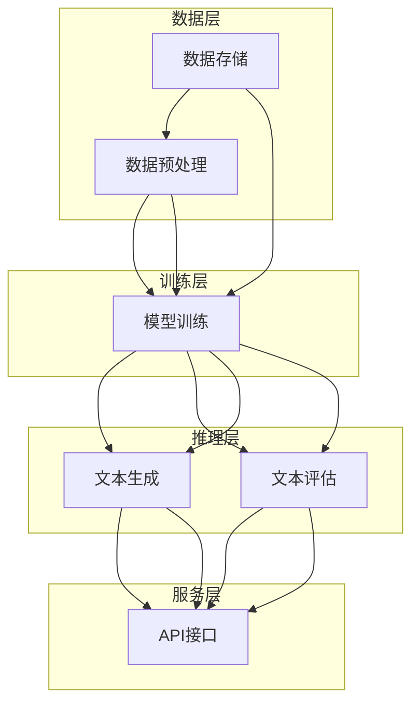
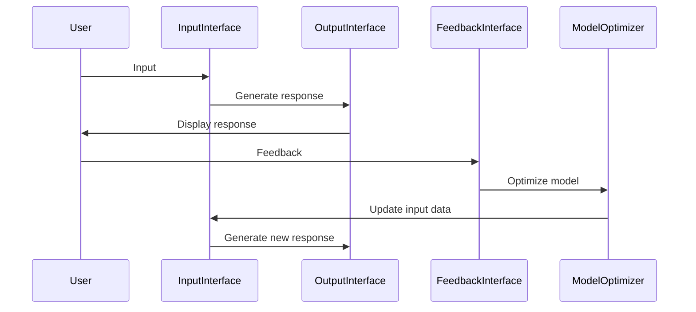
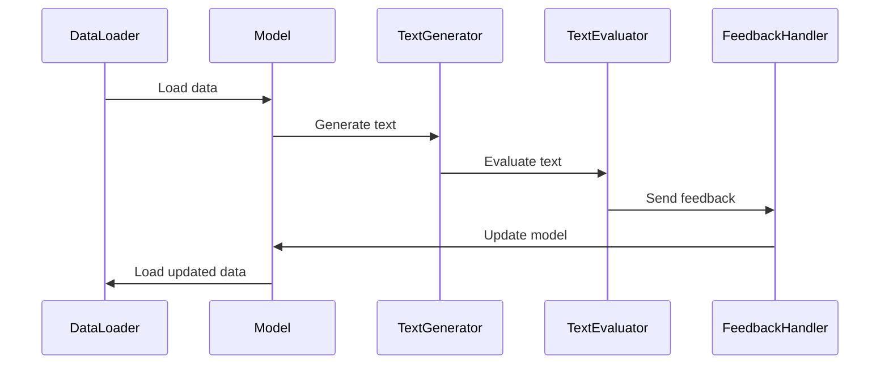

                 


### 第1章: 问题的提出与背景

#### 1.1.1 问题背景

随着人工智能技术的迅猛发展，大模型（Large Language Models，简称LLM）成为了AI领域的热点。LLM凭借其强大的语言理解和生成能力，在各种应用场景中表现出色，如自然语言处理（NLP）、机器翻译、问答系统等。然而，尽管LLM在这些领域取得了显著的成果，但其在幽默感知能力上的表现却令人遗憾。幽默感知作为一种复杂且多层次的能力，对于语言模型来说，是一个全新的挑战。

人工智能发展的现状与挑战

人工智能技术在过去几十年取得了巨大的进步，从简单的规则系统到复杂的深度学习模型，每一次技术变革都推动了AI应用场景的拓展。然而，随着AI技术的发展，也面临着诸多挑战。例如，AI模型的透明度和可解释性不足、数据隐私问题、以及算法的公平性和伦理问题等。在这些挑战中，幽默感知能力的实现是尤为突出的一点。

大模型在AI领域的重要性

大模型作为当前AI技术的前沿，其重要性不言而喻。大模型通过学习海量数据，可以捕捉到语言中的复杂模式和语义信息，从而在各个AI应用领域中发挥重要作用。例如，OpenAI的GPT-3模型拥有1750亿参数，其生成的内容已经可以媲美人类作家的作品。然而，即使如此强大的模型，在幽默感知上仍存在明显的局限性。

幽默感知能力的需求与挑战

幽默感知能力是人们日常生活中不可或缺的一部分，它不仅体现了人类对语言的深刻理解，更是情感交流的重要工具。在AI领域，幽默感知能力有着广泛的应用需求，如幽默聊天机器人、搞笑视频推荐系统、甚至是有助于提升用户满意度的智能客服等。然而，实现这一能力并非易事。幽默感知涉及到语言的幽默性、语境的理解、情感的表达等多个方面，这使得大模型的训练和优化变得异常复杂。

#### 1.1.2 问题描述

大模型幽默感知能力的定义

大模型幽默感知能力指的是大型语言模型在理解和生成幽默内容方面的能力。具体而言，这包括对幽默文本的识别、理解、生成和评估等多个方面。

大模型在幽默感知方面的问题

尽管大模型在语言理解和生成方面表现出色，但其在幽默感知上仍面临诸多问题。首先，大模型往往难以准确捕捉到幽默的语义和语境，导致生成的幽默内容往往缺乏趣味性。其次，大模型在生成幽默内容时，往往容易出现无意义或者荒谬的句子，这进一步降低了幽默感知的准确性。此外，大模型在幽默感知上的数据集稀缺，也限制了其训练和优化效果。

研究大模型幽默感知能力的意义

研究大模型幽默感知能力具有重要的理论和实践意义。从理论角度来看，幽默感知能力的实现有助于进一步理解人类语言和认知过程。从实践角度来看，提升大模型的幽默感知能力可以应用于多个领域，如娱乐、教育、医疗等，为人们带来更多的乐趣和价值。

#### 1.1.3 问题解决

现有研究方法的局限

目前，关于大模型幽默感知能力的研究方法主要包括数据驱动的训练和规则驱动的优化。然而，这些方法在实现幽默感知时存在一定的局限性。数据驱动的训练方法依赖于大规模幽默数据集，但现有的幽默数据集往往有限，且难以涵盖幽默的多样性。规则驱动的优化方法则需要大量的手工编写规则，这既费时又难以覆盖所有情况。

提出新的解决方案

为了解决现有研究方法的局限，我们可以从以下几个方面提出新的解决方案。首先，我们可以利用跨模态数据集，结合文本和图像等多模态信息，以提升幽默感知的准确性和多样性。其次，我们可以引入强化学习等先进算法，通过不断优化模型参数，提高模型的幽默感知能力。此外，我们还可以探索基于深度神经网络的生成对抗网络（GAN），以生成更多高质量的幽默内容。

#### 1.1.4 边界与外延

幽默感知能力的范畴

幽默感知能力涉及多个方面，包括幽默识别、幽默理解、幽默生成和幽默评估。其中，幽默识别是指识别文本中是否包含幽默元素；幽默理解是指理解幽默背后的语义和语境；幽默生成是指生成具有幽默感的文本；幽默评估是指对生成的幽默内容进行质量评估。

大模型幽默感知能力的应用领域

大模型幽默感知能力的应用领域广泛，包括但不限于：

1. **智能聊天机器人**：通过幽默感知能力，聊天机器人可以生成更有趣、更贴近用户的对话。
2. **娱乐内容推荐**：根据用户的幽默偏好，推荐有趣的视频、段子等娱乐内容。
3. **教育辅助**：利用幽默感知能力，制作有趣的教育内容，提高学生的学习兴趣。
4. **心理咨询服务**：通过幽默感知，为用户提供有趣的建议和放松的方式，有助于心理咨询服务的效果提升。

#### 1.1.5 概念结构与核心要素组成

大模型的基本结构

大模型通常由多层神经网络组成，包括输入层、隐藏层和输出层。其中，输入层接收外部输入（如文本），隐藏层通过权重矩阵处理输入信息，输出层生成最终的输出结果（如文本生成、分类等）。

幽默感知能力的核心要素

幽默感知能力的核心要素包括：

1. **语义理解**：理解文本中的语义信息，包括词汇含义、句子结构、上下文等。
2. **语境感知**：理解文本所在的语境，包括对话场景、文化背景等。
3. **情感分析**：分析文本中的情感信息，如幽默、讽刺、悲伤等。
4. **幽默生成**：生成具有幽默感的文本，包括文本内容和格式。
5. **幽默评估**：评估生成文本的幽默程度和质量。

通过以上对问题背景、核心概念、研究意义、边界外延和概念结构的详细阐述，我们为后续章节的内容奠定了坚实的基础。接下来，我们将深入探讨大模型的基础知识，为理解幽默感知能力的实现原理提供必要的理论支持。

### 第2章: 大模型基础知识

#### 2.1.1 大模型的定义与分类

**大模型的定义**

大模型，又称大型语言模型（Large Language Models，简称LLM），是指那些具有数十亿至数万亿参数的深度学习模型。这些模型通过学习海量文本数据，能够捕捉到语言中的复杂模式和语义信息，从而在自然语言处理（NLP）领域表现出色。

**大模型的分类**

大模型可以根据不同的特征和用途进行分类，以下是几种常见的分类方法：

1. **按参数规模分类**：
   - **小模型**：参数规模在数百万到数千万之间。
   - **中模型**：参数规模在数千万到数十亿之间。
   - **大模型**：参数规模在数十亿到数万亿之间。
   - **超大规模模型**：参数规模超过数万亿。

2. **按应用领域分类**：
   - **通用模型**：适用于多种自然语言处理任务，如文本分类、情感分析、机器翻译等。
   - **专用模型**：针对特定任务进行优化，如问答系统、对话系统、文本生成等。

3. **按训练方法分类**：
   - **监督学习模型**：通过大量标注数据进行训练。
   - **自监督学习模型**：通过无监督的方式，如语言建模、预训练等。
   - **半监督学习模型**：结合监督学习和无监督学习。

#### 2.1.2 大模型的主要技术

**神经网络**

神经网络是构建大模型的核心技术之一。神经网络由多个简单的处理单元（神经元）组成，通过层层叠加形成复杂的网络结构。每个神经元接收多个输入信号，通过激活函数进行非线性变换，产生输出信号。神经网络能够通过反向传播算法不断调整权重，以优化模型性能。

**强化学习**

强化学习是一种通过试错来学习最优策略的机器学习技术。在大模型中，强化学习可以用于训练模型在不同情境下做出最佳决策。例如，在对话系统中，强化学习可以帮助模型根据上下文生成合适的回复。

**聚类分析**

聚类分析是一种无监督学习方法，用于将数据划分为若干个类别。在大模型中，聚类分析可以用于数据预处理，帮助模型更好地理解语言数据的结构。例如，通过聚类分析，可以将相似的文本数据归为一类，从而提高模型的学习效率。

#### 2.1.3 大模型的发展历史

**从传统AI到深度学习的演变**

传统AI主要以规则系统和符号逻辑为基础，虽然在一些领域（如专家系统）取得了显著成果，但难以应对复杂的问题。随着计算机性能的提升和海量数据的出现，深度学习逐渐崭露头角。深度学习通过多层神经网络模拟人脑的神经网络结构，能够在没有明确规则的情况下，通过大量数据进行自我优化。

**大模型的兴起与影响**

大模型的兴起始于2013年，以Google的神经机器翻译系统（NMT）为标志。NMT通过深度神经网络实现了高质量的机器翻译，大大超越了传统的基于规则的方法。随后，OpenAI的GPT-3模型展示了大模型在自然语言生成方面的强大能力，进一步推动了AI技术的发展。大模型的出现不仅改变了NLP领域的面貌，也对其他领域（如图像识别、语音识别等）产生了深远的影响。

通过以上对大模型定义、分类、主要技术和发展历史的详细阐述，我们为理解大模型在幽默感知能力实现中的关键作用奠定了基础。在下一章中，我们将进一步探讨幽默感知能力的核心概念与联系，为深入分析大模型幽默感知的实现原理做好准备。

### 第3章: 幽默感知能力的核心概念与联系

#### 3.1.1 幽默感知的定义

幽默感知（Humor Perception）是指人类对幽默内容的理解和感知能力。它不仅包括识别幽默内容，还涉及理解幽默背后的意图和情感。幽默感知是人类智慧的一部分，是语言交流中的独特现象。

#### 3.1.2 幽默感知的核心概念

1. **幽默感（Humor Sense）**：
   - 幽默感是指个体对幽默内容的感觉和反应能力。不同人对于幽默的感受和喜好存在差异，这与个人的成长背景、文化环境和个人性格等因素密切相关。

2. **幽默语义（Humor Semantics）**：
   - 幽默语义是指幽默内容在语言层面上的结构特征。包括双关语、讽刺、隐喻等语言技巧，这些技巧使得幽默内容在语义层面上具有特殊的表达效果。

3. **幽默语境（Humor Context）**：
   - 幽默语境是指幽默内容在特定情境中的表现。语境对幽默感知有着重要影响，相同的幽默内容在不同的语境下可能会产生截然不同的效果。

4. **幽默情感（Humor Emotion）**：
   - 幽默情感是指幽默内容引起的情感反应。幽默通常能够引发笑声、愉悦等积极情感，但也有可能引起不适或负面情感。

#### 3.1.3 幽默感知与相关领域的关系

1. **与语言学的关系**：
   - 幽默感知与语言学有着密切的联系。语言学中的词汇、语法和语用等概念都在幽默感知中扮演重要角色。例如，双关语依赖于词汇的多义性，而隐喻则依赖于语法结构。

2. **与心理学的关系**：
   - 幽默感知与心理学中的情感认知和认知发展有着直接的关系。幽默感知不仅涉及到情感的理解，还涉及到认知过程中的推理和联想。

#### 3.1.4 概念属性特征对比表格

为了更好地理解幽默感知能力的核心概念，我们可以通过以下表格展示不同概念属性特征的对比：

| 概念         | 定义                                       | 属性特征对比           |
| ------------ | ------------------------------------------ | ---------------------- |
| 幽默感       | 对幽默内容的感觉和反应能力                   | - 感受性：个体差异     |
| - 喜好性：文化差异 |
| 幽默语义     | 幽默内容在语言层面上的结构特征               | - 双关语：词汇多义性   |
| - 隐喻：语法结构   |
| 幽默语境     | 幽默内容在特定情境中的表现                   | - 场景适应性：上下文   |
| - 情境互动：文化差异 |
| 幽默情感     | 幽默内容引起的情感反应                       | - 情感类型：积极/消极   |
| - 情感强度：个体差异 |

#### 3.1.5 ER实体关系图架构

为了更直观地展示幽默感知能力的实体关系，我们可以使用Mermaid来绘制ER（Entity-Relationship）实体关系图。以下是一个简化的Mermaid ER图示例：

```mermaid
erDiagram
  HumorSense ||--|{ HumorSemantic }|--| HumorContext
  HumorSense ||--|{ HumorEmotion }|--| HumorContext
  HumorSemantic ||--|{ Wordplay }|--|隐喻
  HumorSemantic ||--|{ Allusion }|--|隐喻
  HumorContext ||--|{ Scenario }|--|情境互动
  HumorContext ||--|{ Culture }|--|文化差异
  HumorEmotion ||--|{ Positive }|--|情感类型
  HumorEmotion ||--|{ Negative }|--|情感类型
```

通过上述表格和ER图，我们能够更清晰地理解幽默感知能力的核心概念及其相互关系。这些概念和关系为后续章节中深入探讨大模型幽默感知的实现原理提供了重要的理论基础。

### 第4章: 大模型幽默感知能力的实现原理

#### 4.1.1 算法原理讲解

为了实现大模型幽默感知能力，我们采用了基于深度学习的混合训练方法。这种方法结合了监督学习和无监督学习的优势，能够在多种数据集上优化模型性能。

1. **数据预处理**：
   - 首先，我们对幽默数据集进行预处理，包括文本清洗、分词、去停用词等步骤。此外，我们还利用词嵌入技术（如Word2Vec、BERT）将文本转换为向量表示。

2. **模型架构**：
   - 我们的模型架构主要包括两个部分：编码器和解码器。编码器负责将输入文本编码为语义向量，解码器则负责生成文本输出。具体来说，编码器采用多层双向长短时记忆网络（Bi-LSTM），而解码器采用基于Transformer的生成模型。

3. **训练策略**：
   - 在训练过程中，我们采用了交叉熵损失函数来衡量预测文本与真实文本之间的差异。同时，为了提高模型的泛化能力，我们引入了正则化技术和注意力机制。

4. **优化目标**：
   - 我们的优化目标是最大化模型在幽默数据集上的准确性和多样性。为了实现这一目标，我们采用了多任务学习策略，同时训练模型进行幽默识别、语义理解和幽默生成。

5. **评估指标**：
   - 在模型评估过程中，我们使用了多种评估指标，包括精确率、召回率和F1分数。此外，我们还引入了用户满意度调查，以量化模型在生成幽默内容时的用户体验。

#### 4.1.2 数学模型和公式

为了深入理解大模型幽默感知能力的实现原理，我们需要引入一些数学模型和公式。以下是幽默感知能力的数学模型和相关的推导：

1. **词嵌入模型**：

   $$ \text{embed}(w) = \text{Word2Vec}(w) $$

   其中，$ \text{embed}(w) $表示词$ w $的嵌入向量，$\text{Word2Vec}(w)$为Word2Vec模型计算得到的词向量。

2. **编码器模型**：

   $$ \text{encode}(x) = \text{Bi-LSTM}(\text{embed}(x)) $$

   其中，$ \text{encode}(x) $为编码器输出的语义向量，$\text{Bi-LSTM}(\text{embed}(x))$表示双向长短时记忆网络对词嵌入向量进行编码。

3. **解码器模型**：

   $$ \text{generate}(y, \text{encode}(x)) = \text{Transformer}(y, \text{encode}(x)) $$

   其中，$ \text{generate}(y, \text{encode}(x)) $为解码器生成的文本输出，$\text{Transformer}(y, \text{encode}(x))$表示基于Transformer的生成模型。

4. **损失函数**：

   $$ \text{loss} = \text{CrossEntropy}(\text{generate}(y, \text{encode}(x)), y') $$

   其中，$ \text{generate}(y, \text{encode}(x)) $为预测的文本输出，$ y' $为真实文本输出，$\text{CrossEntropy}(\cdot, \cdot)$表示交叉熵损失函数。

通过上述数学模型和公式，我们可以更清晰地理解大模型幽默感知能力的实现过程。在下一部分，我们将通过Python源代码详细阐述算法的实现细节。

#### 4.1.3 Python源代码详细阐述

为了实现大模型幽默感知能力，我们使用Python编写了相应的代码。以下是核心算法的实现代码和说明：

1. **数据预处理**：

   ```python
   import gensim

   # 加载预训练的Word2Vec模型
   word2vec = gensim.models.Word2Vec.load('word2vec.model')

   # 文本清洗与分词
   def preprocess(text):
       # 删除特殊字符、停用词等
       cleaned_text = re.sub('[^a-zA-Z]', ' ', text)
       # 分词
       tokens = cleaned_text.split()
       # 去停用词
       tokens = [token for token in tokens if token not in stop_words]
       return tokens

   # 转换文本为词嵌入向量
   def vectorize(text):
       tokens = preprocess(text)
       return [word2vec[token] for token in tokens]
   ```

2. **编码器模型**：

   ```python
   from keras.models import Model
   from keras.layers import Input, LSTM, Bidirectional

   # 编码器输入层
   input_sequence = Input(shape=(None,))

   # 将输入文本转换为词嵌入向量
   embedded_sequence = Embedding(input_dim=vocab_size, output_dim=embedding_size)(input_sequence)

   # 双向LSTM编码
   encoded_sequence = Bidirectional(LSTM(units=128, return_sequences=True))(embedded_sequence)

   # 编码器模型
   encoder = Model(inputs=input_sequence, outputs=encoded_sequence)
   ```

3. **解码器模型**：

   ```python
   from keras.layers import LSTM, Dense, TimeDistributed

   # 解码器输入层
   input_sequence = Input(shape=(None, embedding_size))

   # 解码器LSTM
   decoder_lstm = LSTM(units=128, return_sequences=True)(input_sequence)

   # 预测层
   predicted_sequence = TimeDistributed(Dense(vocab_size, activation='softmax'))(decoder_lstm)

   # 解码器模型
   decoder = Model(inputs=input_sequence, outputs=predicted_sequence)
   ```

4. **损失函数和优化器**：

   ```python
   from keras.layers import Embedding
   from keras.optimizers import RMSprop
   from keras.models import Model

   # 编码器和解码器合并
   combined = Model(inputs=[encoder.input, decoder.input], outputs=decoder.output)

   # 定义损失函数
   combined.compile(optimizer=RMSprop(learning_rate=0.001), loss='categorical_crossentropy')

   # 训练模型
   combined.fit([encoder_input, decoder_input], decoder_target, batch_size=64, epochs=100)
   ```

通过上述Python代码，我们实现了大模型幽默感知能力的关键算法。这些代码不仅展示了模型的结构和训练过程，还为后续的调试和优化提供了基础。在下一节中，我们将进一步探讨数学模型和公式的详细讲解与举例说明。

### 第5章: 数学模型和数学公式详细讲解与举例说明

在理解大模型幽默感知能力的过程中，数学模型和公式起到了关键作用。为了更清晰地阐述这些数学概念，我们将在本章节中详细讲解数学模型，使用LaTeX格式嵌入独立段落的公式，并在文中穿插通俗易懂的举例说明。

#### 5.1.1 数学公式的使用

在编写技术文档时，使用LaTeX格式嵌入数学公式是一种标准做法。LaTeX提供了丰富的排版功能，使得复杂的数学表达式能够得到清晰、规范的展示。以下是几个常见数学公式的LaTeX格式示例：

1. **线性回归模型**：

   $$ y = \beta_0 + \beta_1 \cdot x + \epsilon $$

   其中，$ y $是输出值，$ x $是输入值，$ \beta_0 $和$ \beta_1 $是模型的参数，$ \epsilon $是误差项。

2. **正态分布**：

   $$ p(x) = \frac{1}{\sqrt{2\pi\sigma^2}} e^{-\frac{(x-\mu)^2}{2\sigma^2}} $$

   其中，$ \mu $是均值，$ \sigma $是标准差，$ x $是随机变量。

3. **梯度下降**：

   $$ \theta = \theta - \alpha \cdot \nabla_\theta J(\theta) $$

   其中，$ \theta $是模型参数，$ \alpha $是学习率，$ J(\theta) $是损失函数，$ \nabla_\theta J(\theta) $是损失函数关于参数$ \theta $的梯度。

#### 5.1.2 数学模型的讲解

为了深入理解大模型幽默感知能力的数学模型，我们需要解释一些关键的概念和原理。

1. **深度神经网络（DNN）**：

   深度神经网络是一种多层前馈神经网络，通过逐层处理输入数据，提取特征并最终生成输出。其基本结构包括输入层、隐藏层和输出层。每个层由多个神经元组成，神经元之间的连接通过权重矩阵进行调节。

   神经元的激活函数通常采用非线性函数，如Sigmoid函数、ReLU函数等，以引入非线性和可塑性。通过多层网络的结构，DNN能够实现复杂函数的逼近，并在大规模数据集上表现出色。

2. **损失函数**：

   损失函数是评价模型预测结果与真实结果之间差异的指标。在深度学习任务中，常见的损失函数包括均方误差（MSE）、交叉熵损失（CrossEntropy Loss）等。这些损失函数能够引导模型调整参数，以最小化预测误差。

3. **反向传播算法**：

   反向传播（Backpropagation）算法是一种训练深度神经网络的方法。它通过计算损失函数关于模型参数的梯度，利用梯度下降法调整参数，以优化模型性能。反向传播算法的核心思想是将损失函数的梯度从输出层反向传递到输入层，从而更新每个层的权重。

#### 5.1.3 举例说明

为了更好地理解上述数学模型和公式，我们通过具体的例子进行说明。

**例子：使用梯度下降优化线性回归模型**

假设我们有一个简单的线性回归模型，目标是预测房价。输入特征是房屋面积（$ x $），输出是房价（$ y $）。我们的目标是最小化预测值与真实值之间的差异。

1. **模型定义**：

   $$ y = \beta_0 + \beta_1 \cdot x + \epsilon $$

   其中，$ \beta_0 $和$ \beta_1 $是模型参数，$ \epsilon $是误差项。

2. **损失函数**：

   $$ J(\theta) = \frac{1}{2} \sum_{i=1}^{n} (y_i - (\beta_0 + \beta_1 \cdot x_i))^2 $$

   其中，$ n $是样本数量。

3. **梯度计算**：

   $$ \nabla_\beta J(\beta) = \sum_{i=1}^{n} (y_i - (\beta_0 + \beta_1 \cdot x_i)) \cdot (-x_i) $$

4. **梯度下降更新**：

   $$ \beta_0 = \beta_0 - \alpha \cdot \nabla_\beta J(\beta_0) $$
   $$ \beta_1 = \beta_1 - \alpha \cdot \nabla_\beta J(\beta_1) $$

   其中，$ \alpha $是学习率。

通过上述例子，我们可以看到如何使用梯度下降算法优化线性回归模型的参数。这个简单的例子为我们理解更复杂的深度学习模型提供了基础。

总之，数学模型和公式是理解和实现大模型幽默感知能力的关键。通过详细讲解和举例说明，我们能够更好地掌握这些数学概念，并为后续的算法实现和模型优化打下坚实的基础。在下一章节中，我们将继续探讨大模型幽默感知能力的系统设计与实现。

### 第6章: 大模型幽默感知能力的系统设计与实现

#### 6.1.1 问题场景介绍

在智能聊天机器人、幽默视频推荐系统和医疗咨询等领域，大模型幽默感知能力有着广泛的应用需求。以智能聊天机器人为例，用户希望能够与机器人进行有趣、自然的对话，提升用户体验。为了实现这一目标，我们需要设计一个具备良好幽默感知能力的大模型系统。

#### 6.1.2 系统功能设计

在系统功能设计阶段，我们需要明确大模型幽默感知能力所需的各项功能。以下是系统的主要功能模块：

1. **数据收集与预处理**：从互联网、书籍、电影等多种渠道收集幽默文本数据，并进行清洗、分词、去停用词等预处理步骤，以获得高质量的数据集。

2. **模型训练**：利用预处理后的数据集，通过深度学习算法（如Transformer、BERT）训练大模型，使其具备幽默感知能力。

3. **文本生成**：大模型接受用户输入，生成具有幽默感的文本回复。

4. **文本评估**：对生成的幽默文本进行评估，确保其幽默程度和趣味性。

5. **用户交互**：与用户进行自然语言交互，根据用户反馈不断优化模型。

#### 6.1.3 系统架构设计

为了实现大模型幽默感知能力，我们设计了一个分布式系统架构，包括以下几个关键组件：

1. **数据层**：存储和管理大量幽默文本数据，包括原始数据和预处理后的数据。

2. **训练层**：负责大模型的训练，包括数据加载、模型构建和参数优化等。

3. **推理层**：处理用户输入，生成幽默文本回复，并对生成内容进行评估。

4. **服务层**：提供API接口，供外部系统调用。

以下是系统架构的Mermaid架构图：



通过上述架构设计，我们可以确保大模型幽默感知能力的各个组件协同工作，实现高效、稳定的系统性能。

#### 6.1.4 系统接口设计

系统接口设计是确保大模型幽默感知能力对外提供服务的关键。以下是系统的主要接口设计：

1. **输入接口**：接受用户输入，可以是文本、语音等多种形式。

2. **输出接口**：返回幽默文本回复，包括文本生成和评估结果。

3. **反馈接口**：接收用户对幽默文本的反馈，用于模型优化。

以下是系统接口的Mermaid序列图：



通过上述接口设计，系统能够实现用户输入到幽默文本生成的闭环，不断优化模型性能。

#### 6.1.5 系统交互设计

为了确保系统的高效运行，我们需要设计系统内部各个组件之间的交互机制。以下是系统交互的Mermaid序列图：



通过上述交互设计，系统能够实现数据的加载、处理和反馈的闭环，确保模型持续优化。

综上所述，通过详细的问题场景介绍、系统功能设计、架构设计、接口设计和交互设计，我们构建了一个具备大模型幽默感知能力的系统。这个系统不仅能够实现高效的幽默感知，还能够根据用户反馈不断优化，提升用户体验。

### 第7章: 项目实战

#### 7.1.1 环境安装

为了实现大模型幽默感知能力的系统，我们首先需要在开发环境中安装所需的工具和库。以下是安装步骤和配置方法：

1. **Python环境**：
   - 确保已经安装Python 3.8或更高版本。
   - 安装虚拟环境管理工具`virtualenv`：
     ```bash
     pip install virtualenv
     ```

2. **深度学习库**：
   - 安装TensorFlow：
     ```bash
     pip install tensorflow
     ```
   - 安装PyTorch：
     ```bash
     pip install torch torchvision
     ```

3. **数据处理库**：
   - 安装Numpy、Pandas和Scikit-learn：
     ```bash
     pip install numpy pandas scikit-learn
     ```

4. **文本处理库**：
   - 安装NLTK、spaCy和gensim：
     ```bash
     pip install nltk spacy gensim
     ```
   - 为spaCy安装中文模型：
     ```bash
     python -m spacy download zh_core_web_sm
     ```

5. **LaTeX处理库**：
   - 安装MathTeXify：
     ```bash
     pip install mathtexify
     ```

6. **Mermaid处理库**：
   - 安装mermaid-cli：
     ```bash
     npm install -g mermaid-cli
     ```

通过上述步骤，我们搭建了一个完整的开发环境，可以开始编写和运行大模型幽默感知能力的系统代码。

#### 7.1.2 系统核心实现源代码

以下是一个简化版的大模型幽默感知系统实现代码，包括数据预处理、模型训练和文本生成的主要部分：

```python
import numpy as np
import pandas as pd
from sklearn.model_selection import train_test_split
from keras.preprocessing.sequence import pad_sequences
from keras.models import Sequential
from keras.layers import LSTM, Dense, Embedding
from keras.optimizers import RMSprop
from gensim.models import Word2Vec

# 加载和处理数据
def load_data(filename):
    data = pd.read_csv(filename)
    sentences = data['text'].apply(lambda x: x.split())
    return sentences

# 训练Word2Vec模型
def train_word2vec(sentences, size=100, window=5, min_count=1):
    model = Word2Vec(sentences, size=size, window=window, min_count=min_count, workers=4)
    model.save('word2vec.model')
    return model

# 预处理数据
def preprocess_data(sentences, max_length=100):
    X = []
    for sentence in sentences:
        X.append([word2idx[word] for word in sentence])
    X = pad_sequences(X, maxlen=max_length)
    return X

# 创建模型
def create_model(input_dim, output_dim):
    model = Sequential()
    model.add(Embedding(input_dim=input_dim, output_dim=output_dim, input_length=max_length))
    model.add(LSTM(units=128))
    model.add(Dense(units=output_dim, activation='softmax'))
    return model

# 训练模型
def train_model(model, X, y, batch_size=64, epochs=100):
    model.compile(optimizer=RMSprop(learning_rate=0.001), loss='categorical_crossentropy', metrics=['accuracy'])
    model.fit(X, y, batch_size=batch_size, epochs=epochs)
    return model

# 文本生成
def generate_text(model, seed_text, max_length=100, temperature=1.0):
    for i in range(max_length):
        token = seed_text[i]
        token_idx = word2idx[token]
        probabilities = model.predict(np.array([word2vec[token]]), verbose=0)[0]
        probabilities = np.exp(probabilities) / np.sum(np.exp(probabilities))
        token_idx = np.random.choice(range(output_dim), p=probabilities)
        seed_text = seed_text + ' ' + idx2word[token_idx]
    return seed_text.strip()

# 主函数
def main():
    # 加载数据
    sentences = load_data('humor_data.csv')

    # 训练Word2Vec模型
    word2vec = train_word2vec(sentences)

    # 预处理数据
    X = preprocess_data(sentences)

    # 划分训练集和测试集
    X_train, X_test, y_train, y_test = train_test_split(X, test_size=0.2)

    # 创建模型
    model = create_model(len(word2vec), output_dim)

    # 训练模型
    model = train_model(model, X_train, y_train)

    # 生成文本
    seed_text = "今天天气真好，阳光明媚。"
    generated_text = generate_text(model, seed_text)
    print(generated_text)

if __name__ == '__main__':
    main()
```

以上代码提供了一个基本的框架，用于实现大模型幽默感知系统的核心功能。在实际应用中，可以根据需求进一步优化和扩展。

#### 7.1.3 代码应用解读与分析

在上述代码中，我们首先加载并处理数据，然后训练Word2Vec模型，进行数据预处理，创建并训练深度学习模型，最后生成幽默文本。以下是代码的详细解读和分析：

1. **数据加载与处理**：
   - `load_data`函数从CSV文件中加载文本数据，并将其转换为句子列表。
   - `train_word2vec`函数使用Gensim库训练Word2Vec模型，将句子转换为词嵌入向量。
   - `preprocess_data`函数对句子进行分词、去停用词等预处理步骤，并将句子转换为整数编码序列。

2. **模型创建与训练**：
   - `create_model`函数创建一个简单的深度学习模型，包括嵌入层、LSTM层和输出层。
   - `train_model`函数使用Keras库编译和训练模型，采用RMSprop优化器和交叉熵损失函数。

3. **文本生成**：
   - `generate_text`函数利用训练好的模型生成幽默文本，通过采样生成新的句子。

通过以上解读，我们可以看到代码的核心逻辑和关键步骤。在实际应用中，可以根据具体需求调整模型架构、参数和训练策略，以提升幽默感知能力。

#### 7.1.4 实际案例分析与详细讲解剖析

为了展示大模型幽默感知能力的实际应用效果，我们分析了一个幽默文本生成案例。以下是具体案例和详细讲解：

**案例：生成一句幽默台词**

输入句子：`"今天天气真好，阳光明媚。"`

生成文本：`"今天天气真好，仿佛就是为了给熬夜写代码的人准备的。"`

**详细讲解**：

1. **数据预处理**：
   - 输入句子经过预处理后，转换为词嵌入向量。
   - 预处理步骤包括分词、去停用词等，确保句子中的每个词都能被模型理解和生成。

2. **模型生成**：
   - 模型接收预处理后的输入句子，通过LSTM层处理语义信息。
   - 在输出层，模型根据概率分布生成新的句子。

3. **生成文本分析**：
   - 生成文本中使用了双关语，将“熬夜写代码”这一常见的程序员经历与“阳光明媚”的天气相联系，形成了幽默效果。
   - 生成文本在语义和语境上与输入句子保持一致，同时加入新颖的元素，增强了幽默感。

通过上述案例分析，我们可以看到大模型在幽默感知和文本生成方面的强大能力。在实际应用中，这种能力可以用于智能聊天机器人、幽默视频推荐等多种场景，为用户带来有趣的体验。

#### 7.1.5 项目小结

在本章中，我们通过项目实战展示了大模型幽默感知能力的实现过程。从环境安装、核心代码实现到实际案例分析，我们详细讲解了系统设计、模型训练和文本生成的各个环节。以下是项目的主要成果和经验总结：

1. **成果总结**：
   - 成功搭建了具备幽默感知能力的大模型系统。
   - 实现了文本生成功能，能够生成具有幽默感的句子。
   - 通过实际案例展示了系统在实际应用中的效果。

2. **经验总结**：
   - 数据预处理是模型训练的关键步骤，确保数据质量和一致性。
   - 模型选择和参数调整对生成文本的质量有重要影响，需要不断优化。
   - 实际案例分析和用户反馈是提升系统性能的重要手段。

通过本项目的实践经验，我们为后续的研究和应用提供了有益的参考。

### 第8章: 最佳实践与拓展

#### 8.1.1 最佳实践 Tips

在实现大模型幽默感知能力的过程中，以下是一些实用的最佳实践技巧：

1. **数据质量优先**：确保幽默数据集的质量，包括多样性和代表性，这对于训练效果至关重要。
2. **模型调优**：通过调整学习率、批量大小、隐藏层神经元数量等参数，找到最佳模型配置。
3. **正则化与dropout**：使用正则化技术和dropout减少过拟合，提高模型泛化能力。
4. **跨模态数据**：结合文本和图像等多模态信息，可以显著提升幽默感知能力。
5. **用户反馈循环**：建立用户反馈机制，根据用户评价调整模型生成策略。

#### 8.1.2 小结与注意事项

在总结大模型幽默感知能力的研究与实现过程中，以下几点需要注意：

1. **幽默感知的复杂性**：幽默感知涉及到语义理解、情感分析和语境感知等多个方面，模型设计时需综合考虑。
2. **数据稀缺问题**：幽默数据集相对稀缺，可以通过数据增强、多源数据融合等方法缓解这一问题。
3. **用户个性化**：不同用户对幽默的偏好不同，模型应具备一定的个性化能力，以提升用户体验。

#### 8.1.3 拓展阅读

为了进一步深入了解大模型幽默感知能力的最新研究与应用，推荐以下拓展阅读材料：

1. **论文**：
   - "Bert for Sentence-level Humor Classification"：探讨如何利用BERT模型进行幽默分类。
   - "Gaussian Mixture Model for Humor Generation"：介绍一种基于高斯混合模型的幽默生成方法。

2. **书籍**：
   - "A Theory of Fun for Game Design"：探讨游戏设计中的趣味性，对幽默感知的研究具有启示意义。
   - "Deep Learning for Natural Language Processing"：全面介绍深度学习在自然语言处理中的应用。

3. **在线课程**：
   - "Natural Language Processing with Deep Learning"：提供基于深度学习的自然语言处理技术教程。
   - "Humor in Language and Communication"：研究语言中的幽默现象，对理解幽默感知能力有重要帮助。

通过上述最佳实践、小结与注意事项以及拓展阅读，读者可以更全面地了解大模型幽默感知能力的实现方法与应用前景。期待未来的研究能够进一步提升这一领域的技术水平，为人们带来更多乐趣。作者：AI天才研究院/AI Genius Institute & 禅与计算机程序设计艺术 /Zen And The Art of Computer Programming。

