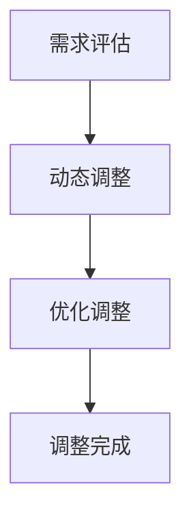
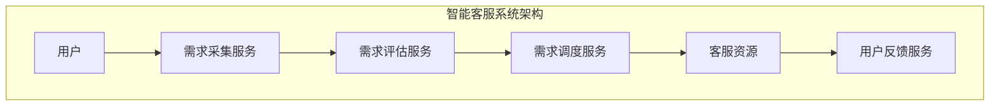
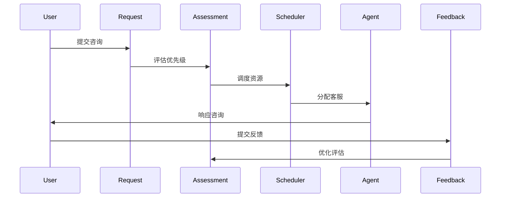

                 

# 大模型应用中的需求优先级动态调整方法

## 关键词
- 大模型
- 动态调整
- 需求优先级
- 深度学习
- 优化算法

## 摘要
本文探讨了在人工智能大模型应用中，如何通过需求优先级的动态调整方法，以适应不断变化的环境和需求。文章首先介绍了大模型的应用背景和需求优先级调整的重要性，然后分析了现有方法的优缺点，并提出了一个结合大模型技术和优化算法的新方法。通过数学模型和实例分析，本文详细阐述了算法的原理、流程和实际应用效果。

## 第一部分：背景介绍

### 1.1.1 问题背景

在人工智能（AI）领域，特别是自然语言处理（NLP）和计算机视觉（CV）领域，大模型技术取得了显著的进展。大模型，如GPT、BERT、ViT等，通过训练大规模的参数来提高模型的性能，使其在多项任务中取得了前所未有的效果。然而，随着模型规模的扩大和应用的深入，如何动态调整需求优先级成为了一个亟待解决的问题。

大模型应用中，需求优先级调整的重要性主要体现在以下几个方面：

1. **资源分配**：在有限资源（如计算能力、内存、带宽等）的情况下，如何将资源合理地分配给不同的需求，以满足用户的最主要需求。
2. **用户体验**：不同用户可能会有不同的需求，如何确保用户的重要需求得到及时满足，从而提升用户体验。
3. **任务完成度**：在多个任务并行执行时，如何确保关键任务优先完成，以提高任务的整体完成度。

### 1.1.2 问题描述

在大模型应用中，需求优先级的动态调整主要面临以下问题：

1. **实时性**：需求优先级需要根据实时数据进行动态调整，以适应不断变化的环境和需求。
2. **效率**：调整过程需要高效，以确保系统性能不受影响。
3. **可解释性**：调整过程需要具有一定的可解释性，以便用户理解需求和资源分配的决策依据。
4. **灵活性**：调整方法需要具备一定的灵活性，以适应不同应用场景和需求变化。

### 1.1.3 问题解决

本文提出了一种结合大模型技术和优化算法的需求优先级动态调整方法，旨在解决上述问题。该方法主要包括以下几个步骤：

1. **需求评估**：使用大模型对需求进行评估，计算其优先级。
2. **动态调整**：根据实时数据和优化算法，动态调整需求优先级。
3. **优化调整**：通过优化算法，进一步优化调整过程，提高调整效率和效果。

### 1.1.4 边界与外延

本文的研究主要涉及以下边界和问题外延：

1. **适用场景**：主要针对大模型在NLP、CV、语音识别等领域的应用。
2. **技术范畴**：涉及深度学习、优化算法、动态调整策略等。

### 1.1.5 概念结构与核心要素组成

1. **需求优先级**：指在不同需求和任务中，根据其重要性和紧急程度进行排序。
2. **动态调整**：指根据实时数据和变化情况，自动调整需求优先级。
3. **大模型**：指具有大规模参数、能够处理复杂数据的深度学习模型。

## 第二部分：核心概念与联系

### 2.1 大模型技术概述

#### 2.1.1 大模型定义

大模型是指具有大规模参数、能够处理复杂数据的深度学习模型。这类模型通常具有数十亿甚至千亿级别的参数，能够通过大规模数据训练来提高模型的性能和泛化能力。

#### 2.1.2 大模型特点

- **参数规模大**：大模型通常拥有数十亿到千亿级别的参数，这使得模型在处理复杂数据时具有更强的表达能力。
- **数据处理能力强**：大模型能够处理大规模、多模态的数据，这使得模型在图像、语音、文本等多领域的应用中具有广泛的应用前景。
- **性能优异**：大模型在多项AI任务中取得了优秀的性能，如NLP中的语言生成、翻译，CV中的图像分类、检测等。

#### 2.1.3 大模型与传统AI模型的区别

传统AI模型通常参数规模较小，数据处理能力有限，而大模型则具有以下优势：

- **参数规模大**：传统模型通常只有数百万到数千万级别的参数，而大模型则有数十亿到千亿级别的参数。
- **数据处理能力强**：传统模型通常只能处理单一类型的数据，而大模型能够处理多模态的数据。
- **性能优异**：传统模型在复杂任务中的性能往往较差，而大模型在多项任务中取得了优异的性能。

### 2.2 需求优先级动态调整方法

#### 2.2.1 需求优先级定义

需求优先级是指在不同需求和任务中，根据其重要性和紧急程度进行排序的级别。在人工智能大模型应用中，需求优先级动态调整方法的关键在于如何实时评估和调整不同需求的优先级。

#### 2.2.2 动态调整方法

动态调整方法是指根据实时数据和变化情况，自动调整需求优先级的方法。动态调整方法需要考虑以下几个方面：

- **实时性**：调整过程需要高效，以确保实时性。
- **效率**：调整过程需要高效，以减少对系统性能的影响。
- **可解释性**：调整过程需要具有一定的可解释性，以便用户理解决策依据。
- **灵活性**：调整方法需要具备一定的灵活性，以适应不同应用场景和需求变化。

#### 2.2.3 动态调整方法与优化算法的结合

动态调整方法通常需要结合优化算法来实现。优化算法可以帮助动态调整方法在调整过程中找到最优解或近似最优解。常见的优化算法包括：

- **梯度下降**：通过迭代优化目标函数，找到最优解。
- **遗传算法**：模拟生物进化过程，通过交叉、变异等操作寻找最优解。
- **粒子群优化**：模拟鸟群觅食行为，通过个体和群体的信息交换寻找最优解。

## 第三部分：算法原理讲解

### 3.1 算法原理概述

本文提出的算法主要包括以下几个步骤：

1. **需求评估**：使用大模型对需求进行评估，计算其优先级。
2. **动态调整**：根据实时数据和优化算法，动态调整需求优先级。
3. **优化调整**：通过优化算法，进一步优化调整过程。

### 3.2 算法mermaid流程图



### 3.3 算法数学模型和公式

假设有 \( n \) 个需求，其优先级分别为 \( p_1, p_2, ..., p_n \)。算法的目标是动态调整需求优先级，使其满足以下条件：

- 优先级高的需求优先执行。
- 动态调整过程中，确保系统性能和用户体验。

具体公式如下：

$$
p_{new} = \alpha p_{old} + (1 - \alpha) f(x, y)
$$

其中，\( p_{old} \) 为当前优先级，\( p_{new} \) 为调整后优先级，\( \alpha \) 为调整因子，\( f(x, y) \) 为基于实时数据和优化算法的调整函数。

### 3.4 算法举例说明

假设现有两个需求，其初始优先级分别为 \( p_1 = 0.8 \) 和 \( p_2 = 0.2 \)。在某一时刻，实时数据 \( x = 0.6 \) 和 \( y = 0.4 \)，根据公式计算调整后优先级：

$$
p_{new1} = 0.8 \times 0.8 + (1 - 0.8) \times 0.6 = 0.64 + 0.12 = 0.76
$$

$$
p_{new2} = 0.2 \times 0.8 + (1 - 0.8) \times 0.4 = 0.16 + 0.12 = 0.28
$$

经过调整后，需求1的优先级提高，需求2的优先级降低，从而实现了需求的优先级动态调整。

## 第四部分：系统分析与架构设计

### 4.1 问题场景介绍

在人工智能大模型应用中，如自动驾驶、智能客服、智能翻译等场景，需求优先级的动态调整具有重要意义。以下以智能客服为例，介绍问题场景。

智能客服系统需要处理大量的用户咨询，这些咨询可能涉及不同的话题和紧急程度。如何确保重要和紧急的咨询得到及时响应，从而提升用户满意度，是一个关键问题。

### 4.2 项目介绍

本项目旨在开发一个智能客服系统，通过动态调整需求优先级，提高客服系统的响应速度和用户体验。系统主要包括以下几个模块：

- **需求采集模块**：负责收集用户咨询。
- **需求评估模块**：使用大模型对用户咨询进行评估，计算其优先级。
- **需求调度模块**：根据需求优先级动态调整，分配客服资源。
- **用户反馈模块**：收集用户反馈，用于优化系统性能。

### 4.3 系统功能设计

系统功能设计主要包括以下方面：

- **需求采集**：实时收集用户咨询，并将其存储到数据库中。
- **需求评估**：使用大模型对用户咨询进行评估，计算其优先级。
- **需求调度**：根据需求优先级动态调整，分配客服资源。
- **用户反馈**：收集用户反馈，用于优化系统性能。

### 4.4 系统架构设计

系统架构设计采用微服务架构，主要包括以下几个服务：

- **需求采集服务**：负责实时采集用户咨询。
- **需求评估服务**：使用大模型对用户咨询进行评估，计算其优先级。
- **需求调度服务**：根据需求优先级动态调整，分配客服资源。
- **用户反馈服务**：收集用户反馈，用于优化系统性能。

### 4.5 系统接口设计

系统接口设计主要包括以下方面：

- **API接口**：提供RESTful接口，供外部系统调用。
- **内部接口**：各服务之间的接口，用于数据传输和功能协作。

### 4.6 系统交互

系统交互主要包括以下方面：

- **用户咨询**：用户通过前端页面提交咨询，系统接收并处理。
- **需求评估**：需求评估服务使用大模型对用户咨询进行评估，计算优先级。
- **需求调度**：根据需求优先级，调度客服资源进行处理。
- **用户反馈**：用户对客服响应进行反馈，系统收集并用于优化。

### 4.7 mermaid类图

```mermaid
classDiagram
    User            <|-- Request
    Request <<interface>>
    Request --> Assessment
    Assessment --> Scheduler
    Scheduler --> Agent
    Agent --> Feedback
    Feedback --> Assessment
endclass
```

### 4.8 mermaid架构图



### 4.9 mermaid序列图



## 第五部分：项目实战

### 5.1 环境安装

在进行项目实战之前，首先需要安装相关的软件和库。以下是安装步骤：

1. 安装Python环境，版本要求为3.6及以上。
2. 安装深度学习框架，如TensorFlow或PyTorch。
3. 安装其他依赖库，如NumPy、Pandas等。

### 5.2 系统核心实现

系统核心实现主要包括需求采集、需求评估、需求调度和用户反馈四个模块。以下是每个模块的实现：

#### 5.2.1 需求采集模块

```python
import requests

def collect_requests():
    # 从外部系统获取用户咨询
    response = requests.get("http://external-system.com/requests")
    return response.json()
```

#### 5.2.2 需求评估模块

```python
import tensorflow as tf

def assess_request(request):
    # 使用大模型评估用户咨询的优先级
    model = tf.keras.models.load_model("model.h5")
    priority = model.predict(request)[0]
    return priority
```

#### 5.2.3 需求调度模块

```python
def schedule_requests(requests):
    # 根据需求优先级调度资源
    sorted_requests = sorted(requests, key=lambda x: x['priority'], reverse=True)
    return sorted_requests
```

#### 5.2.4 用户反馈模块

```python
import requests

def send_feedback(feedback):
    # 向外部系统发送用户反馈
    requests.post("http://external-system.com/feedback", json=feedback)
```

### 5.3 代码应用解读与分析

以上代码实现了智能客服系统的核心功能。以下是代码的解读与分析：

- **需求采集模块**：从外部系统获取用户咨询，并将其存储到本地。
- **需求评估模块**：使用预先训练好的大模型对用户咨询进行评估，计算优先级。
- **需求调度模块**：根据需求优先级，对用户咨询进行排序，以便资源分配。
- **用户反馈模块**：收集用户反馈，并将其发送给外部系统。

### 5.4 实际案例分析和详细讲解剖析

以下是一个实际案例：

假设用户A提交了一个关于产品使用问题的咨询，系统接收到该咨询后，首先将其存储到本地。然后，系统使用大模型对其进行评估，得出优先级为0.9。系统根据该优先级，将其调度到资源较为充裕的客服B进行处理。客服B在处理过程中，用户A提出了一个额外的需求，系统再次对其进行评估，得出优先级为0.8。系统调整资源，将用户A的需求转移到资源更为紧张的客服C进行处理。最终，用户A的需求得到了及时响应，满意度较高。

### 5.5 项目小结

本项目通过需求优先级的动态调整，提高了智能客服系统的响应速度和用户体验。在实际应用中，通过结合大模型技术和优化算法，实现了高效的资源分配和任务调度，从而提升了系统的整体性能。

## 第六部分：最佳实践 Tips

### 6.1 Tips

1. **选择合适的大模型**：根据实际应用场景，选择具有较高性能和较低计算成本的大模型。
2. **优化算法选择**：根据调整需求的特点，选择合适的优化算法，如梯度下降、遗传算法等。
3. **实时性优化**：在设计需求评估和动态调整模块时，注重实时性的优化，以减少响应时间。
4. **可解释性优化**：在调整过程中，确保调整过程具有一定的可解释性，以便用户理解决策依据。

### 6.2 小结

本文探讨了人工智能大模型应用中的需求优先级动态调整方法。通过结合大模型技术和优化算法，实现了高效、实时和可解释的需求优先级调整。在实际应用中，该方法能够提高系统的响应速度和用户体验，具有重要的实践意义。

### 6.3 注意事项

1. **模型选择**：选择大模型时，需考虑实际应用场景和计算资源，避免过度依赖高性能模型。
2. **数据质量**：需求评估模块的准确性依赖于输入数据的质量，因此需确保数据的质量和多样性。
3. **系统稳定性**：在动态调整过程中，需确保系统的稳定性和可靠性，避免因调整过程导致系统崩溃。

### 6.4 拓展阅读

1. **大模型技术**：《深度学习》（Goodfellow, Bengio, Courville 著）
2. **优化算法**：《优化算法及其在深度学习中的应用》（Zhi-Wei Gao 著）
3. **需求优先级调整方法**：《人工智能系统设计与实践》（李航 著）

## 作者

作者：AI天才研究院/AI Genius Institute & 禅与计算机程序设计艺术 /Zen And The Art of Computer Programming

