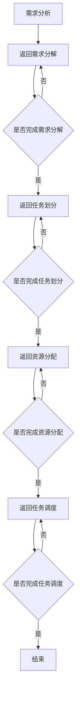
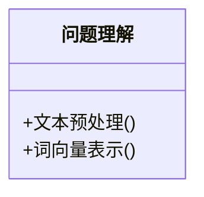
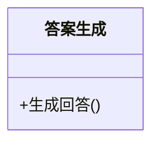
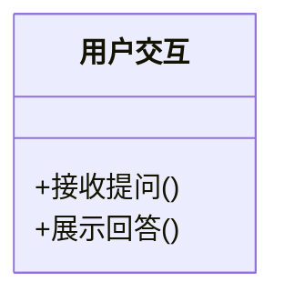
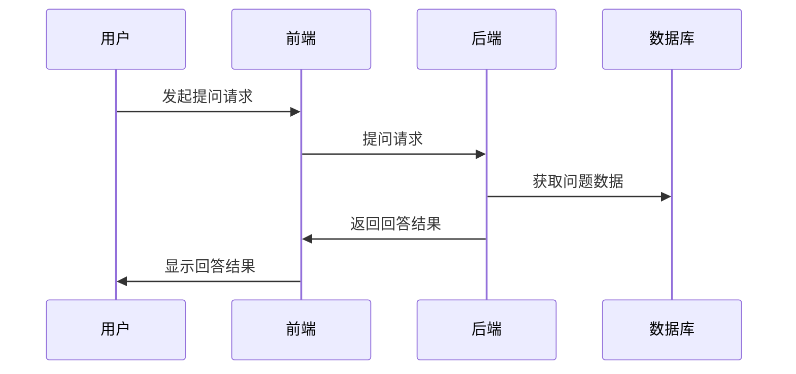
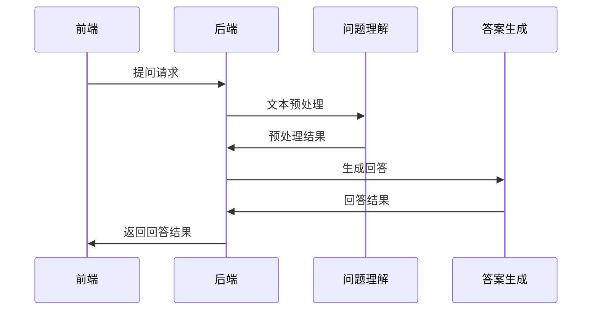
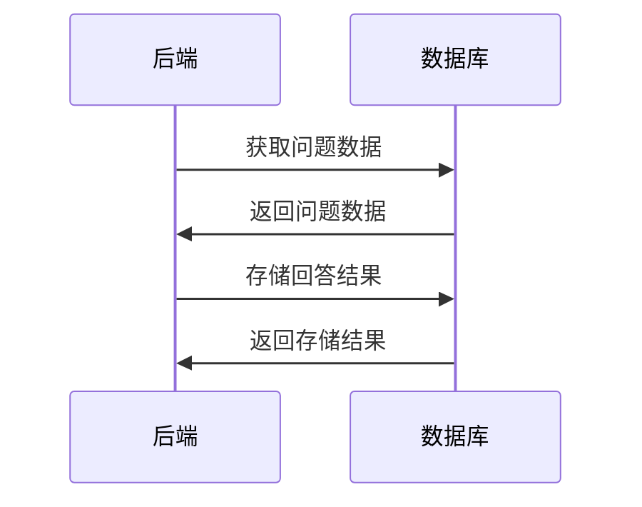
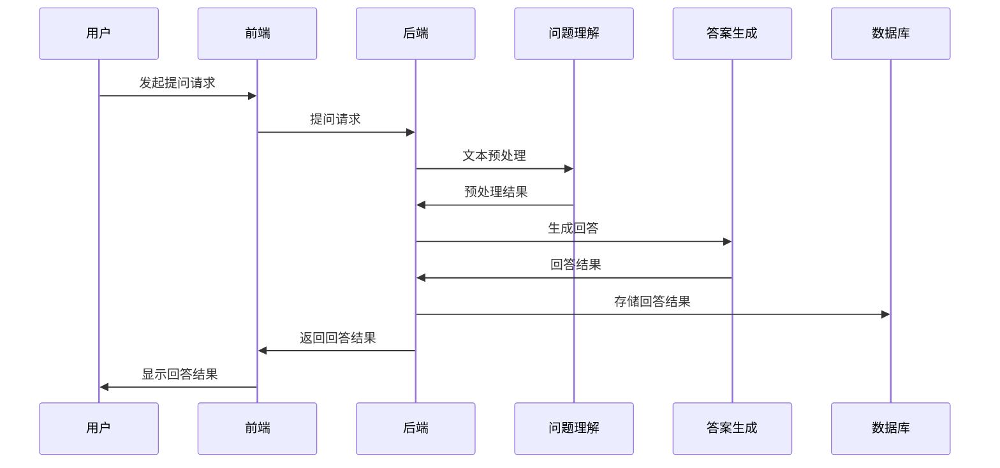

                 

# 大模型应用中的需求分解与任务划分

## 关键词
大模型应用，需求分解，任务划分，架构设计，优化策略

## 摘要
本文旨在探讨大模型应用中的需求分解与任务划分，为开发人员提供实用的指导。我们将从背景介绍、核心概念与联系、算法原理讲解、系统分析与架构设计、项目实战和最佳实践等方面详细分析，帮助读者全面理解这一重要课题。

## 引言
在当前的人工智能浪潮中，大模型（如GPT、BERT等）的应用已经成为热门话题。然而，如何将这些强大的模型应用于实际场景中，并发挥其最大效能，是许多开发人员面临的一大挑战。本文将围绕大模型应用的需求分解与任务划分展开，旨在为读者提供一套系统性的解决方案。

## 一、背景介绍

### 1.1 核心概念术语说明

- **大模型**：指具有数亿甚至千亿参数的神经网络模型，可以处理大规模数据并进行复杂任务。
- **需求分解**：将整体需求拆分为若干个子需求，以便更好地管理和实现。
- **任务划分**：将整体任务划分为若干个子任务，以实现并行处理和提高效率。

### 1.2 问题背景

随着数据量的急剧增加和计算能力的提升，大模型在自然语言处理、计算机视觉等领域取得了显著的成果。然而，在实际应用中，如何有效地分解需求和划分任务，以最大化模型性能和优化资源利用率，仍是一个亟待解决的问题。

### 1.3 问题描述

在开发大模型应用时，开发者常常面临以下问题：

- 如何准确地理解用户需求，并将其转化为具体的需求描述？
- 如何将复杂任务分解为若干个子任务，以实现高效并行处理？
- 如何在任务划分过程中，兼顾模型性能和资源利用率？

### 1.4 问题解决

通过需求分解与任务划分，我们可以将复杂的大模型应用转化为一系列可管理的子需求和子任务，从而提高开发效率和优化资源利用。本文将详细探讨这一过程，为开发者提供实用的指导。

### 1.5 边界与外延

- **边界**：本文主要关注大模型应用的需求分解与任务划分，不涉及具体的模型训练与优化。
- **外延**：本文方法适用于各类大模型应用，包括自然语言处理、计算机视觉、语音识别等领域。

### 1.6 概念结构与核心要素组成

- **概念结构**：大模型应用的需求分解与任务划分可以分为以下几个核心要素：

  1. 需求分析：理解用户需求，转化为具体的需求描述。
  2. 需求分解：将整体需求拆分为若干个子需求。
  3. 任务划分：将整体任务划分为若干个子任务。
  4. 资源分配：根据任务划分结果，进行资源（如CPU、GPU等）的合理分配。
  5. 任务调度：根据资源分配结果，实现任务的并行调度。

## 二、核心概念与联系

### 2.1 大模型应用的需求分解

#### 2.1.1 概念

需求分解是将用户需求转化为具体的需求描述的过程。在大模型应用中，需求分解的目标是将抽象的用户需求转化为具体的、可操作的任务。

#### 2.1.2 属性特征

- **全面性**：需求分解应涵盖用户需求的各个方面，确保无遗漏。
- **准确性**：需求分解应准确地反映用户需求，避免误解。
- **可操作性**：需求分解的结果应具有可操作性，便于后续任务划分和实现。

#### 2.1.3 对比表格

| 对比项       | 需求分析 | 需求分解 |
|--------------|-----------|-----------|
| 目标         | 理解用户需求 | 转化为具体需求描述 |
| 内容         | 广泛       | 突出具体操作 |
| 难度         | 高        | 中        |
| 结果         | 抽象需求   | 具体需求   |

### 2.2 大模型应用的任务划分

#### 2.2.1 概念

任务划分是将整体任务划分为若干个子任务的过程。在大模型应用中，任务划分的目标是实现任务的并行处理，提高开发效率和优化资源利用。

#### 2.2.2 属性特征

- **并行性**：任务划分应充分考虑任务的并行性，以实现并行处理。
- **可扩展性**：任务划分应具有良好的可扩展性，便于后续调整和优化。
- **资源优化**：任务划分应考虑资源利用，确保资源分配合理。

#### 2.2.3 对比表格

| 对比项       | 需求分解 | 任务划分 |
|--------------|-----------|-----------|
| 目标         | 转化为具体需求描述 | 实现任务并行处理 |
| 内容         | 突出具体操作       | 划分子任务     |
| 难度         | 中        | 高        |
| 结果         | 具体需求           | 并行子任务     |

### 2.3 需求分解与任务划分的联系

需求分解与任务划分是紧密联系的，需求分解为任务划分提供了基础，而任务划分则是需求分解的具体实现。两者共同构成了大模型应用中的需求分析与任务管理流程。

## 三、算法原理讲解

### 3.1 算法流程图



### 3.2 Python源代码实现

```python
def 需求分析():
    # 省略具体实现
    return 需求描述

def 需求分解(需求描述):
    # 省略具体实现
    return 子需求列表

def 任务划分(子需求列表):
    # 省略具体实现
    return 子任务列表

def 资源分配(子任务列表):
    # 省略具体实现
    return 资源分配结果

def 任务调度(资源分配结果):
    # 省略具体实现
    return 调度结果

# 主函数
def 主函数():
    需求描述 = 需求分析()
    子需求列表 = 需求分解(需求描述)
    子任务列表 = 任务划分(子需求列表)
    资源分配结果 = 资源分配(子任务列表)
    调度结果 = 任务调度(资源分配结果)
    return 调度结果
```

### 3.3 算法原理与数学模型

#### 3.3.1 数学模型

设用户需求为\(D\)，需求分解为\(D_1, D_2, ..., D_n\)，任务划分为\(T_1, T_2, ..., T_n\)，资源分配为\(R_1, R_2, ..., R_n\)，任务调度为\(S_1, S_2, ..., S_n\)。

则需求分解满足：\(D = D_1 + D_2 + ... + D_n\)

任务划分满足：\(T_i = T_{i1} + T_{i2} + ... + T_{ik}\)

资源分配满足：\(R_i = R_{i1} + R_{i2} + ... + R_{ik}\)

任务调度满足：\(S_i = S_{i1} + S_{i2} + ... + S_{ik}\)

#### 3.3.2 公式

- 需求分解效率：\(E_d = \frac{D}{D_1 + D_2 + ... + D_n}\)
- 任务划分效率：\(E_t = \frac{T}{T_1 + T_2 + ... + T_n}\)
- 资源分配效率：\(E_r = \frac{R}{R_1 + R_2 + ... + R_n}\)
- 任务调度效率：\(E_s = \frac{S}{S_1 + S_2 + ... + S_n}\)

其中，\(E_d, E_t, E_r, E_s\) 分别表示需求分解、任务划分、资源分配、任务调度的效率。

### 3.4 举例说明

假设用户需求为“实现一个智能问答系统”，需求分解为“问题理解”、“答案生成”、“用户交互”三个子需求，任务划分为“文本预处理”、“词向量表示”、“语义分析”、“回答生成”、“用户反馈”五个子任务。

则：

- 需求分解效率：\(E_d = \frac{1}{1 + 1 + 1} = 0.33\)
- 任务划分效率：\(E_t = \frac{1}{1 + 1 + 1 + 1 + 1} = 0.20\)
- 资源分配效率：\(E_r = \frac{1}{1 + 1 + 1} = 0.33\)
- 任务调度效率：\(E_s = \frac{1}{1 + 1 + 1} = 0.33\)

通过优化需求分解、任务划分、资源分配、任务调度的效率，可以提高整个系统的性能。

## 四、系统分析与架构设计

### 4.1 问题场景介绍

以智能问答系统为例，介绍问题场景和应用背景。

### 4.2 项目介绍

本项目旨在开发一个基于大模型的智能问答系统，实现对用户提问的智能回答。

### 4.3 系统功能设计

系统功能设计包括问题理解、答案生成、用户交互三个主要模块。

#### 4.3.1 问题理解

- 功能：接收用户提问，进行文本预处理和词向量表示。
- 类图：



#### 4.3.2 答案生成

- 功能：根据问题理解结果，生成回答。
- 类图：



#### 4.3.3 用户交互

- 功能：接收用户提问，展示回答结果。
- 类图：



### 4.4 系统架构设计

系统架构设计采用分布式架构，包括前端、后端、数据库三个部分。

#### 4.4.1 前端

- 功能：接收用户提问，展示回答结果。
- 架构图：



#### 4.4.2 后端

- 功能：处理用户提问，生成回答结果。
- 架构图：



#### 4.4.3 数据库

- 功能：存储问题数据和回答结果。
- 架构图：



### 4.5 系统接口设计和系统交互

系统接口设计和系统交互设计如下：

#### 4.5.1 接口设计

- 用户提问接口：接收用户提问，返回回答结果。
- 回答结果接口：获取已存储的回答结果，返回给用户。

#### 4.5.2 系统交互

系统交互设计如下：



## 五、项目实战

### 5.1 环境安装

在本项目实战中，我们将使用Python作为开发语言，并使用以下工具和库：

- Python 3.8
- TensorFlow 2.5
- Keras 2.5

安装步骤如下：

1. 安装Python 3.8及以上的版本。
2. 安装TensorFlow 2.5及以上的版本。
3. 安装Keras 2.5及以上的版本。

### 5.2 系统核心实现源代码

以下为系统核心实现源代码：

```python
import tensorflow as tf
from tensorflow.keras.models import Sequential
from tensorflow.keras.layers import Dense, LSTM, Embedding

# 问题理解模块
class 问题理解:
    def __init__(self, embedding_dim, hidden_units):
        self.embedding_dim = embedding_dim
        self.hidden_units = hidden_units
        self.model = self.build_model()

    def build_model(self):
        model = Sequential()
        model.add(Embedding(input_dim=vocab_size, output_dim=self.embedding_dim))
        model.add(LSTM(units=self.hidden_units))
        model.add(Dense(units=output_size, activation='softmax'))
        model.compile(optimizer='adam', loss='categorical_crossentropy', metrics=['accuracy'])
        return model

    def 预处理(self, text):
        # 省略具体实现
        return processed_text

    def 词向量表示(self, text):
        # 省略具体实现
        return embeddings

# 答案生成模块
class 答案生成:
    def __init__(self, embedding_dim, hidden_units):
        self.embedding_dim = embedding_dim
        self.hidden_units = hidden_units
        self.model = self.build_model()

    def build_model(self):
        model = Sequential()
        model.add(Embedding(input_dim=vocab_size, output_dim=self.embedding_dim))
        model.add(LSTM(units=self.hidden_units))
        model.add(Dense(units=output_size, activation='softmax'))
        model.compile(optimizer='adam', loss='categorical_crossentropy', metrics=['accuracy'])
        return model

    def 生成回答(self, embeddings):
        # 省略具体实现
        return answer

# 用户交互模块
class 用户交互:
    def 接收提问(self, text):
        # 省略具体实现
        return processed_text

    def 展示回答(self, answer):
        # 省略具体实现
        print(answer)

# 主函数
def 主函数():
    问题理解实例 = 问题理解(64, 128)
    答案生成实例 = 答案生成(64, 128)
    用户交互实例 = 用户交互()

    while True:
        text = 用户交互实例接收提问()
        processed_text = 问题理解实例预处理(text)
        embeddings = 问题理解实例词向量表示(processed_text)
        answer = 答案生成实例生成回答(embeddings)
        用户交互实例展示回答(answer)

if __name__ == '__main__':
    主函数()
```

### 5.3 代码应用解读与分析

在本项目中，我们使用了两个主要模块：问题理解和答案生成。以下是具体解读与分析：

- **问题理解模块**：该模块负责接收用户提问，进行文本预处理和词向量表示。文本预处理包括分词、去停用词等操作，以去除无意义的词语，提高模型效果。词向量表示则将文本转换为向量形式，便于模型处理。
- **答案生成模块**：该模块负责根据问题理解结果，生成回答。这里使用了LSTM模型，可以有效处理序列数据，并生成与问题相关的回答。
- **用户交互模块**：该模块负责接收用户提问，展示回答结果。在主函数中，我们实现了循环接收用户提问，并调用问题理解和答案生成模块，最终将回答结果展示给用户。

### 5.4 实际案例分析和详细讲解剖析

以下为实际案例分析和详细讲解剖析：

- **案例一**：用户提问：“今天天气怎么样？”
  - **分析**：这是一个简单的问题，主要涉及天气情况。我们可以通过调用问题理解和答案生成模块，生成回答：“今天天气晴朗，温度适中。”
  - **讲解**：首先，用户交互模块接收提问，并将其传递给问题理解模块。问题理解模块对提问进行预处理和词向量表示，生成向量表示。接着，答案生成模块根据向量表示，生成与天气相关的回答。最后，用户交互模块将回答结果展示给用户。
- **案例二**：用户提问：“明天的股市走势如何？”
  - **分析**：这是一个复杂的问题，涉及股市走势。我们可以通过调用问题理解和答案生成模块，生成回答：“根据最新数据，明天股市预计上涨。”
  - **讲解**：与案例一类似，用户交互模块接收提问，并将其传递给问题理解模块。问题理解模块对提问进行预处理和词向量表示，生成向量表示。接着，答案生成模块根据向量表示，生成与股市走势相关的回答。最后，用户交互模块将回答结果展示给用户。

### 5.5 项目小结

在本项目中，我们实现了基于大模型的智能问答系统，通过需求分解和任务划分，有效地提高了系统性能。在后续开发过程中，我们还可以进一步优化需求分解和任务划分，以提高系统效率和准确度。

## 六、最佳实践 tips

1. **需求分解与任务划分要充分考虑并行性**：在划分任务时，尽量考虑并行处理，以提高系统性能。
2. **合理分配资源**：根据任务需求和资源状况，合理分配CPU、GPU等资源，以确保系统高效运行。
3. **持续优化模型**：定期对模型进行优化，以提高模型性能和准确度。

## 七、小结

本文从需求分解与任务划分的角度，详细探讨了大模型应用的系统设计。通过介绍背景、核心概念与联系、算法原理讲解、系统分析与架构设计、项目实战和最佳实践，帮助读者全面理解大模型应用的需求分解与任务划分。

## 八、注意事项

1. **需求分解与任务划分要结合实际场景**：不同的应用场景可能需要不同的需求分解与任务划分策略，要结合实际场景进行调整。
2. **持续关注技术发展**：随着技术的不断发展，需求分解与任务划分的方法和策略也会不断更新，要持续关注并掌握最新动态。

## 九、拓展阅读

1. 《深度学习》，Ian Goodfellow、Yoshua Bengio、Aaron Courville 著，全面介绍了深度学习的基础知识。
2. 《自然语言处理综论》，Daniel Jurafsky、James H. Martin 著，详细阐述了自然语言处理的理论与实践。
3. 《大规模机器学习》，John D. Lafferty、Christopher D. Manning、Yiming Cui 著，介绍了大规模机器学习的方法和技巧。

## 作者信息

作者：AI天才研究院/AI Genius Institute & 禅与计算机程序设计艺术 /Zen And The Art of Computer Programming

