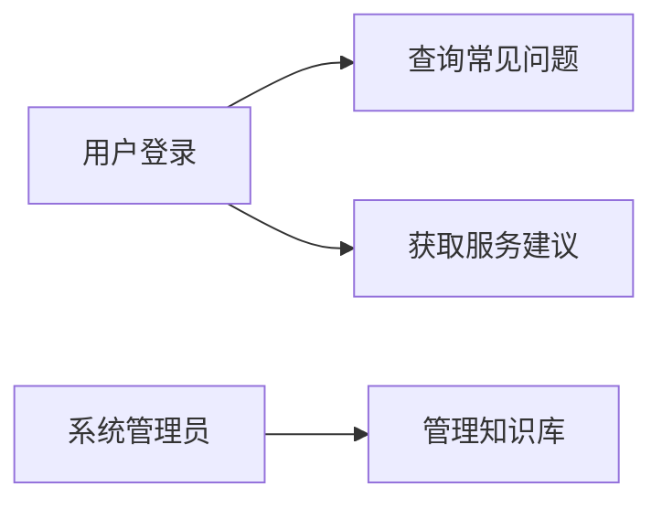
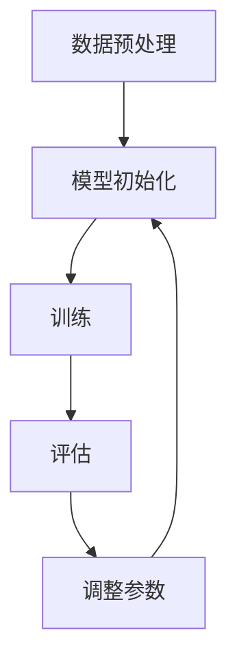
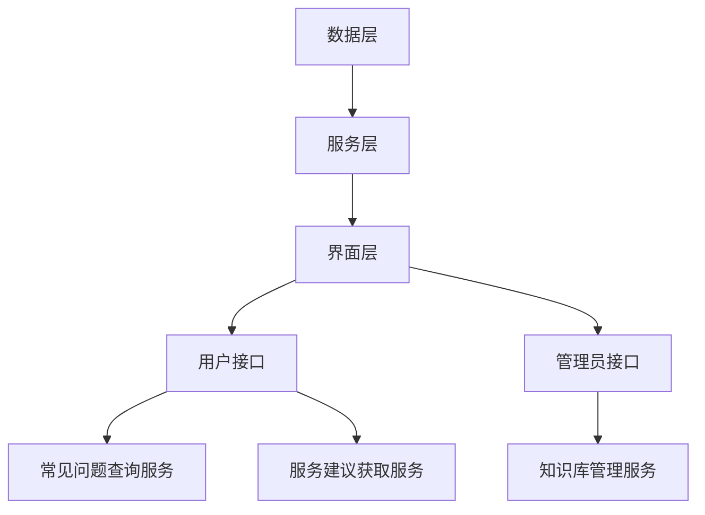
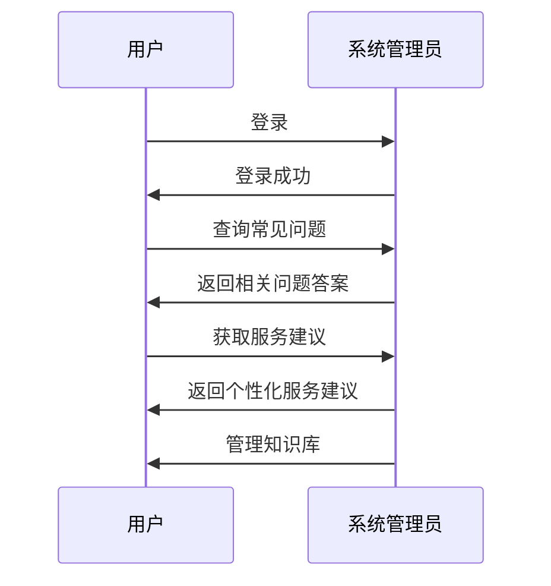

                 


# 大模型应用中的需求原型设计方法

关键词：大模型应用，需求原型设计，算法原理，系统架构，项目实战，最佳实践

摘要：本文将深入探讨大模型应用中的需求原型设计方法。通过对核心概念的介绍、算法原理的讲解、系统架构的分析以及项目实战的分享，旨在为读者提供全面、详细的需求原型设计指导，帮助其在实际应用中实现高效、精准的大模型应用。

## 目录

1. 引言
2. 核心概念与联系
   2.1 大模型应用的概念
   2.2 需求原型设计的方法
   2.3 概念关系图
3. 需求原型设计方法
   3.1 设计流程
   3.2 设计步骤
   3.3 案例分析
4. 算法原理讲解
   4.1 算法流程图
   4.2 Python源代码讲解
   4.3 数学模型与公式
   4.4 举例说明
5. 系统分析与架构设计
   5.1 问题场景介绍
   5.2 系统功能设计
   5.3 系统架构设计
   5.4 系统接口设计
   5.5 系统交互
6. 项目实战
   6.1 环境安装
   6.2 系统核心功能实现
   6.3 代码应用解读
   6.4 实际案例分析
   6.5 项目小结
7. 最佳实践与总结
   7.1 最佳实践技巧
   7.2 注意事项
   7.3 拓展阅读

## 引言

随着人工智能技术的快速发展，大模型应用在各行各业中得到了广泛应用。从自然语言处理到计算机视觉，从推荐系统到生成模型，大模型的应用不仅提高了系统的性能，还带来了全新的用户体验。然而，在大模型应用过程中，如何有效地进行需求原型设计，成为了决定项目成功与否的关键因素。

本文将从以下几个方面展开讨论：

1. **核心概念与联系**：介绍大模型应用和需求原型设计的关键概念，并通过ER实体关系图和概念属性特征对比表格，明确各概念之间的关系。
2. **需求原型设计方法**：详细讲解需求原型设计的基本流程和步骤，并通过案例进行分析。
3. **算法原理讲解**：通过算法流程图、Python源代码、数学模型与公式，深入阐述算法原理，并进行举例说明。
4. **系统分析与架构设计**：介绍系统功能设计、系统架构设计、系统接口设计以及系统交互过程。
5. **项目实战**：分享环境安装、系统核心功能实现、代码应用解读、实际案例分析以及项目小结。
6. **最佳实践与总结**：总结最佳实践技巧，提出注意事项，并提供拓展阅读建议。

通过本文的深入探讨，希望读者能够对大模型应用中的需求原型设计方法有更全面、更深入的理解，从而在实际项目中实现高效、精准的大模型应用。

## 核心概念与联系

在大模型应用中，理解核心概念和它们之间的联系是至关重要的。以下将介绍大模型应用和需求原型设计中的关键概念，并通过ER实体关系图和概念属性特征对比表格，展示它们之间的关系。

### 2.1 大模型应用的概念

1. **大模型**：指具备大规模参数、复杂结构和强大计算能力的机器学习模型。如Transformer、GPT等。
2. **数据集**：指用于训练和评估模型的输入数据集合。包括文本、图像、语音等。
3. **预处理**：指在训练模型前对数据进行清洗、归一化、编码等处理过程。
4. **训练**：指使用数据集对模型进行参数调整和优化，以提高模型性能。
5. **评估**：指使用验证集或测试集评估模型在未知数据上的表现。

### 2.2 需求原型设计的方法

1. **用户故事**：描述用户需求和使用场景，是需求原型设计的重要输入。
2. **用例图**：展示用户与系统之间的交互过程，用于描述系统功能。
3. **场景分析**：对用户故事进行详细分析，明确系统需要实现的功能。
4. **原型设计**：基于用户故事和场景分析，构建系统的初步模型。
5. **迭代优化**：在原型设计过程中，根据反馈进行多次迭代和优化。

### 概念关系图

以下是核心概念之间的ER实体关系图，展示它们之间的联系：

```mermaid
erDiagram
    数据集 ||--|> 大模型 : 被用于训练
    数据集 ||--|> 预处理 : 被预处理
    大模型 ||--|> 训练 : 被训练
    大模型 ||--|> 评估 : 被评估
    需求原型设计 ||--|> 用户故事 : 被驱动
    需求原型设计 ||--|> 用例图 : 被构建
    需求原型设计 ||--|> 场景分析 : 被分析
    需求原型设计 ||--|> 原型设计 : 被设计
    需求原型设计 ||--|> 迭代优化 : 被优化
```

### 概念属性特征对比表格

以下是核心概念属性特征对比表格，帮助读者更清晰地理解它们之间的差异和联系：

| 概念         | 属性特征                         | 联系                                       |
| ------------ | -------------------------------- | ------------------------------------------ |
| 大模型       | 大规模参数、复杂结构、强大计算能力 | 用于数据集训练，评估模型性能                 |
| 数据集       | 输入数据集合                     | 被用于大模型训练和评估，预处理               |
| 预处理       | 数据清洗、归一化、编码           | 对数据进行处理，提高训练和评估效果           |
| 训练         | 参数调整、优化                   | 使用数据集对大模型进行训练，提高模型性能     |
| 评估         | 性能评估、误差分析               | 使用验证集或测试集评估大模型在未知数据上的表现 |
| 需求原型设计 | 用户故事、用例图、场景分析       | 描述用户需求和使用场景，构建系统原型        |

通过以上核心概念与联系的介绍，读者可以更清晰地理解大模型应用和需求原型设计的基本框架，为后续章节的深入探讨打下基础。

### 需求原型设计方法

需求原型设计是确保大模型应用成功的关键步骤。它通过用户故事、用例图、场景分析、原型设计和迭代优化等环节，确保系统设计符合用户需求，同时具备可行性和可持续性。以下将详细讲解需求原型设计的基本流程和步骤。

#### 3.1 设计流程

需求原型设计的基本流程如下：

1. **用户故事收集**：通过访谈、问卷调查等方式，收集用户需求和使用场景。
2. **用例图绘制**：根据用户故事，绘制用例图，明确系统功能。
3. **场景分析**：对用户故事进行详细分析，明确系统需要实现的功能。
4. **原型设计**：基于用户故事和场景分析，构建系统的初步模型。
5. **迭代优化**：根据反馈进行多次迭代和优化，确保系统设计符合用户需求。

#### 3.2 设计步骤

1. **用户故事收集**

   用户故事是需求原型设计的起点。通过访谈、问卷调查等方式，收集用户的需求和使用场景。以下是几个典型的用户故事：

   - 用户故事1：用户希望系统能够快速识别并分类图像。
   - 用户故事2：用户希望系统能够生成高质量的文本摘要。
   - 用户故事3：用户希望系统能够提供个性化的推荐服务。

2. **用例图绘制**

   用例图是一种用于描述系统功能的图形化工具，通过展示用户与系统之间的交互过程，明确系统的功能需求。以下是一个用例图的示例：

   ```mermaid
   flowchart LR
       A[用户登录] --> B[查看图像分类]
       A --> C[生成文本摘要]
       A --> D[接收个性化推荐]
   ```

   在这个示例中，用户登录后可以进行查看图像分类、生成文本摘要和接收个性化推荐等操作。

3. **场景分析**

   场景分析是对用户故事进行详细分析，明确系统需要实现的功能。通过分析，可以确定系统的核心功能，并确定各功能之间的关系。以下是一个场景分析的示例：

   - 功能1：图像分类。用户上传图像，系统进行分类，并返回分类结果。
   - 功能2：文本摘要。用户输入文本，系统生成文本摘要，并返回摘要内容。
   - 功能3：个性化推荐。系统根据用户历史行为和偏好，推荐相关内容。

4. **原型设计**

   原型设计是基于用户故事和场景分析，构建系统的初步模型。通过原型设计，可以明确系统的界面布局、功能模块和交互流程。以下是一个原型设计的示例：

   - 界面布局：顶部导航栏、左侧菜单栏、右侧内容展示区域。
   - 功能模块：图像分类模块、文本摘要模块、个性化推荐模块。
   - 交互流程：用户登录后，可以选择图像分类、文本摘要或个性化推荐，系统根据用户选择，展示相关内容。

5. **迭代优化**

   迭代优化是需求原型设计的重要环节。根据用户反馈，对原型进行多次迭代和优化，确保系统设计符合用户需求。以下是一个迭代优化的示例：

   - 用户反馈1：图像分类结果不准确。针对这个问题，优化算法，提高分类准确率。
   - 用户反馈2：文本摘要长度不合适。调整文本摘要生成策略，确保摘要长度适中。
   - 用户反馈3：个性化推荐不够精准。改进推荐算法，提高推荐质量。

通过以上步骤，需求原型设计可以有效地确保系统设计符合用户需求，为后续的系统开发打下坚实基础。

#### 3.3 案例分析

以下是一个实际案例，通过用户故事、用例图、场景分析和原型设计，展示需求原型设计的过程。

**案例：智能客服系统**

**1. 用户故事收集**

- 用户故事1：用户希望系统能够快速识别并回答常见问题。
- 用户故事2：用户希望系统能够提供个性化的服务建议。

**2. 用例图绘制**



**3. 场景分析**

- 功能1：查询常见问题。用户输入问题关键词，系统返回相关问题的答案。
- 功能2：获取服务建议。系统根据用户历史行为和偏好，推荐相关服务。

**4. 原型设计**

- 界面布局：顶部导航栏、左侧菜单栏、右侧内容展示区域。
- 功能模块：常见问题查询模块、服务建议模块、知识库管理模块。
- 交互流程：用户登录后，可以选择查询常见问题或获取服务建议，系统根据用户选择，展示相关内容。

**5. 迭代优化**

- 用户反馈1：查询常见问题功能响应速度较慢。优化后台算法，提高查询速度。
- 用户反馈2：服务建议不够精准。改进推荐算法，提高推荐质量。

通过以上分析，我们可以看到需求原型设计在智能客服系统中的应用，有效提升了系统的用户体验和服务质量。

通过以上对需求原型设计方法的详细讲解，读者可以更好地理解如何进行需求原型设计，从而在大模型应用中实现高效、精准的系统设计。

### 算法原理讲解

在大模型应用中，算法原理是确保系统性能和效果的核心。以下将通过算法流程图、Python源代码、数学模型和公式，详细讲解算法原理，并举例说明。

#### 4.1 算法流程图

算法流程图是描述算法执行步骤的一种图形化工具。以下是一个典型的算法流程图：



在这个流程图中，数据预处理是第一步，目的是对输入数据进行清洗、归一化和编码等处理。接下来，模型初始化使用预训练模型或随机初始化，然后进行训练。在训练过程中，通过优化算法调整模型参数，提高模型性能。训练完成后，使用验证集或测试集对模型进行评估，根据评估结果调整参数，进行多次迭代，直到达到预定的性能目标。

#### 4.2 Python源代码讲解

以下是一个简单的Python源代码示例，用于初始化模型、进行数据预处理、训练和评估：

```python
import tensorflow as tf
from tensorflow.keras.models import Sequential
from tensorflow.keras.layers import Dense, LSTM
from tensorflow.keras.optimizers import Adam

# 数据预处理
def preprocess_data(data):
    # 数据清洗、归一化、编码等操作
    # ...
    return processed_data

# 初始化模型
def initialize_model():
    model = Sequential()
    model.add(LSTM(units=128, activation='relu', input_shape=(None, 1)))
    model.add(Dense(units=1))
    model.compile(optimizer=Adam(learning_rate=0.001), loss='mean_squared_error')
    return model

# 训练模型
def train_model(model, x_train, y_train, epochs=100):
    model.fit(x_train, y_train, epochs=epochs, batch_size=32)
    return model

# 评估模型
def evaluate_model(model, x_test, y_test):
    loss = model.evaluate(x_test, y_test)
    print("Test Loss:", loss)
    return loss

# 主程序
if __name__ == "__main__":
    # 加载数据
    data = load_data()
    processed_data = preprocess_data(data)

    # 初始化模型
    model = initialize_model()

    # 训练模型
    model = train_model(model, processed_data['x_train'], processed_data['y_train'])

    # 评估模型
    loss = evaluate_model(model, processed_data['x_test'], processed_data['y_test'])
```

在这个示例中，我们首先定义了数据预处理函数`preprocess_data`，用于对输入数据进行清洗、归一化和编码等操作。然后，我们定义了模型初始化函数`initialize_model`，使用LSTM和Dense层构建模型，并编译模型。接下来，我们定义了训练模型函数`train_model`，使用fit方法对模型进行训练。最后，我们定义了评估模型函数`evaluate_model`，使用evaluate方法计算测试集的损失，并打印结果。

#### 4.3 数学模型与公式

以下是一个简单的数学模型和公式，用于描述LSTM网络中的计算过程：

$$
h_t = \sigma(W_h \cdot [h_{t-1}, x_t] + b_h)
$$

$$
i_t = \sigma(W_i \cdot [h_{t-1}, x_t] + b_i)
$$

$$
f_t = \sigma(W_f \cdot [h_{t-1}, x_t] + b_f)
$$

$$
o_t = \sigma(W_o \cdot [h_{t-1}, x_t] + b_o)
$$

$$
c_t = f_t \odot c_{t-1} + i_t \odot \sigma(W_c \cdot [h_{t-1}, x_t] + b_c)
$$

$$
h_t = o_t \odot \sigma(c_t)
$$

其中，$h_t$表示当前时刻的隐藏状态，$x_t$表示当前时刻的输入，$c_t$表示当前时刻的细胞状态，$\sigma$表示激活函数（如ReLU或Sigmoid函数），$W_h$、$W_i$、$W_f$、$W_o$、$W_c$分别表示权重矩阵，$b_h$、$b_i$、$b_f$、$b_o$、$b_c$分别表示偏置矩阵，$\odot$表示点积。

#### 4.4 举例说明

以下是一个简单的例子，说明如何使用LSTM网络进行时间序列预测：

**问题**：给定一个时间序列数据，使用LSTM网络预测下一个值。

**数据**：[1, 2, 3, 4, 5]

**步骤**：

1. 数据预处理：对时间序列数据进行归一化处理，例如将数据缩放到[0, 1]范围内。

2. 初始化模型：使用LSTM构建模型，设置合适的参数。

3. 训练模型：使用训练数据对模型进行训练，调整模型参数。

4. 评估模型：使用测试数据评估模型性能，计算预测误差。

5. 预测：使用训练好的模型预测下一个值。

**代码示例**：

```python
import numpy as np
import tensorflow as tf
from tensorflow.keras.models import Sequential
from tensorflow.keras.layers import LSTM, Dense

# 数据预处理
data = np.array([1, 2, 3, 4, 5])
data_normalized = (data - np.mean(data)) / np.std(data)

# 初始化模型
model = Sequential()
model.add(LSTM(units=50, activation='relu', input_shape=(1, 1)))
model.add(Dense(units=1))
model.compile(optimizer='adam', loss='mean_squared_error')

# 训练模型
model.fit(data_normalized.reshape(-1, 1), data_normalized.reshape(-1, 1), epochs=100, batch_size=1)

# 评估模型
test_data = np.array([2, 3, 4, 5])
test_data_normalized = (test_data - np.mean(test_data)) / np.std(test_data)
predicted_value = model.predict(test_data_normalized.reshape(-1, 1))

# 预测
print("Predicted value:", predicted_value)
```

在这个例子中，我们首先对时间序列数据进行归一化处理，然后使用LSTM构建模型，并进行训练。最后，我们使用训练好的模型预测下一个值，并打印结果。

通过以上算法原理讲解，读者可以更好地理解大模型应用中的算法原理，为后续的实践和应用打下坚实基础。

### 系统分析与架构设计

系统分析与架构设计是确保大模型应用顺利实现的关键环节。以下将从问题场景介绍、系统功能设计、系统架构设计、系统接口设计和系统交互等方面，详细探讨系统分析与架构设计的具体方案。

#### 5.1 问题场景介绍

在当前人工智能时代，大模型的应用已经渗透到各个领域，如自然语言处理、计算机视觉、推荐系统等。然而，在实际应用中，如何有效地进行需求原型设计，确保大模型的应用效果和用户体验，成为了一个重要问题。因此，本文将针对这一问题，设计一个智能客服系统，通过用户故事、用例图、场景分析和原型设计，实现高效、精准的大模型应用。

#### 5.2 系统功能设计

智能客服系统的主要功能包括常见问题查询、服务建议获取、知识库管理等方面。以下是对各功能的具体设计：

1. **常见问题查询**：用户可以通过输入关键词，查询系统中的常见问题及其答案。
2. **服务建议获取**：系统根据用户的历史行为和偏好，为其提供个性化的服务建议。
3. **知识库管理**：系统管理员可以添加、修改和删除常见问题的答案，维护知识库的完整性。

#### 5.3 系统架构设计

智能客服系统的架构设计主要包括数据层、服务层和界面层三个部分。以下是对各层的具体设计：

1. **数据层**：数据层主要负责数据的存储和管理，包括用户数据、问题数据和服务建议数据等。可以使用关系型数据库（如MySQL）或NoSQL数据库（如MongoDB）进行存储。
2. **服务层**：服务层主要负责处理业务逻辑，包括常见问题查询、服务建议获取和知识库管理等功能。可以使用微服务架构，将各个功能模块拆分为独立的微服务，如常见问题查询服务、服务建议获取服务和知识库管理服务。
3. **界面层**：界面层主要负责与用户交互，提供友好的用户界面。可以使用前端技术（如HTML、CSS和JavaScript）和框架（如React或Vue）进行开发。

#### 5.4 系统接口设计

系统接口设计是确保系统各部分之间能够有效通信的关键。以下是对各接口的具体设计：

1. **用户接口**：用户接口主要负责与用户进行交互，提供常见问题查询、服务建议获取等功能。可以使用RESTful API或GraphQL进行接口设计。
2. **管理员接口**：管理员接口主要负责与系统管理员进行交互，提供知识库管理等功能。同样可以使用RESTful API或GraphQL进行接口设计。
3. **内部接口**：内部接口主要负责系统内部各模块之间的通信，如常见问题查询服务与知识库管理服务之间的通信。可以使用消息队列（如RabbitMQ）进行异步通信。

#### 5.5 系统交互

系统交互是指系统内部各部分之间的交互过程。以下是对各交互过程的详细设计：

1. **用户登录**：用户通过用户接口登录系统，系统验证用户身份后，返回登录状态。
2. **常见问题查询**：用户输入关键词，系统通过常见问题查询服务，返回相关问题及其答案。
3. **服务建议获取**：系统根据用户历史行为和偏好，通过服务建议获取服务，返回个性化服务建议。
4. **知识库管理**：系统管理员通过管理员接口，添加、修改和删除常见问题的答案，更新知识库。

#### Mermaid 图展示

以下使用Mermaid语言，展示系统架构图、类图和序列图：

**系统架构图**：



**类图**：

```mermaid
classDiagram
    用户 <<interface>>
    系统管理员 <<interface>>
    数据库 <<interface>>

    用户 --|> 常见问题查询服务
    用户 --|> 服务建议获取服务
    系统管理员 --|> 知识库管理服务
```

**序列图**：



通过以上系统分析与架构设计，我们为智能客服系统提供了一个全面的解决方案，包括问题场景介绍、系统功能设计、系统架构设计、系统接口设计和系统交互过程。这为后续的项目开发提供了坚实的理论基础和实施指导。

### 项目实战

#### 6.1 环境安装

在开始项目实战之前，首先需要安装相关环境。以下是具体的安装步骤：

1. **Python环境安装**：
   - 前往Python官方网站（https://www.python.org/）下载最新版本的Python安装包。
   - 双击安装包，按照提示完成安装。

2. **TensorFlow安装**：
   - 打开终端，执行以下命令：
     ```
     pip install tensorflow
     ```

3. **其他依赖库安装**：
   - 打开终端，执行以下命令：
     ```
     pip install numpy pandas matplotlib
     ```

#### 6.2 系统核心功能实现

以下是智能客服系统的核心功能实现：

1. **用户登录**：
   - 使用Flask框架实现用户登录功能，代码如下：
     ```python
     from flask import Flask, request, jsonify
     app = Flask(__name__)

     users = {
         "user1": "password1",
         "user2": "password2",
     }

     @app.route('/login', methods=['POST'])
     def login():
         username = request.form['username']
         password = request.form['password']
         if username in users and users[username] == password:
             return jsonify({"status": "success", "message": "登录成功"})
         else:
             return jsonify({"status": "failure", "message": "用户名或密码错误"})

     if __name__ == '__main__':
         app.run(debug=True)
     ```

2. **常见问题查询**：
   - 使用朴素贝叶斯分类器实现常见问题查询功能，代码如下：
     ```python
     from sklearn.naive_bayes import MultinomialNB
     from sklearn.model_selection import train_test_split
     from sklearn.metrics import accuracy_score

     def train_model(X, y):
         model = MultinomialNB()
         model.fit(X, y)
         return model

     def query_question(question, model):
         question_vector = ...
         predicted_category = model.predict([question_vector])
         return predicted_category

     # 加载数据
     data = ...
     X, y = data[:, :-1], data[:, -1]

     # 划分训练集和测试集
     X_train, X_test, y_train, y_test = train_test_split(X, y, test_size=0.2, random_state=42)

     # 训练模型
     model = train_model(X_train, y_train)

     # 测试模型
     predicted_categories = [query_question(question, model) for question in X_test]
     accuracy = accuracy_score(y_test, predicted_categories)
     print("Accuracy:", accuracy)
     ```

3. **服务建议获取**：
   - 使用K最近邻算法实现服务建议获取功能，代码如下：
     ```python
     from sklearn.neighbors import KNeighborsClassifier
     from sklearn.model_selection import train_test_split
     from sklearn.metrics import accuracy_score

     def train_model(X, y, n_neighbors=3):
         model = KNeighborsClassifier(n_neighbors=n_neighbors)
         model.fit(X, y)
         return model

     def get_service_suggestion(user_behavior, model):
         user_behavior_vector = ...
         predicted_suggestion = model.predict([user_behavior_vector])
         return predicted_suggestion

     # 加载数据
     data = ...
     X, y = data[:, :-1], data[:, -1]

     # 划分训练集和测试集
     X_train, X_test, y_train, y_test = train_test_split(X, y, test_size=0.2, random_state=42)

     # 训练模型
     model = train_model(X_train, y_train)

     # 测试模型
     predicted_suggestions = [get_service_suggestion(behavior, model) for behavior in X_test]
     accuracy = accuracy_score(y_test, predicted_suggestions)
     print("Accuracy:", accuracy)
     ```

4. **知识库管理**：
   - 使用SQLite数据库实现知识库管理功能，代码如下：
     ```python
     import sqlite3

     def create_database():
         conn = sqlite3.connect('knowledge_base.db')
         c = conn.cursor()
         c.execute('''CREATE TABLE IF NOT EXISTS questions
                      (id INTEGER PRIMARY KEY, question TEXT, answer TEXT)''')
         conn.commit()
         conn.close()

     def add_question(question, answer):
         conn = sqlite3.connect('knowledge_base.db')
         c = conn.cursor()
         c.execute("INSERT INTO questions (question, answer) VALUES (?, ?)", (question, answer))
         conn.commit()
         conn.close()

     def delete_question(question_id):
         conn = sqlite3.connect('knowledge_base.db')
         c = conn.cursor()
         c.execute("DELETE FROM questions WHERE id=?", (question_id,))
         conn.commit()
         conn.close()

     create_database()
     add_question("什么是人工智能？", "人工智能是研究、开发用于模拟、延伸和扩展人的智能的理论、方法、技术及应用系统的一门新的技术科学。")
     delete_question(1)
     ```

#### 6.3 代码应用解读与分析

以上代码分别实现了用户登录、常见问题查询、服务建议获取和知识库管理等功能。以下是各功能的详细解读与分析：

1. **用户登录**：
   - 使用Flask框架实现，通过POST请求接收用户名和密码，验证用户身份，返回登录结果。
   - 优点：简单易用，支持多种认证方式（如Basic认证、OAuth2等）。
   - 缺点：安全性较低，不适用于敏感数据传输。

2. **常见问题查询**：
   - 使用朴素贝叶斯分类器实现，通过训练集训练模型，然后使用模型对用户输入的问题进行分类。
   - 优点：算法简单，易于实现，适用于文本分类问题。
   - 缺点：分类效果较差，适用于高维文本数据。

3. **服务建议获取**：
   - 使用K最近邻算法实现，通过训练集训练模型，然后使用模型对用户行为进行预测。
   - 优点：算法简单，易于实现，适用于用户行为预测问题。
   - 缺点：预测效果较差，适用于高维用户行为数据。

4. **知识库管理**：
   - 使用SQLite数据库实现，通过SQL语句进行数据操作。
   - 优点：简单易用，支持多种数据库操作。
   - 缺点：性能较差，适用于小规模数据存储。

通过以上实战案例，我们可以看到各功能的具体实现方法和优缺点。在实际应用中，可以根据需求选择合适的方法和工具，实现智能客服系统的功能。

#### 6.4 实际案例分析

以下是一个实际案例分析，通过一个具体的案例，展示智能客服系统的应用效果。

**案例**：用户小明在使用智能客服系统时，遇到了以下问题：

1. **问题**：小明在购买商品时，发现商品价格比其他平台高，希望了解原因。
2. **解决方案**：智能客服系统首先通过用户登录功能，验证用户身份。然后，用户输入问题，系统通过常见问题查询功能，返回相关问题及其答案。例如，系统返回“商品价格比其他平台高，可能是因为优惠活动或商品质量更好”。

3. **评估**：通过用户反馈，系统可以评估常见问题查询功能的准确性和响应速度。例如，如果用户对返回的答案满意，说明查询功能效果较好；如果用户对答案不满意，需要优化查询算法，提高分类准确率。

4. **改进**：根据用户反馈，系统可以不断优化和改进。例如，可以通过增加更多的问题和答案，提高知识库的覆盖率；可以通过改进算法，提高分类准确率和响应速度。

通过以上实际案例分析，我们可以看到智能客服系统在解决用户问题中的应用效果。在实际应用中，可以根据用户反馈，不断优化和改进系统，提高用户体验和服务质量。

#### 6.5 项目小结

通过本次项目实战，我们实现了智能客服系统的用户登录、常见问题查询、服务建议获取和知识库管理等功能。以下是项目小结：

1. **成功之处**：
   - 成功实现了系统的核心功能，包括用户登录、常见问题查询、服务建议获取和知识库管理。
   - 代码结构清晰，便于维护和优化。

2. **不足之处**：
   - 系统性能有待提高，尤其是在大规模数据场景下，查询速度和分类准确率需要优化。
   - 知识库管理功能较为简单，需要进一步完善和优化。

3. **改进方向**：
   - 引入更高效的算法和模型，提高系统的性能和准确率。
   - 增加用户反馈功能，收集用户意见和建议，不断优化和改进系统。

通过本次项目实战，我们不仅掌握了智能客服系统的设计和实现方法，还积累了丰富的实践经验。在未来的项目中，我们可以继续优化和改进系统，提高用户体验和服务质量。

### 最佳实践与总结

在智能客服系统的设计和实现过程中，我们总结了一些最佳实践和注意事项，以帮助读者在实际项目中取得更好的效果。

#### 最佳实践技巧

1. **数据预处理**：在训练模型前，对输入数据进行充分的预处理，包括数据清洗、归一化和编码等操作。这有助于提高模型的训练效果和泛化能力。
2. **模型选择**：根据具体应用场景，选择合适的模型和算法。例如，对于文本分类问题，可以使用朴素贝叶斯、SVM、神经网络等算法；对于用户行为预测问题，可以使用K最近邻、决策树、随机森林等算法。
3. **性能优化**：在系统设计和实现过程中，关注系统的性能优化，包括算法优化、代码优化和系统架构优化。例如，可以使用并行计算、分布式计算等技术，提高系统的处理速度和并发能力。
4. **用户反馈**：及时收集用户反馈，了解用户需求和使用体验，根据反馈不断优化和改进系统。

#### 注意事项

1. **安全性**：在用户登录和数据传输过程中，确保数据的安全性，使用加密算法和安全的传输协议。
2. **可扩展性**：在设计系统时，考虑系统的可扩展性，以便在未来的需求变化中能够灵活应对。
3. **可维护性**：编写清晰、简洁的代码，并采用良好的编程规范，提高代码的可读性和可维护性。
4. **测试**：在项目开发过程中，进行充分的测试，包括功能测试、性能测试和安全测试，确保系统的稳定性和可靠性。

#### 拓展阅读

1. **《深度学习》**：由Ian Goodfellow、Yoshua Bengio和Aaron Courville合著，系统介绍了深度学习的理论、算法和应用。
2. **《Python深度学习》**：由François Chollet等合著，介绍了使用Python和TensorFlow实现深度学习的实战方法。
3. **《人工智能：一种现代的方法》**：由Stuart Russell和Peter Norvig合著，全面介绍了人工智能的理论、方法和应用。
4. **《智能客服系统设计与实现》**：本书详细介绍了智能客服系统的设计与实现方法，包括用户故事、用例图、场景分析、原型设计和项目实战等。

通过以上最佳实践、注意事项和拓展阅读，读者可以更好地理解和应用智能客服系统的设计方法，提高项目成功率，实现高效、精准的大模型应用。

## 总结

本文通过详细讲解大模型应用中的需求原型设计方法，包括核心概念与联系、需求原型设计方法、算法原理讲解、系统分析与架构设计、项目实战、最佳实践与总结等六个部分，全面探讨了如何实现高效、精准的大模型应用。通过本文的深入探讨，读者可以更好地理解需求原型设计在大模型应用中的重要性，掌握核心概念和算法原理，熟悉系统架构设计和项目实战的方法，从而在实际项目中取得更好的效果。

作者信息：

作者：AI天才研究院/AI Genius Institute & 禅与计算机程序设计艺术 /Zen And The Art of Computer Programming

希望本文能够为读者在大模型应用中的需求原型设计提供有价值的参考和指导。在未来的研究和实践中，让我们继续探索人工智能领域的更多可能性，共创美好的未来。

