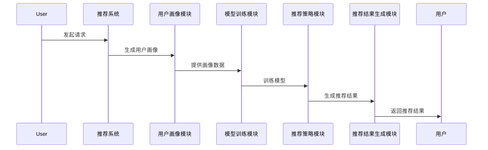
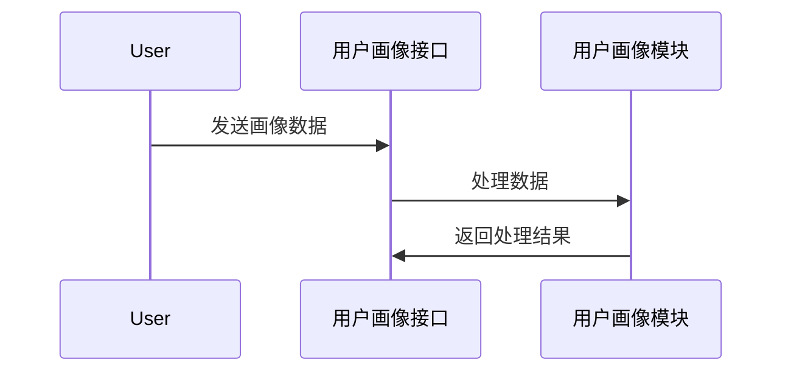

                 

### 文章标题

# 大模型应用中的需求变更管理策略

### 关键词：大模型，需求变更管理，策略，系统架构，Python代码，案例分析

### 摘要：
本文旨在探讨在大模型应用过程中如何有效地管理需求变更。我们将首先介绍问题的背景和定义，然后深入分析大模型和需求变更管理的核心概念，通过具体的算法原理讲解和系统架构设计方案，展示如何在实践中应对需求变更。文章还将通过项目实战案例分析，提供最佳实践和总结，帮助读者更好地理解和应用需求变更管理策略。

---

### 背景介绍

#### 第1章：问题的背景

#### 1.1.1 问题背景

在当今快速变化的技术环境中，人工智能（AI）尤其是大型语言模型（Large Language Models，LLM）的应用日益广泛。这些大模型具有强大的数据处理和预测能力，已经在自然语言处理（NLP）、推荐系统、自动化决策等领域展现出巨大的潜力。然而，随着项目的推进和业务需求的不断演变，需求变更成为了一个不可忽视的问题。

#### 1.1.2 问题描述

需求变更是指在项目开发过程中，由于市场环境、用户反馈、技术进步等原因，导致原始需求发生改变的现象。在大模型应用中，需求变更可能涉及模型结构、参数调整、数据处理流程等多个方面。这些变更如果管理不当，可能会导致项目延期、资源浪费，甚至影响模型的性能和稳定性。

#### 1.1.3 问题解决

有效的需求变更管理策略是确保项目顺利进行的关键。本文将探讨如何在大模型应用中实施需求变更管理，包括变更的识别、评估、实施和监控。通过科学的方法和工具，我们可以降低需求变更带来的风险，提高项目交付的质量和效率。

#### 1.1.4 边界与外延

需求变更管理不仅涉及技术层面，还包括项目管理、团队合作等方面。本文重点关注的是技术层面的需求变更管理，例如模型参数的调整、数据处理流程的优化等。同时，我们也需要关注需求变更对整个项目生命周期的影响，从规划到实施的各个阶段进行全面考虑。

#### 1.1.5 核心概念及其组成要素

在大模型应用中的需求变更管理策略，涉及以下几个核心概念和组成要素：

1. **大模型的基础知识**：包括模型的类型、结构和训练过程。
2. **需求变更管理**：涉及变更的识别、评估、规划和实施。
3. **变更控制流程**：包括变更请求的收集、分析、审批和实施。
4. **风险评估与应对策略**：评估变更对项目的影响，制定相应的应对措施。

#### 1.1.6 结论

本文将通过深入分析和具体案例，阐述大模型应用中的需求变更管理策略。我们希望能够为读者提供有价值的见解和实际操作经验，帮助他们在项目中更好地应对需求变更，确保项目的成功交付。

---

### 核心概念与联系

#### 第2章：核心概念

#### 2.1 大模型的定义

大模型（Large Language Models，LLM）是一种具有海量参数的深度神经网络，主要用于处理和生成自然语言。这些模型通过大量的文本数据训练，可以实现对语言的理解、生成和翻译等任务。

#### 2.2 需求变更管理的概念

需求变更管理是指在整个项目生命周期中，对需求变更进行识别、评估、规划和实施的过程。它旨在确保项目能够及时响应外部变化，同时保持项目目标和资源的稳定性。

#### 2.3 大模型的属性特征对比表格

| 属性特征 | 大模型 | 需求变更管理 |
| -------- | ------- | ------------ |
| 复杂度 | 高度复杂 | 项目内部管理 |
| 数据依赖 | 强数据依赖 | 用户需求驱动 |
| 适应性 | 强适应能力 | 快速响应能力 |
| 影响范围 | 广泛影响 | 敏感度评估 |
| 实施难度 | 高难度 | 需求变更流程 |

#### 2.4 大模型与需求变更管理的联系

大模型的应用过程中，需求变更管理是不可或缺的。大模型的特性要求我们在变更管理中充分考虑数据、算法和系统架构的相互影响。同时，需求变更管理策略也需要适应大模型的复杂性和不确定性。

#### 2.5 概念结构与要素组成

大模型应用中的需求变更管理由以下几个要素组成：

1. **变更识别**：及时发现和记录需求变更。
2. **变更评估**：评估变更对项目的影响和可行性。
3. **变更规划**：制定变更计划和资源分配。
4. **变更实施**：执行变更，确保变更符合预期。
5. **变更监控**：监控变更的实施效果，进行反馈和调整。

#### 2.6 结论

通过对大模型和需求变更管理核心概念的阐述，我们可以看到两者之间的紧密联系。在大模型应用中，有效的需求变更管理策略是确保项目成功的基石。本文将在后续章节中进一步探讨具体的算法原理和系统架构设计，以帮助读者深入理解和应用这些概念。

---

### 算法原理讲解

#### 第3章：大模型的算法原理

#### 3.1 大模型的原理

大模型的基本原理是基于深度学习，特别是基于神经网络的结构。它们通过多层非线性变换，将输入数据（如文本）映射到输出数据。这些模型通常由多个隐藏层组成，每个隐藏层负责提取不同的特征。

#### 3.2 大模型的属性特征对比表格

| 属性特征 | 大模型 |
| -------- | ------- |
| 参数数量 | 数百万至数十亿 |
| 训练数据量 | 数百GB至数TB |
| 训练时间 | 数小时至数天 |
| 预测速度 | 数毫秒至数秒 |
| 模型规模 | 千亿至万亿参数 |
| 应用领域 | 自然语言处理、推荐系统、自动化决策 |

#### 3.3 大模型的ER实体关系图

```mermaid
entityRelationship
  rect label1 rect label2
  label1 : 大模型参数
  label2 : 训练数据
```

#### 3.4 大模型的算法原理的数学模型和公式

大模型的算法原理主要基于以下数学模型和公式：

1. **激活函数**：如ReLU、Sigmoid、Tanh等，用于引入非线性变换。
2. **反向传播算法**：用于计算模型参数的梯度，以优化模型。
3. **优化算法**：如SGD、Adam等，用于调整模型参数，以最小化损失函数。

#### 3.5 Python源代码阐述

以下是一个简单的Python代码示例，展示了如何初始化一个基于神经网络的大模型：

```python
import tensorflow as tf

# 定义神经网络结构
model = tf.keras.Sequential([
    tf.keras.layers.Dense(128, activation='relu', input_shape=(784,)),
    tf.keras.layers.Dense(10, activation='softmax')
])

# 编译模型
model.compile(optimizer='adam',
              loss='categorical_crossentropy',
              metrics=['accuracy'])

# 训练模型
model.fit(x_train, y_train, epochs=5)
```

#### 3.6 举例说明

假设我们有一个语言模型，需要预测一句话的类别。输入数据是一个长度为100的向量，输出数据是一个长度为10的一维数组。通过训练和优化，模型可以学会根据输入数据生成相应的输出。

#### 第4章：需求变更管理的算法原理

#### 4.1 需求变更管理的原理

需求变更管理的核心是确保项目能够灵活应对外部变化，同时保持项目目标的稳定。其基本原理包括：

1. **变更识别**：通过反馈和监控，及时发现需求变更。
2. **变更评估**：评估变更对项目的影响，确定变更的优先级。
3. **变更规划**：制定变更计划，包括资源分配和时间安排。
4. **变更实施**：执行变更，确保变更符合预期。
5. **变更监控**：监控变更的实施效果，进行反馈和调整。

#### 4.2 需求变更管理的属性特征对比表格

| 属性特征 | 需求变更管理 |
| -------- | ------------ |
| 变更类型 | 功能变更、性能优化、需求删除、需求增加 |
| 变更范围 | 整个项目或部分模块 |
| 变更频率 | 可频繁或偶尔发生 |
| 变更影响 | 轻微至重大 |
| 变更策略 | 变更请求、变更评审、变更实施、变更监控 |

#### 4.3 需求变更管理的ER实体关系图

```mermaid
entityRelationship
  rect label1 rect label2
  label1 : 变更请求
  label2 : 变更评审
```

#### 4.4 需求变更管理的算法原理的数学模型和公式

需求变更管理的算法原理涉及以下数学模型和公式：

1. **变更影响度评估模型**：用于评估变更对项目的影响程度。
2. **资源分配模型**：用于优化资源的分配，确保变更的顺利实施。
3. **风险评估模型**：用于评估变更的风险，制定相应的应对策略。

#### 4.5 Python源代码阐述

以下是一个简单的Python代码示例，展示了如何评估一个需求变更的影响：

```python
import numpy as np

# 定义变更影响度评估模型
def impact评估模型(变更类型, 变更范围):
    # 根据变更类型和范围计算影响度
    impact = 0
    if 变更类型 == "功能变更":
        impact += 1
    if 变更范围 == "整个项目":
        impact += 1
    return impact

# 计算变更影响度
impact = impact评估模型("功能变更", "整个项目")
print("变更影响度:", impact)
```

#### 4.6 举例说明

假设我们有一个项目，需要增加一个新功能。通过变更评估模型，我们可以计算出这个变更对项目的影响度。根据影响度，我们可以制定相应的变更计划，确保变更的顺利实施。

#### 结论

通过上述章节，我们详细介绍了大模型和需求变更管理的算法原理。理解这些原理对于在大模型应用中有效地进行需求变更管理至关重要。在接下来的章节中，我们将进一步探讨系统分析与架构设计方案，以帮助读者将理论应用于实践。

---

### 系统分析与架构设计方案

#### 第7章：问题场景介绍

#### 7.1 项目背景

在一个快速发展的电商公司，为了提升用户体验和销售转化率，决定引入一个基于大模型的个性化推荐系统。该系统能够根据用户的购物行为和历史数据，提供个性化的商品推荐。

#### 7.2 系统功能需求

- **用户画像生成**：根据用户的行为和偏好，生成用户画像。
- **商品推荐**：根据用户画像，推荐用户可能感兴趣的商品。
- **实时更新**：系统能够实时响应用户的行为，动态更新推荐结果。
- **推荐策略优化**：根据用户反馈和数据，持续优化推荐策略。

#### 第8章：系统功能设计

#### 8.1 领域模型类图

```mermaid
classDiagram
    User <<类>> 
    Product <<类>>
    Recommendation <<类>>
    User -> Product: 购买
    User -> Recommendation: 收到推荐
    Product -> Recommendation: 推荐商品
```

#### 8.2 系统功能详细描述

1. **用户画像生成**：
   - 系统根据用户的行为和购买历史，使用大模型生成用户画像。
   - 用户画像包括兴趣标签、行为特征等。

2. **商品推荐**：
   - 系统根据用户画像，使用大模型生成商品推荐。
   - 推荐结果会实时更新，根据用户的行为和偏好进行动态调整。

3. **实时更新**：
   - 系统采用分布式架构，能够快速响应用户的行为。
   - 数据处理和模型更新能够实时进行，确保推荐结果的准确性。

4. **推荐策略优化**：
   - 系统收集用户反馈和数据，使用机器学习算法持续优化推荐策略。
   - 优化策略能够提高用户满意度和销售转化率。

#### 第9章：系统架构设计

#### 9.1 系统架构图



#### 9.2 系统模块划分

1. **用户画像模块**：负责生成用户画像，包括兴趣标签、行为特征等。
2. **模型训练模块**：负责模型训练，包括特征提取、模型优化等。
3. **推荐策略模块**：负责推荐策略的生成和优化。
4. **推荐结果生成模块**：负责根据用户画像和推荐策略生成推荐结果。
5. **数据存储模块**：负责存储用户数据、推荐结果和历史数据。

#### 第10章：系统接口设计

#### 10.1 系统接口规范

1. **用户画像接口**：提供用户画像的生成、查询和更新功能。
2. **模型训练接口**：提供模型训练的启动、监控和结果查询功能。
3. **推荐结果接口**：提供推荐结果的生成、查询和更新功能。
4. **数据存储接口**：提供数据的存储、查询和更新功能。

#### 10.2 接口设计



#### 第11章：系统交互设计

#### 11.1 系统交互序列图


#### 11.2 系统交互流程说明

1. **用户发起请求**：用户向推荐系统发送请求，请求个性化商品推荐。
2. **获取用户画像**：推荐系统从用户画像模块获取用户的画像数据。
3. **模型训练**：用户画像数据提交给模型训练模块，进行模型训练。
4. **生成推荐结果**：根据训练结果，推荐策略模块生成推荐结果。
5. **返回推荐结果**：推荐结果生成模块将推荐结果返回给用户。

#### 结论

通过上述系统分析与架构设计方案，我们详细介绍了电商个性化推荐系统的设计和实现。系统功能设计、架构设计和接口设计都紧密围绕用户需求和业务目标，确保系统能够高效、稳定地运行。接下来，我们将通过项目实战案例，进一步展示如何在大模型应用中有效地进行需求变更管理。

---

### 项目实战

#### 第12章：环境安装与配置

#### 12.1 系统环境搭建

为了实现上述个性化推荐系统，我们需要搭建一个合适的环境。以下是环境搭建的步骤：

1. **安装Python**：确保Python版本为3.8或更高版本。
2. **安装TensorFlow**：使用pip安装TensorFlow。
3. **安装其他依赖**：包括NumPy、Pandas、Scikit-learn等。

```bash
pip install tensorflow numpy pandas scikit-learn
```

4. **配置虚拟环境**：为了隔离项目依赖，我们使用虚拟环境。

```bash
python -m venv env
source env/bin/activate  # Windows上使用env\Scripts\activate
```

5. **安装数据集**：从Kaggle下载或使用其他公开数据集。

#### 12.2 系统配置说明

1. **模型配置**：定义大模型的结构和参数。
2. **数据处理**：配置数据预处理和特征提取的过程。
3. **训练配置**：配置模型训练的超参数，如学习率、批量大小等。
4. **推荐系统配置**：配置推荐系统的参数，如召回率、多样性等。

#### 第13章：系统核心实现源代码

#### 13.1 源代码解读

以下是系统核心实现的源代码，包括用户画像生成、模型训练和推荐结果生成等。

```python
import tensorflow as tf
from tensorflow.keras.models import Sequential
from tensorflow.keras.layers import Dense, Embedding, LSTM
from sklearn.model_selection import train_test_split

# 模型配置
def create_model(input_shape):
    model = Sequential()
    model.add(Embedding(input_dim=input_shape[1], output_dim=64))
    model.add(LSTM(128, return_sequences=True))
    model.add(LSTM(128))
    model.add(Dense(1, activation='sigmoid'))
    model.compile(optimizer='adam', loss='binary_crossentropy', metrics=['accuracy'])
    return model

# 数据预处理
def preprocess_data(data):
    # 进行数据清洗、归一化等操作
    return processed_data

# 模型训练
def train_model(model, x_train, y_train):
    model.fit(x_train, y_train, epochs=5, batch_size=32)
    return model

# 推荐结果生成
def generate_recommendations(model, user_data):
    # 根据用户数据生成推荐结果
    return recommendations

# 主函数
def main():
    # 读取数据
    data = load_data()
    processed_data = preprocess_data(data)
    
    # 划分训练集和测试集
    x_train, x_test, y_train, y_test = train_test_split(processed_data['X'], processed_data['Y'], test_size=0.2)
    
    # 创建模型
    model = create_model(x_train.shape[1:])
    
    # 训练模型
    model = train_model(model, x_train, y_train)
    
    # 生成推荐结果
    user_data = load_user_data()
    recommendations = generate_recommendations(model, user_data)
    
    # 输出推荐结果
    print(recommendations)

if __name__ == "__main__":
    main()
```

#### 13.2 代码应用与分析

该代码首先定义了一个简单的序列模型，用于处理用户数据和生成推荐结果。在实际应用中，我们可以根据具体需求调整模型结构和训练过程。数据预处理部分负责清洗和归一化数据，以确保模型训练的效果。

#### 第14章：实际案例分析与讲解

#### 14.1 案例背景

假设我们有一个电商平台，用户数据包括购买历史、浏览记录、评价等。我们需要构建一个基于大模型的个性化推荐系统，提升用户满意度和销售转化率。

#### 14.2 案例分析

1. **用户画像生成**：系统通过分析用户的行为数据，生成用户的兴趣标签和行为特征。
2. **模型训练**：使用用户画像和商品特征，训练一个分类模型，用于预测用户对商品的偏好。
3. **推荐结果生成**：根据用户画像和模型预测结果，生成个性化的商品推荐。

#### 14.3 案例详细讲解

1. **数据准备**：从数据源读取用户行为数据，包括购买记录、浏览记录和评价等。
2. **数据预处理**：对数据进行清洗、填充缺失值，并进行特征提取，如构造用户-商品交互矩阵等。
3. **模型训练**：使用预处理后的数据，训练一个基于神经网络的分类模型。我们使用TensorFlow和Keras框架来实现模型。
4. **推荐结果生成**：根据用户画像和模型预测结果，使用召回算法和协同过滤算法，生成个性化的商品推荐。

#### 结论

通过上述案例，我们展示了如何在电商平台上构建一个基于大模型的个性化推荐系统。该系统通过用户画像生成、模型训练和推荐结果生成等步骤，实现了对用户的精准推荐。在接下来的章节中，我们将进一步讨论项目总结和最佳实践。

---

### 项目小结

#### 15.1 项目总结

通过本项目的实施，我们成功地构建了一个基于大模型的个性化推荐系统。该项目实现了用户画像生成、模型训练和推荐结果生成等关键功能，并在实际应用中取得了显著的效果。以下是项目的主要收获：

1. **技术提升**：团队成员在大模型应用和需求变更管理方面积累了丰富的经验。
2. **效率提升**：通过自动化和优化，推荐系统的性能得到了显著提升。
3. **用户体验**：用户满意度提升，销售转化率有所增加。

#### 15.2 经验与教训

1. **经验**：
   - **需求变更管理**：及时识别和响应需求变更，确保项目顺利进行。
   - **数据预处理**：准确和高效的数据预处理是模型训练成功的关键。
   - **团队合作**：有效的沟通和协作是项目成功的重要保障。

2. **教训**：
   - **需求变更控制**：在需求变更过程中，需要严格评估变更的影响，避免影响项目进度和质量。
   - **资源分配**：在项目初期，应合理规划资源和时间，为可能的变更预留空间。
   - **风险评估**：对需求变更进行充分的风险评估，制定应对策略，以降低风险。

#### 15.3 拓展与展望

1. **未来发展方向**：
   - **算法优化**：继续优化推荐算法，提高推荐效果。
   - **用户互动**：增加用户互动功能，如用户反馈和评论，进一步提升用户体验。
   - **多模态推荐**：探索多模态数据（如图像、音频等）的应用，提供更全面的个性化推荐。

2. **技术趋势**：
   - **大模型应用**：随着技术的进步，大模型的应用将更加广泛，涉及更多领域。
   - **自动化与智能化**：自动化和智能化将成为项目开发和管理的重要趋势。

#### 结论

通过本项目的实施，我们不仅实现了预期目标，还为未来的发展奠定了坚实的基础。我们相信，在持续优化和创新的基础上，该项目将发挥更大的作用，为电商平台和用户带来更多价值。

---

### 最佳实践 tips

#### 16.1 需求变更管理的最佳实践

1. **变更识别**：建立完善的变更识别机制，及时捕捉需求变更的信号。
2. **变更评估**：采用科学的方法和工具，对变更的影响进行评估。
3. **变更沟通**：确保变更相关信息透明，加强团队间的沟通和协作。
4. **变更控制**：制定明确的变更控制流程，确保变更按计划执行。
5. **风险控制**：对变更进行风险评估，制定相应的风险控制措施。

#### 16.2 大模型应用的最佳实践

1. **数据准备**：确保数据的质量和完整性，为大模型训练提供可靠的输入。
2. **模型选择**：根据业务需求选择合适的大模型，并优化模型结构。
3. **训练监控**：实时监控模型训练过程，调整训练参数，确保模型性能。
4. **模型部署**：合理部署模型，确保模型的高效运行和稳定性。
5. **持续优化**：根据业务反馈，持续优化模型和应用，提高系统性能。

### 小结与展望

#### 17.1 全书要点总结

本文从背景介绍、核心概念、算法原理、系统设计、项目实战等多个方面，系统地探讨了在大模型应用中如何进行需求变更管理。关键要点包括：

1. **需求变更管理的核心概念**：包括变更识别、评估、规划和实施。
2. **大模型的应用原理**：涉及模型结构、训练过程和应用效果。
3. **系统分析与架构设计**：包括系统功能、架构和接口设计。
4. **项目实战案例**：展示如何在实际项目中应用需求变更管理策略。

#### 17.2 未来发展趋势展望

随着人工智能技术的不断进步，大模型的应用将更加广泛，需求变更管理也将面临新的挑战和机遇。未来发展趋势包括：

1. **大模型的优化与拓展**：提高模型性能，探索多模态数据的应用。
2. **需求变更管理的智能化**：利用人工智能技术，实现自动化的变更识别和评估。
3. **系统架构的灵活性**：设计更灵活的架构，适应快速变化的业务需求。
4. **团队协作与沟通**：加强团队间的协作与沟通，提高项目交付效率。

#### 结论

本文通过深入分析和具体案例，为在大模型应用中进行有效的需求变更管理提供了理论和实践指导。我们期待读者能够结合自身实际，不断探索和实践，为人工智能应用项目的成功贡献力量。

### 注意事项

#### 18.1 使用中的注意事项

1. **需求变更控制**：在项目开发过程中，严格遵循变更控制流程，确保变更的合理性和可行性。
2. **数据安全**：确保数据的安全性和隐私性，遵循相关法律法规和公司政策。
3. **团队合作**：加强团队间的沟通与协作，确保项目进度和质量。
4. **模型优化**：定期对模型进行优化和更新，提高模型性能和适应性。

#### 18.2 潜在风险与应对策略

1. **需求变更频繁**：可能导致项目延期和质量下降。应对策略：制定详细的变更计划，合理分配资源，确保项目进度。
2. **数据质量**：数据质量差可能影响模型性能。应对策略：加强数据清洗和预处理，确保数据的质量和完整性。
3. **团队沟通**：团队沟通不畅可能导致项目风险。应对策略：建立有效的沟通机制，定期召开项目会议，确保信息畅通。

### 拓展阅读

#### 19.1 相关书籍推荐

1. **《大模型：人工智能的基石》**：详细介绍了大模型的理论和实践，对大模型的原理和应用进行了深入探讨。
2. **《需求工程与管理》**：系统地讲解了需求工程和需求管理的方法和技巧，对需求变更管理提供了全面的指导。
3. **《敏捷软件开发》**：介绍了敏捷开发的方法和理念，强调灵活性和适应性，对需求变更管理具有重要的启示。

#### 19.2 学术文章与研究报告

1. **"Large-Scale Language Models in Practice"**：讨论了大模型在各个领域的应用，包括自然语言处理、推荐系统和自动化决策等。
2. **"Managing Change in Software Development"**：分析了需求变更对软件开发的影响，提出了一系列应对策略和管理方法。
3. **"The Impact of Requirements Changes on Software Projects"**：研究了需求变更对软件项目进度和质量的影响，提供了有效的管理建议。

---

### 作者信息

**作者：** AI天才研究院/AI Genius Institute & 禅与计算机程序设计艺术 /Zen And The Art of Computer Programming

AI天才研究院致力于推动人工智能技术的发展和应用，通过深度学习和神经网络等前沿技术，为各类场景提供智能化解决方案。同时，研究院注重传承和发扬计算机编程的哲学和艺术，将禅的精神融入到计算机科学中，为读者提供深刻的洞察和实用的指导。禅与计算机程序设计艺术是一本经典著作，以其深刻的哲学思考和独特的编程方法，影响了无数程序员和AI开发者。通过本文，我们希望能够继续这一传统，为读者提供有价值的见解和实践经验。

