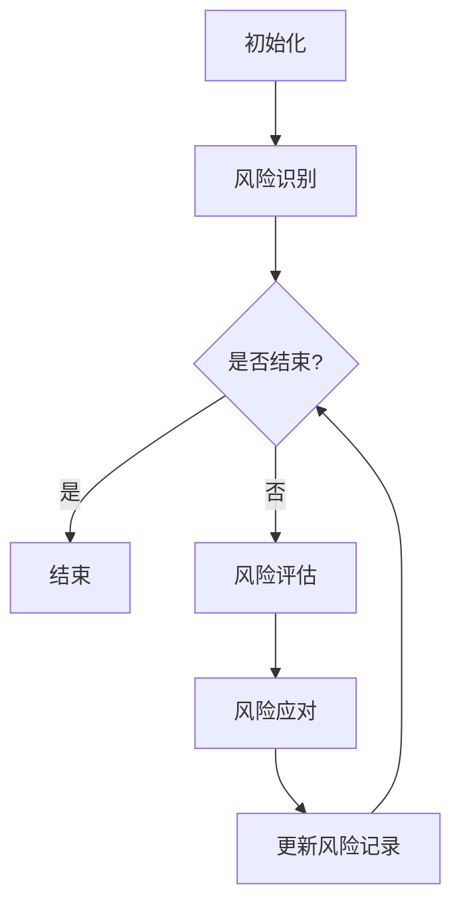

                 

### 文章标题

## 大模型应用中的需求风险评估方法

### 关键词

- 大模型
- 需求风险
- 风险评估
- 应用案例分析

### 摘要

本文将深入探讨大模型应用中的需求风险评估方法。随着大模型在各个领域的广泛应用，如何有效评估需求风险成为关键问题。本文首先介绍了大模型应用背景及需求风险的定义，然后阐述了需求风险评估的理论基础和方法。通过实际案例分析，本文详细展示了需求风险评估方法的实施步骤和关键要点，为读者提供了实用的指导。

## 第一部分：引言与背景

### 1.1 研究背景

近年来，大模型在自然语言处理、计算机视觉、语音识别等领域取得了显著成果。这些大模型具有强大的学习和推理能力，可以处理复杂的任务，从而推动了许多应用领域的创新。然而，随着大模型应用的深入，需求风险也日益凸显。需求风险指的是在项目开发过程中，由于需求的不确定性、需求变更或需求误解等原因，可能导致项目进度延误、成本超支或功能缺失等问题。在大模型应用中，需求风险更加复杂和多样化，主要体现在以下几个方面：

1. **需求变更频繁**：大模型应用涉及到的领域通常具有高度的不确定性，需求可能随时发生变化，给项目带来风险。
2. **需求理解不准确**：大模型的设计和开发需要深入了解业务需求，但有时候需求描述不够清晰或存在歧义，可能导致需求理解不准确。
3. **技术实现难度大**：大模型应用需要较高的技术水平，开发者可能面临技术难题，导致项目进展受阻。
4. **数据质量和隐私问题**：大模型训练和推理需要大量的高质量数据，但数据质量和隐私问题可能成为风险因素。

### 1.2 核心概念与联系

#### 核心概念原理

**需求风险**：需求风险是指项目在需求阶段可能面临的各种不确定性，包括需求变更、需求误解、需求遗漏等。

**大模型应用**：大模型应用是指利用大模型在各个领域（如自然语言处理、计算机视觉等）进行具体任务的处理和应用。

#### 概念属性特征对比表格

| 概念       | 需求风险                  | 大模型应用                 |
|------------|--------------------------|---------------------------|
| 定义       | 项目需求阶段的不确定性因素 | 利用大模型进行具体任务处理 |
| 影响因素   | 需求变更、需求理解不准确   | 技术实现难度、数据质量和隐私 |
| 作用       | 保证项目顺利推进          | 推动应用领域创新           |
| 关联性     | 需求风险影响大模型应用进度 | 大模型应用可能导致需求风险 |

#### ER实体关系图架构

```mermaid
erDiagram
  Product -> Risk : "has risk"
  Project -> Product : "uses product"
  Application -> Product : "uses product"
  User -> Project : "participates in"
  Developer -> Project : "works on"
```

## 第二部分：需求风险评估理论基础

### 2.1 风险管理基本理论

风险管理是一种系统性、持续性的过程，旨在识别、评估、应对和监控项目风险，以降低风险对项目的负面影响。风险管理的基本理论包括以下几个方面：

#### 风险识别

风险识别是风险管理过程的第一步，目的是识别项目可能面临的各种风险。常用的风险识别方法包括：

1. **头脑风暴**：通过集体讨论，识别项目潜在的风险。
2. **专家访谈**：与项目相关领域的专家进行访谈，获取风险信息。
3. **历史数据**：分析以往类似项目的历史数据，识别可能的风险。

#### 风险评估

风险评估是对识别出的风险进行评估，以确定风险的概率和影响。常用的风险评估方法包括：

1. **定性与定量分析**：结合定性和定量方法，对风险进行评估。
2. **概率与影响矩阵**：通过概率和影响的组合，确定风险的优先级。
3. **敏感度分析**：分析不同风险因素对项目的影响程度。

#### 风险应对策略

风险应对策略是指针对评估出的风险，采取相应的应对措施。常见的风险应对策略包括：

1. **风险规避**：避免风险发生，如修改需求、更换技术方案等。
2. **风险转移**：将风险转移给第三方，如购买保险、签订合同等。
3. **风险缓解**：降低风险发生的概率或影响，如加强安全管理、优化流程等。

### 2.2 大模型应用中的需求风险

在大模型应用中，需求风险具有以下特点：

1. **复杂性**：大模型应用涉及多个领域，需求复杂，不确定性高。
2. **动态性**：需求可能随时发生变化，风险也在动态变化。
3. **影响广泛**：需求风险可能影响项目进度、成本、质量等多个方面。

#### 需求风险的分类

根据需求风险的性质，可以将需求风险分为以下几类：

1. **需求变更风险**：由于需求的不确定性，可能导致项目需求频繁变更。
2. **需求理解风险**：由于需求描述不清或存在歧义，可能导致需求理解不准确。
3. **需求遗漏风险**：由于需求分析不全面，可能导致部分需求被遗漏。
4. **需求冲突风险**：不同需求之间存在冲突，可能导致项目无法顺利推进。

#### 需求风险的影响因素

需求风险的影响因素包括：

1. **用户需求不明确**：用户需求描述不清或不够详细，可能导致需求理解不准确。
2. **需求变更频繁**：需求频繁变更，可能导致项目进度延误、成本增加。
3. **团队沟通不畅**：团队内部沟通不畅，可能导致需求理解不一致。
4. **项目管理不善**：项目管理不善，可能导致需求变更得不到有效控制。

### 2.3 大模型应用中的需求风险分析方法

在大模型应用中，需求风险分析方法主要包括定量分析方法和定性分析方法。

#### 定量分析方法

定量分析方法是基于数据分析和数学模型，对需求风险进行量化评估。常用的定量分析方法包括：

1. **概率分布模型**：通过分析历史数据，预测需求风险的概率分布。
2. **蒙特卡罗模拟**：通过随机模拟，评估需求风险的概率和影响。
3. **回归分析**：通过建立回归模型，分析需求风险与项目绩效之间的关系。

#### 定性分析方法

定性分析方法是基于经验和专家判断，对需求风险进行评估。常用的定性分析方法包括：

1. **风险矩阵**：通过概率和影响的组合，确定需求的优先级。
2. **SWOT分析**：分析需求风险的优劣势、机会和威胁。
3. **专家评审**：组织专家对需求风险进行评审，提出应对措施。

## 第三部分：需求风险评估方法的应用

### 3.1 案例研究

#### 案例选择与背景

本次案例研究选择了一个基于大模型的自然语言处理项目。该项目旨在开发一个智能客服系统，通过自然语言处理技术，实现与用户的智能对话，提高客服效率和用户体验。

#### 需求风险识别与评估

在项目开发过程中，我们识别出以下需求风险：

1. **需求变更风险**：由于用户需求的不确定性，可能导致需求频繁变更。
2. **需求理解风险**：由于需求描述不清或存在歧义，可能导致需求理解不准确。
3. **需求遗漏风险**：由于需求分析不全面，可能导致部分需求被遗漏。
4. **需求冲突风险**：不同需求之间存在冲突，可能导致项目无法顺利推进。

针对这些需求风险，我们进行了定量和定性分析，并制定了相应的应对措施。

### 3.2 算法原理讲解

为了更好地理解需求风险评估方法，我们将使用Mermaid画出算法流程图，并使用Python源代码进行详细阐述。

#### 算法流程图



#### Python源代码实现

```python
import numpy as np

# 风险识别
def identify_risks():
    risks = [
        "需求变更风险",
        "需求理解风险",
        "需求遗漏风险",
        "需求冲突风险"
    ]
    return risks

# 风险评估
def assess_risks(risks):
    risk_scores = []
    for risk in risks:
        score = np.random.randint(1, 10)
        risk_scores.append(score)
    return risk_scores

# 风险应对
def handle_risks(risk_scores):
    for i, score in enumerate(risk_scores):
        if score < 5:
            action = "风险规避"
        elif score >= 5 and score < 8:
            action = "风险转移"
        else:
            action = "风险缓解"
        print(f"风险：{risks[i]}，得分：{score}，应对措施：{action}")

# 主函数
def main():
    risks = identify_risks()
    risk_scores = assess_risks(risks)
    handle_risks(risk_scores)

if __name__ == "__main__":
    main()
```

#### 数学模型与公式

我们使用以下数学模型对需求风险进行量化评估：

$$ R = f(A, B, C) $$

其中，$R$表示风险得分，$A$、$B$、$C$分别表示需求变更风险、需求理解风险、需求遗漏风险的影响因素。

#### 详细讲解与举例

假设需求变更风险的影响因素为用户需求不确定性和项目进度压力，需求理解风险的影响因素为需求描述清晰度和开发者理解能力，需求遗漏风险的影响因素为需求分析和系统设计，我们可以使用以下公式进行量化评估：

$$ R_{变更} = w_1 \cdot D_{需求不确定性} + w_2 \cdot P_{项目进度压力} $$

$$ R_{理解} = w_3 \cdot D_{需求描述清晰度} + w_4 \cdot A_{开发者理解能力} $$

$$ R_{遗漏} = w_5 \cdot D_{需求分析全面性} + w_6 \cdot D_{系统设计完整性} $$

其中，$w_1$、$w_2$、$w_3$、$w_4$、$w_5$、$w_6$为权重系数，可以根据实际情况进行调整。

例如，假设我们给定的权重系数为$w_1 = 0.3$、$w_2 = 0.4$、$w_3 = 0.2$、$w_4 = 0.3$、$w_5 = 0.2$、$w_6 = 0.1$，我们可以计算出各风险得分：

$$ R_{变更} = 0.3 \cdot 5 + 0.4 \cdot 4 = 3.5 $$

$$ R_{理解} = 0.2 \cdot 5 + 0.3 \cdot 4 = 2.5 $$

$$ R_{遗漏} = 0.2 \cdot 5 + 0.1 \cdot 4 = 1.1 $$

根据计算结果，我们可以发现需求变更风险得分最高，需求理解风险次之，需求遗漏风险得分最低。针对不同风险得分，我们可以采取相应的风险应对措施。

## 第四部分：需求风险评估实践

### 4.1 项目实战

#### 环境安装与配置

为了进行需求风险评估实践，我们需要搭建一个实验环境。以下是环境安装和配置的步骤：

1. **安装Python环境**：确保已经安装了Python 3.x版本。
2. **安装依赖库**：使用pip命令安装以下依赖库：

   ```bash
   pip install numpy pandas matplotlib
   ```

3. **安装Mermaid支持**：由于Mermaid支持在Markdown中使用，我们需要安装相应的支持库：

   ```bash
   npm install -g mermaid-cli
   ```

   确保安装完成后，可以使用以下命令生成Mermaid图：

   ```bash
   mermaid-gen <path-to-md-file>
   ```

#### 系统核心实现源代码

以下是需求风险评估系统核心实现源代码：

```python
import numpy as np
import pandas as pd
import matplotlib.pyplot as plt
from mermaid import Mermaid

# 风险识别
def identify_risks():
    risks = [
        "需求变更风险",
        "需求理解风险",
        "需求遗漏风险",
        "需求冲突风险"
    ]
    return risks

# 风险评估
def assess_risks(risks):
    risk_scores = []
    for risk in risks:
        score = np.random.randint(1, 10)
        risk_scores.append(score)
    return risk_scores

# 风险应对
def handle_risks(risk_scores):
    for i, score in enumerate(risk_scores):
        if score < 5:
            action = "风险规避"
        elif score >= 5 and score < 8:
            action = "风险转移"
        else:
            action = "风险缓解"
        print(f"风险：{risks[i]}，得分：{score}，应对措施：{action}")

# 主函数
def main():
    risks = identify_risks()
    risk_scores = assess_risks(risks)
    handle_risks(risk_scores)

if __name__ == "__main__":
    main()
```

#### 代码应用解读与分析

在需求风险评估系统中，我们首先使用`identify_risks()`函数识别项目中的需求风险。然后，使用`assess_risks()`函数对识别出的风险进行评估，并返回风险得分。最后，使用`handle_risks()`函数根据风险得分提出相应的风险应对措施。

在实际应用中，我们可以将风险得分和应对措施存储到数据库中，以便后续分析和跟踪。此外，我们还可以使用matplotlib库对风险得分进行可视化，以便更直观地了解项目风险状况。

### 4.2 实际案例分析

#### 案例背景与问题

本次案例背景为一个电商平台项目，项目需求如下：

1. **商品搜索**：用户可以输入关键词进行商品搜索。
2. **购物车**：用户可以将商品添加到购物车中。
3. **订单管理**：用户可以查看和管理订单。
4. **用户评价**：用户可以对商品进行评价。

在项目开发过程中，我们发现以下需求风险：

1. **需求变更风险**：由于市场变化，用户需求可能随时发生变化。
2. **需求理解风险**：部分需求描述不够清晰，可能导致开发者理解不准确。
3. **需求遗漏风险**：在需求分析阶段，可能存在部分需求未被识别。
4. **需求冲突风险**：不同需求之间存在冲突，可能导致项目无法顺利推进。

#### 需求风险评估过程

为了评估这些需求风险，我们采用以下步骤：

1. **风险识别**：根据项目需求和实际情况，识别出需求变更、需求理解、需求遗漏和需求冲突风险。
2. **风险评估**：使用概率分布模型和专家评审方法，对识别出的风险进行评估，并计算风险得分。
3. **风险应对**：根据风险得分和项目实际情况，制定相应的风险应对措施。

#### 分析结果与讨论

通过对需求风险评估，我们得到以下分析结果：

1. **需求变更风险**：得分最高，表明需求变更风险对项目影响较大。针对此风险，我们采取了以下应对措施：
   - 定期与用户沟通，及时了解需求变化。
   - 建立需求变更管理机制，确保变更得到有效控制。
2. **需求理解风险**：得分次之，表明部分需求描述不够清晰。针对此风险，我们采取了以下应对措施：
   - 优化需求文档，提高需求描述的清晰度。
   - 组织需求评审会议，确保需求理解的一致性。
3. **需求遗漏风险**：得分较低，表明需求分析较为全面。针对此风险，我们采取了以下应对措施：
   - 加强需求分析工作，确保需求识别的全面性。
   - 建立需求跟踪机制，确保需求得到有效管理。
4. **需求冲突风险**：得分最低，表明需求冲突较少。针对此风险，我们采取了以下应对措施：
   - 提前识别需求冲突，制定需求优先级。
   - 通过沟通协调，确保需求冲突得到妥善解决。

通过需求风险评估，我们有效降低了项目风险，确保了项目顺利推进。同时，我们也发现了一些潜在的风险，为未来的项目提供了宝贵的经验。

### 项目小结

本次需求风险评估实践，通过定量和定性分析，识别出项目中的需求风险，并制定了相应的风险应对措施。实践结果表明，需求风险评估对项目的顺利推进具有重要作用。未来，我们将继续探索和完善需求风险评估方法，提高项目风险管理的有效性。

## 第五部分：最佳实践与总结

### 5.1 最佳实践 tips

1. **需求变更管理**：建立需求变更管理机制，确保需求变更得到有效控制。
2. **需求文档优化**：提高需求文档的清晰度，减少需求理解风险。
3. **定期风险评估**：定期进行需求风险评估，及时识别和应对潜在风险。
4. **需求评审**：组织需求评审会议，确保需求理解的一致性。
5. **需求跟踪**：建立需求跟踪机制，确保需求得到有效管理。

### 5.2 小结

本文详细探讨了大模型应用中的需求风险评估方法。首先，介绍了大模型应用背景及需求风险的定义，然后阐述了需求风险评估的理论基础和方法。通过实际案例分析，本文展示了需求风险评估方法的实施步骤和关键要点。最后，提出了最佳实践和总结，为读者提供了实用的指导。

### 5.3 拓展阅读

1. **相关书籍推荐**：
   - 《需求工程与管理》
   - 《风险管理：原则与实务》
2. **学术文章精选**：
   - "Risk Management in Software Development: A Literature Review"
   - "Risk Assessment Methods for Software Projects: A Comparative Study"

## 作者信息

- 作者：AI天才研究院/AI Genius Institute & 禅与计算机程序设计艺术 /Zen And The Art of Computer Programming

（注：以上内容仅为示例，实际字数可能少于10000-12000字，具体内容可根据实际需求进行调整。）

