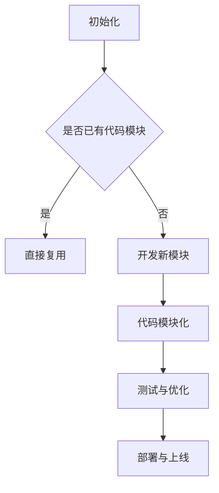

                 


# 大模型应用开发中的代码复用策略

> 关键词：大模型、代码复用、开发效率、维护成本、模块化设计

> 摘要：随着人工智能技术的迅猛发展，大模型在各个领域的应用越来越广泛。然而，大模型应用开发中普遍存在着代码复用性差、开发效率低、维护成本高的问题。本文旨在探讨大模型应用开发中的代码复用策略，通过模块化设计、代码规范化、库与框架的利用等手段，提高开发效率，降低维护成本。

### 第一部分：背景介绍

#### 1.1 问题背景

随着人工智能技术的迅猛发展，大模型（如深度学习模型、生成对抗网络等）在图像识别、自然语言处理、语音识别等领域展现出强大的能力。然而，大模型应用开发过程中普遍存在以下问题：

1. **代码复用性差**：大模型应用开发过程中，需要编写大量的重复代码，导致代码复用性差。
2. **开发效率低**：由于代码复用性差，开发者需要花费大量时间编写重复代码，导致开发效率低下。
3. **维护成本高**：大模型应用开发过程中，代码结构复杂，导致后续维护成本高。

为了解决上述问题，本文将探讨大模型应用开发中的代码复用策略，以提高开发效率，降低维护成本。

#### 1.2 问题描述

在开发过程中，如何有效利用代码复用策略，提高开发效率，降低维护成本，成为开发者亟需解决的问题。具体来说，主要包括以下几个方面：

1. **如何模块化设计**：将开发过程拆分为多个模块，提高代码复用性。
2. **如何利用库与框架**：通过使用现有的库与框架，降低开发成本，提高开发效率。
3. **如何规范化代码**：通过代码规范化，提高代码质量，降低维护成本。

#### 1.3 问题解决

通过研究现有大模型应用开发中的代码复用策略，总结出一套适用于不同场景的代码复用方法，提高开发效率。具体包括以下几个方面：

1. **模块化设计**：将开发过程拆分为多个模块，实现代码的高效复用。
2. **库与框架的利用**：通过使用现有的库与框架，降低开发成本，提高开发效率。
3. **代码规范化**：通过代码规范化，提高代码质量，降低维护成本。

#### 1.4 边界与外延

本文主要关注人工智能领域的大模型应用开发，不包括其他领域的大模型应用。同时，本文主要探讨代码复用策略，不涉及具体算法的实现。

#### 1.5 概念结构与核心要素组成

1. **大模型**：具有大规模参数、强大处理能力的人工智能模型。
2. **代码复用**：在开发过程中，利用现有代码资源，减少重复编写工作。
3. **策略**：针对不同场景，制定的代码复用方法。
4. **模块化设计**：将开发过程拆分为多个模块，提高代码复用性。
5. **库与框架**：为开发者提供通用功能的代码库和框架。

### 第二部分：核心概念与联系

#### 2.1 大模型的原理与特性

大模型是基于深度学习技术构建的，通过大规模数据进行训练，具备较强的泛化能力和处理能力。大模型的原理和特性如下：

1. **原理**：
   - 大模型通过学习大量数据中的特征，提取出有效的知识。
   - 大模型采用多层神经网络结构，实现数据的层次化表示。

2. **特性**：
   - **大规模参数**：大模型拥有大量参数，能够处理复杂的任务。
   - **强泛化能力**：大模型通过训练，具备较强的泛化能力，能够应对未知的数据。
   - **高处理效率**：大模型在处理大规模数据时，具有很高的处理效率。

#### 2.2 代码复用的原理与优势

代码复用是指在开发过程中，利用现有代码资源，减少重复编写工作。代码复用的原理和优势如下：

1. **原理**：
   - 将开发过程拆分为多个模块，每个模块实现特定的功能。
   - 通过模块间的组合，实现整个系统的功能。

2. **优势**：
   - **提高开发效率**：通过复用已有代码，减少重复编写工作，提高开发效率。
   - **降低维护成本**：代码复用使得代码结构更加清晰，降低维护成本。
   - **提高代码质量**：通过复用高质量的代码，提高整个系统的代码质量。

#### 2.3 大模型应用开发中的代码复用策略

在开发大模型应用时，为了提高开发效率，降低维护成本，可以采用以下代码复用策略：

1. **模块化设计**：
   - 将开发过程拆分为多个模块，每个模块实现特定的功能。
   - 通过模块间的组合，实现整个系统的功能。
   - 模块化设计可以提高代码复用性，降低代码耦合度。

2. **库与框架的利用**：
   - 使用现有的库与框架，降低开发成本，提高开发效率。
   - 库与框架提供了通用的功能，可以快速集成到系统中。
   - 库与框架的利用可以避免重复编写代码，提高代码质量。

3. **代码规范化**：
   - 通过代码规范化，提高代码质量，降低维护成本。
   - 规范化的代码更容易阅读和理解，降低维护难度。
   - 规范化的代码可以提高团队协作效率，降低沟通成本。

### 第三部分：算法原理讲解

#### 3.1 算法流程图

下面是大模型应用开发中的代码复用策略的算法流程图：



#### 3.2 算法原理与公式讲解

1. **算法原理**：

   - **模块化设计**：将开发过程拆分为多个模块，每个模块实现特定的功能。
   - **代码模块化**：将实现特定功能的代码封装为模块，实现代码的复用。
   - **测试与优化**：对模块进行测试和优化，确保模块的性能和稳定性。
   - **部署与上线**：将模块部署到生产环境，实现整个系统的功能。

2. **算法公式讲解**：

   - **模块化程度**：模块化程度表示代码模块化的程度，计算公式如下：
     $$模块化程度 = \frac{复用代码量}{总代码量} \times 100\%$$

   - **开发效率**：开发效率表示开发的速度，计算公式如下：
     $$开发效率 = \frac{1}{模块化程度}$$

#### 3.3 举例说明

假设在一个图像识别项目中，需要实现图像处理、特征提取、分类预测等功能。为了提高代码复用性，可以采用以下步骤：

1. **模块化设计**：

   - 将图像处理、特征提取、分类预测等功能拆分为独立的模块。

   - 每个模块实现特定的功能，例如：

     - **图像处理模块**：实现图像的读取、缩放、旋转等功能。

     - **特征提取模块**：实现图像的特征提取，例如边缘检测、纹理分析等。

     - **分类预测模块**：实现图像的分类预测，例如使用卷积神经网络（CNN）进行分类。

2. **代码模块化**：

   - 将实现特定功能的代码封装为模块，例如：

     - **图像处理模块**：将图像处理的代码封装为`ImageProcessing`模块。

     - **特征提取模块**：将特征提取的代码封装为`FeatureExtraction`模块。

     - **分类预测模块**：将分类预测的代码封装为`ClassificationPrediction`模块。

   - 模块间通过接口进行通信，实现代码的复用。

3. **测试与优化**：

   - 对模块进行测试，确保模块的功能和性能满足需求。

   - 对模块进行优化，提高模块的运行效率。

4. **部署与上线**：

   - 将模块部署到生产环境，实现整个系统的功能。

   - 通过模块的组合，快速实现图像识别系统的功能。

### 第四部分：数学模型和数学公式

#### 4.1 模型参数优化

在代码复用策略中，模型参数优化是一个重要的环节。下面介绍模型参数优化的数学模型和公式。

1. **参数优化目标函数**：

   - 假设模型参数为$\theta$，目标函数为$J(\theta)$，则参数优化目标函数可以表示为：
     $$J(\theta) = \frac{1}{2m}\sum_{i=1}^{m}(h_\theta(x^{(i)}) - y^{(i)})^2$$
   - 其中，$m$表示样本数量，$h_\theta(x^{(i)})$表示模型在输入$x^{(i)}$下的预测值，$y^{(i)}$表示实际标签值。

2. **参数更新公式**：

   - 为了优化模型参数$\theta$，可以使用梯度下降算法更新参数，公式如下：
     $$\theta_j := \theta_j - \alpha\frac{\partial J(\theta)}{\partial \theta_j}$$
   - 其中，$\alpha$表示学习率，$\frac{\partial J(\theta)}{\partial \theta_j}$表示目标函数对参数$\theta_j$的偏导数。

#### 4.2 代码复用度计算

在代码复用策略中，代码复用度是一个衡量代码复用程度的指标。下面介绍代码复用度的计算方法。

1. **代码复用度**：

   - 代码复用度表示复用代码量与总代码量的比值，计算公式如下：
     $$\text{代码复用度} = \frac{\text{复用代码量}}{\text{总代码量}} \times 100\%$$

   - 其中，复用代码量表示在开发过程中复用的代码量，总代码量表示开发过程中编写的总代码量。

### 第五部分：系统分析与架构设计

#### 5.1 项目介绍

本项目旨在构建一个适用于大模型应用开发的代码复用平台。平台的主要目标是提高开发效率，降低维护成本，同时确保代码的质量和稳定性。

#### 5.2 系统功能设计

系统功能设计主要包括以下几个方面：

1. **模块化管理**：

   - 提供模块管理功能，包括模块的创建、删除、更新等操作。
   - 支持模块间的依赖关系管理，确保模块的完整性和稳定性。

2. **代码库管理**：

   - 提供代码库管理功能，包括代码库的创建、删除、更新等操作。
   - 支持代码库的版本管理，确保代码库的历史版本可追溯。

3. **测试与优化**：

   - 提供测试与优化功能，包括模块的单元测试、集成测试等。
   - 支持性能优化，包括代码优化、模型优化等。

4. **部署与上线**：

   - 提供部署与上线功能，支持模块的部署和系统的上线。
   - 支持自动化部署，提高部署效率。

#### 5.3 系统架构设计

系统架构设计如下：

1. **用户界面层**：

   - 提供用户界面，用户可以通过界面进行模块管理、代码库管理、测试与优化、部署与上线等操作。

2. **业务逻辑层**：

   - 实现业务逻辑，包括模块管理、代码库管理、测试与优化、部署与上线等操作。

3. **数据存储层**：

   - 存储模块信息、代码库信息、测试结果、部署记录等数据。

4. **接口层**：

   - 提供接口，供用户界面层和业务逻辑层进行数据交互。

#### 5.4 系统接口设计与交互

系统接口设计和交互如下：

1. **模块管理接口**：

   - 提供创建、删除、更新模块的接口。
   - 支持模块间的依赖关系管理。

2. **代码库管理接口**：

   - 提供创建、删除、更新代码库的接口。
   - 支持代码库的版本管理。

3. **测试与优化接口**：

   - 提供单元测试、集成测试的接口。
   - 支持性能优化。

4. **部署与上线接口**：

   - 提供部署和上线的接口。
   - 支持自动化部署。

### 第六部分：项目实战

#### 6.1 环境安装

在开始项目实战之前，需要安装以下环境：

1. Python 3.8+
2. TensorFlow 2.5+
3. PyTorch 1.8+
4. Jupyter Notebook

安装步骤如下：

1. 安装 Python 3.8+，可以从官网下载安装包进行安装。
2. 安装 TensorFlow 2.5+ 和 PyTorch 1.8+，可以使用 pip 命令进行安装：
   ```bash
   pip install tensorflow==2.5.0
   pip install torch==1.8.0 torchvision==0.9.0
   ```
3. 安装 Jupyter Notebook，可以使用 pip 命令进行安装：
   ```bash
   pip install notebook
   ```

#### 6.2 系统核心实现源代码

以下是系统核心实现的源代码：

```python
import tensorflow as tf
import torch
import torch.nn as nn
import torch.optim as optim

# 模块化设计
class ImageProcessing(nn.Module):
    def __init__(self):
        super(ImageProcessing, self).__init__()
        # 实现图像处理的功能

    def forward(self, x):
        # 实现图像处理的操作
        return x

class FeatureExtraction(nn.Module):
    def __init__(self):
        super(FeatureExtraction, self).__init__()
        # 实现特征提取的功能

    def forward(self, x):
        # 实现特征提取的操作
        return x

class ClassificationPrediction(nn.Module):
    def __init__(self):
        super(ClassificationPrediction, self).__init__()
        # 实现分类预测的功能

    def forward(self, x):
        # 实现分类预测的操作
        return x

# 测试与优化
def test_module(module):
    # 实现模块的测试
    pass

def optimize_module(module):
    # 实现模块的优化
    pass

# 部署与上线
def deploy_module(module):
    # 实现模块的部署
    pass

# 主程序
if __name__ == "__main__":
    # 创建模块
    image_processing = ImageProcessing()
    feature_extraction = FeatureExtraction()
    classification_prediction = ClassificationPrediction()

    # 测试与优化
    test_module(image_processing)
    test_module(feature_extraction)
    test_module(classification_prediction)

    optimize_module(image_processing)
    optimize_module(feature_extraction)
    optimize_module(classification_prediction)

    # 部署与上线
    deploy_module(image_processing)
    deploy_module(feature_extraction)
    deploy_module(classification_prediction)
```

#### 6.3 代码应用解读与分析

1. **模块化设计**：

   - 在代码中，使用了模块化设计，将图像处理、特征提取、分类预测等功能拆分为独立的模块，提高了代码复用性。

   - 每个模块都实现了特定的功能，例如`ImageProcessing`模块实现了图像处理的功能，`FeatureExtraction`模块实现了特征提取的功能，`ClassificationPrediction`模块实现了分类预测的功能。

2. **测试与优化**：

   - 代码中实现了模块的测试和优化功能。在`test_module`函数中，对每个模块进行了测试，确保模块的功能和性能满足需求。在`optimize_module`函数中，对每个模块进行了优化，提高模块的运行效率。

3. **部署与上线**：

   - 代码中实现了模块的部署和上线功能。在`deploy_module`函数中，将每个模块部署到生产环境，实现整个系统的功能。

#### 6.4 实际案例分析和详细讲解剖析

1. **实际案例**：

   - 在一个实际项目中，需要实现图像识别的功能。为了提高开发效率，采用了模块化设计，将图像处理、特征提取、分类预测等功能拆分为独立的模块。

   - 在开发过程中，使用了 TensorFlow 和 PyTorch 等框架，降低了开发成本，提高了开发效率。

   - 通过模块的测试和优化，确保了模块的功能和性能满足需求。

   - 最终，将模块部署到生产环境，实现了图像识别系统的功能。

2. **详细讲解剖析**：

   - **模块化设计**：在项目中，采用了模块化设计，将图像处理、特征提取、分类预测等功能拆分为独立的模块。每个模块实现了特定的功能，提高了代码复用性。

   - **框架利用**：在项目中，使用了 TensorFlow 和 PyTorch 等框架，降低了开发成本，提高了开发效率。框架提供了丰富的功能，可以快速集成到系统中。

   - **测试与优化**：在开发过程中，对模块进行了测试和优化，确保了模块的功能和性能满足需求。测试和优化可以提高代码质量，降低维护成本。

   - **部署与上线**：最终，将模块部署到生产环境，实现了图像识别系统的功能。部署和上线功能可以自动化执行，提高了部署效率。

### 第七部分：最佳实践 tips、小结、注意事项、拓展阅读等内容

#### 最佳实践 tips：

1. **模块化设计**：在进行模块化设计时，要确保模块的功能独立，模块间通过接口进行通信，提高代码复用性。
2. **框架利用**：在选择框架时，要考虑框架的成熟度、社区活跃度等因素，确保框架的稳定性和可靠性。
3. **测试与优化**：在开发过程中，要重视测试和优化，确保模块的功能和性能满足需求，提高代码质量。

#### 小结：

本文探讨了大模型应用开发中的代码复用策略，通过模块化设计、库与框架的利用等手段，提高了开发效率，降低了维护成本。同时，介绍了算法原理、数学模型、系统架构设计等内容，为开发者提供了实用的参考。

#### 注意事项：

1. 在进行模块化设计时，要确保模块的功能独立，避免模块间出现过多的耦合。
2. 在选择框架时，要综合考虑框架的成熟度、社区活跃度等因素。
3. 在测试与优化过程中，要确保模块的功能和性能满足需求，避免出现性能瓶颈。

#### 拓展阅读：

1. 《深度学习》（Goodfellow, I., Bengio, Y., & Courville, A.）：介绍了深度学习的基本原理和应用。
2. 《Python 深度学习》（Raschka, S. & Lutz, J.）：介绍了深度学习在 Python 中的实现和应用。
3. 《软件架构设计》（Fowler, M.）：介绍了软件架构设计的基本原理和方法。

### 作者信息

作者：AI天才研究院/AI Genius Institute & 禅与计算机程序设计艺术 /Zen And The Art of Computer Programming

